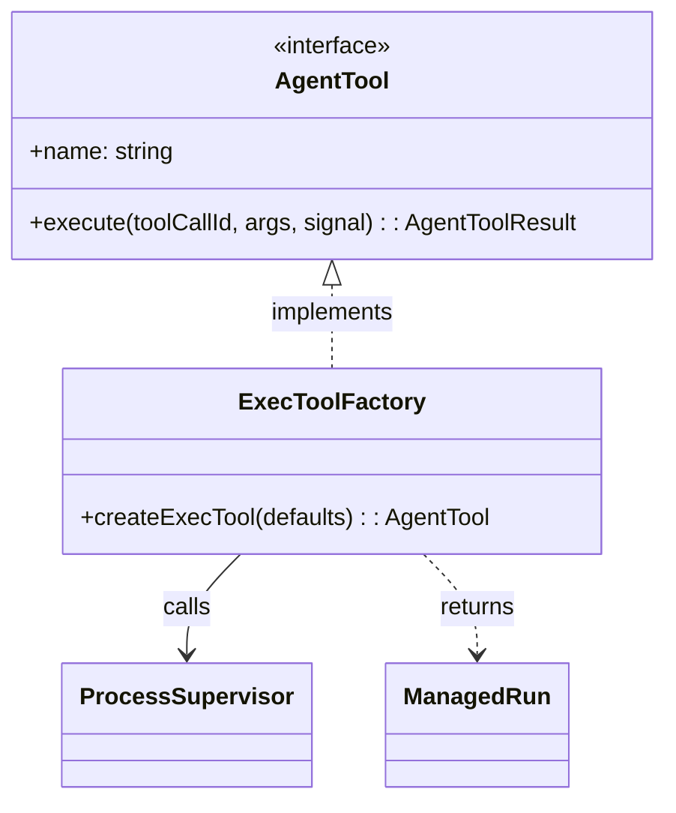

# Project Rules

## Mermaid 类图语法规范

编写 Mermaid classDiagram 时必须遵循以下规则：

### 1. 字符转义规则

**禁止使用 HTML 实体**，必须使用原始 ASCII 字符：
- 箭头用 `-->`，不用 `--&gt;`
- 依赖用 `..>`，不用 `..&gt;`
- 实现/继承用 `<|..` 或 `<|--`，不用 `&lt;|..`
- stereotype 用 `<<interface>>`，不要写成 `&lt;&lt;interface&gt;&gt;`

### 2. Stereotype 写法

Stereotype（如 `<<interface>>`）必须放在**类定义体外部、类名之后的一行**：

```mermaid
class AgentTool {
    +name: string
    +execute(): result
}
<<interface>> AgentTool
```

不要写在类体内部！不要写成：
```
class AgentTool {
    <<interface>>
    +name: string
}
```

### 3. 成员/方法简化

方法签名中避免以下会导致解析失败的内容：
- **禁止泛型语法** `Promise~ManagedRun~` → 改为 `ManagedRun`
- **禁止花括号** `{shell, args}` → 改为 `ShellConfig`
- **禁止管道符** `"on"|"off"` → 改为 `string`
- 保持简洁：`+methodName(param): ReturnType`

### 4. 关系标签

关系标签中避免使用特殊字符：
- 空格可用下划线替换：`host_gateway` 而不是 `host gateway`
- 避免 `=` 等符号在标签中出现

### 5. 文件编码

- 对含有 Mermaid 图表的 Markdown 文件，使用 `Write` 工具重写整个文件，不要使用 PowerShell 的 `Get-Content | Set-Content` 管道操作（会破坏 UTF-8 编码）
- 同样避免用 `SearchReplace` 工具批量替换 `--&gt;` → `-->` 这类 HTML 实体（工具会自动转义）

### 正确示例

