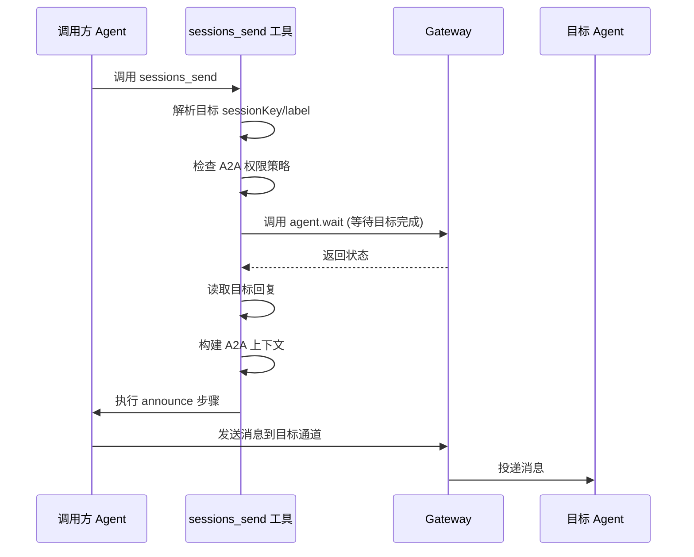
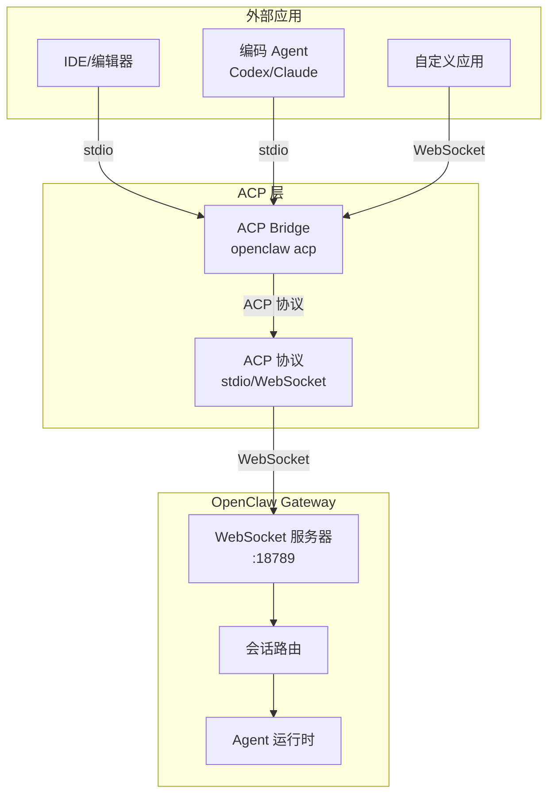
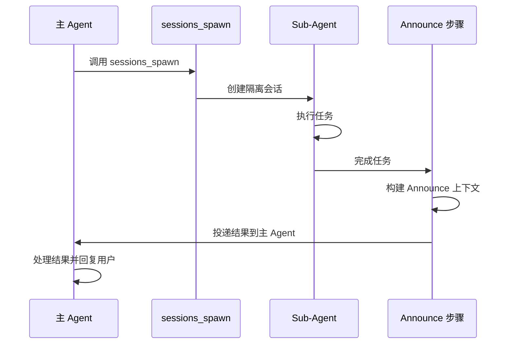

# OpenClaw A2A (Agent-to-Agent) 通信机制分析

## 问题

OpenClaw 支持通过 A2A 的方式去调用另外一个应用提供的能力么？

## 答案

**是的，OpenClaw 支持通过 A2A (Agent-to-Agent) 的方式调用另外一个应用提供的能力。**

OpenClaw 提供了**两种主要机制**来实现跨应用/跨 Agent 的能力调用：

1. **Agent-to-Agent Messaging (sessions_send)** - 内部 Agent 间通信
2. **Agent Client Protocol (ACP)** - 外部应用集成协议

---

## 一、Agent-to-Agent Messaging 机制

### 1.1 核心功能

通过 [`sessions_send`](file:///d:/prj/openclaw_analyze/src/agents/tools/sessions-send-tool.ts) 工具，一个 Agent 可以向另一个 Agent 发送消息，实现能力调用和协作。

### 1.2 配置方式

在 `openclaw.json` 中配置：

```json5
{
  tools: {
    agentToAgent: {
      // 启用 Agent 间消息传递
      enabled: true,
      
      // 允许列表，支持通配符
      allow: ["*"], // 允许所有 Agent
      // 或指定特定 Agent
      // allow: ["main", "coding", "design"]
    },
  },
}
```

### 1.3 实现流程

#### 1.3.1 消息发送流程



#### 1.3.2 关键代码

**文件：** [`sessions-send-tool.a2a.ts`](file:///d:/prj/openclaw_analyze/src/agents/tools/sessions-send-tool.a2a.ts#L17-L149)

```typescript
export async function runSessionsSendA2AFlow(params: {
  targetSessionKey: string;
  displayKey: string;
  message: string;
  announceTimeoutMs: number;
  maxPingPongTurns: number;
  requesterSessionKey?: string;
  requesterChannel?: GatewayMessageChannel;
  roundOneReply?: string;
  waitRunId?: string;
}) {
  const runContextId = params.waitRunId ?? "unknown";
  try {
    let primaryReply = params.roundOneReply;
    let latestReply = params.roundOneReply;
    
    // 1. 等待目标 Agent 完成
    if (!primaryReply && params.waitRunId) {
      const waitMs = Math.min(params.announceTimeoutMs, 60_000);
      const wait = await callGateway<{ status: string }>({
        method: "agent.wait",
        params: {
          runId: params.waitRunId,
          timeoutMs: waitMs,
        },
        timeoutMs: waitMs + 2000,
      });
      
      if (wait?.status === "ok") {
        primaryReply = await readLatestAssistantReply({
          sessionKey: params.targetSessionKey,
        });
        latestReply = primaryReply;
      }
    }
    
    // 2. 解析目标通道
    const announceTarget = await resolveAnnounceTarget({
      sessionKey: params.targetSessionKey,
      displayKey: params.displayKey,
    });
    const targetChannel = announceTarget?.channel ?? "unknown";

    // 3. 支持多轮对话 (Ping-Pong)
    if (
      params.maxPingPongTurns > 0 &&
      params.requesterSessionKey &&
      params.requesterSessionKey !== params.targetSessionKey
    ) {
      let currentSessionKey = params.requesterSessionKey;
      let nextSessionKey = params.targetSessionKey;
      let incomingMessage = latestReply;
      
      for (let turn = 1; turn <= params.maxPingPongTurns; turn += 1) {
        const replyPrompt = buildAgentToAgentReplyContext({
          requesterSessionKey: params.requesterSessionKey,
          requesterChannel: params.requesterChannel,
          targetSessionKey: params.displayKey,
          targetChannel,
          currentRole: currentRole,
          turn,
          maxTurns: params.maxPingPongTurns,
        });
        
        const replyText = await runAgentStep({
          sessionKey: currentSessionKey,
          message: incomingMessage,
          extraSystemPrompt: replyPrompt,
          timeoutMs: params.announceTimeoutMs,
          lane: AGENT_LANE_NESTED,
          sourceSessionKey: nextSessionKey,
          sourceTool: "sessions_send",
        });
        
        if (!replyText || isReplySkip(replyText)) {
          break;
        }
        
        latestReply = replyText;
        incomingMessage = replyText;
        
        // 交换角色
        const swap = currentSessionKey;
        currentSessionKey = nextSessionKey;
        nextSessionKey = swap;
      }
    }

    // 4. 执行 Announce 步骤
    const announcePrompt = buildAgentToAgentAnnounceContext({
      requesterSessionKey: params.requesterSessionKey,
      requesterChannel: params.requesterChannel,
      targetSessionKey: params.displayKey,
      targetChannel,
      originalMessage: params.message,
      roundOneReply: primaryReply,
      latestReply,
    });
    
    const announceReply = await runAgentStep({
      sessionKey: params.targetSessionKey,
      message: "Agent-to-agent announce step.",
      extraSystemPrompt: announcePrompt,
      timeoutMs: params.announceTimeoutMs,
      lane: AGENT_LANE_NESTED,
      sourceSessionKey: params.requesterSessionKey,
      sourceTool: "sessions_send",
    });
    
    // 5. 投递消息
    if (announceTarget && announceReply && !isAnnounceSkip(announceReply)) {
      await callGateway({
        method: "send",
        params: {
          to: announceTarget.to,
          message: announceReply.trim(),
          channel: announceTarget.channel,
          accountId: announceTarget.accountId,
          idempotencyKey: crypto.randomUUID(),
        },
        timeoutMs: 10_000,
      });
    }
  } catch (err) {
    log.warn("sessions_send announce flow failed", {
      runId: runContextId,
      error: formatErrorMessage(err),
    });
  }
}
```

### 1.4 使用场景

#### 场景 1：主 Agent 调用专业 Agent

```typescript
// 主 Agent 调用 coding Agent 处理代码任务
await sessions_send({
  sessionKey: "agent:coding:main",
  message: "请帮我 review 这个 PR 的代码变更",
  timeoutSeconds: 300,
});
```

#### 场景 2：多轮协作

```typescript
// 支持最多 N 轮对话
await sessions_send({
  label: "design-review",
  message: "这个 UI 设计有什么建议？",
  maxPingPongTurns: 3, // 最多 3 轮对话
});
```

### 1.5 安全控制

#### 权限检查

**文件：** [`sessions-send-tool.ts`](file:///d:/prj/openclaw_analyze/src/agents/tools/sessions-send-tool.ts#L95-L125)

```typescript
// 检查跨 Agent 消息权限
if (requesterAgentId && requestedAgentId && requestedAgentId !== requesterAgentId) {
  if (!a2aPolicy.enabled) {
    return jsonResult({
      runId: crypto.randomUUID(),
      status: "forbidden",
      error: "Agent-to-agent messaging is disabled. Set tools.agentToAgent.enabled=true.",
    });
  }
  
  if (!a2aPolicy.isAllowed(requesterAgentId, requestedAgentId)) {
    return jsonResult({
      runId: crypto.randomUUID(),
      status: "forbidden",
      error: "Agent-to-agent messaging denied by tools.agentToAgent.allow.",
    });
  }
}
```

---

## 二、Agent Client Protocol (ACP) 机制

### 2.1 什么是 ACP

**ACP (Agent Client Protocol)** 是一个标准化的协议，允许外部应用（如 IDE、编辑器）通过 ACP 与 OpenClaw Gateway 通信，调用 Agent 能力。

### 2.2 支持的客户端

- **IDE 集成**: Zed、VS Code 等
- **编码 Agent**: Codex、Claude Code、Gemini CLI
- **自定义客户端**: 任何支持 ACP 协议的应用

### 2.3 配置方式

#### 2.3.1 启用 ACP

在 `openclaw.json` 中配置：

```json5
{
  acp: {
    enabled: true,
    dispatch: {
      enabled: true, // 启用 ACP turn dispatch
    },
    stream: {
      deliveryMode: "live", // 或 "final_only"
      maxChunkChars: 1000,
    },
    runtime: {
      ttlMinutes: 30, // 运行时 TTL
    },
  },
}
```

#### 2.3.2 启动 ACP 桥接

```bash
# 本地 Gateway
openclaw acp

# 远程 Gateway
openclaw acp --url wss://gateway-host:18789 --token <token>

# 使用 token 文件（更安全）
openclaw acp --url wss://gateway-host:18789 --token-file ~/.openclaw/gateway.token

# 指定特定 Agent 会话
openclaw acp --session agent:main:main

# 通过标签附加到现有会话
openclaw acp --session-label "support inbox"
```

### 2.4 实现架构



### 2.5 ACP 会话映射

| ACP 概念 | OpenClaw 映射 |
|---------|-------------|
| ACP Session | Gateway Session Key |
| `newSession` | 创建新会话 |
| `prompt` | `chat/send` |
| `cancel` | `abort` |
| `session/set_mode` | Gateway 会话控制 |

### 2.6 使用场景

#### 场景 1：IDE 集成（Zed 示例）

**配置文件：** `~/.config/zed/settings.json`

```json
{
  "agent_servers": {
    "OpenClaw ACP": {
      "type": "custom",
      "command": "openclaw",
      "args": ["acp"],
      "env": {}
    }
  }
}
```

**指定远程 Gateway：**

```json
{
  "agent_servers": {
    "OpenClaw ACP": {
      "type": "custom",
      "command": "openclaw",
      "args": [
        "acp",
        "--url",
        "wss://gateway-host:18789",
        "--token",
        "<token>",
        "--session",
        "agent:design:main"
      ],
      "env": {}
    }
  }
}
```

#### 场景 2：Codex/Claude Code 集成

使用 `acpx` 工具：

```bash
# 一次性请求
acpx openclaw exec "Summarize the active OpenClaw session state."

# 持久会话
acpx openclaw sessions ensure --name codex-bridge
acpx openclaw -s codex-bridge --cwd /path/to/repo \
  "Ask my OpenClaw work agent for recent context."
```

**配置 `~/.acpx/config.json`：**

```json
{
  "agents": {
    "openclaw": {
      "command": "env OPENCLAW_HIDE_BANNER=1 OPENCLAW_SUPPRESS_NOTES=1 openclaw acp --url ws://127.0.0.1:18789 --token-file ~/.openclaw/gateway.token --session agent:main:main"
    }
  }
}
```

### 2.7 ACP 协议支持度

| ACP 功能 | 状态 | 说明 |
|---------|------|------|
| `initialize`, `newSession`, `prompt`, `cancel` | ✅ 已实现 | 核心桥接流程 |
| `listSessions`, slash commands | ✅ 已实现 | 会话列表和命令 |
| `loadSession` | ⚠️ 部分支持 | 重放文本历史，不重构工具历史 |
| 图片/资源嵌入 | ⚠️ 部分支持 | 扁平化为 chat input |
| Session modes | ⚠️ 部分支持 | 支持基础控制 |
| Tool streaming | ⚠️ 部分支持 | 包含原始 I/O 和文本内容 |
| 每会话 MCP 服务器 | ❌ 不支持 | 在 Gateway 层配置 MCP |
| 客户端文件系统方法 | ❌ 不支持 | 不调用 ACP 客户端文件系统 |
| 客户端终端方法 | ❌ 不支持 | 不创建 ACP 客户端终端 |

---

## 三、Sub-Agent 机制（内部 A2A）

### 3.1 什么是 Sub-Agent

Sub-Agent 是从现有 Agent 运行中派生的**隔离子 Agent 运行**，用于并行/后台任务。

### 3.2 配置方式

```json5
{
  agents: {
    defaults: {
      subagents: {
        maxSpawnDepth: 2, // 允许嵌套 Sub-Agent
        maxChildrenPerAgent: 5, // 每个 Agent 最多子 Agent 数
        maxConcurrent: 8, // 全局并发限制
        runTimeoutSeconds: 900, // 默认超时
      },
    },
  },
}
```

### 3.3 使用方式

#### 3.3.1 通过工具调用

```typescript
// 使用 sessions_spawn 工具
await callGateway({
  method: "tools.invoke",
  params: {
    tool: "sessions_spawn",
    args: {
      task: "帮我分析这个代码库的架构",
      agentId: "coding", // 指定专业 Agent
      model: "claude-sonnet-4-20250514",
      thinking: "high",
      thread: true, // 绑定到线程
      mode: "session", // 持久会话
    },
  },
});
```

#### 3.3.2 通过 Slash 命令

```bash
# 查看 Sub-Agent 状态
/subagents list

# 生成新的 Sub-Agent
/subagents spawn coding "分析这个 PR 的变更"

# 发送消息到 Sub-Agent
/subagents send 1 "请优先关注安全相关的变更"

# 终止 Sub-Agent
/subagents kill 1
```

### 3.4 Sub-Agent 通信流程



### 3.5 Announce 机制

Sub-Agent 通过 **Announce 步骤** 向主 Agent 报告结果：

**关键特性：**
- 自动投递到请求者聊天通道
- 支持多轮 Ping-Pong 对话
- 包含运行时统计信息（时间、Token、成本）
- 支持失败重试和降级投递

---

## 四、三种 A2A 机制对比

| 特性 | sessions_send | ACP | Sub-Agent |
|------|--------------|-----|-----------|
| **适用场景** | Agent 间消息传递 | 外部应用集成 | 并行/后台任务 |
| **通信方向** | 双向 | 客户端→Gateway | 单向（子→父） |
| **协议** | 内部协议 | ACP 标准协议 | 内部协议 |
| **配置复杂度** | 低 | 中 | 低 |
| **安全控制** | allowlist | token 认证 | 继承策略 |
| **支持多轮对话** | ✅ | ✅ | ⚠️ (有限) |
| **跨应用调用** | ⚠️ (同 Gateway) | ✅ | ❌ (内部) |

---

## 五、完整示例：跨应用调用能力

### 示例场景

IDE（通过 ACP）→ OpenClaw Gateway → Sub-Agent（代码分析）→ 返回结果到 IDE

### 步骤 1：启动 ACP 桥接

```bash
openclaw acp --url ws://127.0.0.1:18789 --token-file ~/.openclaw/gateway.token
```

### 步骤 2：IDE 发送请求

IDE 通过 ACP 协议发送：

```json
{
  "method": "prompt",
  "params": {
    "sessionId": "acp:12345",
    "prompt": "分析当前项目的代码质量"
  }
}
```

### 步骤 3：Gateway 创建 Sub-Agent

```typescript
// 内部自动调用
await callGateway({
  method: "tools.invoke",
  params: {
    tool: "sessions_spawn",
    args: {
      task: "分析当前项目的代码质量",
      agentId: "coding",
      thread: true,
      mode: "session",
    },
  },
});
```

### 步骤 4：Sub-Agent 执行并返回

```typescript
// Sub-Agent 完成后自动 Announce
await runSessionsSendA2AFlow({
  targetSessionKey: "acp:12345",
  message: "代码分析完成，发现 3 个潜在问题...",
  announceTimeoutMs: 60000,
});
```

### 步骤 5：ACP 桥接转发结果到 IDE

```json
{
  "method": "session/update",
  "params": {
    "sessionId": "acp:12345",
    "content": "代码分析完成，发现 3 个潜在问题..."
  }
}
```

---

## 六、安全最佳实践

### 6.1 Agent-to-Agent 安全

```json5
{
  tools: {
    agentToAgent: {
      enabled: true,
      // 明确指定允许的 Agent，避免使用 "*"
      allow: ["main", "coding", "design"],
    },
  },
  agents: {
    list: [
      {
        id: "main",
        subagents: {
          // 限制子 Agent 可以调用的 Agent
          allowAgents: ["coding"],
        },
      },
    ],
  },
}
```

### 6.2 ACP 安全

```bash
# 使用 token 文件而非命令行参数
openclaw acp --token-file ~/.openclaw/gateway.token

# 设置环境变量
export OPENCLAW_GATEWAY_TOKEN="your-token"
openclaw acp
```

### 6.3 Sub-Agent 安全

```json5
{
  agents: {
    defaults: {
      subagents: {
        // 限制嵌套深度
        maxSpawnDepth: 2,
        // 限制并发数
        maxConcurrent: 8,
        // 设置超时
        runTimeoutSeconds: 900,
      },
    },
  },
  tools: {
    subagents: {
      tools: {
        // 禁止危险工具
        deny: ["gateway", "cron"],
      },
    },
  },
}
```

---

## 七、总结

### OpenClaw A2A 能力总结

1. **✅ 支持内部 Agent 间通信**
   - 通过 `sessions_send` 工具
   - 支持多轮对话和 Announce 机制
   - 可配置权限控制

2. **✅ 支持外部应用集成**
   - 通过 ACP (Agent Client Protocol) 标准协议
   - 支持 IDE、编码 Agent 等客户端
   - 提供完整的会话管理和流式输出

3. **✅ 支持并行任务处理**
   - 通过 Sub-Agent 机制
   - 支持嵌套和并发控制
   - 自动结果聚合和投递

### 架构优势

- **隔离性**: 每个 Agent/Sub-Agent 都有独立的会话和上下文
- **灵活性**: 支持多种通信模式（同步/异步、单向/双向）
- **安全性**: 多层权限控制和策略配置
- **可扩展性**: 基于标准协议，易于集成新客户端

### 推荐使用场景

| 场景 | 推荐方案 |
|------|---------|
| 同一 Gateway 内 Agent 协作 | sessions_send |
| IDE 集成 | ACP |
| 编码 Agent 集成 | ACP + acpx |
| 后台并行任务 | Sub-Agent |
| 复杂编排任务 | Sub-Agent (maxSpawnDepth=2) |
| 自定义应用集成 | ACP 或 sessions_send |
