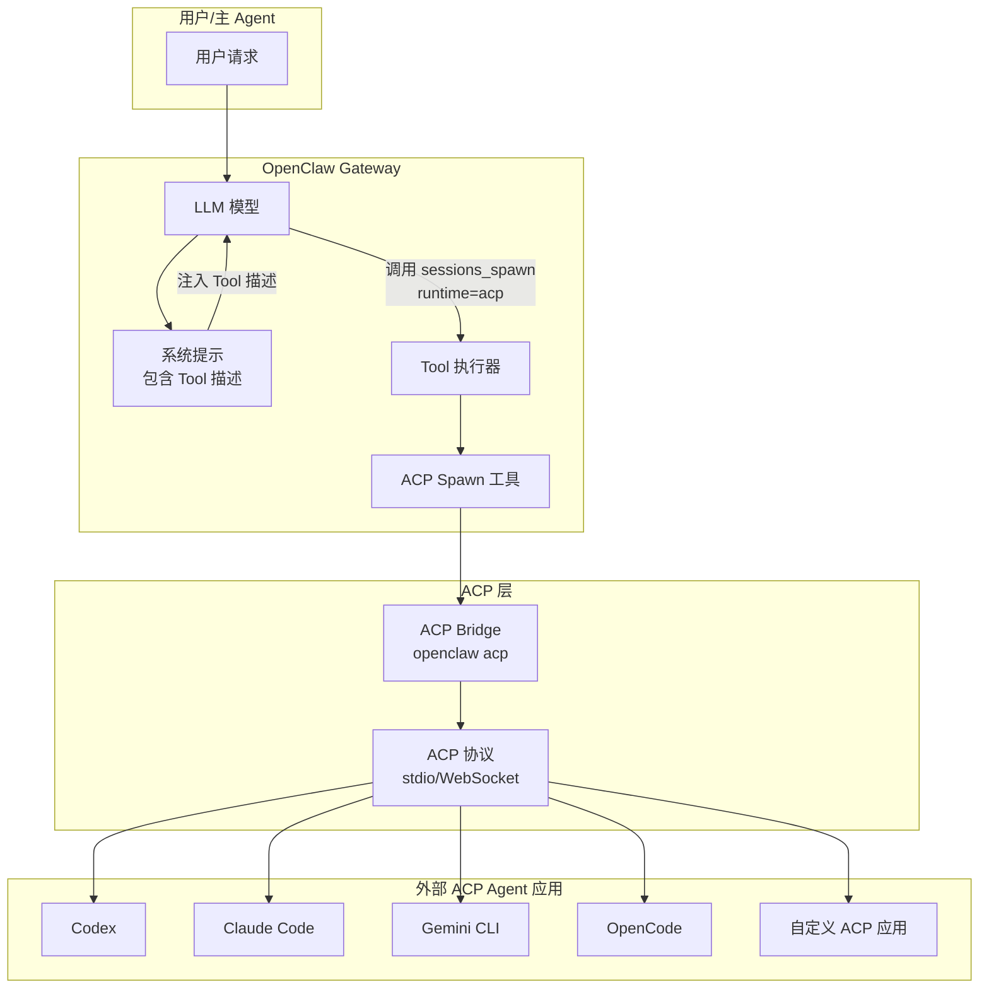
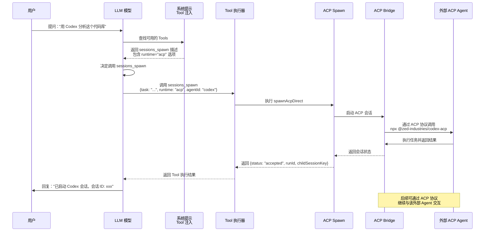

# OpenClaw 调用外部 A2A 能力实现分析

## 问题澄清

你问的是：**OpenClaw 如何调用外部应用以 A2A 方式开放的能力**，即 OpenClaw 作为**调用方（Client）**去使用外部 Agent 提供的能力。

## 核心答案

**是的，OpenClaw 支持通过 ACP (Agent Client Protocol) 调用外部 Agent 应用提供的能力。**

OpenClaw 通过 **`sessions_spawn` 工具的 `runtime: "acp"` 参数** 来调用外部 ACP Agent，并将这些外部 Agent 的能力**作为 Tool 注入给 LLM 模型**。

---

## 一、整体架构



---

## 二、模型如何知道有 A2A 能力

### 2.1 Tool 注入机制

OpenClaw 通过**系统提示词注入**的方式，将 `sessions_spawn` 工具的描述注入给 LLM 模型。

#### 关键文件

**文件：** [`src/agents/pi-embedded-runner/system-prompt.ts`](file:///d:/prj/openclaw_analyze/src/agents/pi-embedded-runner/system-prompt.ts#L1-L85)

```typescript
export function buildEmbeddedSystemPrompt(params: {
  workspaceDir: string;
  tools: AgentTool[];  // ← 所有可用的 Tools（包括 sessions_spawn）
  skillsPrompt?: string;
  // ... 其他参数
}): string {
  return buildAgentSystemPrompt({
    workspaceDir: params.workspaceDir,
    toolNames: params.tools.map((tool) => tool.name),
    toolSummaries: buildToolSummaryMap(params.tools),  // ← 构建 Tool 描述
    // ... 其他参数
  });
}
```

**文件：** [`src/agents/tool-summaries.ts`](file:///d:/prj/openclaw_analyze/src/agents/tool-summaries.ts#L1-L13)

```typescript
export function buildToolSummaryMap(tools: AgentTool[]): Record<string, string> {
  const summaries: Record<string, string> = {};
  for (const tool of tools) {
    const summary = tool.description?.trim() || tool.label?.trim();
    if (!summary) {
      continue;
    }
    summaries[tool.name.toLowerCase()] = summary;
  }
  return summaries;
}
```

### 2.2 sessions_spawn Tool 定义

**文件：** [`src/agents/tools/sessions-spawn-tool.ts`](file:///d:/prj/openclaw_analyze/src/agents/tools/sessions-spawn-tool.ts#L1-L212)

```typescript
export function createSessionsSpawnTool(...): AnyAgentTool {
  return {
    label: "Sessions",
    name: "sessions_spawn",
    description:
      'Spawn an isolated session (runtime="subagent" or runtime="acp"). ' +
      'mode="run" is one-shot and mode="session" is persistent/thread-bound. ' +
      'Subagents inherit the parent workspace directory automatically.',
    parameters: SessionsSpawnToolSchema,
    execute: async (_toolCallId, args) => {
      const params = args as Record<string, unknown>;
      const task = readStringParam(params, "task", { required: true });
      const runtime = params.runtime === "acp" ? "acp" : "subagent";
      
      // 如果 runtime="acp"，调用 ACP Spawn
      if (runtime === "acp") {
        const result = await spawnAcpDirect(
          {
            task,
            label: label || undefined,
            agentId: requestedAgentId,
            resumeSessionId,
            cwd,
            mode: mode && ACP_SPAWN_MODES.includes(mode) ? mode : undefined,
            thread,
            sandbox,
            streamTo,
          },
          { /* context */ }
        );
        return jsonResult(result);
      }
      
      // 否则调用 Sub-Agent Spawn
      const result = await spawnSubagentDirect(...);
      return jsonResult(result);
    },
  };
}
```

### 2.3 Tool Schema 定义

**文件：** [`src/agents/tools/sessions-spawn-tool.ts`](file:///d:/prj/openclaw_analyze/src/agents/tools/sessions-spawn-tool.ts#L24-L65)

```typescript
const SessionsSpawnToolSchema = Type.Object({
  task: Type.String(),  // 必填：任务描述
  label: Type.Optional(Type.String()),  // 可选：标签
  runtime: optionalStringEnum(SESSIONS_SPAWN_RUNTIMES),  // "subagent" | "acp"
  agentId: Type.Optional(Type.String()),  // 指定外部 Agent（如 codex, claude）
  resumeSessionId: Type.Optional(
    Type.String({
      description:
        'Resume an existing agent session by its ID ' +
        '(e.g. a Codex session UUID from ~/.codex/sessions/). ' +
        'Requires runtime="acp". ' +
        'The agent replays conversation history via session/load ' +
        'instead of starting fresh.',
    }),
  ),
  model: Type.Optional(Type.String()),
  thinking: Type.Optional(Type.String()),
  cwd: Type.Optional(Type.String()),
  runTimeoutSeconds: Type.Optional(Type.Number({ minimum: 0 })),
  thread: Type.Optional(Type.Boolean()),
  mode: optionalStringEnum(SUBAGENT_SPAWN_MODES),  // "run" | "session"
  cleanup: optionalStringEnum(["delete", "keep"] as const),
  sandbox: optionalStringEnum(SESSIONS_SPAWN_SANDBOX_MODES),  // "inherit" | "require"
  streamTo: optionalStringEnum(ACP_SPAWN_STREAM_TARGETS),  // "parent"
  
  // 内联附件（仅支持 subagent runtime）
  attachments: Type.Optional(
    Type.Array(
      Type.Object({
        name: Type.String(),
        content: Type.String(),
        encoding: Type.Optional(optionalStringEnum(["utf8", "base64"] as const)),
        mimeType: Type.Optional(Type.String()),
      }),
      { maxItems: 50 },
    ),
  ),
});
```

---

## 三、外部 ACP Agent 配置

### 3.1 支持的 ACP Agent

**文件：** [`extensions/acpx/src/runtime-internals/mcp-agent-command.ts`](file:///d:/prj/openclaw_analyze/extensions/acpx/src/runtime-internals/mcp-agent-command.ts#L1-L15)

```typescript
const ACPX_BUILTIN_AGENT_COMMANDS: Record<string, string> = {
  codex: "npx @zed-industries/codex-acp",
  claude: "npx -y @zed-industries/claude-agent-acp",
  gemini: "gemini",
  opencode: "npx -y opencode-ai acp",
  pi: "npx pi-acp",
};
```

### 3.2 配置方式

在 `openclaw.json` 中配置 ACP：

```json5
{
  acp: {
    enabled: true,  // 全局启用 ACP
    dispatch: {
      enabled: true,  // 启用 ACP turn dispatch
    },
    defaultAgent: "codex",  // 默认外部 Agent
    backend: "acpx",  // ACP 后端
    stream: {
      deliveryMode: "live",  // 或 "final_only"
      maxChunkChars: 1000,
    },
    runtime: {
      ttlMinutes: 30,
    },
  },
  
  // 为特定 Agent 配置 ACP 运行时
  agents: {
    list: [
      {
        id: "coding",
        runtime: {
          type: "acp",
          acp: {
            agent: "codex",  // 使用 Codex
            backend: "acpx",
            mode: "persistent",
            cwd: "/workspace/project",
          },
        },
      },
    ],
  },
}
```

---

## 四、完整调用流程

### 4.1 流程图



### 4.2 关键代码

#### 步骤 1: 模型识别 Tool

**文件：** [`src/agents/pi-embedded-runner/run/attempt.ts`](file:///d:/prj/openclaw_analyze/src/agents/pi-embedded-runner/run/attempt.ts#L2046)

```typescript
// 模型从系统提示中读取 Tool 描述
// 系统提示包含：
/*
## Tools

- sessions_spawn: Spawn an isolated session (runtime="subagent" or runtime="acp"). 
  mode="run" is one-shot and mode="session" is persistent/thread-bound.
  
  Parameters:
  - task (required): The task to perform
  - runtime (optional): "subagent" or "acp"
  - agentId (optional): Target agent id (e.g. "codex", "claude")
  - ...
*/
```

#### 步骤 2: 模型决定调用 ACP

```typescript
// 模型输出 Tool Call
{
  "tool": "sessions_spawn",
  "arguments": {
    "task": "分析这个代码库的架构",
    "runtime": "acp",
    "agentId": "codex",
    "mode": "run"
  }
}
```

#### 步骤 3: 执行 ACP Spawn

**文件：** [`src/agents/acp-spawn.ts`](file:///d:/prj/openclaw_analyze/src/agents/acp-spawn.ts#L1-L400)

```typescript
export async function spawnAcpDirect(
  params: SpawnAcpParams,
  context: SpawnAcpContext,
): Promise<SpawnAcpResult> {
  // 1. 解析目标 Agent
  const targetAgentResult = resolveTargetAcpAgentId({
    requestedAgentId: params.agentId,
    cfg: config,
  });
  
  if (!targetAgentResult.ok) {
    return {
      status: "error",
      error: targetAgentResult.error,
    };
  }
  
  // 2. 检查 ACP 策略
  const acpEnabled = isAcpEnabledByPolicy(config);
  if (!acpEnabled) {
    return {
      status: "forbidden",
      error: "ACP runtime is disabled by policy.",
    };
  }
  
  // 3. 解析 ACP 会话模式
  const acpMode = resolveAcpSessionMode(params.mode ?? "run");
  
  // 4. 启动 ACP 运行时
  const acpSessionManager = getAcpSessionManager();
  const sessionHandle = await acpSessionManager.ensureSession({
    agentId: targetAgentResult.agentId,
    mode: acpMode,
    cwd: params.cwd,
    label: params.label,
    resumeSessionId: params.resumeSessionId,
  });
  
  // 5. 执行 ACP Turn
  const turnResult = await acpSessionManager.runTurn({
    sessionId: sessionHandle.sessionId,
    prompt: params.task,
  });
  
  // 6. 返回结果
  return {
    status: "accepted",
    childSessionKey: sessionHandle.sessionKey,
    runId: turnResult.runId,
    mode: params.mode,
    streamLogPath: params.streamTo === "parent" ? resolveAcpSpawnStreamLogPath(...) : undefined,
  };
}
```

#### 步骤 4: ACP 协议通信

**文件：** [`src/acp/translator.ts`](file:///d:/prj/openclaw_analyze/src/acp/translator.ts#L1-L300)

```typescript
export class AcpTranslator {
  // 将 OpenClaw 的会话映射到 ACP 会话
  async translatePromptToAcp(params: {
    sessionId: string;
    prompt: string;
  }): Promise<PromptRequest> {
    return {
      sessionId: params.sessionId,
      prompt: {
        text: params.prompt,
        // 支持附件、图片等
      },
    };
  }
  
  // 将 ACP 响应翻译回 OpenClaw 事件
  async translateAcpResponseToEvents(
    response: PromptResponse,
  ): Promise<EventFrame[]> {
    const events: EventFrame[] = [];
    
    // 处理文本响应
    if (response.content?.text) {
      events.push({
        type: "assistant.text",
        text: response.content.text,
      });
    }
    
    // 处理 Tool 调用
    if (response.toolCalls) {
      for (const toolCall of response.toolCalls) {
        events.push({
          type: "tool.call",
          toolName: toolCall.name,
          arguments: toolCall.arguments,
        });
      }
    }
    
    return events;
  }
}
```

---

## 五、使用示例

### 示例 1: 直接调用 Codex

```typescript
// 用户请求
"用 Codex 帮我重构这个模块"

// LLM 调用 Tool
await callGateway({
  method: "tools.invoke",
  params: {
    tool: "sessions_spawn",
    args: {
      task: "重构这个模块，提高代码质量",
      runtime: "acp",
      agentId: "codex",
      mode: "run",
    },
  },
});

// 返回结果
{
  "status": "accepted",
  "runId": "abc-123-xyz",
  "childSessionKey": "agent:coding:acp:uuid-456",
  "streamLogPath": "/tmp/sessions/abc-123-xyz.acp-stream.jsonl"
}
```

### 示例 2: 恢复已有会话

```typescript
// 继续之前的 Codex 会话
await callGateway({
  method: "tools.invoke",
  params: {
    tool: "sessions_spawn",
    args: {
      task: "继续修复剩余的测试失败",
      runtime: "acp",
      agentId: "codex",
      resumeSessionId: "previous-codex-session-uuid",
    },
  },
});
```

### 示例 3: 持久会话 + 线程绑定

```typescript
// 创建持久 ACP 会话并绑定到线程
await callGateway({
  method: "tools.invoke",
  params: {
    tool: "sessions_spawn",
    args: {
      task: "在这个项目中实现用户认证功能",
      runtime: "acp",
      agentId: "claude",
      thread: true,  // 绑定到当前线程
      mode: "session",  // 持久会话
      cwd: "/workspace/auth-project",
    },
  },
});
```

### 示例 4: 流式输出到父会话

```typescript
// 实时查看 ACP 执行进度
await callGateway({
  method: "tools.invoke",
  params: {
    tool: "sessions_spawn",
    args: {
      task: "运行所有测试并修复失败项",
      runtime: "acp",
      agentId: "codex",
      streamTo: "parent",  // 流式输出进度到父会话
    },
  },
});
```

---

## 六、自定义 ACP Agent

### 6.1 注册自定义 ACP Agent

**文件：** [`extensions/acpx/src/config.ts`](file:///d:/prj/openclaw_analyze/extensions/acpx/src/config.ts)

```typescript
// 在 openclaw.plugin.json 中配置
{
  "id": "acpx",
  "configSchema": {
    "properties": {
      "agents": {
        "type": "object",
        "additionalProperties": {
          "type": "object",
          "properties": {
            "command": {
              "type": "string",
              "description": "Command to run the ACP agent"
            }
          },
          "required": ["command"]
        }
      }
    }
  }
}
```

### 6.2 配置示例

```json5
{
  extensions: {
    acpx: {
      agents: {
        // 自定义 Agent
        myCustomAgent: {
          command: "node /path/to/my-custom-acp-agent.js",
        },
        // 覆盖内置 Agent
        codex: {
          command: "npx @zed-industries/codex-acp@latest",
        },
      },
    },
  },
}
```

### 6.3 调用自定义 Agent

```typescript
await callGateway({
  method: "tools.invoke",
  params: {
    tool: "sessions_spawn",
    args: {
      task: "执行自定义任务",
      runtime: "acp",
      agentId: "myCustomAgent",  // 使用自定义 Agent
    },
  },
});
```

---

## 七、MCP 服务器集成

### 7.1 配置 MCP 服务器

**文件：** [`extensions/acpx/openclaw.plugin.json`](file:///d:/prj/openclaw_analyze/extensions/acpx/openclaw.plugin.json#L39-L59)

```json5
{
  extensions: {
    acpx: {
      mcpServers: {
        // 文件系统 MCP 服务器
        filesystem: {
          command: "npx",
          args: ["-y", "@modelcontextprotocol/server-filesystem", "/workspace"],
          env: {
            NODE_ENV: "production",
          },
        },
        // 数据库 MCP 服务器
        postgres: {
          command: "npx",
          args: ["-y", "@modelcontextprotocol/server-postgres"],
          env: {
            DATABASE_URL: "postgresql://localhost:5432/mydb",
          },
        },
      },
    },
  },
}
```

### 7.2 MCP 代理模式

**文件：** [`extensions/acpx/src/runtime-internals/mcp-proxy.mjs`](file:///d:/prj/openclaw_analyze/extensions/acpx/src/runtime-internals/mcp-proxy.mjs)

```javascript
// MCP 代理将 MCP 服务器能力暴露给 ACP Agent
const proxy = {
  targetCommand: "npx @zed-industries/codex-acp",
  mcpServers: [
    {
      name: "filesystem",
      command: "npx",
      args: ["-y", "@modelcontextprotocol/server-filesystem", "/workspace"],
      env: [{ name: "NODE_ENV", value: "production" }],
    },
  ],
};
```

---

## 八、安全控制

### 8.1 ACP 权限策略

```json5
{
  acp: {
    enabled: true,
    // 允许的 Agent 列表
    allowedAgents: ["codex", "claude", "gemini"],
    // 最大并发会话数
    maxConcurrentSessions: 5,
  },
  
  agents: {
    list: [
      {
        id: "main",
        subagents: {
          // 限制可以调用的外部 Agent
          allowAgents: ["codex", "claude"],
        },
      },
    ],
  },
}
```

### 8.2 沙箱控制

```typescript
// 沙箱继承策略
await callGateway({
  method: "tools.invoke",
  params: {
    tool: "sessions_spawn",
    args: {
      task: "执行任务",
      runtime: "acp",
      sandbox: "inherit",  // 继承父会话沙箱设置
      // 或 "require" - 要求必须在沙箱中运行
    },
  },
});
```

### 8.3 超时控制

```json5
{
  agents: {
    defaults: {
      subagents: {
        runTimeoutSeconds: 900,  // 15 分钟超时
      },
    },
  },
  acp: {
    runtime: {
      ttlMinutes: 30,  // ACP 会话 30 分钟 TTL
    },
  },
}
```

---

## 九、关键数据模型

### 9.1 ACP 会话结构

```typescript
interface AcpSession {
  sessionId: string;  // ACP 会话 ID
  sessionKey: string;  // OpenClaw 会话键
  agentId: string;  // 目标 Agent ID
  mode: "oneshot" | "persistent";  // 会话模式
  cwd?: string;  // 工作目录
  label?: string;  // 会话标签
  createdAt: number;  // 创建时间
  lastActivityAt: number;  // 最后活动时间
}
```

### 9.2 Spawn 结果

```typescript
interface SpawnAcpResult {
  status: "accepted" | "forbidden" | "error";
  childSessionKey?: string;  // 子会话键
  runId?: string;  // 运行 ID
  mode?: "run" | "session";
  streamLogPath?: string;  // 流式日志路径
  note?: string;
  error?: string;
}
```

### 9.3 ACP 协议消息

```typescript
// ACP Prompt 请求
interface PromptRequest {
  sessionId: string;
  prompt: {
    text?: string;
    resource?: { uri: string };
    image?: { data: string; mimeType: string };
  };
}

// ACP Prompt 响应
interface PromptResponse {
  content?: {
    text?: string;
    resource?: { uri: string; text: string };
  };
  toolCalls?: Array<{
    name: string;
    arguments: Record<string, unknown>;
  }>;
  stopReason?: "end_turn" | "tool_use" | "error";
}
```

---

## 十、总结

### 实现流程总结

1. **Tool 注入**: OpenClaw 将 `sessions_spawn` 工具描述注入到系统提示词
2. **模型识别**: LLM 模型读取系统提示，识别到 `sessions_spawn` 工具及其 `runtime: "acp"` 参数
3. **模型调用**: 模型决定调用外部 Agent 时，输出 Tool Call：`sessions_spawn({ runtime: "acp", agentId: "codex", ... })`
4. **Tool 执行**: OpenClaw 执行 `sessions_spawn` 工具，检测到 `runtime: "acp"`
5. **ACP Spawn**: 调用 `spawnAcpDirect` 函数，创建 ACP 会话
6. **ACP 通信**: 通过 ACP 协议（stdio/WebSocket）与外部 Agent 通信
7. **结果返回**: 外部 Agent 执行完成后，通过 ACP 协议返回结果
8. **结果聚合**: OpenClaw 将结果返回给模型，模型生成最终回复

### 支持的 ACP Agent

- ✅ **Codex** (`npx @zed-industries/codex-acp`)
- ✅ **Claude Code** (`npx -y @zed-industries/claude-agent-acp`)
- ✅ **Gemini CLI** (`gemini`)
- ✅ **OpenCode** (`npx -y opencode-ai acp`)
- ✅ **Pi** (`npx pi-acp`)
- ✅ **自定义 ACP Agent** (通过配置 `command`)

### 核心优势

1. **标准化协议**: 基于 ACP (Agent Client Protocol) 标准协议
2. **灵活配置**: 支持多种外部 Agent 和自定义 Agent
3. **会话管理**: 支持一次性会话和持久会话
4. **线程绑定**: 支持将 ACP 会话绑定到聊天线程
5. **流式输出**: 支持实时流式输出执行进度
6. **安全控制**: 多层权限控制和沙箱隔离
7. **MCP 集成**: 支持 MCP 服务器扩展能力

### 架构图

```
┌─────────────────────────────────────────────────────────┐
│                    OpenClaw Gateway                      │
│  ┌──────────────┐  ┌──────────────┐  ┌──────────────┐   │
│  │  LLM Model   │  │ System Prompt│  │ Tool Executor│   │
│  │              │  │ + Tool Inject│  │              │   │
│  └──────┬───────┘  └──────┬───────┘  └──────┬───────┘   │
│         │                 │                 │            │
│         └─────────────────┴─────────────────┘            │
│                           │                              │
│                  sessions_spawn                          │
│                  runtime="acp"                           │
│                           │                              │
└───────────────────────────┼──────────────────────────────┘
                            │
                    ┌───────▼────────┐
                    │  ACP Bridge    │
                    │  (openclaw acp)│
                    └───────┬────────┘
                            │
                    ┌───────▼────────┐
                    │  ACP Protocol  │
                    │  (stdio/WS)    │
                    └───────┬────────┘
                            │
        ┌───────────────────┼───────────────────┐
        │                   │                   │
┌───────▼───────┐  ┌───────▼───────┐  ┌───────▼───────┐
│    Codex      │  │  Claude Code  │  │  Custom ACP   │
│   (npx)       │  │    (npx)      │  │    Agent      │
└───────────────┘  └───────────────┘  └───────────────┘
```
