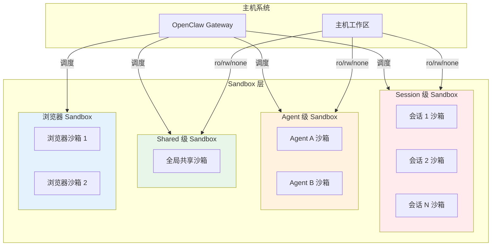

# OpenClaw Sandbox 实现分析

## 概述

OpenClaw 提供了完善的 Sandbox (沙箱) 机制，用于隔离不可信代码执行、保护主机系统安全，同时支持灵活的配置和多种应用场景。

## 一、支持的 Sandbox 类型

### 1.1 通用代码执行 Sandbox

#### 用途
用于隔离执行任意代码、命令和工具调用，是最常用的 Sandbox 类型。

#### 技术实现
- 基于 Docker 容器实现
- 支持高度自定义的安全配置
- 提供细粒度的权限控制

#### 默认安全配置
```typescript
// 文件：src/agents/sandbox/config.ts:94-119
export function resolveSandboxDockerConfig(...): SandboxDockerConfig {
  return {
    image: DEFAULT_SANDBOX_IMAGE, // openclaw-sandbox:bookworm-slim
    workdir: "/workspace",
    readOnlyRoot: true, // 根文件系统只读
    tmpfs: ["/tmp", "/var/tmp", "/run"], // 临时文件系统
    network: "none", // 默认可无网络访问
    capDrop: ["ALL"], // 删除所有 Linux 能力
    pidsLimit: 512, // 限制进程数
    memory: "512m", // 限制内存
    cpus: 1.0, // 限制 CPU 使用率
    seccompProfile: "default", // Seccomp 安全配置
    apparmorProfile: "docker-default", // AppArmor 配置
  };
}
```

---

### 1.2 浏览器 Sandbox

#### 用途
用于隔离浏览器自动化、网页访问、截图等操作，防止恶意网页攻击主机。

#### 技术实现
- 基于 Docker 容器运行 Chrome/Chromium
- 支持 CDP (Chrome DevTools Protocol) 远程控制
- 支持 VNC/NoVNC 图形界面访问
- 独立网络隔离

#### 默认配置
```typescript
// 文件：src/agents/sandbox/config.ts:132-154
export function resolveSandboxBrowserConfig(...): SandboxBrowserConfig {
  return {
    enabled: false, // 默认关闭
    image: DEFAULT_SANDBOX_BROWSER_IMAGE, // openclaw-sandbox-browser:bookworm-slim
    network: "openclaw-sandbox-browser", // 独立网络
    cdpPort: 9222, // CDP 端口
    vncPort: 5900, // VNC 端口
    noVncPort: 6080, // NoVNC Web 端口
    headless: false, // 无头模式
    enableNoVnc: true, // 启用 Web 访问
    autoStart: true, // 需要时自动启动
  };
}
```

---

## 二、Sandbox 作用域 (Scope)

### 2.1 session 级 Sandbox

```typescript
type SandboxScope = "session" | "agent" | "shared";
```

#### 特点
- **隔离级别最高**：每个会话拥有独立的 Sandbox 容器
- 会话结束后自动销毁
- 数据完全隔离

#### 应用场景
- 执行不可信代码
- 处理敏感数据
- 多用户场景下的严格隔离
- 一次性任务执行

#### 配置
```json5
{
  agents: {
    defaults: {
      sandbox: {
        scope: "session",  // 每个会话独立
        perSession: true,
      },
    },
  },
}
```

---

### 2.2 agent 级 Sandbox

#### 特点
- 同一个 Agent 的所有会话共享一个 Sandbox
- Agent 重启后销毁
- 同一 Agent 内可以共享数据

#### 应用场景
- 单个 Agent 的长期运行任务
- 需要持久化工作环境的场景
- 同一个 Agent 内的多会话协作

#### 配置
```json5
{
  agents: {
    list: [
      {
        id: "coding",
        sandbox: {
          scope: "agent",  // 这个 Agent 的所有会话共享
        },
      },
    ],
  },
}
```

---

### 2.3 shared 级 Sandbox

#### 特点
- **隔离级别最低**：所有 Agent 共享同一个 Sandbox
- Gateway 重启后销毁
- 全局共享工作环境

#### 应用场景
- 开发/测试环境
- 信任度高的场景
- 需要全局共享资源的场景

#### 配置
```json5
{
  agents: {
    defaults: {
      sandbox: {
        scope: "shared",  // 全局共享
      },
    },
  },
}
```

---

## 三、Sandbox 运行模式

```typescript
type SandboxMode = "off" | "non-main" | "all";
```

### 3.1 off (关闭模式)

#### 特点
- 完全禁用 Sandbox
- 所有代码直接在主机上执行
- 性能最高，但安全性最低

#### 应用场景
- 完全信任的环境
- 本地开发调试
- 性能要求极高且无安全风险的场景

#### 配置
```json5
{
  agents: {
    defaults: {
      sandbox: {
        mode: "off",
      },
    },
  },
}
```

---

### 3.2 non-main (非主 Agent 模式)

#### 特点
- 主 Agent (`main`) 直接在主机执行
- 所有 Sub-Agent/子 Agent 在 Sandbox 中执行
- 平衡安全性和性能

#### 应用场景
- 主 Agent 需要直接访问主机资源
- 子 Agent 执行不可信代码
- 大部分场景的推荐配置

#### 配置
```json5
{
  agents: {
    defaults: {
      sandbox: {
        mode: "non-main",  // 默认推荐配置
      },
    },
  },
}
```

---

### 3.3 all (全沙箱模式)

#### 特点
- **最高安全性**：所有 Agent（包括主 Agent）都在 Sandbox 中执行
- 完全隔离，主机系统不受任何影响
- 性能开销最大

#### 应用场景
- 公网部署
- 多租户场景
- 高安全要求的生产环境

#### 配置
```json5
{
  agents: {
    defaults: {
      sandbox: {
        mode: "all",  // 最高安全级别
      },
    },
  },
}
```

---

## 四、工作区访问权限

```typescript
type SandboxWorkspaceAccess = "none" | "ro" | "rw";
```

### 4.1 none (无访问权限)

#### 特点
- Sandbox 完全无法访问主机工作区
- 完全隔离，安全性最高

#### 应用场景
- 执行完全不可信的代码
- 不需要访问本地文件的场景
- 最高安全要求

### 4.2 ro (只读访问)

#### 特点
- Sandbox 可以读取主机工作区文件
- 无法修改或写入文件
- 平衡安全性和实用性

#### 应用场景
- 代码分析、审计场景
- 文档阅读、搜索场景
- 不需要写入权限的任务

### 4.3 rw (读写访问)

#### 特点
- Sandbox 可以读写主机工作区文件
- 灵活性最高，但安全性最低

#### 应用场景
- 代码开发、修改场景
- 需要持久化文件的任务
- 信任度高的环境

#### 配置示例
```json5
{
  agents: {
    defaults: {
      sandbox: {
        workspaceAccess: "ro",  // 默认只读
      },
    },
    list: [
      {
        id: "coding",
        sandbox: {
          workspaceAccess: "rw",  // 开发 Agent 允许读写
        },
      },
    ],
  },
}
```

---

## 五、应用场景详解

### 5.1 开发环境场景

#### 推荐配置
```json5
{
  agents: {
    defaults: {
      sandbox: {
        mode: "non-main",
        scope: "session",
        workspaceAccess: "rw",
      },
    },
  },
}
```

#### 说明
- 主 Agent 直接访问主机，方便操作
- 子 Agent 每个会话独立沙箱，安全隔离
- 允许读写工作区，支持代码修改

---

### 5.2 生产部署场景

#### 推荐配置
```json5
{
  agents: {
    defaults: {
      sandbox: {
        mode: "all",
        scope: "session",
        workspaceAccess: "none",
        docker: {
          readOnlyRoot: true,
          network: "none",
          memory: "256m",
          cpus: 0.5,
        },
      },
    },
  },
}
```

#### 说明
- 所有 Agent 都在沙箱中运行
- 每个会话独立沙箱，完全隔离
- 无工作区访问，无网络访问
- 严格的资源限制

---

### 5.3 多用户/多租户场景

#### 推荐配置
```json5
{
  agents: {
    defaults: {
      sandbox: {
        mode: "all",
        scope: "session",
        workspaceAccess: "none",
        docker: {
          readOnlyRoot: true,
          network: "none",
          memory: "128m",
          cpus: 0.25,
        },
      },
    },
    list: [
      {
        id: "user-123",
        sandbox: {
          scope: "agent",  // 同一个用户的会话共享沙箱
          workspaceAccess: "rw",
        },
      },
    ],
  },
}
```

#### 说明
- 严格的全沙箱模式
- 每个用户独立 Agent，独立沙箱
- 资源限制防止滥用

---

### 5.4 浏览器自动化场景

#### 推荐配置
```json5
{
  agents: {
    list: [
      {
        id: "browser",
        sandbox: {
          mode: "all",
          scope: "session",
          browser: {
            enabled: true,
            headless: true,
            enableNoVnc: false,
          },
          docker: {
            network: "openclaw-sandbox-browser",
            memory: "1g",
          },
        },
      },
    ],
  },
}
```

#### 说明
- 独立浏览器沙箱
- 无头模式运行，资源可控
- 独立网络隔离
- 适合网页爬取、自动化测试等场景

---

### 5.5 数据处理场景

#### 推荐配置
```json5
{
  agents: {
    list: [
      {
        id: "data-processor",
        sandbox: {
          mode: "all",
          scope: "agent",  // 长期运行，共享环境
          workspaceAccess: "ro",  // 只读访问数据目录
          docker: {
            binds: ["/data:/data:ro"],  // 挂载数据目录
            memory: "4g",  // 大内存配置
            cpus: 4.0,  // 多 CPU
            network: "none",  // 无网络
          },
        },
      },
    ],
  },
}
```

#### 说明
- 独立数据处理沙箱
- 只读挂载数据目录，防止误修改
- 大资源配置满足计算需求
- 无网络访问，防止数据泄露

---

## 六、安全配置最佳实践

### 6.1 最小权限原则
```json5
{
  sandbox: {
    mode: "non-main",
    scope: "session",
    workspaceAccess: "none",
    docker: {
      readOnlyRoot: true,
      capDrop: ["ALL"],
      network: "none",
      pidsLimit: 256,
      memory: "256m",
      cpus: 0.5,
    },
  },
}
```

### 6.2 工具权限控制
```typescript
// 默认允许的工具 (src/agents/sandbox/constants.ts:13-28)
const DEFAULT_TOOL_ALLOW = [
  "exec", "process", "read", "write", "edit", "apply_patch",
  "image", "sessions_list", "sessions_history", "sessions_send",
  "sessions_spawn", "subagents", "session_status",
];

// 默认禁止的工具
const DEFAULT_TOOL_DENY = [
  "browser", "canvas", "nodes", "cron", "gateway",
  ...CHANNEL_IDS, // 所有渠道工具
];
```

### 6.3 自定义工具权限
```json5
{
  agents: {
    list: [
      {
        id: "restricted-agent",
        sandbox: {
          tools: {
            allow: ["read", "exec"],  // 仅允许读和执行
            deny: ["write", "edit"],  // 禁止修改
          },
        },
      },
    ],
  },
}
```

---

## 七、自动清理配置

```json5
{
  sandbox: {
    prune: {
      idleHours: 24,  // 闲置 24 小时自动清理
      maxAgeDays: 7,  // 最长存活 7 天
    },
  },
}
```

### 清理策略
- **闲置清理**：沙箱超过 `idleHours` 无活动自动销毁
- **最大存活**：沙箱创建后超过 `maxAgeDays` 自动销毁
- **会话结束清理**：`session` 级沙箱会话结束后立即销毁

---

## 八、架构图



---

## 九、总结

### Sandbox 类型对比

| 类型 | 隔离级别 | 性能开销 | 适用场景 |
|------|---------|---------|---------|
| **通用 Sandbox** | 高 | 中 | 代码执行、命令运行、工具调用 |
| **浏览器 Sandbox** | 最高 | 高 | 网页访问、自动化测试、截图 |

### 作用域对比

| 作用域 | 隔离级别 | 资源开销 | 适用场景 |
|-------|---------|---------|---------|
| **session** | 最高 | 最高 | 不可信代码、多用户场景 |
| **agent** | 中 | 中 | 单个 Agent 长期任务 |
| **shared** | 最低 | 最低 | 开发测试、信任环境 |

### 运行模式对比

| 模式 | 安全性 | 性能 | 适用场景 |
|------|-------|------|---------|
| **off** | 最低 | 最高 | 本地开发、完全信任环境 |
| **non-main** | 中 | 中 | 大部分场景，推荐配置 |
| **all** | 最高 | 最低 | 生产部署、公网服务、多租户 |

### 访问权限对比

| 权限 | 安全性 | 灵活性 | 适用场景 |
|------|-------|--------|---------|
| **none** | 最高 | 最低 | 最高安全要求，无需文件访问 |
| **ro** | 中 | 中 | 代码分析、文档阅读 |
| **rw** | 最低 | 最高 | 代码开发、需要写入的场景 |

### 最佳配置推荐

| 场景 | 模式 | 作用域 | 工作区访问 |
|------|------|-------|-----------|
| 本地开发 | non-main | session | rw |
| 生产部署 | all | session | none |
| 多用户 | all | agent/ session | none/ro |
| 浏览器自动化 | all | session | none |
| 数据处理 | all | agent | ro |
