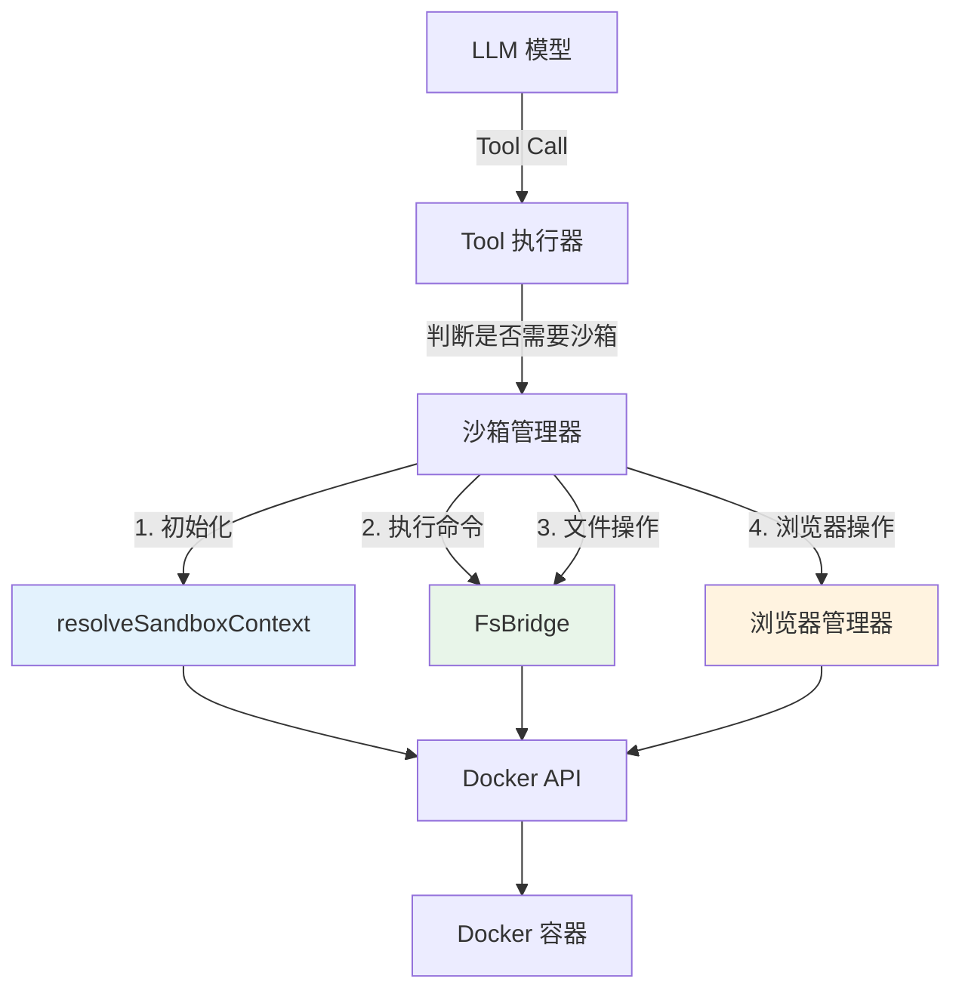
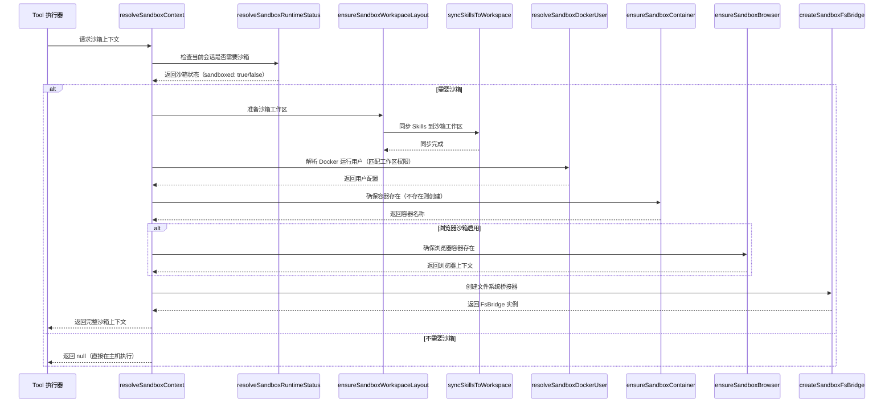
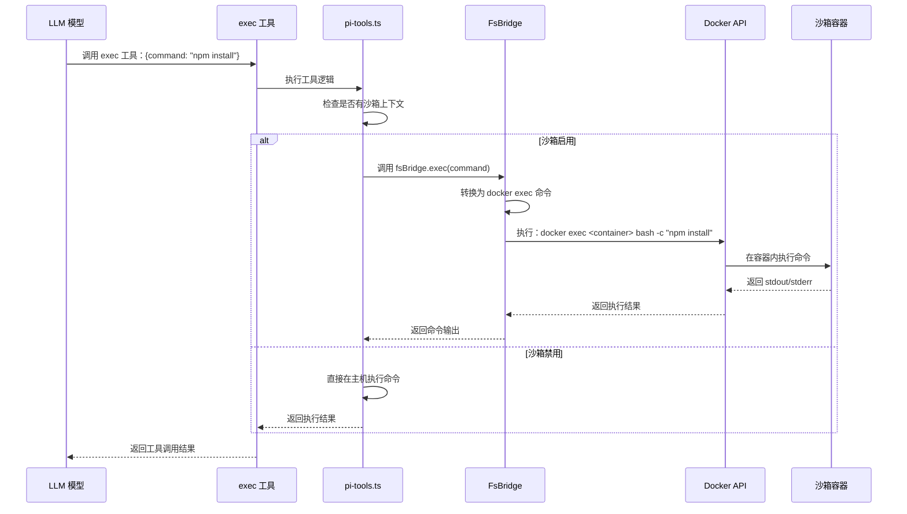
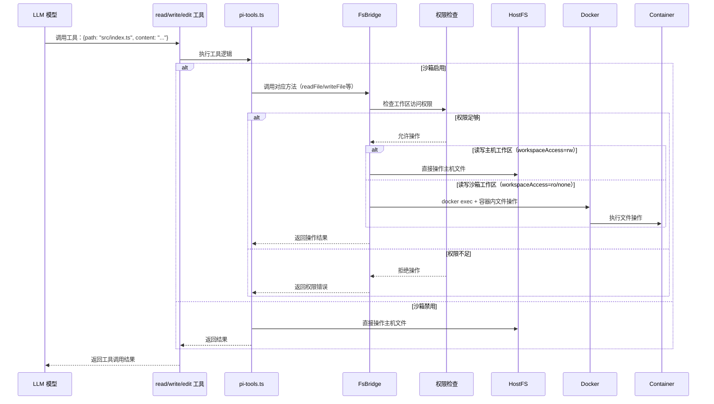
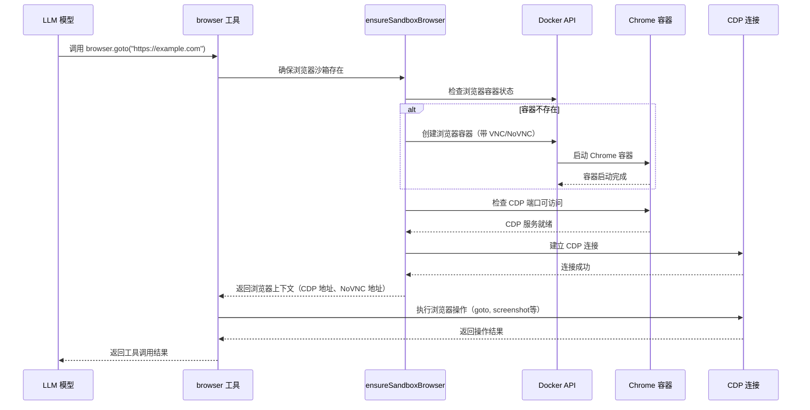
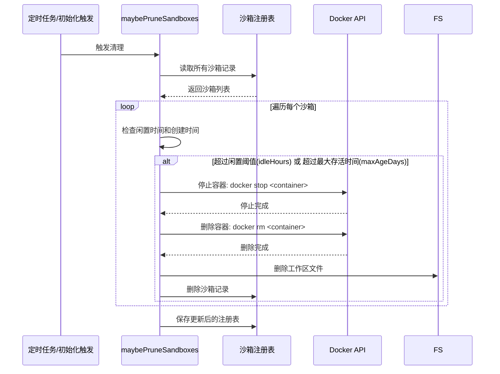

# 沙箱运行关键场景与流程分析

## 核心架构总览



***

## 关键场景 1：沙箱初始化创建流程

### 流程图



### 关键文件

| 文件             | 说明          | 跳转链接                                                                                               |
| -------------- | ----------- | -------------------------------------------------------------------------------------------------- |
| `context.ts`   | 沙箱上下文解析核心入口 | [src/agents/sandbox/context.ts](file:///d:/prj/openclaw_analyze/src/agents/sandbox/context.ts)     |
| `config.ts`    | 沙箱配置解析      | [src/agents/sandbox/config.ts](file:///d:/prj/openclaw_analyze/src/agents/sandbox/config.ts)       |
| `docker.ts`    | Docker 容器管理 | [src/agents/sandbox/docker.ts](file:///d:/prj/openclaw_analyze/src/agents/sandbox/docker.ts)       |
| `workspace.ts` | 工作区管理       | [src/agents/sandbox/workspace.ts](file:///d:/prj/openclaw_analyze/src/agents/sandbox/workspace.ts) |
| `fs-bridge.ts` | 文件系统桥接      | [src/agents/sandbox/fs-bridge.ts](file:///d:/prj/openclaw_analyze/src/agents/sandbox/fs-bridge.ts) |

### 关键代码段

#### 1. 沙箱上下文解析入口

**文件：** [`context.ts#L108-L186`](file:///d:/prj/openclaw_analyze/src/agents/sandbox/context.ts#L108-L186)

```typescript
export async function resolveSandboxContext(params: {
  config?: OpenClawConfig;
  sessionKey?: string;
  workspaceDir?: string;
}): Promise<SandboxContext | null> {
  const resolved = resolveSandboxSession(params);
  if (!resolved) return null;
  const { rawSessionKey, cfg } = resolved;

  // 1. 清理过期沙箱
  await maybePruneSandboxes(cfg);

  // 2. 准备工作区布局
  const { agentWorkspaceDir, scopeKey, workspaceDir } = await ensureSandboxWorkspaceLayout({
    cfg, rawSessionKey, config: params.config, workspaceDir: params.workspaceDir,
  });

  // 3. 解析 Docker 用户
  const docker = await resolveSandboxDockerUser({
    docker: cfg.docker, workspaceDir,
  });
  const resolvedCfg = docker === cfg.docker ? cfg : { ...cfg, docker };

  // 4. 确保容器存在
  const containerName = await ensureSandboxContainer({
    sessionKey: rawSessionKey, workspaceDir, agentWorkspaceDir, cfg: resolvedCfg,
  });

  // 5. 确保浏览器容器（如果启用）
  const browser = cfg.browser.enabled ? await ensureSandboxBrowser({
    scopeKey, workspaceDir, agentWorkspaceDir, cfg: resolvedCfg,
  }) : undefined;

  // 6. 创建沙箱上下文
  const sandboxContext: SandboxContext = {
    enabled: true, sessionKey: rawSessionKey, workspaceDir, agentWorkspaceDir,
    workspaceAccess: resolvedCfg.workspaceAccess, containerName,
    containerWorkdir: resolvedCfg.docker.workdir, docker: resolvedCfg.docker,
    tools: resolvedCfg.tools, browserAllowHostControl: resolvedCfg.browser.allowHostControl,
    browser,
  };

  // 7. 创建文件系统桥接器
  sandboxContext.fsBridge = createSandboxFsBridge({ sandbox: sandboxContext });

  return sandboxContext;
}
```

#### 2. 容器创建逻辑

**文件：** [`docker.ts#L220-L350`](file:///d:/prj/openclaw_analyze/src/agents/sandbox/docker.ts#L220-L350)

```typescript
export async function ensureSandboxContainer(params: {
  sessionKey: string;
  workspaceDir: string;
  agentWorkspaceDir: string;
  cfg: SandboxConfig;
}): Promise<string> {
  const { sessionKey, workspaceDir, agentWorkspaceDir, cfg } = params;
  const scopeKey = resolveSandboxScopeKey(cfg.scope, sessionKey);
  const containerName = `${cfg.docker.containerPrefix}${scopeKey}`;

  // 检查容器是否存在且运行
  const existing = await getRunningContainer(containerName);
  if (existing) {
    // 检查配置是否变更，变更则重建
    const configHash = await readDockerContainerLabel(containerName, "openclaw.config_hash");
    const expectedHash = computeSandboxConfigHash(cfg);
    if (configHash === expectedHash) {
      return containerName;
    }
    // 配置变更，停止旧容器
    await execDocker(["stop", "-t", "2", containerName], { allowFailure: true });
    await execDocker(["rm", "-f", containerName], { allowFailure: true });
  }

  // 构建容器创建参数
  const createArgs = await buildSandboxCreateArgs({
    cfg, scopeKey, workspaceDir, agentWorkspaceDir,
  });

  // 创建容器
  await execDocker(["create", ...createArgs, cfg.docker.image]);

  // 启动容器
  await execDocker(["start", containerName]);

  // 运行 setupCommand（如果有）
  if (cfg.docker.setupCommand?.trim()) {
    await execDocker([
      "exec", "-w", cfg.docker.workdir, containerName,
      "bash", "-c", cfg.docker.setupCommand,
    ]);
  }

  // 更新注册表
  await updateRegistry((reg) => {
    reg.containers[containerName] = {
      createdAt: Date.now(), lastActivityAt: Date.now(),
      scope: cfg.scope, sessionKey,
    };
  });

  return containerName;
}
```

***

## 关键场景 2：命令执行流程

### 流程图



### 关键文件

| 文件             | 说明          | 跳转链接                                                                                               |
| -------------- | ----------- | -------------------------------------------------------------------------------------------------- |
| `pi-tools.ts`  | 工具执行逻辑      | [src/agents/pi-tools.ts](file:///d:/prj/openclaw_analyze/src/agents/pi-tools.ts)                   |
| `fs-bridge.ts` | 命令执行桥接      | [src/agents/sandbox/fs-bridge.ts](file:///d:/prj/openclaw_analyze/src/agents/sandbox/fs-bridge.ts) |
| `docker.ts`    | Docker 执行封装 | [src/agents/sandbox/docker.ts](file:///d:/prj/openclaw_analyze/src/agents/sandbox/docker.ts)       |

### 关键代码段

#### 1. 工具执行沙箱判断

**文件：** [`pi-tools.ts#L340-L360`](file:///d:/prj/openclaw_analyze/src/agents/pi-tools.ts#L340-L360)

```typescript
// 解析沙箱上下文
const sandbox = await resolveSandboxContext({
  config: params.config,
  sessionKey: params.sessionKey,
  workspaceDir: params.workspaceDir,
});  

// 如果有沙箱，使用沙桥执行命令
const sandboxFsBridge = sandbox?.fsBridge;
const execImpl = sandboxFsBridge ? sandboxFsBridge.exec : defaultExecImpl;

// 执行命令
const result = await execImpl(command, {
  cwd: params.cwd,
  timeout: timeoutMs,
  env: envVars,
});
```

#### 2. FsBridge exec 实现

**文件：** [`fs-bridge.ts#L150-L220`](file:///d:/prj/openclaw_analyze/src/agents/sandbox/fs-bridge.ts#L150-L220)

```typescript
async function exec(command: string, opts?: ExecOptions): Promise<ExecResult> {
  const { sandbox } = params;
  const execArgs = [
    "exec",
    "-i",
    "--user", sandbox.docker.user ?? "root",
    "-w", opts?.cwd ?? sandbox.containerWorkdir,
    ...(opts?.env ? Object.entries(opts.env).flatMap(([k, v]) => ["-e", `${k}=${v}`]) : []),
    sandbox.containerName,
    "bash", "-c", command,
  ];

  const result = await execDocker(execArgs, {
    input: opts?.input,
    signal: opts?.signal,
    allowFailure: true,
  });

  return {
    stdout: result.stdout,
    stderr: result.stderr,
    code: result.code,
    error: result.code !== 0 ? new Error(`Command failed with code ${result.code}`) : undefined,
  };
}
```

***

## 关键场景 3：文件操作流程

### 流程图



### 关键文件

| 文件                    | 说明      | 跳转链接                                                                                                             |
| --------------------- | ------- | ---------------------------------------------------------------------------------------------------------------- |
| `pi-tools.ts`         | 文件工具实现  | [src/agents/pi-tools.ts](file:///d:/prj/openclaw_analyze/src/agents/pi-tools.ts)                                 |
| `fs-bridge.ts`        | 文件操作桥接  | [src/agents/sandbox/fs-bridge.ts](file:///d:/prj/openclaw_analyze/src/agents/sandbox/fs-bridge.ts)               |
| `workspace-mounts.ts` | 工作区挂载配置 | [src/agents/sandbox/workspace-mounts.ts](file:///d:/prj/openclaw_analyze/src/agents/sandbox/workspace-mounts.ts) |

### 关键代码段

#### 文件操作权限检查

**文件：** [`fs-bridge.ts#L80-L130`](file:///d:/prj/openclaw_analyze/src/agents/sandbox/fs-bridge.ts#L80-L130)

```typescript
async function readFile(filePath: string, encoding?: BufferEncoding): Promise<string | Buffer> {
  const { sandbox } = params;
  const resolvedPath = resolvePath(filePath);

  // 检查路径是否在允许的工作区内
  if (!isPathInWorkspace(resolvedPath)) {
    throw new Error(`Path ${filePath} is outside sandbox workspace`);
  }

  // 只读模式下禁止写入
  if (sandbox.workspaceAccess === "ro" && isWriteOperation) {
    throw new Error(`Write operation denied: sandbox workspace access is read-only`);
  }

  // 无访问权限下禁止任何文件操作
  if (sandbox.workspaceAccess === "none") {
    throw new Error(`File operation denied: sandbox workspace access is none`);
  }

  // 读写模式直接操作主机文件
  if (sandbox.workspaceAccess === "rw") {
    return fs.readFile(resolvedPath, encoding);
  }

  // 只读/无权限模式下通过容器访问
  const result = await execDocker([
    "exec", sandbox.containerName, "cat", toContainerPath(resolvedPath),
  ]);
  return encoding ? result.stdout : Buffer.from(result.stdout);
}
```

***

## 关键场景 4：浏览器沙箱启动流程

### 流程图



### 关键文件

| 文件                | 说明      | 跳转链接                                                                                                 |
| ----------------- | ------- | ---------------------------------------------------------------------------------------------------- |
| `browser.ts`      | 浏览器沙箱管理 | [src/agents/sandbox/browser.ts](file:///d:/prj/openclaw_analyze/src/agents/sandbox/browser.ts)       |
| `browser-tool.ts` | 浏览器工具实现 | [src/agents/tools/browser-tool.ts](file:///d:/prj/openclaw_analyze/src/agents/tools/browser-tool.ts) |

### 关键代码段

#### 浏览器沙箱初始化

**文件：** [`browser.ts#L50-L150`](file:///d:/prj/openclaw_analyze/src/agents/sandbox/browser.ts#L50-L150)

```typescript
export async function ensureSandboxBrowser(params: {
  scopeKey: string;
  workspaceDir: string;
  agentWorkspaceDir: string;
  cfg: SandboxConfig;
  evaluateEnabled: boolean;
  bridgeAuth?: BrowserControlAuth;
}): Promise<SandboxBrowserContext | null> {
  const { cfg, scopeKey } = params;
  if (!cfg.browser.enabled) return null;

  const containerName = `${cfg.browser.containerPrefix}${scopeKey}`;
  
  // 检查容器是否运行
  const existing = await getRunningContainer(containerName);
  if (!existing) {
    // 构建浏览器容器创建参数
    const createArgs = [
      "--name", containerName,
      "--network", cfg.browser.network,
      "-p", `${cfg.browser.cdpPort}:9222`,
      "-p", `${cfg.browser.vncPort}:5900`,
      "-p", `${cfg.browser.noVncPort}:6080`,
      "-v", `${params.workspaceDir}:/workspace`,
      cfg.browser.image,
      "--remote-debugging-address=0.0.0.0",
      "--remote-debugging-port=9222",
      cfg.browser.headless ? "--headless=new" : "",
    ].filter(Boolean);

    // 创建并启动容器
    await execDocker(["run", "-d", ...createArgs]);
  }

  // 等待 CDP 服务就绪
  await waitForCDPReady(`http://localhost:${cfg.browser.cdpPort}`, cfg.browser.autoStartTimeoutMs);

  // 返回浏览器上下文
  return {
    bridgeUrl: `http://localhost:${cfg.browser.cdpPort}`,
    noVncUrl: cfg.browser.enableNoVnc ? `http://localhost:${cfg.browser.noVncPort}/vnc.html` : undefined,
    containerName,
  };
}
```

***

## 关键场景 5：沙箱自动清理流程

### 流程图



### 关键文件

| 文件            | 说明     | 跳转链接                                                                                             |
| ------------- | ------ | ------------------------------------------------------------------------------------------------ |
| `prune.ts`    | 沙箱清理逻辑 | [src/agents/sandbox/prune.ts](file:///d:/prj/openclaw_analyze/src/agents/sandbox/prune.ts)       |
| `registry.ts` | 沙箱注册表  | [src/agents/sandbox/registry.ts](file:///d:/prj/openclaw_analyze/src/agents/sandbox/registry.ts) |

### 关键代码段

**文件：** [`prune.ts#L30-L100`](file:///d:/prj/openclaw_analyze/src/agents/sandbox/prune.ts#L30-L100)

```typescript
export async function maybePruneSandboxes(cfg: SandboxConfig) {
  const registry = await readRegistry();
  const now = Date.now();
  const idleThreshold = cfg.prune.idleHours * 60 * 60 * 1000;
  const maxAgeThreshold = cfg.prune.maxAgeDays * 24 * 60 * 60 * 1000;

  const toPrune: string[] = [];

  // 检查每个容器
  for (const [containerName, entry] of Object.entries(registry.containers)) {
    const isIdle = now - entry.lastActivityAt > idleThreshold;
    const isExpired = now - entry.createdAt > maxAgeThreshold;
    
    if (isIdle || isExpired) {
      toPrune.push(containerName);
    }
  }

  // 清理过期沙箱
  for (const containerName of toPrune) {
    try {
      // 停止并删除容器
      await execDocker(["stop", "-t", "2", containerName], { allowFailure: true });
      await execDocker(["rm", "-f", containerName], { allowFailure: true });
      
      // 删除工作区
      const workspaceDir = resolveSandboxWorkspaceDir(cfg.workspaceRoot, registry.containers[containerName].sessionKey);
      await fs.rm(workspaceDir, { recursive: true, force: true });
      
      // 从注册表删除
      delete registry.containers[containerName];
    } catch (err) {
      log.warn(`Failed to prune sandbox ${containerName}`, { error: err });
    }
  }

  // 保存更新后的注册表
  if (toPrune.length > 0) {
    await updateRegistry(() => registry);
  }
}
```

***

## 关键代码索引

### 核心入口

| 功能      | 文件                                                                              | 关键函数                           |
| ------- | ------------------------------------------------------------------------------- | ------------------------------ |
| 沙箱上下文解析 | [context.ts](file:///d:/prj/openclaw_analyze/src/agents/sandbox/context.ts)     | `resolveSandboxContext`        |
| 容器创建管理  | [docker.ts](file:///d:/prj/openclaw_analyze/src/agents/sandbox/docker.ts)       | `ensureSandboxContainer`       |
| 文件/命令桥接 | [fs-bridge.ts](file:///d:/prj/openclaw_analyze/src/agents/sandbox/fs-bridge.ts) | `createSandboxFsBridge`        |
| 浏览器沙箱管理 | [browser.ts](file:///d:/prj/openclaw_analyze/src/agents/sandbox/browser.ts)     | `ensureSandboxBrowser`         |
| 沙箱自动清理  | [prune.ts](file:///d:/prj/openclaw_analyze/src/agents/sandbox/prune.ts)         | `maybePruneSandboxes`          |
| 沙箱配置解析  | [config.ts](file:///d:/prj/openclaw_analyze/src/agents/sandbox/config.ts)       | `resolveSandboxConfigForAgent` |

### 工具集成

| 工具              | 文件                                                                                  | 沙箱集成点                                |
| --------------- | ----------------------------------------------------------------------------------- | ------------------------------------ |
| exec/process    | [pi-tools.ts](file:///d:/prj/openclaw_analyze/src/agents/pi-tools.ts)               | `sandboxFsBridge.exec`               |
| read/write/edit | [pi-tools.ts](file:///d:/prj/openclaw_analyze/src/agents/pi-tools.ts)               | `sandboxFsBridge.readFile/writeFile` |
| browser         | [browser-tool.ts](file:///d:/prj/openclaw_analyze/src/agents/tools/browser-tool.ts) | `ensureSandboxBrowser`               |

