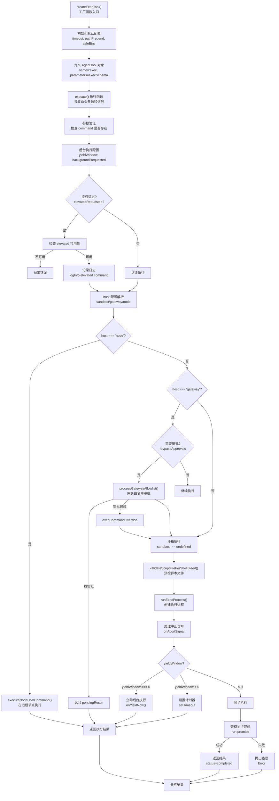

# bash-tools.exec.ts 核心执行工具分析

## 文件概述

`d:\prj\openclaw_analyze\src\agents\bash-tools.exec.ts` 是 OpenClaw Agent 执行 shell 命令的核心工具实现文件。该文件定义了 `exec` 工具，支持在沙箱、网关主机或远程节点执行命令，并提供完整的安全策略、审批流程、后台执行和超时控制机制。

## 主要函数流程图



## 主要功能详解

### 1. extractScriptTargetFromCommand() (第 67-92 行)

从命令字符串中提取脚本目标信息，支持解析 `python script.py` 和 `node app.js` 形式的命令。

**函数签名：**
```typescript
function extractScriptTargetFromCommand(
  command: string,
): { kind: "python"; relOrAbsPath: string } | { kind: "node"; relOrAbsPath: string } | null
```

**功能说明：**
- 解析命令字符串，识别要执行的脚本文件路径
- 支持 python、python3、node 命令
- 使用简单正则匹配，支持常见形式如 `python -u file.py`、`node --flag app.js`
- 复杂命令（管道、here文档、带空格的路径）返回 null

**使用示例：**
```typescript
extractScriptTargetFromCommand("python script.py") // => { kind: "python", relOrAbsPath: "script.py" }
extractScriptTargetFromCommand("node app.js") // => { kind: "node", relOrAbsPath: "app.js" }
extractScriptTargetFromCommand("ls -la") // => null
```

### 2. validateScriptFileForShellBleed() (第 108-184 行)

预检脚本文件，检测常见的 shell 变量泄漏问题。当模型生成的命令包含 `$VAR` 格式的环境变量但写在 Python/JS 脚本中时，会在执行前捕获这类错误。

**函数签名：**
```typescript
async function validateScriptFileForShellBleed(params: {
  command: string;
  workdir: string;
}): Promise<void>
```

**检测内容：**
1. **Shell 变量泄漏检测**：匹配大写/下划线格式的变量（如 `$USER`、`$PATH`），避免误匹配 JS 标识符中的 `$`
2. **JS 文件 Shell 语法检测**：检测 Node.js 文件是否以 shell 命令开头（如 `NODE ...`）

**检测逻辑：**
1. 调用 `extractScriptTargetFromCommand` 提取脚本目标
2. 解析相对路径为绝对路径
3. 检查文件是否存在且小于 512KB
4. 读取文件内容进行正则匹配
5. 检测到问题时抛出详细错误信息，包含文件名、行号和修复建议

**错误示例：**
```
exec preflight: detected likely shell variable injection ($USER) in python script: app.py:3.
In Python, use os.environ.get("USER") instead of raw $USER.
```

### 3. createExecTool() (第 202-785 行)

**核心工厂函数**，创建 exec 工具实例。这是 OpenClaw Agent 执行 shell 命令的主要入口。

**函数签名：**
```typescript
export function createExecTool(
  defaults?: ExecToolDefaults,
): AgentTool<any, ExecToolDetails>
```

#### 支持的参数配置

| 参数 | 类型 | 说明 |
|------|------|------|
| `host` | `sandbox`/`gateway`/`node` | 执行主机，默认为 `sandbox` |
| `security` | `deny`/`allowlist`/`full` | 安全策略 |
| `ask` | `off`/`on-miss`/`always` | 审批询问模式 |
| `elevated` | `boolean` | 是否提权执行 |
| `background` | `boolean` | 是否立即后台执行 |
| `yieldMs` | `number` | 等待毫秒数后进入后台 |
| `timeout` | `number` | 超时秒数 |
| `pty` | `boolean` | 是否使用 PTY 模式 |
| `workdir` | `string` | 工作目录 |
| `env` | `Record<string, string>` | 环境变量 |
| `node` | `string` | 远程节点 ID |

#### 执行主机（Host）机制

**三种执行主机：**

1. **`sandbox`**：在 Docker 沙箱容器中执行（默认）
   - 获取原始环境变量
   - 工作目录需要映射到容器内路径
   - 安全策略默认为 `deny`

2. **`gateway`**：在网关主机上执行
   - 需要验证清理环境变量
   - 安全策略默认为 `allowlist`
   - 支持 PTY 模式

3. **`node`**：在远程配对节点上执行
   - 忽略请求级别的 PATH 覆盖
   - 需要配置远程节点

**Host 切换规则：**
- 非提权请求不能切换 host
- 提权请求强制使用 `gateway` host

#### 提权（Elevated）机制

**提权执行允许在主机上以提升的权限执行命令，绕过沙箱限制。**

**提权模式：**
- `full`：完全绕过审批，直接执行
- `ask`：需要用户审批
- `off`：禁用

**提权可用性检查：**
1. `elevatedDefaults?.enabled` 是否启用
2. `elevatedDefaults?.allowed` 是否允许（基于 provider）

**提权失败错误示例：**
```
elevated is not available right now (runtime=sandboxed).
Failing gates: enabled (tools.elevated.enabled / agents.list[].tools.elevated.enabled)
Context: provider=slack
Fix-it keys:
- tools.elevated.enabled
- tools.elevated.allowFrom.<provider>
```

#### 安全策略（Security）机制

| 策略 | 说明 |
|------|------|
| `deny` | 默认拒绝，需要在 allowlist 中明确批准 |
| `allowlist` | 使用白名单审批 |
| `full` | 完全信任，不进行审批检查 |

**elevated + full 模式完全绕过安全检查。**

#### 审批询问（Ask）机制

| 模式 | 说明 |
|------|------|
| `off` | 从不询问 |
| `on-miss` | 命令不在白名单时询问（默认） |
| `always` | 始终询问 |

#### 后台执行（Yield）机制

**配置方式：**
- `background: true`：立即后台执行
- `yieldMs: number`：等待指定时间后进入后台

**后台执行流程：**
1. 创建执行进程
2. 设置 yield 计时器
3. 命令仍在运行时返回 `status: "running"`
4. 用户通过 `process` 工具（list/poll/log/write/kill/clear/remove）进行后续操作

#### 执行流程关键节点

1. **参数验证** → 检查 command 是否存在
2. **提权检查** → elevated 必须 enabled + allowed
3. **host 选择** → 非 elevated 请求不能切换 host
4. **security/ask 配置** → 沙箱默认 deny，主机默认 allowlist
5. **沙箱可用性检查** → 配置了 sandbox 但不可用时抛出错误
6. **工作目录解析** → 沙箱需要路径映射
7. **环境变量处理** → 沙箱获取原始 env，主机需要验证清理
8. **命令分发执行** → node/gateway/sandbox 三种执行方式
9. **后台/yield 处理** → 支持命令后台继续运行
10. **结果返回** → 成功/失败/运行中的状态返回

### 4. execTool (第 788 行)

默认导出的 exec 工具实例，使用全局默认配置创建。

```typescript
export const execTool = createExecTool();
```

## 关键配置说明

### SafeBins 配置

`safeBins` 是经过审批的二进制文件列表，在沙箱中可以执行而不触发审批流程。

```typescript
const {
  safeBins,           // 白名单二进制
  safeBinProfiles,    // 硬化运行时配置
  trustedSafeBinDirs, // 信任目录
} = resolveExecSafeBinRuntimePolicy({ ... });
```

**警告日志：**
- 未配置的 safeBins 条目会被忽略
- 解释器/运行时二进制（如 python, node）在 safeBins 中是不安全的

### 沙箱环境变量构建

```typescript
const env = sandbox
  ? buildSandboxEnv({
      defaultPath: DEFAULT_PATH,
      paramsEnv: params.env,
      sandboxEnv: sandbox.env,
      containerWorkdir: containerWorkdir ?? sandbox.containerWorkdir,
    })
  : mergedEnv;
```

### 网关白名单审批

```typescript
const gatewayResult = await processGatewayAllowlist({
  command: params.command,
  workdir,
  env,
  pty: params.pty === true && !sandbox,
  security,
  ask,
  safeBins,
  safeBinProfiles,
  // ... 其他参数
});

if (gatewayResult.pendingResult) {
  return gatewayResult.pendingResult; // 需要用户审批
}
execCommandOverride = gatewayResult.execCommandOverride; // 审批通过
```

## 返回结果类型

```typescript
interface ExecToolDetails {
  status: "running" | "completed";
  sessionId?: string;      // running 时返回
  pid?: number;            // running 时返回
  startedAt?: Date;        // running 时返回
  exitCode?: number;       // completed 时返回
  durationMs?: number;     // completed 时返回
  cwd?: string;
  tail?: string;
  aggregated?: string;
}
```

## 使用示例

```typescript
const tool = createExecTool({ host: "sandbox", security: "deny" });

// 同步执行
await tool.execute(toolCallId, { command: "ls -la", timeout: 30 });

// 后台执行
await tool.execute(toolCallId, { command: "npm run build", yieldMs: 5000 });

// 立即后台执行
await tool.execute(toolCallId, { command: "python server.py", background: true });

// PTY 模式（交互式命令）
await tool.execute(toolCallId, { command: "vim", pty: true });
```

## 相关文件

| 文件路径 | 说明 |
|----------|------|
| [bash-tools.exec-runtime.ts](file:///d:/prj/openclaw_analyze/src/agents/bash-tools.exec-runtime.ts) | 执行运行时工具函数 |
| [bash-tools.exec-host-gateway.ts](file:///d:/prj/openclaw_analyze/src/agents/bash-tools.exec-host-gateway.ts) | 网关主机执行逻辑 |
| [bash-tools.exec-host-node.ts](file:///d:/prj/openclaw_analyze/src/agents/bash-tools.exec-host-node.ts) | 远程节点执行逻辑 |
| [bash-tools.shared.ts](file:///d:/prj/openclaw_analyze/src/agents/bash-tools.shared.ts) | 共享工具函数 |
| [bash-tools.exec-types.ts](file:///d:/prj/openclaw_analyze/src/agents/bash-tools.exec-types.ts) | 类型定义 |
| [bash-process-registry.ts](file:///d:/prj/openclaw_analyze/src/agents/bash-process-registry.ts) | 后台进程注册表 |
