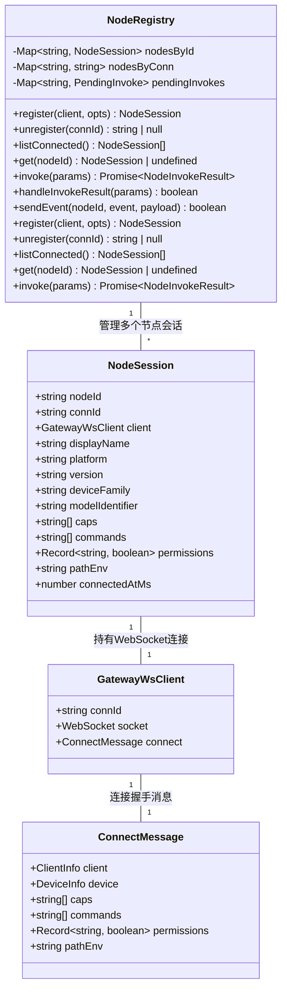
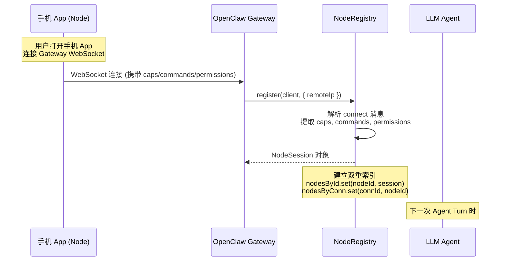
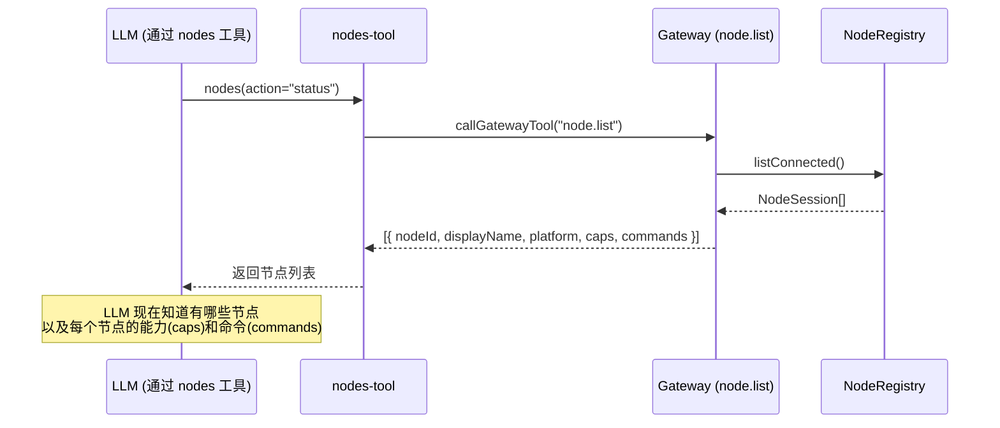
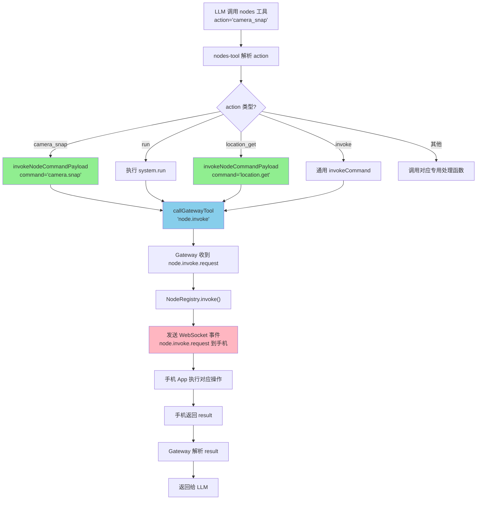
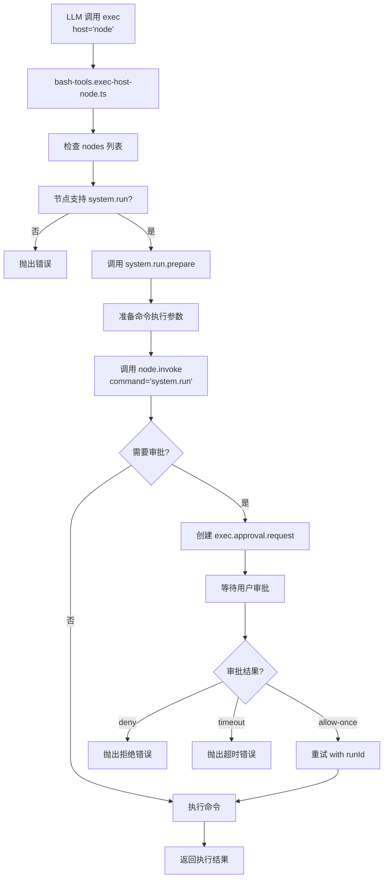

# OpenClaw 远程 Node 能力发现与调用机制分析

## 一、概述

当用户将一部手机（iOS/Android）作为 Node 接入 OpenClaw 时，OpenClaw 通过 WebSocket 连接感知到该设备，并从设备的连接握手消息中获取其能力列表（caps）和支持的命令列表（commands）。LLM 通过 `nodes` 工具获知设备能力，并通过该工具调用设备上的具体能力。

---

## 二、核心实体关系



---

## 三、能力发现流程

### 3.1 节点连接注册流程



### 3.2 节点上报能力格式

**WebSocket 连接时发送的 Connect 消息结构：**

```typescript
// 手机 App 连接时发送的消息
{
  type: "connect",
  client: {
    id: "node-uuid-xxx",           // 节点唯一ID
    displayName: "iPhone 15 Pro",  // 显示名称
    platform: "ios",               // 平台类型
    deviceFamily: "phone",          // 设备类型
    modelIdentifier: "iPhone16,1",  // 设备型号
    version: "1.0.0"               // App 版本
  },
  device: {
    id: "device-uuid-xxx"          // 设备ID
  },
  caps: [
    "camera",                      // 摄像头能力
    "screen",                      // 屏幕截图
    "screen_record",               // 屏幕录制
    "location",                    // 定位
    "photos",                      // 照片访问
    "notifications",                // 通知
    "canvas",                      // Canvas 演示
    "browser"                      // 浏览器代理
  ],
  commands: [
    "camera.snap",                 // 拍照命令
    "camera.list",                 // 列出摄像头
    "camera.clip",                 // 录制视频
    "screen.record",                // 屏幕录制
    "location.get",                 // 获取位置
    "photos.latest",               // 最近照片
    "notifications.list",           // 列出通知
    "notifications.actions",       // 通知操作
    "system.notify",               // 发送通知
    "system.run",                  // 执行命令
    "system.run.prepare",          // 命令准备
    "device.status",               // 设备状态
    "device.info",                 // 设备信息
    "device.permissions",         // 权限信息
    "canvas.present",              // Canvas 演示
    "browser.proxy"                // 浏览器代理
  ],
  permissions: {
    "camera": true,
    "location": true,
    "photos": true,
    "notifications": true
  },
  pathEnv: "/usr/local/bin:/usr/bin"
}
```

### 3.3 核心代码实现

**NodeRegistry.register()** ([node-registry.ts:32-60](file:///d:/prj/openclaw_analyze/src/gateway/node-registry.ts#L32-L60)):

```typescript
register(client: GatewayWsClient, opts: { remoteIp?: string | undefined }) {
  const connect = client.connect;
  const nodeId = connect.device?.id ?? connect.client.id;

  // 从连接消息中提取能力和命令列表
  const caps = Array.isArray(connect.caps) ? connect.caps : [];
  const commands = Array.isArray((connect as { commands?: string[] }).commands)
    ? ((connect as { commands?: string[] }).commands ?? [])
    : [];
  const permissions = typeof (connect as { permissions?: Record<string, boolean> }).permissions === "object"
    ? ((connect as { permissions?: Record<string, boolean> }).permissions ?? undefined)
    : undefined;

  const session: NodeSession = {
    nodeId,
    connId: client.connId,
    client,
    displayName: connect.client.displayName,
    platform: connect.client.platform,
    caps,                              // 存储设备能力列表
    commands,                          // 存储支持的命令列表
    permissions,
    connectedAtMs: Date.now(),
  };

  this.nodesById.set(nodeId, session);
  this.nodesByConn.set(client.connId, nodeId);
  return session;
}
```

---

## 四、LLM 如何获知 Node 能力

### 4.1 nodes 工具定义

LLM 并不会自动获知所有 Node 能力，而是通过 `nodes` 工具来查询和调用。`nodes` 工具是 OpenClaw 暴露给 LLM 的核心接口。

**nodes-tool.ts** ([nodes-tool.ts:34-44](file:///d:/prj/openclaw_analyze/src/agents/tools/nodes-tool.ts#L34-L44)):

```typescript
const NODES_TOOL_ACTIONS = [
  "status",           // 列出所有已连接节点
  "describe",         // 获取特定节点详情
  "pending",          // 列出待配对请求
  "approve",          // 批准配对请求
  "reject",           // 拒绝配对请求
  "notify",           // 发送通知
  "camera_snap",      // 拍照
  "camera_list",      // 列出摄像头
  "camera_clip",      // 录制视频
  "photos_latest",    // 获取最近照片
  "screen_record",    // 屏幕录制
  "location_get",     // 获取位置
  "notifications_list",    // 列出通知
  "notifications_action",  // 通知操作
  "device_status",    // 设备状态
  "device_info",      // 设备信息
  "device_permissions", // 权限信息
  "device_health",     // 设备健康状态
  "run",              // 在节点上执行命令
  "invoke",           // 通用命令调用
] as const;
```

### 4.2 LLM 查询节点列表



### 4.3 节点描述返回

**node.describe** 返回的结构 ([nodes-tool.ts:161-165](file:///d:/prj/openclaw_analyze/src/agents/tools/nodes-tool.ts#L161-L165)):

```typescript
case "describe": {
  const node = readStringParam(params, "node", { required: true });
  const nodeId = await resolveNodeId(gatewayOpts, node);
  return jsonResult(
    await callGatewayTool("node.describe", gatewayOpts, { nodeId })
  );
}
```

返回给 LLM 的节点描述包含：
- `nodeId`: 节点唯一标识
- `displayName`: 显示名称
- `platform`: 平台类型 (ios/android/macos)
- `deviceFamily`: 设备类型 (phone/tablet/desktop)
- `modelIdentifier`: 型号标识
- `caps`: 能力列表 (camera, screen, location, photos, notifications, canvas, browser)
- `commands`: 支持的命令列表 (camera.snap, location.get, system.run, etc.)
- `permissions`: 各能力的权限状态

---

## 五、LLM 如何调用 Node 能力

### 5.1 调用流程概览



### 5.2 能力调用详细流程

以 **camera_snap** (拍照) 为例：

```mermaid
sequenceDiagram
    participant LLM as LLM
    participant Tool as nodes-tool.ts
    participant Gateway as Gateway
    participant Registry as NodeRegistry
    participant NodeApp as 手机 App

    LLM->>Tool: nodes(action="camera_snap", node="iPhone", facing="front")

    Tool->>Tool: resolveNodeId(gatewayOpts, "iPhone")

    Tool->>Gateway: callGatewayTool("node.invoke", {
      nodeId: "node-xxx",
      command: "camera.snap",
      params: { facing: "front", maxWidth: 1600, quality: 0.95 }
    })

    Gateway->>Registry: invoke({
      nodeId: "node-xxx",
      command: "camera.snap",
      params: { facing: "front", ... }
    })

    Registry->>NodeApp: WebSocket: node.invoke.request {
      id: "request-uuid",
      command: "camera.snap",
      paramsJSON: "{facing: 'front', ...}"
    }

    Note over NodeApp: 手机打开摄像头<br/>拍摄照片

    NodeApp-->>Registry: WebSocket: node.invoke.result {
      id: "request-uuid",
      ok: true,
      payload: { base64: "...", format: "jpeg", width: 4032, height: 3024 }
    }

    Registry-->>Gateway: NodeInvokeResult { ok: true, payload: {...} }

    Gateway-->>Tool: { payload: { base64: "...", format: "jpeg", ... } }

    Tool->>Tool: parseCameraSnapPayload()
    Tool->>Tool: writeCameraPayloadToFile()

    Tool-->>LLM: {
      content: [{ type: "text", text: "MEDIA:/tmp/camera_snap_xxx.jpg" }],
      details: { facing: "front", width: 4032, height: 3024 }
    }
```

### 5.3 核心调用代码

**nodes-tool.ts 相机调用** ([nodes-tool.ts:236-300](file:///d:/prj/openclaw_analyze/src/agents/tools/nodes-tool.ts#L236-L300)):

```typescript
case "camera_snap": {
  const node = readStringParam(params, "node", { required: true });
  const resolvedNode = await resolveNode(gatewayOpts, node);
  const nodeId = resolvedNode.nodeId;

  // 调用 node.invoke 命令
  const raw = await callGatewayTool<{ payload: unknown }>("node.invoke", gatewayOpts, {
    nodeId,
    command: "camera.snap",
    params: {
      facing,
      maxWidth,
      quality,
      format: "jpg",
      delayMs,
      deviceId,
    },
    idempotencyKey: crypto.randomUUID(),
  });

  // 解析返回的拍照结果
  const payload = parseCameraSnapPayload(raw?.payload);

  // 保存图片到临时文件
  const filePath = cameraTempPath({ kind: "snap", facing, ext: "jpg" });
  await writeCameraPayloadToFile({
    filePath,
    payload,
    expectedHost: resolvedNode.remoteIp,
  });

  // 返回结果给 LLM
  return {
    content: [{ type: "text", text: `MEDIA:${filePath}` }],
    details: { facing, path: filePath, width: payload.width, height: payload.height },
  };
}
```

**NodeRegistry.invoke()** ([node-registry.ts:84-130](file:///d:/prj/openclaw_analyze/src/gateway/node-registry.ts#L84-L130)):

```typescript
async invoke(params: {
  nodeId: string;
  command: string;
  params?: unknown;
  timeoutMs?: number;
  idempotencyKey?: string;
}): Promise<NodeInvokeResult> {
  const node = this.nodesById.get(params.nodeId);
  if (!node) {
    return { ok: false, error: { code: "NOT_CONNECTED", message: "node not connected" } };
  }

  const requestId = randomUUID();
  const payload = {
    id: requestId,
    nodeId: params.nodeId,
    command: params.command,
    paramsJSON: params.params !== undefined ? JSON.stringify(params.params) : null,
    timeoutMs: params.timeoutMs,
    idempotencyKey: params.idempotencyKey,
  };

  // 发送 WebSocket 事件到手机
  const ok = this.sendEventToSession(node, "node.invoke.request", payload);
  if (!ok) {
    return { ok: false, error: { code: "UNAVAILABLE", message: "failed to send invoke to node" } };
  }

  // 等待手机响应，设置超时
  return await new Promise<NodeInvokeResult>((resolve, reject) => {
    const timer = setTimeout(() => {
      this.pendingInvokes.delete(requestId);
      resolve({ ok: false, error: { code: "TIMEOUT", message: "node invoke timed out" } });
    }, timeoutMs ?? 30_000);

    this.pendingInvokes.set(requestId, {
      nodeId: params.nodeId,
      command: params.command,
      resolve,
      reject,
      timer,
    });
  });
}
```

---

## 六、system.run 远程命令执行

### 6.1 概述

`system.run` 是 Node 支持的一种特殊命令，允许在远程手机上执行 shell 命令。这需要手机端支持 `system.run` 命令。

### 6.2 执行流程



### 6.3 核心代码

**bash-tools.exec-host-node.ts** ([bash-tools.exec-host-node.ts:50-80](file:///d:/prj/openclaw_analyze/src/agents/bash-tools.exec-host-node.ts#L50-L80)):

```typescript
export async function executeNodeHostCommand(
  params: ExecuteNodeHostCommandParams,
): Promise<AgentToolResult<ExecToolDetails>> {
  // 获取节点列表
  const nodes = await listNodes({});
  if (nodes.length === 0) {
    throw new Error("exec host=node requires a paired node (none available)");
  }

  // 查找目标节点
  let nodeId: string;
  nodeId = resolveNodeIdFromList(nodes, nodeQuery, !nodeQuery);

  const nodeInfo = nodes.find((entry) => entry.nodeId === nodeId);

  // 检查节点是否支持 system.run
  const supportsSystemRun = Array.isArray(nodeInfo?.commands)
    ? nodeInfo?.commands?.includes("system.run")
    : false;
  if (!supportsSystemRun) {
    throw new Error("exec host=node requires a node that supports system.run");
  }

  // 调用 system.run.prepare 准备命令
  const prepareRaw = await callGatewayTool<{ payload?: unknown }>(
    "node.invoke",
    { timeoutMs: 15_000 },
    {
      nodeId,
      command: "system.run.prepare",
      params: { command: argv, rawCommand: params.command, cwd: params.workdir },
    },
  );
  const prepared = parsePreparedSystemRunPayload(prepareRaw?.payload);
  // ...
}
```

---

## 七、能力与命令的完整映射

### 7.1 nodes-tool action 到 command 的映射

| nodes action | node command | 说明 |
|--------------|-------------|------|
| `camera_snap` | `camera.snap` | 拍照 |
| `camera_clip` | `camera.clip` | 录制视频 |
| `camera_list` | `camera.list` | 列出摄像头 |
| `photos_latest` | `photos.latest` | 获取最近照片 |
| `screen_record` | `screen.record` | 屏幕录制 |
| `location_get` | `location.get` | 获取位置 |
| `notifications_list` | `notifications.list` | 列出通知 |
| `notifications_action` | `notifications.actions` | 通知操作 |
| `device_status` | `device.status` | 设备状态 |
| `device_info` | `device.info` | 设备信息 |
| `device_permissions` | `device.permissions` | 权限信息 |
| `device_health` | `device.health` | 健康检查 |
| `notify` | `system.notify` | 发送通知 |
| `run` | `system.run` | 执行命令 |
| `invoke` | 任意 command | 通用调用 |

### 7.2 预定义能力列表

```typescript
// apps/shared/OpenClawKit/Sources/OpenClawKit/Capabilities.swift
export enum OpenClawCapability: string, Codable, Sendable {
  case canvas       // Canvas 演示能力
  case browser      // 浏览器代理
  case camera       // 摄像头
  case screen       // 屏幕截图
  case voiceWake    // 语音唤醒
  case location     // 定位
  case device       // 设备信息
  case watch        // 手表配对
  case photos       // 照片访问
  case contacts     // 联系人
  case calendar     // 日历
  case reminders    // 提醒
  case motion       // 运动传感器
}
```

---

## 八、关键文件索引

| 文件路径 | 核心功能 |
|----------|----------|
| [src/gateway/node-registry.ts](file:///d:/prj/openclaw_analyze/src/gateway/node-registry.ts) | Node 会话注册表，管理所有连接节点 |
| [src/agents/tools/nodes-tool.ts](file:///d:/prj/openclaw_analyze/src/agents/tools/nodes-tool.ts) | nodes 工具实现，LLM 调用节点的入口 |
| [src/agents/tools/nodes-utils.ts](file:///d:/prj/openclaw_analyze/src/agents/tools/nodes-utils.ts) | 节点解析工具函数 |
| [src/agents/bash-tools.exec-host-node.ts](file:///d:/prj/openclaw_analyze/src/agents/bash-tools.exec-host-node.ts) | exec 工具的 node host 执行逻辑 |
| [src/gateway/server-methods/nodes.ts](file:///d:/prj/openclaw_analyze/src/gateway/server-methods/nodes.ts) | Gateway 的 node 相关处理方法 |
| [src/shared/node-list-parse.ts](file:///d:/prj/openclaw_analyze/src/shared/node-list-parse.ts) | 节点列表解析 |
| [src/apps/shared/OpenClawKit/Capabilities.swift](file:///d:/prj/openclaw_analyze/apps/shared/OpenClawKit/Sources/OpenClawKit/Capabilities.swift) | 能力枚举定义 |
| [src/cli/nodes-cli/register.status.ts](file:///d:/prj/openclaw_analyze/src/cli/nodes-cli/register.status.ts) | CLI 节点状态注册 |
| [src/cli/nodes-cli/register.invoke.ts](file:///d:/prj/openclaw_analyze/src/cli/nodes-cli/register.invoke.ts) | CLI 节点调用注册 |

---

## 九、总结

### 能力发现机制
1. **手机接入时**：手机 App 通过 WebSocket 连接 Gateway，发送包含 `caps`（能力列表）和 `commands`（命令列表）的握手消息
2. **Gateway 存储**：NodeRegistry 将这些信息存储在 NodeSession 对象中
3. **LLM 查询**：LLM 通过 `nodes(action="status" 或 "describe")` 工具查询可用节点及其能力

### 能力调用机制
1. **工具封装**：nodes-tool 将各种 action（camera_snap, location_get 等）封装为 `node.invoke` 调用
2. **Gateway 转发**：Gateway 收到 `node.invoke` 请求后，通过 WebSocket 转发给对应手机
3. **手机执行**：手机 App 执行相应操作（拍照、定位等）
4. **结果返回**：手机将执行结果通过 WebSocket 返回，最终传递给 LLM

### 远程命令执行
- 通过 `exec(host="node")` 工具，LLM 可以在远程手机上执行 shell 命令
- 需要手机支持 `system.run` 命令
- 支持命令审批流程，确保安全性
