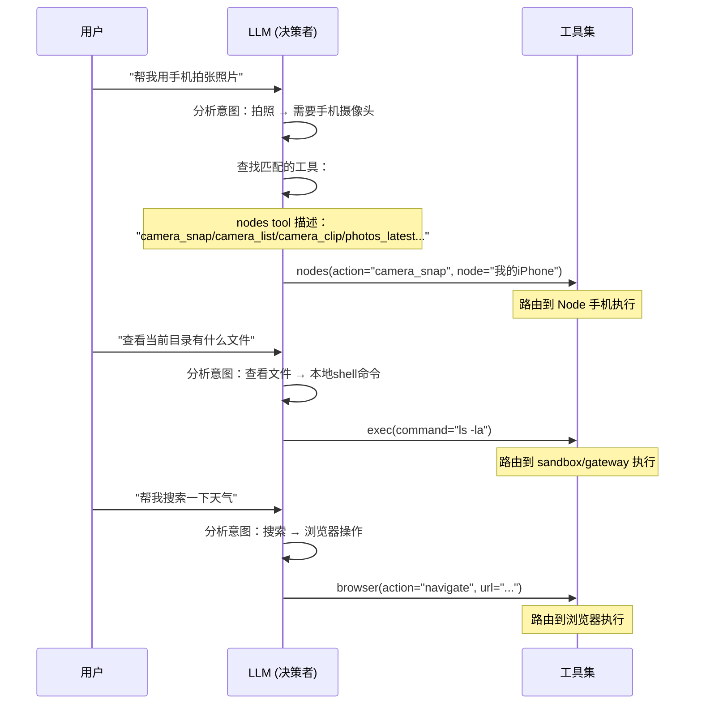
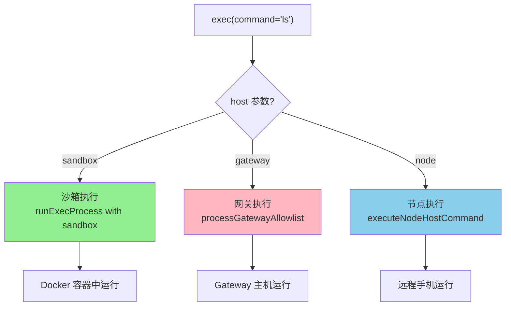

# OpenClaw 工具选择机制分析 - Node vs 本地工具

## 一、核心问题

**系统是怎么知道要调用 Node 上的能力，还是要调用本机的 Tool 或者 Skill？**

答案：**LLM 自主选择**。OpenClaw 在代码层面并不硬编码"什么时候用 Node，什么时候用本地工具"，而是将所有工具的描述告诉 LLM，由 LLM 根据上下文自行决定。

---

## 二、工具选择架构

### 2.1 所有工具在启动时全部注册

在 [openclaw-tools.ts](file:///d:/prj/openclaw_analyze/src/agents/openclaw-tools.ts) 中，所有工具一起注册给 LLM：

```typescript
const tools: AnyAgentTool[] = [
  createBrowserTool({ ... }),      // 浏览器工具
  createCanvasTool({ ... }),       // Canvas工具
  createNodesTool({ ... }),        // 节点工具 ⭐
  createCronTool({ ... }),         // 定时任务工具
  createMessageTool({ ... }),       // 消息工具
  createGatewayTool({ ... }),       // 网关工具
  createSessionsListTool({ ... }),  // 会话列表工具
  createSessionsSendTool({ ... }), // 会话发送工具
  createSubagentsTool({ ... }),    // 子代理工具
  // ...
  createExecTool({ ... }),         // 命令执行工具 ⭐
];
```

### 2.2 工具描述决定 LLM 的认知

每个工具都有 **description**，告诉 LLM 它能做什么：

| 工具 | description 关键词 |
|------|-------------------|
| **nodes** | "Discover and control **paired nodes** (status/describe/pairing/**notify/camera/photos/screen/location/notifications/run/invoke**)" |
| **exec** | "Execute **shell commands** with background continuation..." |
| **browser** | "Controllable **web browser**..." |
| **message** | "Send **messages** to channels and sessions..." |

---

## 三、LLM 决策流程

### 3.1 工具选择时序图



### 3.2 LLM 的决策逻辑

```
┌─────────────────────────────────────────────────────────────────┐
│                         用户请求                                │
│                    "用手机摄像头拍照"                            │
└─────────────────────────────────────────────────────────────────┘
                              │
                              ▼
┌─────────────────────────────────────────────────────────────────┐
│  LLM 分析意图：拍照                                              │
│  → 需要调用手机的摄像头能力                                       │
└─────────────────────────────────────────────────────────────────┘
                              │
                              ▼
┌─────────────────────────────────────────────────────────────────┐
│  LLM 查看工具列表，找到匹配的：                                   │
│  - nodes 描述包含 "camera_snap"                                  │
│  → 选择调用 nodes 工具                                           │
└─────────────────────────────────────────────────────────────────┘
                              │
                              ▼
┌─────────────────────────────────────────────────────────────────┐
│  工具执行：                                                      │
│  nodes-tool → node.invoke(command="camera.snap")                │
│    ↓                                                             │
│  Gateway → WebSocket → 手机App                                   │
│    ↓                                                             │
│  手机执行拍照，返回图片                                           │
└─────────────────────────────────────────────────────────────────┘
```

---

## 四、exec 工具的 host 参数

对于 `exec` 工具，有一个关键参数 `host`，决定命令在哪里执行：

### 4.1 host 选项

| host 值 | 执行位置 | 说明 |
|---------|----------|------|
| `"sandbox"` | Docker 沙箱容器 | **默认**，安全隔离环境 |
| `"gateway"` | 网关主机 | 直接在运行 OpenClaw 的机器上执行 |
| `"node"` | 远程配对节点 | 在手机等远程设备上执行 |

### 4.2 host 选择逻辑

**bash-tools.exec.ts** ([第 427-448 行](file:///d:/prj/openclaw_analyze/src/agents/bash-tools.exec.ts#L427-L448)):

```typescript
// host 指定命令在哪里执行：
// - sandbox: 在 Docker 沙箱容器中执行（默认）
// - gateway: 在网关主机上执行
// - node: 在远程配对节点上执行
const configuredHost = defaults?.host ?? "sandbox"; // 配置的默认 host
const sandboxHostConfigured = defaults?.host === "sandbox"; // 是否显式配置了 sandbox
const requestedHost = normalizeExecHost(params.host) ?? null; // 用户请求的 host
let host: ExecHost = requestedHost ?? configuredHost; // 最终使用的 host

// host 切换检查：非提权请求不能切换 host
if (!elevatedRequested && requestedHost && requestedHost !== configuredHost) {
  throw new Error(
    `exec host not allowed (requested ${renderExecHostLabel(requestedHost)}; ` +
      `configure tools.exec.host=${renderExecHostLabel(configuredHost)} to allow).`,
  );
}

// 提权请求强制使用 gateway host（在主机上执行）
if (elevatedRequested) {
  host = "gateway";
}
```

### 4.3 host 执行分发



---

## 五、nodes 工具的能力感知

### 5.1 nodes 工具的 action 列表

**nodes-tool.ts** ([第 34-44 行](file:///d:/prj/openclaw_analyze/src/agents/tools/nodes-tool.ts#L34-L44)):

```typescript
const NODES_TOOL_ACTIONS = [
  "status",           // 列出所有已连接节点
  "describe",         // 获取特定节点详情
  "pending",          // 列出待配对请求
  "approve",          // 批准配对请求
  "reject",           // 拒绝配对请求
  "notify",           // 发送通知
  "camera_snap",      // 拍照
  "camera_list",      // 列出摄像头
  "camera_clip",      // 录制视频
  "photos_latest",    // 获取最近照片
  "screen_record",    // 屏幕录制
  "location_get",     // 获取位置
  "notifications_list",    // 列出通知
  "notifications_action",  // 通知操作
  "device_status",    // 设备状态
  "device_info",      // 设备信息
  "device_permissions", // 权限信息
  "device_health",     // 设备健康状态
  "run",              // 在节点上执行命令
  "invoke",           // 通用命令调用
] as const;
```

### 5.2 LLM 如何知道 Node 的具体能力

当 LLM 调用 `nodes(action="describe", node="iPhone")` 时，返回节点详情：

```typescript
// 返回给 LLM 的节点描述
{
  nodeId: "iphone-xxx",
  displayName: "iPhone 15 Pro",
  platform: "ios",
  deviceFamily: "phone",
  caps: [
    "camera",         // 有摄像头能力
    "screen",         // 有屏幕截图
    "location",       // 有定位
    "photos",         // 有照片访问
    "notifications",  // 有通知
    "canvas",         // 有Canvas演示
    "browser"         // 有浏览器代理
  ],
  commands: [
    "camera.snap",    // 支持拍照
    "camera.list",    // 支持列摄像头
    "location.get",   // 支持定位
    "system.run",     // 支持命令执行
    // ...更多命令
  ],
  permissions: {
    camera: true,
    location: true,
    photos: true,
    notifications: true
  }
}
```

---

## 六、Skill 与 Tool 的区别

### 6.1 Tool vs Skill

| 维度 | Tool | Skill |
|------|------|-------|
| **实现形式** | TypeScript 代码 | Markdown 文件 (SKILL.md) |
| **调用方式** | LLM 直接调用工具函数 | LLM 阅读 Skill 文档后调用 Tool |
| **执行位置** | 由 host 参数决定 | 通常在本地执行 |
| **示例** | nodes, exec, browser | github, weather, summarize |

### 6.2 Skill 的本质

Skill 是**指导 LLM 如何使用 Tool 的文档**：

```markdown
# SKILL.md
---
name: github
description: GitHub repository management
---
Use the `exec` tool to run `gh` CLI commands.

## 创建 Issue
gh issue create --title "xxx" --body "xxx"
```

当 LLM 判断需要某个 Skill 时：
1. LLM 调用 `read` 工具读取 SKILL.md
2. LLM 按照文档中的指引调用相应的 Tool

---

## 七、总结：选择决策链

```
┌─────────────────────────────────────────────────────────────────┐
│                         用户请求                                │
└─────────────────────────────────────────────────────────────────┘
                              │
                              ▼
┌─────────────────────────────────────────────────────────────────┐
│                    LLM 意图分析                                  │
│  - 拍照/定位/通知 → Node 能力？                                  │
│  - Shell 命令 → exec 工具？                                     │
│  - 浏览器操作 → browser 工具？                                   │
│  - GitHub 操作 → skill 文档？                                   │
└─────────────────────────────────────────────────────────────────┘
                              │
                              ▼
┌─────────────────────────────────────────────────────────────────┐
│               LLM 查看工具描述选择                                 │
│  工具描述包含的关键词与用户意图匹配                                │
└─────────────────────────────────────────────────────────────────┘
                              │
                              ▼
┌─────────────────────────────────────────────────────────────────┐
│                      工具路由执行                                 │
│  - nodes → WebSocket → 手机执行                                   │
│  - exec(host=sandbox) → Docker 沙箱执行                           │
│  - exec(host=gateway) → 网关主机执行                              │
│  - exec(host=node) → 远程节点执行                                 │
│  - browser → 浏览器执行                                          │
└─────────────────────────────────────────────────────────────────┘
```

### 关键点

1. **LLM 是决策者** - 根据工具描述自主选择
2. **工具是能力封装** - nodes/exec/browser 各有分工
3. **host 参数控制 exec 位置** - sandbox/gateway/node 三选一
4. **nodes 的能力由手机上报** - 连接时发送 caps/commands 列表
5. **Skill 是文档不是工具** - LLM 阅读后调用 Tool 执行

---

## 八、相关文件

| 文件路径 | 核心功能 |
|----------|----------|
| [src/agents/openclaw-tools.ts](file:///d:/prj/openclaw_analyze/src/agents/openclaw-tools.ts) | 工具注册入口 |
| [src/agents/tools/nodes-tool.ts](file:///d:/prj/openclaw_analyze/src/agents/tools/nodes-tool.ts) | Node 工具实现 |
| [src/agents/bash-tools.exec.ts](file:///d:/prj/openclaw_analyze/src/agents/bash-tools.exec.ts) | exec 工具实现，含 host 选择逻辑 |
| [src/gateway/node-registry.ts](file:///d:/prj/openclaw_analyze/src/gateway/node-registry.ts) | Node 会话管理 |
| [src/agents/skills/workspace.ts](file:///d:/prj/openclaw_analyze/src/agents/skills/workspace.ts) | Skill 加载与注入 |
