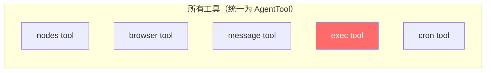
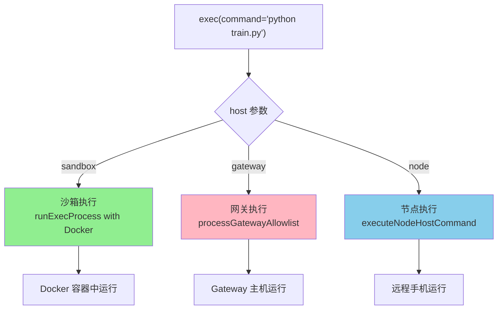
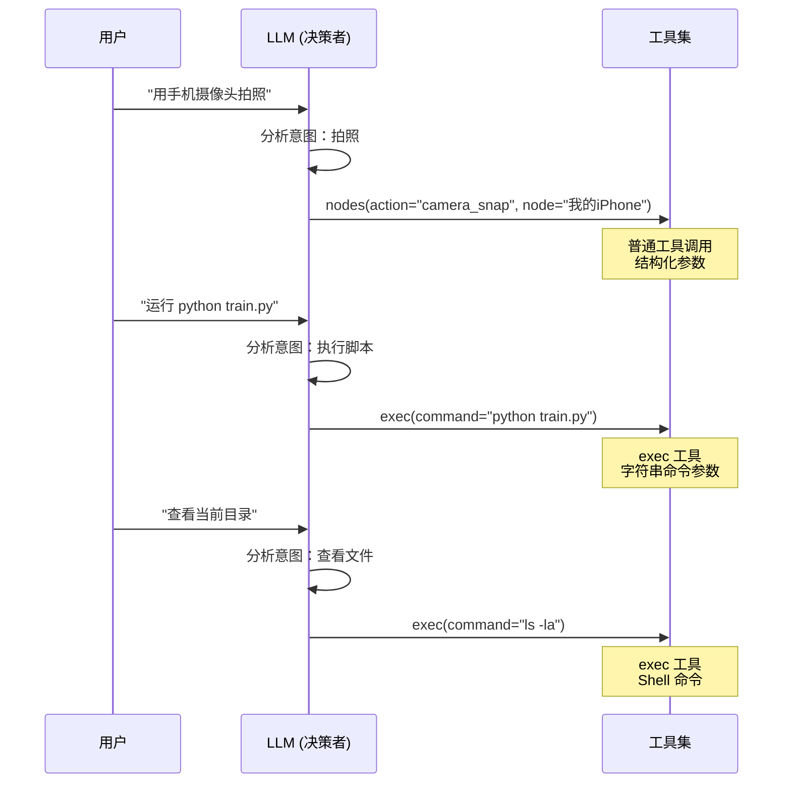
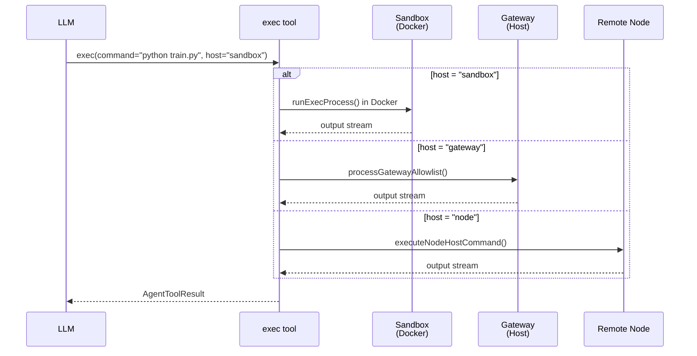

# OpenClaw 工具类型区分机制分析 - 普通工具调用 vs Bash/Python 执行

## 一、核心问题

**OpenClaw 是如何区分普通工具调用（如 nodes、browser）和 Bash/Python 命令执行的？**

答案：**它们本质上是同一类概念（都是 Tool），但通过工具名称和参数 schema 进行区分。`exec`** **工具是唯一执行 Shell 命令的工具，而命令本身通过字符串参数传入。**

***

## 二、核心概念：所有工具都是 Tool

### 2.1 工具的统一抽象

在 OpenClaw 中，**所有功能（普通工具调用、Bash 执行、Python 执行）都统一抽象为** **`AgentTool`**：



### 2.2 工具类型定义

**common.ts** ([第 8 行](file:///d:/prj/openclaw_analyze/src/agents/tools/common.ts#L8)):

```typescript
export type AnyAgentTool = AgentTool<any, unknown> & {
  ownerOnly?: boolean;
};
```

***

## 三、exec 工具：唯一的 Shell 执行入口

### 3.1 exec 工具定义

**bash-tools.exec-runtime.ts** ([第 91-131 行](file:///d:/prj/openclaw_analyze/src/agents/bash-tools.exec-runtime.ts#L91-L131)):

```typescript
export const execSchema = Type.Object({
  command: Type.String({ description: "Shell command to execute" }),
  workdir: Type.Optional(Type.String({ description: "Working directory (defaults to cwd)" })),
  env: Type.Optional(Type.Record(Type.String(), Type.String())),
  yieldMs: Type.Optional(
    Type.Number({
      description: "Milliseconds to wait before backgrounding (default 10000)",
    }),
  ),
  background: Type.Optional(Type.Boolean({ description: "Run in background immediately" })),
  timeout: Type.Optional(
    Type.Number({
      description: "Timeout in seconds (optional, kills process on expiry)",
    }),
  ),
  pty: Type.Optional(
    Type.Boolean({
      description:
        "Run in a pseudo-terminal (PTY) when available (TTY-required CLIs, coding agents)",
    }),
  ),
  elevated: Type.Optional(
    Type.Boolean({
      description: "Run on the host with elevated permissions (if allowed)",
    }),
  ),
  host: Type.Optional(
    Type.String({
      description: "Exec host (sandbox|gateway|node).",
    }),
  ),
  security: Type.Optional(
    Type.String({
      description: "Exec security mode (deny|allowlist|full).",
    }),
  ),
  ask: Type.Optional(
    Type.String({
      description: "Exec ask mode (off|on-miss|always).",
    }),
  ),
  node: Type.Optional(
    Type.String({
      description: "Node id/name for host=node.",
    }),
  ),
});
```

### 3.2 exec 工具注册

**bash-tools.exec.ts** ([第 276-281 行](file:///d:/prj/openclaw_analyze/src/agents/bash-tools.exec.ts#L276-L281)):

```typescript
export function createExecTool(defaults?: ExecToolDefaults): AgentTool {
  return {
    name: "exec",
    label: "exec",
    description:
      "Execute shell commands with background continuation. Use yieldMs/background to continue later via process tool. Use pty=true for TTY-required commands (terminal UIs, coding agents).",
    parameters: execSchema,
    // ... execute implementation
  };
}
```

### 3.3 exec 工具的 host 参数：决定执行位置

**bash-tools.exec.ts** ([第 427-448 行](file:///d:/prj/openclaw_analyze/src/agents/bash-tools.exec.ts#L427-L448)):

```typescript
// ==================== 执行主机（host）配置 ====================
// host 指定命令在哪里执行：
// - sandbox: 在 Docker 沙箱容器中执行（默认）
// - gateway: 在网关主机上执行
// - node: 在远程配对节点上执行
const configuredHost = defaults?.host ?? "sandbox"; // 配置的默认 host
const sandboxHostConfigured = defaults?.host === "sandbox"; // 是否显式配置了 sandbox
const requestedHost = normalizeExecHost(params.host) ?? null; // 用户请求的 host
let host: ExecHost = requestedHost ?? configuredHost; // 最终使用的 host

// host 切换检查：非提权请求不能切换 host
if (!elevatedRequested && requestedHost && requestedHost !== configuredHost) {
  throw new Error(
    `exec host not allowed (requested ${renderExecHostLabel(requestedHost)}; ` +
      `configure tools.exec.host=${renderExecHostLabel(configuredHost)} to allow).`,
  );
}

// 提权请求强制使用 gateway host（在主机上执行）
if (elevatedRequested) {
  host = "gateway";
}
```

***

## 四、Bash/Python 执行的区分方式

### 4.1 命令字符串解析

OpenClaw **不通过工具类型区分 Bash 和 Python**，而是**通过** **`command`** **参数的字符串内容区分**：

**bash-tools.exec.ts** ([第 55-66 行](file:///d:/prj/openclaw_analyze/src/agents/bash-tools.exec.ts#L55-L66)):

```typescript
/**
 * 从命令字符串中提取脚本目标信息
 * 用于预检和日志记录目的
 *
 * @param command 命令字符串
 * @returns 解析结果，包含脚本类型(python/node)和脚本路径；无法解析时返回null
 *
 * @example
 * extractScriptTargetFromCommand("python script.py") // => { kind: "python", relOrAbsPath: "script.py" }
 * extractScriptTargetFromCommand("node app.js") // => { kind: "node", relOrAbsPath: "app.js" }
 * extractScriptTargetFromCommand("ls -la") // => null
 */
```

### 4.2 脚本类型检测逻辑

**bash-tools.exec.ts** ([第 127-145 行](file:///d:/prj/openclaw_analyze/src/agents/bash-tools.exec.ts#L127-L145)):

```typescript
const extractScriptTargetFromCommand = (command: string): ScriptTarget | null => {
  const trimmed = command.trimStart();
  // Python 脚本检测：匹配 python*.py, pypy*, python3*
  if (/^python\d*(?:\s|$)/.test(trimmed) || /^pypy\d*(?:\s|$)/.test(trimmed)) {
    const relOrAbsPath = trimmed.split(/\s+/).slice(1).join(" ");
    return relOrAbsPath ? { kind: "python", relOrAbsPath } : null;
  } 
  // Node.js 脚本检测：匹配 node*.js, node
  if (/^node(?:\s|$)/.test(trimmed)) {
    const relOrAbsPath = trimmed.split(/\s+/).slice(1).join(" ");
    return relOrAbsPath ? { kind: "node", relOrAbsPath } : null;
  }
  // 其他情况（非脚本命令如 ls, git 等）
  return null;
};
```

### 4.3 命令执行路由

**bash-tools.exec.ts** ([第 460-510 行](file:///d:/prj/openclaw_analyze/src/agents/bash-tools.exec.ts#L460-L510)):



***

## 五、普通工具 vs exec 工具：LLM 的选择机制

### 5.1 工具注册时的区分

**pi-tools.ts** ([第 504-507 行](file:///d:/prj/openclaw_analyze/src/agents/pi-tools.ts#L504-L507)):

```typescript
// 过滤掉上游的bash/exec工具，后面单独创建OpenClaw专属的exec工具
if (tool.name === "bash" || tool.name === execToolName) {
  return [];
}
```

### 5.2 exec 工具的独特性

| 特性       | 普通工具（nodes/browser）     | exec 工具          |
| -------- | ----------------------- | ---------------- |
| **参数结构** | 结构化参数（action, nodeId 等） | 单一 `command` 字符串 |
| **执行内容** | 固定的功能实现                 | 任意 Shell 命令      |
| **安全隔离** | 由工具实现控制                 | 由 `host` 参数控制    |
| **可解析性** | LLM 直接理解参数              | 需要 LLM 构造命令字符串   |

### 5.3 LLM 的决策流程



***

## 六、exec 工具的完整执行流程

### 6.1 执行流程时序图



### 6.2 exec 工具的 sandbox 分支

**bash-tools.exec.ts** ([第 480-510 行](file:///d:/prj/openclaw_analyze/src/agents/bash-tools.exec.ts#L480-L510)):

```typescript
// 根据 host 类型决定执行环境
const sandbox = host === "sandbox"; // 是否在沙箱执行

// 构建环境变量
const env = buildSandboxEnv({
  // ...
  sandbox: sandbox
    ? {
        containerName: sandbox.containerName,
        workspaceDir: sandbox.workspaceDir,
        containerWorkdir: sandbox.containerWorkdir,
        env: sandbox.docker.env,
      }
    : undefined,
});

// 实际执行进程
const run = await runExecProcess({
  command: params.command,
  execCommand: execCommandOverride,
  workdir,
  env,
  sandbox,
  containerWorkdir,
  usePty,
  timeoutSec: effectiveTimeout,
  onUpdate,
});
```

***

## 七、总结：OpenClaw 的工具类型区分机制

### 7.1 核心设计原则

1. **统一抽象**：所有功能都是 `AgentTool`，没有特殊区分
2. **exec 是唯一的 Shell 执行工具**：通过 `command` 参数接受任意 Shell 命令
3. **命令类型由字符串内容决定**：`python script.py` vs `node app.js` vs `ls -la`
4. **执行位置由** **`host`** **参数决定**：`sandbox` | `gateway` | `node`

### 7.2 工具选择决策链

```
┌─────────────────────────────────────────────────────────────────┐
│                         用户请求                                │
│            "运行 Python 脚本训练模型"                            │
└─────────────────────────────────────────────────────────────────┘
                              │
                              ▼
┌─────────────────────────────────────────────────────────────────┐
│                    LLM 意图分析                                  │
│  → 需要执行 Python 命令                                         │
└─────────────────────────────────────────────────────────────────┘
                              │
                              ▼
┌─────────────────────────────────────────────────────────────────┐
│               LLM 查看工具描述选择                                │
│  exec 描述：                                                    │
│  "Execute shell commands with background continuation..."       │
│  ✓ 匹配 Shell 命令执行意图                                       │
└─────────────────────────────────────────────────────────────────┘
                              │
                              ▼
┌─────────────────────────────────────────────────────────────────┐
│                      构造 exec 调用                              │
│  exec(command="python train.py --epochs 100", host="sandbox")  │
│        │                                                        │
│        └── command: Shell 命令字符串                             │
│        └── host: 执行位置（sandbox/gateway/node）                 │
└─────────────────────────────────────────────────────────────────┘
                              │
                              ▼
┌─────────────────────────────────────────────────────────────────┐
│                      工具执行                                    │
│  exec tool → 根据 host 参数路由到不同执行环境                     │
│    - sandbox: Docker 沙箱容器                                    │
│    - gateway: 网关主机                                           │
│    - node: 远程配对节点                                          │
└─────────────────────────────────────────────────────────────────┘
```

### 7.3 关键代码文件

| 文件路径                                                                                                                     | 核心功能                 |
| ------------------------------------------------------------------------------------------------------------------------ | -------------------- |
| [src/agents/bash-tools.exec.ts](file:///d:/prj/openclaw_analyze/src/agents/bash-tools.exec.ts)                           | exec 工具实现，shell 执行入口 |
| [src/agents/bash-tools.exec-runtime.ts](file:///d:/prj/openclaw_analyze/src/agents/bash-tools.exec-runtime.ts)           | execSchema 定义        |
| [src/agents/bash-tools.exec-host-gateway.ts](file:///d:/prj/openclaw_analyze/src/agents/bash-tools.exec-host-gateway.ts) | gateway host 执行      |
| [src/agents/bash-tools.exec-host-node.ts](file:///d:/prj/openclaw_analyze/src/agents/bash-tools.exec-host-node.ts)       | node host 执行         |
| [src/agents/pi-tools.ts](file:///d:/prj/openclaw_analyze/src/agents/pi-tools.ts)                                         | 工具创建和注册              |
| [src/agents/pi-tool-definition-adapter.ts](file:///d:/prj/openclaw_analyze/src/agents/pi-tool-definition-adapter.ts)     | 工具定义适配和执行            |

### 7.4 区分机制总结

| 问题                      | 答案                                          |
| ----------------------- | ------------------------------------------- |
| **普通工具和 Bash 执行是同一类吗？** | 是的，都是 `AgentTool`                           |
| **如何区分？**               | 通过工具名称（`exec` vs `nodes`）                   |
| **如何执行 Python/Bash？**   | 调用 `exec(command="python script.py")`       |
| **如何区分 Python 和 Bash？** | 通过 `command` 字符串内容解析                        |
| **如何选择执行位置？**           | 通过 `exec` 的 `host` 参数（sandbox/gateway/node） |

