# 长时任务：Agent 与模型及 Shell 环境交互流程分析

## 一、整体架构概览

本项目是 OpenClaw — 一个多通道 AI Agent 平台。对于 coding agent 这类需要保持 shell 环境的长时任务，交互链路覆盖：用户 → 通道 → Agent运行时 → Pi-Agent SDK → LLM → Shell进程。

```
┌─────────────────────────────────────────────────────────────────────┐
│  入口层                                                              │
│  Gateway RPC (agent/agent.wait)  │  CLI (agent command)              │
│  各通道 Monitor (Discord/Telegram/WhatsApp...)                       │
└────────────────────────────┬────────────────────────────────────────┘
                             │
                             ▼
┌─────────────────────────────────────────────────────────────────────┐
│  分发层                                                              │
│  dispatchInboundMessage() → dispatchReplyFromConfig()                │
│  → agentCommand() / agentCommandFromIngress()                        │
└────────────────────────────┬────────────────────────────────────────┘
                             │
                             ▼
┌─────────────────────────────────────────────────────────────────────┐
│  Agent 运行时 (OpenClaw → Pi-Agent SDK 桥接层)                       │
│  runEmbeddedPiAgent() → runEmbeddedAttempt()                         │
│    ├─ 创建工具集 (createOpenClawCodingTools)                          │
│    ├─ 创建 Pi-Agent 会话 (createAgentSession)                         │
│    ├─ 订阅事件 (subscribeEmbeddedPiSession)                          │
│    └─ 触发运行 (activeSession.prompt)  ──────────────────────┐       │
└─────────────────────────────────────────────────────────────────────┘
                                                             │
                                      ┌──────────────────────┘
                                      ▼
┌─────────────────────────────────────────────────────────────────────┐
│  Pi-Agent SDK (外部依赖)                                              │
│  @mariozechner/pi-coding-agent  →  AgentSession                      │
│  @mariozechner/pi-agent-core    →  工具调用循环                       │
│  @mariozechner/pi-ai            →  streamSimple (模型流处理)          │
│                                                                      │
│  内部循环: LLM 推理 → 工具调用 → 结果回传 → LLM 再推理 → ...          │
└─────────────────────────────────────────────────────────────────────┘
```

---

## 二、Agent 与模型(LLM)的交互流程

### 2.1 入口层：命令接收

**关键文件**: `src/commands/agent.ts`

`agentCommand()` 是整个 Agent 运行的主命令入口，负责：
- 解析模型/认证配置
- 加载 Skills 快照
- 调用 `runEmbeddedPiAgent()` 执行核心循环
- 处理结果和会话持久化

```typescript
// src/commands/agent.ts 核心流程
export async function agentCommand(opts: AgentCommandOpts) {
  // 1. 解析模型选择、Thinking/Verbose级别
  const modelRef = resolveConfiguredModelRef(...);
  const thinkLevel = resolveThinkingDefault(...);
  
  // 2. 加载Skills快照
  const skillsSnapshot = await buildWorkspaceSkillSnapshot(...);
  
  // 3. 调用核心运行时
  const result = await runEmbeddedPiAgent({
    sessionId, sessionKey, sessionFile, workspaceDir,
    prompt, provider, model,
    timeoutMs, runId,
    // ... 大量参数
  });
  // 4. 处理结果、持久化、发送回复
}
```

### 2.2 运行时层：重试/故障转移

**关键文件**: `src/agents/pi-embedded-runner/run.ts`

`runEmbeddedPiAgent()` 是容错控制层，负责：
- **会话队列序列化**：同一会话同时只能有一个 run
- **认证 Profile 轮换**：失败时自动切换 API Key
- **模型故障转移**：模型不可用时降级到备用模型
- **超时控制**：整体运行时超时中止
- **Usage 累积**：跨重试累积 token 使用量

```typescript
// src/agents/pi-embedded-runner/run.ts
export async function runEmbeddedPiAgent(
  params: RunEmbeddedPiAgentParams,
): Promise<EmbeddedPiRunResult> {
  // 通过会话/全局 lanes 序列化运行，避免并发冲突
  const queueHandle = enqueueCommandInLane(sessionLane, globalLane, ...);
  
  return await queueHandle.add(async () => {
    // 重试循环：认证轮换、模型降级、自动压缩
    while (retries < maxRetries) {
      try {
        return await runEmbeddedAttempt(attemptParams);
      } catch (err) {
        if (isAuthError(err)) {
          markAuthProfileFailure(profile);  // 标记失败，轮换到下一个
          continue;
        }
        if (isContextOverflowError(err)) {
          await compactSession();  // 自动压缩会话历史
          continue;
        }
        // 模型故障转移
        if (hasConfiguredModelFallbacks(config)) {
          fallbackModel = resolveNextFallback(...);
          continue;
        }
        throw err;
      }
    }
  });
}
```

### 2.3 单次尝试层：与 Pi-Agent SDK 的核心对接

**关键文件**: `src/agents/pi-embedded-runner/run/attempt.ts`

这是最核心、代码量最大的函数（~2000行），完成一次完整的 Agent 运行尝试：

#### 步骤1：创建工具集

```typescript
// src/agents/pi-embedded-runner/run/attempt.ts
const customTools = createOpenClawCodingTools({
  agentId: sessionAgentId,
  // 包含 exec, process, sessions_spawn, browser, memory 等所有工具
});
```

#### 步骤2：创建 Pi-Agent 会话

```typescript
// src/agents/pi-embedded-runner/run/attempt.ts
({ session } = await createAgentSession({
  cwd: resolvedWorkspace,
  agentDir,
  authStorage: params.authStorage,      // API Key 存储
  modelRegistry: params.modelRegistry,   // 模型注册表
  model: params.model,                   // 模型配置
  thinkingLevel: mapThinkingLevel(params.thinkLevel),
  tools: builtInTools,                   // SDK 内置工具
  customTools: allCustomTools,           // OpenClaw 自定义工具(exec/process等)
  sessionManager,                        // 会话历史管理器
  settingsManager,
  resourceLoader,
}));
applySystemPromptOverrideToSession(session, systemPromptText);
```

这里 `createAgentSession` 来自 `@mariozechner/pi-coding-agent` SDK，是 OpenClaw 与 Pi-Agent SDK 的**核心边界**。

#### 步骤3：模型适配

不同模型需要不同的流处理方式：

```typescript
// src/agents/pi-embedded-runner/run/attempt.ts
if (params.model.api === "ollama") {
  activeSession.agent.streamFn = createConfiguredOllamaStreamFn({...});
} else if (params.model.api === "openai-responses") {
  activeSession.agent.streamFn = createOpenAIWebSocketStreamFn(...);
} else {
  activeSession.agent.streamFn = streamSimple; // 默认来自 @mariozechner/pi-ai
}
```

#### 步骤4：事件订阅

```typescript
// src/agents/pi-embedded-runner/run/attempt.ts
const subscription = subscribeEmbeddedPiSession({
  session: activeSession,
  runId: params.runId,
  hookRunner: getGlobalHookRunner(),
  verboseLevel: params.verboseLevel,
  reasoningMode: params.reasoningLevel,
  onBlockReply: params.onBlockReply,        // 块回复回调
  onReasoningStream: params.onReasoningStream, // 推理流回调
  onToolResult: params.onToolResult,        // 工具结果回调
  onAgentEvent: params.onAgentEvent,        // Agent 事件回调
  // ...更多参数
});
```

#### 步骤5：触发执行

```typescript
// src/agents/pi-embedded-runner/run/attempt.ts
if (imageResult.images.length > 0) {
  await abortable(activeSession.prompt(effectivePrompt, { images: imageResult.images }));
} else {
  await abortable(activeSession.prompt(effectivePrompt));
}
```

`activeSession.prompt()` 是 **Pi-Agent SDK 内部的核心循环入口**。SDK 内部会：
1. 将 prompt + 历史消息发给 LLM
2. LLM 返回文本回复和/或工具调用
3. 如果有工具调用，执行工具并把结果回传给 LLM
4. 循环直到 LLM 只返回文本（不再调用工具）
5. 通过事件系统通知外部

### 2.4 事件桥接层：SDK → OpenClaw

**关键文件**: `src/agents/pi-embedded-subscribe.ts`

`subscribeEmbeddedPiSession()` 创建事件订阅，桥接 SDK 事件到 OpenClaw：

```typescript
// src/agents/pi-embedded-subscribe.ts
const sessionUnsubscribe = params.session.subscribe(
  createEmbeddedPiSessionEventHandler(ctx)
);
```

**事件处理器**: `src/agents/pi-embedded-subscribe.handlers.ts`

```typescript
export function createEmbeddedPiSessionEventHandler(ctx) {
  return (evt) => {
    switch (evt.type) {
      case "message_start":     // → handleMessageStart
      case "message_update":    // → handleMessageUpdate (流式 assistant 文本增量)
      case "message_end":       // → handleMessageEnd
      case "tool_execution_start":  // → handleToolExecutionStart
      case "tool_execution_update": // → handleToolExecutionUpdate
      case "tool_execution_end":    // → handleToolExecutionEnd (工具执行结果)
      case "agent_start":       // → 生命周期开始
      case "agent_end":         // → 生命周期结束
      case "auto_compaction_start": // → 自动压缩开始
      case "auto_compaction_end":   // → 自动压缩结束
    }
  };
}
```

**消息处理器** `src/agents/pi-embedded-subscribe.handlers.messages.ts` 中：
- `handleMessageStart`: 检测 assistant 消息开始，发出 typing 信号
- `handleMessageUpdate`: 处理流式增量（`text_delta` / `text_start` / `text_end`），累积文本并发出块回复
- `handleMessageEnd`: 最终化 assistant 文本

**工具处理器** `src/agents/pi-embedded-subscribe.handlers.tools.ts` 中：
- `handleToolExecutionStart`: 记录工具调用开始
- `handleToolExecutionUpdate`: 更新工具调用进度
- `handleToolExecutionEnd`: 处理工具执行结果，触发 `after_tool_call` hook，检测消息工具发送

---

## 三、Agent 与 Shell 环境的交互

### 3.1 exec 工具：命令执行入口

**关键文件**: `src/agents/bash-tools.exec.ts`

当 LLM 决定执行 shell 命令时，调用 `exec` 工具：

```typescript
// src/agents/bash-tools.exec.ts
export function createExecTool(defaults?: ExecToolDefaults): AgentTool {
  return {
    name: "exec",
    description: "Execute shell commands with background continuation. " +
      "Use yieldMs/background to continue later via process tool. " +
      "Use pty=true for TTY-required commands (terminal UIs, coding agents).",
    parameters: execSchema,
    execute: async (_toolCallId, args, signal, onUpdate) => {
      // 1. 解析参数 (command, workdir, env, pty, background, timeout, host, security...)
      // 2. 安全策略检查 (safeBins, elevated, allowlist)
      // 3. 调用 runExecProcess() 执行
      const handle = await runExecProcess({...});
      
      // 4. 如果是后台模式，立即返回 running 状态
      if (yieldWindow !== null) {
        // ...等待 yieldWindow 毫秒后转入后台
        return { status: "running", sessionId };
      }
      // 5. 等待进程完成，返回结果
      const outcome = await handle.promise;
      return { status: outcome.status, ... };
    }
  };
}
```

**exec 工具参数 Schema**：

| 参数 | 说明 |
|------|------|
| `command` | 要执行的 shell 命令 |
| `pty` | 是否使用伪终端（coding agent 等交互式场景） |
| `background` | 是否立即后台执行 |
| `yieldMs` | 等待多少毫秒后自动转入后台 |
| `timeout` | 超时秒数（默认 1800s） |
| `host` | 执行位置：sandbox / gateway / node |
| `elevated` | 是否提权执行 |

### 3.2 核心运行时：runExecProcess

**关键文件**: `src/agents/bash-tools.exec-runtime.ts`

```typescript
export async function runExecProcess(opts: {...}): Promise<ExecProcessHandle> {
  const supervisor = getProcessSupervisor();
  const sessionId = createSessionSlug();
  
  // 1. 构建 spawn 规格（区分 child 和 pty 模式）
  const spawnSpec = opts.usePty
    ? { mode: "pty", ptyCommand: execCommand, childFallbackArgv, env, ... }
    : { mode: "child", argv: [shell, ...shellArgs, execCommand], env, ... };
  
  // 2. 通过 supervisor 启动进程
  managedRun = await supervisor.spawn({
    ...spawnBase,
    mode: spawnSpec.mode,
    argv / ptyCommand: ...,
    onStdout: (chunk) => { appendOutput(session, "stdout", chunk); },
    onStderr: (chunk) => { appendOutput(session, "stderr", chunk); },
  });
  
  // 3. 返回进程句柄（包含 wait Promise 和 kill 方法）
  return { session, promise: managedRun.wait(), kill: () => managedRun.cancel() };
}
```

关键设计：
- **输出捕获**：stdout/stderr 通过回调实时累积到 `ProcessSession` 中，支持截断和尾部查看
- **PTY 回退**：PTY 模式失败时自动回退到普通子进程模式
- **DSR 处理**：PTY 模式下自动响应光标位置查询（Device Status Report），避免阻塞交互式 TUI

### 3.3 进程监督器：ProcessSupervisor

**关键文件**: `src/process/supervisor/supervisor.ts`

这是 Shell 进程生命周期管理的**核心类**，全局单例（通过 `src/process/supervisor/index.ts` 获取）：

```typescript
// src/process/supervisor/supervisor.ts
export function createProcessSupervisor(): ProcessSupervisor {
  return {
    spawn(input: SpawnInput): Promise<ManagedRun>,
    cancel(runId: string, reason?: TerminationReason): void,
    cancelScope(scopeKey: string, reason?: TerminationReason): void,
    reconcileOrphans(): Promise<void>,
    getRecord(runId: string): RunRecord | undefined,
  };
}
```

**spawn 方法核心流程**：

```typescript
const spawn = async (input: SpawnInput): Promise<ManagedRun> => {
  // 1. 创建 adapter（child 或 pty）
  const adapter = input.mode === "pty"
    ? await createPtyAdapter({ shell, args: [...shellArgs, ptyCommand], cwd, env })
    : await createChildAdapter({ argv, cwd, env, stdinMode });
  
  // 2. 设置超时定时器
  if (overallTimeoutMs) { /* 总超时 */ }
  if (noOutputTimeoutMs) { /* 无输出超时 */ }
  
  // 3. 监听输出
  adapter.onStdout((chunk) => { stdout += chunk; input.onStdout?.(chunk); });
  adapter.onStderr((chunk) => { stderr += chunk; input.onStderr?.(chunk); });
  
  // 4. 返回 ManagedRun（含 stdin/wait/cancel）
  return {
    runId, pid: adapter.pid,
    stdin: adapter.stdin,
    wait: async () => { /* 等待 adapter.wait() */ },
    cancel: (reason) => { adapter.kill("SIGKILL"); }
  };
};
```

**类型定义** `src/process/supervisor/types.ts`：

```typescript
type SpawnChildInput = { mode: "child"; argv: string[]; stdinMode: "pipe-open" | "pipe-closed"; ... };
type SpawnPtyInput = { mode: "pty"; ptyCommand: string; ... };
type SpawnInput = SpawnChildInput | SpawnPtyInput;  // 可辨识联合

interface ProcessSupervisor {
  spawn(input: SpawnInput): Promise<ManagedRun>;
  cancel(runId: string, reason?: TerminationReason): void;
  ...
}
```

### 3.4 PTY 适配器：伪终端实现

**关键文件**: `src/process/supervisor/adapters/pty.ts`

这是 coding agent 等需要**真实终端环境**的场景的核心实现：

```typescript
export async function createPtyAdapter(params: {
  shell: string; args: string[]; cwd?: string; env?: NodeJS.ProcessEnv;
}): Promise<PtyAdapter> {
  // 1. 动态加载 node-pty
  const module = await import("@lydell/node-pty");
  const spawn = module.spawn;
  
  // 2. 创建 PTY 进程（终端尺寸 120x30）
  const pty = spawn(params.shell, params.args, {
    cwd: params.cwd,
    env: toStringEnv(params.env),
    name: "xterm-256color",
    cols: 120, rows: 30,
  });
  
  // 3. 返回 adapter 接口
  return {
    pid: pty.pid,
    stdin: {
      write: (data, cb) => { pty.write(data); cb?.(null); },
      end: () => { pty.write(EOF); },  // EOF: \x1a (Win) / \x04 (Unix)
    },
    onStdout: (listener) => { pty.onData(chunk => listener(chunk.toString())); },
    onStderr: (_) => {},  // PTY 统一输出流
    wait: () => new Promise(resolve => { pty.onExit(event => resolve({...})); }),
    kill: (signal) => {
      if (signal === "SIGKILL") killProcessTree(pty.pid); else pty.kill(signal);
    },
    dispose: () => { ... },
  };
}
```

### 3.5 process 工具：管理长时间运行的任务

**关键文件**: `src/agents/bash-tools.process.ts`

当 `exec` 返回 `status: "running"` 后，LLM 通过 `process` 工具管理后台会话：

```typescript
export function createProcessTool(defaults?): AgentTool {
  return {
    name: "process",
    description: "Manage running exec sessions: list, poll, log, write, send-keys, submit, paste, kill.",
    parameters: processSchema,
    execute: async (_toolCallId, args) => {
      switch (params.action) {
        case "list":  // 列出所有运行中/已完成的会话
        case "poll":  // 检查会话是否有新输出或已退出
        case "log":   // 读取累积的完整输出
        case "write": // 向进程 stdin 写入数据
        case "send-keys": // 发送按键序列（支持 hex/literal/特殊键名）
        case "submit":    // 发送 CR（回车）
        case "paste":     // 粘贴文本（支持 bracketed paste 模式）
        case "kill":      // 终止进程
        case "remove":    // 移除会话记录
      }
    }
  };
}
```

**poll 操作的关键实现**：

```typescript
case "poll": {
  // 支持带超时的轮询：等待 pollWaitMs 毫秒或进程退出
  if (pollWaitMs > 0 && !scopedSession.exited) {
    const deadline = Date.now() + pollWaitMs;
    while (!scopedSession.exited && Date.now() < deadline) {
      await new Promise(r => setTimeout(r, Math.max(0, Math.min(250, deadline - Date.now()))));
    }
  }
  const { stdout, stderr } = drainSession(scopedSession);
  const exited = scopedSession.exited;
  return { /* 返回输出 + 退出状态 + 可选的 retryInMs 建议 */ };
}
```

### 3.6 进程注册表：内存中的会话管理

**关键文件**: `src/agents/bash-process-registry.ts`

维护运行中和已完成的后台进程会话：

```typescript
type ProcessSession = {
  id: string;           // 唯一会话 ID
  command: string;      // 原始命令
  scopeKey: string;     // 隔离范围键（per-agent）
  backgrounded: boolean;
  exited: boolean;
  exitCode: number | null;
  aggregated: string;   // 累积的全部输出
  tail: string;         // 尾部输出
  stdin?: WritableStdin;
  pid?: number;
  // ...
};
```

---

## 四、Coding Agent 长时任务完整序列图

以下是一个 coding agent 执行长时任务（如 `npm run dev` 启动开发服务器）时的完整时序：

```mermaid
sequenceDiagram
    actor User as 👤 User
    participant Channel as 📨 Channel Monitor<br/>(Discord/Telegram/WebChat)
    participant Dispatch as 🔀 dispatchInboundMessage<br/>dispatch.ts
    participant AgentCmd as 📋 agentCommand<br/>commands/agent.ts
    participant RunAgent as 🔄 runEmbeddedPiAgent<br/>pi-embedded-runner/run.ts
    participant Attempt as ⚙️ runEmbeddedAttempt<br/>pi-embedded-runner/run/attempt.ts
    participant PiSDK as 🧠 Pi-Agent SDK<br/>@mariozechner/pi-coding-agent
    participant Subscribe as 📡 subscribeEmbeddedPiSession<br/>pi-embedded-subscribe.ts
    participant LLM as 🤖 LLM Model<br/>(Claude/GPT/Gemini)
    participant ExecTool as 🔧 exec Tool<br/>bash-tools.exec.ts
    participant ExecRun as 🏃 runExecProcess<br/>bash-tools.exec-runtime.ts
    participant Supervisor as 👮 ProcessSupervisor<br/>process/supervisor/supervisor.ts
    participant PtyAdpt as 🖥️ PTY Adapter<br/>process/supervisor/adapters/pty.ts
    participant Shell as 🐚 Shell Process<br/>(node-pty / child_process)

    %% ═══════════════════════════════════════════════════════════
    %% Phase 1: 消息接收与分发
    %% ═══════════════════════════════════════════════════════════
    rect rgb(240, 248, 255)
        Note over User,Shell: 📥 Phase 1: 消息接收与分发
        User->>Channel: "帮我启动开发服务器并监控日志"
        Channel->>Channel: 解析消息、提取指令<br/>(/model, /think, /verbose...)
        Channel->>Dispatch: dispatchInboundMessage(ctx, cfg, dispatcher)
        Dispatch->>AgentCmd: agentCommand({message, sessionKey, ...})
    end

    %% ═══════════════════════════════════════════════════════════
    %% Phase 2: Agent 运行时准备
    %% ═══════════════════════════════════════════════════════════
    rect rgb(255, 248, 240)
        Note over AgentCmd,Attempt: 🔧 Phase 2: Agent 运行时准备
        AgentCmd->>AgentCmd: resolveModelRef()<br/>resolveThinkingDefault()<br/>loadSkillsSnapshot()
        AgentCmd->>RunAgent: runEmbeddedPiAgent({<br/>  sessionId, sessionKey,<br/>  prompt, provider, model,<br/>  timeoutMs, runId, ...<br/>})
    end

    %% ═══════════════════════════════════════════════════════════
    %% Phase 3: 队列与容错
    %% ═══════════════════════════════════════════════════════════
    rect rgb(240, 255, 240)
        Note over RunAgent: 🔒 Phase 3: 会话队列序列化 & 容错控制
        RunAgent->>RunAgent: 加入会话 Lane 队列<br/>(同一会话同时只允许一个 run)
        RunAgent->>RunAgent: 认证 Profile 轮换准备<br/>模型故障转移链准备<br/>超时计时器启动
        RunAgent->>Attempt: runEmbeddedAttempt({<br/>  sessionFile, workspaceDir,<br/>  model, streamFn,<br/>  onBlockReply, onToolResult,<br/>  ...<br/>})
    end

    %% ═══════════════════════════════════════════════════════════
    %% Phase 4: 会话与工具初始化
    %% ═══════════════════════════════════════════════════════════
    rect rgb(255, 240, 255)
        Note over Attempt,PiSDK: 🏗️ Phase 4: 会话与工具初始化
        Attempt->>Attempt: 1. 工作区准备 & 沙箱检查
        Attempt->>Attempt: 2. Bootstrap 上下文加载
        Attempt->>Attempt: 3. 创建工具集<br/>createOpenClawCodingTools()<br/>→ exec / process / sessions_spawn / ...

        Attempt->>Attempt: 4. 构建系统提示词<br/>buildEmbeddedSystemPrompt()<br/>→ 基础提示 + Skills + 工具描述 + 上下文

        Attempt->>PiSDK: 5. createAgentSession({<br/>  cwd, authStorage,<br/>  modelRegistry, model,<br/>  tools: builtInTools,<br/>  customTools: [exec,process,...],<br/>  sessionManager,<br/>  settingsManager<br/>})
        PiSDK-->>Attempt: { session: AgentSession }

        Attempt->>Attempt: 6. 模型适配<br/>Ollama? → createConfiguredOllamaStreamFn<br/>OpenAI WS? → createOpenAIWebSocketStreamFn<br/>默认 → streamSimple (@mariozechner/pi-ai)

        Attempt->>Subscribe: 7. subscribeEmbeddedPiSession({<br/>  session, runId,<br/>  onBlockReply, onReasoningStream,<br/>  onToolResult, onAgentEvent,<br/>  ...<br/>})
        Subscribe->>PiSDK: session.subscribe(handler)
        Note over Subscribe,PiSDK: 订阅事件:<br/>message_start/update/end<br/>tool_execution_start/update/end<br/>agent_start/end<br/>auto_compaction_start/end
    end

    %% ═══════════════════════════════════════════════════════════
    %% Phase 5: LLM 推理循环 (第1轮)
    %% ═══════════════════════════════════════════════════════════
    rect rgb(255, 255, 240)
        Note over Attempt,LLM: 🧠 Phase 5: LLM 推理循环 — 第1轮

        Attempt->>PiSDK: 8. activeSession.prompt(effectivePrompt)
        PiSDK->>LLM: POST /v1/messages (system + history + user prompt)
        Note over PiSDK,LLM: 发送: 系统提示词 + 历史消息 + "帮我启动开发服务器并监控日志"

        LLM-->>PiSDK: stream: text_delta → "I'll start the dev server..."
        PiSDK->>Subscribe: emit → "message_update" (text_delta)
        Subscribe->>Subscribe: handleMessageUpdate()<br/>累积文本 → 流式转发给 UI

        LLM-->>PiSDK: stream: tool_use → exec(command="npm run dev", pty=true, background=true)
        PiSDK->>Subscribe: emit → "message_end" (含 tool_call block)
    end

    %% ═══════════════════════════════════════════════════════════
    %% Phase 6: exec 工具执行 — Shell 进程启动
    %% ═══════════════════════════════════════════════════════════
    rect rgb(240, 255, 255)
        Note over PiSDK,Shell: 🐚 Phase 6: exec 工具执行 — Shell 进程启动

        PiSDK->>ExecTool: tool_execution_start<br/>→ createExecTool.execute()
        ExecTool->>ExecTool: 参数解析 & 安全策略检查<br/>command="npm run dev"<br/>pty=true, background=true<br/>host=sandbox<br/>safeBins 白名单检查
        ExecTool->>ExecRun: runExecProcess({<br/>  command, usePty: true,<br/>  scopeKey, sessionKey,<br/>  timeoutSec: 1800,<br/>  onUpdate: callback<br/>})

        ExecRun->>ExecRun: createSessionSlug()<br/>addSession(session) → ProcessRegistry
        ExecRun->>Supervisor: supervisor.spawn({<br/>  mode: "pty",<br/>  ptyCommand: "npm run dev",<br/>  cwd, env, timeoutMs,<br/>  onStdout, onStderr<br/>})

        Supervisor->>Supervisor: registry.add(record)<br/>state: "starting"
        Supervisor->>PtyAdpt: createPtyAdapter({<br/>  shell, args: [..., "npm run dev"],<br/>  cwd, env, cols:120, rows:30<br/>})

        PtyAdpt->>PtyAdpt: import("@lydell/node-pty")
        PtyAdpt->>Shell: spawn(shell, args, {<br/>  name: "xterm-256color",<br/>  cols: 120, rows: 30,<br/>  cwd, env<br/>})
        Shell-->>PtyAdpt: pid = 12345
        PtyAdpt-->>Supervisor: adapter { pid, stdin, onStdout, onStderr, wait, kill }

        Supervisor->>Supervisor: registry.updateState("running", pid)<br/>启动超时定时器 (timeoutMs)<br/>启动无输出超时定时器 (noOutputTimeoutMs)

        Supervisor-->>ExecRun: ManagedRun {<br/>  runId, pid: 12345,<br/>  stdin, wait, cancel<br/>}

        Shell-->>PtyAdpt: stdout: "> dev-server@1.0.0 dev"
        PtyAdpt->>Supervisor: onStdout(chunk)
        Supervisor->>ExecRun: onSupervisorStdout(chunk)
        ExecRun->>ExecRun: stripDsrRequests(chunk)<br/>appendOutput(session, "stdout", chunk)<br/>emitUpdate() → onUpdate callback
    end

    %% ═══════════════════════════════════════════════════════════
    %% Phase 7: exec 返回 — 后台化
    %% ═══════════════════════════════════════════════════════════
    rect rgb(255, 245, 230)
        Note over ExecTool,PiSDK: ⏳ Phase 7: exec 返回 running 状态（后台化）

        Shell-->>PtyAdpt: stdout: "Server running at http://localhost:3000"
        PtyAdpt->>Supervisor: onStdout(chunk)
        Supervisor->>ExecRun: onSupervisorStdout(chunk)
        ExecRun->>ExecRun: appendOutput(session, "stdout")<br/>emitUpdate()

        ExecTool->>ExecTool: yieldWindow=0 (background=true)<br/>立即标记后台化<br/>markBackgrounded(session)

        ExecTool-->>PiSDK: tool_execution_end → result:<br/>{<br/>  status: "running",<br/>  sessionId: "abc12345",<br/>  pid: 12345,<br/>  tail: "Server running at http://localhost:3000"<br/>}
    end

    %% ═══════════════════════════════════════════════════════════
    %% Phase 8: LLM 推理循环 (第2轮)
    %% ═══════════════════════════════════════════════════════════
    rect rgb(255, 255, 240)
        Note over PiSDK,LLM: 🧠 Phase 8: LLM 推理循环 — 第2轮（工具结果回传）

        PiSDK->>LLM: 回传 tool_result:<br/>"exec returned status=running, sessionId=abc12345,<br/>Server running at http://localhost:3000"

        LLM-->>PiSDK: stream: text_delta → "开发服务器已启动在 http://localhost:3000"
        PiSDK->>Subscribe: emit → "message_update" (text_delta)
        Subscribe->>Subscribe: handleMessageUpdate()<br/>累积文本

        LLM-->>PiSDK: LLM 不再调用工具 → stop_reason: "end_turn"
        PiSDK->>Subscribe: emit → "message_end"
        Subscribe->>Subscribe: handleMessageEnd()<br/>finalizeAssistantTexts()
    end

    %% ═══════════════════════════════════════════════════════════
    %% Phase 9: Agent 生命周期结束
    %% ═══════════════════════════════════════════════════════════
    rect rgb(240, 248, 240)
        Note over PiSDK,User: ✅ Phase 9: Agent 结束 & 回复投递

        PiSDK->>Subscribe: emit → "agent_end"
        Subscribe->>Subscribe: handleAgentEnd()<br/>收集 assistantTexts + toolMetas

        Subscribe-->>Attempt: subscription 结果:<br/>{<br/>  assistantTexts, toolMetas,<br/>  usageTotals, compactionCount<br/>}

        Attempt->>Attempt: 持久化会话<br/>sessionManager.appendMessage(...)<br/>emitSessionTranscriptUpdate()
        Attempt-->>RunAgent: EmbeddedRunAttemptResult

        RunAgent->>RunAgent: 累积 usage<br/>mergeUsageIntoAccumulator()
        RunAgent-->>AgentCmd: EmbeddedPiRunResult {<br/>  payloads, agentMeta, usage<br/>}

        AgentCmd->>AgentCmd: normalizeReplyPayload()<br/>构建最终回复
        AgentCmd-->>Dispatch: ReplyPayload { text, mediaUrls }
        Dispatch->>Channel: deliverAgentCommandResult()<br/>投递到目标通道
        Channel-->>User: "开发服务器已启动在 http://localhost:3000 🚀"
    end

    %% ═══════════════════════════════════════════════════════════
    %% Phase 10: 后续 — 用户要求检查状态 (可选)
    %% ═══════════════════════════════════════════════════════════
    rect rgb(245, 245, 245)
        Note over User,Shell: 🔄 Phase 10 (后续轮次): 用户查询后台进程状态

        User->>Channel: "检查一下服务器日志"
        Channel->>Dispatch: dispatchInboundMessage(...)
        Dispatch->>AgentCmd: agentCommand(...)
        AgentCmd->>RunAgent: runEmbeddedPiAgent(...)
        RunAgent->>Attempt: runEmbeddedAttempt(...)

        Attempt->>PiSDK: activeSession.prompt("检查一下服务器日志")
        PiSDK->>LLM: 发送上下文 + "检查一下服务器日志"

        LLM-->>PiSDK: tool_use → process(action="poll", sessionId="abc12345")
        PiSDK->>PiSDK: createProcessTool.execute()

        Note over ExecRun,Shell: process.poll 检查注册表中的 ProcessSession<br/>drainSession() 读取累积输出<br/>如果进程还在运行 → 返回 running + 新输出<br/>如果进程已退出 → 返回 completed + exitCode

        PiSDK-->>LLM: tool_result: { status: "running", output: "..." }
        LLM-->>PiSDK: text: "服务器仍在运行，最近日志是..."
        PiSDK->>Subscribe: agent_end
        Subscribe-->>Attempt: 结果
        Attempt-->>RunAgent: 结果
        RunAgent-->>AgentCmd: 结果
        AgentCmd-->>Channel: 回复
        Channel-->>User: "服务器仍在运行，最近日志是..."
    end

    %% ═══════════════════════════════════════════════════════════
    %% Phase 11: 进程终止 (后台)
    %% ═══════════════════════════════════════════════════════════
    rect rgb(255, 235, 235)
        Note over Shell,Channel: ⚠️ Phase 11: 进程终止 (超时/手动kill)

        alt 超时终止 (timeout=1800s)
            Supervisor->>Supervisor: timeoutTimer 触发
            Supervisor->>PtyAdpt: kill("SIGKILL")
            PtyAdpt->>Shell: killProcessTree(pid)
            Shell-->>PtyAdpt: onExit({ exitCode, signal })
            PtyAdpt->>Supervisor: settleWait({ code, signal })
            Supervisor->>Supervisor: registry.finalize(runId, {...})
        else 用户手动终止 (process kill)
            User->>Channel: "关闭开发服务器"
            Channel->>PiSDK: ... → process(action="kill", sessionId="abc12345")
            PiSDK->>Supervisor: supervisor.cancel(sessionId, "manual-cancel")
            Supervisor->>PtyAdpt: kill("SIGKILL")
            PtyAdpt->>Shell: killProcessTree(pid)
        end

        Supervisor->>ExecRun: waitPromise resolve → RunExit
        ExecRun->>ExecRun: markExited(session)<br/>maybeNotifyOnExit(session)

        opt 配置了退出通知
            ExecRun->>Channel: enqueueSystemEvent("Exec completed (abc12345, code 0)")<br/>requestHeartbeatNow()
        end
    end
```



### 关键交互节点汇总

| 阶段 | 触发方 | 核心调用 | 关键文件 |
|------|--------|---------|---------|
| 1-消息接收 | User → Channel | 消息解析、指令提取 | 各 channel monitor |
| 2-分发 | Channel → Dispatch | `dispatchInboundMessage()` | `src/auto-reply/dispatch.ts` |
| 3-队列 | Dispatch → RunAgent | `runEmbeddedPiAgent()` + Lane 队列 | `src/agents/pi-embedded-runner/run.ts` |
| 4-初始化 | RunAgent → Attempt | `createAgentSession()` + 工具集 + 系统提示 | `src/agents/pi-embedded-runner/run/attempt.ts` |
| 5-LLM推理 | Attempt → LLM | `activeSession.prompt()` → streamSimple | Pi-Agent SDK + LLM API |
| 6-Shell执行 | LLM → Shell | `createExecTool()` → `ProcessSupervisor.spawn()` → `createPtyAdapter()` | `src/agents/bash-tools.exec.ts` → `src/process/supervisor/supervisor.ts` → `src/process/supervisor/adapters/pty.ts` |
| 7-后台化 | ExecTool → LLM | 返回 `{status:"running", sessionId}` | `src/agents/bash-tools.exec-runtime.ts` |
| 8-结果回传 | LLM → LLM | tool_result → LLM 再次推理 | Pi-Agent SDK 内部循环 |
| 9-回复投递 | AgentCmd → User | 构建 ReplyPayload → 投递到通道 | `src/commands/agent.ts` |
| 10-后续查询 | User → LLM | `process.poll/log` 管理后台进程 | `src/agents/bash-tools.process.ts` |
| 11-进程终止 | Supervisor | 超时/kill → `killProcessTree()` | `src/process/supervisor/supervisor.ts` |

---

## 五、关键设计总结

| 层面 | 核心类/函数 | 文件 | 职责 |
|------|-----------|------|------|
| **会话队列** | `enqueueCommandInLane` + lanes | `src/process/command-queue.ts`, `src/agents/pi-embedded-runner/lanes.ts` | 防止同会话并发运行 |
| **容错** | `runEmbeddedPiAgent` | `src/agents/pi-embedded-runner/run.ts` | 认证轮换、模型降级、自动压缩 |
| **SDK边界** | `createAgentSession` + `runEmbeddedAttempt` | `src/agents/pi-embedded-runner/run/attempt.ts` | OpenClaw ↔ Pi-Agent SDK |
| **事件桥接** | `subscribeEmbeddedPiSession` + `createEmbeddedPiSessionEventHandler` | `src/agents/pi-embedded-subscribe.ts`, `src/agents/pi-embedded-subscribe.handlers.ts` | SDK事件 → OpenClaw流 |
| **模型适配** | `streamSimple` / OllamaWS / OpenAIWS | 来自 `@mariozechner/pi-ai` | 不同LLM提供商的流处理 |
| **Shell执行** | `createExecTool` + `runExecProcess` | `src/agents/bash-tools.exec.ts`, `src/agents/bash-tools.exec-runtime.ts` | 命令执行入口 |
| **进程生命周期** | `ProcessSupervisor` | `src/process/supervisor/supervisor.ts` | 超时、取消、输出管理 |
| **PTY终端** | `createPtyAdapter` + `@lydell/node-pty` | `src/process/supervisor/adapters/pty.ts` | 真实TTY环境，支持交互式CLI |
| **后台进程管理** | `createProcessTool` + `ProcessSession` | `src/agents/bash-tools.process.ts`, `src/agents/bash-process-registry.ts` | poll/log/write/send-keys/kill |

### 核心设计思想

1. **分层清晰**：入口层 → 分发层 → 运行时层 → SDK层，每层职责单一
2. **容错健壮**：认证轮换、模型故障转移、自动上下文压缩、PTY失败回退
3. **安全优先**：沙箱隔离、环境变量清理、safeBins白名单、审批流程
4. **流式交互**：所有模型响应和工具执行都通过事件系统流式传输，支持实时UI更新
5. **PTY vs Child 双模**：普通命令用子进程，交互式TUI用PTY，两者通过统一的 `ProcessSupervisor` 管理
