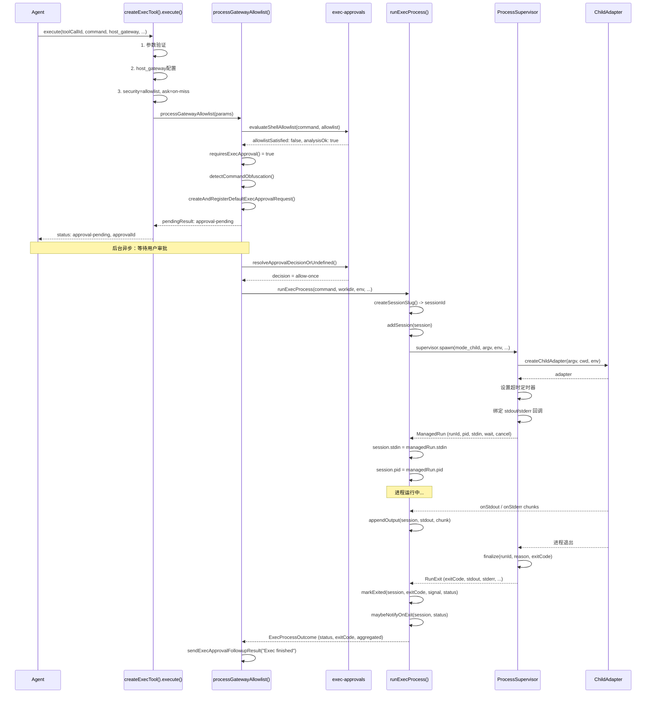

# OpenClaw `exec` 工具详细实现分析

---

## 一、exec 的定义

`exec` 是 OpenClaw Agent 的核心工具之一，用于**在沙箱、网关主机或远程配对节点上执行 Shell 命令**。它是一个 `AgentTool` 实例，由工厂函数 [createExecTool](file:///d:/prj/openclaw_analyze/src/agents/bash-tools.exec.ts#L202) 创建，默认导出为 [execTool](file:///d:/prj/openclaw_analyze/src/agents/bash-tools.exec.ts#L790)。

### 1.1 参数 Schema（execSchema）

定义在 [bash-tools.exec-runtime.ts](file:///d:/prj/openclaw_analyze/src/agents/bash-tools.exec-runtime.ts#L138-L196)：

| 参数 | 类型 | 必填 | 默认值 | 说明 |
|------|------|------|--------|------|
| `command` | `string` | ✅ | - | 要执行的 Shell 命令 |
| `workdir` | `string` | ❌ | `process.cwd()` | 工作目录 |
| `env` | `Record<string, string>` | ❌ | - | 环境变量覆盖 |
| `yieldMs` | `number` | ❌ | `10000` | 等待毫秒数后自动转入后台 |
| `background` | `boolean` | ❌ | `false` | 是否立即后台执行 |
| `timeout` | `number` | ❌ | `1800`（秒） | 超时自动 kill |
| `pty` | `boolean` | ❌ | `false` | 是否使用伪终端（PTY） |
| `elevated` | `boolean` | ❌ | `false` | 是否在主机上提权执行 |
| `host` | `"sandbox" \| "gateway" \| "node"` | ❌ | `"sandbox"` | 执行位置 |
| `security` | `"deny" \| "allowlist" \| "full"` | ❌ | 沙箱默认`deny`，主机默认`allowlist` | 安全策略 |
| `ask` | `"off" \| "on-miss" \| "always"` | ❌ | `"on-miss"` | 审批询问策略 |
| `node` | `string` | ❌ | - | 远程节点 ID（host=node 时） |

### 1.2 返回结果类型（ExecToolDetails）

定义在 [bash-tools.exec-types.ts](file:///d:/prj/openclaw_analyze/src/agents/bash-tools.exec-types.ts#L45-L77)：

```typescript
type ExecToolDetails =
  | { status: "running";        sessionId; pid?; startedAt; cwd?; tail? }      // 后台运行中
  | { status: "completed"|"failed"; exitCode; durationMs; aggregated; cwd? }    // 执行完成/失败
  | { status: "approval-pending"; approvalId; expiresAtMs; host; command; ... } // 等待审批
  | { status: "approval-unavailable"; reason; host; command; ... }              // 审批不可用
```

---

## 二、exec 支持的场景（六种核心场景）

exec 工具根据 **`host`** 参数和 **执行模式** 的组合，支持以下六种核心场景：

| 编号 | 场景 | host | 模式 | 说明 |
|------|------|------|------|------|
| **S1** | 沙箱-普通子进程 | `sandbox` | child（默认） | 在 Docker 容器内执行命令 |
| **S2** | 沙箱-PTY 模式 | `sandbox` | child+`-t` | 在 Docker 容器内以 TTY 模式执行 |
| **S3** | 网关-无需审批 | `gateway` | child | allowlist 命中或 security=full，直接执行 |
| **S4** | 网关-需要审批 | `gateway` | child/PTY | allowlist 未命中，等待用户审批后执行 |
| **S5** | 节点-无需审批 | `node` | system.run | 远程节点 allowlist 命中，直接执行 |
| **S6** | 节点-需要审批 | `node` | system.run | 远程节点 allowlist 未命中，等待审批后执行 |
| **额外** | elevated 提权 | 强制→`gateway` | child | 在主机上以 full 权限执行，绕过所有审批 |

---

## 三、整体执行流程（总览）

```
createExecTool() 返回的 execute() 函数
  │
  ├─ 1. 参数验证（command 非空）
  │
  ├─ 2. 后台执行配置（yieldWindow / background）
  │
  ├─ 3. elevated 提权检查（enabled + allowed + defaultLevel）
  │
  ├─ 4. host 配置解析（sandbox/gateway/node）
  │    └─ 非提权请求不能切换 host
  │
  ├─ 5. security/ask 配置（deny/allowlist/full, off/on-miss/always）
  │
  ├─ 6. 工作目录 & 环境变量处理
  │
  ├─ 7. 根据 host 分发：
  │    ├─ [host=node]  → executeNodeHostCommand()
  │    ├─ [host=gateway + 需要审批] → processGatewayAllowlist() → pendingResult
  │    └─ [host=gateway/sandbox] → 继续
  │
  ├─ 8. 预检：validateScriptFileForShellBleed()
  │
  ├─ 9. 核心执行：runExecProcess() → supervisor.spawn()
  │
  ├─ 10. 处理 yield（后台化）/ 等待完成
  │
  └─ 11. 返回结果（running / completed / failed / approval-pending）
```

---

## 四、每种场景的详细实现流程及代码

### S1: 沙箱-普通子进程（host=sandbox，默认）

**文件入口**: [bash-tools.exec.ts](file:///d:/prj/openclaw_analyze/src/agents/bash-tools.exec.ts#L427-L448)

**流程**：

```
1. host = "sandbox"（默认）
2. 解析 sandbox 配置 → 获取容器名、工作目录、容器内路径
3. resolveSandboxWorkdir() 将宿主机工作目录映射到容器内路径
4. buildSandboxEnv() 构建沙箱环境变量
5. 跳过 gateway allowlist / node 分支
6. runExecProcess() → spawnSpec:
   mode: "child"
   argv: ["docker", "exec", "-i", "-w", containerWorkdir, ...envArgs, containerName, "/bin/sh", "-lc", command]
   env: process.env（宿主环境）
   stdinMode: "pipe-closed"
7. supervisor.spawn() → createChildAdapter() → 实际执行
```

**关键代码**（[bash-tools.exec-runtime.ts:L543-L561](file:///d:/prj/openclaw_analyze/src/agents/bash-tools.exec-runtime.ts#L543-L561)）：

```typescript
if (opts.sandbox) {
  return {
    mode: "child" as const,
    argv: [
      "docker",
      ...buildDockerExecArgs({
        containerName: opts.sandbox.containerName,
        command: execCommand,
        workdir: opts.containerWorkdir ?? opts.sandbox.containerWorkdir,
        env: shellRuntimeEnv,
        tty: opts.usePty,
      }),
    ],
    env: process.env,
    stdinMode: opts.usePty ? ("pipe-open" as const) : ("pipe-closed" as const),
  };
}
```

**Docker args 构建**（[bash-tools.shared.ts:L54-L90](file:///d:/prj/openclaw_analyze/src/agents/bash-tools.shared.ts#L54-L90)）：

```typescript
export function buildDockerExecArgs(params) {
  const args = ["exec", "-i"];  // -i 保持 stdin 打开
  if (params.tty) args.push("-t");  // PTY 模式加 -t
  if (params.workdir) args.push("-w", params.workdir);
  // 逐项添加 -e KEY=VALUE，跳过 PATH（通过 OPENCLAW_PREPEND_PATH 单独处理）
  // 使用 /bin/sh -lc 作为 login shell 执行
  args.push(params.containerName, "/bin/sh", "-lc", `${pathExport}${params.command}`);
  return args;
}
```

---

### S2: 沙箱-PTY 模式（host=sandbox + pty=true）

与 S1 相同，只是 `buildDockerExecArgs` 中 `tty=true` 会添加 `-t` 参数给 Docker exec，开启伪终端。

---

### S3: 网关-无需审批（host=gateway，allowlist 命中或 security=full）

**文件入口**: [bash-tools.exec.ts:L606-L628](file:///d:/prj/openclaw_analyze/src/agents/bash-tools.exec.ts#L606-L628)

**流程**：

```
1. host = "gateway"
2. processGatewayAllowlist() 被调用
3. evaluateShellAllowlist() 评估命令是否在白名单中
4. allowlistSatisfied = true（命令命中 allowlist）
5. buildEnforcedShellCommand() → 构建经过强化的安全命令
6. 返回 { execCommandOverride: enforcedCommand }
7. 继续到 runExecProcess():
   mode: "child"
   argv: [shell, shellArgs, execCommandOverride]
   env: sanitizeHostBaseEnv(coerceEnv(process.env))  ← 清理危险变量
   stdinMode: "pipe-closed"
```

**关键：环境变量清理**（[bash-tools.exec-runtime.ts:L46-L66](file:///d:/prj/openclaw_analyze/src/agents/bash-tools.exec-runtime.ts#L46-L66)）：

```typescript
export function sanitizeHostBaseEnv(env: Record<string, string>): Record<string, string> {
  const sanitized: Record<string, string> = {};
  for (const [key, value] of Object.entries(env)) {
    const upperKey = key.toUpperCase();
    if (upperKey === "PATH") { sanitized[key] = value; continue; }
    if (isDangerousHostEnvVarName(upperKey)) { continue; }  // 跳过 LD_PRELOAD 等危险变量
    sanitized[key] = value;
  }
  return sanitized;
}
```

---

### S4: 网关-需要审批（host=gateway，allowlist 未命中）

**文件入口**: [bash-tools.exec-host-gateway.ts:L57-L318](file:///d:/prj/openclaw_analyze/src/agents/bash-tools.exec-host-gateway.ts#L57-L318)

**流程**：

```
1. processGatewayAllowlist() 被调用
2. resolveExecHostApprovalContext() → 获取 agent 级别的 security/ask 配置
3. evaluateShellAllowlist() → 评估命令，发现 allowlistSatisfied = false
4. requiresExecApproval() 返回 true（ask=on-miss 且未命中）
5. 检测命令混淆：detectCommandObfuscation()
6. 创建审批请求：
   createAndRegisterDefaultExecApprovalRequest()
   → registerExecApprovalRequestForHostOrThrow()
7. 立即返回 pendingResult（status: "approval-pending"）
8. 后台异步等待审批决策，审批通过后在后台执行命令
```

**审批通过后的后台执行**（[bash-tools.exec-host-gateway.ts:L255-L295](file:///d:/prj/openclaw_analyze/src/agents/bash-tools.exec-host-gateway.ts#L255-L295)）：

```typescript
// 审批通过后，在后台异步执行
run = await runExecProcess({
  command: params.command,
  execCommand: enforcedCommand,
  workdir: params.workdir,
  env: params.env,
  // ...
});
markBackgrounded(run.session);
const outcome = await run.promise;
// 发送 Exec finished 系统事件通知
```

---

### S5: 节点-无需审批（host=node，allowlist 命中或 security=full）

**文件入口**: [bash-tools.exec-host-node.ts:L57-L385](file:///d:/prj/openclaw_analyze/src/agents/bash-tools.exec-host-node.ts#L57-L385)

**流程**：

```
1. executeNodeHostCommand() 被调用
2. 解析节点绑定：boundNode 优先级 > requestedNode
3. listNodes() → 获取可用节点列表
4. resolveNodeIdFromList() → 匹配目标节点
5. 检查节点是否支持 system.run 命令
6. buildNodeShellCommand() → 构建适配节点平台的 Shell 命令
7. callGatewayTool("node.invoke", "system.run.prepare") → 在节点上准备执行计划
8. evaluateShellAllowlist() → 评估命令（先从节点拉取审批文件）
9. 无需审批：直接 callGatewayTool("node.invoke", "system.run") → 执行
10. 返回同步结果（status: completed/failed）
```

---

### S6: 节点-需要审批（host=node，allowlist 未命中）

与 S5 类似，但在评估后 `requiresAsk = true`：
- 立即返回 `approval-pending` 状态
- 后台异步等待审批决策
- 审批通过后调用 `callGatewayTool("node.invoke", "system.run")` 执行
- 执行完成后发送 `Exec finished` 通知

---

### 额外场景：elevated 提权执行

当 `elevated=true` 且配置允许时：

1. 强制 `host = "gateway"`（在主机上执行）
2. 如果 `elevatedDefaultLevel = "full"`，强制 `security = "full"` 且 `ask = "off"`，`bypassApprovals = true`
3. 完全绕过所有审批检查，直接在主机执行

---

## 五、涉及的类与组件

### 5.1 核心类/组件

| 组件 | 文件 | 角色 |
|------|------|------|
| `ProcessSupervisor` | [supervisor/types.ts](file:///d:/prj/openclaw_analyze/src/process/supervisor/types.ts#L100-L106) | 进程管理器接口 |
| `ManagedRun` | [supervisor/types.ts](file:///d:/prj/openclaw_analyze/src/process/supervisor/types.ts#L47-L53) | 单个进程运行的句柄 |
| `RunRegistry` | [supervisor/registry.ts](file:///d:/prj/openclaw_analyze/src/process/supervisor/registry.ts) | 运行记录注册表 |
| `ProcessSession` | [bash-process-registry.ts](file:///d:/prj/openclaw_analyze/src/agents/bash-process-registry.ts#L27-L56) | 会话级进程状态 |
| `SpawnProcessAdapter` | [supervisor/types.ts](file:///d:/prj/openclaw_analyze/src/process/supervisor/types.ts#L60-L68) | 进程适配器接口 |

### 5.2 关键类型

| 类型 | 文件 | 说明 |
|------|------|------|
| `ExecToolDefaults` | [bash-tools.exec-types.ts:L6-L37](file:///d:/prj/openclaw_analyze/src/agents/bash-tools.exec-types.ts#L6-L37) | exec 工具的默认配置 |
| `ExecToolDetails` | [bash-tools.exec-types.ts:L45-L77](file:///d:/prj/openclaw_analyze/src/agents/bash-tools.exec-types.ts#L45-L77) | exec 执行结果类型 |
| `ExecElevatedDefaults` | [bash-tools.exec-types.ts:L39-L43](file:///d:/prj/openclaw_analyze/src/agents/bash-tools.exec-types.ts#L39-L43) | 提权配置 |
| `ExecHost` | [exec-approvals.ts:L36](file:///d:/prj/openclaw_analyze/src/infra/exec-approvals.ts#L36) | `"sandbox" \| "gateway" \| "node"` |
| `ExecSecurity` | [exec-approvals.ts:L42](file:///d:/prj/openclaw_analyze/src/infra/exec-approvals.ts#L42) | `"deny" \| "allowlist" \| "full"` |
| `ExecAsk` | [exec-approvals.ts:L49](file:///d:/prj/openclaw_analyze/src/infra/exec-approvals.ts#L49) | `"off" \| "on-miss" \| "always"` |
| `SpawnInput` | [supervisor/types.ts:L70-L98](file:///d:/prj/openclaw_analyze/src/process/supervisor/types.ts#L70-L98) | spawn 输入参数（child/pty 联合类型） |
| `RunExit` | [supervisor/types.ts:L36-L45](file:///d:/prj/openclaw_analyze/src/process/supervisor/types.ts#L36-L45) | 进程退出结果 |
| `RunRecord` | [supervisor/types.ts:L13-L27](file:///d:/prj/openclaw_analyze/src/process/supervisor/types.ts#L13-L27) | 进程运行记录 |

### 5.3 关键模块

| 模块 | 文件 | 职责 |
|------|------|------|
| `bash-tools.exec.ts` | [主执行模块](file:///d:/prj/openclaw_analyze/src/agents/bash-tools.exec.ts) | exec 工具定义、参数解析、流程编排 |
| `bash-tools.exec-runtime.ts` | [运行时模块](file:///d:/prj/openclaw_analyze/src/agents/bash-tools.exec-runtime.ts) | 环境变量清理、进程创建、输出处理 |
| `bash-tools.exec-host-gateway.ts` | [网关主机模块](file:///d:/prj/openclaw_analyze/src/agents/bash-tools.exec-host-gateway.ts) | gateway allowlist 审批流程 |
| `bash-tools.exec-host-node.ts` | [节点主机模块](file:///d:/prj/openclaw_analyze/src/agents/bash-tools.exec-host-node.ts) | 远程节点命令执行 |
| `bash-tools.exec-types.ts` | [类型定义](file:///d:/prj/openclaw_analyze/src/agents/bash-tools.exec-types.ts) | 所有 exec 相关类型 |
| `bash-tools.shared.ts` | [共享工具](file:///d:/prj/openclaw_analyze/src/agents/bash-tools.shared.ts) | Docker args、沙箱工作目录、环境变量 |
| `bash-tools.exec-host-shared.ts` | [共享审批](file:///d:/prj/openclaw_analyze/src/agents/bash-tools.exec-host-shared.ts) | 审批请求创建、决策解析、安全配置 |
| `bash-tools.exec-approval-request.ts` | [审批请求](file:///d:/prj/openclaw_analyze/src/agents/bash-tools.exec-approval-request.ts) | 注册和解析审批请求 |
| `bash-process-registry.ts` | [进程注册表](file:///d:/prj/openclaw_analyze/src/agents/bash-process-registry.ts) | 后台进程会话管理 |
| `exec-approvals.ts` | [审批基础设施](file:///d:/prj/openclaw_analyze/src/infra/exec-approvals.ts) | allowlist 评估、安全策略、审批配置 |
| `shell-utils.ts` | [Shell工具](file:///d:/prj/openclaw_analyze/src/agents/shell-utils.ts) | Shell 路径解析、二进制清理、进程树终止 |
| `supervisor/supervisor.ts` | [进程管理器](file:///d:/prj/openclaw_analyze/src/process/supervisor/supervisor.ts) | 统一子进程生命周期管理 |
| `supervisor/adapters/child.ts` | [Child 适配器](file:///d:/prj/openclaw_analyze/src/process/supervisor/adapters/child.ts) | 直生子进程 |
| `supervisor/adapters/pty.ts` | [PTY 适配器](file:///d:/prj/openclaw_analyze/src/process/supervisor/adapters/pty.ts) | 伪终端子进程 |

---

## 六、类图

```mermaid
classDiagram
    direction TB

    class AgentTool {
        +name: string
        +label: string
        +description: string
        +parameters: TSchema
        +execute(toolCallId, args, signal, onUpdate): AgentToolResult
    }
    <<interface>> AgentTool

    class ExecToolFactory {
        +createExecTool(defaults): AgentTool
    }

    AgentTool <|.. ExecToolFactory : implements

    class ExecToolDefaults {
        +host: ExecHost
        +security: ExecSecurity
        +ask: ExecAsk
        +node: string
        +pathPrepend: string[]
        +safeBins: string[]
        +elevated: ExecElevatedDefaults
        +sandbox: BashSandboxConfig
        +cwd: string
        +sessionKey: string
        +agentId: string
        +timeoutSec: number
        +backgroundMs: number
        +allowBackground: boolean
        +notifyOnExit: boolean
    }

    class ExecToolDetails {
        +status: string
        +sessionId: string
        +pid: number
        +exitCode: number
        +durationMs: number
        +aggregated: string
        +approvalId: string
        +host: string
        +cwd: string
    }

    class ExecElevatedDefaults {
        +enabled: boolean
        +allowed: boolean
        +defaultLevel: string
    }

    class ExecSchema {
        +command: string
        +workdir: string
        +env: Record
        +yieldMs: number
        +background: boolean
        +timeout: number
        +pty: boolean
        +elevated: boolean
        +host: string
        +security: string
        +ask: string
        +node: string
    }

    ExecToolFactory --> ExecToolDefaults : uses
    ExecToolFactory --> ExecToolDetails : returns
    ExecToolFactory --> ExecSchema : schema
    ExecToolDefaults --> ExecElevatedDefaults : contains

    class ProcessSupervisor {
        +spawn(input): ManagedRun
        +cancel(runId, reason)
        +cancelScope(scopeKey, reason)
        +getRecord(runId): RunRecord
        +reconcileOrphans()
    }
    <<interface>> ProcessSupervisor

    class ManagedRun {
        +runId: string
        +pid: number
        +startedAtMs: number
        +stdin: ManagedRunStdin
        +wait(): RunExit
        +cancel(reason)
    }

    class SpawnChildInput {
        +mode: string
        +argv: string[]
        +stdinMode: string
        +cwd: string
        +env: ProcessEnv
        +timeoutMs: number
    }

    class SpawnPtyInput {
        +mode: string
        +ptyCommand: string
        +cwd: string
        +env: ProcessEnv
        +timeoutMs: number
    }

    class RunExit {
        +reason: TerminationReason
        +exitCode: number
        +exitSignal: Signal
        +durationMs: number
        +stdout: string
        +stderr: string
        +timedOut: boolean
    }

    class RunRecord {
        +runId: string
        +sessionId: string
        +state: string
        +startedAtMs: number
        +exitCode: number
    }

    class RunRegistry {
        +add(record)
        +updateState(runId, state, fields)
        +touchOutput(runId)
        +finalize(runId, fields)
        +get(runId): RunRecord
    }

    ProcessSupervisor --> ManagedRun : spawns
    ProcessSupervisor --> SpawnChildInput : accepts
    ProcessSupervisor --> SpawnPtyInput : accepts
    ProcessSupervisor --> RunRegistry : uses
    RunRegistry --> RunRecord : manages

    class ProcessSession {
        +id: string
        +command: string
        +scopeKey: string
        +sessionKey: string
        +pid: number
        +startedAt: number
        +cwd: string
        +exited: boolean
        +backgrounded: boolean
        +aggregated: string
        +tail: string
        +truncated: boolean
        +notifyOnExit: boolean
    }

    class ProcessRegistry {
        +addSession(session)
        +getSession(id): ProcessSession
        +getFinishedSession(id): FinishedSession
        +deleteSession(id)
        +appendOutput(session, stream, chunk)
        +drainSession(session): string
        +markExited(session, code, signal, status)
        +markBackgrounded(session)
        +tail(aggregated, len): string
    }

    ProcessRegistry --> ProcessSession : manages

    class ExecApprovalsFile {
        +defaults: object
        +agents: map
    }

    class ExecApprovalsEngine {
        +evaluateShellAllowlist(params): AllowlistEval
        +buildEnforcedShellCommand(params): EnforcedCmdResult
        +requiresExecApproval(params): boolean
        +normalizeExecHost(value): ExecHost
        +normalizeExecSecurity(value): ExecSecurity
        +normalizeExecAsk(value): ExecAsk
        +minSecurity(a, b): ExecSecurity
        +maxAsk(a, b): ExecAsk
        +loadExecApprovals(): ExecApprovalsFile
        +resolveExecApprovals(agentId, overrides)
    }

    class GatewayHostExecutor {
        +processGatewayAllowlist(params): ProcessGatewayAllowlistResult
    }

    class GatewayAllowlistParams {
        +command: string
        +workdir: string
        +env: Record
        +pty: boolean
        +security: ExecSecurity
        +ask: ExecAsk
        +safeBins: Set
        +safeBinProfiles: Record
        +agentId: string
        +sessionKey: string
    }

    GatewayHostExecutor --> ExecApprovalsEngine : uses
    GatewayHostExecutor --> GatewayAllowlistParams : input

    class NodeHostExecutor {
        +executeNodeHostCommand(params): AgentToolResult
    }

    class NodeHostParams {
        +command: string
        +workdir: string
        +env: Record
        +requestedNode: string
        +boundNode: string
        +security: ExecSecurity
        +ask: ExecAsk
    }

    NodeHostExecutor --> ExecApprovalsEngine : uses
    NodeHostExecutor --> NodeHostParams : input

    class ShellUtils {
        +getShellConfig(): ShellConfig
        +resolvePowerShellPath(): string
        +sanitizeBinaryOutput(text): string
        +killProcessTree(pid)
    }

    class SandboxUtils {
        +buildSandboxEnv(params): Record
        +buildDockerExecArgs(params): string[]
        +resolveSandboxWorkdir(params): WorkdirResult
        +resolveWorkdir(workdir, warnings): string
    }

    class ExecPreflight {
        +validateScriptFileForShellBleed(params)
        +extractScriptTargetFromCommand(cmd): ScriptTarget
    }

    ExecToolFactory --> ProcessSupervisor : calls
    ExecToolFactory --> ProcessRegistry : manages
    ExecToolFactory --> GatewayHostExecutor : host_gateway
    ExecToolFactory --> NodeHostExecutor : host_node
    ExecToolFactory --> ShellUtils : uses
    ExecToolFactory --> SandboxUtils : uses
    ExecToolFactory --> ExecPreflight : preflight
    ExecToolFactory --> ExecApprovalsEngine : security
    ExecToolFactory ..> ManagedRun : returns

    GatewayHostExecutor --> ExecToolFactory : calls_back
    NodeHostExecutor --> ExecApprovalsEngine : evaluates
```



---

## 七、核心流程时序图（以 gateway + 需要审批为例）



---

## 八、关键实现细节

### 8.1 后台执行（Yield）机制

exec 支持两种后台化方式：
- **`background: true`**：立即后台执行，`yieldWindow = 0`，直接调用 `onYieldNow()`
- **`yieldMs: N`**：等待 N 毫秒后如果进程还未结束则转入后台

后台化后返回 `status: "running"`，用户可以通过 `process` 工具（list/poll/log/write/kill/clear/remove）进行后续操作。

### 8.2 安全分层

exec 实现了三层安全策略：

| 层级 | 变量 | 值 | 说明 |
|------|------|------|------|
| 安全模式 | `security` | `deny` / `allowlist` / `full` | 控制哪些命令允许执行 |
| 询问模式 | `ask` | `off` / `on-miss` / `always` | 控制何时需要用户审批 |
| 提权模式 | `elevated` | `true` / `false` | 控制是否绕过沙箱直接在主机执行 |

- 沙箱默认 `security=deny`，主机默认 `security=allowlist`
- elevated + full 模式完全绕过所有安全检查（`bypassApprovals = true`）
- 主机执行时强制清理危险环境变量（`LD_PRELOAD`、`DYLD_*` 等），禁止用户自定义 `PATH`

### 8.3 Shell 选择策略

- **非 Windows**：优先使用 `$SHELL`；如果 `$SHELL` 是 `fish`，则降级到 `bash` 或 `sh`（因为 fish 与常见脚本语法不兼容）
- **Windows**：优先查找 PowerShell 7 (`pwsh`)，依次检查 `Program Files`、`ProgramW6432`、`PATH`，最后回退到 Windows PowerShell 5.1
- 所有模式都会在子进程环境中设置 `OPENCLAW_SHELL=exec`

### 8.4 脚本预检（Preflight）

[validateScriptFileForShellBleed](file:///d:/prj/openclaw_analyze/src/agents/bash-tools.exec.ts#L99-L172) 在执行前检查脚本文件，捕获常见的模型错误：

1. **Shell 变量泄漏**：检测 Python/JS 脚本中是否误用了 `$VAR` 语法（应使用 `os.environ.get()` 或 `process.env`）
2. **Shell 命令写入 JS 文件**：检测 `.js` 文件是否以 `NODE ...` 等 shell 语法开头
3. 仅在文件大小 < 512KB 且位于 workdir 边界内时进行检查

### 8.5 命令混淆检测

[detectCommandObfuscation](file:///d:/prj/openclaw_analyze/src/infra/exec-obfuscation-detect.ts) 在 gateway/node 执行前检测命令混淆模式，检测到混淆时强制要求审批。

### 8.6 进程超时控制

ProcessSupervisor 支持两种超时：
- **整体超时（overall-timeout）**：基于 `timeout` 参数，默认 1800 秒
- **无输出超时（no-output-timeout）**：进程长时间无输出时自动终止

两种超时都会触发 `SIGKILL` 终止进程树。

### 8.7 退出通知

后台进程退出时，如果 `notifyOnExit=true`：
- 发送 `enqueueSystemEvent` 系统事件
- 触发 `requestHeartbeatNow` 确保通知被及时送达

---

## 九、关键代码文件索引

| 文件 | 路径 | 说明 |
|------|------|------|
| 主执行模块 | `src/agents/bash-tools.exec.ts` | exec 工具工厂函数、参数解析、流程编排 |
| 运行时模块 | `src/agents/bash-tools.exec-runtime.ts` | 环境变量清理、进程创建、输出处理、execSchema |
| 类型定义 | `src/agents/bash-tools.exec-types.ts` | ExecToolDefaults、ExecToolDetails、ExecElevatedDefaults |
| 网关主机执行 | `src/agents/bash-tools.exec-host-gateway.ts` | gateway allowlist 审批流程 |
| 节点主机执行 | `src/agents/bash-tools.exec-host-node.ts` | 远程节点命令执行 |
| 共享审批模块 | `src/agents/bash-tools.exec-host-shared.ts` | 审批请求创建、决策解析 |
| 审批请求注册 | `src/agents/bash-tools.exec-approval-request.ts` | 审批注册与回调 |
| 共享工具 | `src/agents/bash-tools.shared.ts` | Docker args、沙箱环境、工作目录 |
| 进程注册表 | `src/agents/bash-process-registry.ts` | 后台进程会话管理 |
| Shell 工具 | `src/agents/shell-utils.ts` | Shell 路径解析、二进制清理 |
| 审批基础设施 | `src/infra/exec-approvals.ts` | allowlist 评估、安全策略枚举 |
| 进程管理器 | `src/process/supervisor/supervisor.ts` | ProcessSupervisor 实现 |
| 进程管理器类型 | `src/process/supervisor/types.ts` | ManagedRun、RunExit、SpawnInput 等 |
| Child 适配器 | `src/process/supervisor/adapters/child.ts` | 直生子进程 |
| PTY 适配器 | `src/process/supervisor/adapters/pty.ts` | 伪终端子进程 |
