# Python 脚本特殊处理完整分析

## 一、整体流程图（用户输入 → 任务执行完成）

```mermaid
flowchart TD
    subgraph Input["用户输入层"]
        A["用户发送消息\nSlack/Discord/IRC等渠道"] --> B["渠道解析与preflight"]
    end

    subgraph Dispatch["任务分发层"]
        B --> C["auto-reply/dispatch.ts\n消息分发与路由"]
        C --> D["auto-reply/reply.ts\n构造Agent运行参数"]
        D --> E["agents/pi-tools.ts\ncreateOpenClawCodingTools"]
    end

    subgraph ToolReg["工具注册层"]
        E --> F["resolveExecConfig\n合并全局与Agent exec配置"]
        F --> G["createExecTool-defaults\nbash-tools.exec.ts"]
        G --> H["resolveExecSafeBinRuntimePolicy\nexec-safe-bin-runtime-policy.ts"]
        H --> H1{"Python在safeBins中?"}
        H1 -->|"是但无hardened profile"| H2["警告日志\ninterpreter/runtime binaries\nin safeBins are unsafe"]
        H1 -->|否| H3["继续"]
        H2 --> H3
    end

    subgraph Security["安全与审批层"]
        H3 --> I{"host?"}
        I -->|sandbox| I1["Docker沙箱执行"]
        I -->|gateway| I2["网关主机执行"]
        I -->|node| I3["远程节点执行"]

        I2 --> J["processGatewayAllowlist\nbash-tools.exec-host-gateway.ts"]
        J --> J1["detectCommandObfuscation\nexec-obfuscation-detect.ts"]
        J1 --> J2{"python -c编码混淆?"}
        J2 -->|是| J3["强制审批\npython-exec-encoded"]
        J2 -->|否| J4["继续"]
        J3 --> K
        J4 --> K{"审批结果?"}

        I3 --> I3A["resolveMutableFileOperandSnapshotSync\ninvoke-system-run-plan.ts"]
        I3A --> I3B{"python脚本?"}
        I3B -->|是| I3C["计算脚本SHA-256哈希\n记录dev与inode"]
        I3B -->|否| I3D["常规审批"]
        I3C --> K
        I3D --> K

        K -->|需要审批| K1["返回pendingResult\n等待用户approve"]
        K -->|通过| L["继续"]

        I1 --> L
    end

    subgraph Preflight["Python预检层"]
        L --> M["validateScriptFileForShellBleed\nbash-tools.exec.ts L108-184"]
        M --> M1["extractScriptTargetFromCommand\nbash-tools.exec.ts L67-92"]
        M1 --> M2{"匹配python/python3?"}
        M2 -->|"是 kind=python"| M3["解析.py脚本路径"]
        M2 -->|否| M4["跳过预检"]
        M3 --> M5["assertSandboxPath安全检查"]
        M5 --> M6["fs.stat检查文件存在与大小"]
        M6 --> M7["fs.readFile读取脚本内容"]
        M7 --> M8["检测shell变量泄漏\nENV_VAR模式"]
        M8 --> M9{"发现ENV_VAR泄漏?"}
        M9 -->|是| M10["抛出错误\nIn Python use os.environ.get\ninstead of raw VAR"]
        M9 -->|否| M11["预检通过"]
        M10 --> ERR["返回错误给Agent/用户"]
    end

    subgraph EnvSec["环境变量安全层"]
        M4 --> N["环境处理"]
        M11 --> N
        N --> N1{"host非sandbox?"}
        N1 -->|是| N2["sanitizeHostBaseEnv\nbash-tools.exec-runtime.ts"]
        N2 --> N3["isDangerousHostEnvVarName\nhost-env-security.ts"]
        N3 --> N4{"检测PYTHONHOME/PYTHONPATH?"}
        N4 -->|是| N5["危险变量被清除\nhost-env-security-policy.json"]
        N4 -->|否| N6["保留"]
        N1 -->|"否-沙箱"| N7["保留原始环境变量"]
    end

    subgraph Exec["进程执行层"]
        N5 --> O["runExecProcess\nbash-tools.exec-runtime.ts L407"]
        N6 --> O
        N7 --> O

        O --> O1{"sandbox?"}
        O1 -->|沙箱| O2["buildDockerExecArgs\n构建docker exec命令\nbash-tools.shared.ts L52"]
        O1 -->|本地| O3{"usePty?"}
        O2 --> P["supervisor.spawn\nProcessSupervisor"]
        O3 -->|是| O4["PTY模式\nptyCommand=execCommand"]
        O3 -->|否| O5["Child模式\nargv=shell+execCommand"]
        O4 --> P
        O5 --> P
    end

    subgraph Supervise["进程监督层"]
        P --> P1["adapters/child.ts\n或adapters/pty.ts"]
        P1 --> P2["启动子进程"]
        P2 --> P3["stdout/stderr流式回调"]
        P3 --> P4["sanitizeBinaryOutput\n过滤二进制控制字符"]
        P4 --> P5["chunkString\n切片大块输出"]
        P5 --> P6["appendOutput\n追加到ProcessSession"]
    end

    subgraph Result["结果返回层"]
        P6 --> Q{"yieldWindow?"}
        Q -->|后台执行| Q1["返回running状态\nsessionId与pid"]
        Q -->|同步等待| Q2["等待进程退出"]
        Q2 --> Q3{"退出码?"}
        Q3 -->|0| Q4["completed"]
        Q3 -->|"126/127"| Q5["Shell failure\ne.g. python command not found"]
        Q3 -->|其他| Q6["failed"]
        Q1 --> R["AgentToolResult"]
        Q4 --> R
        Q5 --> R
        Q6 --> R
        ERR --> R
        R --> S["返回给LLM模型"]
    end
```



---

## 二、Python 特殊处理全景类图

```mermaid
classDiagram
    direction TB

    class createExecTool {
        +execute(toolCallId, args, signal, onUpdate): AgentToolResult
    }
    <<factory>> createExecTool

    class extractScriptTargetFromCommand {
        +extractScriptTargetFromCommand(command): ScriptTargetOrNull
    }
    <<function>> extractScriptTargetFromCommand

    class validateScriptFileForShellBleed {
        +validateScriptFileForShellBleed(command, workdir): Promise
    }
    <<function>> validateScriptFileForShellBleed

    class resolveExecSafeBinRuntimePolicy {
        +resolveExecSafeBinRuntimePolicy(params): SafeBinRuntimePolicy
    }
    <<function>> resolveExecSafeBinRuntimePolicy

    class isInterpreterLikeSafeBin {
        +isInterpreterLikeSafeBin(raw): boolean
    }
    <<function>> isInterpreterLikeSafeBin

    class HOST_ENV_SECURITY_POLICY {
        +blockedKeys: string[]
        +blockedOverrideKeys: string[]
    }

    class isDangerousHostEnvVarName {
        +isDangerousHostEnvVarName(rawKey): boolean
    }
    <<function>> isDangerousHostEnvVarName

    class sanitizeHostBaseEnv {
        +sanitizeHostBaseEnv(env): Record
    }
    <<function>> sanitizeHostBaseEnv

    class SANDBOX_PINNED_FS_MUTATION {
        +write: PythonScript
        +mkdirp: PythonScript
        +remove: PythonScript
        +rename: PythonScript
    }
    <<Python Script>> SANDBOX_PINNED_FS_MUTATION

    class fsPinnedWriteHelper {
        +LOCAL_PINNED_WRITE_PYTHON: PythonScript
    }
    <<Python Script>> fsPinnedWriteHelper

    class MUTABLE_ARGV1_INTERPRETER_PATTERNS {
        +pythonRegex: RegExp
        +nodeRegex: RegExp
    }

    class resolveMutableFileOperandIndex {
        +resolveMutableFileOperandIndex(argv, cwd): NumberOrNull
    }
    <<function>> resolveMutableFileOperandIndex

    class detectCommandObfuscation {
        +detectCommandObfuscation(command): ObfuscationDetection
    }
    <<function>> detectCommandObfuscation

    class summarizeCommandForDisplay {
        +summarizeCommandForDisplay(command): string
    }
    <<function>> summarizeCommandForDisplay

    class DEFAULT_SKILLS_WATCH_IGNORED {
        +venvPattern: RegExp
        +pycachePattern: RegExp
    }

    class ensureUvInstalled {
        +ensureUvInstalled(params): Promise
    }
    <<function>> ensureUvInstalled

    createExecTool --> extractScriptTargetFromCommand : calls
    createExecTool --> validateScriptFileForShellBleed : calls
    createExecTool --> resolveExecSafeBinRuntimePolicy : init_calls
    createExecTool --> detectCommandObfuscation : security_check
    resolveExecSafeBinRuntimePolicy --> isInterpreterLikeSafeBin : detect_python
    sanitizeHostBaseEnv --> isDangerousHostEnvVarName : filter_calls
    isDangerousHostEnvVarName --> HOST_ENV_SECURITY_POLICY : reads_blockedKeys
    SANDBOX_PINNED_FS_MUTATION --> runExecProcess : docker_exec_python3
    fsPinnedWriteHelper --> runExecProcess : local_pinned_write
    resolveMutableFileOperandIndex --> MUTABLE_ARGV1_INTERPRETER_PATTERNS : match_python
    detectCommandObfuscation --> createExecTool : python_exec_encoded
    summarizeCommandForDisplay --> createExecTool : python_label_gen
```

---

## 三、Python 特殊处理详细分析

### 3.1 处理点1：解释器识别（SafeBin分类）

**文件**：[exec-safe-bin-runtime-policy.ts](file:///d:/prj/openclaw_analyze/src/infra/exec-safe-bin-runtime-policy.ts)

**类/函数**：`isInterpreterLikeSafeBin()` (第75行)、`INTERPRETER_LIKE_SAFE_BINS` (第19行)

**处理内容**：
- `python`、`python2`、`python3`、`pypy` 被明确列入解释器类二进制的集合中
- 正则 `/^python\d+(.\d+)?$/` 匹配带版本号的 Python（如 `python3.11`）
- 当 `python` 被配置在 `tools.exec.safeBins` 中但**没有** hardened profile 时，系统发出**警告日志**

```typescript
// exec-safe-bin-runtime-policy.ts 第19-52行
const INTERPRETER_LIKE_SAFE_BINS = new Set([
  "ash", "bash", "busybox", "bun", "cmd", "cmd.exe", "cscript",
  "dash", "deno", "fish", "ksh", "lua",
  "node", "nodejs", "perl", "php", "powershell", "powershell.exe",
  "pypy", "pwsh", "pwsh.exe",
  "python", "python2", "python3",
  "ruby", "sh", "toybox", "wscript", "zsh",
]);

const INTERPRETER_LIKE_PATTERNS = [
  /^python\d+(?:\.\d+)?$/,  // 匹配 python3.11 等
  /^ruby\d+(?:\.\d+)?$/,
  /^perl\d+(?:\.\d+)?$/,
  /^php\d+(?:\.\d+)?$/,
  /^node\d+(?:\.\d+)?$/,
];
```

**安全意义**：Python 作为解释器可以执行任意代码，不应该被当作"安全的" stdin-only 过滤器处理。系统提醒管理员将 Python 放到 allowlist（而非 safeBins），并保持审批提示开启。

---

### 3.2 处理点2：脚本目标提取

**文件**：[bash-tools.exec.ts](file:///d:/prj/openclaw_analyze/src/agents/bash-tools.exec.ts) 第67-92行

**函数**：`extractScriptTargetFromCommand()`

**处理内容**：
- 从命令字符串中正则匹配 `python/python3 -flag file.py` 模式
- 支持 `python -u file.py`、`python3 --flag script.py` 等形式
- 复杂命令（管道、here文档、带空格路径）返回 null 跳过预检
- 返回 `{ kind: "python", relOrAbsPath: "..." }` 用于后续预检

```typescript
// bash-tools.exec.ts 第82-86行
const pythonMatch = raw.match(/^\s*(python3?|python)\s+(?:-[^\s]+\s+)*([^\s]+\.py)\b/i);
if (pythonMatch?.[2]) {
    return { kind: "python", relOrAbsPath: pythonMatch[2] };
}
```

---

### 3.3 处理点3：Python脚本预检（Shell变量泄漏检测）

**文件**：[bash-tools.exec.ts](file:///d:/prj/openclaw_analyze/src/agents/bash-tools.exec.ts) 第108-184行

**函数**：`validateScriptFileForShellBleed()`

**处理内容**：
1. 识别 `python script.py` 命令中的 `.py` 文件
2. 将相对路径解析为绝对路径
3. 调用 `assertSandboxPath()` 进行沙箱路径安全检查
4. 读取文件内容（最多512KB）
5. 用正则 `/\$[A-Z_][A-Z0-9_]{1,}/g` 检测 shell 变量泄漏（如 `$DM_JSON`、`$USER`）
6. **Python 特化错误提示**：告知用户应使用 `os.environ.get("VAR")` 而非 `$VAR`

```typescript
// bash-tools.exec.ts 第157-164行
if (first) {
    const idx = first.index;
    const before = content.slice(0, idx);
    const line = before.split("\n").length;
    const token = first[0];
    throw new Error(
        [
            `exec preflight: detected likely shell variable injection (${token}) in ${target.kind} script: ${path.basename(absPath)}:${line}.`,
            target.kind === "python"
                ? `In Python, use os.environ.get(${JSON.stringify(token.slice(1))}) instead of raw ${token}.`
                : `In Node.js, use process.env[${JSON.stringify(token.slice(1))}] instead of raw ${token}.`,
            "(If this is inside a string literal on purpose, escape it or restructure the code.)",
        ].join("\n"),
    );
}
```

**这个预检的目的**：LLM 模型经常错误地将 shell 语法（如 `$DM_JSON`）写入 Python 源文件。如果在 cron 循环中遇到此错误，会浪费大量 token。预检提前捕获此问题。

---

### 3.4 处理点4：危险Python环境变量清除

**文件**：[host-env-security-policy.json](file:///d:/prj/openclaw_analyze/src/infra/host-env-security-policy.json)

**类/函数**：`sanitizeHostBaseEnv()` -> `isDangerousHostEnvVarName()` (bash-tools.exec-runtime.ts 第64行 / host-env-security.ts 第62行)

**被阻止的 Python 相关变量**：

| 变量名 | 阻止类型 | 原因 |
|--------|----------|------|
| `PYTHONHOME` | blockedKeys | 改变Python模块搜索路径，可导致代码注入 |
| `PYTHONPATH` | blockedKeys | 同上，可引入恶意模块 |
| `PYTHONSTARTUP` | blockedOverrideKeys | 指定启动时自动执行的Python脚本 |

**执行位置**：当 `host !== "sandbox"`（即在网关主机或远程节点上）执行命令时，这些变量被主动清除：

```typescript
// bash-tools.exec-runtime.ts 第64-78行
export function sanitizeHostBaseEnv(env: Record<string, string>): Record<string, string> {
    const sanitized: Record<string, string> = {};
    for (const [key, value] of Object.entries(env)) {
        const upperKey = key.toUpperCase();
        if (upperKey === "PATH") {
            sanitized[key] = value;
            continue;
        }
        if (isDangerousHostEnvVarName(upperKey)) {
            continue; // 跳过 PYTHONHOME, PYTHONPATH, PYTHONSTARTUP 等
        }
        sanitized[key] = value;
    }
    return sanitized;
}
```

---

### 3.5 处理点5：沙箱文件操作使用Python脚本（防TOCTOU攻击）

**文件**：[fs-bridge-mutation-python-source.ts](file:///d:/prj/openclaw_analyze/src/agents/sandbox/fs-bridge-mutation-python-source.ts)

**内嵌 Python 脚本**：`SANDBOX_PINNED_FS_MUTATION_PYTHON`

**处理内容**：
- 沙箱中的文件操作（write/mkdirp/remove/rename）不是通过 shell 命令，而是通过一个**内嵌的 Python 脚本**来执行
- 使用 `subprocess.run(argv, check=True, pass_fds=tuple(pass_fds))` —— **无 shell 参数**，避免命令注入
- 使用 `dir_fd` 安全地在目录内打开文件，防止 TOCTOU 竞争攻击
- 原子写入通过临时文件 + `os.replace()` 实现
- 使用 `O_DIRECTORY` 确保打开的确实是目录
- 使用 `O_NOFOLLOW` 不跟踪符号链接，防止链接逃逸攻击
- 使用 `O_EXCL` 排他性创建临时文件

```python
# 关键安全设计片段
DIR_FLAGS = os.O_RDONLY
if hasattr(os, "O_DIRECTORY"):
    DIR_FLAGS |= os.O_DIRECTORY
if hasattr(os, "O_NOFOLLOW"):
    DIR_FLAGS |= os.O_NOFOLLOW

WRITE_FLAGS = os.O_WRONLY | os.O_CREAT | os.O_EXCL
if hasattr(os, "O_NOFOLLOW"):
    WRITE_FLAGS |= os.O_NOFOLLOW

def open_dir(path, dir_fd=None):
    return os.open(path, DIR_FLAGS, dir_fd=dir_fd)

def walk_parent(root_fd, rel_parent, mkdir_enabled):
    current_fd = os.dup(root_fd)
    try:
        segments = [segment for segment in rel_parent.split("/") if segment and segment != "."]
        for segment in segments:
            if segment == "..":
                raise OSError("path traversal is not allowed")
            try:
                next_fd = open_dir(segment, dir_fd=current_fd)
            except FileNotFoundError:
                if not mkdir_enabled:
                    raise
                os.mkdir(segment, 0o777, dir_fd=current_fd)
                next_fd = open_dir(segment, dir_fd=current_fd)
            os.close(current_fd)
            current_fd = next_fd
        return current_fd
    except Exception:
        os.close(current_fd)
        raise
```

**调用方式**（[fs-bridge-mutation-helper.ts](file:///d:/prj/openclaw_analyze/src/agents/sandbox/fs-bridge-mutation-helper.ts) 第254-262行）：
```typescript
function buildPinnedMutationPlan(params: {
  args: string[];
  checks: PathSafetyCheck[];
}): SandboxFsCommandPlan {
  return {
    checks: params.checks,
    recheckBeforeCommand: true,
    // 通过文件描述符 3 传递 Python 源码，stdin 保留给 payload 数据
    script: [
      "set -eu",
      "python3 /dev/fd/3 \"$@\" 3<<'PY'",
      SANDBOX_PINNED_MUTATION_PYTHON,
      "PY",
    ].join("\n"),
    args: params.args,
  };
}
```

**支持的操作**：
- `write`: 通过临时文件 + `os.replace()` 实现原子安全写入
- `mkdirp`: 递归创建目录（处理 OSError 异常）
- `remove`: 支持递归删除（`-r`）和强制删除（`-f`）
- `rename`: 支持跨文件系统移动（处理 EXDEV 错误），包括目录递归复制

---

### 3.6 处理点6：本机文件安全写入（使用Python）

**文件**：[fs-pinned-write-helper.ts](file:///d:/prj/openclaw_analyze/src/infra/fs-pinned-write-helper.ts)

**常量**：`LOCAL_PINNED_WRITE_PYTHON` (第13行)

**处理内容**：
- 类似于沙箱文件操作，本机文件的安全写入也使用内嵌的 Python 脚本
- 通过 `spawn('python3', [...])` 执行，数据通过 stdin 管道传递
- 使用 `O_NOFOLLOW | O_EXCL` 防止符号链接攻击和排他创建
- 通过文件描述符级操作确保写入目标不会在操作中途被替换

---

### 3.7 处理点7：Shell退出码的Python特化处理

**文件**：[bash-tools.exec-runtime.ts](file:///d:/prj/openclaw_analyze/src/agents/bash-tools.exec-runtime.ts) 第707-720行

**处理内容**：
- 退出码 127 被识别为 `"Command not found"`（如 `python: command not found`）
- 退出码 126 被识别为 `"Command not executable"`（如 Python 脚本权限拒绝）
- 这两种情况被视为**基础设施故障**（而非正常完成），作为错误抛出

```typescript
// bash-tools.exec-runtime.ts 第707-720行
const isShellFailure = exitCode === 126 || exitCode === 127;
const status: "completed" | "failed" =
    isNormalExit && !isShellFailure ? "completed" : "failed";

const reason = isShellFailure
    ? exitCode === 127
        ? "Command not found"
        : "Command not executable (permission denied)"
    : /* ... timeout/signal handling ... */;
```

### 3.8 处理点8：命令审批绑定（Python解释器的可变脚本文件识别）

**文件**：[invoke-system-run-plan.ts](file:///d:/prj/openclaw_analyze/src/node-host/invoke-system-run-plan.ts) 第33行

**常量**：`MUTABLE_ARGV1_INTERPRETER_PATTERNS`

**处理内容**：
- 在审批绑定（approval binding）系统中，Python 被识别为"可变脚本运行器"
- 正则 `/^python(?:\d+(?:\.\d+)*)?$/` 匹配所有 Python 版本（python, python3, python3.12 等）
- 当命令是 `python script.py` 形式时，系统会对脚本文件计算 SHA-256 哈希并记录设备号/inode号
- 后续重复执行相同命令时，会校验脚本文件是否被篡改（TOCTOU 防护）
- 如果 Python 解释器命令无法安全绑定（例如脚本路径无法解析），审批会被拒绝

```typescript
// invoke-system-run-plan.ts 第32-38行
const MUTABLE_ARGV1_INTERPRETER_PATTERNS = [
  /^(?:node|nodejs)$/,
  /^perl$/,
  /^php$/,
  /^python(?:\d+(?:\.\d+)*)?$/,  // 匹配 python, python3, python3.12 等
  /^ruby$/,
] as const;
```

**关键函数** `resolveMutableFileOperandIndex()` (第399行)：
- 先通过 `unwrapArgvForMutableOperand()` 剥离包装层（npm exec、pnpm exec 等）
- 对于 Python，脚本文件参数总是 `argv[1]`（前提是它不以 `-` 开头且不是 `-`）
- 找到脚本文件后，通过 `resolveMutableFileOperandSnapshotSync()` 计算其文件身份快照

**安全意义**：审批绑定确保用户批准执行的是特定的 Python 脚本内容。如果脚本被修改，之前的审批将不再适用，需要重新审批。

---

### 3.9 处理点9：Python编码执行混淆检测

**文件**：[exec-obfuscation-detect.ts](file:///d:/prj/openclaw_analyze/src/infra/exec-obfuscation-detect.ts) 第155行

**模式ID**：`python-exec-encoded`

**处理内容**：
- 检测 `python -c "exec(base64.b64decode('...'))"` 这类编码执行混淆模式
- 匹配正则：`/(?:python[23]?|perl|ruby)\s+-[ec]\s+.*(?:base64|b64decode|decode|exec|system|eval)/i`
- 一旦检测到混淆，命令会被强制要求审批（即使安全策略是 allowlist）
- 这防止了攻击者通过编码绕过安全白名单

```typescript
// exec-obfuscation-detect.ts 第155-158行
{
  id: "python-exec-encoded",
  description: "Python/Perl/Ruby with base64 or encoded execution",
  regex: /(?:python[23]?|perl|ruby)\s+-[ec]\s+.*(?:base64|b64decode|decode|exec|system|eval)/i,
},
```

**典型被拦截的命令**：
- `python3 -c "import base64; exec(base64.b64decode('...'))"`
- `python -e "eval(open('/etc/passwd').read())"`

---

### 3.10 处理点10：工具显示标签（Python命令的人可读摘要）

**文件**：[tool-display-common.ts](file:///d:/prj/openclaw_analyze/src/agents/tool-display-common.ts) 第890行

**处理内容**：
- Python 命令在 Agent 工具调用结果中会显示为人可读的标签
- 支持多种 Python 命令形式的不同显示：
  - `python script.py` → `"run python script.py"`
  - `python -c "print(1)"` → `"run python inline script"`
  - `python <<EOF ... EOF` → `"run python inline script (heredoc)"`
  - `python` (无参数) → `"run python"`

```typescript
// tool-display-common.ts 第890-923行
if (bin === "node" || bin === "python" || bin === "python3" || bin === "ruby" || bin === "php") {
    const heredoc = words.slice(1).find((token) => token.startsWith("<<"));
    if (heredoc) {
      return `run ${bin} inline script (heredoc)`;
    }
    const inline =
      bin === "node"
        ? optionValue(words, ["-e", "--eval"])
        : bin === "python" || bin === "python3"
          ? optionValue(words, ["-c"])   // Python 的内联脚本标志是 -c
          : undefined;
    if (inline !== undefined) {
      return `run ${bin} inline script`;
    }
    // ...脚本路径解析...
    return `run ${bin} ${script}`;
}
```

**设计目的**：让用户和开发者在 UI 中快速理解 Python 命令的意图，而非看到原始命令字符串。

---

### 3.11 处理点11：Skills系统忽略Python虚拟环境

**文件**：[refresh.ts](file:///d:/prj/openclaw_analyze/src/agents/skills/refresh.ts) 第33-39行

**常量**：`DEFAULT_SKILLS_WATCH_IGNORED`

**处理内容**：
- Skills 文件监视器（chokidar）在扫描目录时会忽略 Python 特有的目录结构
- 被忽略的模式：
  - `.venv/` — Python 虚拟环境
  - `venv/` — Python 虚拟环境
  - `__pycache__/` — Python 字节码缓存
  - `.mypy_cache/` — mypy 类型检查缓存
  - `.pytest_cache/` — pytest 测试缓存

```typescript
// refresh.ts 第33-39行
const DEFAULT_SKILLS_WATCH_IGNORED: RegExp[] = [
  // ... 其他忽略规则 ...
  // Python virtual environments and caches
  /(^|[\\/])\.venv([\\/]|$)/,
  /(^|[\\/])venv([\\/]|$)/,
  /(^|[\\/])__pycache__([\\/]|$)/,
  /(^|[\\/])\.mypy_cache([\\/]|$)/,
  /(^|[\\/])\.pytest_cache([\\/]|$)/,
];
```

**设计目的**：避免监视器遍历 Python 虚拟环境（可能包含数千个文件），导致文件描述符耗尽和性能下降。

---

### 3.12 处理点12：Skills安装支持uv（Python包管理器）

**文件**：[skills-install.ts](file:///d:/prj/openclaw_analyze/src/agents/skills-install.ts) 第144行、[frontmatter.ts](file:///d:/prj/openclaw_analyze/src/agents/skills/frontmatter.ts) 第23行、[types.ts](file:///d:/prj/openclaw_analyze/src/agents/skills/types.ts) 第5行

**类型定义**：`SkillInstallSpec.kind` 包含 `"uv"` 选项

**处理内容**：
- Skills 安装系统支持 `uv` 作为 Python 包的安装方式
- `uv` 是 Astral 开发的超高速 Python 包管理器（Rust 实现）
- 安装命令：`uv tool install <package>`
- 如果 `uv` 未安装，系统会尝试通过 `brew install uv` 自动安装
- 在 Skill 的 SKILL.md frontmatter 中，可以声明 `kind: "uv"` + `package: "uvicorn[standard]==0.31.0"`

```typescript
// skills-install.ts 第144-147行
case "uv": {
  if (!spec.package) {
    return { argv: null, error: "missing uv package" };
  }
  return { argv: ["uv", "tool", "install", spec.package] };
}
```

**uv 自动安装逻辑** (skills-install.ts 第258-280行)：
```typescript
async function ensureUvInstalled(params) {
  if (params.spec.kind !== "uv" || hasBinary("uv")) {
    return undefined;  // 非 uv 类型或已安装，跳过
  }
  if (!params.brewExe) {
    return createInstallFailure({
      message: "uv not installed — install manually: https://docs.astral.sh/uv/getting-started/installation/",
    });
  }
  const brewResult = await runCommandSafely([params.brewExe, "install", "uv"], {...});
  // ...
}
```

**frontmatter 验证** (frontmatter.ts 第23行)：
```typescript
const UV_PACKAGE_PATTERN = /^[A-Za-z0-9][A-Za-z0-9._\-[\]=<>!~+,]*$/;
```

---

## 四、完整文件/类/代码索引

| # | 处理点 | 文件 | 类/函数/常量 | 代码行 |
|---|--------|------|---------|--------|
| 1 | Python解释器分类 | [exec-safe-bin-runtime-policy.ts](file:///d:/prj/openclaw_analyze/src/infra/exec-safe-bin-runtime-policy.ts) | `INTERPRETER_LIKE_SAFE_BINS`, `INTERPRETER_LIKE_PATTERNS` | L19-52 |
| 2 | SafeBin运行时策略解析 | [exec-safe-bin-runtime-policy.ts](file:///d:/prj/openclaw_analyze/src/infra/exec-safe-bin-runtime-policy.ts) | `resolveExecSafeBinRuntimePolicy()` | L105-158 |
| 3 | 解释器检测函数 | [exec-safe-bin-runtime-policy.ts](file:///d:/prj/openclaw_analyze/src/infra/exec-safe-bin-runtime-policy.ts) | `isInterpreterLikeSafeBin()` | L75-85 |
| 4 | 脚本目标提取 | [bash-tools.exec.ts](file:///d:/prj/openclaw_analyze/src/agents/bash-tools.exec.ts) | `extractScriptTargetFromCommand()` | L67-92 |
| 5 | Python脚本预检 | [bash-tools.exec.ts](file:///d:/prj/openclaw_analyze/src/agents/bash-tools.exec.ts) | `validateScriptFileForShellBleed()` | L108-184 |
| 6 | exec工具工厂函数 | [bash-tools.exec.ts](file:///d:/prj/openclaw_analyze/src/agents/bash-tools.exec.ts) | `createExecTool()` | L182-791 |
| 7a | 危险环境变量定义 | [host-env-security-policy.json](file:///d:/prj/openclaw_analyze/src/infra/host-env-security-policy.json) | `PYTHONHOME`, `PYTHONPATH`, `PYTHONSTARTUP` | L5,6,45 |
| 7b | 环境变量清理 | [bash-tools.exec-runtime.ts](file:///d:/prj/openclaw_analyze/src/agents/bash-tools.exec-runtime.ts) | `sanitizeHostBaseEnv()` | L64-78 |
| 7c | 危险变量判断 | [host-env-security.ts](file:///d:/prj/openclaw_analyze/src/infra/host-env-security.ts) | `isDangerousHostEnvVarName()` | L62-72 |
| 7d | 环境变量安全策略 | [host-env-security.ts](file:///d:/prj/openclaw_analyze/src/infra/host-env-security.ts) | `HOST_DANGEROUS_ENV_KEY_VALUES` | L18-20 |
| 8 | 沙箱文件操作Python脚本 | [fs-bridge-mutation-python-source.ts](file:///d:/prj/openclaw_analyze/src/agents/sandbox/fs-bridge-mutation-python-source.ts) | `SANDBOX_PINNED_FS_MUTATION_PYTHON` | L1-190 |
| 9 | 沙箱操作计划构建 | [fs-bridge-mutation-helper.ts](file:///d:/prj/openclaw_analyze/src/agents/sandbox/fs-bridge-mutation-helper.ts) | `buildPinnedMutationPlan()` | L248-264 |
| 10 | 本机安全写入Python脚本 | [fs-pinned-write-helper.ts](file:///d:/prj/openclaw_analyze/src/infra/fs-pinned-write-helper.ts) | `LOCAL_PINNED_WRITE_PYTHON` | L13 |
| 11 | Shell退出码处理 | [bash-tools.exec-runtime.ts](file:///d:/prj/openclaw_analyze/src/agents/bash-tools.exec-runtime.ts) | `runExecProcess()` 中 promise.then | L707-720 |
| 12 | 核心执行函数 | [bash-tools.exec-runtime.ts](file:///d:/prj/openclaw_analyze/src/agents/bash-tools.exec-runtime.ts) | `runExecProcess()` | L407-796 |
| 13 | exec参数Schema | [bash-tools.exec-runtime.ts](file:///d:/prj/openclaw_analyze/src/agents/bash-tools.exec-runtime.ts) | `execSchema` | L158-226 |
| 14 | SafeBin配置合并 | [pi-tools.ts](file:///d:/prj/openclaw_analyze/src/agents/pi-tools.ts) | `resolveExecConfig()` | L200-225 |
| 15 | 工具创建与注册 | [pi-tools.ts](file:///d:/prj/openclaw_analyze/src/agents/pi-tools.ts) | `createOpenClawCodingTools()` | L285+ |
| 16 | 沙箱路径安全检查 | [sandbox-paths.ts](file:///d:/prj/openclaw_analyze/src/agents/sandbox-paths.ts) | `assertSandboxPath()` | 预检中的路径安全校验 |
| 17 | Docker执行参数构建 | [bash-tools.shared.ts](file:///d:/prj/openclaw_analyze/src/agents/bash-tools.shared.ts) | `buildDockerExecArgs()` | L52-99 |
| 18 | 测试覆盖 | [bash-tools.exec.script-preflight.test.ts](file:///d:/prj/openclaw_analyze/src/agents/bash-tools.exec.script-preflight.test.ts) | 多个测试用例 | L13-91 |
| 19 | 命令审批绑定-Python解释器识别 | [invoke-system-run-plan.ts](file:///d:/prj/openclaw_analyze/src/node-host/invoke-system-run-plan.ts) | `MUTABLE_ARGV1_INTERPRETER_PATTERNS` | L32-38 |
| 20 | 可变脚本文件操作数索引 | [invoke-system-run-plan.ts](file:///d:/prj/openclaw_analyze/src/node-host/invoke-system-run-plan.ts) | `resolveMutableFileOperandIndex()` | L399+ |
| 21 | 可变文件快照同步 | [invoke-system-run-plan.ts](file:///d:/prj/openclaw_analyze/src/node-host/invoke-system-run-plan.ts) | `resolveMutableFileOperandSnapshotSync()` | L440+ |
| 22 | Python编码执行混淆检测 | [exec-obfuscation-detect.ts](file:///d:/prj/openclaw_analyze/src/infra/exec-obfuscation-detect.ts) | `python-exec-encoded` 模式 | L155-158 |
| 23 | 混淆检测入口 | [exec-obfuscation-detect.ts](file:///d:/prj/openclaw_analyze/src/infra/exec-obfuscation-detect.ts) | `detectCommandObfuscation()` | 全文 |
| 24 | Python命令工具显示标签 | [tool-display-common.ts](file:///d:/prj/openclaw_analyze/src/agents/tool-display-common.ts) | Python分支逻辑 | L890-923 |
| 25 | Skills忽略Python虚拟环境 | [refresh.ts](file:///d:/prj/openclaw_analyze/src/agents/skills/refresh.ts) | `DEFAULT_SKILLS_WATCH_IGNORED` | L33-39 |
| 26 | Skills安装支持uv | [skills-install.ts](file:///d:/prj/openclaw_analyze/src/agents/skills-install.ts) | `buildInstallCommand()` uv分支 | L144-147 |
| 27 | uv自动安装 | [skills-install.ts](file:///d:/prj/openclaw_analyze/src/agents/skills-install.ts) | `ensureUvInstalled()` | L258-280 |
| 28 | uv包名验证 | [frontmatter.ts](file:///d:/prj/openclaw_analyze/src/agents/skills/frontmatter.ts) | `UV_PACKAGE_PATTERN`, `normalizeSafeUvPackage()` | L23, L83-93 |
| 29 | Skill安装类型定义 | [types.ts](file:///d:/prj/openclaw_analyze/src/agents/skills/types.ts) | `SkillInstallSpec.kind: "uv"` | L5 |

---

## 五、总结

系统对 Python 脚本的"特殊处理"可以归纳为**五个层面**：

### 1. 安全识别层

- 将 `python/python3/pypy` 归类为"解释器类型"二进制，列入 `INTERPRETER_LIKE_SAFE_BINS` 集合
- 拒绝将 Python 放入 safeBins 的自动审批快速通道（safeBins 仅适用于 stdin-only 过滤器如 `jq`）
- 将 `PYTHONHOME`/`PYTHONPATH`/`PYTHONSTARTUP` 列为危险环境变量，在非沙箱执行时主动清除
- 在命令审批绑定中，将 Python 识别为"可变脚本运行器"，对 Python 脚本文件计算 SHA-256 哈希实现防篡改审批

### 2. 预检检测层

- 执行前扫描 Python 源码中的 shell 变量泄漏（`$VAR` 语法），并给出 Python 特化的修复建议（`os.environ.get()`）
- 检测 `python -c "exec(base64.b64decode(...."))"` 等编码执行混淆模式，强制要求审批
- 退出码 127/126 的特化错误处理（区分"Python 解释器不存在"和"脚本权限错误"）

### 3. 安全运行时层

- 沙箱文件操作（write/mkdirp/remove/rename）使用内嵌 Python 脚本实现，利用 `dir_fd`、`O_NOFOLLOW`、`O_EXCL` 等 API 防御 TOCTOU 和符号链接攻击
- 本机文件安全写入同样使用 Python 脚本（`fs-pinned-write-helper.ts`），通过 `spawn('python3', ...)` 执行
- 两种 Python 脚本都实现了原子写入（临时文件 + `os.replace()`）

### 4. 用户体验层

- Python 命令在工具调用结果中显示为人可读的标签（如 "run python script.py"、"run python inline script"）
- Skills 系统的文件监视器忽略 Python 虚拟环境和缓存目录（`.venv`、`venv`、`__pycache__`、`.mypy_cache`、`.pytest_cache`）

### 5. 生态集成层

- Skills 安装系统原生支持 `uv` 包管理器（`uv tool install`），并支持自动安装 `uv`
- Skill 的 SKILL.md frontmatter 中支持 `kind: "uv"` 声明 Python 依赖

### 设计哲学

系统整体遵循 **defense in depth（纵深防御）** 的安全设计理念：

1. **配置层**：将 Python 识别为高风险解释器，限制其在安全策略中的自动通过
2. **审批层**：Python 脚本文件需要审批绑定（哈希+inode 快照），防止 TOCTOU 攻击
3. **环境层**：清除可能被利用的 Python 相关环境变量（PYTHONHOME/PYTHONPATH/PYTHONSTARTUP）
4. **代码层**：在执行前扫描 Python 源码中的常见错误模式（shell 变量泄漏、编码混淆）
5. **运行时层**：利用 Python 本身的安全 API（`dir_fd`、`O_NOFOLLOW`）实现安全沙箱操作
6. **结果层**：精确区分 Python 解释器不存在（127）和脚本权限错误（126）等基础设施故障
