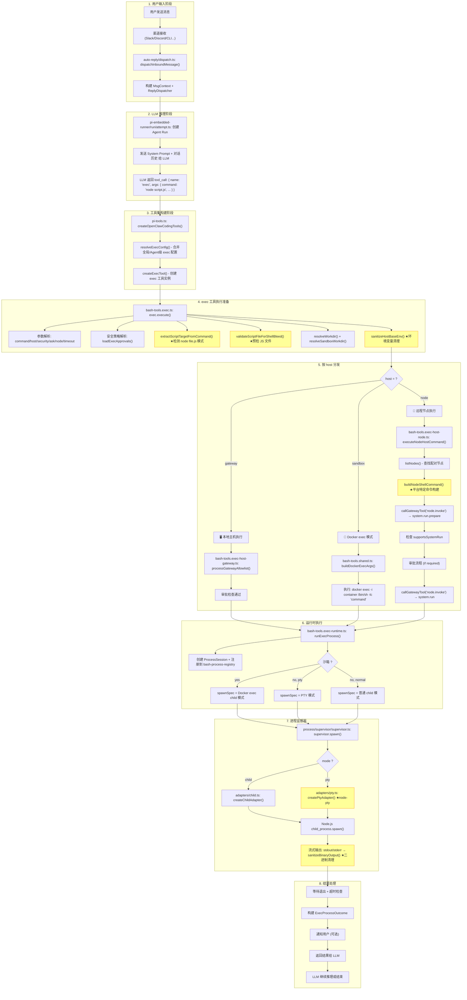

# OpenClaw 系统对 Node.js 脚本的特殊处理 —— 完整分析报告

## 一、整体流程：从用户输入到 Node.js 任务执行完成

下面是一张完整的 Mermaid 流程图，展示从用户输入 → LLM 决策 → exec 工具分发 → Node.js 执行 → 结果返回的全链路：



> 黄色节点标记了与 Node.js 脚本处理直接相关的步骤。

---

## 二、Node.js 特殊处理详解

系统对 Node.js 脚本的特化处理分布在 **6 个维度**，共涉及 **16+ 个关键文件**：

---

### 维度 1：脚本预检 —— 防止 Shell 语法泄漏到 .js 文件

**问题背景**：LLM 有时会错误地将 Shell 环境变量语法（如 `$USER`）混入 JavaScript/Python 脚本中。

**处理逻辑**：

#### 文件：`src/agents/bash-tools.exec.ts`

| 函数 | 行号 | 作用 |
|------|------|------|
| `extractScriptTargetFromCommand()` | L66-L92 | 用正则 `/^\s*(node)\s+(?:-[^\s]+\s+)*([^\s]+\.js)\b/i` 检测 `node xxx.js` 模式 |
| `validateScriptFileForShellBleed()` | L93-L184 | 读入 .js 文件内容，检测 `$VAR_NAME` 形式的 Shell 变量泄漏 |

**Node.js 特有检查**（L172-L178）：

```typescript
// 检测 JS 文件第一行是否以 NODE 开头（Shell 命令写成了 JS）
if (target.kind === "node") {
    const firstNonEmpty = content.split(/\r?\n/).map((l) => l.trim()).find((l) => l.length > 0);
    if (firstNonEmpty && /^NODE\b/.test(firstNonEmpty)) {
        throw new Error(
            `exec preflight: JS file starts with shell syntax (${firstNonEmpty}). ` +
            `This looks like a shell command, not JavaScript.`,
        );
    }
}
```

**错误消息定制**：对 Node.js 给出 `process.env["VAR"]` 替代建议，对 Python 给出 `os.environ.get()` 替代建议。

---

### 维度 2：安全配置 —— interpreter 二进制分类

#### 文件：`src/agents/bash-tools.exec.ts` (L246-L256)

在 `createExecTool()` 中，系统将 **解释器/运行时二进制**（python, node 等）单独分类为 `unprofiledInterpreterSafeBins`：

```typescript
// 解释器/运行时二进制（如 python, node）在 safeBins 中是不安全的，除非有明确的 hardened profiles
if (unprofiledInterpreterSafeBins.length > 0) {
    logInfo(
      `exec: interpreter/runtime binaries in safeBins (${unprofiledInterpreterSafeBins.join(", ")}) 
       are unsafe without explicit hardened profiles; prefer allowlist entries`,
    );
}
```

这意味着 **`node` 不能被直接放入 `safeBins`**，除非你同时配置了 `safeBinProfiles.node` 来限制其行为。

#### 文件：`src/infra/exec-safe-bin-runtime-policy.ts`

负责解析 `resolveExecSafeBinRuntimePolicy()`，区分普通 safeBin 和 interpreter/runtime safeBin。

---

### 维度 3：执行主机分发 —— host=node 的独立执行路径

当 `host=node` 时，不走本地进程启动，而是通过 Gateway RPC 委托远程配对设备执行。

#### 文件：`src/agents/bash-tools.exec-host-node.ts`

核心函数 `executeNodeHostCommand()`（L55-L300+）：

```typescript
export async function executeNodeHostCommand(params: ExecuteNodeHostCommandParams): Promise<AgentToolResult<ExecToolDetails>> {
    // 1. 安全策略解析
    const { hostSecurity, hostAsk, askFallback } = execHostShared.resolveExecHostApprovalContext({...});
    
    // 2. 节点发现
    const nodes = await listNodes({});
    const nodeId = resolveNodeIdFromList(nodes, nodeQuery, !nodeQuery);
    
    // 3. 检查节点是否支持 system.run
    const supportsSystemRun = nodeInfo?.commands?.includes("system.run");
    
    // 4. ★构建平台特定 Shell 命令
    const argv = buildNodeShellCommand(params.command, nodeInfo?.platform);
    
    // 5. 调用 system.run.prepare 生成执行计划
    const prepareRaw = await callGatewayTool("node.invoke", {...}, {
        command: "system.run.prepare",
        params: { command: argv, rawCommand: params.command, cwd, ... }
    });
    
    // 6. 白名单检查 + 命令混淆检测
    const obfuscation = detectCommandObfuscation(params.command);
    
    // 7. 审批流程 (if requiresAsk)
    // 8. 调用 system.run 实际执行
    const invokeParams = { command: "system.run", params: { command: runArgv, ... } };
}
```

---

### 维度 4：平台特定 Shell 命令构建

#### 文件：`src/infra/node-shell.ts`

```typescript
export function buildNodeShellCommand(command: string, platform?: string | null) {
    const normalized = String(platform ?? "").trim().toLowerCase();
    if (normalized.startsWith("win")) {
        return ["cmd.exe", "/d", "/s", "/c", command];  // Windows 节点
    }
    return ["/bin/sh", "-lc", command];  // Unix/macOS/Linux 节点
}
```

**Windows vs Unix 差异**：
- Windows 节点使用 `cmd.exe /d /s /c`（禁用 AutoRun、strip quotes、execute and terminate）
- Unix 节点使用 `/bin/sh -lc`（login shell，加载完整环境变量）
- macOS 和 Linux 节点走 Unix 路径

---

### 维度 5：工具显示名称 —— "run node script" 标签

#### 文件：`src/agents/tool-display-common.ts` (L912-L921)

```typescript
if (bin === "node") {
    const mode = words.includes("--check") || words.includes("-c")
        ? "check js syntax for"    // node --check script.js
        : "run node script";       // node script.js
    return `${mode} ${script}`;
}
```

当 LLM 调用 `exec` 执行 `node xxx.js` 时，工具显示层会自动生成友好的摘要描述，例如 "run node script app.js"，方便用户在 UI 中快速理解正在进行的操作。

---

### 维度 6：进程级运行时处理

#### 6.1 Shell 选择（Unix 上的 Fish Shell 回退）

#### 文件：`src/agents/shell-utils.ts` (L47-L68)

```typescript
export function getShellConfig(): { shell: string; args: string[] } {
    if (process.platform === "win32") {
        // PowerShell 替代 cmd.exe（支持管道输出重定向）
        return { shell: resolvePowerShellPath(), args: ["-NoProfile", "-NonInteractive", "-Command"] };
    }
    // Fish shell 与 bash 不兼容 → 回退到 bash
    const shellName = path.basename(envShell);
    if (shellName === "fish") {
        const bash = resolveShellFromPath("bash");
        if (bash) return { shell: bash, args: ["-c"] };
    }
    // 其他 Unix: 使用 SHELL 环境变量
    return { shell: envShell || "sh", args: ["-c"] };
}
```

**Windows 上 Node.js 特别之处**：优先使用 PowerShell 7 (`pwsh.exe`)，因为它能正确捕获 `ipconfig`/`systeminfo` 等控制台 API 的输出（cmd.exe 的管道会丢失这些输出）。

#### 6.2 二进制输出清理

#### 文件：`src/agents/shell-utils.ts` (L131-L151)

```typescript
export function sanitizeBinaryOutput(text: string): string {
    const scrubbed = text.replace(/[\p{Format}\p{Surrogate}]/gu, "");
    // 过滤 ASCII 控制字符（保留 \t \n \r）
    for (const char of scrubbed) {
        const code = char.codePointAt(0);
        if (code < 0x20) continue;  // 丢弃控制字符
        chunks.push(char);
    }
    return chunks.join("");
}
```

Node.js 脚本输出中如果包含二进制控制字符，会在此被清理。

#### 6.3 进程监督器 —— Child / PTY 两种模式

#### 文件：`src/process/supervisor/adapters/child.ts`

`createChildAdapter()` 直接使用 Node.js `child_process.spawn()` 启动子进程，支持：
- Windows 命令 shim 解析（`.cmd`/`.bat` → 包装路径）
- `stdin` 策略：`inherit` / `pipe-open` / `pipe-closed`
- 进程树终止 `killProcessTree()`

#### 文件：`src/process/supervisor/adapters/pty.ts`

`createPtyAdapter()` 使用 `@lydell/node-pty` 提供伪终端支持：
- 适用于需要 TTY 的交互式 Node.js 应用（如 `readline`、`inquirer`）
- PTY 失败时自动回退到 child 模式

#### 6.4 Windows npm/npx 特殊处理

#### 文件：`src/process/exec.ts` (L45-L68)

```typescript
function resolveNpmArgvForWindows(argv: string[]): string[] | null {
    // CVE-2024-27980 缓解措施：
    // Node.js 18.20.2+ 禁止直接 spawn .cmd/.bat 文件，必须通过 shell
    // 将 npm/npx 解析为 node + cli.js 脚本，避免 EINVAL 错误
    const cliName = basename === "npx" ? "npx-cli.js" : "npm-cli.js";
    return [process.execPath, cliPath, ...argv.slice(1)];
}
```

#### 6.5 PATH 变量隔离

#### 文件：`src/agents/bash-tools.exec-runtime.ts` (L55-L111)

Node.js 执行环境在启动前会进行严格的环境变量清理：

| 函数 | 作用 |
|------|------|
| `sanitizeHostBaseEnv()` | 继承进程 env 时过滤危险变量（保留 PATH） |
| `validateHostEnv()` | 在执行前阻止危险变量和自定义 PATH（防止二进制劫持） |
| `isDangerousHostEnvVarName()` | 黑名单检测（如 LD_PRELOAD, DYLD_INSERT_LIBRARIES 等） |

#### 文件：`src/agents/bash-tools.exec.ts` (L548-L555)

当 `host=node` 时，`pathPrepend` 配置被**显式忽略**并产生警告：

```typescript
if (host === "node" && defaultPathPrepend.length > 0) {
    warnings.push(
        "Warning: tools.exec.pathPrepend is ignored for host=node. " +
        "Configure PATH on the node host/service instead.",
    );
}
```

---

### 维度 7：Gateway 侧的 system.run 审批与转发

#### 文件：`src/gateway/node-invoke-system-run-approval.ts`

`sanitizeSystemRunParamsForForwarding()` — 对 `system.run` 的 `approved`/`approvalDecision` 字段进行受控访问：
- 普通用户不能注入这些控制字段绕过审批
- 必须通过 `exec.approval.*` 记录验证
- 检查设备身份绑定、过期时间等

#### 文件：`src/gateway/node-invoke-sanitize.ts`

`sanitizeNodeInvokeParamsForForwarding()` — 仅对 `system.run` 命令执行参数净化，其他命令原样转发。

#### 文件：`src/gateway/node-command-policy.ts`

定义了不同平台（iOS/Android/macOS/Windows/Linux）允许的节点命令集合：
- macOS/Linux/Windows 节点支持完整的 `NODE_SYSTEM_RUN_COMMANDS`（`system.run.prepare`, `system.run`, `system.which`）
- iOS 节点**不支持** `system.run`（仅支持 notification 相关的系统命令）

---

## 三、完整文件-代码对照表

| 序号 | 维度 | 文件 | 关键类/函数 | 行号 |
|------|------|------|-------------|------|
| 1 | **脚本检测** | `src/agents/bash-tools.exec.ts` | `extractScriptTargetFromCommand()` | L66-L92 |
| 2 | **预检验证** | `src/agents/bash-tools.exec.ts` | `validateScriptFileForShellBleed()` | L93-L184 |
| 3 | **预检-Node.js专用** | `src/agents/bash-tools.exec.ts` | `NODE\b` 首行检测 | L172-L178 |
| 4 | **安全分类** | `src/agents/bash-tools.exec.ts` | `unprofiledInterpreterSafeBins` | L246-L256 |
| 5 | **环境清理** | `src/agents/bash-tools.exec-runtime.ts` | `sanitizeHostBaseEnv()` | L55-L73 |
| 6 | **环境验证** | `src/agents/bash-tools.exec-runtime.ts` | `validateHostEnv()` | L75-L111 |
| 7 | **PATH 忽略** | `src/agents/bash-tools.exec.ts` | `host=node` PATH 警告 | L548-L555 |
| 8 | **节点执行** | `src/agents/bash-tools.exec-host-node.ts` | `executeNodeHostCommand()` | L55-L300+ |
| 9 | **Shell构建** | `src/infra/node-shell.ts` | `buildNodeShellCommand()` | L1-L9 |
| 10 | **工具显示** | `src/agents/tool-display-common.ts` | `summarizeKnownExec()` node分支 | L912-L921 |
| 11 | **Shell选择** | `src/agents/shell-utils.ts` | `getShellConfig()` | L47-L68 |
| 12 | **输出清理** | `src/agents/shell-utils.ts` | `sanitizeBinaryOutput()` | L131-L151 |
| 13 | **进程树终止** | `src/agents/shell-utils.ts` | `killProcessTree()` | L153-L172 |
| 14 | **Child适配器** | `src/process/supervisor/adapters/child.ts` | `createChildAdapter()` | L1-L157 |
| 15 | **PTY适配器** | `src/process/supervisor/adapters/pty.ts` | `createPtyAdapter()` + `@lydell/node-pty` | L1-L100 |
| 16 | **进程监督** | `src/process/supervisor/supervisor.ts` | `createProcessSupervisor()` / `spawn()` | L1-L300 |
| 17 | **npm/npx特殊** | `src/process/exec.ts` | `resolveNpmArgvForWindows()` | L45-L68 |
| 18 | **执行运行** | `src/agents/bash-tools.exec-runtime.ts` | `runExecProcess()` | L407-L796 |
| 19 | **审批净化** | `src/gateway/node-invoke-system-run-approval.ts` | `sanitizeSystemRunParamsForForwarding()` | L1-L200 |
| 20 | **命令净化** | `src/gateway/node-invoke-sanitize.ts` | `sanitizeNodeInvokeParamsForForwarding()` | L1-L23 |
| 21 | **命令策略** | `src/gateway/node-command-policy.ts` | `resolveNodeCommandAllowlist()` + 平台映射 | L1-L150 |
| 22 | **审批上下文** | `src/infra/exec-approvals.ts` | `ExecHost` 类型 + `normalizeExecHost()` | L1-L200 |

---

## 四、Node.js 执行的三条路径对比

| 特性 | `host=sandbox` | `host=gateway` | `host=node` |
|------|---------------|----------------|-------------|
| 执行位置 | Docker 容器 | 本地机器 | 远程配对设备 |
| Shell 命令 | `docker exec /bin/sh -lc` | 本地 `sh/bash` | 远程设备 native shell |
| PATH 控制 | 容器内 PATH | `pathPrepend` 生效 | **忽略** pathPrepend |
| 环境变量 | 容器隔离 | 继承+清理 | 节点本地 |
| PTY 支持 | 可选 | 可选 | 由节点决定 |
| 审批机制 | 白名单+允许列表 | 网关白名单审批 | 节点级审批 |
| 进程监督 | Docker exec | ProcessSupervisor | 节点侧自主管理 |
| system.run | ❌ | ❌ | ✅ (非 iOS) |

---

## 五、总结

OpenClaw 对 Node.js 脚本的特殊处理覆盖了**从 LLM 输出验证 → 安全策略分类 → 执行路径选择 → 平台适配 → 进程生命周期管理 → 结果清理**的完整链路。核心设计思想是：

1. **防御性预检**：在 JS 文件执行前检测 Shell 语法泄漏，减少 token 浪费
2. **安全分层**：将 `node` 归类为需要 hardened profile 的解释器，不允许无限制的 safeBin 访问
3. **平台适配**：Windows 节点走 `cmd.exe`，Unix 节点走 `/bin/sh -lc`；Windows 上强制用 PowerShell 而非 cmd
4. **审批可控**：节点执行需要单独审批，且 `approved`/`approvalDecision` 字段不被普通用户注入
5. **PATH 隔离**：远程节点（host=node）不接管 PATH 控制，由节点自身管理