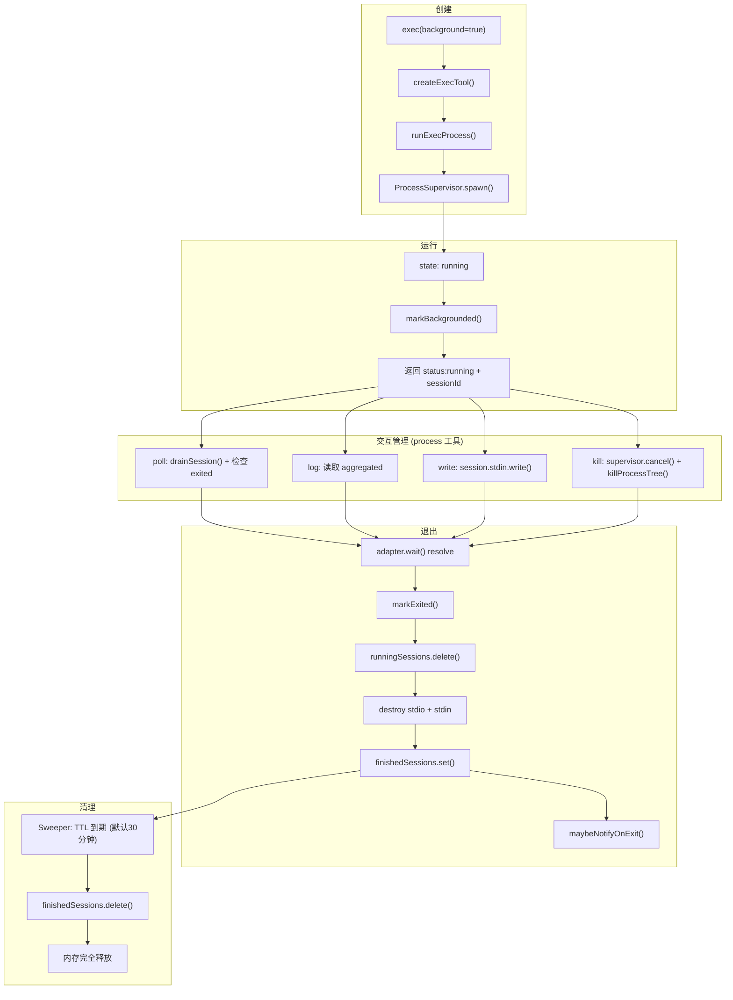
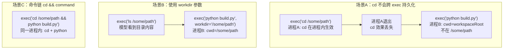
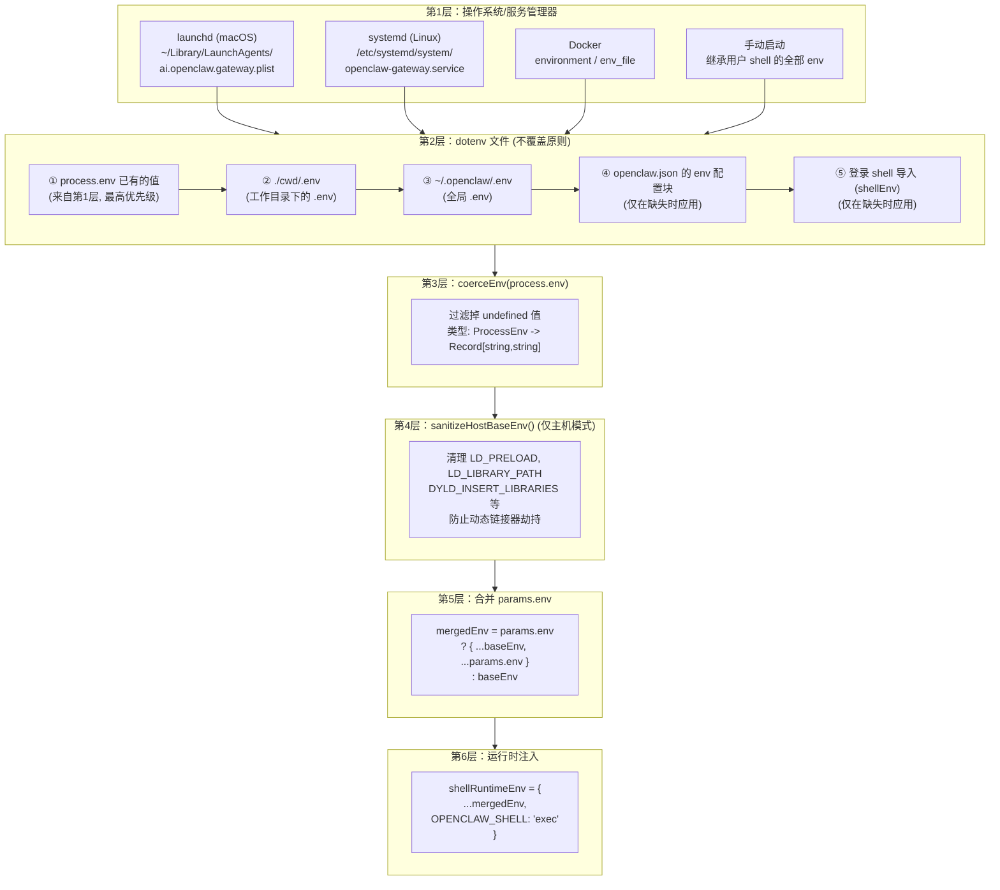

# Exec 跨调用状态隔离与环境变量来源分析

---

## 一、核心结论

OpenClaw 中 **每次 `exec` 调用都是一个全新的独立进程**，以下 shell 运行时状态不会跨 exec 调用持久化：

| 状态类型 | 是否跨 exec 持久化 | 原因 |
|----------|-------------------|------|
| `cd` 切换的工作目录 | ❌ 不能 | 进程退出后 cwd 丢失 |
| `export` 设置的环境变量 | ❌ 不能 | 进程退出后 env 丢失 |
| `alias` / shell 函数 | ❌ 不能 | 进程退出后丢失 |
| 沙箱容器内的文件修改 | ✅ 可以 | 容器持续运行，文件系统持久 |
| 写入 `~/.bashrc` 等文件 | ✅ 可以（间接） | `sh -lc` 会 source profile |

---

## 二、长时任务进程生命周期管理

### 2.1 生命周期全流程

```
创建 → 运行 → 后台化 → 交互管理 → 退出 → 清理
```

#### 创建阶段：`exec(background=true)`

1. `createExecTool()` 计算 `yieldWindow = 0`（立即后台化）
2. 调用 `runExecProcess()` 执行核心逻辑：
   - 生成 `sessionId = createSessionSlug()`
   - 创建 `ProcessSession` 对象，注册到 `runningSessions` Map
   - 通过 `ProcessSupervisor.spawn()` 启动子进程（child 或 pty 模式）
3. 立即返回 `{ status: "running", sessionId, pid, tail }` 给模型

**关键设计**：后台模式下 timeout 可被绕过——如果显式允许后台且未传 timeout，`effectiveTimeout = null`，支持无限长运行。

代码位置：`src/agents/bash-tools.exec.ts` L654-L657：

```typescript
const backgroundTimeoutBypass =
  allowBackground && explicitTimeoutSec === null && (backgroundRequested || yieldRequested);
const effectiveTimeout = backgroundTimeoutBypass
  ? null                           // 长时运行，无超时限制
  : (explicitTimeoutSec ?? defaultTimeoutSec);
```

#### 运行阶段：ProcessSupervisor 管理

`ProcessSupervisor`（`src/process/supervisor/supervisor.ts`）是进程生命周期的核心管理器，全局单例：

| 功能 | 实现方式 |
|------|---------|
| 进程启动 | 根据 mode 创建 ChildAdapter 或 PtyAdapter |
| 超时控制 | `overallTimeoutMs`（总超时）+ `noOutputTimeoutMs`（无输出超时） |
| 主动取消 | `cancel(runId, reason)` → adapter.kill("SIGKILL") |
| 批量取消 | `cancelScope(scopeKey)` → 取消同作用域所有进程 |
| 退出等待 | `managedRun.wait()` → 返回 `RunExit` |
| 状态追踪 | `RunRegistry` 记录 `starting → running → exiting → exited` |

#### 交互阶段：process 工具操作

| action | 功能 | 实现路径 |
|--------|------|---------|
| `poll` | 增量获取输出 + 检查退出状态 | `drainSession()` + 检查 `exited` 标志 |
| `log` | 查看全量输出 | 读取 `aggregated`，支持 offset/limit 分页 |
| `write` | 向 stdin 写入数据 | `session.stdin.write(data)` |
| `kill` | 终止进程 | `supervisor.cancel()` → 备用 `killProcessTree()` |
| `clear` | 清除已完成的会话记录 | `deleteSession()` 从 finishedSessions 移除 |
| `remove` | 强制移除（kill + delete） | cancel → fallback kill → deleteSession |

**kill 操作的双重保障**：

- **首选路径**：`cancelManagedSession()` → `supervisor.cancel(sessionId, "manual-cancel")` → adapter.kill("SIGKILL")
- **备用路径**：`terminateSessionFallback()` → 直接 `killProcessTree(pid)` 操作系统级进程树终止

代码位置：`src/agents/bash-tools.process.ts` L183-L200：

```typescript
const cancelManagedSession = (sessionId: string) => {
  const record = supervisor.getRecord(sessionId);
  if (!record || record.state === "exited") {
    return false;
  }
  supervisor.cancel(sessionId, "manual-cancel");
  return true;
};

const terminateSessionFallback = (session: ProcessSession) => {
  const pid = session.pid ?? session.child?.pid;
  if (typeof pid !== "number" || !Number.isFinite(pid) || pid <= 0) {
    return false;
  }
  killProcessTree(pid);
  return true;
};
```

#### 退出阶段：自动检测与状态迁移

进程退出时的自动处理链：

```
子进程退出
  → adapter.wait() resolve
    → managedRun.wait() resolve (返回 RunExit)
      → markExited(session, exitCode, exitSignal, status)
        → session.exited = true
        → runningSessions.delete(id)
        → 清理 child stdio（destroy + removeAllListeners）
        → 清理 stdin wrapper（destroy/end）
        → 如果 backgrounded: finishedSessions.set(id, record)
        → 如果非后台: 直接丢弃
      → maybeNotifyOnExit(session, status)
        → enqueueSystemEvent()
        → requestHeartbeatNow()
```

核心代码：`src/agents/bash-process-registry.ts` L145-L313：

```typescript
export function markExited(session, exitCode, exitSignal, status) {
  session.exited = true;
  session.exitCode = exitCode;
  session.exitSignal = exitSignal;
  session.tail = tail(session.aggregated, 2000);
  moveToFinished(session, status);
}

function moveToFinished(session: ProcessSession, status: ProcessStatus) {
  runningSessions.delete(session.id);

  if (session.child) {
    session.child.stdin?.destroy?.();
    session.child.stdout?.destroy?.();
    session.child.stderr?.destroy?.();
    session.child.removeAllListeners();
    delete session.child;
  }

  if (session.stdin) {
    if (typeof session.stdin.destroy === "function") {
      session.stdin.destroy();
    } else if (typeof session.stdin.end === "function") {
      session.stdin.end();
    }
    delete session.stdin;
  }

  if (!session.backgrounded) return;

  finishedSessions.set(session.id, {
    id: session.id, command: session.command,
    startedAt, endedAt, status,
    exitCode, exitSignal,
    aggregated: session.aggregated, tail: session.tail,
    truncated: session.truncated, totalOutputChars,
  });
}
```

#### 清理阶段：TTL 自动回收

已完成会话的定时清理机制（Sweeper）：

```typescript
const DEFAULT_JOB_TTL_MS = 30 * 60 * 1000;  // 默认 30 分钟
const MIN_JOB_TTL_MS = 60 * 1000;            // 最小 1 分钟
const MAX_JOB_TTL_MS = 3 * 60 * 60 * 1000;   // 最大 3 小时

function pruneFinishedSessions() {
  const cutoff = Date.now() - jobTtlMs;
  for (const [id, session] of finishedSessions.entries()) {
    if (session.endedAt < cutoff) {
      finishedSessions.delete(id);
    }
  }
}

function startSweeper() {
  sweeper = setInterval(pruneFinishedSessions, Math.max(30_000, jobTtlMs / 6));
  sweeper.unref?.();
}
```

也可通过配置 `tools.exec.cleanupMs` 覆盖默认 TTL。

### 2.2 进程是否被自动释放

**回答：是的，进程会被自动释放，但需要区分两个层面：**

#### 层面一：操作系统进程（OS Process）—— 自动释放

当后台进程自然退出或被杀死时：

1. **OS 进程立即终止**：子进程退出后，操作系统回收进程资源（PID、内存等）
2. **stdio 流自动清理**：`moveToFinished()` 会显式执行：
   - `session.child.stdin?.destroy?.()`
   - `session.child.stdout?.destroy?.()`
   - `session.child.stderr?.destroy?.()`
   - `session.child.removeAllListeners()`
   - `delete session.child`
3. **stdin wrapper 清理**：调用 `stdin.destroy()` 或 `stdin.end()`，设置 `destroyed = true`，然后 `delete session.stdin`
4. **Supervisor 侧清理**：`active.delete(runId)` + `adapter.dispose()` + `registry.finalize()`

#### 层面二：内存中的会话记录（Session Record）—— 延迟释放

1. **移入 finishedSessions**：后台化的会话保留在 `finishedSessions` Map 中
2. **TTL 定时清理**：默认 30 分钟后，Sweeper 自动删除过期记录
3. **手动清理**：Agent 可调用 `process clear` 或 `process remove` 立即删除

#### 特殊场景：进程仍在运行但 Agent 会话结束

1. **进程不会自动被杀**：后台进程独立于 Agent 运行
2. **超时兜底**：如果配置了 `timeoutSec`（默认 1800 秒），Supervisor 会在超时后自动 SIGKILL
3. **通知机制**：`maybeNotifyOnExit()` 在进程退出时发送系统事件 + 触发 heartbeat
4. **scopeKey 批量取消**：如果配置了 `scopeKey`，`cancelScope()` 可批量终止同作用域的所有进程

### 2.3 生命周期状态图



---

## 三、`cd` 跨 exec 调用分析

### 3.1 问题本质

```
模型调用 exec("cd /some/path")     → 进程A 启动，cd 在进程A内生效
                                      → 进程A 退出，cd 效果丢失

模型调用 exec("python build.py")   → 进程B 启动（全新进程）
                                      → 进程B 的 cwd 仍然是 workspaceDir
                                      → 不在 /some/path 下执行
```

关键代码：`src/agents/bash-tools.exec.ts` L499：

```typescript
const rawWorkdir = params.workdir?.trim() || defaults?.cwd || process.cwd();
```

`defaults?.cwd` 是在工具创建时固定的（来自 `workspaceRoot`），不会因为上一次 exec 中执行了 `cd` 而改变。

### 3.2 三种替代方案

#### 方案一：`workdir` 参数（推荐）

```json
{ "tool": "exec", "command": "python build.py", "workdir": "/some/path" }
```

流程：

```
第一次 exec:  exec({ command: "ls /some/path" })
              → 模型看到 /some/path 的内容

第二次 exec:  exec({ command: "python build.py", workdir: "/some/path" })
              → rawWorkdir = "/some/path"
              → resolveWorkdir() 校验目录是否存在
              → supervisor.spawn({ cwd: "/some/path" })
              → 进程B 在 /some/path 下执行
```

关键代码：`src/agents/bash-tools.shared.ts` L158-L170：

```typescript
export function resolveWorkdir(workdir: string, warnings: string[]) {
  const current = safeCwd();
  const fallback = current ?? homedir();
  try {
    const stats = statSync(workdir);
    if (stats.isDirectory()) {
      return workdir;           // 目录存在，使用指定 workdir
    }
  } catch {
    // ignore, fallback below
  }
  warnings.push(`Warning: workdir "${workdir}" is unavailable; using "${fallback}".`);
  return fallback;              // 目录不存在，回退到 cwd
}
```

#### 方案二：命令链 `cd && command`

```json
{ "tool": "exec", "command": "cd /some/path && python build.py" }
```

`cd` 和后续命令在同一个 shell 进程内执行，无需跨进程传递状态。

#### 方案三：系统提示词告知 workspace 目录

系统提示词明确告知模型当前工作目录（`src/agents/system-prompt.ts` L510-L513）：

```typescript
"## Workspace",
`Your working directory is: ${displayWorkspaceDir}`,
workspaceGuidance,
```

同时，exec 工具的返回结果中也携带 `cwd` 信息（`src/agents/bash-tools.exec.ts` L770）：

```typescript
details: {
  status: "completed",
  exitCode: outcome.exitCode ?? 0,
  durationMs: outcome.durationMs,
  aggregated: outcome.aggregated,
  cwd: run.session.cwd,
}
```

### 3.3 三种方案对比流程图



---

## 四、环境变量跨 exec 调用分析

### 4.1 环境变量不能跨 exec 继承

与 `cd` 完全同理：每次 `exec` 都是全新的独立进程，`export` 设置的环境变量只在该进程内生效，进程退出即丢失。

### 4.2 环境变量构建流程

代码位置：`src/agents/bash-tools.exec.ts` L517-L540：

```typescript
// 每次都从 process.env 重新构建，不引用上一次 exec 的任何状态
const inheritedBaseEnv = coerceEnv(process.env);        // 来源是 Node.js 进程的 env
const baseEnv = host === "sandbox"
  ? inheritedBaseEnv
  : sanitizeHostBaseEnv(inheritedBaseEnv);              // 主机模式还要清理危险变量

// 合并环境变量：基础环境 + 本次调用传入的 env 参数
const mergedEnv = params.env ? { ...baseEnv, ...params.env } : baseEnv;
```

代码位置：`src/agents/bash-tools.exec-runtime.ts` L457-L461：

```typescript
const shellRuntimeEnv: Record<string, string> = {
  ...opts.env,              // 来自上一步的 mergedEnv
  OPENCLAW_SHELL: "exec",   // 每次都重新标记
};
```

### 4.3 环境变量数据流

```
┌─────────────────────────────────────────────────────────────┐
│  第一次 exec:  exec({ command: "export MY_VAR=hello" })     │
│                                                             │
│  env 构建:  process.env + params.env(无) + OPENCLAW_SHELL   │
│  supervisor.spawn({ env: { ...process.env, OPENCLAW_SHELL } })
│  进程A 启动 → export MY_VAR=hello                            │
│  进程A 退出 → MY_VAR 消失                                    │
└─────────────────────────────────────────────────────────────┘
                            │
                            ▼
┌─────────────────────────────────────────────────────────────┐
│  第二次 exec:  exec({ command: "echo $MY_VAR" })            │
│                                                             │
│  env 构建:  process.env + params.env(无) + OPENCLAW_SHELL   │
│             process.env 中没有 MY_VAR                        │
│  supervisor.spawn({ env: { ...process.env, OPENCLAW_SHELL } })
│  进程B 启动 → echo $MY_VAR → 空值                            │
└─────────────────────────────────────────────────────────────┘
```

### 4.4 替代方案

| 方案 | 示例 | 原理 |
|------|------|------|
| `env` 参数 | `exec({ command: "...", env: { MY_VAR: "hello" } })` | 通过 `params.env` 传入，合并到 `mergedEnv` |
| 命令链 | `exec({ command: "export MY_VAR=hello && python app.py" })` | 在同一个 shell 进程内设置并使用 |
| 写入 profile | `echo 'export MY_VAR=hello' >> ~/.bashrc` | exec 使用 `sh -lc`（登录 shell），每次都会 source profile |
| `.env` 文件 | `~/.openclaw/.env` | Gateway 启动时加载，注入 process.env |

---

## 五、`process.env` 来源完整链路

`process.env` 是 Node.js 的内置对象，代表当前 Node.js 进程（即 OpenClaw Gateway 守护进程）的环境变量。它的内容在 Gateway 启动时就已确定。

### 5.1 加载链路图



### 5.2 环境变量优先级规则

来自 `docs/help/environment.md`：

> **Precedence (highest -> lowest):**
> 1. Process environment (what the Gateway process already has)
> 2. `.env` in current working directory (does not override)
> 3. Global `.env` at `~/.openclaw/.env` (does not override)
> 4. Config `env` block in `openclaw.json` (applied only if missing)
> 5. Optional login-shell import (applied only for missing keys)

核心规则：**永不覆盖已有值 (never override existing)**。

### 5.3 为什么第一次 exec 的 `export` 不会进入 `process.env`

```
┌──────────────────────────────────────────────────────────────┐
│  Gateway 进程 (Node.js)                                       │
│  process.env = { HOME, PATH, USER, OPENAI_API_KEY, ... }     │
│  这是 Gateway 守护进程启动时就固定的                             │
│  子进程的 export 不会影响父进程的 process.env                    │
│                                                               │
│  ├── exec 子进程A:  export FOO=bar                            │
│  │   → 进程A 退出 → FOO 消失                                  │
│  │   → Gateway 的 process.env 不变                            │
│  │                                                            │
│  ├── exec 子进程B:  echo $FOO                                 │
│  │   → FOO 为空 (process.env 中没有 FOO)                      │
│  └──────────────────────────────────────────────────────────┘
```

这是操作系统级别的隔离——子进程无法修改父进程的环境变量。`export` 只修改当前 shell 进程自身的环境，进程退出后修改即消失。

### 5.4 coerceEnv 实现

代码位置：`src/agents/bash-tools.shared.ts` L36-L46：

```typescript
export function coerceEnv(env?: NodeJS.ProcessEnv | Record<string, string>) {
  const record: Record<string, string> = {};
  if (!env) {
    return record;
  }
  for (const [key, value] of Object.entries(env)) {
    if (typeof value === "string") {
      record[key] = value;
    }
  }
  return record;
}
```

作用：将 Node.js 的 `ProcessEnv`（值可以是 `undefined`）转为纯 `Record<string, string>`，过滤掉未设置的变量。

### 5.5 持久化环境变量的方法

| 方法 | 原理 | 持久性 |
|------|------|--------|
| `~/.openclaw/.env` | Gateway 启动时加载，注入 process.env | 跨重启持久 |
| `openclaw.json` 的 `env` 块 | 配置级环境变量 | 跨重启持久 |
| 写入 `~/.bashrc` / `~/.profile` + `sh -lc` | exec 使用 login shell，会 source profile | 跨 exec 持久 |
| `params.env` 参数 | 模型每次显式传入 | 仅本次 exec |
| `export FOO=bar && command` | 命令链在同一进程内 | 仅本次 exec |

---

## 六、关键代码文件速查

| 文件 | 职责 |
|------|------|
| `src/agents/bash-tools.exec.ts` | exec 工具定义：workdir 解析、env 构建、yield 机制 |
| `src/agents/bash-tools.exec-runtime.ts` | `runExecProcess()`：进程启动、OPENCLAW_SHELL 注入 |
| `src/agents/bash-tools.exec-types.ts` | ExecToolDefaults / ExecToolDetails 类型定义 |
| `src/agents/bash-tools.process.ts` | process 工具：kill 的双重保障（cancel + fallback） |
| `src/agents/bash-tools.shared.ts` | `resolveWorkdir()` / `coerceEnv()` / `buildDockerExecArgs()` |
| `src/agents/bash-process-registry.ts` | 会话注册表：markExited / moveToFinished / Sweeper TTL |
| `src/process/supervisor/supervisor.ts` | ProcessSupervisor：spawn / cancel / cancelScope |
| `src/process/supervisor/types.ts` | RunState / TerminationReason / SpawnMode 类型 |
| `src/agents/system-prompt.ts` | 系统提示词：Workspace 段告知模型工作目录 |
| `src/agents/pi-tools.ts` | 工具创建：`cwd: workspaceRoot` 固定默认工作目录 |
| `docs/help/environment.md` | 环境变量优先级规则文档 |
