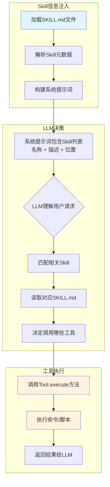

# Tool执行时Skill来源追踪分析

## 分析结论：OpenClaw **不知道** 当前执行的工具来自哪个Skill

---

### 一、核心原理

OpenClaw的Skill是一个**Markdown格式的说明书**（SKILL.md），用于教LLM如何使用工具。**Skill本身不是可执行实体**，因此工具执行时不需要（也无法）知道它来自哪个Skill。

---

### 二、执行流程图



---

### 三、两种执行路径对比

| 路径 | 说明 | 是否携带Skill信息 |
|------|------|------------------|
| **普通路径** | LLM读取SKILL.md后自主决定调用工具 | ❌ **不携带** |
| **command-dispatch: tool** | 用户通过斜杠命令`/skill-name`直接调用 | ⚠️ **传入但被忽略** |

---

### 四、关键代码分析

#### 1. Skill定义

**文件**: [src/agents/skills/types.ts#L74-78](file:///d:/prj/openclaw_analyze/src/agents/skills/types.ts#L74-78)

```typescript
export type SkillEntry = {
  skill: Skill;
  frontmatter: ParsedSkillFrontmatter;
  metadata?: OpenClawSkillMetadata;
  invocation?: SkillInvocationPolicy;
};
```

Skill只是一个数据容器，包含Markdown内容和元数据。

#### 2. 工具执行签名

**文件**: [src/agents/bash-tools.exec.ts#L282-300](file:///d:/prj/openclaw_analyze/src/agents/bash-tools.exec.ts#L282-300)

```typescript
execute: async (_toolCallId, args, signal, onUpdate) => {
  const params = args as {
    command: string;
    workdir?: string;
    env?: Record<string, string>;
    yieldMs?: number;
    background?: boolean;
    timeout?: number;
    pty?: boolean;
    elevated?: boolean;
    host?: string;
    security?: string;
    ask?: string;
    node?: string;
  };
  // 没有任何skillName或skillId参数
}
```

#### 3. Skill信息注入系统提示词

**文件**: [src/agents/system-prompt.ts#L22-34](file:///d:/prj/openclaw_analyze/src/agents/system-prompt.ts#L22-34)

```typescript
function buildSkillsSection(params: { skillsPrompt?: string; readToolName: string }) {
  return [
    "## Skills (mandatory)",
    "Before replying: scan <available_skills> <description> entries.",
    `- If exactly one skill clearly applies: read its SKILL.md at <location> with \`${params.readToolName}\`, then follow it.`,
    // ...
  ];
}
```

Skill信息只用于告诉LLM"在哪里找到使用说明"，不会传递给工具执行层。

#### 4. command-dispatch: tool路径

**文件**: [src/auto-reply/reply/get-reply-inline-actions.ts#L206-220](file:///d:/prj/openclaw_analyze/src/auto-reply/reply/get-reply-inline-actions.ts#L206-220)

```typescript
if (dispatch?.kind === "tool") {
  // 传入了skillName参数
  const result = await tool.execute(toolCallId, {
    command: rawArgs,
    commandName: skillInvocation.command.name,
    skillName: skillInvocation.command.skillName,  // ← 传入了skillName
  } as any);
  // ...
}
```

虽然代码传入了`skillName`，但查看execSchema定义，参数schema中**没有**定义这个字段，因此**实际上被忽略了**。

#### 5. exec工具参数Schema

**文件**: [src/agents/bash-tools.exec-runtime.ts#L160-210](file:///d:/prj/openclaw_analyze/src/agents/bash-tools.exec-runtime.ts#L160-210)

```typescript
export const execSchema = Type.Object({
  command: Type.String({ description: "Shell command to execute" }),
  workdir: Type.Optional(Type.String({ description: "Working directory (defaults to cwd)" })),
  env: Type.Optional(Type.Record(Type.String(), Type.String())),
  yieldMs: Type.Optional(Type.Number({ description: "Milliseconds to wait before backgrounding (default 10000)" })),
  background: Type.Optional(Type.Boolean({ description: "Run in background immediately" })),
  timeout: Type.Optional(Type.Number({ description: "Timeout in seconds (optional, kills process on expiry)" })),
  pty: Type.Optional(Type.Boolean({ description: "Run in a pseudo-terminal (PTY) when available" })),
  elevated: Type.Optional(Type.Boolean({ description: "Run on the host with elevated permissions" })),
  host: Type.Optional(Type.String({ description: "Exec host (sandbox|gateway|node)." })),
  security: Type.Optional(Type.String({ description: "Exec security mode (deny|allowlist|full)." })),
  ask: Type.Optional(Type.String({ description: "Exec ask mode (off|on-miss|always)." })),
  node: Type.Optional(Type.String({ description: "Node id/name for host=node." })),
});
```

**注意**: Schema中没有`skillName`或`commandName`字段。

---

### 五、为什么设计成这样？

1. **解耦设计**：Skill是"知识"，Tool是"能力"，两者独立
2. **模型自主决策**：LLM通过理解Skill内容来决定如何使用Tool
3. **灵活性**：同一Tool可以被多个Skill指导使用
4. **简化架构**：避免Tool执行层需要理解业务层面的Skill概念

---

### 六、总结

| 问题 | 答案 |
|------|------|
| OpenClaw知道Tool来自哪个Skill吗？ | **不知道**，也不需要知道 |
| Skill信息传递到哪里？ | 只到LLM的"大脑"（系统提示词），不到Tool执行层 |
| 如何追踪Tool与Skill的关联？ | 需要自行通过日志/对话历史追溯 |

---

### 七、涉及的关键文件

| 文件路径 | 功能 |
|----------|------|
| [src/agents/skills/types.ts](file:///d:/prj/openclaw_analyze/src/agents/skills/types.ts) | Skill类型定义 |
| [src/agents/skills/workspace.ts](file:///d:/prj/openclaw_analyze/src/agents/skills/workspace.ts) | Skill加载和提示词构建 |
| [src/agents/system-prompt.ts](file:///d:/prj/openclaw_analyze/src/agents/system-prompt.ts) | 系统提示词构建 |
| [src/agents/bash-tools.exec.ts](file:///d:/prj/openclaw_analyze/src/agents/bash-tools.exec.ts) | exec工具实现 |
| [src/agents/bash-tools.exec-runtime.ts](file:///d:/prj/openclaw_analyze/src/agents/bash-tools.exec-runtime.ts) | exec工具参数Schema |
| [src/auto-reply/reply/get-reply-inline-actions.ts](file:///d:/prj/openclaw_analyze/src/auto-reply/reply/get-reply-inline-actions.ts) | Skill命令分发处理 |
