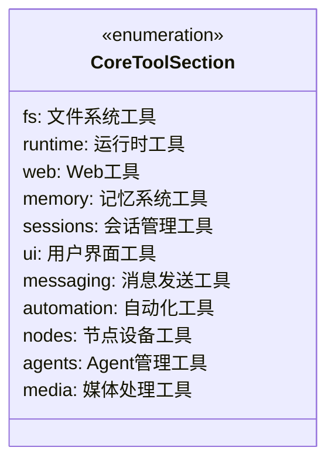
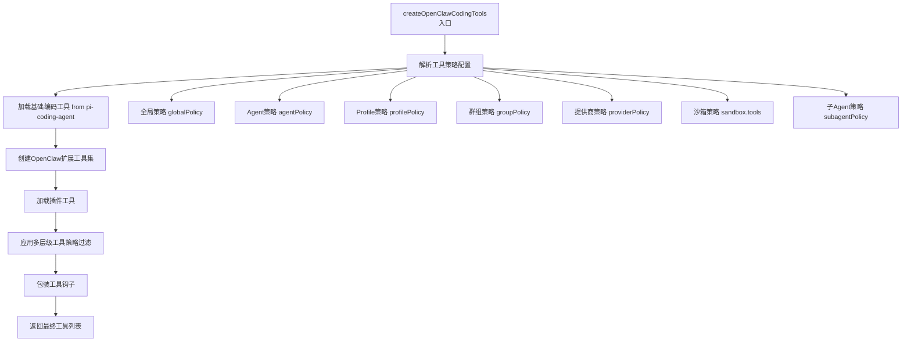
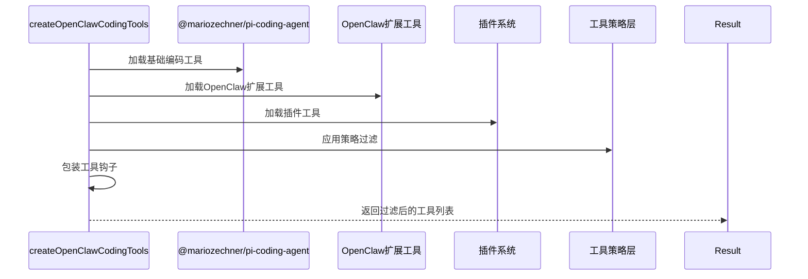
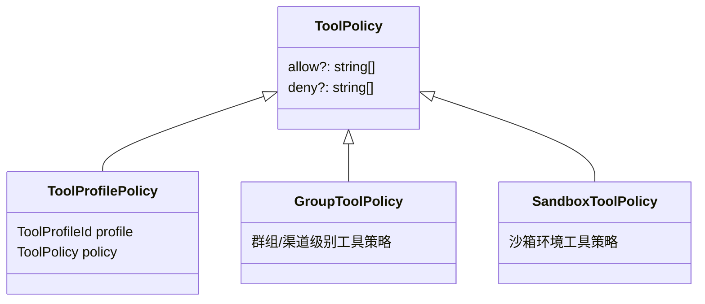
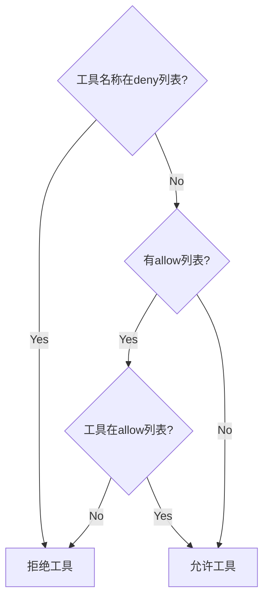
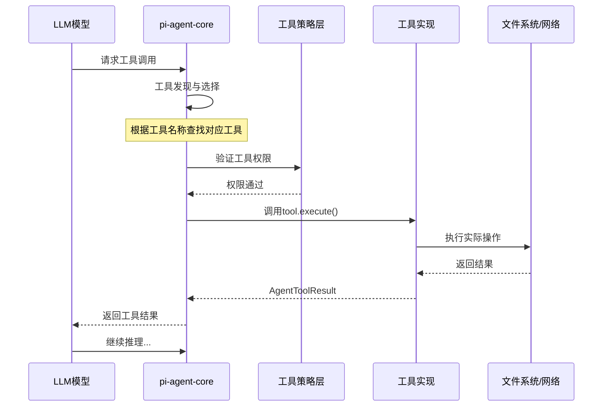
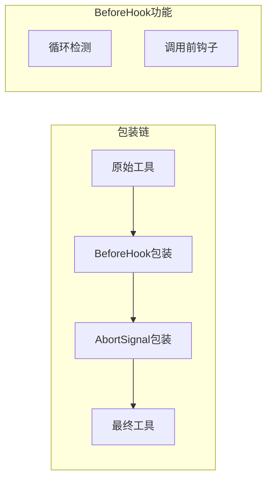
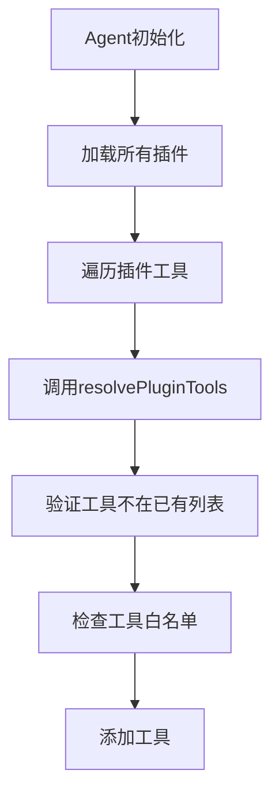

# OpenClaw工具系统分析报告

## 1. 概述

OpenClaw的工具系统是Agent与外部世界交互的核心通道，通过统一抽象的`AgentTool`接口实现对文件系统、网络请求、浏览器控制、消息发送等多种能力的调用。

## 2. 工具类型分类

### 2.1 按功能模块分类

根据`tool-catalog.ts`中的定义，OpenClaw将工具分为以下**11个功能分类**：



### 2.2 按Profile分类

工具还按照不同的使用场景配置了Profile：

| Profile | 说明 | 典型工具 |
|---------|------|----------|
| `minimal` | 最小化工具集 | session_status |
| `coding` | 编程工具集 | read, write, edit, exec, web_search, memory_* |
| `messaging` | 消息工具集 | sessions_*, message |
| `full` | 完整工具集 | 所有工具 |

### 2.3 按来源分类

| 来源 | 说明 | 示例 |
|------|------|------|
| **内置编码工具** | 来自`@mariozechner/pi-coding-agent` | read, write, edit, bash |
| **OpenClaw扩展** | OpenClaw自行实现 | browser, canvas, gateway, cron, sessions_* |
| **插件工具** | 插件系统提供 | Lobster, LLM-Task等扩展插件 |
| **渠道专属** | 特定消息渠道的工具 | WhatsApp登录、Discord操作等 |

## 3. 预置工具详细列表

### 3.1 文件系统工具 (fs)

| 工具名 | 功能 | Profile | 实现文件 |
|--------|------|---------|----------|
| `read` | 读取文件内容 | coding | `pi-tools.read.ts` |
| `write` | 创建或覆写文件 | coding | `pi-tools.read.ts` |
| `edit` | 精确编辑文件 | coding | `pi-tools.read.ts` |
| `apply_patch` | OpenAI补丁方式编辑 | coding | `apply-patch.ts` |

### 3.2 运行时工具 (runtime)

| 工具名 | 功能 | Profile | 实现文件 |
|--------|------|---------|----------|
| `exec` | 执行Shell命令 | coding | `bash-tools.exec.ts` |
| `process` | 管理后台进程 | coding | `bash-tools.process.ts` |

### 3.3 Web工具 (web)

| 工具名 | 功能 | Profile | 实现文件 |
|--------|------|---------|----------|
| `web_search` | 网络搜索 | coding | `web-tools.ts` |
| `web_fetch` | 获取网页内容 | coding | `web-tools.ts` |

### 3.4 记忆系统工具 (memory)

| 工具名 | 功能 | Profile | 实现文件 |
|--------|------|---------|----------|
| `memory_search` | 语义搜索记忆 | coding | `memory-tool.ts` |
| `memory_get` | 读取记忆文件 | coding | `memory-tool.ts` |

### 3.5 会话管理工具 (sessions)

| 工具名 | 功能 | Profile | 实现文件 |
|--------|------|---------|----------|
| `sessions_list` | 列出会话 | coding, messaging | `sessions-list-tool.ts` |
| `sessions_history` | 会话历史 | coding, messaging | `sessions-history-tool.ts` |
| `sessions_send` | 发送消息到会话 | coding, messaging | `sessions-send-tool.ts` |
| `sessions_spawn` | 派生子Agent | coding | `sessions-spawn-tool.ts` |
| `sessions_yield` | 让出控制权接收子Agent结果 | coding | `sessions-yield-tool.ts` |
| `subagents` | 管理子Agent | coding | `subagents-tool.ts` |
| `session_status` | 会话状态 | minimal, coding, messaging | `session-status-tool.ts` |

### 3.6 UI工具 (ui)

| 工具名 | 功能 | Profile | 实现文件 |
|--------|------|---------|----------|
| `browser` | 控制浏览器 | - | `browser-tool.ts` |
| `canvas` | 控制画布 | - | `canvas-tool.ts` |

### 3.7 消息发送工具 (messaging)

| 工具名 | 功能 | Profile | 实现文件 |
|--------|------|---------|----------|
| `message` | 发送消息 | messaging | `message-tool.ts` |

### 3.8 自动化工具 (automation)

| 工具名 | 功能 | Profile | 实现文件 |
|--------|------|---------|----------|
| `cron` | 定时任务 | coding | `cron-tool.ts` |
| `gateway` | 网关控制 | - | `gateway-tool.ts` |

### 3.9 节点设备工具 (nodes)

| 工具名 | 功能 | Profile | 实现文件 |
|--------|------|---------|----------|
| `nodes` | 节点和设备控制 | - | `nodes-tool.ts` |

### 3.10 Agent管理工具 (agents)

| 工具名 | 功能 | Profile | 实现文件 |
|--------|------|---------|----------|
| `agents_list` | 列出Agent | - | `agents-list-tool.ts` |

### 3.11 媒体处理工具 (media)

| 工具名 | 功能 | Profile | 实现文件 |
|--------|------|---------|----------|
| `image` | 图片理解 | coding | `image-tool.ts` |
| `tts` | 文字转语音 | - | `tts-tool.ts` |
| `pdf` | PDF处理 | coding | `pdf-tool.ts` |

## 4. 工具核心接口

### 4.1 AgentTool接口定义

```typescript
// 来源：@mariozechner/pi-agent-core
export type AgentTool<TParams = unknown, TResult = unknown> = {
  /** 工具唯一标识名称 */
  name: string;
  
  /** 工具描述，用于模型理解工具用途 */
  description?: string;
  
  /** JSON Schema格式的输入参数定义 */
  inputSchema?: object;
  
  /** 工具执行函数 */
  execute(
    params: TParams,                          // 执行参数
    context: AgentToolExecuteContext,         // 执行上下文
    signal: AbortSignal                       // 中止信号
  ): Promise<AgentToolResult<TResult>>;       // 执行结果
  
  /** 可选：所有者专属标记 */
  ownerOnly?: boolean;
};
```

### 4.2 AgentToolResult结构

```typescript
export type AgentToolResult<T = unknown> = {
  /** 结果内容 */
  result?: T;
  
  /** 是否继续执行（通常为true） */
  continue?: boolean;
  
  /** 可视化结果类型 */
  view?: {
    type: "text" | "image" | "html" | "audio";
    content?: string;
  };
  
  /** 错误信息 */
  error?: string;
};
```

## 5. 工具发现机制

### 5.1 发现流程概览



### 5.2 工具创建入口

**核心函数**: `createOpenClawCodingTools()` ([pi-tools.ts:L248](file:///d:/prj/openclaw_analyze/src/agents/pi-tools.ts#L248))

```typescript
export function createOpenClawCodingTools(options?: {
  agentId?: string;
  exec?: ExecToolDefaults & ProcessToolDefaults;
  messageProvider?: string;
  sandbox?: SandboxContext | null;
  sessionKey?: string;
  config?: OpenClawConfig;
  modelProvider?: string;
  modelId?: string;
  // ... 更多配置
}): AnyAgentTool[]
```

### 5.3 工具来源加载顺序



## 6. 工具选择机制

### 6.1 工具策略系统

工具选择通过多层级策略系统控制：



### 6.2 策略解析优先级

1. **沙箱策略** (sandbox.tools) - 最高优先级
2. **子Agent策略** (subagent.tools)
3. **群组策略** (groupPolicy)
4. **Agent策略** (agentPolicy)
5. **提供商策略** (providerPolicy)
6. **全局策略** (globalPolicy)
7. **Profile策略** (profilePolicy) - 最低优先级

### 6.3 策略应用核心代码

**工具策略流水线** ([tool-policy-pipeline.ts](file:///d:/prj/openclaw_analyze/src/agents/tool-policy-pipeline.ts)):

```typescript
export function applyToolPolicyPipeline(params: {
  tools: AnyAgentTool[];
  toolMeta: (tool: AnyAgentTool) => PluginToolMeta | undefined;
  warn: typeof logWarn;
  steps: ToolPolicyPipelineStep[];
}): AnyAgentTool[]
```

**决策流程**:


### 6.4 特殊策略处理

#### 6.4.1 所有者专属工具

```typescript
// tool-policy.ts
export function applyOwnerOnlyToolPolicy(tools, senderIsOwner) {
  if (senderIsOwner) return tools;
  // 非所有者：过滤或禁用ownerOnly工具
  return tools.filter(tool => !isOwnerOnlyTool(tool));
}
```

#### 6.4.2 渠道禁用工具

```typescript
// pi-tools.ts
const TOOL_DENY_BY_MESSAGE_PROVIDER = {
  voice: ["tts"],  // 语音渠道禁用tts
};
```

#### 6.4.3 提供商禁用工具

```typescript
// pi-tools.ts
const TOOL_DENY_FOR_XAI_PROVIDERS = new Set(["web_search"]);
// xAI/Grok本身内置了web_search，避免重复
```

## 7. 工具使用流程

### 7.1 完整执行流程



### 7.2 工具执行上下文

每个工具执行时都会收到一个上下文对象：

```typescript
type AgentToolExecuteContext = {
  sessionKey: string;        // 会话标识
  agentId: string;            // Agent ID
  runId: string;               // 运行ID
  toolCallId: string;         // 工具调用ID
  sandbox?: SandboxContext;   // 沙箱上下文
};
```

### 7.3 工具包装器

工具在返回前会被多层包装：



**循环检测** ([tool-loop-detection.ts](file:///d:/prj/openclaw_analyze/src/agents/tool-loop-detection.ts)):
```typescript
// 检测重复的工具调用模式
// - 通用重复 (genericRepeat)
// - 已知无进度轮询 (knownPollNoProgress)
// - 乒乓模式 (pingPong)
```

## 8. 关键类及代码位置

| 类/函数 | 文件 | 职责 |
|---------|------|------|
| `createOpenClawCodingTools` | `pi-tools.ts` | 工具创建入口 |
| `createExecTool` | `bash-tools.exec.ts` | 创建exec工具 |
| `createBrowserTool` | `browser-tool.ts` | 创建浏览器工具 |
| `createSessionsSpawnTool` | `sessions-spawn-tool.ts` | 创建子Agent工具 |
| `resolveEffectiveToolPolicy` | `pi-tools.policy.ts` | 解析工具策略 |
| `applyToolPolicyPipeline` | `tool-policy-pipeline.ts` | 应用策略流水线 |
| `normalizeToolParameters` | `pi-tools.schema.ts` | 规范化工具Schema |
| `resolvePluginTools` | `plugins/tools.ts` | 解析插件工具 |
| `listCoreToolSections` | `tool-catalog.ts` | 列出工具分类目录 |

## 9. 插件工具系统

### 9.1 插件工具发现



### 9.2 插件工具元数据

```typescript
export type PluginToolMeta = {
  pluginId: string;           // 插件ID
  pluginVersion?: string;     // 插件版本
};
```

## 10. 工具Schema规范化

### 10.1 不同模型的Schema适配

```typescript
// pi-tools.schema.ts
export function normalizeToolParameters(tool, options) {
  const { modelProvider, modelId } = options;
  
  // Gemini: 移除某些约束关键字
  if (isGeminiProvider(modelProvider)) {
    return cleanToolSchemaForGemini(tool);
  }
  
  // OpenAI: 移除根级union schemas
  if (isOpenAIProvider(modelProvider)) {
    return cleanToolSchemaForOpenAI(tool);
  }
  
  return tool;
}
```

## 11. 总结

OpenClaw的工具系统是一个高度模块化和可扩展的系统：

1. **统一的工具接口**: 通过`AgentTool`抽象所有工具能力
2. **多层级策略控制**: 全局→Agent→Profile→群组→提供商→沙箱→子Agent
3. **灵活的发现机制**: 内置+插件+渠道专属
4. **完善的包装机制**: 钩子+循环检测+中止信号
5. **跨模型兼容性**: 自动适配不同模型的Schema要求

这种设计使得OpenClaw能够：
- 支持多种使用场景（编程、消息、自动化等）
- 精细控制工具访问权限
- 方便扩展新工具
- 安全地在沙箱中运行
