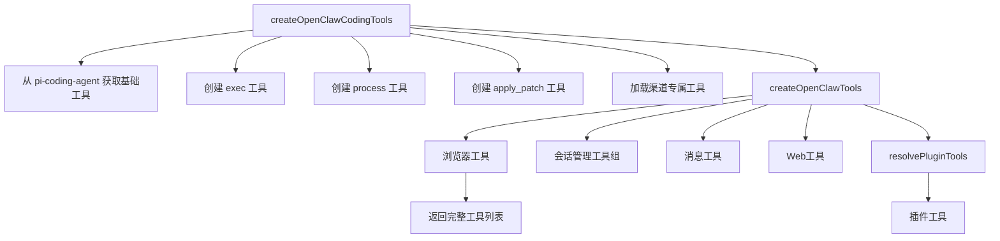
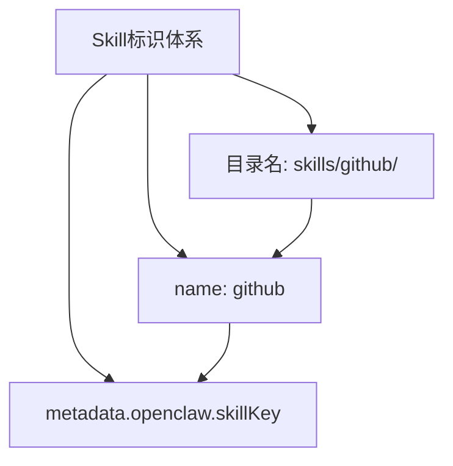
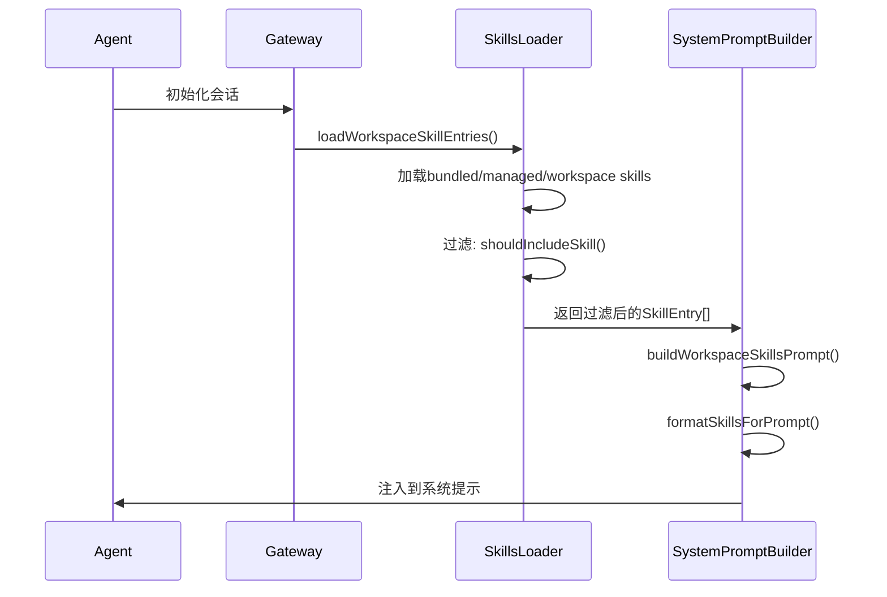
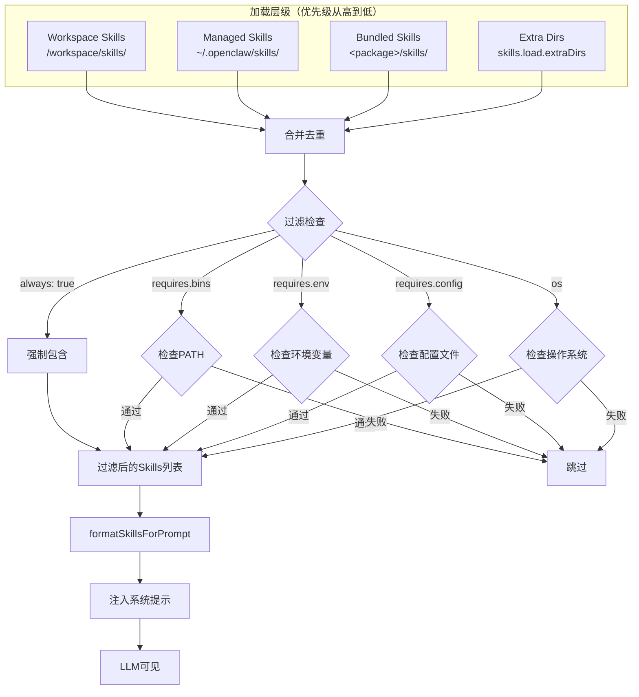
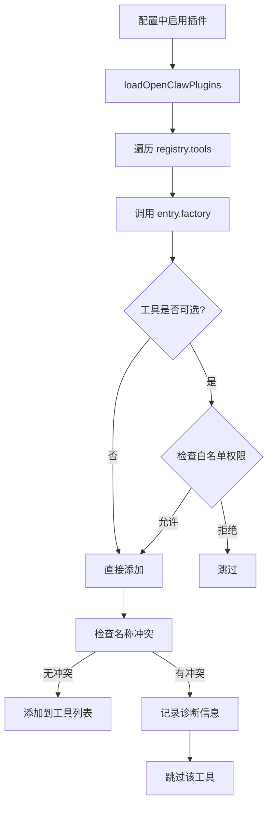
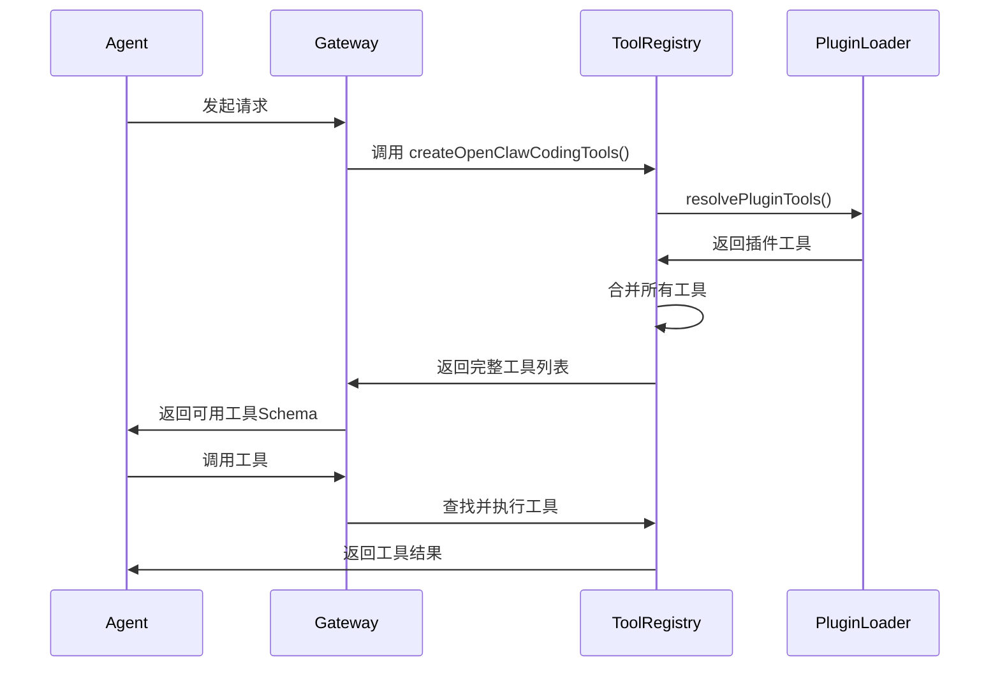

# OpenClaw工具系统完整分析

> 分析日期：2026-05-29
> 分析范围：内置工具、Skills系统、工具发现与注册机制

---

## 目录

1. [工具类型总览](#1-工具类型总览)
2. [内置工具详解](#2-内置工具详解)
3. [工具配置系统](#3-工具配置系统)
4. [非内置工具（Skills）](#4-非内置工具skills)
5. [插件系统（Plugin Tools）](#5-插件系统plugin-tools)
6. [工具发现和识别机制](#6-工具发现和识别机制)
7. [总结](#7-总结)

---

## 1. 工具类型总览

OpenClaw的工具有两大类：

1. **内置工具（Built-in Tools）**：直接集成在OpenClaw核心代码中的工具
2. **技能工具（Skills）**：通过Markdown格式的SKILL.md文件定义，通过exec等运行时调用外部CLI工具

---

## 2. 内置工具详解

### 2.1 工具组织结构

根据 [tool-catalog.ts](file:///d:/prj/openclaw_analyze/src/agents/tool-catalog.ts) 的定义，内置工具按功能分为以下组：

| 组名 | 功能说明 |
|------|----------|
| **fs** | 文件系统工具（read/write/edit/apply_patch） |
| **runtime** | 运行时工具（exec/process） |
| **web** | Web工具（web_search/web_fetch） |
| **memory** | 记忆工具（memory_search/memory_get） |
| **sessions** | 会话管理工具 |
| **ui** | UI控制工具（browser/canvas） |
| **messaging** | 消息工具（message） |
| **automation** | 自动化工具（cron/gateway） |
| **nodes** | 节点设备工具 |
| **agents** | 代理管理工具 |
| **media** | 媒体工具（image/pdf/tts） |

### 2.2 核心工具清单

| 工具名 | 描述 | 所属组 | 所在文件 |
|--------|------|--------|----------|
| **read** | 读取文件内容 | fs | pi-tools.read.ts |
| **write** | 创建或覆盖文件 | fs | pi-tools.read.ts |
| **edit** | 精确编辑文件 | fs | pi-tools.read.ts |
| **apply_patch** | 结构化补丁（实验性） | fs | apply-patch.ts |
| **exec** | 执行Shell命令 | runtime | bash-tools.exec.ts |
| **process** | 管理后台进程 | runtime | bash-tools.process.ts |
| **web_search** | 网页搜索 | web | web-search.ts |
| **web_fetch** | 获取网页内容 | web | web-fetch.ts |
| **memory_search** | 语义搜索记忆 | memory | memory-tool.ts |
| **memory_get** | 读取记忆文件 | memory | memory-tool.ts |
| **sessions_list** | 列出会话 | sessions | sessions-list-tool.ts |
| **sessions_history** | 会话历史 | sessions | sessions-history-tool.ts |
| **sessions_send** | 发送消息到会话 | sessions | sessions-send-tool.ts |
| **sessions_spawn** | 派生子代理 | sessions | sessions-spawn-tool.ts |
| **sessions_yield** | 移交控制权 | sessions | sessions-yield-tool.ts |
| **subagents** | 管理子代理 | sessions | subagents-tool.ts |
| **session_status** | 会话状态 | sessions | session-status-tool.ts |
| **browser** | 控制浏览器 | ui | browser-tool.ts |
| **canvas** | 控制画布 | ui | canvas-tool.ts |
| **message** | 发送消息 | messaging | message-tool.ts |
| **cron** | 定时任务 | automation | cron-tool.ts |
| **gateway** | 网关控制 | automation | gateway-tool.ts |
| **nodes** | 节点设备控制 | nodes | nodes-tool.ts |
| **agents_list** | 列出代理 | agents | agents-list-tool.ts |
| **image** | 图像理解 | media | image-tool.ts |
| **pdf** | PDF处理 | media | pdf-tool.ts |
| **tts** | 文本转语音 | media | tts-tool.ts |

### 2.3 工具注册流程

工具通过 [createOpenClawCodingTools()](file:///d:/prj/openclaw_analyze/src/agents/pi-tools.ts#L284) 函数注册：



---

## 3. 工具配置系统

### 3.1 工具配置文件

工具配置通过 [types.tools.ts](file:///d:/prj/openclaw_analyze/src/config/types.tools.ts) 定义：

```typescript
// 工具配置类型
export type AgentToolsConfig = {
  profile?: ToolProfileId;  // 工具配置文件
  allow?: string[];          // 允许的工具列表
  alsoAllow?: string[];      // 额外允许
  deny?: string[];           // 拒绝的工具列表
  byProvider?: Record<string, ToolPolicyConfig>; // 按提供商配置
};
```

### 3.2 工具配置文件

| Profile | 包含工具 | 说明 |
|---------|----------|------|
| **minimal** | session_status | 最简配置，仅状态查看 |
| **coding** | read, write, edit, exec, process, web_search, web_fetch, memory_*, sessions_*, browser, canvas, cron, nodes, image | 编码场景 |
| **messaging** | message, sessions_*, session_status | 消息场景 |
| **full** | 所有工具 | 完全开放 |

### 3.3 工具组快捷方式

```typescript
const CORE_TOOL_GROUPS = {
  "group:runtime": ["exec", "bash", "process"],
  "group:fs": ["read", "write", "edit", "apply_patch"],
  "group:sessions": ["sessions_list", "sessions_history", "sessions_send", "sessions_spawn", "session_status"],
  "group:memory": ["memory_search", "memory_get"],
  "group:web": ["web_search", "web_fetch"],
  "group:ui": ["browser", "canvas"],
  "group:automation": ["cron", "gateway"],
  "group:messaging": ["message"],
  "group:nodes": ["nodes"],
  "group:openclaw": [所有内置OpenClaw工具]
};
```

---

## 4. 非内置工具（Skills）

### 4.1 Skills定义

Skills不是代码工具，而是**指导Agent使用外部CLI工具的文档**。它们存放在 `SKILL.md` 文件中。

### 4.2 OpenClaw是否有内置Skills？

**是的，有内置Skills！**

从 [package.json](file:///d:/prj/openclaw_analyze/package.json#L31-L37) 可以看到：

```json
"files": [
  "CHANGELOG.md",
  "LICENSE",
  "openclaw.mjs",
  "README-header.png",
  "README.md",
  "assets/",
  "dist/",
  "docs/",
  "extensions/",
  "skills/"  // <-- bundled skills被包含在发布包中
]
```

项目根目录下的 `skills/` 目录被打包发布，这就是**内置Skills**的来源。

### 4.3 内置Skills清单

OpenClaw内置了以下Skills（共50+个）：

#### 通讯类
- slack、discord、telegram、whatsapp、imsg、bluebubbles

#### 开发工具类
- github、tmux、coding-agent、oracle

#### 数据服务类
- trello、notion、obsidian、things-mac、apple-notes、apple-reminders、bear-notes

#### 媒体娱乐类
- spotify-player、songsee、video-frames、weather、gifgrep

#### 设备控制类
- nodes-connect、openhue、camsnap、sherpa-onnx-tts

#### 实用工具类
- weather、xurl、nano-banana-pro、nano-pdf、wacli、blogwatcher、model-usage

### 4.4 Skills存储位置

根据优先级从高到低：

1. **Workspace Skills** - `<workspace>/skills/`
2. **Managed/Local Skills** - `~/.openclaw/skills/`
3. **Bundled Skills** - 随安装包附带的skills目录
4. **Extra Dirs** - 通过 `skills.load.extraDirs` 配置的额外目录

### 4.5 SKILL.md格式

```markdown
---
name: weather
description: "Get current weather and forecasts via wttr.in"
metadata: {
  "openclaw": {
    "emoji": "☔",
    "requires": { "bins": ["curl"] }
  }
}
---

# Weather Skill

Get current weather conditions and forecasts.

## When to Use

✅ **USE this skill when:**
- "What's the weather?"
- "Temperature in [city]"

## Commands

### Current Weather
curl "wttr.in/London?format=3"
```

### 4.6 Skill的唯一标识

#### 标识机制

每个Skill都有**唯一标识符**：`name`字段

示例：[github/SKILL.md](file:///d:/prj/openclaw_analyze/skills/github/SKILL.md#L1-L3)

```markdown
---
name: github
description: "GitHub operations via `gh` CLI..."
metadata: { ... }
---
```

#### 标识的层级结构



根据 [types.ts](file:///d:/prj/openclaw_analyze/src/agents/skills/types.ts#L17-L31)：

```typescript
export type OpenClawSkillMetadata = {
  skillKey?: string;  // 可选的键名
  primaryEnv?: string;
  emoji?: string;
  homepage?: string;
  requires?: {
    bins?: string[];
    anyBins?: string[];
    env?: string[];
    config?: string[];
  };
};
```

#### 标识的优先级

根据 [workspace.ts](file:///d:/prj/openclaw_analyze/src/agents/skills/workspace.ts#L489-L508) 的合并逻辑：

```typescript
// 合并去重时使用 skill.name 作为键
const merged = new Map<string, Skill>();

// Workspace skills优先级最高
for (const skill of workspaceSkills) {
  merged.set(skill.name, skill);  // 使用name作为唯一键
}
// Managed skills次之
for (const skill of managedSkills) {
  merged.set(skill.name, skill);
// Bundled skills最低
for (const skill of bundledSkills) {
  merged.set(skill.name, skill);
}
```

**结论**：`skill.name` 是唯一的业务标识符

### 4.7 LLM如何知道Skill的存在

#### Skills注入系统提示的流程



#### Skills在系统提示中的格式

根据 [system-prompt.ts](file:///d:/prj/openclaw_analyze/src/agents/system-prompt.ts#L20-L36)：

```typescript
function buildSkillsSection(params: { skillsPrompt?: string; readToolName: string }) {
  const trimmed = params.skillsPrompt?.trim();
  if (!trimmed) {
    return [];
  }
  return [
    "## Skills (mandatory)",
    "Before replying: scan <available_skills> <description> entries.",
    `- If exactly one skill clearly applies: read its SKILL.md at <location> with \`${params.readToolName}\`, then follow it.`,
    "- If multiple could apply: choose the most specific one, then read/follow it.",
    "- If none clearly apply: do not read any SKILL.md.",
    trimmed,  // 这里包含所有skills的<skill>标签
    "",
  ];
}
```

#### Skills的实际格式

Skills通过 `formatSkillsForPrompt()` 函数（来自 @mariozechner/pi-coding-agent）格式化为：

```xml
<available_skills>
  <skill>
    <name>github</name>
    <description>GitHub operations via `gh` CLI: issues, PRs, CI runs...</description>
    <location>~/.openclaw/skills/github/SKILL.md</location>
  </skill>
  
  <skill>
    <name>slack</name>
    <description>Use when you need to control Slack from OpenClaw...</description>
    <location>~/.openclaw/skills/slack/SKILL.md</location>
  </skill>
  
  <skill>
    <name>weather</name>
    <description>Get current weather and forecasts via wttr.in...</description>
    <location>~/.openclaw/skills/weather/SKILL.md</location>
  </skill>
  
  <!-- 更多skills... -->
</available_skills>
```

#### LLM如何使用Skills

根据系统提示中的指令，LLM的工作流程是：

1. **扫描** `<available_skills>` 中的所有 `<name>` 和 `<description>`
2. **匹配** 用户请求与最相关的skill
3. **读取** 通过 `read` 工具读取对应skill的 `SKILL.md` 文件
4. **执行** 按照SKILL.md中的指令调用相关工具（如 `exec` 调用CLI）

### 4.8 Skills加载架构



---

## 5. 插件系统（Plugin Tools）

### 5.1 插件工具注册

插件通过 [plugins/registry.ts](file:///d:/prj/openclaw_analyze/src/plugins/registry.ts) 注册工具：

```typescript
const registerTool = (
  record: PluginRecord,
  tool: AnyAgentTool | OpenClawPluginToolFactory,
  opts?: { name?: string; names?: string[]; optional?: boolean },
) => {
  const factory: OpenClawPluginToolFactory =
    typeof tool === "function" ? tool : (_ctx: OpenClawPluginToolContext) => tool;

  if (typeof tool !== "function") {
    names.push(tool.name);
  }

  const normalized = names.map((name) => name.trim()).filter(Boolean);
  if (normalized.length > 0) {
    record.toolNames.push(...normalized);
  }
  registry.tools.push({
    pluginId: record.id,
    factory,
    names: normalized,
    optional: opts?.optional === true,
    source: record.source,
  });
};
```

### 5.2 插件工具解析

工具通过 [plugins/tools.ts](file:///d:/prj/openclaw_analyze/src/plugins/tools.ts) 的 `resolvePluginTools()` 发现和解析：

```typescript
export function resolvePluginTools(params: {
  context: OpenClawPluginToolContext;
  existingToolNames?: Set<string>;
  toolAllowlist?: string[];
}): AnyAgentTool[] {
  const registry = loadOpenClawPlugins({ /* ... */ });
  const tools: AnyAgentTool[] = [];
  
  for (const entry of registry.tools) {
    // 调用工厂函数创建工具实例
    const resolved = entry.factory(params.context);
    // 处理可选工具的权限检查
    if (entry.optional && !isOptionalToolAllowed(...)) {
      continue;
    }
    tools.push(...resolved);
  }
  return tools;
}
```

### 5.3 插件工具加载流程



---

## 6. 工具发现和识别机制

### 6.1 工具发现流程

1. **启动时发现**：Gateway启动时加载所有工具
2. **按需加载**：仅加载配置允许的工具
3. **运行时扩展**：通过插件系统动态注册

### 6.2 工具识别流程



### 6.3 工具名称规范化

工具名称在匹配时会被规范化处理：

```typescript
function normalizeToolName(name: string): string {
  return name.trim().toLowerCase();
}

// 白名单匹配支持通配符和组
"browser"      // 精确匹配
"group:fs"     // 匹配整个组
"*"            // 匹配所有
```

---

## 7. 总结

OpenClaw的工具系统是一个**分层、可扩展**的架构：

| 层级 | 类型 | 发现方式 | 使用方式 |
|------|------|----------|----------|
| **核心层** | 内置工具 | 代码硬编码 | 直接调用 |
| **扩展层** | 插件工具 | 动态加载 | 注册发现 |
| **指导层** | Skills | 文件扫描 | 文档引导 |

### 关键发现

1. **内置工具**：约25个核心工具，涵盖文件系统、运行时、Web、记忆、会话、UI、消息、自动化等场景
2. **内置Skills**：50+个预置Skills，涵盖通讯、开发、数据、媒体、设备等场景
3. **唯一标识**：`skill.name` 是Skill的业务唯一标识符
4. **LLM可见性**：Skills通过 `<available_skills>` XML标签注入系统提示，LLM通过扫描描述来匹配最相关的Skill

### 代码位置速查表

| 功能 | 文件路径 |
|------|----------|
| 工具目录定义 | src/agents/tool-catalog.ts |
| 工具注册入口 | src/agents/pi-tools.ts |
| 工具配置类型 | src/config/types.tools.ts |
| Bundled Skills目录解析 | src/agents/skills/bundled-dir.ts |
| Skills加载与合并 | src/agents/skills/workspace.ts |
| Skills类型定义 | src/agents/skills/types.ts |
| 系统提示构建 | src/agents/system-prompt.ts |
| Skills过滤逻辑 | src/agents/skills/filter.ts |
| 插件工具注册 | src/plugins/registry.ts |
| 插件工具解析 | src/plugins/tools.ts |

---

## 参考文件

- [tool-catalog.ts](file:///d:/prj/openclaw_analyze/src/agents/tool-catalog.ts) - 工具目录定义
- [pi-tools.ts](file:///d:/prj/openclaw_analyze/src/agents/pi-tools.ts) - 工具注册入口
- [openclaw-tools.ts](file:///d:/prj/openclaw_analyze/src/agents/openclaw-tools.ts) - OpenClaw扩展工具
- [workspace.ts](file:///d:/prj/openclaw_analyze/src/agents/skills/workspace.ts) - Skills加载逻辑
- [system-prompt.ts](file:///d:/prj/openclaw_analyze/src/agents/system-prompt.ts) - 系统提示构建
- [plugins/tools.ts](file:///d:/prj/openclaw_analyze/src/plugins/tools.ts) - 插件工具解析
- [package.json](file:///d:/prj/openclaw_analyze/package.json) - 内置Skills打包配置
- [skills/](file:///d:/prj/openclaw_analyze/skills/) - 内置Skills目录
