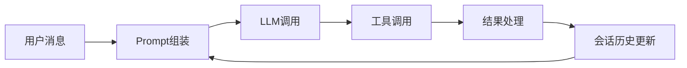
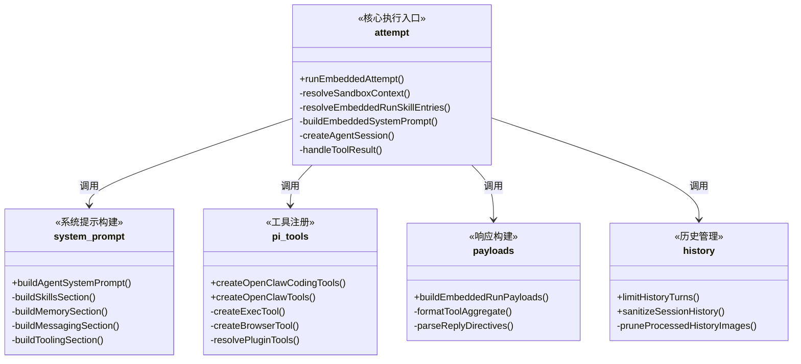
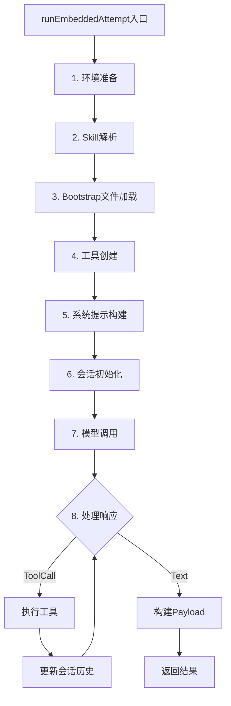
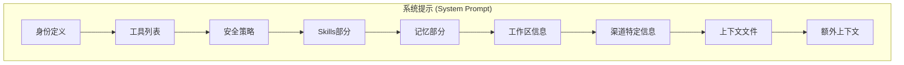
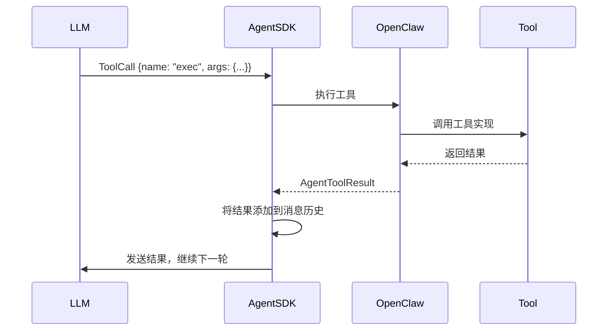
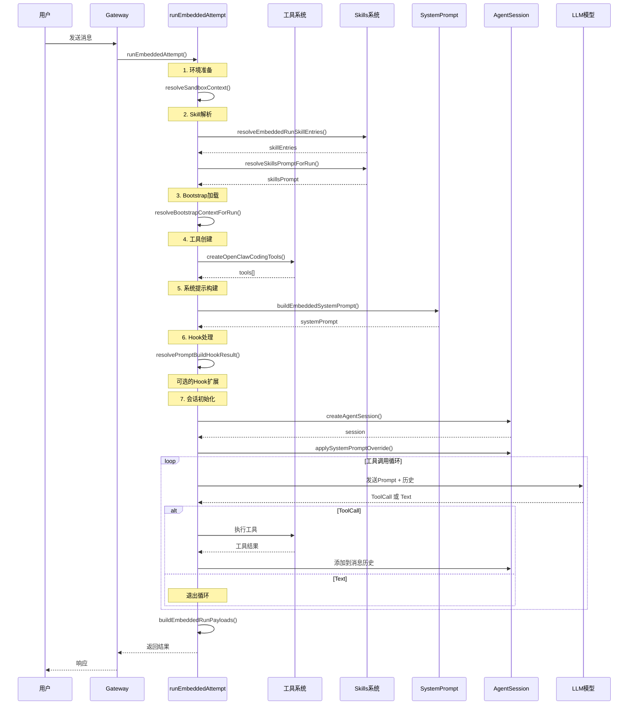

# OpenClaw Agent Prompt组装与LLM调用机制深度分析

> 分析日期：2026-05-29
> 分析范围：工具调用、Skill执行、Prompt组装流程

---

## 目录

1. [概述](#1-概述)
2. [核心文件架构](#2-核心文件架构)
3. [Prompt组装完整流程](#3-prompt组装完整流程)
4. [系统提示构建详解](#4-系统提示构建详解)
5. [工具调用与结果处理](#5-工具调用与结果处理)
6. [会话历史管理](#6-会话历史管理)
7. [Hook机制与扩展点](#7-hook机制与扩展点)
8. [完整时序图](#8-完整时序图)
9. [关键代码片段](#9-关键代码片段)

---

## 1. 概述

在OpenClaw中，Agent与LLM的交互是一个复杂的多阶段过程：



### 1.1 核心问题

1. **系统提示如何构建？** - 包含哪些部分？
2. **工具如何注册？** - Tool Schema如何生成？
3. **Skill如何注入？** - LLM如何知道可用的Skill？
4. **工具结果如何处理？** - 如何组装到下一轮Prompt？
5. **会话历史如何管理？** - 如何避免超出上下文限制？

---

## 2. 核心文件架构



### 2.1 关键文件清单

| 文件路径 | 职责 |
|----------|------|
| `pi-embedded-runner/run/attempt.ts` | 核心执行入口，协调整个流程 |
| `system-prompt.ts` | 构建系统提示的所有部分 |
| `system-prompt-params.ts` | 构建系统提示需要的运行时参数 |
| `pi-tools.ts` | 注册所有内置工具和插件工具 |
| `openclaw-tools.ts` | 创建OpenClaw扩展工具 |
| `skills/workspace.ts` | 加载和合并Skills |
| `skills/system-prompt.ts` | 构建Skills相关的提示 |
| `run/payloads.ts` | 构建响应Payload |
| `history.ts` | 管理会话历史 |

---

## 3. Prompt组装完整流程

### 3.1 流程总览



### 3.2 详细步骤

#### 步骤1：环境准备

```typescript
// attempt.ts 第1640-1680行
export async function runEmbeddedAttempt(params) {
  // 1. 解析工作区路径
  const resolvedWorkspace = resolveUserPath(params.workspaceDir);
  
  // 2. 初始化沙箱环境
  const sandbox = await resolveSandboxContext({
    config: params.config,
    sessionKey: sandboxSessionKey,
    workspaceDir: resolvedWorkspace,
  });
  
  // 3. 计算实际工作区路径
  const effectiveWorkspace = sandbox?.enabled
    ? sandbox.workspaceAccess === "rw"
      ? resolvedWorkspace
      : sandbox.workspaceDir
    : resolvedWorkspace;
}
```

#### 步骤2：Skill解析

```typescript
// attempt.ts 第1700-1730行
const { shouldLoadSkillEntries, skillEntries } = resolveEmbeddedRunSkillEntries({
  workspaceDir: effectiveWorkspace,
  config: params.config,
  skillsSnapshot: params.skillsSnapshot,
});

// 应用Skill环境变量
restoreSkillEnv = applySkillEnvOverrides({
  skills: skillEntries ?? [],
  config: params.config,
});

// 构建Skills提示
const skillsPrompt = resolveSkillsPromptForRun({
  skillsSnapshot: params.skillsSnapshot,
  entries: shouldLoadSkillEntries ? skillEntries : undefined,
  config: params.config,
  workspaceDir: effectiveWorkspace,
});
```

#### 步骤3：Bootstrap文件加载

```typescript
// attempt.ts 第1800-1850行
const { bootstrapFiles, contextFiles } = await resolveBootstrapContextForRun({
  workspaceDir: effectiveWorkspace,
  config: params.config,
  sessionKey: params.sessionKey,
  sessionId: params.sessionId,
  contextMode: params.bootstrapContextMode,
  runKind: params.bootstrapContextRunKind,
});

// 分析Bootstrap预算
const bootstrapAnalysis = analyzeBootstrapBudget({
  files: buildBootstrapInjectionStats({ bootstrapFiles, injectedFiles: contextFiles }),
  bootstrapMaxChars,
  bootstrapTotalMaxChars,
});

// 构建截断警告
const bootstrapPromptWarning = buildBootstrapPromptWarning({
  analysis: bootstrapAnalysis,
  mode: bootstrapPromptWarningMode,
});
```

#### 步骤4：工具创建

```typescript
// attempt.ts 第1860-1920行
const toolsRaw = createOpenClawCodingTools({
  agentId: sessionAgentId,
  exec: { ...params.execOverrides, elevated: params.bashElevated },
  sandbox,
  messageProvider: params.messageChannel ?? params.messageProvider,
  agentAccountId: params.agentAccountId,
  config: params.config,
  abortSignal: runAbortController.signal,
  modelProvider: params.model.provider,
  modelId: params.modelId,
  // ... 更多参数
});

// 针对Google模型适配
const tools = sanitizeToolsForGoogle({
  tools: toolsEnabled ? toolsRaw : [],
  provider: params.provider,
});
```

#### 步骤5：系统提示构建

```typescript
// attempt.ts 第2000-2100行
const appendPrompt = buildEmbeddedSystemPrompt({
  workspaceDir: effectiveWorkspace,
  defaultThinkLevel: params.thinkLevel,
  reasoningLevel: params.reasoningLevel ?? "off",
  extraSystemPrompt: params.extraSystemPrompt,
  ownerNumbers: params.ownerNumbers,
  skillsPrompt,
  docsPath: docsPath ?? undefined,
  ttsHint,
  workspaceNotes,
  reactionGuidance,
  promptMode,
  acpEnabled: params.config?.acp?.enabled !== false,
  runtimeInfo,
  messageToolHints,
  sandboxInfo,
  tools,
  modelAliasLines: buildModelAliasLines(params.config),
  userTimezone,
  userTime,
  userTimeFormat,
  contextFiles,
  bootstrapTruncationWarningLines: bootstrapPromptWarning.lines,
  memoryCitationsMode: params.config?.memory?.citations,
});
```

#### 步骤6：会话初始化

```typescript
// attempt.ts 第2150-2200行
const { session } = await createAgentSession({
  cwd: resolvedWorkspace,
  agentDir,
  authStorage: params.authStorage,
  modelRegistry: params.modelRegistry,
  model: params.model,
  thinkingLevel: mapThinkingLevel(params.thinkLevel),
  tools: builtInTools,
  customTools: allCustomTools,
  sessionManager,
  settingsManager,
  resourceLoader,
});

// 应用系统提示
applySystemPromptOverrideToSession(session, systemPromptText);
```

#### 步骤7：模型调用

```typescript
// pi-coding-agent SDK内部处理
// 会话管理历史消息、系统提示、工具调用的完整生命周期
const result = await session.agent.run({
  input: params.input,
  // SDK内部处理工具调用的循环
});
```

---

## 4. 系统提示构建详解

### 4.1 系统提示结构



### 4.2 各部分详细说明

#### 身份定义

```typescript
// system-prompt.ts
"You are a personal assistant running inside OpenClaw."
```

#### 工具列表

```typescript
// system-prompt.ts
"## Tooling"
"Tool availability (filtered by policy):"
"- read: Read file contents"
"- write: Create or overwrite files"
"- exec: Run shell commands"
"- browser: Control web browser"
"- ... 更多工具"
```

#### Skills部分（关键！）

```typescript
// system-prompt.ts
function buildSkillsSection(params) {
  const trimmed = params.skillsPrompt?.trim();
  if (!trimmed) return [];
  
  return [
    "## Skills (mandatory)",
    "Before replying: scan <available_skills> <description> entries.",
    `- If exactly one skill clearly applies: read its SKILL.md at <location> with \`${params.readToolName}\`, then follow it.`,
    "- If multiple could apply: choose the most specific one, then read/follow it.",
    "- If none clearly apply: do not read any SKILL.md.",
    "Constraints: never read more than one skill up front; only read after selecting.",
    trimmed,  // 这里注入所有Skills的<skill>标签
    "",
  ];
}
```

#### Skills的实际格式

Skills通过 `formatSkillsForPrompt()` 函数格式化为：

```xml
<available_skills>
  <skill>
    <name>github</name>
    <description>GitHub operations via `gh` CLI: issues, PRs, CI runs...</description>
    <location>~/.openclaw/skills/github/SKILL.md</location>
  </skill>
  
  <skill>
    <name>weather</name>
    <description>Get current weather and forecasts via wttr.in...</description>
    <location>~/.openclaw/skills/weather/SKILL.md</location>
  </skill>
</available_skills>
```

### 4.3 完整系统提示示例

```markdown
You are a personal assistant running inside OpenClaw.

## Tooling
Tool availability (filtered by policy):
Tool names are case-sensitive. Call tools exactly as listed.
- read: Read file contents
- write: Create or overwrite files
- edit: Make precise edits to files
- exec: Run shell commands (pty available for TTY-required CLIs)
- browser: Control web browser
- sessions_send: Send a message to another session/sub-agent
...

## Safety
You have no independent goals: do not pursue self-preservation...
...

## Skills (mandatory)
Before replying: scan <available_skills> <description> entries.
- If exactly one skill clearly applies: read its SKILL.md at <location> with `read`, then follow it.
- If multiple could apply: choose the most specific one, then read/follow it.
- If none clearly apply: do not read any SKILL.md.

<available_skills>
  <skill>
    <name>github</name>
    <description>GitHub operations via `gh` CLI...</description>
    <location>~/.openclaw/skills/github/SKILL.md</location>
  </skill>
  ...
</available_skills>

## Memory Recall
Before answering anything about prior work... run memory_search on MEMORY.md...
...

## Workspace
Your working directory is: /home/user/project
...
```

---

## 5. 工具调用与结果处理

### 5.1 工具调用流程



### 5.2 工具结果处理

```typescript
// run/payloads.ts
export function buildEmbeddedRunPayloads(params) {
  const replyItems = [];
  
  // 1. 处理工具调用元信息
  const inlineToolResults = params.verboseLevel !== "off" && params.toolMetas.length > 0;
  if (inlineToolResults) {
    for (const { toolName, meta } of params.toolMetas) {
      // 格式化工具结果
      const agg = formatToolAggregate(toolName, meta ? [meta] : [], {
        markdown: useMarkdown,
      });
      // 解析回复指令
      const { text: cleanedText, mediaUrls, ... } = parseReplyDirectives(agg);
      replyItems.push({ text: cleanedText, media: mediaUrls, ... });
    }
  }
  
  // 2. 处理推理内容
  const reasoningText = formatReasoningMessage(extractAssistantThinking(params.lastAssistant));
  if (reasoningText) {
    replyItems.push({ text: reasoningText, isReasoning: true });
  }
  
  // 3. 处理助手回复
  const answerTexts = params.assistantTexts.filter(text => !shouldSuppressRawErrorText(text));
  for (const text of answerTexts) {
    replyItems.push({ text, ... });
  }
  
  // 4. 处理工具错误
  if (params.lastToolError) {
    const warningPolicy = resolveToolErrorWarningPolicy({ ... });
    if (warningPolicy.showWarning) {
      replyItems.push({ text: toolSummary, isError: true });
    }
  }
  
  return replyItems;
}
```

### 5.3 工具调用的循环处理

```typescript
// pi-coding-agent SDK内部处理
async function runLoop(session) {
  while (true) {
    // 1. 发送消息给LLM
    const response = await llm.generate(session.messages);
    
    // 2. 检查是否需要调用工具
    if (response.toolCalls) {
      // 3. 逐个执行工具
      for (const toolCall of response.toolCalls) {
        const result = await executeTool(toolCall);
        // 4. 将结果添加到消息历史
        session.messages.push({
          role: "user",
          content: [{
            type: "tool_result",
            toolCallId: toolCall.id,
            content: result,
          }]
        });
      }
      // 5. 继续循环
      continue;
    }
    
    // 6. 没有工具调用，返回最终响应
    return response;
  }
}
```

---

## 6. 会话历史管理

### 6.1 历史限制策略

```typescript
// history.ts
export function limitHistoryTurns(params: {
  messages: AgentMessage[];
  maxTurns: number;
  maxTokens: number;
}) {
  // 1. 按轮次限制
  let messages = params.messages;
  if (messages.length > params.maxTurns * 2) {  // 每轮包含user+assistant
    messages = messages.slice(-params.maxTurns * 2);
  }
  
  // 2. 按Token数限制
  const totalTokens = estimateTokenCount(messages);
  if (totalTokens > params.maxTokens) {
    // 从旧到新逐个移除，直到满足限制
    while (messages.length > 2 && estimateTokenCount(messages) > params.maxTokens) {
      messages = messages.slice(1);
    }
  }
  
  return messages;
}
```

### 6.2 历史清理策略

```typescript
// run/history-image-prune.ts
export function pruneProcessedHistoryImages(messages: AgentMessage[]) {
  // 移除已处理的图片，避免上下文过大
  return messages.map(msg => ({
    ...msg,
    content: msg.content.filter(block => {
      if (block.type === "image" && block.processed) {
        return false;  // 移除已处理的图片
      }
      return true;
    })
  }));
}
```

---

## 7. Hook机制与扩展点

### 7.1 Prompt构建Hook

```typescript
// attempt.ts
export async function resolvePromptBuildHookResult(params: {
  prompt: string;
  messages: unknown[];
  hookCtx: PluginHookAgentContext;
  hookRunner?: PromptBuildHookRunner | null;
  legacyBeforeAgentStartResult?: PluginHookBeforeAgentStartResult;
}): Promise<PluginHookBeforePromptBuildResult> {
  // 1. 执行新的 before_prompt_build Hook
  const promptBuildResult = params.hookRunner?.hasHooks("before_prompt_build")
    ? await params.hookRunner.runBeforePromptBuild({ prompt, messages }, params.hookCtx)
    : undefined;
  
  // 2. 执行兼容的 before_agent_start Hook
  const legacyResult = params.hookRunner?.hasHooks("before_agent_start")
    ? await params.hookRunner.runBeforeAgentStart({ prompt, messages }, params.hookCtx)
    : undefined;
  
  // 3. 合并结果
  return {
    systemPrompt: promptBuildResult?.systemPrompt ?? legacyResult?.systemPrompt,
    prependContext: joinPresentTextSegments([
      promptBuildResult?.prependContext,
      legacyResult?.prependContext,
    ]),
    appendSystemContext: joinPresentTextSegments([
      promptBuildResult?.appendSystemContext,
      legacyResult?.appendSystemContext,
    ]),
  };
}
```

### 7.2 Hook结果应用到系统提示

```typescript
// attempt.ts
function composeSystemPromptWithHookContext(params: {
  baseSystemPrompt?: string;
  prependSystemContext?: string;
  appendSystemContext?: string;
}): string | undefined {
  const prependSystem = params.prependSystemContext?.trim();
  const appendSystem = params.appendSystemContext?.trim();
  if (!prependSystem && !appendSystem) {
    return undefined;
  }
  
  return joinPresentTextSegments([
    params.prependSystemContext,
    params.baseSystemPrompt,
    params.appendSystemContext,
  ], { trim: true });
}
```

---

## 8. 完整时序图



---

## 9. 关键代码片段

### 9.1 完整的Prompt组装流程

```typescript
// 从attempt.ts提取的核心流程
export async function runEmbeddedAttempt(params) {
  // === 阶段1: 环境准备 ===
  const resolvedWorkspace = resolveUserPath(params.workspaceDir);
  const sandbox = await resolveSandboxContext({ ... });
  const effectiveWorkspace = sandbox?.enabled ? sandbox.workspaceDir : resolvedWorkspace;
  
  // === 阶段2: Skill解析 ===
  const { skillEntries } = resolveEmbeddedRunSkillEntries({
    workspaceDir: effectiveWorkspace,
    config: params.config,
  });
  const skillsPrompt = resolveSkillsPromptForRun({
    entries: skillEntries,
    config: params.config,
    workspaceDir: effectiveWorkspace,
  });
  
  // === 阶段3: Bootstrap加载 ===
  const { contextFiles } = await resolveBootstrapContextForRun({
    workspaceDir: effectiveWorkspace,
    config: params.config,
  });
  
  // === 阶段4: 工具创建 ===
  const toolsRaw = createOpenClawCodingTools({
    agentId: sessionAgentId,
    config: params.config,
    sandbox,
    modelProvider: params.model.provider,
    modelId: params.modelId,
    // ... 更多参数
  });
  
  // === 阶段5: 系统提示构建 ===
  const systemPrompt = buildEmbeddedSystemPrompt({
    workspaceDir: effectiveWorkspace,
    skillsPrompt,
    tools: toolsRaw,
    contextFiles,
    runtimeInfo,
    // ... 更多参数
  });
  
  // === 阶段6: Hook处理 ===
  const hookResult = await resolvePromptBuildHookResult({
    prompt: systemPrompt,
    messages: [],
    hookCtx,
    hookRunner,
  });
  
  const finalPrompt = composeSystemPromptWithHookContext({
    baseSystemPrompt: systemPrompt,
    prependSystemContext: hookResult.prependSystemContext,
    appendSystemContext: hookResult.appendSystemContext,
  });
  
  // === 阶段7: 会话创建和执行 ===
  const { session } = await createAgentSession({
    model: params.model,
    tools: builtInTools,
    customTools: allCustomTools,
    sessionManager,
  });
  
  applySystemPromptOverrideToSession(session, finalPrompt);
  
  // SDK内部处理工具调用循环
  const result = await session.agent.run({ input: params.input });
  
  return result;
}
```

### 9.2 工具Schema生成

```typescript
// pi-tools.ts
export function createOpenClawCodingTools(options?) {
  const tools = [
    // 1. 基础编码工具 (来自 pi-coding-agent)
    ...(codingTools as AnyAgentTool[]),
    
    // 2. Exec工具
    createExecTool({ ... }),
    
    // 3. Process工具
    createProcessTool({ ... }),
    
    // 4. Apply Patch工具
    createApplyPatchTool({ ... }),
    
    // 5. 渠道专属工具
    ...listChannelAgentTools({ cfg: options?.config }),
    
    // 6. OpenClaw扩展工具
    ...createOpenClawTools({
      sandboxBrowserBridgeUrl: sandbox?.browser?.bridgeUrl,
      config: options?.config,
      // ... 更多参数
    }),
  ];
  
  // 7. 插件工具
  const pluginTools = resolvePluginTools({
    context: { config, workspaceDir, agentId, ... },
    existingToolNames: new Set(tools.map(t => t.name)),
    toolAllowlist: options?.pluginToolAllowlist,
  });
  
  return [...tools, ...pluginTools];
}
```

---

## 10. 总结

### 10.1 Prompt组装的核心要点

1. **分层构建**：系统提示由多个独立的部分组成，每个部分负责不同的功能
2. **动态组合**：根据会话类型（主Agent、子Agent、Cron）选择不同的提示模式
3. **Hook扩展**：通过Hook机制允许插件在Prompt构建过程中介入
4. **智能裁剪**：自动管理会话历史，避免超出上下文限制
5. **工具驱动**：通过Tool Schema让LLM知道可用的工具

### 10.2 LLM如何知道工具和Skill

| 机制 | 说明 |
|------|------|
| **Tool Schema** | 工具通过JSON Schema定义，注入系统提示的"## Tooling"部分 |
| **Skills列表** | Skills格式化为`<available_skills>` XML，注入系统提示的"## Skills"部分 |
| **执行指导** | 明确告知LLM如何选择和使用Skill |

### 10.3 关键优化点

1. **Bootstrap预算**：通过`bootstrapMaxChars`限制注入内容大小
2. **历史裁剪**：通过`limitHistoryTurns`控制历史消息数量
3. **工具过滤**：通过`tools.allow/deny`控制可用工具
4. **Skill过滤**：通过`requires.*`过滤不满足条件的Skill

---

## 参考文件

- [run/attempt.ts](file:///d:/prj/openclaw_analyze/src/agents/pi-embedded-runner/run/attempt.ts) - 核心执行入口
- [system-prompt.ts](file:///d:/prj/openclaw_analyze/src/agents/system-prompt.ts) - 系统提示构建
- [pi-tools.ts](file:///d:/prj/openclaw_analyze/src/agents/pi-tools.ts) - 工具注册
- [run/payloads.ts](file:///d:/prj/openclaw_analyze/src/agents/pi-embedded-runner/run/payloads.ts) - 响应构建
- [skills/workspace.ts](file:///d:/prj/openclaw_analyze/src/agents/skills/workspace.ts) - Skills加载
