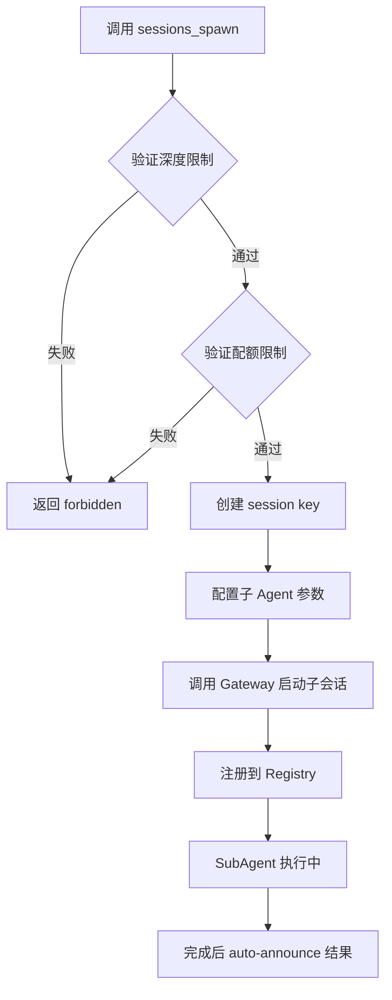
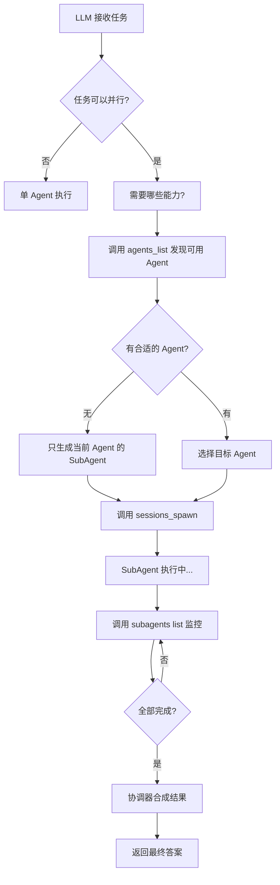

# OpenClaw SubAgent 并行执行机制深度分析

## 概述

本文档基于 OpenClaw 源码分析，详细阐述 SubAgent 并行执行的使用场景、生成机制、可用性发现流程以及 LLM 的感知方式。

---

## 一、SubAgent 使用场景分析

### 1.1 核心触发机制

OpenClaw 中 SubAgent 的使用**完全由 AI Agent 自主决策**，不存在预定义的触发条件。系统通过系统提示引导 Agent 在合适的场景下使用 SubAgent。

**触发依据：**

- 任务是否可以并行化处理
- 任务复杂度是否需要分解
- 是否有独立的长时子任务

**系统提示指导（来源：[subagent-announce.ts](d:\prj\openclaw_analyze\src\agents\subagent-announce.ts#L967-L986)）：**

```
## Sub-Agent Spawning

You CAN spawn your own sub-agents for parallel or complex work using `sessions_spawn`.
Use the `subagents` tool to steer, kill, or do an on-demand status check for your spawned sub-agents.
Your sub-agents will announce their results back to you automatically (not to the main agent).
Default workflow: spawn work, continue orchestrating, and wait for auto-announced completions.
```

### 1.2 典型使用场景

| 场景 | 说明 | 示例 |
|------|------|------|
| **并行独立任务** | 多个不相关的子任务同时执行 | 同时搜索多个数据源 |
| **复杂任务分解** | 大任务拆分为并行子任务 | 代码重构 + 测试生成 |
| **长时间运行任务** | 后台执行，不阻塞主会话 | 大规模数据分析 |
| **资源密集型操作** | 分担主 Agent 计算负载 | 多文件并行编译 |

### 1.3 反模式警告

系统提示明确禁止以下行为：

- 不要轮询 `sessions_list`、`sessions_history`
- 不要使用 `exec sleep` 进行等待
- 不要重复调用 `subagents list` 形成轮询循环

**正确的等待机制是推送式（push-based）的 auto-announce。**

---

## 二、SubAgent 生成机制

### 2.1 核心结论：完全动态生成

**SubAgent 是完全动态生成的，不存在预置的 SubAgent 列表。**

每次调用 `sessions_spawn` 时，系统都会：

1. 生成唯一的 UUID 作为标识
2. 创建动态的 session key：`agent:<agentId>:subagent:<uuid>`
3. 注册到 SubagentRegistry 进行生命周期管理

**核心代码（来源：[subagent-spawn.ts](d:\prj\openclaw_analyze\src\agents\subagent-spawn.ts#L601)）：**

```typescript
// 动态生成 session key
const childSessionKey = `agent:${targetAgentId}:subagent:${crypto.randomUUID()}`;
```

### 2.2 动态参数

SubAgent 的生成参数完全动态：

| 参数 | 说明 | 来源 |
|------|------|------|
| `task` | 任务描述 | 动态指定 |
| `model` | 使用模型 | 可覆盖 |
| `agentId` | 目标 Agent | 可指定 |
| `label` | 任务标签 | 可选 |
| `runTimeoutSeconds` | 超时限制 | 可配置 |
| `thread` | 线程绑定 | 可选 |
| `cleanup` | 清理策略 | 可配置 |

### 2.3 生成流程



---

## 三、SubAgent 可用性发现机制

### 3.1 发现机制概览

SubAgent 没有"可用列表"的概念，其可用性通过**多层机制**来确定：

1. **配置阶段**：通过 `agents.list` 发现配置的 Agent
2. **权限阶段**：通过 `allowAgents` 白名单过滤
3. **运行时阶段**：通过 Registry 追踪活跃 SubAgent

### 3.2 Agent 配置发现（静态）

**数据来源：** `agents.list[]` 配置项

**代码实现（来源：[agent-scope.ts](d:\prj\openclaw_analyze\src\agents\agent-scope.ts#L54-L70)）：**

```typescript
export function listAgentIds(cfg: OpenClawConfig): string[] {
  const agents = listAgentEntries(cfg);
  
  // 如果没有配置任何 Agent，默认返回 "main"
  if (agents.length === 0) {
    return [DEFAULT_AGENT_ID];
  }
  
  // 从配置中提取所有 Agent ID
  const seen = new Set<string>();
  const ids: string[] = [];
  for (const entry of agents) {
    const id = normalizeAgentId(entry?.id);
    if (!seen.has(id)) {
      seen.add(id);
      ids.push(id);
    }
  }
  return ids;
}
```

### 3.3 权限白名单过滤

**配置项：** `subagents.allowAgents`

**代码实现（来源：[agents-list-tool.ts](d:\prj\openclaw_analyze\src\agents\tools\agents-list-tool.ts#L44-L80)）：**

```typescript
// 读取 allowAgents 白名单
const allowAgents = resolveAgentConfig(cfg, requesterAgentId)
  ?.subagents?.allowAgents ?? [];

const allowAny = allowAgents.some((value) => value.trim() === "*");

const allowed = new Set<string>();
allowed.add(requesterAgentId);  // 始终可以生成自己的 subagent

if (allowAny) {
  // 允许所有配置的 Agent
  for (const id of configuredIds) {
    allowed.add(id);
  }
} else {
  // 只允许白名单中的 Agent
  for (const id of allowSet) {
    allowed.add(id);
  }
}
```

### 3.4 运行时 SubAgent 追踪

**组件：** SubagentRegistry

**功能：**

- 追踪活跃的 SubAgent 运行
- 管理 SubAgent 生命周期
- 提供查询接口给 `subagents list` 工具

**关键数据结构（来源：[subagent-registry.ts](d:\prj\openclaw_analyze\src\agents\subagent-registry.ts)）：**

```typescript
export type SubagentRunRecord = {
  runId: string;                    // 唯一标识
  childSessionKey: string;          // 子会话 key
  controllerSessionKey: string;     // 父会话 key
  task: string;                     // 任务描述
  cleanup: "delete" | "keep";      // 清理策略
  label?: string;                   // 可选标签
  model?: string;                   // 使用的模型
  startedAt?: number;               // 开始时间
  endedAt?: number;                // 结束时间
  outcome?: SubagentRunOutcome;     // 执行结果
};
```

---

## 四、LLM 如何感知 SubAgent 能力

### 4.1 三层感知机制

LLM 通过以下三层机制了解 SubAgent 的可用性：

#### 第一层：系统提示中的工具描述

**来源：[system-prompt.ts](d:\prj\openclaw_analyze\src\agents\system-prompt.ts#L264-L277)**

```typescript
const coreToolSummaries: Record<string, string> = {
  agents_list: 'List OpenClaw agent ids allowed for sessions_spawn',
  sessions_spawn: 'Spawn an isolated sub-agent session',
  subagents: 'List, steer, or kill sub-agent runs',
};
```

#### 第二层：子 Agent 系统提示中的 Spawn 指导

当 LLM 作为 SubAgent 运行时，收到专门的 spawn 指导：

```typescript
if (canSpawn) {
  lines.push(
    "## Sub-Agent Spawning",
    "You CAN spawn your own sub-agents for parallel or complex work using `sessions_spawn`.",
    "Use the `subagents` tool to steer, kill, or do an on-demand status check...",
    "Your sub-agents will announce their results back to you automatically...",
    "Default workflow: spawn work, continue orchestrating, and wait for auto-announced completions.",
  );
}
```

#### 第三层：运行时工具调用发现

LLM 可以调用工具动态发现可用信息：

| 工具 | 功能 | 返回内容 |
|------|------|----------|
| `agents_list` | 发现可用的 Agent | 可用的 Agent ID 列表 |
| `subagents list` | 查询活跃 SubAgent | 当前运行的 SubAgent |
| `sessions_list` | 列出所有会话 | 会话状态信息 |

### 4.2 LLM 决策流程



---

## 五、Agent 列表来源

### 5.1 配置来源

**主要来源：** `agents.list[]` 配置项

```json5
{
  agents: {
    list: [
      { id: "main", name: "主助手" },
      { id: "research", name: "研究助手" },
      { id: "coder", name: "编码助手" }
    ]
  }
}
```

### 5.2 默认行为

**如果没有配置任何 Agent：**

```typescript
if (agents.length === 0) {
  return [DEFAULT_AGENT_ID];  // 返回 "main"
}
```

### 5.3 完整来源总结

| 来源 | 配置位置 | 说明 |
|------|----------|------|
| **用户配置** | `agents.list[]` | 主要来源，用户手工配置 |
| **默认 Agent** | 系统自动生成 | 如果 `agents.list` 为空，自动创建 `"main"` |
| **绑定引用** | `bindings[].agentId` | 从 bindings 配置中引用的 Agent |

---

## 六、相关文件索引

### 核心文件

| 文件路径 | 功能描述 |
|---------|---------|
| [src/agents/subagent-spawn.ts](d:\prj\openclaw_analyze\src\agents\subagent-spawn.ts) | SubAgent 核心生成逻辑 |
| [src/agents/subagent-registry.ts](d:\prj\openclaw_analyze\src\agents\subagent-registry.ts) | SubAgent 生命周期和状态管理 |
| [src/agents/subagent-announce.ts](d:\prj\openclaw_analyze\src\agents\subagent-announce.ts) | 结果通知和系统提示构建 |
| [src/agents/tools/sessions-spawn-tool.ts](d:\prj\openclaw_analyze\src\agents\tools\sessions-spawn-tool.ts) | sessions_spawn 工具实现 |
| [src/agents/tools/subagents-tool.ts](d:\prj\openclaw_analyze\src\agents\tools\subagents-tool.ts) | subagents 监控工具实现 |
| [src/agents/tools/agents-list-tool.ts](d:\prj\openclaw_analyze\src\agents\tools\agents-list-tool.ts) | agents_list 工具实现 |
| [src/agents/agent-scope.ts](d:\prj\openclaw_analyze\src\agents\agent-scope.ts) | Agent 配置解析 |
| [src/config/types.agents.ts](d:\prj\openclaw_analyze\src\config\types.agents.ts) | Agent 配置类型定义 |
| [src/config/types.agent-defaults.ts](d:\prj\openclaw_analyze\src\config\types.agent-defaults.ts) | SubAgent 默认配置 |

### 命令处理

| 文件路径 | 功能描述 |
|---------|---------|
| [src/auto-reply/reply/commands-subagents/action-spawn.ts](d:\prj\openclaw_analyze\src\auto-reply\reply\commands-subagents\action-spawn.ts) | /subagents spawn 命令处理 |
| [src/auto-reply/reply/commands-subagents/shared.ts](d:\prj\openclaw_analyze\src\auto-reply\reply\commands-subagents\shared.ts) | 命令共享逻辑 |

---

## 七、设计哲学总结

> **"SubAgent 是任务驱动的动态实体，不是预配置的资源池"**

这种设计带来以下优势：

1. **零维护成本** - 无需维护预置 SubAgent 列表
2. **按需弹性** - 根据任务复杂度自动生成
3. **资源隔离** - 每个 SubAgent 独立运行
4. **灵活控制** - 通过白名单控制可用性

### 关键洞察

1. **SubAgent 无预置** - 完全动态生成
2. **LLM 自主决策** - 通过系统提示引导
3. **权限驱动发现** - 白名单机制控制可用性
4. **运行时追踪** - Registry 管理生命周期

---

## 八、相关文档

- [docs/tools/subagents.md](d:\prj\openclaw_analyze\docs\tools\subagents.md) - SubAgent 官方文档
- [docs/tools/acp-agents.md](d:\prj\openclaw_analyze\docs\tools\acp-agents.md) - ACP Agent 文档
- [analysis/13-Sub-Agent 创建流程与触发场景.md](d:\prj\openclaw_analyze\analysis\13-Sub-Agent%20创建流程与触发场景.md) - 创建流程分析
- [analysis/11-多 Agent 实现分析.md](d:\prj\openclaw_analyze\analysis\11-多Agent%20实现分析.md) - 多 Agent 分析

---

*文档生成时间：2026-06-01*
