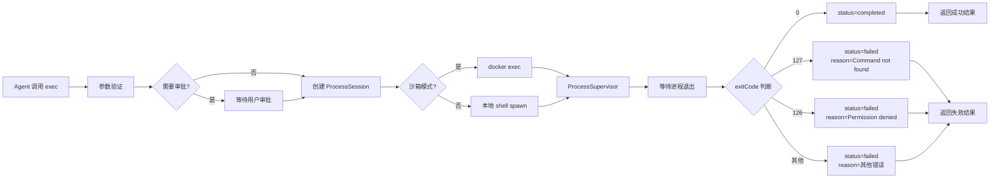
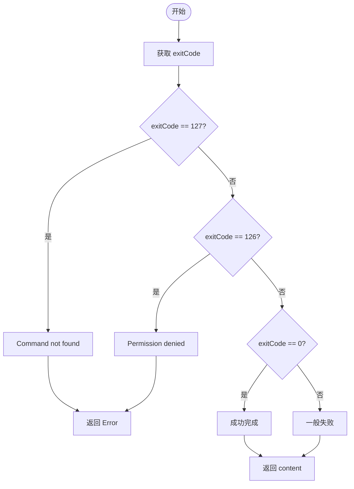

# Bash/Python/Node.js 命令执行结果处理流程分析

## 一、执行流程总览



### 核心判断逻辑



## 二、详细流程说明

### 1. 入口层 - createExecTool()

**文件**: `src/agents/bash-tools.exec.ts`

**核心函数** `createExecTool()` 是 exec 工具的工厂函数：

```typescript
export function createExecTool(
  defaults?: ExecToolDefaults,
): AgentTool<any, ExecToolDetails> {
  return {
    name: "exec",
    execute: async (_toolCallId, args, signal, onUpdate) => {
      // 1. 参数验证
      if (!params.command) {
        throw new Error("Provide a command to start.");
      }
      
      // 2. 解析执行配置
      // - host: sandbox / gateway / node
      // - security: deny / allowlist / full
      // - ask: off / on-miss / always
      // - pty: 是否使用 PTY 模式
      
      // 3. 环境变量处理
      // - 沙箱: 继承原始环境变量
      // - 主机: 清理危险变量 sanitizeHostBaseEnv()
      
      // 4. 调用 runExecProcess() 执行命令
      const run = await runExecProcess({...});
      
      // 5. 返回结果
      return new Promise((resolve, reject) => {
        run.promise.then((outcome) => {
          if (outcome.status === "failed") {
            reject(new Error(outcome.reason));
          } else {
            resolve({ content: [...], details: {...} });
          }
        });
      });
    }
  }
}
```

### 2. 参数验证层 - validateScriptFileForShellBleed()

**文件**: `src/agents/bash-tools.exec.ts` (第 46-107 行)

预检脚本文件，检测常见的 shell 变量泄漏问题：

```typescript
async function validateScriptFileForShellBleed(params: {
  command: string;
  workdir: string;
}): Promise<void> {
  // 1. 从命令中提取脚本目标 (python/node)
  const target = extractScriptTargetFromCommand(params.command);
  if (!target) return;

  // 2. 解析脚本文件路径为绝对路径
  const absPath = path.isAbsolute(target.relOrAbsPath)
    ? path.resolve(target.relOrAbsPath)
    : path.resolve(params.workdir, target.relOrAbsPath);

  // 3. 读取脚本内容
  const content = await fs.readFile(absPath, "utf-8");

  // 4. 检测 shell 变量泄漏
  // 匹配大写格式的环境变量 $USER, $PATH 等
  const envVarRegex = /\$[A-Z_][A-Z0-9_]{1,}/g;
  if (envVarRegex.test(content)) {
    throw new Error(
      `exec preflight: detected likely shell variable injection...`
    );
  }
}

// 脚本目标提取函数
function extractScriptTargetFromCommand(command: string): 
  | { kind: "python"; relOrAbsPath: string }
  | { kind: "node"; relOrAbsPath: string }
  | null {
  // 匹配 python script.py 形式
  const pythonMatch = command.match(/^\s*(python3?|python)\s+(?:-[^\s]+\s+)*([^\s]+\.py)\b/i);
  if (pythonMatch?.[2]) {
    return { kind: "python", relOrAbsPath: pythonMatch[2] };
  }
  
  // 匹配 node app.js 形式
  const nodeMatch = command.match(/^\s*(node)\s+(?:-[^\s]+\s+)*([^\s]+\.js)\b/i);
  if (nodeMatch?.[2]) {
    return { kind: "node", relOrAbsPath: nodeMatch[2] };
  }
  
  return null;
}
```

### 3. 审批层 - processGatewayAllowlist()

**文件**: `src/infra/exec-approvals.ts`

根据安全策略决定是否需要审批：

```typescript
export interface ExecApprovalPolicy {
  ask: "off" | "on-miss" | "always";
  security: "deny" | "allowlist" | "full";
  safeBins?: SafeBinProfile[];
}

// 审批判断逻辑
function shouldRequestApproval(policy: ExecApprovalPolicy, command: string): boolean {
  // ask=off: 从不询问
  if (policy.ask === "off") return false;
  
  // ask=always: 始终询问
  if (policy.ask === "always") return true;
  
  // ask=on-miss: 命令不在白名单时询问
  return !isCommandInAllowlist(command, policy);
}

// 构建审批消息
export function buildApprovalPendingMessage(params: {
  warningText?: string;
  approvalSlug: string;
  approvalId: string;
  command: string;
  cwd: string;
  host: "gateway" | "node";
  nodeId?: string;
}) {
  // ... 构建包含命令、工作目录、审批方式的审批消息
  return [
    `Approval required (id ${params.approvalSlug}).`,
    `Host: ${params.host}`,
    `CWD: ${params.cwd}`,
    `Command: ${params.command}`,
    `Reply with: /approve ${params.approvalSlug} allow-once|allow-always|deny`,
  ].join("\n");
}
```

### 4. 执行层 - runExecProcess()

**文件**: `src/agents/bash-tools.exec-runtime.ts` (第 407-796 行)

核心函数 `runExecProcess()` 负责实际进程执行：

```typescript
export async function runExecProcess(opts: {
  command: string;
  execCommand?: string;    // 实际执行的命令（sanitized）
  workdir: string;
  env: Record<string, string>;
  sandbox?: BashSandboxConfig;
  usePty: boolean;
  timeoutSec: number | null;
  onUpdate?: (partialResult: AgentToolResult<ExecToolDetails>) => void;
}): Promise<ExecProcessHandle> {
  const startedAt = Date.now();
  
  // 1. 创建会话
  const sessionId = createSessionSlug();
  const session: ProcessSession = {
    id: sessionId,
    command: opts.command,
    startedAt,
    maxOutputChars: opts.maxOutput,
    pendingStdout: [],
    pendingStderr: [],
    aggregated: "",
    tail: "",
    exited: false,
  };
  addSession(session);

  // 2. 获取进程监督器
  const supervisor = getProcessSupervisor();

  // 3. 构建 spawn 参数
  const spawnSpec = opts.sandbox 
    ? buildSandboxSpawnSpec(opts)   // Docker exec 模式
    : buildLocalSpawnSpec(opts);    // 本地 shell 模式

  // 4. 启动进程
  const managedRun = await supervisor.spawn({
    runId: sessionId,
    mode: opts.usePty ? "pty" : "child",
    argv: spawnSpec.argv,
    timeoutMs: opts.timeoutSec * 1000,
    onStdout: handleStdout,
    onStderr: handleStderr,
  });

  // 5. 返回进程句柄
  return {
    session,
    promise: managedRun.wait().then(exit => processExit(exit, session)),
    kill: () => managedRun.cancel("manual-cancel"),
  };
}
```

### 5. 进程管理 - createProcessSupervisor()

**文件**: `src/process/supervisor/supervisor.ts`

`createProcessSupervisor()` 管理进程生命周期：

```typescript
export function createProcessSupervisor(): ProcessSupervisor {
  const registry = createRunRegistry();
  const active = new Map<string, ActiveRun>();

  const spawn = async (input: SpawnInput): Promise<ManagedRun> => {
    // 1. 生成 runId
    const runId = input.runId?.trim() || crypto.randomUUID();
    
    // 2. 创建初始记录
    const record: RunRecord = {
      runId,
      state: "starting",
      startedAtMs: Date.now(),
      lastOutputAtMs: Date.now(),
    };
    registry.add(record);

    // 3. 设置超时定时器
    let timeoutTimer: NodeJS.Timeout | null = null;
    let noOutputTimer: NodeJS.Timeout | null = null;
    
    if (input.timeoutMs) {
      timeoutTimer = setTimeout(() => {
        requestCancel("overall-timeout");
      }, input.timeoutMs);
    }

    // 4. 无输出超时检测
    if (input.noOutputTimeoutMs) {
      noOutputTimer = setTimeout(() => {
        requestCancel("no-output-timeout");
      }, input.noOutputTimeoutMs);
    }

    // 5. 创建适配器 (child 或 pty)
    const adapter = input.mode === "pty"
      ? await createPtyAdapter({...})
      : await createChildAdapter({...});

    // 6. 绑定输出回调
    adapter.onStdout((chunk) => {
      input.onStdout?.(chunk);
      touchOutput();  // 重置无输出超时
    });

    // 7. 等待退出
    const exit = await adapter.wait();

    // 8. 清理定时器
    clearTimers();

    return {
      runId,
      pid: adapter.pid,
      wait: () => Promise.resolve(exit),
      cancel: (reason) => adapter.kill("SIGKILL"),
    };
  };

  return { spawn, cancel, cancelScope, getRecord };
}
```

### 6. 适配器层 - createChildAdapter()

**文件**: `src/process/supervisor/adapters/child.ts`

`createChildAdapter()` 创建子进程适配器：

```typescript
export async function createChildAdapter(params: {
  argv: string[];
  cwd?: string;
  env?: NodeJS.ProcessEnv;
}): Promise<ChildAdapter> {
  // 1. 使用 spawnWithFallback 启动进程
  const spawned = await spawnWithFallback({
    argv: params.argv,
    options: {
      cwd: params.cwd,
      env: params.env,
      stdio: ["pipe", "pipe", "pipe"],
    },
    fallbacks: [{ label: "no-detach", options: { detached: false } }],
  });

  const child = spawned.child;

  // 2. 等待进程退出
  const wait = async () =>
    await new Promise<{ code: number | null; signal: NodeJS.Signals | null }>((resolve) => {
      child.once("close", (code, signal) => {
        resolve({ code, signal });
      });
      child.once("error", (err) => {
        reject(err);
      });
    });

  // 3. 终止进程
  const kill = (signal?: NodeJS.Signals) => {
    killProcessTree(child.pid, signal ?? "SIGKILL");
  };

  return {
    pid: child.pid,
    onStdout: (listener) => 
      child.stdout.on("data", (chunk) => listener(chunk.toString())),
    onStderr: (listener) => 
      child.stderr.on("data", (chunk) => listener(chunk.toString())),
    wait,
    kill,
    dispose: () => child.removeAllListeners(),
  };
}
```

### 7. 输出处理 - bash-process-registry.ts

**文件**: `src/agents/bash-process-registry.ts`

`appendOutput()` 函数处理 stdout/stderr 输出缓冲：

```typescript
export function appendOutput(
  session: ProcessSession,
  type: "stdout" | "stderr",
  chunk: string
): void {
  // 1. 追加到待消费队列
  if (type === "stdout") {
    session.pendingStdout.push(chunk);
    session.pendingStdoutChars += chunk.length;
  } else {
    session.pendingStderr.push(chunk);
    session.pendingStderrChars += chunk.length;
  }

  // 2. 累积总字符数
  session.totalOutputChars += chunk.length;

  // 3. 截断处理
  const maxChars = session.backgrounded 
    ? session.pendingMaxOutputChars 
    : session.maxOutputChars;
    
  if (session.totalOutputChars > maxChars) {
    session.truncated = true;
    // 保留尾部 2000 字符
    session.tail = session.aggregated.slice(-2000);
  }

  // 4. 聚合输出
  session.aggregated += chunk;
  session.tail = session.aggregated.slice(-2000);
}
```

## 三、成功/失败判断逻辑

**文件**: `src/agents/bash-tools.exec-runtime.ts` (第 600-650 行)

```typescript
const promise = managedRun.wait().then((exit): ExecProcessOutcome => {
  // 1. 判断是否为正常退出
  const isNormalExit = exit.reason === "exit";
  const exitCode = exit.exitCode ?? 0;
  
  // 2. Shell 退出码判断
  // 126: 不可执行（权限拒绝）
  // 127: 命令未找到
  // 这两个是基础设施故障，应作为错误暴露
  const isShellFailure = exitCode === 126 || exitCode === 127;
  
  // 3. 成功条件: 正常退出 且 非 shell 失败码
  const status: "completed" | "failed" =
    isNormalExit && !isShellFailure ? "completed" : "failed";

  // ============ 成功结果 ============
  if (status === "completed") {
    const exitMsg = exitCode !== 0 
      ? `\n\n(Command exited with code ${exitCode})` 
      : "";
    return {
      status: "completed",
      exitCode,
      exitSignal: exit.exitSignal,
      durationMs,
      aggregated: aggregated + exitMsg,
      timedOut: false,
    };
  }

  // ============ 失败结果 ============
  let reason: string;
  
  if (isShellFailure) {
    // Shell 错误码
    reason = exitCode === 127
      ? "Command not found"
      : "Command not executable (permission denied)";
  } else if (exit.reason === "overall-timeout") {
    // 整体超时
    reason = typeof opts.timeoutSec === "number" && opts.timeoutSec > 0
      ? `Command timed out after ${opts.timeoutSec} seconds. ` +
        `If this command is expected to take longer, re-run with a higher timeout.`
      : "Command timed out. If this command is expected to take longer, re-run with a higher timeout.";
  } else if (exit.reason === "no-output-timeout") {
    // 无输出超时
    reason = "Command timed out waiting for output";
  } else if (exit.exitSignal != null) {
    // 信号中止
    reason = `Command aborted by signal ${exit.exitSignal}`;
  } else {
    // 未知错误
    reason = "Command aborted before exit code was captured";
  }

  return {
    status: "failed",
    exitCode: exit.exitCode,
    exitSignal: exit.exitSignal,
    durationMs,
    aggregated,
    timedOut: exit.timedOut,
    reason: aggregated ? `${aggregated}\n\n${reason}` : reason,
  };
});
```

## 四、结果返回格式

### 成功结果 (status: "completed")

```typescript
{
  content: [
    { 
      type: "text", 
      text: "命令输出内容\n(Command exited with code 0)" 
    }
  ],
  details: {
    status: "completed",
    exitCode: 0,
    durationMs: 1234,
    aggregated: "命令输出内容",
    cwd: "/working/directory",
  }
}
```

### 失败结果 (status: "failed")

当执行失败时，AgentTool 会抛出 Error：

```typescript
// AgentTool 执行失败时的处理
run.promise.then((outcome) => {
  if (outcome.status === "failed") {
    reject(new Error(outcome.reason ?? "Command failed."));
  }
});

// 错误信息包含:
// - aggregated: 命令的 stdout/stderr 输出
// - reason: 人类可读的错误原因
// - exitCode: 具体的退出码
```

### 运行中结果 (status: "running")

```typescript
{
  content: [
    { 
      type: "text", 
      text: "Command still running (session xxx, pid 12345). " +
            "Use process (list/poll/log/write/kill/clear/remove) for follow-up." 
    }
  ],
  details: {
    status: "running",
    sessionId: "xxx",
    pid: 12345,
    startedAt: 1699999999999,
    cwd: "/working/directory",
    tail: "最后 2000 字符输出",
  }
}
```

## 五、错误类型总结

| 退出码/原因 | 含义 | 判断条件 |
|------------|------|---------|
| `exitCode === 0` | 成功 | 正常退出，无错误 |
| `exitCode === 1` | 一般错误 | 非零退出码但非 shell 错误 |
| `exitCode === 126` | 权限拒绝 | 不可执行（无执行权限） |
| `exitCode === 127` | 命令未找到 | shell 找不到该命令 |
| `exit.reason === "overall-timeout"` | 超时 | 命令执行超过 timeout 参数 |
| `exit.reason === "no-output-timeout"` | 无输出超时 | 长时间无任何输出 |
| `exit.exitSignal !== null` | 信号中止 | 被 SIGTERM/SIGKILL 等终止 |
| `spawn error` | 启动失败 | 进程创建失败 |

## 六、关键类/文件对应表

| 流程节点 | 文件路径 | 主要函数/类 |
|--------|---------|-----------|
| 工具入口 | `src/agents/bash-tools.exec.ts` | `createExecTool()` |
| 参数验证 | `src/agents/bash-tools.exec.ts` | `validateScriptFileForShellBleed()` |
| 脚本检测 | `src/agents/bash-tools.exec.ts` | `extractScriptTargetFromCommand()` |
| 审批处理 | `src/infra/exec-approvals.ts` | `processGatewayAllowlist()` |
| 审批消息 | `src/infra/exec-approvals.ts` | `buildApprovalPendingMessage()` |
| 执行核心 | `src/agents/bash-tools.exec-runtime.ts` | `runExecProcess()` |
| 环境清理 | `src/agents/bash-tools.exec-runtime.ts` | `sanitizeHostBaseEnv()` |
| 进程管理 | `src/process/supervisor/supervisor.ts` | `createProcessSupervisor()` |
| 运行记录 | `src/process/supervisor/registry.ts` | `createRunRegistry()` |
| 子进程适配器 | `src/process/supervisor/adapters/child.ts` | `createChildAdapter()` |
| PTY 适配器 | `src/process/supervisor/adapters/pty.ts` | `createPtyAdapter()` |
| Spawn 工具 | `src/process/spawn-utils.ts` | `spawnWithFallback()` |
| 输出缓冲 | `src/agents/bash-process-registry.ts` | `addSession()`, `appendOutput()` |
| 会话清理 | `src/agents/bash-process-registry.ts` | `markExited()` |
| 结果聚合 | `src/agents/bash-tools.exec-runtime.ts` | `ExecProcessOutcome` |

## 七、类型定义

### SpawnResult

```typescript
export type SpawnResult = {
  pid?: number;
  stdout: string;
  stderr: string;
  code: number | null;
  signal: NodeJS.Signals | null;
  killed: boolean;
  termination: "exit" | "timeout" | "no-output-timeout" | "signal";
  noOutputTimedOut?: boolean;
};
```

### ExecProcessOutcome

```typescript
export type ExecProcessOutcome = {
  status: "completed" | "failed";
  exitCode: number | null;
  exitSignal: NodeJS.Signals | number | null;
  durationMs: number;
  aggregated: string;
  timedOut: boolean;
  reason?: string;
};
```

### RunRecord

```typescript
export type RunRecord = {
  runId: string;
  sessionId: string;
  backendId: string;
  scopeKey?: string;
  pid?: number;
  startedAtMs: number;
  lastOutputAtMs: number;
  state: "starting" | "running" | "exiting" | "exited";
  terminationReason?: TerminationReason;
  exitCode?: number | null;
  exitSignal?: NodeJS.Signals | number | null;
};
```

### TerminationReason

```typescript
export type TerminationReason =
  | "manual-cancel"      // 手动取消
  | "overall-timeout"     // 整体超时
  | "no-output-timeout"    // 无输出超时
  | "spawn-error"         // 启动错误
  | "signal"              // 信号终止
  | "exit";               // 正常退出
```

## 八、总结

**核心判断逻辑**位于 `src/agents/bash-tools.exec-runtime.ts` 的 `runExecProcess()` 函数中：

1. **成功判断**：
   - `exit.reason === "exit"` (正常退出)
   - `exitCode` 既不是 126 也不是 127

2. **失败判断**：
   - 非正常退出
   - Shell 错误码 126/127
   - 超时 (overall-timeout / no-output-timeout)
   - 信号中止

3. **错误信息获取**：
   - `outcome.reason`: 人类可读的错误原因
   - `outcome.aggregated`: 命令的 stdout/stderr
   - `outcome.exitCode`: 具体的退出码
