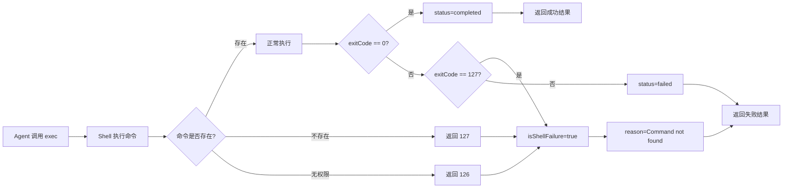
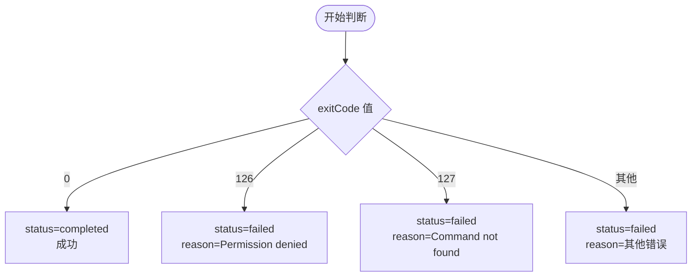

# 环境不具备时的处理流程分析

## 一、概述

当执行 bash/python/node 命令时，如果目标环境**不具备**相应的运行时（Python 未安装、Node.js 版本不匹配等），系统采用以下处理策略：

1. **无预检查机制** - 系统不会在执行前检查命令是否存在
2. **依赖 Shell 退出码** - Shell 会返回特定的退出码表示错误类型
3. **127/126 特殊处理** - 将命令未找到和权限拒绝识别为**基础设施故障**
4. **错误信息直接暴露** - 将 Shell 返回的错误信息完整展示给用户

## 二、处理流程图



### Shell 退出码含义



## 三、核心判断逻辑

### 文件: `src/agents/bash-tools.exec-runtime.ts` (第 713-750 行)

```typescript
const promise = managedRun.wait().then((exit): ExecProcessOutcome => {
  const durationMs = Date.now() - startedAt;
  const isNormalExit = exit.reason === "exit";
  const exitCode = exit.exitCode ?? 0;

  // ==========================================
  // 核心判断逻辑: Shell 失败码 126/127
  // ==========================================
  // Shell 退出码 126（不可执行）和 127（命令未找到）是基础设施故障
  // 应该作为真实错误暴露而不是静默完成
  //
  // 例如: `python: command not found`
  const isShellFailure = exitCode === 126 || exitCode === 127;

  // 成功条件: 正常退出 且 非 shell 失败码
  const status: "completed" | "failed" =
    isNormalExit && !isShellFailure ? "completed" : "failed";

  // ============ 成功结果 ============
  if (status === "completed") {
    const exitMsg = exitCode !== 0
      ? `\n\n(Command exited with code ${exitCode})`
      : "";
    return {
      status: "completed",
      exitCode,
      durationMs,
      aggregated: aggregated + exitMsg,
      timedOut: false,
    };
  }

  // ============ 失败结果 - 错误原因判断 ============
  const reason = isShellFailure
    ? exitCode === 127
      ? "Command not found"              // 127: 命令不存在
      : "Command not executable"         // 126: 无执行权限
    : exit.reason === "overall-timeout"
      ? "Command timed out..."
    : exit.reason === "no-output-timeout"
      ? "Command timed out waiting for output"
    : exit.exitSignal != null
      ? `Command aborted by signal ${exit.exitSignal}`
    : "Command aborted before exit code was captured";

  return {
    status: "failed",
    exitCode: exit.exitCode,
    durationMs,
    aggregated,
    reason: aggregated
      ? `${aggregated}\n\n${reason}`    // stderr 输出 + 原因
      : reason,
  };
});
```

## 四、Shell 退出码含义

| 退出码 | 含义 | 系统行为 |
|--------|------|---------|
| `0` | 成功 | `status = "completed"` |
| `1` | 一般错误 | `status = "failed"` |
| `126` | 权限拒绝 / 不可执行 | `status = "failed"`, `reason = "Command not executable"` |
| `127` | 命令未找到 | `status = "failed"`, `reason = "Command not found"` |
| `128+N` | 被信号 N 终止 | `status = "failed"`, `reason = "Command aborted by signal N"` |

## 五、具体场景分析

### 场景 1: Python 未安装

```bash
$ python script.py
bash: python: command not found
```

**Shell 处理**:
- Shell 尝试在 PATH 中查找 `python` 命令
- 找不到，返回退出码 `127`

**系统处理**:
```typescript
exitCode = 127
isShellFailure = true
status = "failed"
reason = "Command not found"

// 最终返回给 Agent 的 Error message:
// "bash: python: command not found\n\nCommand not found"
```

### 场景 2: Python 版本不匹配

```bash
$ python script.py
python: version `3.11' for `python' is not installed
```

**系统处理**:
- 命令存在，但执行失败
- 返回退出码可能是 `1` 或其他非零值
- `status = "failed"`
- `reason = stderr 输出内容`

### 场景 3: Node.js 未安装

```bash
$ node app.js
bash: node: command not found
```

**系统处理**:
- 与 Python 未安装相同
- `exitCode = 127`
- `reason = "Command not found"`

### 场景 4: 权限不足

```bash
$ ./script.sh
bash: ./script.sh: Permission denied
```

**系统处理**:
- 命令存在但无执行权限
- `exitCode = 126`
- `reason = "Command not executable (permission denied)"`

## 六、安全机制：SafeBins 警告

### 文件: `src/agents/bash-tools.exec.ts` (第 251-256 行)

系统对**解释器类**的 safeBins 有额外警告：

```typescript
// 解释器/运行时二进制（如 python, node）在 safeBins 中是不安全的，
// 除非有明确的 hardened profiles
if (unprofiledInterpreterSafeBins.length > 0) {
  logInfo(
    `exec: interpreter/runtime binaries in safeBins (${unprofiledInterpreterSafeBins.join(", ")}) are unsafe without explicit hardened profiles; prefer allowlist entries`,
  );
}
```

**解释器列表** (`src/infra/exec-safe-bin-runtime-policy.ts`):
```typescript
const INTERPRETER_LIKE_SAFE_BINS = new Set([
  "ash", "bash", "busybox", "bun", "cmd", "cscript",
  "dash", "deno", "fish", "ksh", "lua",
  "node", "nodejs",              // <-- Node.js
  "perl", "php", "powershell",
  "python", "python2", "python3", // <-- Python
  "pypy", "pwsh", "ruby", "sh", "zsh",
  // ... 等等
]);
```

## 七、命令解析机制

### 文件: `src/infra/exec-command-resolution.ts`

系统在执行前会尝试解析命令路径，但不检查是否存在：

```typescript
export function resolveCommandResolution(
  command: string,
  cwd?: string,
  env?: NodeJS.ProcessEnv,
): CommandResolution | null {
  const rawExecutable = parseFirstToken(command);
  if (!rawExecutable) {
    return null;
  }
  return buildCommandResolution({
    rawExecutable,
    // ... 返回原始可执行文件名
    // 不检查是否真的存在！
  });
}
```

### 文件: `src/infra/executable-path.ts`

这是唯一尝试解析命令路径的地方：

```typescript
export function resolveExecutablePath(
  rawExecutable: string,
  options?: { cwd?: string; env?: NodeJS.ProcessEnv },
): string | undefined {
  // 1. 处理绝对路径
  if (expanded.includes("/") || expanded.includes("\\")) {
    if (path.isAbsolute(expanded)) {
      return isExecutableFile(expanded) ? expanded : undefined;
    }
    // 2. 处理相对路径
    const candidate = path.resolve(base, expanded);
    return isExecutableFile(candidate) ? candidate : undefined;
  }
  // 3. 从 PATH 环境变量查找
  return resolveExecutableFromPathEnv(expanded, envPath, options?.env);
}
```

**关键点**: 虽然 `resolveExecutablePath` 会检查文件是否存在，但这个检查结果**不会阻止命令执行**，只是在白名单匹配时使用。

## 八、错误信息构建

### 成功但有非零退出码

```typescript
if (status === "completed") {
  const exitMsg = exitCode !== 0
    ? `\n\n(Command exited with code ${exitCode})`
    : "";
  return {
    status: "completed",
    aggregated: aggregated + exitMsg,  // 输出 + 退出码提示
  };
}
```

### 失败时的错误信息

```typescript
return {
  status: "failed",
  reason: aggregated
    ? `${aggregated}\n\n${reason}`  // stderr 输出 + 原因描述
    : reason,
};
```

## 九、Doctor 检查机制

系统提供 `doctor` 命令用于检查环境配置，但不检查特定命令是否存在：

### 文件: `src/commands/doctor-sandbox.ts`

```typescript
async function isDockerAvailable(): Promise<boolean> {
  try {
    await runExec("docker", ["version", "--format", "{{.Server.Version}}"], {
      timeoutMs: 5_000,
    });
    return true;
  } catch {
    return false;
  }
}
```

**局限性**: `doctor` 命令主要检查 Docker 等基础设施是否可用，不检查 python/node 等特定命令。

## 十、总结

| 问题类型 | 检测方式 | 返回结果 |
|---------|---------|---------|
| Python 未安装 | Shell 返回 127 | `reason = "Command not found"` |
| Node.js 未安装 | Shell 返回 127 | `reason = "Command not found"` |
| 命令无执行权限 | Shell 返回 126 | `reason = "Command not executable"` |
| 版本不匹配 | 命令执行失败，返回非零码 | `reason = stderr + 原因` |
| 依赖库缺失 | 命令执行失败 | `reason = stderr + 原因` |

**核心设计原则**:
1. **不预检** - 系统不在执行前检查环境是否具备
2. **信任 Shell** - 依赖 Shell 的退出码和 stderr 输出
3. **127/126 特殊处理** - 这两个退出码被明确识别为基础设施工具故障
4. **透明暴露** - Shell 的错误信息会完整传递给 Agent
