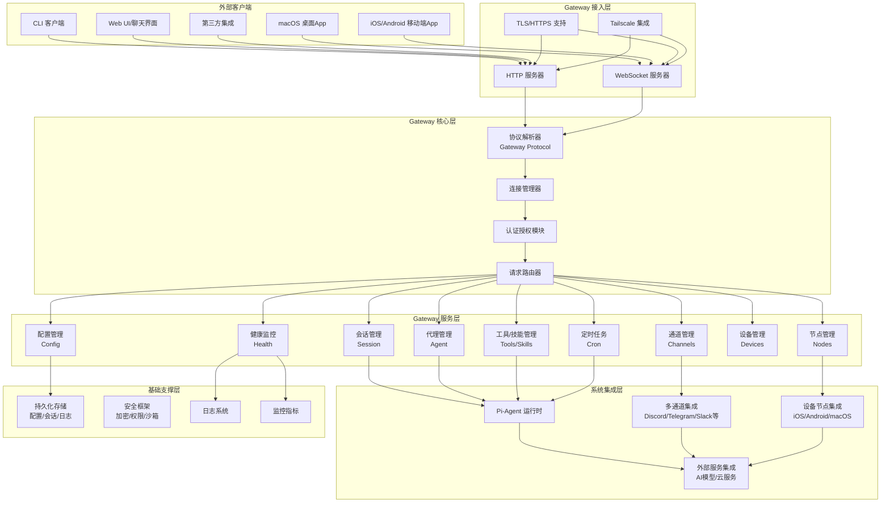

# OpenClaw Gateway 技术架构深度分析

## 一、Gateway 核心定位

Gateway 是 OpenClaw 的**核心控制平面**，是整个系统的中央枢纽，负责协调所有组件的通信和协作：
- 统一接入点：所有客户端（CLI、WebUI、移动端App、桌面端App）都通过 Gateway 连接
- 消息路由：处理来自各个通道的消息，分发给对应的代理处理
- 状态管理：维护系统全局状态，包括会话、通道、节点、配置等
- 安全控制：统一认证、授权和安全策略实施
- 服务暴露：提供标准化的 API 和 WebSocket 接口供上层调用

## 二、技术架构图



## 三、核心模块与关键文件

### 3.1 服务器核心模块
| 模块功能 | 关键文件 | 核心职责 |
|---------|---------|---------|
| **服务器入口** | `src/gateway/server.impl.ts` | Gateway 启动主入口，协调所有模块初始化 |
| **HTTP服务** | `src/gateway/server-http.ts` | HTTP 服务器实现，处理 REST API 请求 |
| **WebSocket服务** | `src/gateway/server-ws-runtime.ts` | WebSocket 服务实现，处理长连接和实时消息 |
| **连接管理** | `src/gateway/server/ws-connection/` | WebSocket 连接生命周期管理、认证、消息分发 |
| **TLS/HTTPS** | `src/gateway/server/tls.ts` | 传输层安全支持 |
| **服务启动** | `src/gateway/server-startup.ts` | 启动流程编排和依赖初始化 |

### 3.2 协议模块
| 模块功能 | 关键文件 | 核心职责 |
|---------|---------|---------|
| **协议定义** | `src/gateway/protocol/schema/*.ts` | 50+ 个接口 schema 定义，覆盖所有业务功能 |
| **协议导出** | `src/gateway/protocol/index.ts` | 协议类型和工具函数统一导出 |
| **消息帧定义** | `src/gateway/protocol/schema/frames.ts` | WebSocket 消息帧格式定义 |
| **错误码** | `src/gateway/protocol/schema/error-codes.ts` | 标准化错误码定义 |
| **方法列表** | `src/gateway/server-methods-list.ts` | 所有可用 API 方法枚举和元数据 |

### 3.3 业务服务模块
| 模块功能 | 关键文件 | 核心职责 |
|---------|---------|---------|
| **会话管理** | `src/gateway/session-*.ts` <br> `src/gateway/server-methods/sessions.ts` | 会话创建、恢复、持久化、上下文管理 |
| **代理管理** | `src/gateway/agent.ts` <br> `src/gateway/server-methods/agent.ts` | AI 代理调用、任务调度、状态管理 |
| **通道管理** | `src/gateway/server-channels.ts` <br> `src/gateway/server-methods/channels.ts` | 消息通道的注册、状态监控、消息路由 |
| **节点管理** | `src/gateway/node-registry.ts` <br> `src/gateway/server-methods/nodes.ts` | 设备节点的注册、发现、能力管理、命令分发 |
| **配置管理** | `src/gateway/config-reload.ts` <br> `src/gateway/server-methods/config.ts` | 配置加载、热更新、验证、持久化 |
| **技能工具** | `src/gateway/server-methods/skills.ts` <br> `src/gateway/server-methods/tools-catalog.ts` | 技能和工具的注册、发现、权限管理 |
| **定时任务** | `src/gateway/server-cron.ts` <br> `src/gateway/server-methods/cron.ts` | 定时任务的创建、调度、执行管理 |
| **设备管理** | `src/gateway/device-auth.ts` <br> `src/gateway/server-methods/devices.ts` | 设备配对、认证、权限控制 |
| **健康监控** | `src/gateway/health.ts` <br> `src/gateway/server-methods/health.ts` | 系统健康检查、指标收集、故障诊断 |
| **密钥管理** | `src/gateway/server-methods/secrets.ts` | 敏感信息加密存储、权限控制 |
| **控制UI** | `src/gateway/control-ui*.ts` | Web 管理界面的静态资源服务和 API |

### 3.4 安全模块
| 模块功能 | 关键文件 | 核心职责 |
|---------|---------|---------|
| **认证核心** | `src/gateway/auth.ts` | 多种认证方式实现（Token/密码/OAuth/设备配对） |
| **权限控制** | `src/gateway/role-policy.ts` | 基于角色的访问控制和 API 权限校验 |
| **认证限流** | `src/gateway/auth-rate-limit.ts` | 认证请求限流，防止暴力破解 |
| **设备认证** | `src/gateway/device-auth.ts` | 设备节点的配对和认证 |
| **安全策略** | `src/gateway/auth-mode-policy.ts` | 不同认证模式的安全策略实现 |

### 3.5 扩展模块
| 模块功能 | 关键文件 | 核心职责 |
|---------|---------|---------|
| **插件系统** | `src/gateway/server-plugins.ts` | 插件加载、生命周期管理、扩展点实现 |
| **Tailscale集成** | `src/gateway/server-tailscale.ts` | Tailscale 远程访问和安全暴露 |
| **服务发现** | `src/gateway/server-discovery.ts` | mDNS/Bonjour 服务发现，支持局域网设备自动发现 |
| **事件系统** | `src/gateway/events.ts` | 全局事件总线，支持模块间解耦通信 |
| **Hook系统** | `src/gateway/hooks.ts` | 钩子机制，支持自定义扩展点 |

## 四、主要业务流程

### 4.1 Gateway 启动流程

```
1. 配置加载
   ↓
2. 基础服务初始化（日志、安全、事件总线）
   ↓
3. 核心服务初始化
   ├─ 认证授权模块
   ├─ 会话管理模块
   ├─ 节点注册中心
   ├─ 通道管理器
   ├─ 定时任务服务
   └─ 插件管理器
   ↓
4. 外部依赖初始化
   ├─ 加载 AI 模型目录
   ├─ 初始化 Pi-Agent 运行时
   ├─ 启动通道健康监控
   └─ 加载技能和工具
   ↓
5. 接入层启动
   ├─ 启动 HTTP 服务器
   ├─ 启动 WebSocket 服务器
   ├─ 加载 TLS 配置
   └─ 配置路由和中间件
   ↓
6. 附加服务启动
   ├─ 启动 Tailscale 远程访问（如果配置）
   ├─ 启动服务发现（Bonjour/mDNS）
   ├─ 启动健康检查
   ├─ 启动定时任务调度器
   └─ 启动更新检查
   ↓
7. Gateway 启动完成，对外提供服务
```

**关键代码**：`startGatewayServer` 函数（`src/gateway/server.impl.ts`）
```typescript
export async function startGatewayServer(opts: GatewayServerOptions): Promise<GatewayServer> {
  // 1. 加载和验证配置
  const config = opts.config ?? loadConfig();
  
  // 2. 初始化运行时状态
  const runtimeState = createGatewayRuntimeState(config);
  
  // 3. 初始化核心服务
  const nodeRegistry = new NodeRegistry();
  const channelManager = createChannelManager(config);
  const cronService = await buildGatewayCronService(config);
  
  // 4. 注册服务方法
  const handlers = {
    ...coreGatewayHandlers,
    ...createSecretsHandlers(runtimeState),
    ...createExecApprovalHandlers(),
  };
  
  // 5. 启动 HTTP 和 WebSocket 服务
  const httpServer = await startHttpServer(config, handlers, runtimeState);
  const wsServer = attachGatewayWsHandlers(httpServer, handlers, runtimeState);
  
  // 6. 启动附加服务
  await startGatewayTailscaleExposure(config);
  await startGatewayDiscovery(config);
  await startHeartbeatRunner(config);
  
  return { httpServer, wsServer, runtimeState };
}
```

### 4.2 WebSocket 客户端连接流程

```
客户端 → 连接 ws://localhost:18789/gateway
            ↓
服务端 → 协议版本握手
            ↓
客户端 → 发送认证信息（Token/密码/设备密钥）
            ↓
服务端 → 认证校验 → 失败：关闭连接，返回错误码
                   成功：发送连接成功响应
            ↓
服务端 → 注册客户端会话，分配连接ID
            ↓
客户端 ↔ 双向消息通信（请求/响应、事件推送）
            ↓
客户端 → 断开连接
            ↓
服务端 → 清理会话资源，更新在线状态
```

**关键实现**：`src/gateway/server/ws-connection/message-handler.ts` 消息处理逻辑

### 4.3 API 请求处理流程

```
客户端 → 发送请求帧（包含 method、params、id）
            ↓
服务端 → 协议解析和 Schema 验证 → 参数错误：返回 InvalidParams 错误
            ↓
服务端 → 方法权限校验 → 无权限：返回 PermissionDenied 错误
            ↓
服务端 → 路由到对应处理函数
            ↓
处理函数 → 执行业务逻辑
            ↓
处理函数 → 返回结果或抛出错误
            ↓
服务端 → 构造响应帧（包含 result/error、id）
            ↓
服务端 → 发送响应给客户端
```

**关键实现**：`src/gateway/server-methods.ts` 中注册的 50+ 个 API 处理函数

### 4.4 消息处理全流程（从用户消息到AI回复）

```
1. 消息接收：从通道（Discord/Telegram等）收到用户消息
            ↓
2. 消息预处理：通道层将原始消息转换为 OpenClaw 内部统一格式
            ↓
3. 消息分发：通道层调用 Gateway 的 chat.send 方法
            ↓
4. 会话识别：Gateway 根据发送者ID和通道识别或创建会话
            ↓
5. 权限校验：验证发送者权限，应用通道安全策略
            ↓
6. 队列调度：消息加入处理队列，按优先级调度
            ↓
7. 上下文准备：加载会话历史，构建系统提示和工具集
            ↓
8. 代理调用：调用 Pi-Agent 运行时执行推理
            ↓
9. 工具调用：如果代理需要调用工具，执行对应的工具逻辑
            ↓
10. 结果生成：代理生成回复内容
            ↓
11. 响应投递：将回复发送回原消息通道
            ↓
12. 会话持久化：更新会话历史，存储到本地文件
```

### 4.5 设备节点接入流程（iOS/Android/macOS）

```
1. 节点发现：设备通过 Bonjour/mDNS 发现局域网内的 Gateway
   或：用户手动输入 Gateway 地址和配对码
            ↓
2. 配对请求：节点发送配对请求，包含设备信息和公钥
            ↓
3. 用户确认：Gateway 提示用户确认新设备配对
            ↓
4. 密钥交换：双方交换密钥，建立安全通信通道
            ↓
5. 能力上报：节点上报设备能力（相机/屏幕录制/位置/语音等）
            ↓
6. 注册完成：Gateway 将设备加入节点注册表
            ↓
7. 双向通信：Gateway 可以向节点发送命令，节点向 Gateway 上报状态和事件
```

**关键实现**：`src/gateway/node-registry.ts` 节点注册中心，`src/gateway/device-auth.ts` 设备认证

### 4.6 核心设计特点

1. **协议优先**：所有 API 都有强类型 Schema 定义，自动验证，类型安全
2. **插件化架构**：支持动态加载插件，无需修改核心代码即可扩展功能
3. **安全内置**：从传输层到应用层的多层安全防护，默认安全
4. **多端一致**：统一的协议支持所有类型的客户端，降低开发成本
5. **离线可用**：所有核心功能都可以本地运行，不依赖云服务
6. **高可扩展**：通过模块解耦和扩展点设计，支持快速添加新功能

Gateway 的设计体现了现代分布式系统的设计思想，既保证了核心功能的稳定性，又提供了足够的扩展性来支持未来的功能迭代和生态扩展。
