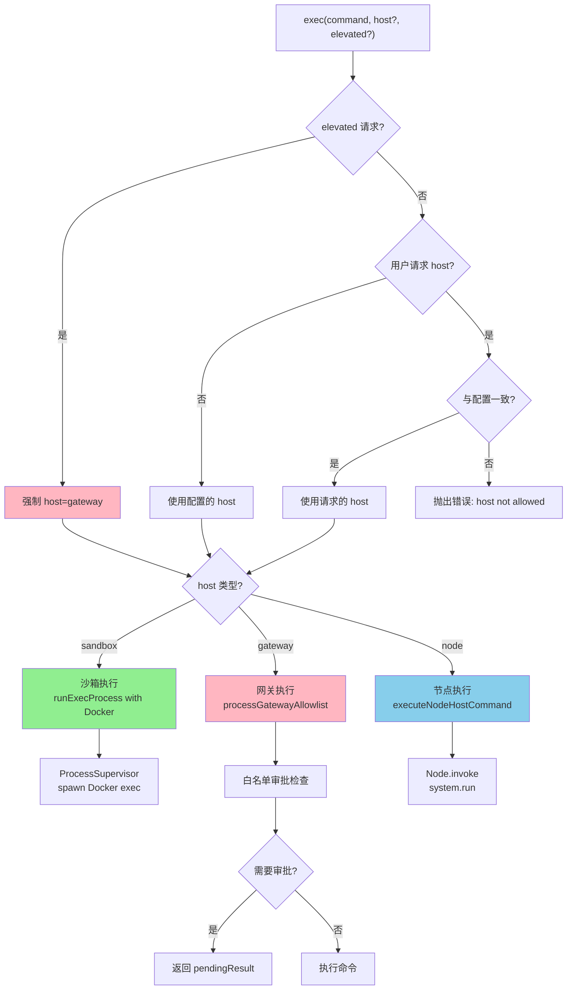
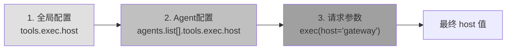
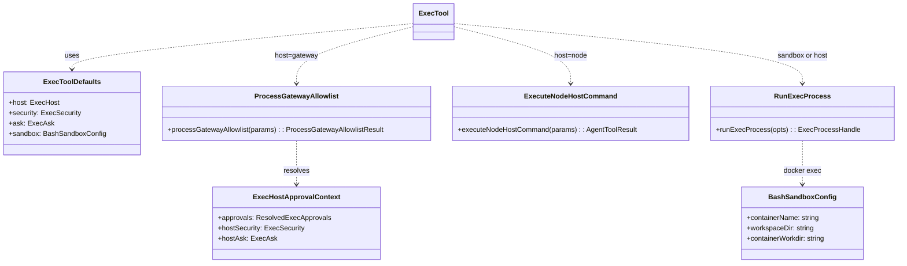
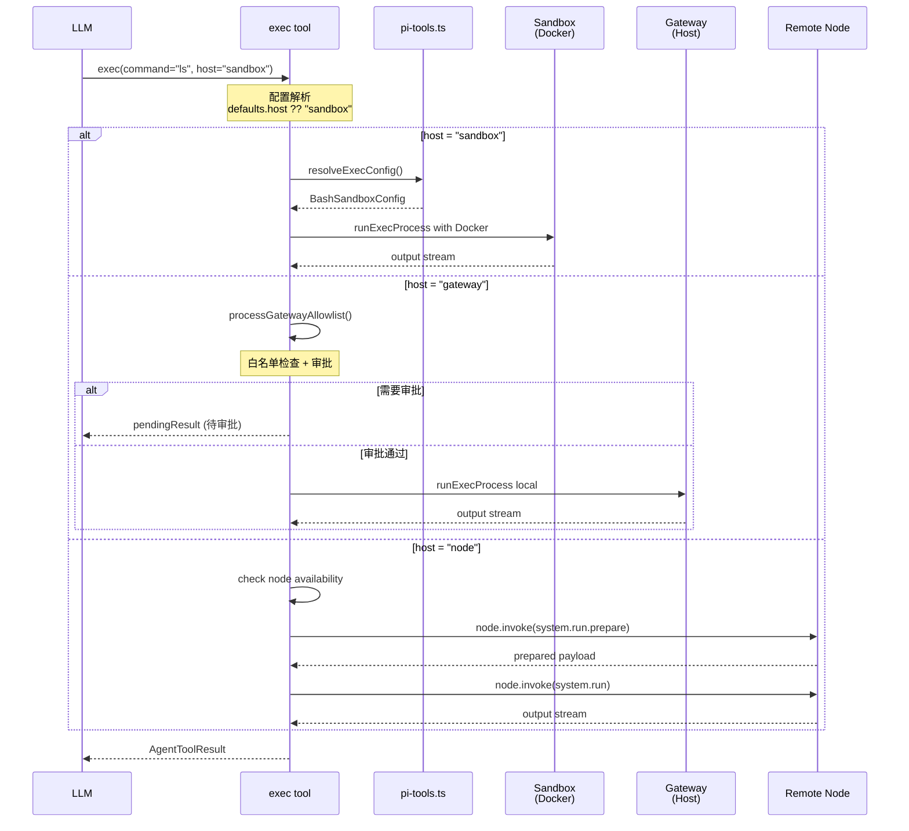

# OpenClaw 执行位置决策机制分析

## 一、核心概念：ExecHost 类型

执行宿主（`ExecHost`）决定了命令在哪里执行，由 [exec-approvals.ts](file:///d:/prj/openclaw_analyze/src/infra/exec-approvals.ts#L25-L40) 定义：

```typescript
export type ExecHost = "sandbox" | "gateway" | "node";
```

| 宿主 | 说明 | 执行环境 |
|------|------|----------|
| `sandbox` | 沙箱（默认） | Docker 容器中执行 |
| `gateway` | 网关主机 | 网关机器本地执行 |
| `node` | 远程节点 | 配对的手机/设备上执行 |

---

## 二、决策流程图



---

## 三、配置优先级

执行位置由多层配置决定：



**配置示例** ([types.tools.ts](file:///d:/prj/openclaw_analyze/src/config/types.tools.ts#L222-L227))：

```typescript
export type ExecToolConfig = {
  /** Exec host routing (default: sandbox). */
  host?: "sandbox" | "gateway" | "node";
  /** Exec security mode (default: deny). */
  security?: "deny" | "allowlist" | "full";
  /** Exec ask mode (default: on-miss). */
  ask?: "off" | "on-miss" | "always";
  // ...
};
```

**配置优先级解析** ([pi-tools.ts](file:///d:/prj/openclaw_analyze/src/agents/pi-tools.ts#L198-L230))：

```typescript
function resolveExecConfig(params: { cfg?: OpenClawConfig; agentId?: string }) {
  const cfg = params.cfg;
  const globalExec = cfg?.tools?.exec; // 全局exec配置
  const agentExec =
    cfg && params.agentId ? resolveAgentConfig(cfg, params.agentId)?.tools?.exec : undefined; // Agent专属exec配置

  // 合并配置，Agent配置优先级高于全局配置
  return {
    host: agentExec?.host ?? globalExec?.host,
    security: agentExec?.security ?? globalExec?.security,
    ask: agentExec?.ask ?? globalExec?.ask,
    node: agentExec?.node ?? globalExec?.node,
    // ...
  };
}
```

---

## 四、核心类与代码流程

### 4.1 工具工厂：createExecTool

**文件**: [bash-tools.exec.ts](file:///d:/prj/openclaw_analyze/src/agents/bash-tools.exec.ts#L43-L70)

```typescript
export interface ExecToolDefaults {
  host?: ExecHost;           // 执行宿主
  security?: ExecSecurity;   // 安全策略
  ask?: ExecAsk;             // 审批策略
  sandbox?: BashSandboxConfig; // 沙箱配置
  // ...
}

export function createExecTool(defaults?: ExecToolDefaults): AgentTool {
  return {
    name: "exec",
    execute: async (_toolCallId, args, signal, onUpdate) => {
      // === 核心决策逻辑 ===
    },
  };
}
```

### 4.2 执行位置决策核心逻辑

**文件**: [bash-tools.exec.ts#L430-L495](file:///d:/prj/openclaw_analyze/src/agents/bash-tools.exec.ts#L430-L495)

```typescript
// ==================== 执行主机（host）配置 ====================
// host 指定命令在哪里执行：
// - sandbox:  在 Docker 沙箱容器中执行（默认）
// - gateway: 在网关主机上执行
// - node: 在远程配对节点上执行
const configuredHost = defaults?.host ?? "sandbox"; // 配置的默认 host
const sandboxHostConfigured = defaults?.host === "sandbox"; // 是否显式配置了 sandbox
const requestedHost = normalizeExecHost(params.host) ?? null; // 用户请求的 host
let host: ExecHost = requestedHost ?? configuredHost; // 最终使用的 host

// host 切换检查：非提权请求不能切换 host
if (!elevatedRequested && requestedHost && requestedHost !== configuredHost) {
  throw new Error(
    `exec host not allowed (requested ${renderExecHostLabel(requestedHost)}; ` +
      `configure tools.exec.host=${renderExecHostLabel(configuredHost)} to allow).`,
  );
}

// 提权请求强制使用 gateway host（在主机上执行）
if (elevatedRequested) {
  host = "gateway";
}
```

### 4.3 分发执行路径

**文件**: [bash-tools.exec.ts#L570-L620](file:///d:/prj/openclaw_analyze/src/agents/bash-tools.exec.ts#L570-L620)

```typescript
// ==================== 根据 host 分发执行 ====================
// host=node: 在远程配对节点上执行命令
if (host === "node") {
  return executeNodeHostCommand({
    command: params.command,
    // ... 参数
  });
}

// host=gateway + 需要审批: 在执行前进行网关级别的白名单审批
if (host === "gateway" && !bypassApprovals) {
  const gatewayResult = await processGatewayAllowlist({
    command: params.command,
    // ... 参数
  });
  if (gatewayResult.pendingResult) {
    return gatewayResult.pendingResult; // 需要用户审批
  }
  execCommandOverride = gatewayResult.execCommandOverride;
}

// 默认：使用 runExecProcess 执行（sandbox 或 gateway 无需审批）
const run = await runExecProcess({
  command: params.command,
  execCommand: execCommandOverride,
  workdir,
  env,
  sandbox,  // 如果有沙箱配置，会使用 Docker exec
  // ...
});
```

---

## 五、三种执行路径详解

### 5.1 Sandbox 沙箱执行

**文件**: [bash-tools.exec-runtime.ts](file:///d:/prj/openclaw_analyze/src/agents/bash-tools.exec-runtime.ts#L530-L560)

```typescript
const spawnSpec = (() => {
  // 沙箱模式：使用 Docker exec
  if (opts.sandbox) {
    return {
      mode: "child" as const,
      argv: [
        "docker",
        ...buildDockerExecArgs({
          containerName: opts.sandbox.containerName,
          command: execCommand,
          workdir: opts.containerWorkdir ?? opts.sandbox.containerWorkdir,
          env: shellRuntimeEnv,
          tty: opts.usePty,
        }),
      ],
      // ...
    };
  }
  // ...
})();
```

### 5.2 Gateway 网关执行

**文件**: [bash-tools.exec-host-gateway.ts](file:///d:/prj/openclaw_analyze/src/agents/bash-tools.exec-host-gateway.ts#L58-L120)

```typescript
export async function processGatewayAllowlist(
  params: ProcessGatewayAllowlistParams,
): Promise<ProcessGatewayAllowlistResult> {
  // 1. 解析审批上下文（合并配置和请求的 security/ask）
  const { approvals, hostSecurity, hostAsk, askFallback } = resolveExecHostApprovalContext({
    agentId: params.agentId,
    security: params.security,
    ask: params.ask,
    host: "gateway",
  });

  // 2. 评估白名单匹配
  const allowlistEval = evaluateShellAllowlist({
    command: params.command,
    allowlist: approvals.allowlist,
    // ...
  });

  // 3. 判断是否需要审批
  const requiresAsk = requiresExecApproval({
    ask: hostAsk,
    security: hostSecurity,
    analysisOk,
    allowlistSatisfied,
  }) || obfuscation.detected;

  // 4. 如果需要审批，发送审批请求
  if (requiresAsk) {
    return {
      pendingResult: buildExecApprovalPendingToolResult({ ... }),
    };
  }

  // 5. 审批通过，继续执行
  return { execCommandOverride };
}
```

### 5.3 Node 节点执行

**文件**: [bash-tools.exec-host-node.ts](file:///d:/prj/openclaw_analyze/src/agents/bash-tools.exec-host-node.ts#L47-L100)

```typescript
export async function executeNodeHostCommand(
  params: ExecuteNodeHostCommandParams,
): Promise<AgentToolResult<ExecToolDetails>> {
  // 1. 检查节点可用性
  const nodes = await listNodes({});
  if (nodes.length === 0) {
    throw new Error("exec host=node requires a paired node...");
  }

  // 2. 解析目标节点
  const nodeId = resolveNodeIdFromList(nodes, nodeQuery, !nodeQuery);

  // 3. 通过 Gateway 调用节点的 system.run.prepare
  const prepareRaw = await callGatewayTool<{ payload?: unknown }>(
    "node.invoke",
    { timeoutMs: 15_000 },
    {
      nodeId,
      command: "system.run.prepare",
      params: { command: argv, cwd: params.workdir, ... },
    },
  );

  // 4. 执行准备好的命令
  const prepared = parsePreparedSystemRunPayload(prepareRaw?.payload);
  // ...
}
```

---

## 六、类图



---

## 七、完整执行序列图



---

## 八、关键文件汇总

| 文件 | 职责 |
|------|------|
| [bash-tools.exec.ts](file:///d:/prj/openclaw_analyze/src/agents/bash-tools.exec.ts) | exec 工具主实现，**执行位置决策核心** |
| [bash-tools.exec-runtime.ts](file:///d:/prj/openclaw_analyze/src/agents/bash-tools.exec-runtime.ts) | 进程执行运行时（Docker exec / 本地进程） |
| [bash-tools.exec-host-gateway.ts](file:///d:/prj/openclaw_analyze/src/agents/bash-tools.exec-host-gateway.ts) | Gateway 主机执行 + 白名单审批 |
| [bash-tools.exec-host-node.ts](file:///d:/prj/openclaw_analyze/src/agents/bash-tools.exec-host-node.ts) | 远程节点执行 |
| [bash-tools.exec-host-shared.ts](file:///d:/prj/openclaw_analyze/src/agents/bash-tools.exec-host-shared.ts) | 审批上下文解析 |
| [pi-tools.ts](file:///d:/prj/openclaw_analyze/src/agents/pi-tools.ts) | 工具工厂，解析配置创建 exec 工具 |
| [exec-approvals.ts](file:///d:/prj/openclaw_analyze/src/infra/exec-approvals.ts) | 审批类型定义和策略 |
| [types.tools.ts](file:///d:/prj/openclaw_analyze/src/config/types.tools.ts) | 工具配置类型定义 |

---

## 九、总结

### 谁决定执行位置？

1. **默认决策者**: `tools.exec.host` 配置（在 `openclaw.json` 中设置）
2. **请求覆盖**: exec 工具的 `host` 参数（仅提权请求可覆盖）
3. **强制覆盖**: `elevated=true` 强制使用 `gateway` 主机

### 决策权重

```
elevated=true → gateway (强制)
     ↓
请求参数 host → 如果与配置一致则使用，否则报错
     ↓
配置 tools.exec.host → 默认为 "sandbox"
```

### 配置示例

```json
{
  "tools": {
    "exec": {
      "host": "sandbox",      // 执行位置: sandbox | gateway | node
      "security": "deny",    // 安全策略: deny | allowlist | full
      "ask": "on-miss"       // 审批策略: off | on-miss | always
    }
  }
}
```
