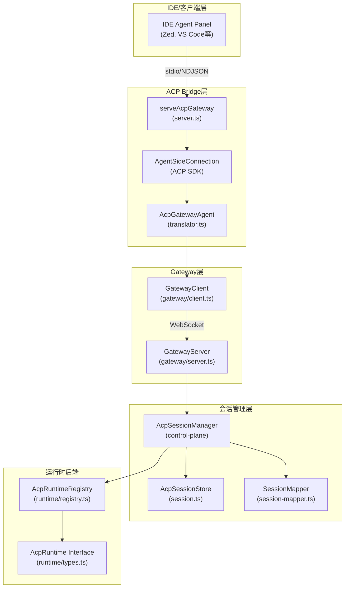
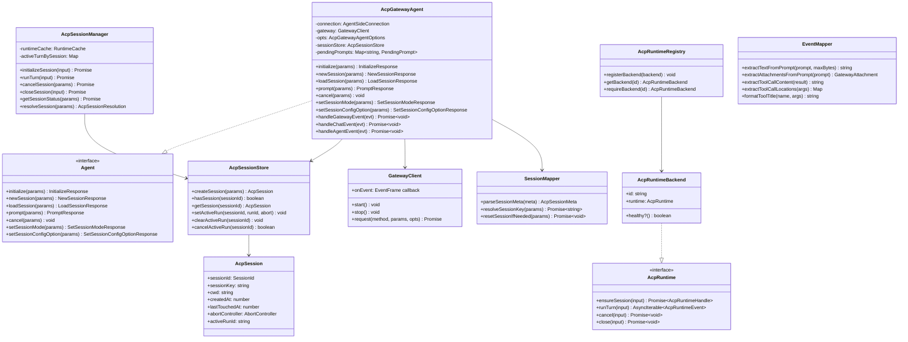
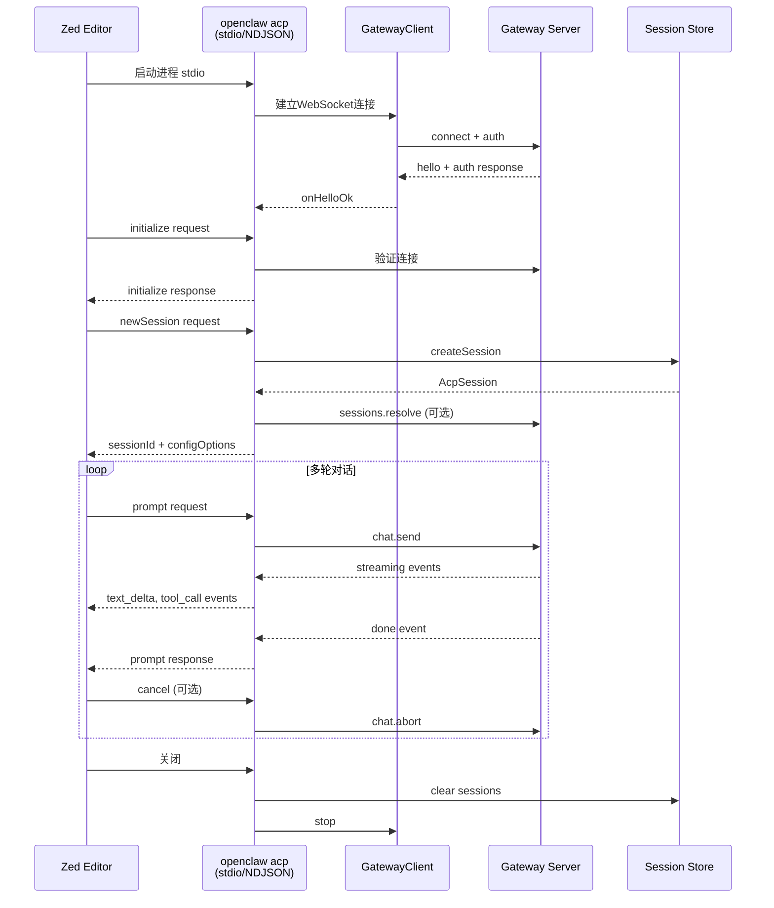
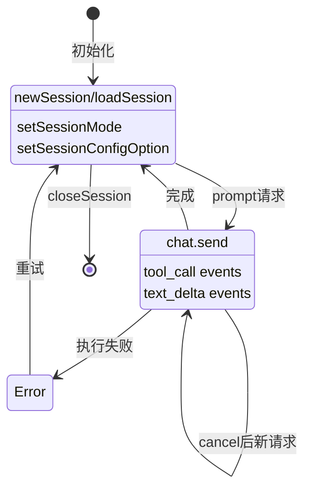
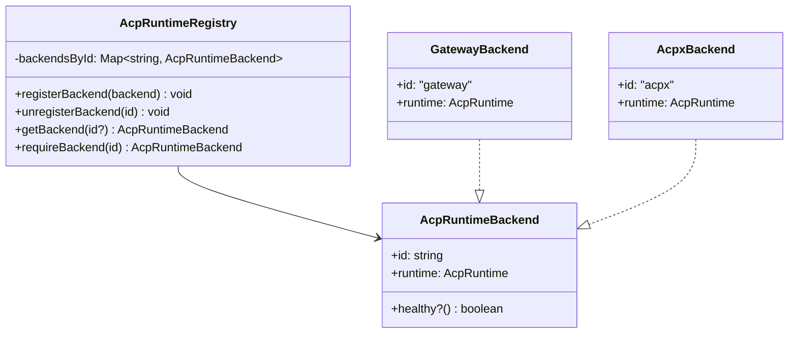

# OpenClaw ACP 支持分析报告

## 一、ACP概述

ACP（Agent Client Protocol）是一种标准化的Agent通信协议，OpenClaw通过ACP Bridge实现与IDE（如Zed、VS Code）的集成。OpenClaw的ACP实现位于 `src/acp/` 目录。

## 二、核心架构

### 2.1 ACP架构分层图



### 2.2 核心类图



## 三、核心实现分析

### 3.1 类型定义

ACP核心类型定义在 `src/acp/types.ts`：

```typescript
// ACP会话结构
export type AcpSession = {
  sessionId: SessionId;
  sessionKey: string;
  cwd: string;
  createdAt: number;
  lastTouchedAt: number;
  abortController: AbortController | null;
  activeRunId: string | null;
};

// ACP服务器配置选项
export type AcpServerOptions = {
  gatewayUrl?: string;
  gatewayToken?: string;
  gatewayPassword?: string;
  defaultSessionKey?: string;
  defaultSessionLabel?: string;
  requireExistingSession?: boolean;
  resetSession?: boolean;
  prefixCwd?: boolean;
  provenanceMode?: AcpProvenanceMode;
  sessionCreateRateLimit?: { maxRequests?: number; windowMs?: number };
  verbose?: boolean;
};
```

### 3.2 ACP运行时接口

定义在 `src/acp/runtime/types.ts`：

```typescript
export interface AcpRuntime {
  ensureSession(input: AcpRuntimeEnsureInput): Promise<AcpRuntimeHandle>;
  runTurn(input: AcpRuntimeTurnInput): AsyncIterable<AcpRuntimeEvent>;
  getCapabilities?(input: { handle?: AcpRuntimeHandle }): Promise<AcpRuntimeCapabilities>;
  getStatus?(input: { handle: AcpRuntimeHandle; signal?: AbortSignal }): Promise<AcpRuntimeStatus>;
  setMode?(input: { handle: AcpRuntimeHandle; mode: string }): Promise<void>;
  setConfigOption?(input: { handle: AcpRuntimeHandle; key: string; value: string }): Promise<void>;
  doctor?(): Promise<AcpRuntimeDoctorReport>;
  cancel(input: { handle: AcpRuntimeHandle; reason?: string }): Promise<void>;
  close(input: { handle: AcpRuntimeHandle; reason: string }): Promise<void>;
}

// 运行时事件类型
export type AcpRuntimeEvent =
  | { type: "text_delta"; text: string; stream?: "output" | "thought"; tag?: AcpSessionUpdateTag }
  | { type: "status"; text: string; tag?: AcpSessionUpdateTag; used?: number; size?: number }
  | { type: "tool_call"; text: string; tag?: AcpSessionUpdateTag; toolCallId?: string; status?: string }
  | { type: "done"; stopReason?: string }
  | { type: "error"; message: string; code?: string; retryable?: boolean };
```

### 3.3 会话管理

定义在 `src/acp/session.ts`：

```typescript
export function createInMemorySessionStore(options?: AcpSessionStoreOptions): AcpSessionStore {
  const sessions = new Map<string, AcpSession>();
  const runIdToSessionId = new Map<string, string>();
  
  // 核心操作
  const createSession = (params) => { /* ... */ };
  const setActiveRun = (sessionId, runId, abortController) => { /* ... */ };
  const cancelActiveRun = (sessionId) => { /* ... */ };
  const reapIdleSessions = (nowMs) => { /* 清理空闲会话 */ };
  
  return { createSession, hasSession, getSession, setActiveRun, ... };
}
```

### 3.4 会话解析

定义在 `src/acp/session-mapper.ts`：

```typescript
export async function resolveSessionKey(params: {
  meta: AcpSessionMeta;
  fallbackKey: string;
  gateway: GatewayClient;
  opts: AcpServerOptions;
}): Promise<string> {
  // 支持多种会话解析方式：
  // 1. sessionLabel - 通过标签解析
  // 2. sessionKey - 直接使用sessionKey
  // 3. CLI选项 - 默认sessionKey或sessionLabel
  // 4. fallback - 使用默认回退键
}
```

## 四、典型场景与流程

### 场景一：IDE集成（Zed Editor）



**配置示例** (Zed `settings.json`)：

```json
{
  "agent_servers": {
    "OpenClaw ACP": {
      "type": "custom",
      "command": "openclaw",
      "args": ["acp", "--session", "agent:main:main"],
      "env": {}
    }
  }
}
```

### 场景二：会话生命周期管理



**代码实现** (来自 `src/acp/translator.ts`)：

```typescript
async prompt(params: PromptRequest): Promise<PromptResponse> {
  const session = this.sessionStore.getSession(params.sessionId);
  
  // 取消正在运行的请求
  if (session.abortController) {
    this.sessionStore.cancelActiveRun(params.sessionId);
  }
  
  const abortController = new AbortController();
  const runId = randomUUID();
  this.sessionStore.setActiveRun(params.sessionId, runId, abortController);

  return new Promise((resolve, reject) => {
    this.pendingPrompts.set(params.sessionId, { sessionId, resolve, reject });
    
    this.gateway.request("chat.send", {
      sessionKey: session.sessionKey,
      message,
      attachments,
      idempotencyKey: runId,
    }, { expectFinal: true });
  });
}

async cancel(params: CancelNotification): Promise<void> {
  this.sessionStore.cancelActiveRun(params.sessionId);
  await this.gateway.request("chat.abort", {
    sessionKey: session.sessionKey,
    runId: activeRunId,
  });
}
```

### 场景三：运行时后端管理



**后端注册示例** (通过 `registerAcpRuntimeBackend`)：

```typescript
// 注册Gateway后端
registerAcpRuntimeBackend({
  id: "gateway",
  runtime: gatewayRuntimeAdapter,
  healthy: () => gateway.isHealthy()
});

// 获取后端
const backend = requireAcpRuntimeBackend(cfg.acp?.backend);
```

### 场景四：会话映射与重连

```mermaid
flowchart LR
    subgraph "ACP客户端"
        ACP1[ACP Client A]
        ACP2[ACP Client B]
    end
    
    subgraph "会话存储"
        Store[(AcpSessionStore)]
    end
    
    subgraph "Gateway"
        Sess1[Session: acp:uuid1]
        Sess2[Session: agent:main]
    end
    
    ACP1 -->|"newSession"| Store
    Store -->|"sessionKey| Sess1
    ACP1 -->|"prompt| Sess1
    
    ACP2 -->|"loadSession<br/>sessionKey=agent:main"| Store
    Store --> Sess2
    ACP2 -->|"prompt| Sess2
    
    Sess1 <-->|共享| Store
    Sess2 <-->|共享| Store
```

**关键参数**：

| 参数 | 说明 |
|------|------|
| `--session` | 直接指定Gateway session key |
| `--session-label` | 通过标签解析session |
| `--reset-session` | 重置会话历史 |
| `--require-existing` | 必须存在才允许创建 |

## 五、命令与API支持矩阵

| ACP方法 | 状态 | OpenClaw实现 |
|---------|------|--------------|
| `initialize` | 完整 | 返回agentCapabilities、协议版本 |
| `newSession` | 完整 | 创建ACP会话、映射Gateway会话 |
| `loadSession` | 部分 | 重绑定会话、重放用户/助手历史 |
| `prompt` | 完整 | 转发到Gateway chat.send |
| `cancel` | 完整 | 调用Gateway chat.abort |
| `listSessions` | 完整 | 映射到sessions.list |
| `setSessionMode` | 部分 | 支持thinking level切换 |
| `setSessionConfigOption` | 部分 | 支持verbosity、reasoning等 |
| `mcpServers` | 不支持 | 拒绝请求 |
| `fs/read_text_file` | 不支持 | 桥接模式不支持 |
| `terminal/*` | 不支持 | 桥接模式不支持 |

## 六、安全特性

1. **凭证保护**：优先使用 `--token-file` 而非 `--token`
2. **路径安全**：`read` 工具自动限定在 cwd 内
3. **危险工具阻止**：DANGEROUS_ACP_TOOLS 黑名单
4. **DoS防护**：MAX_PROMPT_BYTES (2MB) 限制
5. **TLS检查**：wss:// 必须验证证书指纹

## 七、CLI使用示例

```bash
# 基础启动
openclaw acp

# 远程Gateway
openclaw acp --url wss://gateway-host:18789 --token-file ~/.openclaw/token

# 绑定特定agent
openclaw acp --session agent:design:main

# 交互式客户端测试
openclaw acp client --cwd /path/to/project
```

## 八、关键文件索引

| 文件路径 | 说明 |
|---------|------|
| `src/acp/types.ts` | ACP类型定义和配置选项 |
| `src/acp/server.ts` | ACP网关服务端实现 |
| `src/acp/translator.ts` | ACP与Gateway事件转换器 |
| `src/acp/session.ts` | ACP会话存储管理 |
| `src/acp/session-mapper.ts` | 会话键解析和映射 |
| `src/acp/event-mapper.ts` | 事件和消息映射工具 |
| `src/acp/commands.ts` | ACP可用命令定义 |
| `src/acp/control-plane/manager.ts` | ACP会话管理器核心 |
| `src/acp/runtime/types.ts` | ACP运行时接口定义 |
| `src/acp/runtime/registry.ts` | 运行时后端注册表 |
| `src/cli/acp-cli.ts` | ACP CLI命令注册 |
| `docs.acp.md` | ACP协议文档 |
| `docs/cli/acp.md` | ACP CLI使用文档 |
