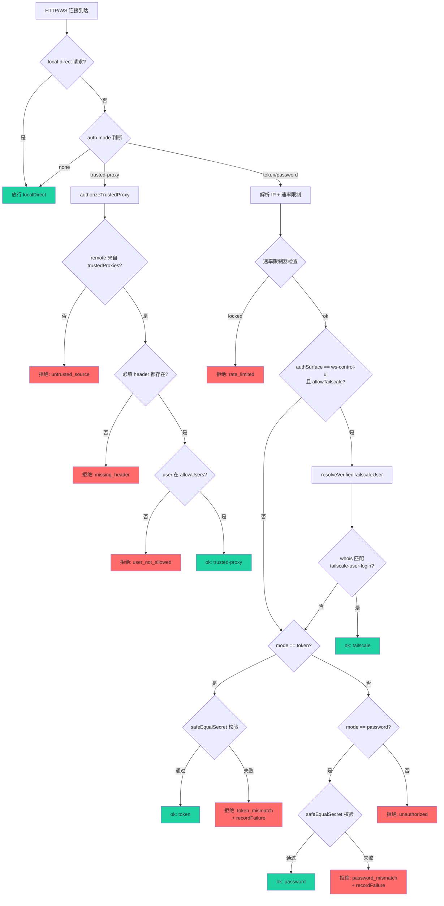
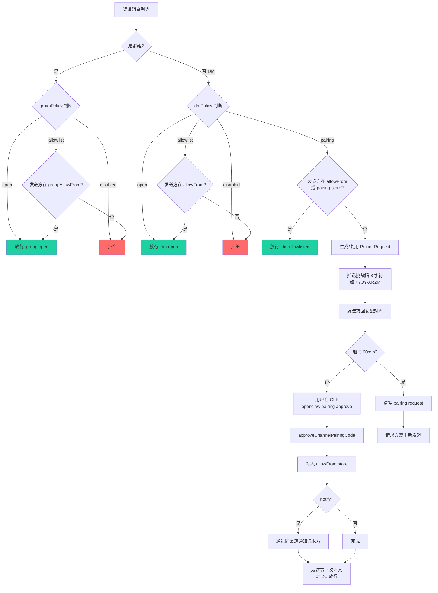
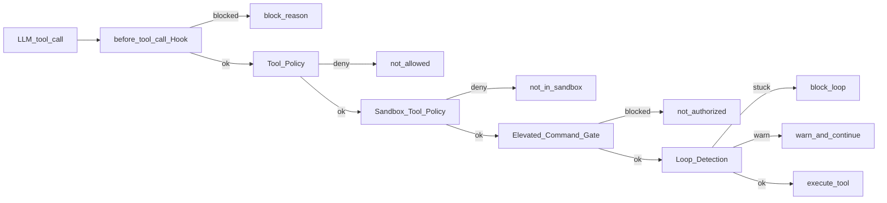
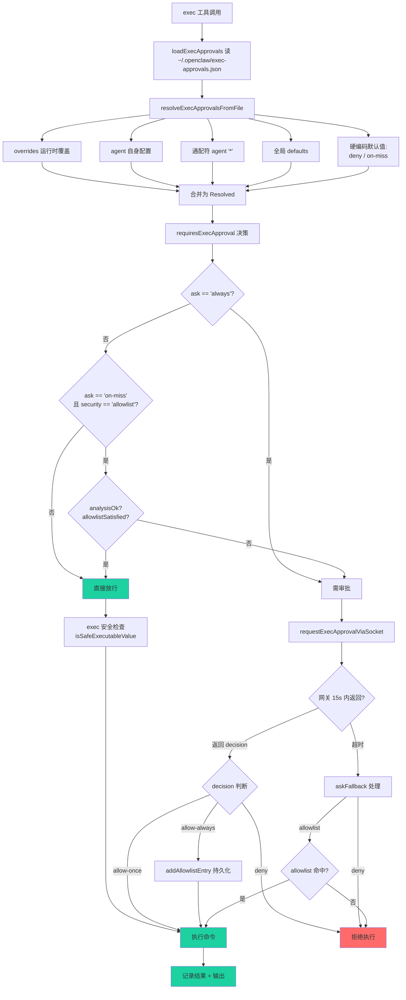
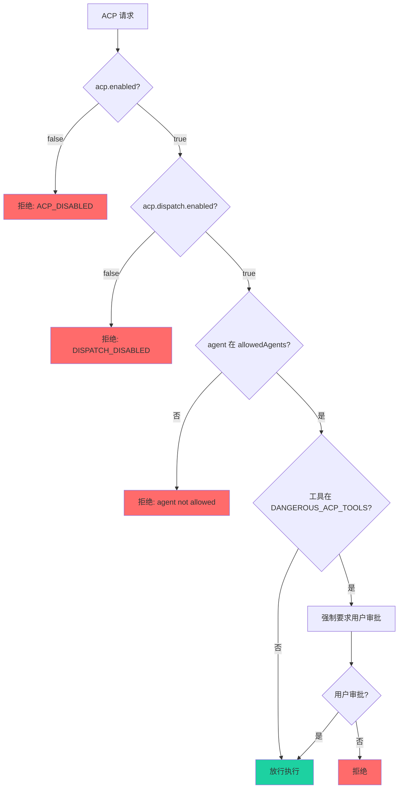
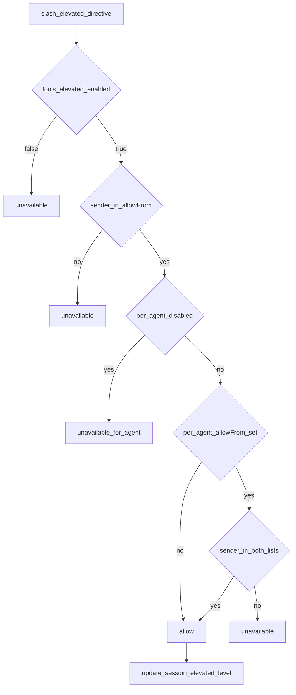
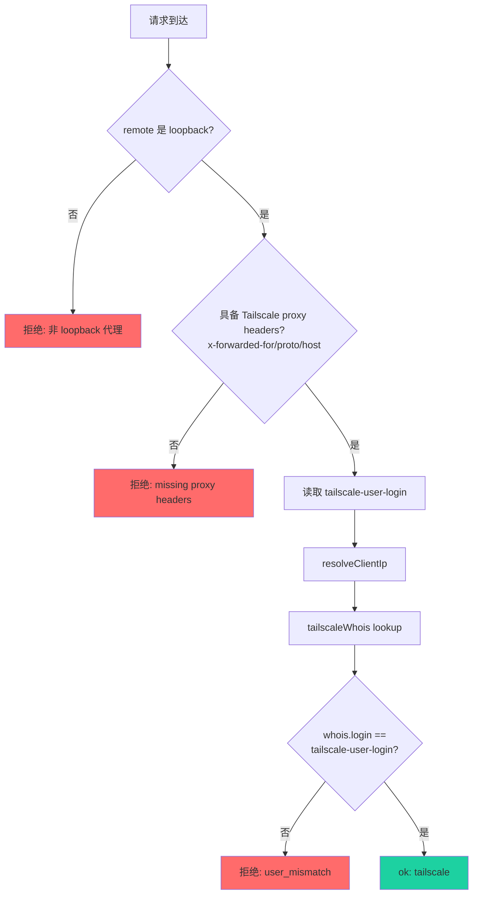

# OpenClaw 授权模型分析

## 1. 授权模型总览

OpenClaw 实现了一套**分层、多维度**的授权模型，覆盖从外部连接到工具执行的整条调用链路。核心授权维度包括：

| 维度 | 描述 | 主要文件 |
|------|------|----------|
| **Gateway 连接认证** | HTTP/WS 入口的连接级身份验证 | `src/gateway/auth.ts` |
| **设备配对（Pairing）** | DM 渠道中陌生人首次发消息的"配对码"流程 | `src/pairing/pairing-store.ts` |
| **DM / 群组访问策略** | 渠道级 allowlist / open / disabled / pairing | `src/security/dm-policy-shared.ts` |
| **ACP 调度策略** | ACP（Agent Control Plane）启用/agent 白名单 | `src/acp/policy.ts` |
| **工具策略（Tool Policy）** | 工具 allow/deny/alsoAllow/profile | `src/agents/pi-tools.policy.ts` |
| **沙箱工具策略** | 沙箱内可用的工具子集 | `src/agents/sandbox-tool-policy.ts` |
| **Exec 审批** | 命令执行前的安全/询问策略 + 用户交互审批 | `src/infra/exec-approvals.ts` |
| **Exec 主机路由** | sandbox / gateway / node 执行位置决策 | `src/infra/exec-host.ts` |
| **Elevated Mode** | `/elevated on/off/ask/full` 指令级授权 | `src/agents/identity.ts`、`src/channels/command-gating.ts` |
| **Hook 授权** | before_tool_call 插件钩子拦截 | `src/agents/pi-tools.before-tool-call.ts` |
| **Tailscale 头认证** | 受信代理 + tailscale whois 验证 | `src/gateway/auth.ts` |
| **凭据安全比较** | timingSafeEqual 防侧信道 | `src/security/secret-equal.ts` |

整体设计哲学：**纵深防御（Defense in Depth）** — 每一层都有独立的"放行条件"，不依赖单一关卡。

---

## 2. 核心授权类图

```mermaid
classDiagram
    direction TB

    class GatewayAuth {
        +mode: ResolvedGatewayAuthMode
        +token: string
        +password: string
        +allowTailscale: boolean
        +trustedProxy: GatewayTrustedProxyConfig
    }

    class ResolvedGatewayAuth {
        +mode: ResolvedGatewayAuthMode
        +modeSource: ResolvedGatewayAuthModeSource
        +token: string
        +password: string
        +allowTailscale: boolean
    }

    class GatewayAuthResult {
        +ok: boolean
        +method: AuthMethod
        +user: string
        +reason: string
        +rateLimited: boolean
        +retryAfterMs: number
    }

    class AuthRateLimiter {
        +check(ip, scope): RateLimitCheckResult
        +recordFailure(ip, scope): void
        +reset(ip, scope): void
        +prune(): void
        +dispose(): void
    }

    class PairingStore {
        +id: string
        +code: string
        +createdAt: string
        +lastSeenAt: string
        +meta: StringMap
    }

    class AllowFromStore {
        +version: 1
        +allowFrom: StringList
    }

    class DmGroupAccessDecision {
        +decision: DmGroupAccessDecision
        +reasonCode: DmGroupAccessReasonCode
    }

    class DmPolicyResolver {
        +resolveDmGroupAccessDecision(params): Decision
        +resolveEffectiveAllowFromLists(params): AllowLists
    }

    class ExecApprovals {
        +loadExecApprovals(): ExecApprovalsFile
        +saveExecApprovals(file): void
        +resolveExecApprovals(agentId, overrides): Resolved
        +requiresExecApproval(params): boolean
    }

    class ExecApprovalsResolved {
        +security: ExecSecurity
        +ask: ExecAsk
        +askFallback: ExecSecurity
        +allowlist: ExecAllowlistEntryList
        +socketPath: string
        +token: string
    }

    class ExecSecurity {
        <<enumeration>>
        deny
        allowlist
        full
    }

    class ExecAsk {
        <<enumeration>>
        off
        on-miss
        always
    }

    class ExecHost {
        <<enumeration>>
        sandbox
        gateway
        node
    }

    class SandboxToolPolicy {
        +allow: StringList
        +deny: StringList
    }

    class SandboxToolPolicyResolver {
        +pickSandboxToolPolicy(config): Policy
        +resolveSandboxToolPolicyForAgent(cfg, agentId): Resolved
    }

    class AcpPolicy {
        +isAcpEnabledByPolicy(cfg): boolean
        +isAcpDispatchEnabledByPolicy(cfg): boolean
        +isAcpAgentAllowedByPolicy(cfg, agentId): boolean
    }

    class ToolPolicyMatcher {
        +isToolAllowedByPolicyName(name, policy): boolean
        +filterToolsByPolicy(tools, policy): ToolList
    }

    class CommandAuthorizer {
        +configured: boolean
        +allowed: boolean
    }

    class CommandGate {
        +resolveControlCommandGate(params): GateResult
        +resolveDualTextControlCommandGate(params): GateResult
    }

    class BeforeToolCallHook {
        +runBeforeToolCallHook(args): HookOutcome
        +wrapToolWithBeforeToolCallHook(tool, ctx): Tool
    }

    GatewayAuth --> ResolvedGatewayAuth : resolves_to
    GatewayAuth --> AuthRateLimiter : uses
    GatewayAuth ..> GatewayAuthResult : returns
    PairingStore <.. AllowFromStore : persisted_as
    DmPolicyResolver --> DmGroupAccessDecision : returns
    ExecApprovals --> ExecApprovalsResolved : returns
    ExecApprovals --> ExecSecurity : normalizes
    ExecApprovals --> ExecAsk : normalizes
    ExecApprovals --> ExecHost : normalizes
    SandboxToolPolicyResolver --> SandboxToolPolicy : returns
    ToolPolicyMatcher --> SandboxToolPolicy : matches
    AcpPolicy --> SandboxToolPolicy : augments
    CommandGate --> CommandAuthorizer : aggregates
    BeforeToolCallHook ..> ToolPolicyMatcher : chained_with
```



---

## 3. 不同场景下的授权流程

### 3.1 场景 A：Gateway 外部连接（HTTP/WS）

**核心文件**：[auth.ts](file:///d:/prj/openclaw_analyze/src/gateway/auth.ts)、[auth-rate-limit.ts](file:///d:/prj/openclaw_analyze/src/gateway/auth-rate-limit.ts)、[net.ts](file:///d:/prj/openclaw_analyze/src/gateway/net.ts)

**支持的认证模式**：

| 模式 | 适用场景 | 关键配置 |
|------|---------|---------|
| `none` | 仅本机直连 | `gateway.auth.mode=none` |
| `token` | 默认/通用 | `OPENCLAW_GATEWAY_TOKEN` 或 `gateway.auth.token` |
| `password` | Basic auth | `OPENCLAW_GATEWAY_PASSWORD` |
| `trusted-proxy` | 部署在反代后 | `gateway.auth.trustedProxy.userHeader` |



**关键代码摘录**（[auth.ts:387-493](file:///d:/prj/openclaw_analyze/src/gateway/auth.ts#L387-L493)）：

```typescript
export async function authorizeGatewayConnect(
  params: AuthorizeGatewayConnectParams,
): Promise<GatewayAuthResult> {
  const { auth, connectAuth, req, trustedProxies } = params;
  const tailscaleWhois = params.tailscaleWhois ?? readTailscaleWhoisIdentity;
  const authSurface = params.authSurface ?? "http";
  const allowTailscaleHeaderAuth = shouldAllowTailscaleHeaderAuth(authSurface);
  const localDirect = isLocalDirectRequest(
    req, trustedProxies, params.allowRealIpFallback === true,
  );

  if (auth.mode === "trusted-proxy") { /* ... 受信代理 ... */ }

  if (auth.mode === "none") {
    return { ok: true, method: "none" };
  }

  const limiter = params.rateLimiter;
  const ip = params.clientIp ?? resolveRequestClientIp(req, trustedProxies, ...) ?? req?.socket?.remoteAddress;
  const rateLimitScope = params.rateLimitScope ?? AUTH_RATE_LIMIT_SCOPE_SHARED_SECRET;

  if (limiter) {
    const rlCheck = limiter.check(ip, rateLimitScope);
    if (!rlCheck.allowed) {
      return { ok: false, reason: "rate_limited", rateLimited: true, retryAfterMs: rlCheck.retryAfterMs };
    }
  }

  if (auth.mode === "token") {
    if (!auth.token) return { ok: false, reason: "token_missing_config" };
    if (!connectAuth?.token) return { ok: false, reason: "token_missing" };
    if (!safeEqualSecret(connectAuth.token, auth.token)) {
      limiter?.recordFailure(ip, rateLimitScope);
      return { ok: false, reason: "token_mismatch" };
    }
    limiter?.reset(ip, rateLimitScope);
    return { ok: true, method: "token" };
  }
  // ... password 模式同构 ...
}
```

**安全要点**：
- `safeEqualSecret` 使用 SHA-256 哈希后做 `timingSafeEqual`，避免侧信道泄露
- **missing ≠ mismatch**：缺少凭据不计入失败计数，避免把"刚打开的浏览器"误锁
- `localDirect` 直连请求绕过认证
- `authSurface=ws-control-ui` 时启用 Tailscale 头认证（仅在 tokenless 模式）
- 速率限制在 HTTP 与 WS Control UI 共享 scope

---

### 3.2 场景 B：渠道 DM/群组消息 — Pairing 配对流程

**核心文件**：[pairing-store.ts](file:///d:/prj/openclaw_analyze/src/pairing/pairing-store.ts)、[dm-policy-shared.ts](file:///d:/prj/openclaw_analyze/src/security/dm-policy-shared.ts)、[pairing-cli.ts](file:///d:/prj/openclaw_analyze/src/cli/pairing-cli.ts)

当 `dmPolicy=pairing` 时，未在 `allowFrom` 中的发送方需要先**配对**才能对话。



**关键代码摘录**（[dm-policy-shared.ts:107-181](file:///d:/prj/openclaw_analyze/src/security/dm-policy-shared.ts#L107-L181)）：

```typescript
export function resolveDmGroupAccessDecision(params: {
  isGroup: boolean;
  dmPolicy?: string | null;
  groupPolicy?: string | null;
  effectiveAllowFrom: Array<string | number>;
  effectiveGroupAllowFrom: Array<string | number>;
  isSenderAllowed: (allowFrom: string[]) => boolean;
}): { decision: DmGroupAccessDecision; reasonCode: DmGroupAccessReasonCode; reason: string } {
  const dmPolicy = params.dmPolicy ?? "pairing";
  const groupPolicy: GroupPolicy =
    params.groupPolicy === "open" || params.groupPolicy === "disabled"
      ? params.groupPolicy
      : "allowlist";

  if (params.isGroup) {
    const groupAccess = evaluateMatchedGroupAccessForPolicy({
      groupPolicy,
      allowlistConfigured: effectiveGroupAllowFrom.length > 0,
      allowlistMatched: params.isSenderAllowed(effectiveGroupAllowFrom),
    });
    if (!groupAccess.allowed) { /* 拒绝 */ }
    return { decision: "allow", reasonCode: "group_policy_allowed", ... };
  }

  if (dmPolicy === "disabled") return { decision: "block", reason: "dmPolicy=disabled" };
  if (dmPolicy === "open")    return { decision: "allow", reason: "dmPolicy=open" };
  if (params.isSenderAllowed(effectiveAllowFrom)) {
    return { decision: "allow", reason: "dmPolicy=... (allowlisted)" };
  }
  if (dmPolicy === "pairing") return { decision: "pairing", reason: "dmPolicy=pairing (not allowlisted)" };
  return { decision: "block", reason: "dmPolicy=... (not allowlisted)" };
}
```

**Pairing 存储格式**（持久化在 `~/.openclaw/credentials/<channel>-pairing.json` 和 `<channel>-allowFrom.json`）：

```typescript
type PairingStore = {
  version: 1;
  requests: PairingRequest[];   // 临时未审批
};

type PairingRequest = {
  id: string;        // 用户/账号 ID
  code: string;      // 8 位字符（去除歧义字母表 ABCDEFGHJKLMNPQRSTUVWXYZ23456789）
  createdAt: string;
  lastSeenAt: string;
  meta?: Record<string, string>;
};

type AllowFromStore = {
  version: 1;
  allowFrom: string[];  // 已审批用户 ID 列表
};
```

**安全要点**：
- 配对码 8 字符，仅用 32 字符无歧义字母表（去掉 I/O/0/1）防止误读
- TTL 60 分钟、上限 3 个待审批请求
- 文件锁防止并发审批冲突
- 渠道 ID 与账户 ID 都做了路径穿越过滤
- `groupAllowFrom` 不会从 pairing store 合并（pairing 是 DM-only）

---

### 3.3 场景 C：工具调用（Tool Invocation）— 工具策略链

**核心文件**：[pi-tools.policy.ts](file:///d:/prj/openclaw_analyze/src/agents/pi-tools.policy.ts)、[sandbox-tool-policy.ts](file:///d:/prj/openclaw_analyze/src/agents/sandbox-tool-policy.ts)、[pi-tools.before-tool-call.ts](file:///d:/prj/openclaw_analyze/src/agents/pi-tools.before-tool-call.ts)

工具调用经过**四层策略筛选**，顺序为：



**关键代码**（[pi-tools.policy.ts:31-54](file:///d:/prj/openclaw_analyze/src/agents/pi-tools.policy.ts#L31-L54)）：

```typescript
function makeToolPolicyMatcher(policy: SandboxToolPolicy) {
  const deny  = compileGlobPatterns({ raw: expandToolGroups(policy.deny  ?? []), normalize: normalizeToolName });
  const allow = compileGlobPatterns({ raw: expandToolGroups(policy.allow ?? []), normalize: normalizeToolName });
  return (name: string) => {
    const normalized = normalizeToolName(name);
    if (matchesAnyGlobPattern(normalized, deny)) return false;
    if (allow.length === 0) return true;                      // 无 allow = 隐式允许
    if (matchesAnyGlobPattern(normalized, allow)) return true;
    if (normalized === "apply_patch" && matchesAnyGlobPattern("exec", allow)) return true;  // 兼容
    return false;
  };
}
```

**子代理的强制 deny 列表**（[pi-tools.policy.ts:62-105](file:///d:/prj/openclaw_analyze/src/agents/pi-tools.policy.ts#L62-L105)）：

```typescript
const SUBAGENT_TOOL_DENY_ALWAYS = [
  "gateway", "agents_list", "whatsapp_login",
  "session_status", "cron",
  "memory_search", "memory_get", "sessions_send",
];
const SUBAGENT_TOOL_DENY_LEAF = [
  "subagents", "sessions_list", "sessions_history", "sessions_spawn",
];
```

**危险工具默认 deny**（[dangerous-tools.ts:9-19](file:///d:/prj/openclaw_analyze/src/security/dangerous-tools.ts#L9-L19)）：

```typescript
export const DEFAULT_GATEWAY_HTTP_TOOL_DENY = [
  "sessions_spawn",   // 会话编排 → 远程 RCE
  "sessions_send",    // 跨会话注入
  "cron",             // 持久自动化
  "gateway",          // 网关控制
  "whatsapp_login",   // 交互式 setup
] as const;
```

---

### 3.4 场景 D：Exec 命令执行 — 审批决策链

**核心文件**：[exec-approvals.ts](file:///d:/prj/openclaw_analyze/src/infra/exec-approvals.ts)、[exec-host.ts](file:///d:/prj/openclaw_analyze/src/infra/exec-host.ts)、[exec-safety.ts](file:///d:/prj/openclaw_analyze/src/infra/exec-safety.ts)

这是**最复杂**的授权环节，涉及配置合并、命令分析、审批交互、执行位置决策等多个阶段。



**配置合并优先级**（[exec-approvals.ts:761-810](file:///d:/prj/openclaw_analyze/src/infra/exec-approvals.ts#L761-L810)）：

```typescript
// 合并优先级（高 → 低）：
// 1. overrides（运行时覆盖）
// 2. agent 自身配置
// 3. 通配符 agent ("*") 配置
// 4. 全局 defaults
// 5. 硬编码默认值
const resolvedAgent: Required<ExecApprovalsDefaults> = {
  security: normalizeSecurity(
    agent.security ?? wildcard.security ?? resolvedDefaults.security,
    resolvedDefaults.security,
  ),
  ask: normalizeAsk(
    agent.ask ?? wildcard.ask ?? resolvedDefaults.ask,
    resolvedDefaults.ask,
  ),
  // ...
};
```

**审批决策核心函数**（[exec-approvals.ts:820-839](file:///d:/prj/openclaw_analyze/src/infra/exec-approvals.ts#L820-L839)）：

```typescript
export function requiresExecApproval(params: {
  ask: ExecAsk;
  security: ExecSecurity;
  analysisOk: boolean;
  allowlistSatisfied: boolean;
}): boolean {
  return (
    params.ask === "always" ||
    (params.ask === "on-miss" &&
      params.security === "allowlist" &&
      (!params.analysisOk || !params.allowlistSatisfied))
  );
}
```

**Exec 安全校验**（[exec-safety.ts:11-44](file:///d:/prj/openclaw_analyze/src/infra/exec-safety.ts#L11-L44)）：

```typescript
const SHELL_METACHARS = /[;&|`$<>]/;
const CONTROL_CHARS   = /[\r\n]/;
const QUOTE_CHARS     = /["']/;
const BARE_NAME_PATTERN = /^[A-Za-z0-9._+-]+$/;

export function isSafeExecutableValue(value: string | null | undefined): boolean {
  if (!value) return false;
  const trimmed = value.trim();
  if (!trimmed) return false;
  if (trimmed.includes("\0")) return false;
  if (CONTROL_CHARS.test(trimmed))   return false;
  if (SHELL_METACHARS.test(trimmed)) return false;
  if (QUOTE_CHARS.test(trimmed))     return false;
  if (isLikelyPath(trimmed)) return true;
  if (trimmed.startsWith("-")) return false;
  return BARE_NAME_PATTERN.test(trimmed);
}
```

**Exec 主机路由**（[exec-host.ts:6-21](file:///d:/prj/openclaw_analyze/src/infra/exec-host.ts#L6-L21)）：

```typescript
export type ExecHost = "sandbox" | "gateway" | "node";

export type ExecHostRequest = {
  command: string[];
  rawCommand?: string | null;
  cwd?: string | null;
  env?: Record<string, string> | null;
  timeoutMs?: number | null;
  needsScreenRecording?: boolean | null;
  agentId?: string | null;
  sessionKey?: string | null;
  approvalDecision?: "allow-once" | "allow-always" | null;
};
```

**审批决策后通过 Unix 域 socket 与审批网关通信**（[exec-approvals.ts:1003-1046](file:///d:/prj/openclaw_analyze/src/infra/exec-approvals.ts#L1003-L1046)）：

```typescript
export async function requestExecApprovalViaSocket(params: {
  socketPath: string;
  token: string;
  request: Record<string, unknown>;
  timeoutMs?: number;
}): Promise<ExecApprovalDecision | null> {
  const { socketPath, token, request } = params;
  if (!socketPath || !token) return null;
  const timeoutMs = params.timeoutMs ?? 15_000;
  const payload = JSON.stringify({ type: "request", token, id: crypto.randomUUID(), request });
  return await requestJsonlSocket({ socketPath, payload, timeoutMs,
    accept: (value) => {
      const msg = value as { type?: string; decision?: ExecApprovalDecision };
      if (msg?.type === "decision" && msg.decision) return msg.decision;
      return undefined;
    },
  });
}
```

**决策类型**：
- `allow-once`：仅本次放行
- `allow-always`：写入 `~/.openclaw/exec-approvals.json` 的 allowlist
- `deny`：拒绝

---

### 3.5 场景 E：ACP（Agent Control Plane）调度授权

**核心文件**：[acp/policy.ts](file:///d:/prj/openclaw_analyze/src/acp/policy.ts)、[dangerous-tools.ts](file:///d:/prj/openclaw_analyze/src/security/dangerous-tools.ts)

ACP 是 OpenClaw 的**外部 Agent 协议**，用于把其他 agent 接入。授权层级如下：



**关键代码**（[acp/policy.ts:9-37](file:///d:/prj/openclaw_analyze/src/acp/policy.ts#L9-L37)）：

```typescript
export function isAcpEnabledByPolicy(cfg: OpenClawConfig): boolean {
  return cfg.acp?.enabled !== false;        // 默认开启
}

export function resolveAcpDispatchPolicyState(cfg: OpenClawConfig): AcpDispatchPolicyState {
  if (!isAcpEnabledByPolicy(cfg)) return "acp_disabled";
  if (cfg.acp?.dispatch?.enabled === false) return "dispatch_disabled";
  return "enabled";
}

export function isAcpAgentAllowedByPolicy(cfg: OpenClawConfig, agentId: string): boolean {
  const allowed = (cfg.acp?.allowedAgents ?? [])
    .map((entry) => normalizeAgentId(entry)).filter(Boolean);
  if (allowed.length === 0) return true;     // 白名单为空 = 不限制
  return allowed.includes(normalizeAgentId(agentId));
}
```

**危险工具强制审批**（[dangerous-tools.ts:23-33](file:///d:/prj/openclaw_analyze/src/security/dangerous-tools.ts#L23-L33)）：

```typescript
export const DANGEROUS_ACP_TOOL_NAMES = [
  "exec", "spawn", "shell",
  "sessions_spawn", "sessions_send", "gateway",
  "fs_write", "fs_delete", "fs_move", "apply_patch",
] as const;
export const DANGEROUS_ACP_TOOLS = new Set<string>(DANGEROUS_ACP_TOOL_NAMES);
```

---

### 3.6 场景 F：Elevated Mode 指令授权

**核心文件**：[tools/elevated.md](file:///d:/prj/openclaw_analyze/docs/tools/elevated.md)、[channels/command-gating.ts](file:///d:/prj/openclaw_analyze/src/channels/command-gating.ts)

`/elevated` 是用户在对话中发出的指令，授权通过**多级门禁**：



**解析顺序**（[tools/elevated.md](file:///d:/prj/openclaw_analyze/docs/tools/elevated.md)）：
1. 内联指令（消息正文中的 `/elevated ...`，仅本次消息）
2. 会话覆盖（`/elevated on` 单独消息设置）
3. 全局默认 `agents.defaults.elevatedDefault`

**`/elevated` 与工具策略正交**：`/elevated` 不绕过 `exec` 的工具 deny —— 工具策略仍是第一道闸门。

---

### 3.7 场景 G：可信代理 + Tailscale 头认证

**核心文件**：[gateway/auth.ts:97-150](file:///d:/prj/openclaw_analyze/src/gateway/auth.ts#L97-L150)



**关键代码**（[auth.ts:152-186](file:///d:/prj/openclaw_analyze/src/gateway/auth.ts#L152-L186)）：

```typescript
async function resolveVerifiedTailscaleUser(params: {
  req?: IncomingMessage;
  tailscaleWhois: TailscaleWhoisLookup;
}): Promise<{ ok: true; user: TailscaleUser } | { ok: false; reason: string }> {
  const { req, tailscaleWhois } = params;
  const tailscaleUser = getTailscaleUser(req);
  if (!tailscaleUser) return { ok: false, reason: "tailscale_user_missing" };
  if (!isTailscaleProxyRequest(req)) return { ok: false, reason: "tailscale_proxy_missing" };
  const clientIp = resolveTailscaleClientIp(req);
  if (!clientIp) return { ok: false, reason: "tailscale_whois_failed" };
  const whois = await tailscaleWhois(clientIp);
  if (!whois?.login) return { ok: false, reason: "tailscale_whois_failed" };
  if (normalizeLogin(whois.login) !== normalizeLogin(tailscaleUser.login)) {
    return { ok: false, reason: "tailscale_user_mismatch" };
  }
  return { ok: true, user: { login: whois.login, name: whois.name ?? tailscaleUser.name, ... } };
}
```

**安全要点**：
- 必须**三件套 headers** 都存在（`x-forwarded-for` + `proto` + `host`），防 header 注入
- `tailscaleWhois` 反向解析 IP 得到的 login 必须与 header 中的 login **严格匹配**（小写、trim 后比较）
- 仅在 `authSurface=ws-control-ui` 时启用，HTTP 表面禁用

---

## 4. 关键授权类与代码

### 4.1 `GatewayAuth` — 网关级认证裁决者

文件：[src/gateway/auth.ts](file:///d:/prj/openclaw_analyze/src/gateway/auth.ts)

```typescript
export type ResolvedGatewayAuth = {
  mode: ResolvedGatewayAuthMode;     // "none" | "token" | "password" | "trusted-proxy"
  modeSource?: ResolvedGatewayAuthModeSource;  // 决策来源：override / config / password / token / default
  token?: string;
  password?: string;
  allowTailscale: boolean;
  trustedProxy?: GatewayTrustedProxyConfig;
};

export type GatewayAuthResult = {
  ok: boolean;
  method?: "none" | "token" | "password" | "tailscale" | "device-token" | "bootstrap-token" | "trusted-proxy";
  user?: string;
  reason?: string;
  rateLimited?: boolean;
  retryAfterMs?: number;
};
```

**核心 API**：
- `resolveGatewayAuth({ authConfig, authOverride, env, tailscaleMode })` — 配置解析
- `assertGatewayAuthConfigured(auth, rawAuthConfig)` — 启动期校验
- `authorizeGatewayConnect(params)` — 连接期授权
- `authorizeHttpGatewayConnect(params)` — HTTP 表面入口
- `authorizeWsControlUiGatewayConnect(params)` — WS Control UI 入口

### 4.2 `AuthRateLimiter` — 速率限制

文件：[src/gateway/auth-rate-limit.ts](file:///d:/prj/openclaw_analyze/src/gateway/auth-rate-limit.ts)

```typescript
export interface AuthRateLimiter {
  check(ip: string | undefined, scope?: string): RateLimitCheckResult;
  recordFailure(ip: string | undefined, scope?: string): void;
  reset(ip: string | undefined, scope?: string): void;
  prune(): void;
  dispose(): void;
}
```

**设计要点**：
- **滑动窗口**（默认 60s 窗口、10 次失败、5 分钟锁定）
- Loopback 默认豁免
- 通过 `scope` 区分不同凭据类（`shared-secret` / `device-token` / `hook-auth`）
- 进程内纯内存 Map，定期 prune 防止内存膨胀

### 4.3 `ExecApprovals` — 命令执行审批核心

文件：[src/infra/exec-approvals.ts](file:///d:/prj/openclaw_analyze/src/infra/exec-approvals.ts)

```typescript
export type ExecHost = "sandbox" | "gateway" | "node";
export type ExecSecurity = "deny" | "allowlist" | "full";
export type ExecAsk = "off" | "on-miss" | "always";
export type ExecApprovalDecision = "allow-once" | "allow-always" | "deny";

export type ExecApprovalsFile = {
  version: 1;
  socket?: { path?: string; token?: string };
  defaults?: ExecApprovalsDefaults;
  agents?: Record<string, ExecApprovalsAgent>;
};

export type ExecApprovalsResolved = {
  path: string;
  socketPath: string;
  token: string;
  defaults: Required<ExecApprovalsDefaults>;
  agent: Required<ExecApprovalsDefaults>;
  allowlist: ExecAllowlistEntry[];
  file: ExecApprovalsFile;
};
```

**核心 API**：
- `loadExecApprovals()` / `saveExecApprovals(file)` — 配置文件 IO
- `resolveExecApprovals(agentId, overrides)` — 合并优先级解析
- `requiresExecApproval({ ask, security, analysisOk, allowlistSatisfied })` — 决策
- `addAllowlistEntry` / `recordAllowlistUse` — 允许列表操作
- `requestExecApprovalViaSocket({ socketPath, token, request, timeoutMs })` — 与审批网关 socket 通信

**配置文件位置**：`~/.openclaw/exec-approvals.json`（权限 0o600）

### 4.4 `PairingStore` & `AllowFromStore` — DM 配对

文件：[src/pairing/pairing-store.ts](file:///d:/prj/openclaw_analyze/src/pairing/pairing-store.ts)

```typescript
type PairingStore = {
  version: 1;
  requests: PairingRequest[];
};

type AllowFromStore = {
  version: 1;
  allowFrom: string[];
};

type PairingRequest = {
  id: string;
  code: string;            // 8 字符无歧义字母表
  createdAt: string;
  lastSeenAt: string;
  meta?: Record<string, string>;
};
```

**核心 API**：
- `readChannelAllowFromStore(channel, env, accountId)` — 读 allowlist
- `listChannelPairingRequests(channel, env, accountId)` — 列出待审批
- `approveChannelPairingCode({ channel, code, accountId })` — 审批
- `createPairingChallenge({ channel, id, meta, env, accountId, now })` — 生成挑战码

**常量**：
- `PAIRING_CODE_LENGTH = 8`
- `PAIRING_CODE_ALPHABET = "ABCDEFGHJKLMNPQRSTUVWXYZ23456789"`（去歧义）
- `PAIRING_PENDING_TTL_MS = 60 * 60 * 1000`（1 小时）
- `PAIRING_PENDING_MAX = 3`（每个 channel 最多 3 个待审批）

### 4.5 `AcpPolicy` — ACP 调度授权

文件：[src/acp/policy.ts](file:///d:/prj/openclaw_analyze/src/acp/policy.ts)

```typescript
export type AcpDispatchPolicyState = "enabled" | "acp_disabled" | "dispatch_disabled";

export function isAcpEnabledByPolicy(cfg: OpenClawConfig): boolean;
export function resolveAcpDispatchPolicyState(cfg: OpenClawConfig): AcpDispatchPolicyState;
export function isAcpDispatchEnabledByPolicy(cfg: OpenClawConfig): boolean;
export function isAcpAgentAllowedByPolicy(cfg: OpenClawConfig, agentId: string): boolean;
export function resolveAcpAgentPolicyError(cfg: OpenClawConfig, agentId: string): AcpRuntimeError | null;
```

### 4.6 `safeEqualSecret` — 凭据等值比较

文件：[src/security/secret-equal.ts](file:///d:/prj/openclaw_analyze/src/security/secret-equal.ts)

```typescript
import { createHash, timingSafeEqual } from "node:crypto";

export function safeEqualSecret(
  provided: string | undefined | null,
  expected: string | undefined | null,
): boolean {
  if (typeof provided !== "string" || typeof expected !== "string") return false;
  const hash = (s: string) => createHash("sha256").update(s).digest();
  return timingSafeEqual(hash(provided), hash(expected));
}
```

**关键设计**：
- 先做 SHA-256 哈希，再做 `timingSafeEqual`（保证两个 Buffer 长度相等）
- 严格类型检查：非 string 直接拒绝

### 4.7 `isSafeExecutableValue` — 命令名安全校验

文件：[src/infra/exec-safety.ts](file:///d:/prj/openclaw_analyze/src/infra/exec-safety.ts)

```typescript
const SHELL_METACHARS = /[;&|`$<>]/;
const CONTROL_CHARS   = /[\r\n]/;
const QUOTE_CHARS     = /["']/;
const BARE_NAME_PATTERN = /^[A-Za-z0-9._+-]+$/;

export function isSafeExecutableValue(value: string | null | undefined): boolean;
```

**拒绝规则**：包含 `\0` / 换行 / shell 元字符 / 引号 / 以 `-` 开头的"非路径"字符串

### 4.8 `CommandGate` — 控制命令闸门

文件：[src/channels/command-gating.ts](file:///d:/prj/openclaw_analyze/src/channels/command-gating.ts)

```typescript
export type CommandAuthorizer = { configured: boolean; allowed: boolean };

export function resolveCommandAuthorizedFromAuthorizers(params: {
  useAccessGroups: boolean;
  authorizers: CommandAuthorizer[];
  modeWhenAccessGroupsOff?: "allow" | "deny" | "configured";
}): boolean;

export function resolveControlCommandGate(params: {
  useAccessGroups: boolean;
  authorizers: CommandAuthorizer[];
  allowTextCommands: boolean;
  hasControlCommand: boolean;
  modeWhenAccessGroupsOff?: "allow" | "deny" | "configured";
}): { commandAuthorized: boolean; shouldBlock: boolean };
```

**逻辑**：
- 当 `useAccessGroups=true` 时：任意已配置的 authorizer 允许即可
- 当 `useAccessGroups=false` 时：根据 `modeWhenAccessGroupsOff` 决定（默认 `allow`）

### 4.9 `SandboxToolPolicy` — 沙箱内可用工具子集

文件：[src/agents/sandbox-tool-policy.ts](file:///d:/prj/openclaw_analyze/src/agents/sandbox-tool-policy.ts)

```typescript
type SandboxToolPolicyConfig = {
  allow?: string[];
  alsoAllow?: string[];
  deny?: string[];
};

export function pickSandboxToolPolicy(config?: SandboxToolPolicyConfig): SandboxToolPolicy | undefined;
```

**`alsoAllow` 语义**：当 `allow` 不存在或为空时，隐式视为 `["*", ...alsoAllow]`，即在"全允许"基础上叠加额外允许项。

### 4.10 `BeforeToolCallHook` — 插件级工具拦截

文件：[src/agents/pi-tools.before-tool-call.ts](file:///d:/prj/openclaw_analyze/src/agents/pi-tools.before-tool-call.ts)

```typescript
type HookOutcome = { blocked: true; reason: string } | { blocked: false; params: unknown };

export async function runBeforeToolCallHook(args: {
  toolName: string;
  params: unknown;
  toolCallId?: string;
  ctx?: HookContext;
}): Promise<HookOutcome>;

export function wrapToolWithBeforeToolCallHook(
  tool: AnyAgentTool,
  ctx?: HookContext,
): AnyAgentTool;
```

**额外职责**：
- **循环检测**：`detectToolCallLoop` 监控同 session 内相同 tool+params 的重复调用，达到 critical level 时阻断
- **参数调整**：hook 可返回修改后的 params（合并到原 params）

---

## 5. 授权界面（Exec Approval UI）

Exec 审批是 OpenClaw 中**用户交互最密集**的授权环节，贯穿 7 种不同的 UI 表面，每种表面都有独立的渲染策略与交互方式。

### 5.1 审批界面类型总览

| UI 表面 | 触发时机 | 交互方式 | 文件 |
|---------|---------|---------|------|
| **TUI（终端 UI）** | 发起命令且当前 chat 无审批客户端 | Agent 消息推送 + `/approve` 回复 | `bash-tools.exec-approval-request.ts`、`bash-tools.exec-approval-followup.ts` |
| **Web UI** | 同 TUI（通过 `INTERNAL_MESSAGE_CHANNEL`） | 同上 | `exec-approval-reply.ts` |
| **Discord** | 配置了 `execApprovals.enabled` 且 approvers 有值 | **交互式按钮**（callback_data）+ `/approve` 斜线命令 | `extensions/discord/src/exec-approvals.js` |
| **Telegram** | 同上 | **交互式按钮**（`buildTelegramExecApprovalButtons`） + `/approve` 斜线命令 | `approval-buttons.ts` |
| **CLI（审批管理）** | `openclaw approvals get/set/allowlist` | 表格渲染（`renderTable`）+ Rich 颜色输出 | `exec-approvals-cli.ts` |
| **Gateway WS 广播** | 任意审批请求注册时 | `exec.approval.requested` 事件推送 | `server-methods/exec-approval.ts` |
| **Socket 协议** | 本地 Unix 域 socket | JSONL 帧（`{ type: "request" }` / `{ type: "decision" }`） | `exec-approvals.ts` |

---

### 5.2 发起表面状态（Initiating Surface）

文件：[exec-approval-surface.ts](file:///d:/prj/openclaw_analyze/src/infra/exec-approval-surface.ts)

审批发起前，系统先判断当前**发起渠道**是否支持交互式审批：

```typescript
export type ExecApprovalInitiatingSurfaceState =
  | { kind: "enabled"; channel: string | undefined; channelLabel: string }
  | { kind: "disabled"; channel: string; channelLabel: string }  // 配置关闭
  | { kind: "unsupported"; channel: string; channelLabel: string }; // 不支持该渠道

export function resolveExecApprovalInitiatingSurfaceState(params: {
  channel?: string | null;
  accountId?: string | null;
  cfg?: OpenClawConfig;
}): ExecApprovalInitiatingSurfaceState
```

**渠道标签映射**：

| channel | channelLabel |
|---------|-------------|
| `discord` | "Discord" |
| `telegram` | "Telegram" |
| `tui` | "terminal UI" |
| `INTERNAL_MESSAGE_CHANNEL` | "Web UI" |
| 其他 | 首字母大写 |

**平台使能判断**：Discord/Telegram 还需额外检查 `execApprovals.enabled` 配置。

---

### 5.3 审批回复 Payload（文字界面）

文件：[exec-approval-reply.ts](file:///d:/prj/openclaw_analyze/src/infra/exec-approval-reply.ts)

**三种回复场景**：

#### 5.3.1 待审批（Pending）— `buildExecApprovalPendingReplyPayload`

```typescript
export type ExecApprovalPendingReplyParams = {
  warningText?: string;
  approvalId: string;
  approvalSlug: string;      // id 前 8 位
  approvalCommandId?: string;
  command: string;
  cwd?: string;
  host: ExecHost;
  nodeId?: string;
  expiresAtMs?: number;
  nowMs?: number;
};
```

**渲染输出示例**：

```
<warningText>

Approval required.
Run:
/approve <slug> allow-once

Pending command:
<command>
<command>

Other options:
/approve <slug> allow-always
/approve <slug> deny

Host: <host>
Node: <nodeId>
CWD: <cwd>
Expires in: <N>s
Full id: `<approvalId>`
```

其中命令内容通过 `buildFence` 渲染（代码块语法，反引号递增避免冲突）。

#### 5.3.2 不可用（Unavailable）— `buildExecApprovalUnavailableReplyPayload`

| reason | 输出文本 |
|--------|---------|
| `initiating-platform-disabled` | "Exec approval is required, but chat exec approvals are not enabled on {channel}." |
| `initiating-platform-unsupported` | "Exec approval is required, but {channel} does not support chat exec approvals." |
| `no-approval-route` | "Exec approval is required, but no interactive approval client is currently available." |

#### 5.3.3 决策后（Resolved）— `buildResolvedMessage`

```
✅ Exec approval <decision>. Resolved by <resolvedBy>. ID: <id>
```

其中 `decision` 通过 `decisionLabel` 映射：
- `allow-once` → "allowed once"
- `allow-always` → "allowed always"
- `deny` → "denied"

---

### 5.4 转发界面（Forwarder — Discord/Telegram）

文件：[exec-approval-forwarder.ts](file:///d:/prj/openclaw_analyze/src/infra/exec-approval-forwarder.ts)

当 `approvals.exec.enabled=true` 时，审批请求会被**转发**到配置的渠道。

#### 5.4.1 消息渲染 — `buildRequestMessage`

```typescript
function buildRequestMessage(request: ExecApprovalRequest, nowMs: number) {
  const lines: string[] = [
    "🔒 Exec approval required",
    `ID: ${request.id}`,
    `Command: \`<command>\``,
    `CWD: ${request.request.cwd}`,
    `Node: ${request.request.nodeId}`,
    `Host: ${request.request.host}`,
    `Agent: ${request.request.agentId}`,
    `Security: ${request.request.security}`,
    `Ask: ${request.request.ask}`,
    `Expires in: ${expiresIn}s`,
    "Mode: foreground (interactive approvals available in this chat).",
    "Background mode note: non-interactive runs cannot wait for chat approvals; use pre-approved policy.",
    "Reply with: /approve <id> allow-once|allow-always|deny",
  ];
}
```

**Emoji 语义**：`🔒` = 待审批、`⏱️` = 已过期、`✅` = 已批准。

#### 5.4.2 Telegram 内联按钮 — `buildTelegramExecApprovalButtons`

文件：[approval-buttons.ts](file:///d:/prj/openclaw_analyze/extensions/telegram/src/approval-buttons.ts)

```typescript
export function buildTelegramExecApprovalButtons(
  approvalId: string,
): TelegramInlineButtons | undefined {
  return buildTelegramExecApprovalButtonsForDecisions(approvalId, [
    "allow-once", "allow-always", "deny",
  ]);
}
```

**按钮布局**：

| 行 | 按钮 |
|----|------|
| Row 1 | `Allow Once` \| `Allow Always` |
| Row 2 | `Deny` |

`callback_data` 即 `/approve ${approvalId} allow-once` 等命令文本（最大 64 字节）。

#### 5.4.3 转发配置 — `ExecApprovalForwardingConfig`

文件：[types.approvals.ts](file:///d:/prj/openclaw_analyze/src/config/types.approvals.ts)

```typescript
export type ExecApprovalForwardingConfig = {
  enabled?: boolean;
  mode?: "session" | "targets" | "both";   // 投递模式
  agentFilter?: string[];   // 仅这些 agent
  sessionFilter?: string[]; // 仅这些 session（substring 或 regex）
  targets?: ExecApprovalForwardTarget[];    // 显式投递目标
};

export type ExecApprovalForwardTarget = {
  channel: string;      // "discord" | "telegram" 等
  to: string;           // 目标 ID（用户 ID / 频道 ID）
  accountId?: string;
  threadId?: string | number;
};
```

**三种投递模式**：
- `session`：仅投递回发起审批的原始 chat（session 路由）
- `targets`：仅投递到配置的显式目标
- `both`：两者都投递

---

### 5.5 CLI 审批管理界面

文件：[exec-approvals-cli.ts](file:///d:/prj/openclaw_analyze/src/cli/exec-approvals-cli.ts)

```bash
openclaw approvals get                    # 读本地 ~/.openclaw/exec-approvals.json
openclaw approvals get --gateway          # 读 gateway 审批
openclaw approvals get --node <id>        # 读 node 审批
openclaw approvals get --json             # JSON 输出

openclaw approvals set --file ./a.json    # 覆盖写入
openclaw approvals set --stdin            # stdin 读入

openclaw approvals allowlist add "<pattern>"       # 添加允许项
openclaw approvals allowlist add --agent main "/usr/bin/rg"
openclaw approvals allowlist add --node <id> --agent "*" "npm test"

openclaw approvals allowlist remove "<pattern>"
```

**表格渲染**（`renderTable`）—— 使用 LOBSTER 配色：

```
┌─────────────────┬────────────────────────────────────────────────┐
│ Field           │ Value                                          │
├─────────────────┼────────────────────────────────────────────────┤
│ Target          │ gateway                                        │
│ Path            │ ~/.openclaw/exec-approvals.json                │
│ Exists          │ yes                                            │
│ Hash            │ a3f8c...                                       │
│ Socket          │ ~/.openclaw/exec-approvals.sock                │
│ Defaults        │ security=deny, ask=on-miss                      │
│ Agents          │ 2                                               │
│ Allowlist       │ 5                                               │
└─────────────────┴────────────────────────────────────────────────┘
```

**LOBSTER 配色盘**（[palette.ts](file:///d:/prj/openclaw_analyze/src/terminal/palette.ts)）：

| Token | 色值 | 用途 |
|-------|------|------|
| `accent` | `#FF5A2D` | 主强调色（LOBSTER 橙） |
| `accentBright` | `#FF7A3D` | 亮强调色 |
| `accentDim` | `#D14A22` | 暗强调色 |
| `success` | `#2FBF71` | 放行 / 成功 |
| `warn` | `#FFB020` | 警告 |
| `error` | `#E23D2D` | 拒绝 / 错误 |
| `muted` | `#8B7F77` | 次要信息 |
| `info` | `#FF8A5B` | 信息 |

CLI 表格支持**Rich 模式**：检测到终端支持 ANSI 颜色时自动应用配色，否则输出纯文本。平台检测逻辑（[table.ts](file:///d:/prj/openclaw_analyze/src/terminal/table.ts)）：
- 非 Win32 → Unicode 边框
- Win32 + (`WT_SESSION` / `TERM` 含 `xterm` / `TERM_PROGRAM=vscode`) → Unicode 边框
- 其他 Win32 终端 → ASCII 边框

---

### 5.6 Gateway WS 广播事件

文件：[server-methods/exec-approval.ts](file:///d:/prj/openclaw_analyze/src/gateway/server-methods/exec-approval.ts)

当执行需要审批时，Gateway 会向所有连接的客户端广播：

```typescript
context.broadcast(
  "exec.approval.requested",
  {
    id: record.id,
    request: record.request,
    createdAtMs: record.createdAtMs,
    expiresAtMs: record.expiresAtMs,
  },
  { dropIfSlow: true },  // 连接慢则丢弃，避免阻塞
);
```

客户端（Web UI / TUI）订阅此事件后，可以在自己的界面上渲染审批卡片（自行实现）。

---

### 5.7 审批管理器（ExecApprovalManager）

文件：[exec-approval-manager.ts](file:///d:/prj/openclaw_analyze/src/gateway/exec-approval-manager.ts)

核心状态机，管理审批的全生命周期：

```typescript
export type ExecApprovalRecord = {
  id: string;
  request: ExecApprovalRequestPayload;
  createdAtMs: number;
  expiresAtMs: number;
  requestedByConnId?: string | null;   // 防重放元数据
  requestedByDeviceId?: string | null;
  requestedByClientId?: string | null;
  resolvedAtMs?: number;
  decision?: ExecApprovalDecision;
  resolvedBy?: string | null;
};
```

**关键方法**：
- `create(request, timeoutMs, id?)` — 创建记录（可指定 id 便于幂等）
- `register(record, timeoutMs)` — **注册并返回 Promise**，两阶段设计避免竞态
- `resolve(recordId, decision, resolvedBy?)` — 解决决策，清 timer，grace 15s 后从 Map 删除
- `expire(recordId, resolvedBy?)` — 超时过期
- `awaitDecision(recordId)` — 等待已在 pending 的决策
- `lookupPendingId(input)` — 支持完整 ID / 前缀匹配 / 歧义检测（返回 `exact | prefix | ambiguous | none`）
- `consumeAllowOnce(recordId)` — 原子消费"仅一次"决策，防止重放

---

## 7. 授权决策优先级总览

| 维度 | 优先级从高到低 |
|------|---------------|
| **工具可用性** | before_tool_call hook > 工具 policy > 沙箱工具 policy > elevated gate > loop detection |
| **DM 访问** | storeAllowFrom ∪ allowFrom ∩ (groupPolicy / dmPolicy 规则) |
| **Exec 安全策略** | overrides > agent > "*" > defaults > 硬编码 (deny) |
| **Exec 询问策略** | 同上 |
| **Gateway auth.mode** | override > config.password > config.token > config.mode > default(token) |
| **ACP 调度** | acp.enabled > acp.dispatch.enabled > acp.allowedAgents |
| **Elevated** | inline > session > agents.defaults.elevatedDefault |

---

## 8. 总结

OpenClaw 的授权模型体现了**纵深防御**原则：

1. **入口层**：Gateway 提供 4 种认证模式 + 速率限制 + trusted-proxy + Tailscale 头验证
2. **渠道层**：DM 配对 + allowFrom 持久化 + 群组白名单
3. **ACP 层**：协议级白名单 + 危险工具强制审批
4. **工具层**：4 层工具策略筛选（hook / tool policy / sandbox / elevated）
5. **执行层**：Exec 三态安全策略 + 询问策略 + 审批 socket 通信 + 命令名安全校验
6. **指令层**：`/elevated` 多级门禁
7. **存储安全**：timingSafeEqual / 0o600 文件权限 / HMAC 套接字协议

整个模型**无单一信任点**，每个授权决策都基于**显式策略**而非隐式默认，且**所有决策都有 reason 字段**便于审计。
