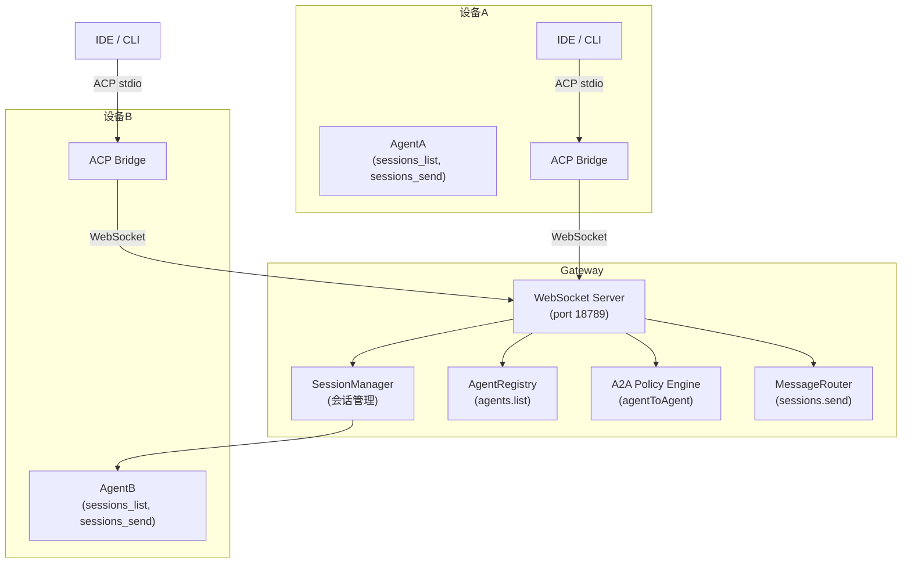
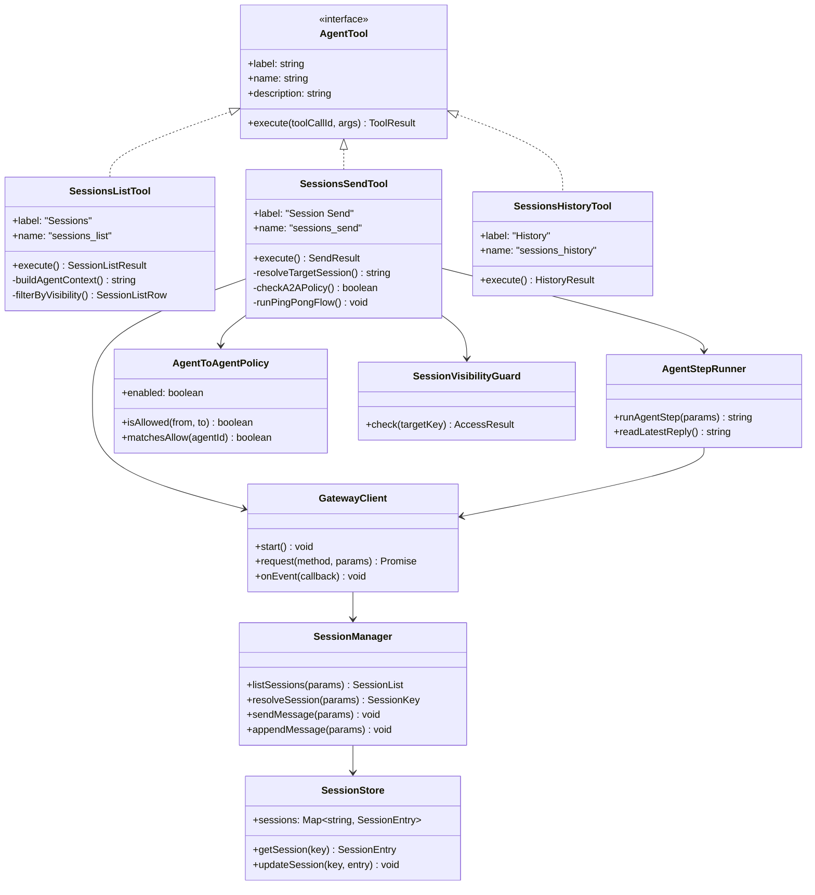
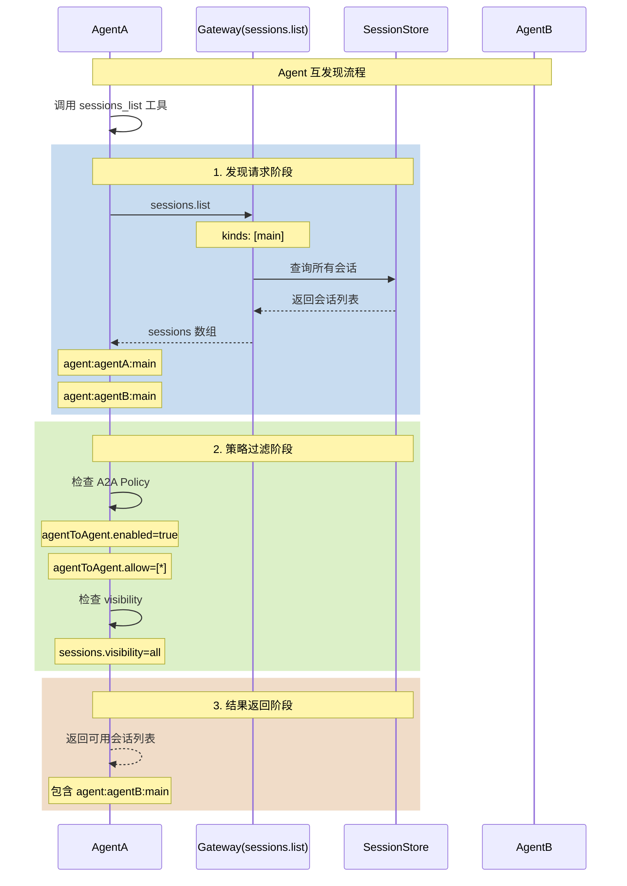
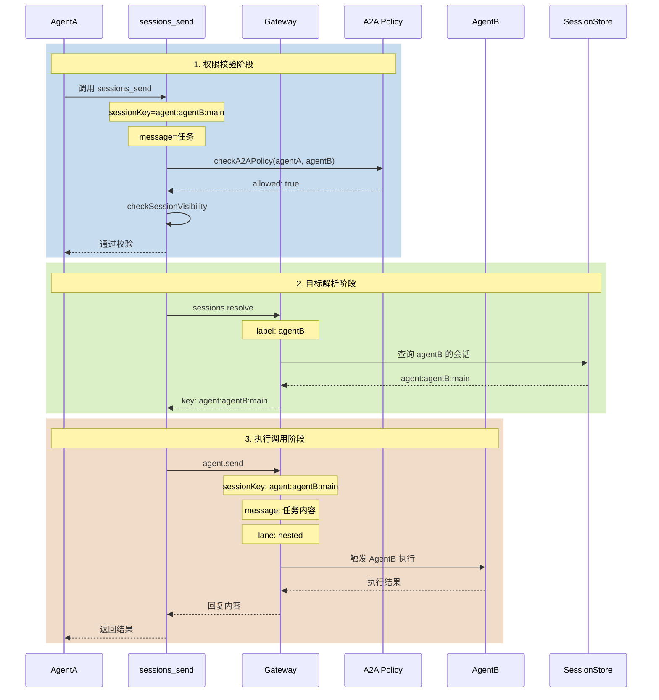
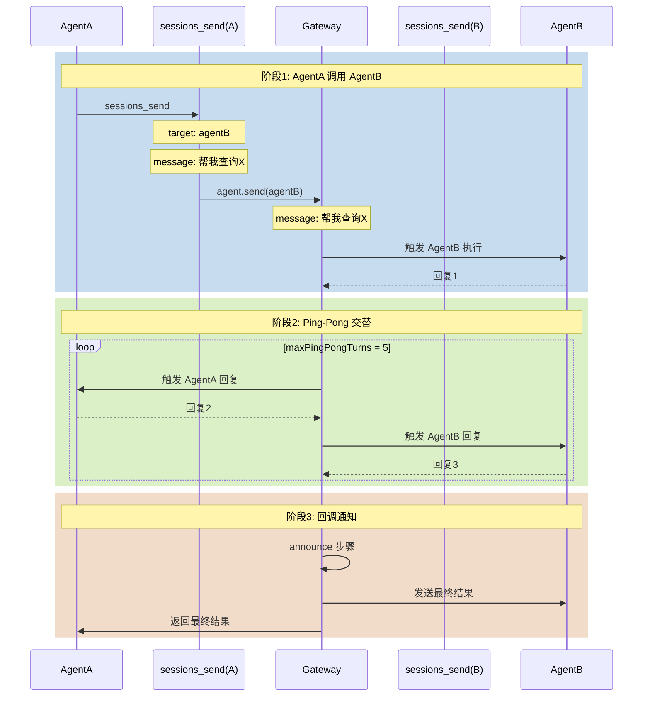
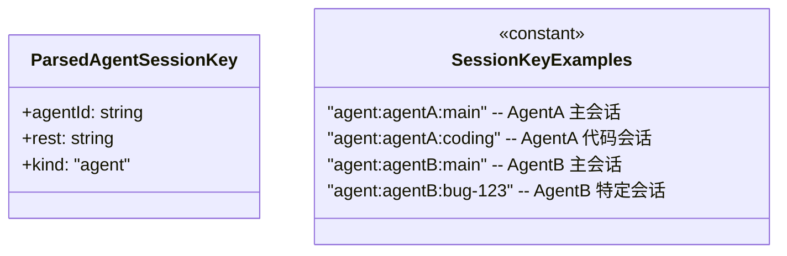
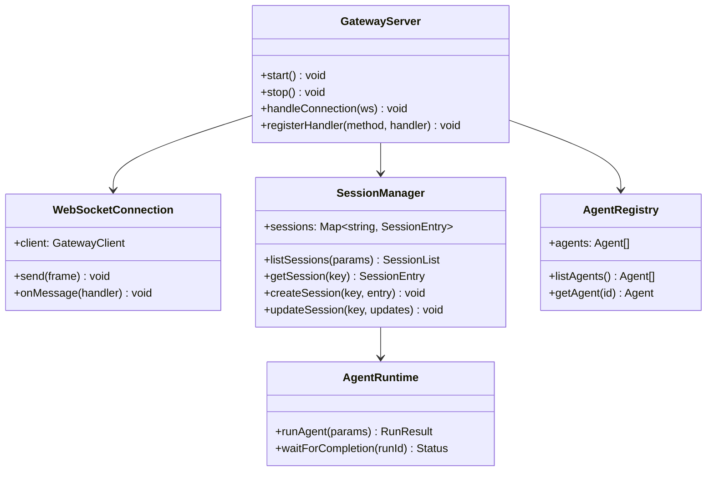
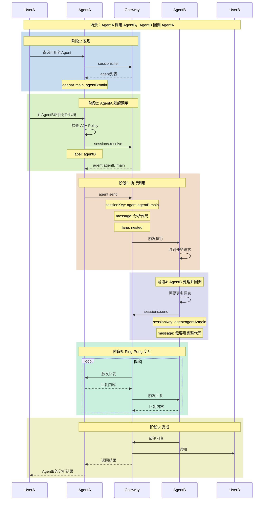

# OpenClaw 跨设备 Agent 双向互调架构分析

## 场景概述

```
设备A                                    设备B
┌─────────────────────────────────┐    ┌─────────────────────────────────┐
│ OpenClaw AgentA                  │    │ OpenClaw AgentB                  │
│ Session Key: agent:agentA:main   │    │ Session Key: agent:agentB:main   │
│                                  │    │                                  │
│ ┌─────────────────────────────┐  │    │ ┌─────────────────────────────┐  │
│ │ sessions_list              │  │    │ │ sessions_list              │  │
│ │ sessions_send              │  │    │ │ sessions_send              │  │
│ │ sessions_history           │  │    │ │ sessions_history           │  │
│ └─────────────────────────────┘  │    │ └─────────────────────────────┘  │
└─────────────────────────────────┘    └─────────────────────────────────┘
              │                                      │
              │              Gateway                   │
              │         ┌───────────────┐             │
              └────────▶│ sessions.list │◀────────────┘
                         │ sessions.send │
                         │ agent.wait    │
                         └───────────────┘
```

## 一、整体架构

### 1.1 架构分层图



### 1.2 核心类图



## 二、关键场景分析

### 场景一：Agent 互发现

**目标**：AgentA 能够发现 AgentB 的存在和会话信息

#### 2.1.1 流程图



#### 2.1.2 核心代码

**sessions-list-tool.ts** ([file:///d:/prj/openclaw_analyze/src/agents/tools/sessions-list-tool.ts](file:///d:/prj/openclaw_analyze/src/agents/tools/sessions-list-tool.ts)):

```typescript
export function createSessionsListTool(opts?: {
  agentSessionKey?: string;
  sandboxed?: boolean;
  config?: OpenClawConfig;
}): AnyAgentTool {
  return {
    label: "Sessions",
    name: "sessions_list",
    description: "List sessions with optional filters and last messages.",
    parameters: SessionsListToolSchema,
    execute: async (_toolCallId, args) => {
      const params = args as Record<string, unknown>;
      const cfg = opts?.config ?? loadConfig();
      
      // 1. 调用 Gateway 获取会话列表
      const list = await callGateway<{ sessions: Array<SessionListRow> }>({
        method: "sessions.list",
        params: {
          limit,
          activeMinutes,
          includeGlobal: !restrictToSpawned,
        },
      });

      // 2. 创建 A2A 策略检查器
      const a2aPolicy = createAgentToAgentPolicy(cfg);
      
      // 3. 创建可见性守卫
      const visibilityGuard = await createSessionVisibilityGuard({
        action: "list",
        requesterSessionKey: effectiveRequesterKey,
        visibility,
        a2aPolicy,
      });

      // 4. 过滤并返回结果
      for (const entry of sessions) {
        const access = visibilityGuard.check(key);
        if (!access.allowed) continue;
        // ... 添加到返回列表
      }
    },
  };
}
```

**sessions-access.ts** ([file:///d:/prj/openclaw_analyze/src/agents/tools/sessions-access.ts](file:///d:/prj/openclaw_analyze/src/agents/tools/sessions-access.ts)):

```typescript
// A2A 策略创建
export function createAgentToAgentPolicy(cfg: OpenClawConfig): AgentToAgentPolicy {
  const routingA2A = cfg.tools?.agentToAgent;
  const enabled = routingA2A?.enabled === true;
  const allowPatterns = Array.isArray(routingA2A?.allow) ? routingA2A.allow : [];
  
  const matchesAllow = (agentId: string) => {
    if (allowPatterns.length === 0) return true;
    return allowPatterns.some((pattern) => {
      if (pattern === "*") return true;
      if (!pattern.includes("*")) return pattern === agentId;
      // 支持通配符匹配
      const re = new RegExp(`^${pattern.replace("*", ".*")}$`, "i");
      return re.test(agentId);
    });
  };

  const isAllowed = (requesterAgentId: string, targetAgentId: string) => {
    if (requesterAgentId === targetAgentId) return true;
    if (!enabled) return false;
    return matchesAllow(requesterAgentId) && matchesAllow(targetAgentId);
  };

  return { enabled, matchesAllow, isAllowed };
}
```

#### 2.1.3 配置示例

**openclaw.json**:
```json5
{
  tools: {
    // 启用 Agent 间通信
    agentToAgent: {
      enabled: true,
      allow: ["*"],  // 允许所有 Agent 互调
      // allow: ["agentA", "agentB"],  // 或指定特定 Agent
    },
    sessions: {
      // 会话可见性: self | tree | agent | all
      visibility: "all",
    },
  },
  agents: {
    list: [
      { id: "agentA" },
      { id: "agentB" },
    ],
  },
}
```

---

### 场景二：Agent 单向调用

**目标**：AgentA 调用 AgentB 执行任务

#### 2.2.1 流程图



#### 2.2.2 核心代码

**sessions-send-tool.ts** ([file:///d:/prj/openclaw_analyze/src/agents/tools/sessions-send-tool.ts](file:///d:/prj/openclaw_analyze/src/agents/tools/sessions-send-tool.ts)):

```typescript
export function createSessionsSendTool(opts?: {
  agentSessionKey?: string;
  agentChannel?: GatewayMessageChannel;
}): AnyAgentTool {
  return {
    name: "sessions_send",
    description: "Send a message into another session.",
    execute: async (_toolCallId, args) => {
      const params = args as Record<string, unknown>;
      const message = readStringParam(params, "message", { required: true });
      
      // 1. A2A 策略检查
      const a2aPolicy = createAgentToAgentPolicy(cfg);
      const requesterAgentId = resolveAgentIdFromSessionKey(opts.agentSessionKey);
      const targetAgentId = resolveAgentIdFromSessionKey(sessionKey);
      
      if (requesterAgentId !== targetAgentId) {
        if (!a2aPolicy.enabled) {
          return jsonResult({ status: "forbidden", error: "A2A disabled" });
        }
        if (!a2aPolicy.isAllowed(requesterAgentId, targetAgentId)) {
          return jsonResult({ status: "forbidden", error: "Not allowed by policy" });
        }
      }

      // 2. 解析目标会话
      if (!sessionKey && labelParam) {
        const resolved = await callGateway<{ key: string }>({
          method: "sessions.resolve",
          params: { label: labelParam },
        });
        sessionKey = resolved.key;
      }

      // 3. 构建 A2A 上下文
      const agentMessageContext = buildAgentToAgentMessageContext({
        requesterSessionKey: opts?.agentSessionKey,
        targetSessionKey: sessionKey,
      });

      // 4. 调用目标 Agent
      const response = await callGateway<{ runId: string }>({
        method: "agent",
        params: {
          message,
          sessionKey,
          lane: AGENT_LANE_NESTED,  // 嵌套车道
          extraSystemPrompt: agentMessageContext,
          inputProvenance: {
            kind: "inter_session",
            sourceSessionKey: opts?.agentSessionKey,
            sourceTool: "sessions_send",
          },
        },
      });

      // 5. 等待结果
      await callGateway({
        method: "agent.wait",
        params: { runId: response.runId, timeoutMs },
      });

      return jsonResult({ status: "ok", runId: response.runId });
    },
  };
}
```

**agent-step.ts** ([file:///d:/prj/openclaw_analyze/src/agents/tools/agent-step.ts](file:///d:/prj/openclaw_analyze/src/agents/tools/agent-step.ts)):

```typescript
export async function runAgentStep(params: {
  sessionKey: string;
  message: string;
  extraSystemPrompt: string;
  timeoutMs: number;
  lane?: string;
  sourceSessionKey?: string;
}): Promise<string | undefined> {
  const stepIdem = crypto.randomUUID();
  
  // 1. 发起 agent 调用
  const response = await callGateway<{ runId?: string }>({
    method: "agent",
    params: {
      message: params.message,
      sessionKey: params.sessionKey,
      idempotencyKey: stepIdem,
      lane: params.lane ?? AGENT_LANE_NESTED,
      extraSystemPrompt: params.extraSystemPrompt,
      inputProvenance: {
        kind: "inter_session",
        sourceSessionKey: params.sourceSessionKey,
        sourceTool: "sessions_send",
      },
    },
    timeoutMs: 10_000,
  });

  // 2. 等待执行完成
  const stepRunId = response.runId || stepIdem;
  await callGateway<{ status?: string }>({
    method: "agent.wait",
    params: { runId: stepRunId, timeoutMs: Math.min(params.timeoutMs, 60_000) },
  });

  // 3. 读取回复
  return await readLatestAssistantReply({ sessionKey: params.sessionKey });
}
```

---

### 场景三：Agent 双向同时调用（Ping-Pong）

**目标**：AgentA 调用 AgentB，同时 AgentB 也发起调用 AgentA

#### 2.3.1 流程图



#### 2.3.2 核心代码

**sessions-send-tool.a2a.ts** ([file:///d:/prj/openclaw_analyze/src/agents/tools/sessions-send-tool.a2a.ts](file:///d:/prj/openclaw_analyze/src/agents/tools/sessions-send-tool.a2a.ts)):

```typescript
export async function runSessionsSendA2AFlow(params: {
  targetSessionKey: string;
  displayKey: string;
  message: string;
  announceTimeoutMs: number;
  maxPingPongTurns: number;  // 默认 5
  requesterSessionKey?: string;
  requesterChannel?: GatewayMessageChannel;
}) {
  // 1. 等待目标 Agent 完成第一轮
  if (!primaryReply && params.waitRunId) {
    const wait = await callGateway({
      method: "agent.wait",
      params: { runId: params.waitRunId, timeoutMs },
    });
    if (wait?.status === "ok") {
      primaryReply = await readLatestAssistantReply({
        sessionKey: params.targetSessionKey,
      });
    }
  }

  // 2. Ping-Pong 多轮对话
  if (params.maxPingPongTurns > 0 && params.requesterSessionKey) {
    let currentSessionKey = params.requesterSessionKey;  // AgentA
    let nextSessionKey = params.targetSessionKey;         // AgentB
    
    for (let turn = 1; turn <= params.maxPingPongTurns; turn++) {
      // 构建回复上下文
      const replyPrompt = buildAgentToAgentReplyContext({
        currentRole: currentSessionKey === params.requesterSessionKey 
          ? "requester" : "target",
        turn,
        maxTurns: params.maxPingPongTurns,
      });
      
      // 在当前会话执行步骤
      const replyText = await runAgentStep({
        sessionKey: currentSessionKey,
        message: incomingMessage,
        extraSystemPrompt: replyPrompt,
        timeoutMs: params.announceTimeoutMs,
      });
      
      if (!replyText) break;
      
      // 交换角色
      [currentSessionKey, nextSessionKey] = [nextSessionKey, currentSessionKey];
      incomingMessage = replyText;
    }
  }

  // 3. 最终回调通知
  const announcePrompt = buildAgentToAgentAnnounceContext({
    originalMessage: params.message,
    latestReply,
  });
  
  await runAgentStep({
    sessionKey: params.targetSessionKey,
    message: "完成 A2A 对话",
    extraSystemPrompt: announcePrompt,
  });
}
```

**sessions-send-helpers.ts** ([file:///d:/prj/openclaw_analyze/src/agents/tools/sessions-send-helpers.ts](file:///d:/prj/openclaw_analyze/src/agents/tools/sessions-send-helpers.ts)):

```typescript
// 构建 Ping-Pong 上下文
export function buildAgentToAgentReplyContext(params: {
  requesterSessionKey?: string;
  targetSessionKey: string;
  currentRole: "requester" | "target";
  turn: number;
  maxTurns: number;
}) {
  const currentLabel = params.currentRole === "requester" 
    ? "Agent 1 (requester)" 
    : "Agent 2 (target)";
  
  return [
    "Agent-to-agent reply step:",
    `Current agent: ${currentLabel}.`,
    `Turn ${params.turn} of ${params.maxTurns}.`,
    `If you want to stop the ping-pong, reply exactly "${REPLY_SKIP_TOKEN}".`,
  ].join("\n");
}

// 构建最终回调上下文
export function buildAgentToAgentAnnounceContext(params: {
  originalMessage: string;
  latestReply?: string;
}) {
  return [
    "Agent-to-agent announce step:",
    `Original request: ${params.originalMessage}`,
    `Latest reply: ${params.latestReply || "(not available)"}`,
    `If you want to remain silent, reply exactly "${ANNOUNCE_SKIP_TOKEN}".`,
    "Any other reply will be posted to the target channel.",
  ].join("\n");
}
```

---

## 三、Session Key 路由机制

### 3.1 Session Key 格式



**Session Key 格式**：
```
agent:{agentId}:{sessionName}
```

**示例**：
| Session Key | Agent ID | 会话名 |
|-------------|----------|--------|
| `agent:agentA:main` | agentA | main |
| `agent:agentB:main` | agentB | main |
| `agent:agentA:coding` | agentA | coding |

### 3.2 路由解析代码

**routing/session-key.ts** ([file:///d:/prj/openclaw_analyze/src/routing/session-key.ts](file:///d:/prj/openclaw_analyze/src/routing/session-key.ts)):

```typescript
export function resolveAgentIdFromSessionKey(sessionKey: string | undefined): string {
  const parsed = parseAgentSessionKey(sessionKey);
  return normalizeAgentId(parsed?.agentId ?? DEFAULT_AGENT_ID);
}

export function buildAgentMainSessionKey(params: {
  agentId: string;
  mainKey?: string;
}): string {
  const agentId = normalizeAgentId(params.agentId);
  const mainKey = normalizeMainKey(params.mainKey);
  return `agent:${agentId}:${mainKey}`;
}
```

---

## 四、Gateway 服务端处理

### 4.1 服务端类图



### 4.2 服务端处理函数

**server-methods/sessions.ts** ([file:///d:/prj/openclaw_analyze/src/gateway/server-methods/sessions.ts](file:///d:/prj/openclaw_analyze/src/gateway/server-methods/sessions.ts)):

```typescript
export const sessionsHandlers: GatewayRequestHandlers = {
  // 列出所有会话
  "sessions.list": ({ params, respond }) => {
    const cfg = loadConfig();
    const { storePath, store } = loadCombinedSessionStoreForGateway(cfg);
    const result = listSessionsFromStore({ cfg, storePath, store, opts: params });
    respond(true, result, undefined);
  },

  // 解析会话键
  "sessions.resolve": async ({ params, respond }) => {
    const cfg = loadConfig();
    const resolved = await resolveSessionKeyFromResolveParams({ cfg, p: params });
    if (!resolved.ok) {
      respond(false, undefined, resolved.error);
      return;
    }
    respond(true, { ok: true, key: resolved.key }, undefined);
  },

  // 更新会话
  "sessions.patch": async ({ params, respond }) => {
    // 应用会话更新（thinkingLevel, verboseLevel 等）
    const result = await applySessionsPatchToStore({ cfg, key, patch: p });
    respond(true, result, undefined);
  },
};
```

---

## 五、完整调用序列图

### 5.1 双向同时调用完整序列



---

## 六、配置清单

### 6.1 完整配置示例

**openclaw.json** (Gateway 配置):
```json5
{
  // Gateway 配置
  gateway: {
    port: 18789,
    bind: "loopback",  // 局域网: "lan", 始终在线: "tailnet"
  },
  
  // 工具配置
  tools: {
    // Agent 间通信策略
    agentToAgent: {
      enabled: true,        // 启用 A2A
      allow: ["*"],         // 允许名单: ["*"] | ["agentA", "agentB"]
    },
    // 会话工具可见性
    sessions: {
      visibility: "all",    // self | tree | agent | all
    },
  },
  
  // Agent 定义
  agents: {
    list: [
      {
        id: "agentA",
        name: "Agent A",
        workspace: "~/.openclaw/workspace-agentA",
      },
      {
        id: "agentB", 
        name: "Agent B",
        workspace: "~/.openclaw/workspace-agentB",
      },
    ],
  },
}
```

### 6.2 设备端配置

**设备A (agentA)**:
```json5
{
  agents: {
    id: "agentA",
  },
  tools: {
    agentToAgent: {
      enabled: true,
      allow: ["agentB"],  // 只允许调用 agentB
    },
  },
}
```

**设备B (agentB)**:
```json5
{
  agents: {
    id: "agentB",
  },
  tools: {
    agentToAgent: {
      enabled: true,
      allow: ["agentA"],  // 只允许调用 agentA
    },
  },
}
```

---

## 七、关键参数说明

| 参数 | 类型 | 默认值 | 说明 |
|------|------|--------|------|
| `tools.agentToAgent.enabled` | boolean | false | 是否启用 A2A 通信 |
| `tools.agentToAgent.allow` | string[] | ["*"] | 允许调用的 Agent ID 列表 |
| `tools.sessions.visibility` | string | "tree" | 会话可见性级别 |
| `maxPingPongTurns` | number | 5 | Ping-Pong 最大轮数 |
| `announceTimeoutMs` | number | 30000 | 回调超时时间(毫秒) |

---

## 八、限制与注意事项

### 8.1 当前限制

| 限制项 | 说明 |
|--------|------|
| **必须共享 Gateway** | 两个 Agent 必须连接到同一个 Gateway |
| **跨 Gateway** | 不同 Gateway 上的 Agent 无法直接通信 |
| **Ping-Pong 轮数** | 最多 5 轮，防止无限循环 |
| **会话隔离** | sandboxed 模式下只能访问子会话 |

### 8.2 安全考虑

1. **A2A Policy**: 必须显式启用并配置允许列表
2. **Visibility**: 敏感会话设置为 "self" 或 "tree"
3. **身份验证**: Gateway 必须配置 token/password
4. **网络隔离**: Gateway 建议绑定 loopback + SSH 隧道

---

## 九、文件索引

| 文件路径 | 说明 |
|---------|------|
| [src/agents/tools/sessions-send-tool.ts](file:///d:/prj/openclaw_analyze/src/agents/tools/sessions-send-tool.ts) | A2A 发送工具核心实现 |
| [src/agents/tools/sessions-send-tool.a2a.ts](file:///d:/prj/openclaw_analyze/src/agents/tools/sessions-send-tool.a2a.ts) | Ping-Pong 流程实现 |
| [src/agents/tools/sessions-list-tool.ts](file:///d:/prj/openclaw_analyze/src/agents/tools/sessions-list-tool.ts) | 会话列表工具 |
| [src/agents/tools/sessions-access.ts](file:///d:/prj/openclaw_analyze/src/agents/tools/sessions-access.ts) | A2A 策略和访问控制 |
| [src/agents/tools/agent-step.ts](file:///d:/prj/openclaw_analyze/src/agents/tools/agent-step.ts) | Agent 步骤执行器 |
| [src/agents/tools/sessions-send-helpers.ts](file:///d:/prj/openclaw_analyze/src/agents/tools/sessions-send-helpers.ts) | A2A 上下文构建 |
| [src/gateway/server-methods/sessions.ts](file:///d:/prj/openclaw_analyze/src/gateway/server-methods/sessions.ts) | Gateway 会话管理 |
| [src/routing/session-key.ts](file:///d:/prj/openclaw_analyze/src/routing/session-key.ts) | Session Key 路由 |
