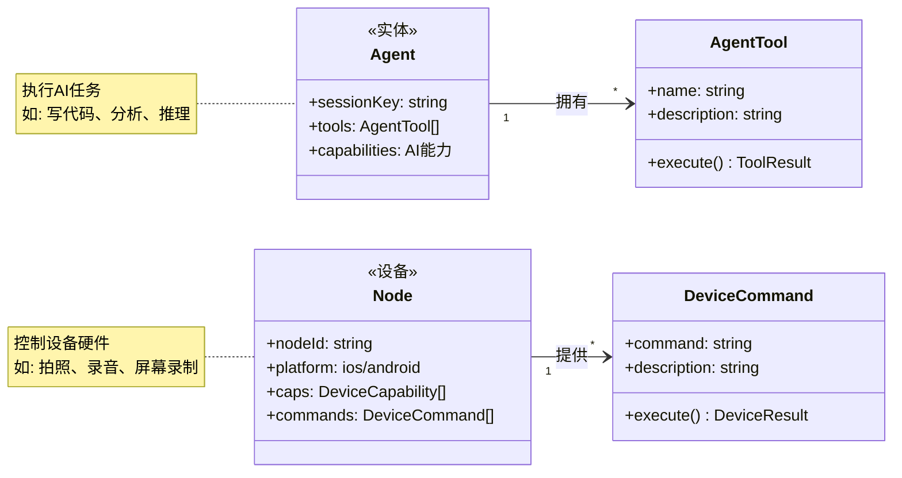
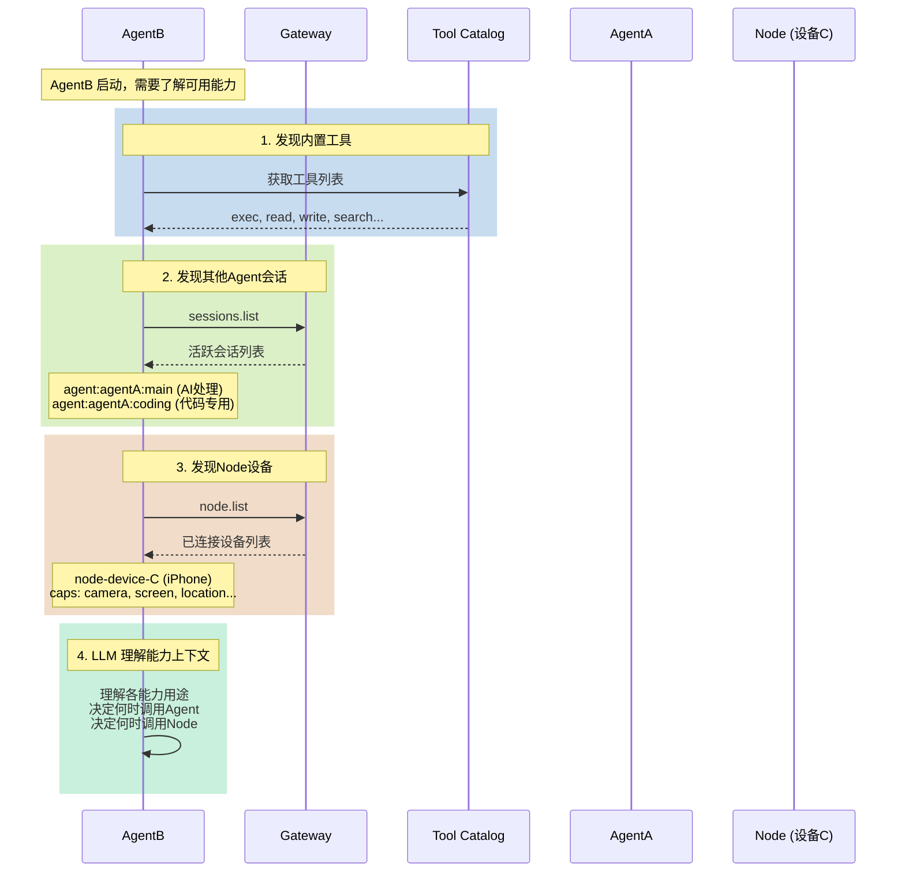
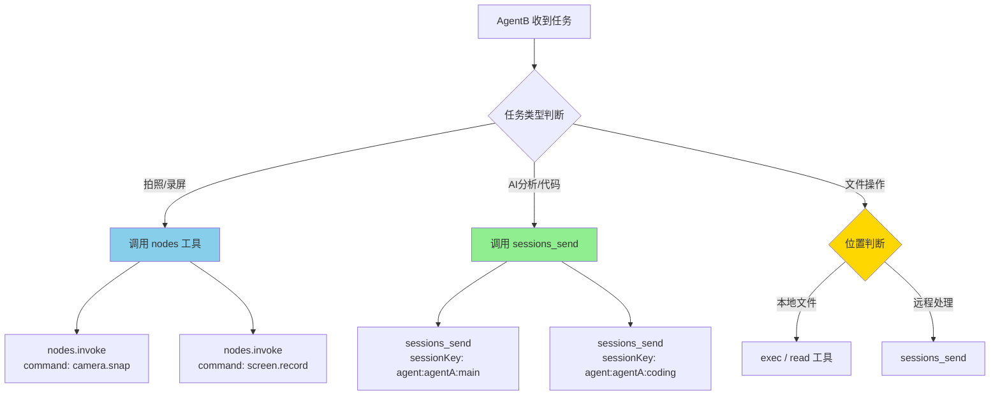
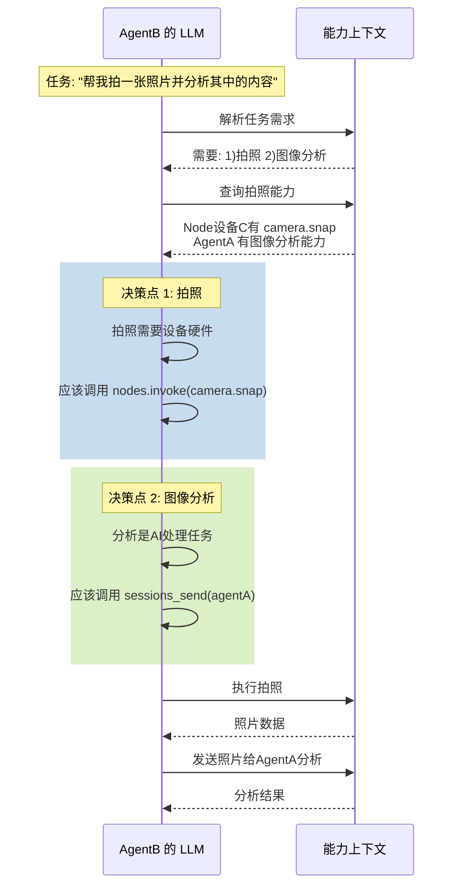
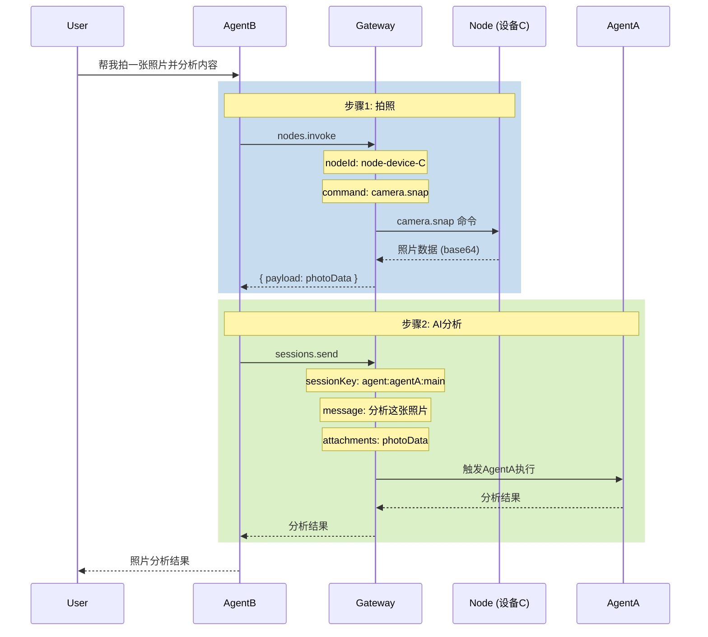
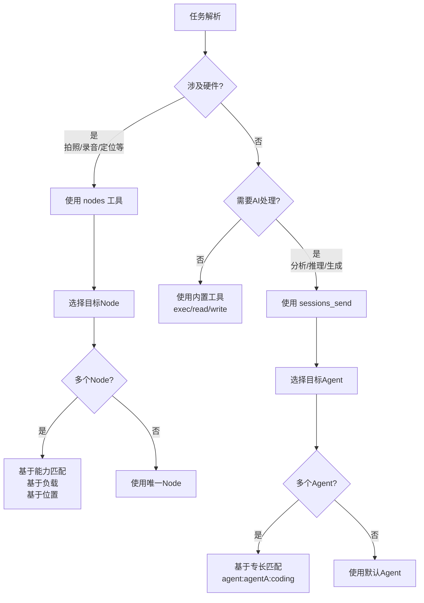
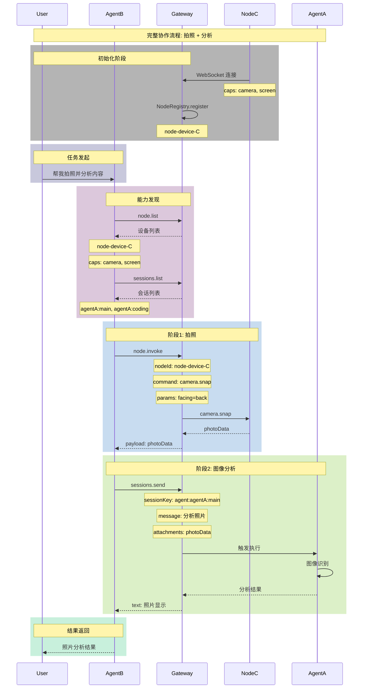

# OpenClaw Agent 与 Node 能力路由分析

## 场景描述

```
设备A                                    设备B                                    设备C
┌─────────────────────────────────┐    ┌─────────────────────────────────┐    ┌─────────────────────────────────┐
│ OpenClaw AgentA                  │    │ OpenClaw AgentB                  │    │ OpenClaw Node (设备C)            │
│ - 通用AI处理能力                  │    │ - 任务编排Agent                   │    │ - 设备能力 (摄像头、屏幕等)        │
│ - 代码执行工具                    │    │ - 调用其他Agent/Node              │    │ - 设备控制命令                    │
│ - 文件处理工具                    │    │ - 能力路由决策                     │    │ - camera.snap, screen.record等   │
│ Session: agent:agentA:main        │    │ Session: agent:agentB:main        │    │ NodeId: node-device-C            │
└─────────────────────────────────┘    └─────────────────────────────────┘    └─────────────────────────────────┘
                                          │                                        │
                                          │                                        │
                                          └──────────────┬─────────────────────────┘
                                                         │
                                                    ┌────┴────┐
                                                    │ Gateway  │
                                                    │ (中央协调) │
                                                    └──────────┘
```

## 一、核心概念区分

### 1.1 Node vs Agent 能力模型



### 1.2 能力类型对比

| 维度 | Agent (AgentA) | Node (设备C) |
|------|----------------|--------------|
| **本质** | AI 处理能力 | 设备硬件能力 |
| **执行位置** | Gateway/沙箱 | 设备本地 |
| **工具** | LLM + Tools | 设备命令 |
| **示例** | 写代码、分析数据 | 拍照、录屏 |
| **发现方式** | sessions_list | nodes.list |
| **调用方式** | sessions_send | node.invoke |
| **会话模型** | Session Key | Node ID |

---

## 二、AgentB 如何发现能力

### 2.1 能力发现流程图



### 2.2 能力描述对比

**AgentA 的能力描述**（通过工具元数据）:
```json
{
  "name": "sessions_send",
  "description": "Send a message into another session. Use sessionKey or label to identify the target.",
  "parameters": {
    "sessionKey": "Target agent session",
    "message": "Task description"
  }
}
```

**设备C 的能力描述**（通过 node.describe）:
```json
{
  "nodeId": "node-device-C",
  "displayName": "iPhone 15 Pro",
  "platform": "ios",
  "caps": ["camera", "screen", "location", "photos"],
  "commands": [
    "camera.snap",
    "screen.record",
    "location.get",
    "system.run"
  ]
}
```

---

## 三、能力路由决策机制

### 3.1 决策流程图



### 3.2 LLM 决策逻辑

AgentB 的 LLM 基于以下信号做出路由决策：



---

## 四、典型场景实现

### 场景：拍照 + AI 分析

**目标**：AgentB 让设备C拍照，然后由 AgentA 分析照片内容

#### 4.1 实现流程图



#### 4.2 核心代码实现

**AgentB 的任务编排逻辑**:

```typescript
// AgentB 收到任务: "拍照并分析"
async function handleTask(task: string) {
  // 1. 发现可用能力
  const nodes = await gateway.call("node.list");
  const sessions = await gateway.call("sessions.list");
  
  // 2. 决策: 拍照 -> Node, 分析 -> AgentA
  const deviceC = nodes.find(n => n.caps.includes("camera"));
  
  // 3. 调用 Node 拍照
  const photoResult = await gateway.call("node.invoke", {
    nodeId: deviceC.nodeId,
    command: "camera.snap",
    params: { facing: "back" }
  });
  
  // 4. 将照片发送给 AgentA 分析
  const analysisResult = await gateway.call("sessions.send", {
    sessionKey: "agent:agentA:main",
    message: "请分析这张照片的内容",
    attachments: [{ type: "image", data: photoResult.payload }]
  });
  
  return analysisResult;
}
```

**nodes.invoke 调用**:

```typescript
// 文件: nodes-tool.ts
async function invokeNodeCommandPayload(params: {
  node: string;
  command: string;
  commandParams?: Record<string, unknown>;
}) {
  // 解析目标 Node
  const nodeId = await resolveNodeId(gatewayOpts, params.node);
  
  // 调用 Gateway 的 node.invoke 方法
  const raw = await callGatewayTool("node.invoke", gatewayOpts, {
    nodeId,
    command: params.command,
    params: params.commandParams ?? {},
    idempotencyKey: crypto.randomUUID(),
  });
  
  return raw?.payload ?? {};
}

// 使用示例
const photo = await invokeNodeCommandPayload({
  node: "node-device-C",  // 指定设备
  command: "camera.snap",
  commandParams: { facing: "back", maxWidth: 1920 }
});
```

**sessions.send 调用**:

```typescript
// 文件: sessions-send-tool.ts
async function sendToAgent(params: {
  targetSessionKey: string;
  message: string;
  attachments?: Attachment[];
}) {
  // 解析目标会话
  const resolved = await gateway.call("sessions.resolve", {
    label: params.targetSessionKey
  });
  
  // 调用 agent.send
  const response = await gateway.call("agent", {
    sessionKey: resolved.key,
    message: params.message,
    attachments: params.attachments,
    lane: "nested",
    extraSystemPrompt: buildAgentContext()
  });
  
  return response;
}

// 使用示例
const analysis = await sendToAgent({
  targetSessionKey: "agent:agentA:main",
  message: "请分析这张照片的内容",
  attachments: [{ type: "image", data: photo }]
});
```

---

## 五、能力选择策略

### 5.1 能力匹配矩阵

| 任务需求 | Node (设备C) | AgentA | 优先级说明 |
|---------|-------------|--------|-----------|
| 拍照 | ✅ camera.snap | ❌ | 硬件操作，Node专有 |
| 录屏 | ✅ screen.record | ❌ | 硬件操作，Node专有 |
| 获取位置 | ✅ location.get | ❌ | 硬件操作，Node专有 |
| AI代码生成 | ❌ | ✅ LLM | AI处理，Agent专有 |
| 文件分析 | ❌ | ✅ LLM + Tools | AI处理，Agent专有 |
| 发送通知 | ✅ system.notify | ❌ | 硬件操作，Node专有 |
| 复杂推理 | ❌ | ✅ LLM | AI处理，Agent专有 |

### 5.2 决策规则



### 5.3 多 Node/Agent 选择策略

当存在多个 Node 或 Agent 提供相似能力时：

```typescript
// 多 Node 选择策略
async function selectNode(task: Task): Promise<Node> {
  const nodes = await gateway.call("node.list");
  const capable = nodes.filter(n => 
    task.requiredCaps.every(cap => n.caps.includes(cap))
  );
  
  if (capable.length === 1) return capable[0];
  
  // 多于一个时，考虑:
  // 1. 设备类型匹配 (手机 vs 平板)
  // 2. 设备状态 (电量、在线状态)
  // 3. 位置邻近度 (如果任务有位置要求)
  return capable[0];
}

// 多 Agent 选择策略
async function selectAgent(task: Task): Promise<string> {
  const sessions = await gateway.call("sessions.list");
  const agentSessions = sessions.filter(s => 
    s.key.startsWith("agent:")
  );
  
  // 基于会话标签/名称匹配
  const label = resolveLabelFromTask(task);
  if (label) {
    const resolved = await gateway.call("sessions.resolve", { label });
    return resolved.key;
  }
  
  // 默认使用 main
  return "agent:main:main";
}
```

---

## 六、完整协作序列图



---

## 七、配置与策略

### 7.1 Node 连接配置

**设备C (Node)** 的配置：

```json5
{
  // 手机 App 配置
  caps: ["camera", "screen", "location", "photos"],
  commands: [
    "camera.snap",
    "screen.record",
    "location.get",
    "system.run"
  ],
  permissions: {
    "camera": true,
    "location": true
  }
}
```

### 7.2 Agent A2A 配置

**AgentB** 的 A2A 配置：

```json5
{
  tools: {
    // Agent 间通信策略
    agentToAgent: {
      enabled: true,
      allow: ["agentA", "agentB"]
    },
    // Node 访问策略
    nodes: {
      enabled: true,
      allow: ["*"]  // 允许访问所有配对设备
    }
  }
}
```

### 7.3 工具可见性配置

```json5
{
  tools: {
    sessions: {
      // Agent 会话可见性
      visibility: "all"  // 可看到所有 Agent 会话
    }
  }
}
```

---

## 八、总结

### 8.1 能力区分原则

| 原则 | Node (设备C) | AgentA |
|------|-------------|--------|
| **硬件控制** | ✅ | ❌ |
| **AI处理** | ❌ | ✅ |
| **实时感知** | ✅ (摄像头、麦克风) | ❌ |
| **复杂推理** | ❌ | ✅ |
| **数据处理** | ❌ | ✅ |

### 8.2 LLM 路由决策

AgentB 的 LLM 基于以下信息做出路由决策：

1. **任务语义分析** - 理解用户需要什么
2. **能力上下文** - 了解 nodes.list 和 sessions.list 的结果
3. **工具描述** - 基于工具的 description 和 parameters
4. **执行结果** - 根据前一步的结果决定后续步骤

### 8.3 关键代码位置

| 组件 | 文件路径 |
|------|---------|
| Node 注册 | [node-registry.ts](file:///d:/prj/openclaw_analyze/src/gateway/node-registry.ts) |
| Node 调用 | [nodes-tool.ts](file:///d:/prj/openclaw_analyze/src/agents/tools/nodes-tool.ts) |
| Session 发送 | [sessions-send-tool.ts](file:///d:/prj/openclaw_analyze/src/agents/tools/sessions-send-tool.ts) |
| A2A 策略 | [sessions-access.ts](file:///d:/prj/openclaw_analyze/src/agents/tools/sessions-access.ts) |
| 工具目录 | [tool-catalog.ts](file:///d:/prj/openclaw_analyze/src/agents/tool-catalog.ts) |

---

## 九、扩展场景

### 9.1 多个 Node 提供相似能力

```
设备C: camera.snap, screen.record
设备D: camera.snap, camera.clip, screen.record
```

**选择策略**：
- 优先选择支持更多能力的设备
- 考虑设备当前状态（电量、是否空闲）
- 考虑位置因素（如果任务有位置依赖）

### 9.2 多个 Agent 提供相似能力

```
AgentA:main - 通用AI
AgentA:coding - 专门代码处理
AgentA:design - 专门设计
```

**选择策略**：
- 基于会话标签/名称匹配
- 基于历史交互记录
- 基于任务类型（编码 -> coding 会话）

### 9.3 能力组合

```
任务: "拍照 -> 分析 -> 生成代码 -> 在设备上运行"
       ↓        ↓         ↓         ↓
     NodeC   AgentA    AgentA    NodeC
   camera   分析结果   生成代码   system.run
```

AgentB 需要编排多个步骤，每个步骤可能调用不同的目标。
