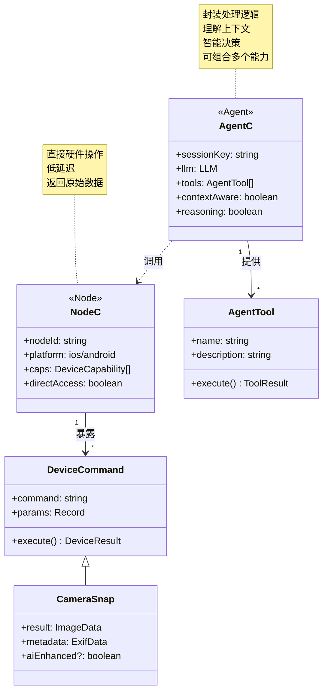
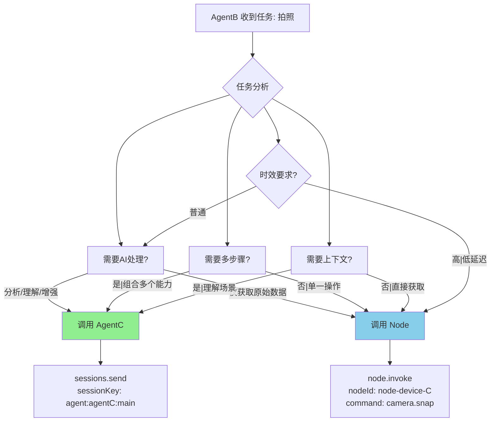
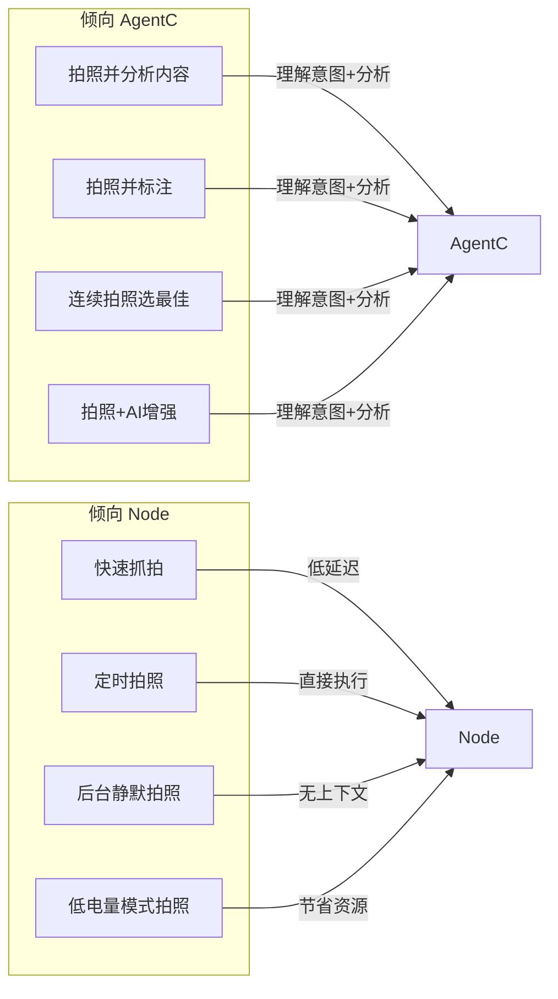
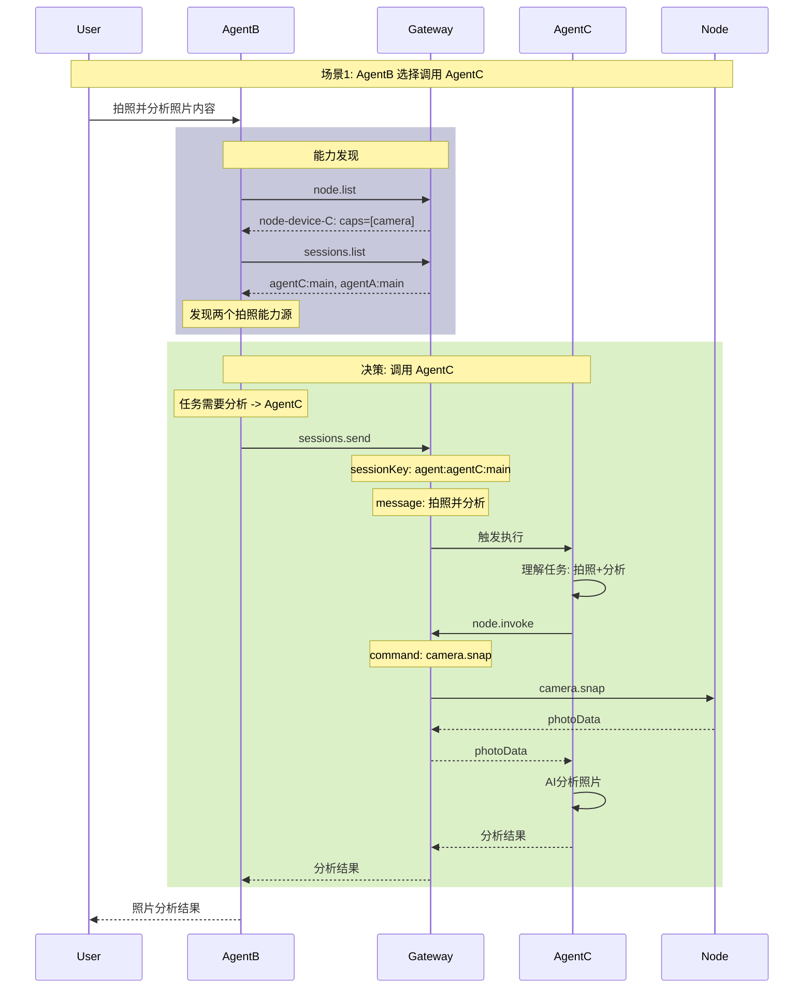
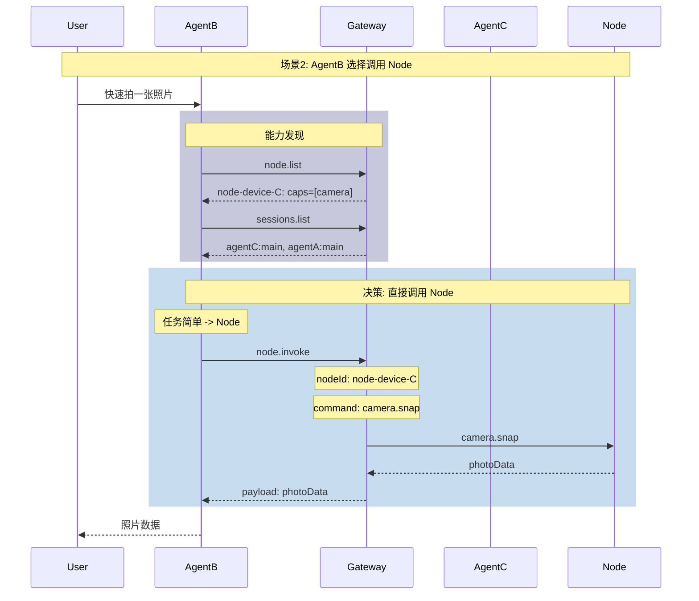
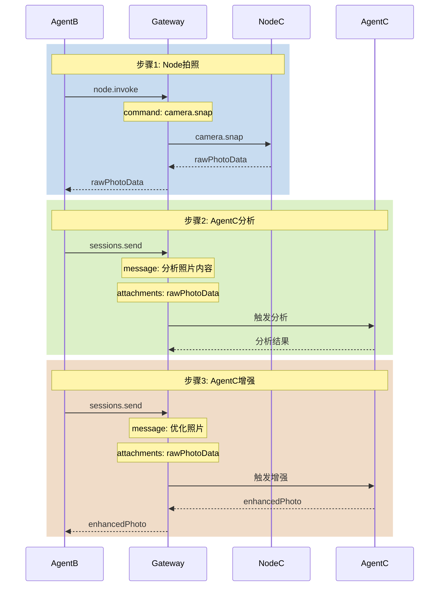
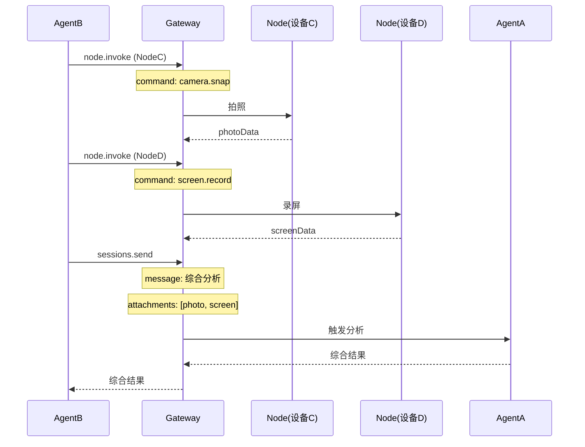
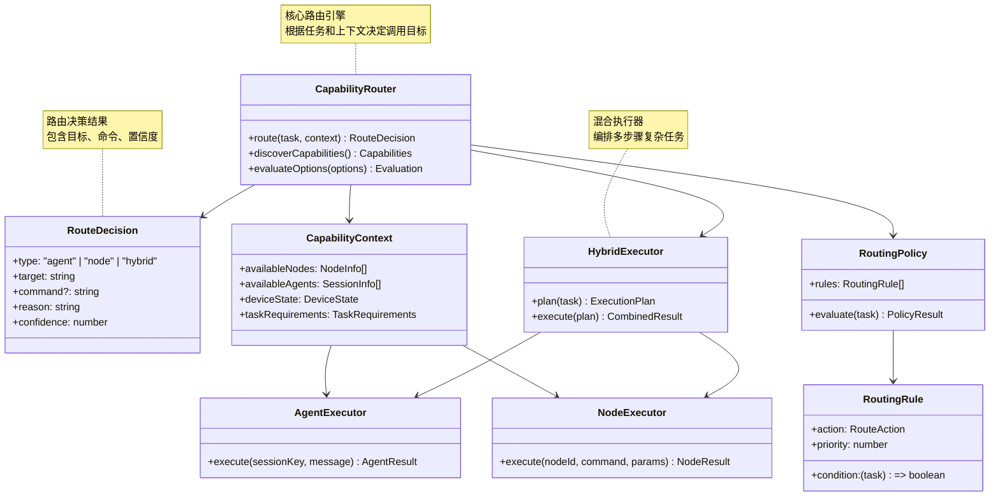

# OpenClaw 能力路由竞争分析：Agent vs Node 决策

## 场景描述

```
┌──────────────────────────────────────────────────────────────────────────────┐
│                              设备C (同一设备)                                │
│  ┌─────────────────────────┐         ┌──────────────────────────────────┐  │
│  │      AgentC              │         │           Node                   │  │
│  │ - AI能力：图像分析        │         │ - 直接设备能力：camera.snap      │  │
│  │ - 任务编排能力            │         │ - camera.clip                    │  │
│  │ - 封装设备操作为工具       │         │ - screen.record                  │  │
│  │ - 上下文感知处理          │         │ - location.get                   │  │
│  │ Session: agent:agentC:main│         │ NodeId: node-device-C            │  │
│  └─────────────────────────┘         └──────────────────────────────────┘  │
│                                                                              │
│  AgentC 调用 Node API 实现拍照 ──────────────────────────────────────────────►│
└──────────────────────────────────────────────────────────────────────────────┘
                                          │
                                          ▼
                              ┌──────────────────────┐
                              │      Gateway          │
                              │ - 维护 Agent 会话      │
                              │ - 维护 Node 注册       │
                              │ - 协调能力路由         │
                              └──────────────────────┘
                                          ▲
                                          │
┌─────────────────────────────────────────┴─────────────────────────────────┐
│                              AgentB (设备B)                                 │
│ - 任务编排Agent                                                              │
│ - 决策调用哪个能力                                                            │
│ - Session: agent:agentB:main                                                │
└─────────────────────────────────────────────────────────────────────────────┘
```

## 一、能力模型对比

### 1.1 AgentC vs Node 能力本质



### 1.2 能力特性对比矩阵

| 特性 | AgentC (拍照能力) | Node (camera.snap) |
|------|------------------|-------------------|
| **执行方式** | AI理解 + 设备调用 | 直接设备API |
| **上下文感知** | ✅ 理解任务意图 | ❌ 纯命令执行 |
| **智能增强** | ✅ AI后处理 | ❌ 原始数据 |
| **多步骤编排** | ✅ 可组合复杂流程 | ❌ 单一命令 |
| **延迟** | 较高 (LLM推理) | 低 (直接调用) |
| **结果质量** | 可优化 | 固定 |
| **错误处理** | 智能重试 | 简单失败 |
| **会话状态** | 保持上下文 | 无状态 |
| **发现方式** | sessions.list | node.list |

### 1.3 能力描述对比

**AgentC 的能力描述**（通过 sessions.list 发现）:
```json
{
  "sessionKey": "agent:agentC:main",
  "label": "AgentC",
  "kinds": ["main"],
  "description": "通用AI助手，可处理图像分析、代码生成等任务"
}
```

**Node 的能力描述**（通过 node.list 发现）:
```json
{
  "nodeId": "node-device-C",
  "displayName": "iPhone 15 Pro",
  "platform": "ios",
  "caps": ["camera", "screen", "location"],
  "commands": ["camera.snap", "camera.clip", "screen.record"]
}
```

---

## 二、路由决策机制

### 2.1 LLM 决策流程



### 2.2 决策因素分析

| 决策因素 | 倾向于 AgentC | 倾向于 Node |
|---------|--------------|-------------|
| **任务类型** | 分析、理解、增强 | 采集、获取 |
| **复杂度** | 多步骤组合 | 单一操作 |
| **上下文需求** | 需要理解场景 | 纯数据获取 |
| **延迟要求** | 可接受较长延迟 | 需要低延迟 |
| **错误容忍** | 智能重试 | 简单失败 |
| **结果质量** | 可优化/增强 | 固定/原始 |
| **设备状态** | - | 电量低时优先Agent |

### 2.3 典型场景映射



---

## 三、实现流程

### 3.1 完整调用序列图





### 3.2 LLM 决策代码示例

```typescript
// AgentB 的 LLM 决策伪代码
async function decideRoute(task: string, context: CapabilityContext) {
  const { nodes, sessions } = context;
  const hasNodeCamera = nodes.some(n => n.caps.includes("camera"));
  const hasAgentCamera = sessions.some(s => 
    s.key.includes("agentC") && s.capabilities?.includes("camera")
  );
  
  // 任务分析
  const needsAnalysis = task.includes("分析") || 
                        task.includes("识别") ||
                        task.includes("处理");
  const needsContext = task.includes("理解") ||
                        task.includes("解释");
  const isSimpleCapture = task.includes("快速") ||
                          task.includes("抓拍") ||
                          task.includes("直接拍");
  
  // 决策逻辑
  if (needsAnalysis || needsContext) {
    // 需要AI处理 -> AgentC
    return {
      type: "agent",
      target: "agent:agentC:main",
      reason: "任务需要AI分析和理解能力"
    };
  }
  
  if (isSimpleCapture) {
    // 简单采集 -> Node
    return {
      type: "node",
      target: "node-device-C",
      command: "camera.snap",
      reason: "快速采集，无需额外处理"
    };
  }
  
  // 默认策略：优先Node（低延迟）
  if (hasNodeCamera) {
    return {
      type: "node",
      target: "node-device-C",
      command: "camera.snap",
      reason: "默认低延迟策略"
    };
  }
  
  // 降级到 AgentC
  return {
    type: "agent",
    target: "agent:agentC:main",
    reason: "Node不可用，降级到Agent"
  };
}
```

---

## 四、路由策略配置

### 4.1 全局策略配置

```json5
{
  "capability": {
    // 路由策略
    "routeStrategy": "auto",  // auto | prefer-node | prefer-agent | explicit
    
    // 各能力类型的默认路由
    "defaults": {
      "camera": "node",       // 默认使用Node
      "screen": "node",
      "location": "node",
      "analysis": "agent"     // 分析类默认Agent
    },
    
    // 负载均衡
    "loadBalancing": {
      "enabled": true,
      "nodePriority": 0.8,    // Node权重
      "agentPriority": 0.2    // Agent权重
    }
  }
}
```

### 4.2 Agent 级别的工具配置

```json5
{
  "tools": {
    // Agent间通信配置
    "sessions": {
      "visibility": "all"
    },
    // Node访问配置
    "nodes": {
      "enabled": true,
      "allow": ["*"]
    },
    // A2A策略
    "agentToAgent": {
      "enabled": true,
      "allow": ["agentC"]  // 只允许调用AgentC
    }
  }
}
```

### 4.3 动态路由规则

```typescript
// 路由规则引擎
const routingRules: RoutingRule[] = [
  {
    condition: (task) => task.urgency === "high",
    action: "prefer-node",
    reason: "高优先级任务优先低延迟"
  },
  {
    condition: (task) => task.battery < 0.2,
    action: "prefer-agent",
    reason: "低电量优先使用远程Agent"
  },
  {
    condition: (task) => task.multiStep === true,
    action: "prefer-agent",
    reason: "多步骤任务需要Agent编排"
  },
  {
    condition: (task) => task.contextRequired === true,
    action: "prefer-agent",
    reason: "需要上下文的任务使用Agent"
  }
];
```

---

## 五、混合调用场景

### 5.1 场景：拍照 + 分析 + 增强

```
任务: "拍照、分析内容、并优化照片质量"
```

**路由决策**:
1. 拍照 → Node (低延迟获取原始数据)
2. 分析 → AgentC (理解内容)
3. 增强 → AgentC (AI图像处理)



### 5.2 场景：多设备协同

```
AgentB 需要:
1. 设备C拍照
2. 设备D录屏
3. AgentA分析综合结果
```



---

## 六、架构类图



---

## 七、总结

### 7.1 路由决策总结

| 场景 | 推荐路由 | 原因 |
|------|---------|------|
| 简单采集 | Node | 低延迟、直接 |
| 需要分析 | AgentC | AI理解能力 |
| 多步骤 | AgentC | 智能编排 |
| 低延迟要求 | Node | 绕过LLM |
| 高电量效率 | Node | 本地执行 |
| 低电量模式 | AgentC | 节省设备资源 |
| 需要上下文 | AgentC | 保持会话状态 |
| 精确控制 | Node | 直接API调用 |

### 7.2 关键实现点

1. **能力发现**: 通过 `node.list` 和 `sessions.list` 获取所有可用能力
2. **任务分析**: LLM 理解任务意图，判断需要的处理类型
3. **路由决策**: 基于规则 + AI 推理选择最优路由
4. **执行分发**: 根据决策调用相应的 Executor
5. **结果聚合**: 混合场景下合并多个结果返回

### 7.3 默认策略建议

```
┌─────────────────────────────────────────────────────┐
│                 默认路由策略                          │
├─────────────────────────────────────────────────────┤
│                                                     │
│   if (任务简单 && 需要低延迟)                         │
│       → Node (直接调用)                             │
│                                                     │
│   else if (任务需要AI || 需要多步骤)                  │
│       → AgentC (智能处理)                           │
│                                                     │
│   else                                             │
│       → Node (默认优先低延迟)                        │
│                                                     │
└─────────────────────────────────────────────────────┘
```

### 7.4 关键代码位置

| 组件 | 文件 |
|------|------|
| Node 调用 | [nodes-tool.ts](file:///d:/prj/openclaw_analyze/src/agents/tools/nodes-tool.ts) |
| Agent 调用 | [sessions-send-tool.ts](file:///d:/prj/openclaw_analyze/src/agents/tools/sessions-send-tool.ts) |
| 能力发现 | [nodes-utils.ts](file:///d:/prj/openclaw_analyze/src/agents/tools/nodes-utils.ts) |
| 策略配置 | [types.tools.ts](file:///d:/prj/openclaw_analyze/src/config/types.tools.ts) |
