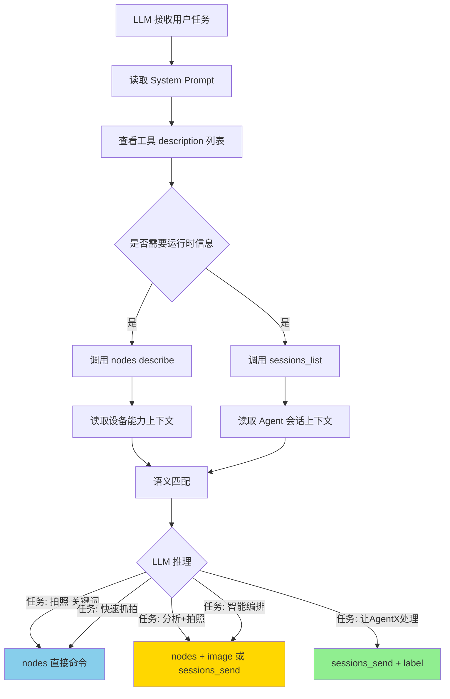
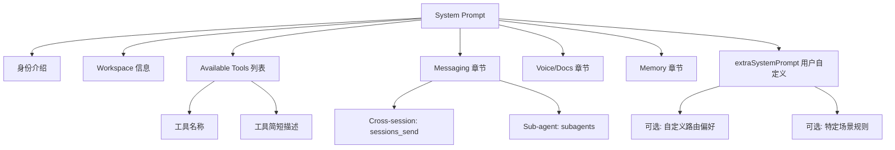
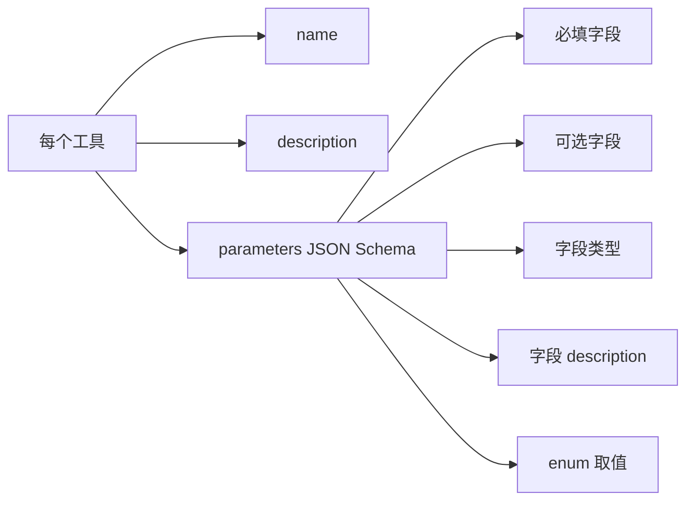

# OpenClaw 中 LLM 的路由决策机制分析

## 一、核心结论

**OpenClaw 没有硬编码的路由规则**，工具选择决策**完全交给 LLM 的语义理解能力**。系统只提供工具描述和运行时上下文，LLM 基于语义匹配自主决策。

| 决策层级 | 描述 |
|---------|------|
| **System Prompt** | 仅提供工具列表和简短描述 |
| **Tool Description** | 提供 OpenAI Function Calling 格式的工具签名 |
| **运行时上下文** | nodes/sessions_list 的实际结果作为消息历史 |
| **LLM 推理** | 基于语义匹配自主决策（无硬编码规则） |

---

## 二、System Prompt 中的工具目录

### 2.1 工具摘要定义

源码位置：[src/agents/system-prompt.ts](file:///d:/prj/openclaw_analyze/src/agents/system-prompt.ts#L240-L272)

```typescript
const coreToolSummaries: Record<string, string> = {
  read: "Read file contents",
  write: "Create or overwrite files",
  edit: "Make precise edits to files",
  apply_patch: "Apply multi-file patches",
  grep: "Search file contents for patterns",
  find: "Find files by glob pattern",
  ls: "List directory contents",
  exec: "Run shell commands (pty available for TTY-required CLIs)",
  process: "Manage background exec sessions",
  web_search: "Search the web (Brave API)",
  web_fetch: "Fetch and extract readable content from a URL",
  browser: "Control web browser",
  canvas: "Present/eval/snapshot the Canvas",
  // 核心区分点
  nodes: "List/describe/notify/camera/screen on paired nodes",
  cron: "Manage cron jobs and wake events",
  message: "Send messages and channel actions",
  gateway: "Restart, apply config, or run updates on the running OpenClaw process",
  agents_list: "List OpenClaw agent ids allowed for sessions_spawn",
  sessions_list: "List other sessions (incl. sub-agents) with filters/last",
  sessions_history: "Fetch history for another session/sub-agent",
  sessions_send: "Send a message to another session/sub-agent",
  sessions_spawn: "Spawn an isolated sub-agent session",
  subagents: "List, steer, or kill sub-agent runs for this requester session",
  session_status: "Show a /status-equivalent status card",
  image: "Analyze an image with the configured image model",
};
```

### 2.2 实际呈现给 LLM 的 prompt 文本

```text
## Available Tools

- read: Read file contents
- write: Create or overwrite files
- exec: Run shell commands (pty available for TTY-required CLIs)
- nodes: List/describe/notify/camera/screen on paired nodes
- sessions_list: List other sessions (incl. sub-agents) with filters/last
- sessions_send: Send a message to another session/sub-agent
- ...

## Messaging
- Reply in current session → automatically routes to the source channel
- Cross-session messaging → use sessions_send(sessionKey, message)
- Sub-agent orchestration → use subagents(action=list|steer|kill)
- Never use exec/curl for provider messaging; OpenClaw handles all routing internally.
```

---

## 三、工具自身的 description（Function Calling Schema）

### 3.1 nodes 工具描述

源码位置：[src/agents/tools/nodes-tool.ts:179](file:///d:/prj/openclaw_analyze/src/agents/tools/nodes-tool.ts#L179-L180)

```typescript
{
  label: "Nodes",
  name: "nodes",
  description: "Discover and control paired nodes (status/describe/pairing/notify/camera/photos/screen/location/notifications/run/invoke).",
  parameters: NodesToolSchema  // action: camera_snap, screen_record, location_get...
}
```

### 3.2 sessions_send 工具描述

源码位置：[src/agents/tools/sessions-send-tool.ts:74](file:///d:/prj/openclaw_analyze/src/agents/tools/sessions-send-tool.ts#L74-L75)

```typescript
{
  label: "Session Send",
  name: "sessions_send",
  description: "Send a message into another session. Use sessionKey or label to identify the target.",
  parameters: SessionsSendToolSchema  // sessionKey, label, agentId, message
}
```

### 3.3 完整的工具 schema 示例

```json
{
  "name": "nodes",
  "description": "Discover and control paired nodes (status/describe/pairing/notify/camera/photos/screen/location/notifications/run/invoke).",
  "parameters": {
    "type": "object",
    "properties": {
      "action": {
        "enum": ["status", "describe", "camera_snap", "camera_clip", 
                 "screen_record", "location_get", "run", "invoke", ...]
      },
      "node": { "type": "string" },
      "facing": { "enum": ["front", "back", "both"] },
      "maxWidth": { "type": "number" },
      "quality": { "type": "number" }
    }
  }
}
```

---

## 四、LLM 的决策流程

### 4.1 完整决策流程图



### 4.2 决策依据的隐式信号

LLM 基于以下**隐式信号**自主决策（无任何硬编码规则）：

| 信号类型 | 示例 | 影响 |
|---------|------|------|
| **工具名称语义** | `nodes` vs `sessions_send` | nodes 暗示硬件设备 |
| **description 关键词** | "camera/screen on paired nodes" | 匹配硬件操作 |
| **任务语义** | "拍照" / "分析" / "让AgentX..." | 匹配工具用途 |
| **运行时上下文** | nodes describe 返回的 caps | 实际可用能力 |
| **预训练知识** | 模型理解 Node=设备, Agent=AI | 通用语义理解 |

---

## 五、典型 LLM 推理示例

### 示例 1：简单硬件操作

```text
[User Input]
拍张照片

[LLM 推理过程]
1. 任务关键词: "拍照"
2. 工具匹配:
   - nodes.description 包含 "camera"
   - sessions_send.description 是 "Send a message"
3. 决策: nodes 直接对应 camera 操作
4. 选择 nodes 工具

[Tool Call]
{
  "name": "nodes",
  "arguments": {
    "action": "camera_snap",
    "node": "node-device-C"
  }
}
```

### 示例 2：复合任务

```text
[User Input]
拍照并分析里面的物体

[LLM 推理过程]
1. 任务包含两个步骤: 拍照 + 分析
2. 选项分析:
   - 选项A: nodes(拍照) + image工具(分析) - 直接组合
   - 选项B: sessions_send(让AgentC处理整个任务) - 委托
3. 倾向选项A: 工具明确，无需委托
4. 分两步执行

[Tool Calls]
Step 1:
{
  "name": "nodes",
  "arguments": { "action": "camera_snap", "node": "node-device-C" }
}

Step 2:
{
  "name": "image",
  "arguments": { "data": "<photo_from_step1>", "prompt": "识别物体" }
}
```

### 示例 3：明确委托

```text
[User Input]
让AgentC帮我拍照并分析

[LLM 推理过程]
1. 用户明确指定 AgentC
2. 工具匹配:
   - sessions_send.description: "Send a message to another session"
3. 决策: 使用 sessions_send 委托给 AgentC

[Tool Call]
{
  "name": "sessions_send",
  "arguments": {
    "label": "agentC",
    "message": "请拍照并分析里面的物体"
  }
}
```

### 示例 4：能力发现优先

```text
[User Input]
帮我拍一张设备C上的照片

[LLM 推理过程]
1. 先发现能力
2. 调用 nodes describe

[Tool Call - 发现]
{
  "name": "nodes",
  "arguments": { "action": "describe", "node": "device-C" }
}

[Tool Result]
{
  "nodeId": "node-device-C",
  "platform": "ios",
  "caps": ["camera", "screen", "location"],
  "commands": ["camera.snap", "camera.clip", "screen.record"]
}

[LLM 推理 - 第二步]
1. 设备C有 camera 能力
2. 选择 camera.snap 命令

[Tool Call - 执行]
{
  "name": "nodes",
  "arguments": {
    "action": "camera_snap",
    "node": "node-device-C"
  }
}
```

---

## 六、关键观察：OpenClaw 的设计哲学

### 6.1 没有专门的路由教学

通过代码搜索可以确认：

| 观察项 | 实际情况 |
|--------|---------|
| 是否有"何时用Node vs Agent"的规则 | ❌ 没有 |
| 是否有路由决策引擎 | ❌ 没有 |
| 是否有能力优先级配置 | ❌ 没有 |
| 决策由谁做 | ✅ **完全交给 LLM** |

### 6.2 工具摘要的实际生成

```typescript
// src/agents/tool-summaries.ts
export function buildToolSummaryMap(tools: AgentTool[]): Record<string, string> {
  const summaries: Record<string, string> = {};
  for (const tool of tools) {
    const summary = tool.description?.trim() || tool.label?.trim();
    if (!summary) {
      continue;
    }
    summaries[tool.name.toLowerCase()] = summary;
  }
  return summaries;
}
```

只是简单的 `name → description` 映射，没有任何路由提示。

### 6.3 Messaging 章节的明确指引

```text
## Messaging
- Reply in current session → automatically routes to the source channel (Signal, Telegram, etc.)
- Cross-session messaging → use sessions_send(sessionKey, message)
- Sub-agent orchestration → use subagents(action=list|steer|kill)
- Never use exec/curl for provider messaging; OpenClaw handles all routing internally.
```

这是**唯一**明确告诉 LLM 何时使用 `sessions_send` 的指引，但没有提到 Node。

---

## 七、Prompt 完整结构

### 7.1 System Prompt 构成



### 7.2 Function Calling Schema 构成



---

## 八、改进建议

### 8.1 在 extraSystemPrompt 中添加路由偏好

```typescript
extraSystemPrompt: `
## Capability Routing Preference

### When to use 'nodes' tool:
- Direct hardware control: camera, screen, location, notifications
- Low-latency raw data capture
- No AI processing needed
- Single-step operations

### When to use 'sessions_send' tool:
- Need AI analysis or reasoning
- Multi-step task orchestration
- Context-aware processing
- User explicitly mentions an agent name (e.g., "让AgentC...")

### Decision rule:
1. If task contains "快速/抓拍/直接拍" → prefer 'nodes'
2. If task contains "分析/理解/优化/增强" → prefer 'sessions_send'
3. If task has multiple steps with AI processing → 'sessions_send'
4. Otherwise → use 'nodes' for raw data, then process with built-in tools
`
```

### 8.2 增强工具 description 的语义

```typescript
// 改进后的 nodes 工具
{
  name: "nodes",
  description: "Direct hardware control on paired devices (camera, screen, location). " +
               "USE THIS for low-latency raw data capture without AI processing. " +
               "Prefer this over sessions_send when you only need to collect data."
}

// 改进后的 sessions_send 工具
{
  name: "sessions_send",
  description: "Delegate a task to another AI agent for intelligent processing. " +
               "USE THIS when the task requires AI analysis, multi-step reasoning, " +
               "or context-aware handling. Prefer this over nodes when the task " +
               "needs more than raw data collection."
}
```

### 8.3 在 description 中加入示例

```typescript
{
  name: "nodes",
  description: `
    Discover and control paired nodes.
    
    Examples:
    - "快速拍照" → action: camera_snap
    - "录屏10秒" → action: screen_record
    - "获取位置" → action: location_get
    
    DO NOT USE for: AI analysis, image understanding, complex reasoning.
  `
}
```

---

## 九、对比总结

### 9.1 当前 OpenClaw 的决策方式

```
┌─────────────────────────────────────────────────────────────┐
│              用户任务                                         │
└──────────────────────┬──────────────────────────────────────┘
                       │
                       ▼
┌─────────────────────────────────────────────────────────────┐
│            System Prompt (静态)                              │
│  ┌───────────────────────────────────────────────────────┐ │
│  │ ## Available Tools                                     │ │
│  │ - nodes: List/describe/.../camera/screen on paired... │ │
│  │ - sessions_send: Send a message to another session    │ │
│  │ ## Messaging                                          │ │
│  │ - Cross-session messaging → use sessions_send         │ │
│  └───────────────────────────────────────────────────────┘ │
└──────────────────────┬──────────────────────────────────────┘
                       │
                       ▼
┌─────────────────────────────────────────────────────────────┐
│            运行时上下文 (动态)                                │
│  - nodes describe result                                    │
│  - sessions_list result                                     │
└──────────────────────┬──────────────────────────────────────┘
                       │
                       ▼
┌─────────────────────────────────────────────────────────────┐
│            LLM 自主推理                                       │
│  - 语义匹配                                                  │
│  - 工具选择                                                  │
│  - 参数填充                                                  │
└─────────────────────────────────────────────────────────────┘
```

### 9.2 决策机制对比

| 维度 | 硬编码路由 | LLM 自主决策 (OpenClaw) |
|------|----------|----------------------|
| **灵活性** | 低 | 高 |
| **可控性** | 高 | 中 |
| **维护成本** | 高（需更新规则） | 低（依赖模型） |
| **新场景适应** | 差 | 好 |
| **可解释性** | 强 | 弱 |
| **模型依赖** | 无 | 强（依赖模型质量） |

---

## 十、关键代码位置

| 组件 | 文件路径 |
|------|---------|
| System Prompt 构建 | [src/agents/system-prompt.ts](file:///d:/prj/openclaw_analyze/src/agents/system-prompt.ts) |
| 工具摘要生成 | [src/agents/tool-summaries.ts](file:///d:/prj/openclaw_analyze/src/agents/tool-summaries.ts) |
| nodes 工具 | [src/agents/tools/nodes-tool.ts](file:///d:/prj/openclaw_analyze/src/agents/tools/nodes-tool.ts) |
| sessions_send 工具 | [src/agents/tools/sessions-send-tool.ts](file:///d:/prj/openclaw_analyze/src/agents/tools/sessions-send-tool.ts) |
| 嵌入式 Prompt | [src/agents/pi-embedded-runner/system-prompt.ts](file:///d:/prj/openclaw_analyze/src/agents/pi-embedded-runner/system-prompt.ts) |

---

## 十一、最终结论

1. **OpenClaw 不依赖硬编码规则**：路由决策完全交给 LLM
2. **System Prompt 只提供工具目录**：简短描述，无路由教学
3. **工具 description 是关键信号**：决定 LLM 的语义匹配
4. **运行时上下文影响决策**：nodes describe 和 sessions_list 的结果
5. **LLM 决策的核心是语义匹配**：
   - "拍照" → 匹配 "camera" → nodes
   - "分析" → 匹配 "session" → sessions_send
   - 明确委托 → sessions_send
6. **改进方向**：通过 extraSystemPrompt 注入路由偏好，或增强工具 description 语义
