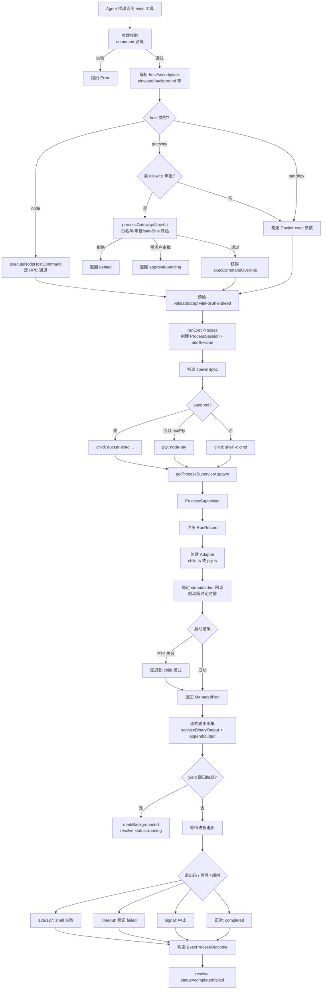
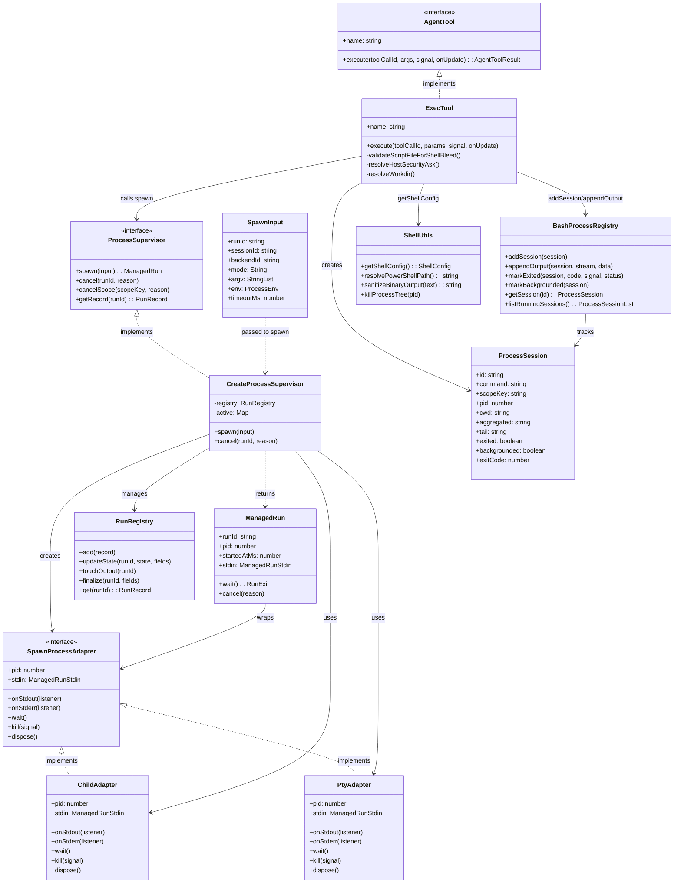

# OpenClaw 执行 Shell 命令主流程分析

## 概述

OpenClaw 的 shell 命令执行是一个**分层架构**：`Agent 工具层 (createExecTool)` → `执行调度层 (runExecProcess)` → `进程监督层 (ProcessSupervisor)` → `进程适配层 (Child/Pty Adapter)`。模型推理调用 `exec` 工具后,请求按 host（`sandbox` / `gateway` / `node`）路由,经安全策略/审批/环境变量校验后,由 `ProcessSupervisor` 统一管理 child 进程与 PTY 的生命周期。

主要相关文件：

- [bash-tools.ts](file:///d:/prj/openclaw_analyze/src/agents/bash-tools.ts)：工具导出入口
- [bash-tools.exec.ts](file:///d:/prj/openclaw_analyze/src/agents/bash-tools.exec.ts)：exec 工具实现
- [bash-tools.exec-runtime.ts](file:///d:/prj/openclaw_analyze/src/agents/bash-tools.exec-runtime.ts)：运行时（spawnSpec 构造、supervisor 调度）
- [bash-tools.exec-host-gateway.ts](file:///d:/prj/openclaw_analyze/src/agents/bash-tools.exec-host-gateway.ts)：gateway 主机白名单与审批
- [bash-tools.exec-host-node.ts](file:///d:/prj/openclaw_analyze/src/agents/bash-tools.exec-host-node.ts)：远程节点执行
- [bash-tools.process.ts](file:///d:/prj/openclaw_analyze/src/agents/bash-tools.process.ts)：process 工具（管理后台会话）
- [bash-process-registry.ts](file:///d:/prj/openclaw_analyze/src/agents/bash-process-registry.ts)：会话注册表
- [shell-utils.ts](file:///d:/prj/openclaw_analyze/src/agents/shell-utils.ts)：Shell 路径解析、PowerShell 选择
- [process/supervisor/supervisor.ts](file:///d:/prj/openclaw_analyze/src/process/supervisor/supervisor.ts)：进程监督器
- [process/supervisor/adapters/child.ts](file:///d:/prj/openclaw_analyze/src/process/supervisor/adapters/child.ts)：子进程适配器
- [process/supervisor/adapters/pty.ts](file:///d:/prj/openclaw_analyze/src/process/supervisor/adapters/pty.ts)：PTY 适配器

---

## 1. 主流程图



---

## 2. 类图



---

## 3. 核心代码片段

### 3.1 工具入口：`createExecTool()`

位置：[bash-tools.exec.ts:148-220](file:///d:/prj/openclaw_analyze/src/agents/bash-tools.exec.ts#L148-L220)

工厂模式创建 exec 工具实例，封装默认配置（`backgroundMs` / `timeoutSec` / `pathPrepend` / `safeBins` 等），是 Agent LLM 推理调用的入口。

```typescript
export function createExecTool(defaults?: ExecToolDefaults): AgentTool<any, ExecToolDetails> {
  const defaultBackgroundMs = clampWithDefault(
    defaults?.backgroundMs ?? readEnvInt("PI_BASH_YIELD_MS"),
    10_000, 10, 120_000,
  );
  const defaultTimeoutSec =
    typeof defaults?.timeoutSec === "number" && defaults.timeoutSec > 0
      ? defaults.timeoutSec
      : 1800;
  // ...解析 safeBins、safeBinProfiles、trustedSafeBinDirs
  return { name: "exec", label: "exec", parameters: execSchema, execute: ... };
}
```

### 3.2 执行前参数解析与 host 路由

位置：[bash-tools.exec.ts:236-540](file:///d:/prj/openclaw_analyze/src/agents/bash-tools.exec.ts#L236-L540)

按 `host`（`sandbox` / `gateway` / `node`）和 `security`（`deny` / `allowlist` / `full`）三段决策：

1. **elevated 检查**：未启用时强制 off
2. **host 切换检查**：非 elevated 请求不能切换 host
3. **security 合并**：取 `minSecurity(configured, requested)`
4. **workdir 解析**：沙箱走 `resolveSandboxWorkdir`，非沙箱走 `resolveWorkdir`
5. **环境变量清理**：主机执行调用 `sanitizeHostBaseEnv` + `validateHostEnv` 阻断 PATH/LD\_\* 劫持

```typescript
let host: ExecHost = requestedHost ?? configuredHost;
if (!elevatedRequested && requestedHost && requestedHost !== configuredHost) {
  throw new Error(`exec host not allowed (requested ...; configure ...).`);
}
if (elevatedRequested) host = "gateway";

let security = minSecurity(configuredSecurity, requestedSecurity ?? configuredSecurity);
if (elevatedRequested && elevatedMode === "full") security = "full";
```

### 3.3 gateway 白名单与审批评估

位置：[bash-tools.exec-host-gateway.ts:70-310](file:///d:/prj/openclaw_analyze/src/agents/bash-tools.exec-host-gateway.ts#L70-L310)

仅在 `host=gateway` 且未 bypass 时调用：解析命令为 segments，评估 allowlist 匹配、安全混淆检测、heredoc 风险，然后决定直接放行 / 拒绝 / 转交人工审批。

```typescript
const allowlistEval = evaluateShellAllowlist({
  command: params.command,
  allowlist: approvals.allowlist,
  // ...
});
if (hostSecurity === "allowlist" && analysisOk && allowlistSatisfied) {
  // 走 allowlist 命中路径：构造 execution plan
}
// 否则走审批流程
const baseDecision = await requestApproval({ ... });
if (baseDecision.approved) {
  // 发出 Exec approved 系统事件并放行
}
```

### 3.4 核心调度：`runExecProcess()`

位置：[bash-tools.exec-runtime.ts:409-680](file:///d:/prj/openclaw_analyze/src/agents/bash-tools.exec-runtime.ts#L409-L680)

**整个流程的核心**：把命令请求转为 ProcessSession + spawnSpec，再通过 `getProcessSupervisor().spawn()` 启动。

```typescript
// 1) 注册会话
const sessionId = createSessionSlug();
const session: ProcessSession = { id: sessionId, command: opts.command, ... };
addSession(session);

// 2) 构造 spawn 规格
const spawnSpec = opts.sandbox
  ? { mode: "child", argv: ["docker", ...buildDockerExecArgs({...})], stdinMode: ... }
  : opts.usePty
  ? { mode: "pty", ptyCommand: execCommand, childFallbackArgv, stdinMode: "pipe-open" }
  : { mode: "child", argv: [shell, ...shellArgs, execCommand], stdinMode: "pipe-closed" };

// 3) 启动并拿到 ManagedRun
managedRun = await supervisor.spawn({ ...spawnBase, mode: spawnSpec.mode, ... });
session.stdin = managedRun.stdin;
session.pid = managedRun.pid;

// 4) PTY 失败回退
} catch (err) {
  if (spawnSpec.mode === "pty") {
    managedRun = await supervisor.spawn({ ..., mode: "child", argv: spawnSpec.childFallbackArgv });
  }
}
```

### 3.5 进程监督：`ProcessSupervisor.spawn()`

位置：[supervisor.ts:111-340](file:///d:/prj/openclaw_analyze/src/process/supervisor/supervisor.ts#L111-L340)

监督器统一管理：注册 RunRecord、设置超时、绑定流、回收资源。

```typescript
// 创建 registry 记录
const record: RunRecord = {
  runId, sessionId: input.sessionId, backendId: input.backendId,
  state: "starting", startedAtMs, lastOutputAtMs: startedAtMs,
};
registry.add(record);

// 创建适配器（child / pty）
const adapter = input.mode === "pty"
  ? await createPtyAdapter({ shell, args: [...shellArgs, ptyCommand], ... })
  : await createChildAdapter({ argv: input.argv, cwd: input.cwd, env: input.env, ... });

registry.updateState(runId, "running", { pid: adapter.pid });

// 设置超时
if (overallTimeoutMs) timeoutTimer = setTimeout(() => requestCancel("overall-timeout"), overallTimeoutMs);
if (noOutputTimeoutMs) noOutputTimer = setTimeout(() => requestCancel("no-output-timeout"), noOutputTimeoutMs);

// 绑定输出回调（每次输出触发 touchOutput 重置无输出超时）
adapter.onStdout((chunk) => { input.onStdout?.(chunk); touchOutput(); });
adapter.onStderr((chunk) => { input.onStderr?.(chunk); touchOutput(); });

// 等待退出
const waitPromise = adapter.wait().then((result) => { ...registry.finalize(runId, {...}); });
return { runId, pid, stdin, wait: () => waitPromise, cancel: (reason) => requestCancel(reason) };
```

### 3.6 子进程适配器：`createChildAdapter()`

位置：[adapters/child.ts:21-150](file:///d:/prj/openclaw_analyze/src/process/supervisor/adapters/child.ts#L21-L150)

封装 `node:child_process` 的 `spawn` 为统一接口。POSIX 上默认 `detached: true`（脱离父进程组），service 模式（systemd/launchd）下不脱离以便停止整棵进程树。

```typescript
const options: SpawnOptions = {
  cwd: params.cwd,
  env: params.env ? toStringEnv(params.env) : undefined,
  stdio: ["pipe", "pipe", "pipe"],
  detached: useDetached,  // POSIX 脱离进程组
  windowsHide: true,
};

const spawned = await spawnWithFallback({ argv: resolvedArgv, options, fallbacks: [...] });
const child = spawned.child as ChildProcessWithoutNullStreams;

// kill 走进程组/进程树
const kill = (signal?: NodeJS.Signals) => {
  if (signal === undefined || signal === "SIGKILL") {
    if (pid) killProcessTree(pid);  // Windows: taskkill /F /T；POSIX: process.kill(-pid)
  } else {
    child.kill(signal);
  }
};
```

### 3.7 退出结果归一化

位置：[bash-tools.exec-runtime.ts:701-780](file:///d:/prj/openclaw_analyze/src/agents/bash-tools.exec-runtime.ts#L701-L780)

把 `RunExit` 包装为 `ExecProcessOutcome`，区分 126/127 shell 失败、超时、信号中止：

```typescript
const promise = managedRun.wait().then((exit): ExecProcessOutcome => {
  const isShellFailure = exitCode === 126 || exitCode === 127;
  const status: "completed" | "failed" = isNormalExit && !isShellFailure ? "completed" : "failed";

  // reason 优先级: shell-fail > overall-timeout > no-output-timeout > signal > unknown
  const reason = isShellFailure
    ? exitCode === 127
      ? "Command not found"
      : "Command not executable (permission denied)"
    : exit.reason === "overall-timeout"
      ? `Command timed out after ${opts.timeoutSec} seconds...`
      : exit.reason === "no-output-timeout"
        ? "Command timed out waiting for output"
        : exit.exitSignal != null
          ? `Command aborted by signal ${exit.exitSignal}`
          : "Command aborted before exit code was captured";
});
```

---

## 4. 关键设计点

| 设计点                   | 实现位置                                            | 说明                                                                               |
| ------------------------ | --------------------------------------------------- | ---------------------------------------------------------------------------------- |
| **三层分离**             | execTool → runExecProcess → supervisor              | 工具定义 / 调度逻辑 / 进程管理解耦，可独立测试                                     |
| **三种 spawn 模式**      | `runExecProcess` 构造 spawnSpec                     | `child` (本地) / `docker exec` (沙箱) / `pty` (交互式 TUI)                         |
| **PTY 自动回退**         | `bash-tools.exec-runtime.ts:658-678`                | PTY 失败时降级到 child 并 `warnings.push` 提示用户                                 |
| **DSR 拦截**             | `pty-dsr.ts` + `runExecProcess:onSupervisorStdout`  | 拦截 `ESC[6n` 并回复预制光标位置，避免 vim/less 卡死                               |
| **双超时机制**           | `supervisor.ts:148-200`                             | `overall-timeout`（总时长）+ `no-output-timeout`（无输出时长）                     |
| **输出采集/截断**        | `bash-process-registry.ts:appendOutput`             | stdout/stderr 合并到 `aggregated` + `tail`（末尾 2000 字）                         |
| **环境变量 fail-closed** | `validateHostEnv` + `isDangerousHostEnvVarName`     | 阻止 `env.PATH`、`LD_*`、`DYLD_*` 等劫持变量                                       |
| **后台化（yield）**      | `bash-tools.exec.ts:onYieldNow`                     | `yieldMs`/`background` 触发后 `markBackgrounded`，返回 sessionId 给 `process` 工具 |
| **进程组回收**           | `killProcessTree` (Windows taskkill / POSIX `-pid`) | 终止时杀整棵子树，避免孤儿进程                                                     |
| **沙箱路径映射**         | `resolveSandboxWorkdir`                             | host 路径 ↔ container 路径双向映射                                                 |
| **DSR 与二进制清洗**     | `sanitizeBinaryOutput`                              | 过滤控制字符，避免 UI 渲染破坏                                                     |

---

## 5. 异常分支总览

| 场景                  | 处理位置                                         | 行为                                                                     |
| --------------------- | ------------------------------------------------ | ------------------------------------------------------------------------ |
| `command` 缺失        | `bash-tools.exec.ts:execute` 顶部                | 抛 `Error("Provide a command...")`                                       |
| `host` 切换受限       | `bash-tools.exec.ts:host 切换检查`               | 抛 `exec host not allowed`                                               |
| `host=sandbox` 未启用 | `bash-tools.exec.ts:沙箱可用性检查`              | 抛 `exec host=sandbox is configured, but sandbox runtime is unavailable` |
| 危险 env 变量         | `validateHostEnv`                                | 抛 `Security Violation: Environment variable 'X' is forbidden`           |
| elevated 未授权       | `bash-tools.exec.ts:提权可用性检查`              | 抛 `elevated is not available right now...`                              |
| allowlist 不通过      | `processGatewayAllowlist`                        | 抛 `exec denied: allowlist miss`                                         |
| PTY 启动失败          | `runExecProcess` catch + 回退                    | 降级为 child 模式并写入 warnings                                         |
| shell 退出 126/127    | `ExecProcessOutcome` 归一化                      | 标记 `failed` 并写明原因                                                 |
| 整体超时              | `supervisor.ts:requestCancel("overall-timeout")` | 发送 SIGKILL + 注册表 `exiting`                                          |
| 工具调用中止          | `onAbortSignal` (yielded 后保留后台会话)         | 仅未后台化时 kill                                                        |
