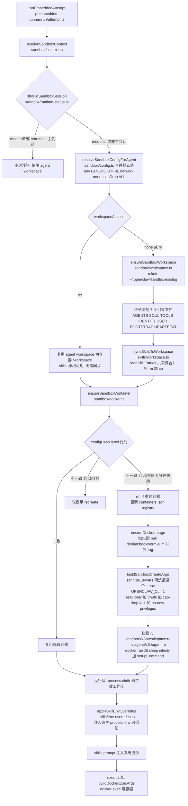
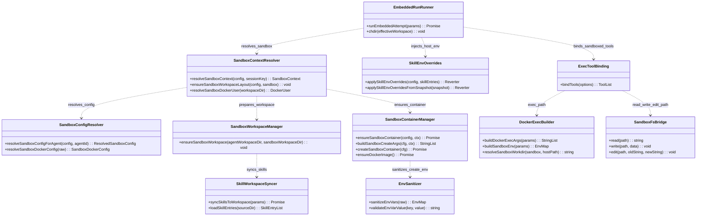

# Skill 沙箱执行环境准备分析

> 分析目标：OpenClaw 为了将 skill 在沙箱（Docker 容器）中成功执行，做了哪些环境准备（环境变量、文件目录、挂载等），梳理实现流程、流程图与流程对应的类和代码。
> 代码位置均为仓库根相对路径。

## 一、总览

OpenClaw 的"沙箱"本质是一个 **Docker 容器**：默认镜像 `openclaw-sandbox:bookworm-slim`（见 `Dockerfile.sandbox`，基于 `debian:bookworm-slim`，预装 bash/curl/git/jq/python3/ripgrep，专用用户 `sandbox`，`CMD ["sleep","infinity"]` 让容器常驻，所有命令通过 `docker exec` 进入）。

环境准备分两层：

| 层面 | 时机 | 核心内容 |
|---|---|---|
| **会话级准备** | 每个 session 首次运行 | 判定是否进沙箱 → 解析配置 → 准备宿主侧沙箱工作区 + 同步 skills → 创建/复用容器（镜像、env、挂载、安全参数） |
| **运行级准备** | 每次 agent run / 每次命令执行 | chdir 生效工作区 → skill 环境变量注入（宿主 process.env）→ skills prompt → exec 经 `docker exec` 进容器（构造容器内 PATH/HOME/env） |

## 二、实现流程与对应类/代码

### 阶段 1：判定与配置解析

1. **入口**：`src/agents/pi-embedded-runner/run/attempt.ts:1723` `runEmbeddedAttempt` → `src/agents/sandbox/context.ts:108` `resolveSandboxContext`
2. **是否进沙箱**：`src/agents/sandbox/runtime-status.ts:10` `shouldSandboxSession`：`mode=off` → false；`all` → true；`non-main` → 仅非主会话进沙箱
3. **配置合并**：`src/agents/sandbox/config.ts:170` `resolveSandboxConfigForAgent`（全局 + agent 级 + toolPolicy）；底层默认值在 `resolveSandboxDockerConfig`（76-120 行）：
   - `env = { LANG: "C.UTF-8" }`（默认仅保留语言环境）
   - `readOnlyRoot=true`、`tmpfs=["/tmp","/var/tmp","/run"]`、`network="none"`、`capDrop=["ALL"]`、`workdir="/workspace"`、`containerPrefix="openclaw-sbx-"`
4. **scope → 命名**：`src/agents/sandbox/shared.ts` `resolveSandboxScopeKey`（`shared` / `agent:<id>` / 原始 sessionKey）+ `slugifySessionKey`（sha256 前 8 位后缀）→ 容器名 `openclaw-sbx-<slug>`、宿主工作区 `~/.openclaw/sandboxes/<slug>/`（常量见 `src/agents/sandbox/constants.ts`）

### 阶段 2：宿主侧工作区与 Skills 准备

5. **工作区分流**：`src/agents/sandbox/context.ts:20` `ensureSandboxWorkspaceLayout`：
   - `workspaceAccess=rw` → 直接用 agent workspace 作容器 /workspace，**skills 原地可用，无需同步**
   - `none`/`ro` → 走独立的沙箱工作区并同步 skills
6. **建沙箱工作区**：`src/agents/sandbox/workspace.ts:17` `ensureSandboxWorkspace`：mkdir 递归 + 从 agent workspace **种子复制 7 个引导文件**（AGENTS.md/SOUL.md/TOOLS.md/IDENTITY.md/USER.md/BOOTSTRAP.md/HEARTBEAT.md，`wx` flag 防覆盖）+ 写工作区模板
7. **同步 Skills**：`src/agents/skills/workspace.ts:790` `syncSkillsToWorkspace`：
   - `serializeByKey` 加锁串行 → `loadSkillEntries`（325-579 行）按优先级合并 **6 个来源**：extra < bundled（内置，见 `src/agents/skills/bundled-dir.ts`）< managed(`~/.openclaw/skills`) < `~/.agents/skills` < `<workspace>/.agents/skills` < `<workspace>/skills`
   - rm + 重建目标 `skills/` 目录 → 逐 skill `fsp.cp(recursive)`（`resolveSandboxPath` 防路径穿越、目录名去重）

### 阶段 3：容器创建（核心环境变量与挂载在这里注入）

8. **容器生命周期**：`src/agents/sandbox/docker.ts:492` `ensureSandboxContainer`：
   - 用 `src/agents/sandbox/config-hash.ts` `computeSandboxConfigHash`（SHA256 of `{docker, workspaceAccess, workspaceDir, agentWorkspaceDir}`）与容器 label `openclaw.configHash` 比对
   - 不一致 → **冷容器**（5 分钟未用）`rm -f` 重建；**热容器**仅提示 recreate；一致 → 复用
   - 更新 registry `~/.openclaw/sandbox/containers.json`
9. **镜像保障**：`docker.ts:258` `ensureDockerImage`：默认镜像缺失时 `pull debian:bookworm-slim` 并 tag 为 `openclaw-sandbox:bookworm-slim`
10. **创建参数**：`docker.ts:317` `buildSandboxCreateArgs`：
    - `validateSandboxSecurity` 安全校验；labels（`openclaw.sandbox=1`/`sessionKey`/`createdAtMs`/`configHash`）
    - `--read-only` + tmpfs 三目录（可写补偿）；`--network none`；`--user <uid:gid>`（`context.ts:67` `resolveSandboxDockerUser` stat 宿主工作区取 uid/gid，对齐挂载权限）
    - **env 清洗注入**：`src/agents/sandbox/sanitize-env-vars.ts` `sanitizeEnvVars`——BLOCKED 正则（`*_API_KEY`/`BOT_TOKEN`/`GH_TOKEN`/`AWS_*` 及兜底 `/_?(API_KEY|TOKEN|PASSWORD|PRIVATE_KEY|SECRET)$/i`）+ ALLOWED 白名单（`LANG/LC_*/PATH/HOME/USER/SHELL/TERM/TZ/NODE_ENV`）+ 值校验（null 字节 / >32768 / 疑似 base64 凭据）→ 逐个 `--env`
    - `src/infra/openclaw-exec-env.ts` `markOpenClawExecEnv` → `--env OPENCLAW_CLI=1`
    - `--cap-drop ALL`、`no-new-privileges`、seccomp/apparmor、pids/memory/cpus/ulimits、dns/extraHosts
11. **挂载与启动**：`docker.ts:438` `createSandboxContainer` + `src/agents/sandbox/workspace-mounts.ts`：
    - `-v <sandboxWorkspaceDir>:/workspace`（`ro` 时加 `:ro`；`rw` 时直接挂 agent workspace）
    - `workspaceAccess≠none` 且非 rw 时追加 `-v <agentWorkspaceDir>:/agent:ro`（`SANDBOX_AGENT_WORKSPACE_MOUNT="/agent"`）
    - 自定义 binds、`--workdir /workspace`、`sleep infinity`；setupCommand 经 `docker exec -i /bin/sh -lc`
12. **文件系统桥**：`src/agents/sandbox/fs-bridge.ts` `SandboxFsBridge`：为 read/write/edit 工具提供宿主↔容器文件操作（路径锚定 pinned fd、挂载点校验、docker exec + python 变更计划）

### 阶段 4：每次 run 的 Skill 环境注入

13. `attempt.ts:1690-1830` `runEmbeddedAttempt`：
    - `effectiveWorkspace = sandbox.enabled ? (rw ? agent workspace : sandbox.workspaceDir) : agent workspace`，然后 `process.chdir(effectiveWorkspace)`
    - `src/agents/pi-embedded-runner/skills-runtime.ts` `resolveEmbeddedRunSkillEntries` 决定现载 entries 或 snapshot
    - **skill 环境变量注入**：`src/agents/skills/env-overrides.ts:213` `applySkillEnvOverrides` / 236 行 `applySkillEnvOverridesFromSnapshot`：把 config `skills.entries.<key>.env` 与 `apiKey`（→primaryEnv）注入**宿主 process.env**；恒拦 `/^OPENSSL_CONF$/i` 与危险 key；`primaryEnv`/`requires.env` 组成白名单放行敏感 key；引用计数 + reverter 运行后恢复现场
    - `resolveSkillsPromptForRun` / `resolveBootstrapContextForRun`：skills prompt 与 BOOTSTRAP.md 注入系统提示
14. **工具绑定**：`src/agents/pi-tools.ts:531`：exec 工具带 `sandbox={containerName, workspaceDir, containerWorkdir, env: sandbox.docker.env}`；read/write/edit 换成沙箱版（root + fsBridge）

### 阶段 5：exec 命令进容器

15. `src/agents/bash-tools.exec.ts:480` host=sandbox 分支：`src/agents/bash-tools.shared.ts:89` `resolveSandboxWorkdir` host→container 路径映射 + `assertSandboxPath` 校验
16. **容器内 env 构造**：`bash-tools.shared.ts:17` `buildSandboxEnv`：`{PATH: defaultPath, HOME: containerWorkdir}` ← `sandbox.docker.env` ← 调用方 `params.env` 依次覆盖
17. **PATH 特殊通道**：`bash-tools.shared.ts:49` `buildDockerExecArgs`：PATH **不走 `-e PATH`**（防宿主 PATH 污染容器），改为 `-e OPENCLAW_PREPEND_PATH=<PATH>` + 登录 shell 内 `export PATH="${OPENCLAW_PREPEND_PATH}:$PATH"; unset OPENCLAW_PREPEND_PATH;`，最终：

```typescript
args.push(params.containerName, "/bin/sh", "-lc", `${pathExport}${params.command}`);
```

18. **进程拉起**：`src/agents/bash-tools.exec-runtime.ts:564` `spawnSpec`：sandbox 时 spawn `docker` 子进程（env=process.env）；`DEFAULT_PATH` 兜底 `/usr/local/sbin:/usr/local/bin:/usr/sbin:/usr/bin:/sbin:/bin`（134 行）

## 三、流程图

### 3.1 环境准备主流程（flowchart）



### 3.2 exec 命令进容器（sequenceDiagram）

```mermaid
sequenceDiagram
    participant Loop as Agent 运行循环
    participant Exec as exec 工具 bash-tools.exec.ts
    participant Shared as bash-tools.shared.ts
    participant Docker as docker CLI 容器内 sh

    Loop->>Exec: exec(command, cwd, env)
    Exec->>Exec: resolveSandboxWorkdir 宿主路径映射到容器路径
    Exec->>Shared: buildSandboxEnv(defaultPath, paramsEnv, sandboxEnv)
    Shared-->>Exec: HOME=容器workdir, PATH=defaultPath, 叠加 docker.env 与 params.env
    Exec->>Shared: buildDockerExecArgs
    Note over Shared: PATH 不走 -e PATH, 改传 OPENCLAW_PREPEND_PATH
    Exec->>Docker: docker exec -i -w workdir -e HOME=... -e OPENCLAW_PREPEND_PATH=... 容器名 /bin/sh -lc export PATH=PREPEND_PATH:$PATH 后执行 command
    Docker-->>Exec: stdout, stderr, exitCode
    Exec-->>Loop: 执行结果
```

### 3.3 核心类协作（classDiagram）



## 四、环境变量清单

| 环境变量 | 注入通道 | 值 / 来源 | 代码位置 |
|---|---|---|---|
| `LANG` | 容器创建 `--env` | 默认 `"C.UTF-8"` | src/agents/sandbox/config.ts:76 |
| 用户自定义 docker env | 容器创建 `--env`（BLOCKED 正则拦截 + ALLOWED 白名单 + 值校验） | `sandbox.docker.env` | src/agents/sandbox/docker.ts:317、sanitize-env-vars.ts |
| `OPENCLAW_CLI` | 容器创建 `--env` | `"1"` | src/infra/openclaw-exec-env.ts |
| `HOME` | 每次 `docker exec -e` | 容器 workdir（默认 `/workspace`） | src/agents/bash-tools.shared.ts:17 |
| `OPENCLAW_PREPEND_PATH` | `docker exec -e`（PATH 特殊通道，shell 内 export 后 unset） | exec 解析的容器内 PATH | src/agents/bash-tools.shared.ts:49 |
| 容器内其余变量 | `docker exec -e` | `sandbox.docker.env` ← 调用方 `params.env` 依次覆盖 | src/agents/bash-tools.shared.ts:17 |
| skill env overrides（`skills.entries.<key>.env`、`apiKey`→primaryEnv） | **宿主 process.env**（运行级注入、引用计数可回滚） | config skill 配置；白名单放行敏感 key，`OPENSSL_CONF` 恒拦 | src/agents/skills/env-overrides.ts:213 |
| `OPENCLAW_STATE_DIR` | 宿主进程 | 自定义状态根目录（默认 `~/.openclaw`） | src/config/paths.ts |
| `OPENCLAW_PROFILE` | 宿主进程 | 派生 `workspace-<profile>` 工作区 | src/agents/workspace.ts |
| `OPENCLAW_BUNDLED_SKILLS_DIR` | 宿主进程 | 覆盖内置 skills 目录 | src/agents/skills/bundled-dir.ts |

> 关键发现：**env 双通道**。skill 的敏感变量（apiKey 等）不会进容器创建参数；`applySkillEnvOverrides` 注入的是宿主 process.env（服务宿主侧工具/插件），而容器内命令的 env 来自 `sandbox.docker.env + params.env` 通道，两条通道互不污染。

## 五、文件目录清单

**宿主侧**（STATE_DIR=`~/.openclaw`，可 `OPENCLAW_STATE_DIR` 覆盖）：

| 目录 / 文件 | 作用 | 代码位置 |
|---|---|---|
| `~/.openclaw/workspace`（或 `workspace-<profile>`） | agent 主工作区；引导文件模板源 + skills 来源之一 | src/agents/workspace.ts、src/config/paths.ts |
| `~/.openclaw/sandboxes/<slug>/` | 沙箱工作区（scope 派生 slug），容器 /workspace 的宿主源 | src/agents/sandbox/constants.ts、workspace.ts |
| `~/.openclaw/sandboxes/<slug>/skills/` | skills 同步目标（6 来源合并后的副本） | src/agents/skills/workspace.ts:790 |
| `~/.openclaw/sandbox/containers.json` | 容器 registry（名称、sessionKey、configHash） | src/agents/sandbox/constants.ts、docker.ts |
| `~/.openclaw/skills/` | managed skills 来源 | src/agents/skills/workspace.ts |
| `~/.agents/skills`、`<workspace>/.agents/skills`、`<workspace>/skills`、内置 `skills/`、extra dirs | 其余 skill 来源，按优先级合并 | src/agents/skills/workspace.ts:325 |
| `~/.openclaw/tools/<hashedKey>/` | skill 附带工具目录 | src/agents/skills/tools-dir.ts |

**容器侧**：

| 路径 | 作用 | 来源 |
|---|---|---|
| `/workspace` | workdir；挂载沙箱工作区（ro 只读）或 rw 时直接挂 agent workspace；exec 的 `HOME` | workspace-mounts.ts、bash-tools.shared.ts |
| `/agent` | `workspaceAccess≠none` 且非 rw 时只读挂 agent workspace | workspace-mounts.ts、constants.ts |
| `/tmp`、`/var/tmp`、`/run` | tmpfs（根文件系统 read-only 的可写补偿） | config.ts:76 |
| `/home/sandbox` | 镜像默认用户主目录 | Dockerfile.sandbox |

## 六、关键设计点小结

1. **configHash 冷热容器**：docker 配置变化时冷容器自动重建、热容器仅提示 recreate，避免误杀正在使用的容器。
2. **workspaceAccess=rw 特殊化**：直接挂 agent workspace，跳过 skills 同步成本，代价是容器内可写宿主工作区；`none`/`ro` 则走独立工作区 + 全量 skills 复制。
3. **PATH 特殊通道**：宿主 PATH 不直接传容器，经 `OPENCLAW_PREPEND_PATH` + 登录 shell export，防止污染。
4. **双向 env 清洗**：创建时 sanitize 白名单（挡住 API_KEY/TOKEN 等敏感值进容器）；运行时 skill overrides 有独立白名单（`primaryEnv`/`requires.env` 显式声明的才放行）+ 回滚机制。
