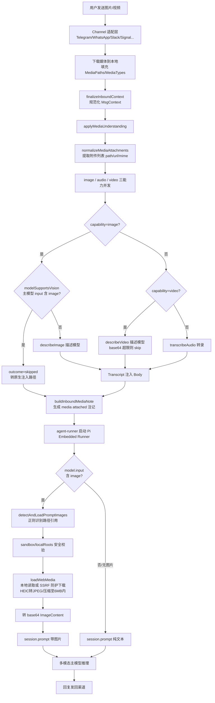
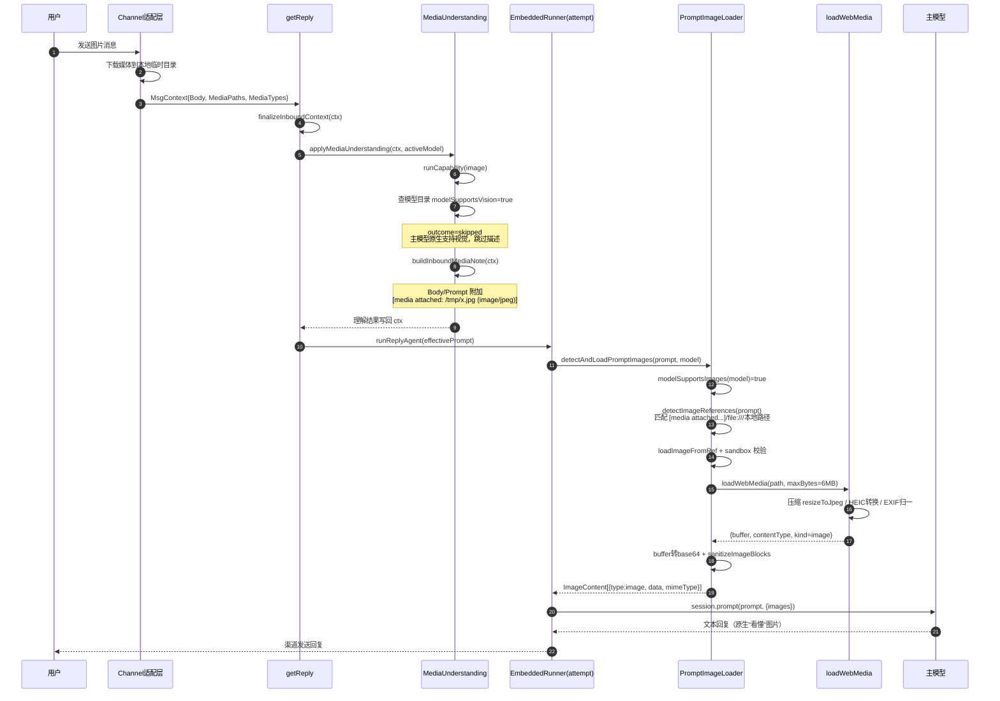
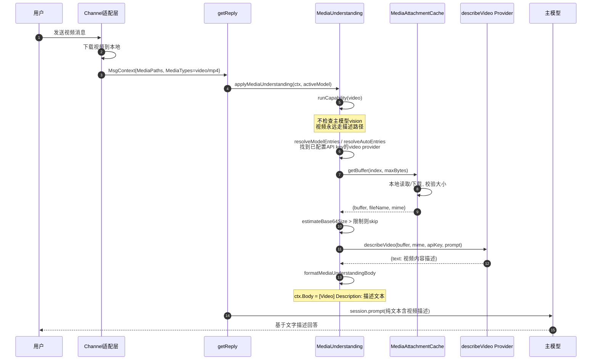
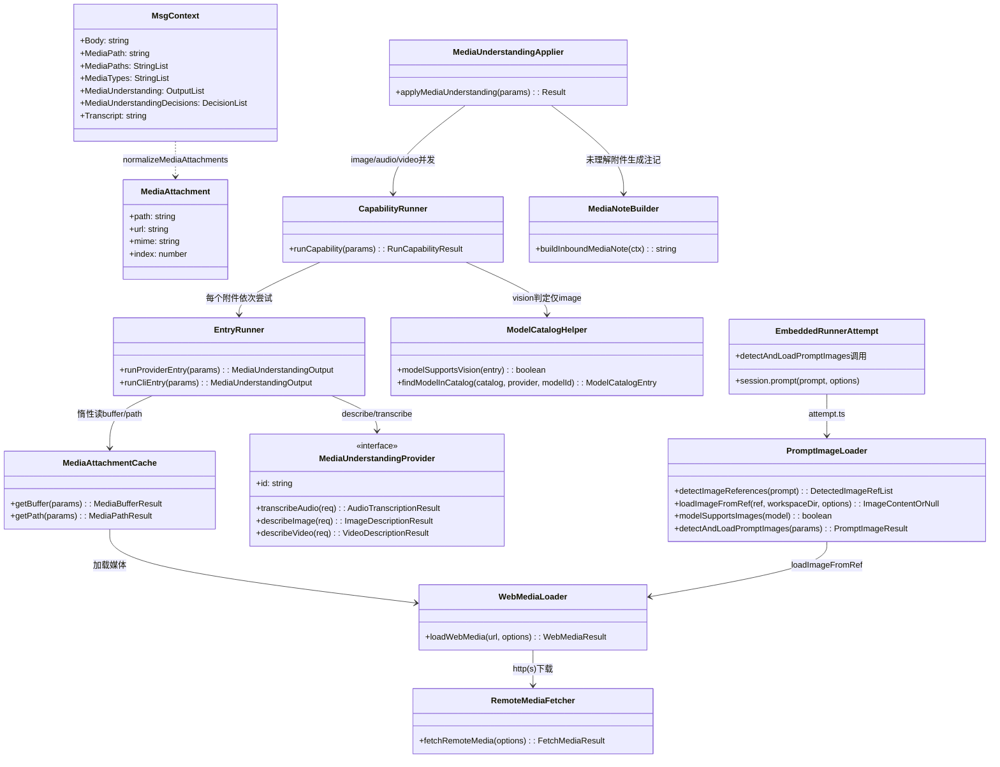

# OpenClaw 图片/视频多模态处理流程分析

> 分析目标：用户给 OpenClaw 一个图片或视频地址，且配置的模型支持多模态时，OpenClaw 的完整处理流程。
> 涉及源码版本：本仓库 `d:\prj\openclaw_analyze`（上游 https://github.com/openclaw/openclaw）。

---

## 一、核心结论

OpenClaw 对入站媒体有**两条并行路径**，在 `runCapability` 处分流（`src/media-understanding/runner.ts:707-741`）：

| 媒体     | 主模型支持 vision？            | 处理方式                                                                                              |
| -------- | ------------------------------ | ----------------------------------------------------------------------------------------------------- |
| **图片** | 是（`model.input` 含 `image`） | media-understanding 的图片描述被**跳过**，图片经压缩后作为 `ImageContent`（base64）**原生注入主模型** |
| **图片** | 否                             | 用独立"描述模型"（`describeImage`）生成文字描述，注入 prompt                                          |
| **视频** | 无论是否                       | 主模型**永远不直接收视频**；走 `describeVideo` 描述 provider（如 Moonshot/Gemini）转成文本            |
| **音频** | —                              | 走 `transcribeAudio` 转录成文本                                                                       |

---

## 二、全景流程图

---

## 三、序列图

### 3.1 图片 + vision 主模型（原生注入路径）

### 3.2 视频（描述 provider 路径）

---

## 四、类图

---

## 五、关键类与代码对照

### 1. 渠道入站：媒体下载 → MsgContext

| 环节                                                           | 代码                                                                                                                        |
| -------------------------------------------------------------- | --------------------------------------------------------------------------------------------------------------------------- |
| 各渠道下载媒体并填充 `MediaPaths/MediaTypes`                   | `extensions/telegram/src/bot-message-context.body.ts:188`、`extensions/slack/src/monitor/message-handler/prepare.ts:720` 等 |
| 统一 payload 构建器                                            | `buildMediaPayload` — `src/channels/plugins/media-payload.ts:15-33`                                                         |
| MsgContext 规范化（MediaType 兜底 `application/octet-stream`） | `finalizeInboundContext` — `src/auto-reply/reply/inbound-context.ts:37-128`                                                 |

### 2. 理解子系统：`src/media-understanding/`

| 环节                                                     | 代码                                                                                                             |
| -------------------------------------------------------- | ---------------------------------------------------------------------------------------------------------------- |
| **总入口**（get-reply 中调用）                           | `src/auto-reply/reply/get-reply.ts:129` → `applyMediaUnderstanding` — `src/media-understanding/apply.ts:466-549` |
| 三能力并发执行 + **vision 跳过判定（核心分流点）**       | `runCapability` — `src/media-understanding/runner.ts:659-768`，跳过逻辑在 `runner.ts:707-741`                    |
| provider/CLI 调用、视频 base64 上限校验                  | `runner.entries.ts:539-586`                                                                                      |
| provider 接口定义                                        | `MediaUnderstandingProvider` — `src/media-understanding/types.ts:109-115`                                        |
| 视频描述 provider 示例（Moonshot `video_url` base64）    | `src/media-understanding/providers/moonshot/video.ts`                                                            |
| 描述文本格式化进 Body（`[Video] Description:`）          | `formatMediaUnderstandingBody` — `src/media-understanding/format.ts:32-91`                                       |
| 自动选择有 key 的 provider（`AUTO_VIDEO_KEY_PROVIDERS`） | `resolveKeyEntry` — `src/media-understanding/runner.ts:340-422`                                                  |

### 3. 原生图片注入：`src/agents/pi-embedded-runner/run/`

| 环节                                                                               | 代码                                                                                                                                         |
| ---------------------------------------------------------------------------------- | -------------------------------------------------------------------------------------------------------------------------------------------- |
| **调用点**：prompt 前检测图片                                                      | `attempt.ts:2914`                                                                                                                            |
| **传给模型**：`session.prompt(prompt, {images})`                                   | `attempt.ts:2988-2994`                                                                                                                       |
| 模型能力检查 `model.input.includes("image")`                                       | `modelSupportsImages` — `src/agents/pi-embedded-runner/run/images.ts:271-273`；`modelSupportsVision` — `src/agents/model-catalog.ts:286-288` |
| 正则识别路径引用（`[media attached:...]`/`file://`/本地路径；**http URL 被忽略**） | `detectImageReferences` — `images.ts:94-184`                                                                                                 |
| 单图加载（sandbox 校验 → loadWebMedia → base64）                                   | `loadImageFromRef` — `images.ts:194-263`                                                                                                     |
| 主流程编排 + 尺寸消毒                                                              | `detectAndLoadPromptImages` — `images.ts:285-360`                                                                                            |

### 4. 媒体加载与安全

| 环节                                                         | 代码                                                                                             |
| ------------------------------------------------------------ | ------------------------------------------------------------------------------------------------ |
| **统一媒体加载器**（本地读 + URL 下载 + 图片压缩）           | `loadWebMedia` — `extensions/whatsapp/src/media.ts:404-413`，核心 `loadWebMediaInternal:233-402` |
| 远程下载（SSRF 防护 `fetchWithSsrFGuard`、maxBytes、重定向） | `fetchRemoteMedia` — `src/media/fetch.ts:93-251`                                                 |
| 图片压缩网格（2048~800px × 质量 80~40）+ HEIC→JPEG           | `optimizeImageToJpeg` — `extensions/whatsapp/src/media.ts:426-491`                               |
| 本地路径白名单（`localRoots`，防符号链接逃逸）               | `assertLocalMediaAllowed` — `extensions/whatsapp/src/media.ts:81-138`                            |
| sandbox 路径校验                                             | `resolveSandboxedMediaSource` — `src/agents/sandbox-paths.ts:88`                                 |
| **大小上限**：图片 6MB / 音频 16MB / 视频 16MB / 文档 100MB  | `src/media/constants.ts:1-4`                                                                     |

### 5. 注记生成

未理解的附件由 `buildInboundMediaNote`（`src/auto-reply/media-note.ts:49-154`）生成 `[media attached: /tmp/a.png (image/png) | url]` 行注入 prompt——这正是第 3 节正则识别的输入来源，形成闭环：agent 据此可以用 `read` 工具访问文件，或被原生注入为图片。

---

## 六、值得注意的设计细节

1. **决策点在 `runCapability` 而非渠道**：分流逻辑统一收敛在 media-understanding 层，渠道只负责下载和填充 `MediaPaths`，与模型能力解耦。
2. **图片 URL 不走原生注入**：`detectImageReferences`（`images.ts:151`）明确注释 _"Remote HTTP(S) URLs are intentionally ignored. Native image injection is local-only."_——远程图片依赖渠道先下载落地，或由 media-understanding 的 provider 直接下载。
3. **视频只有"描述"一条路**：即使主模型是 Gemini 这类视频多模态模型，主对话通道也不传视频二进制（`ImageContent` 仅支持 image），视频经 `describeVideo` 转成 `[Video] Description:` 文本。
4. **图片只在 prompt 局部生效**（`attempt.ts:2912-2913` 注释 _"Images are prompt-local only (pi-like behavior)"_），历史消息中的已处理图片块会被 `pruneProcessedHistoryImages`（`attempt.ts:2907`）清理以省 token。
5. **幂等降级链**：provider 失败 → 尝试下一个 entry → 全部失败则 attachments 保持原样，由 media-note 注记兜底，agent 仍可通过文件工具访问原始媒体。
6. **安全边界**：本地读取受 `localRoots` 白名单约束；远程下载经过 SSRF 防护（私网地址/非 http 协议拒绝）、重定向次数限制与 maxBytes 硬上限；sandbox 模式下还要过 `resolveSandboxedMediaSource` 校验。
