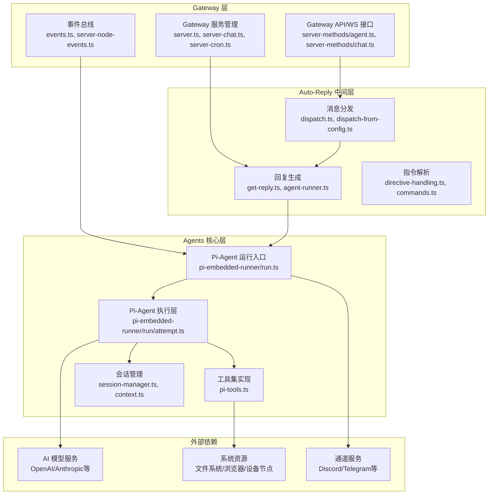

# Gateway 与 Pi-Agent 集成架构分析

## 一、集成架构总览

Gateway 与 Pi-Agent 采用**分层解耦**的集成架构，通过中间层实现职责分离：



### 集成设计特点
1. **分层解耦**：Gateway 层不直接依赖 Pi-Agent 实现，通过 Auto-Reply 中间层隔离
2. **接口统一**：所有 Pi-Agent 调用都通过标准的 API 接口暴露，支持多端调用
3. **事件驱动**：通过事件总线实现模块间解耦通信
4. **可扩展**：通过中间层可以方便地添加代理策略和预处理逻辑

## 二、核心集成代码列表

### 2.1 Gateway 层代码
| 文件路径 | 功能描述 |
|---------|---------|
| `src/gateway/server-methods/agent.ts` | 提供 `agent` 系列 API 接口，是外部调用 Pi-Agent 的主入口 |
| `src/gateway/server-methods/chat.ts` | 提供聊天相关 API，处理来自通道和 Web 的消息 |
| `src/gateway/server-chat.ts` | Gateway 聊天服务核心，管理聊天会话和代理运行状态 |
| `src/gateway/server-cron.ts` | 定时任务服务，支持定时触发代理运行 |
| `src/gateway/server-plugins.ts` | 插件系统，支持扩展代理功能 |
| `src/gateway/server-node-events.ts` | 节点事件处理，处理来自设备节点的代理相关事件 |
| `src/gateway/events.ts` | 事件总线定义，代理运行事件的发布和订阅 |
| `src/gateway/boot.ts` | Gateway 启动时的代理相关初始化逻辑 |

### 2.2 中间层代码
| 文件路径 | 功能描述 |
|---------|---------|
| `src/auto-reply/reply/get-reply.ts` | 回复生成主入口，Gateway 调用 Pi-Agent 的桥梁 |
| `src/auto-reply/reply/agent-runner.ts` | 代理运行协调器，管理代理执行流程 |
| `src/auto-reply/dispatch.ts` | 消息分发器，将 Gateway 收到的消息路由到正确的代理 |
| `src/auto-reply/reply/dispatch-from-config.ts` | 配置驱动的消息路由，支持多代理调度 |
| `src/auto-reply/reply/directive-handling.ts` | 指令解析，处理消息中的特殊指令（think, verbose等） |

### 2.3 Agents 层代码
| 文件路径 | 功能描述 |
|---------|---------|
| `src/agents/pi-embedded-runner.ts` | Pi-Agent 导出入口，提供运行代理的核心函数 |
| `src/agents/pi-embedded-runner/run.ts` | Pi-Agent 运行主逻辑，处理认证、重试、错误转移 |
| `src/agents/pi-embedded-runner/run/attempt.ts` | Pi-Agent 单次执行逻辑，构建会话和系统提示 |
| `src/agents/pi-tools.ts` | OpenClaw 工具集实现，供 Pi-Agent 调用 |
| `src/agents/context.ts` | 会话上下文管理 |
| `src/agents/session.ts` | 会话持久化和状态管理 |

## 三、主要场景分析

### 3.1 初始化场景

#### 流程说明
```
1. Gateway 启动
   ↓
2. 加载配置文件，初始化代理相关配置
   ↓
3. 初始化服务
   ├─ 初始化聊天服务 (server-chat.ts)
   ├─ 初始化定时任务服务 (server-cron.ts)
   ├─ 初始化插件系统 (server-plugins.ts)
   └─ 初始化事件总线 (events.ts)
   ↓
4. 预加载 AI 模型目录和认证信息
   ↓
5. 注册 API 接口，对外暴露 agent/chat 等方法
   ↓
6. 启动完成，等待客户端请求
```

#### 关键代码
```typescript
// src/gateway/server.impl.ts 启动初始化
export async function startGatewayServer(opts: GatewayServerOptions) {
  // 加载配置
  const config = opts.config ?? loadConfig();
  
  // 初始化运行时状态
  const runtimeState = createGatewayRuntimeState(config);
  
  // 注册 agent/chat 等 API 处理函数
  const handlers = {
    ...coreGatewayHandlers,
    agent: agentHandler,
    chat: chatHandler,
    // ... 其他方法
  };
  
  // 启动 HTTP 和 WebSocket 服务
  const httpServer = await startHttpServer(config, handlers, runtimeState);
  
  return { httpServer, runtimeState };
}
```

#### 初始化要点
- Gateway 启动时不会预启动 Pi-Agent 实例，采用按需创建的懒加载模式
- 模型目录和认证信息会提前预加载，减少首次调用延迟
- 代理运行相关的队列、状态跟踪器会在启动时初始化

---

### 3.2 消息发送流程

#### 流程说明
```
1. 客户端调用 Gateway 的 `agent` 或 `chat.send` API
   ↓
2. Gateway 层处理
   ├─ 认证和权限校验
   ├─ 参数验证和标准化
   ├─ 会话识别或创建
   └─ 消息加入处理队列
   ↓
3. Auto-Reply 层处理
   ├─ 消息预处理（去重、格式转换、媒体处理）
   ├─ 指令解析（提取 think/verbose/elevated 等指令）
   ├─ 上下文准备（加载会话历史、系统提示）
   └─ 调用 `runEmbeddedPiAgent` 执行代理
   ↓
4. Agents 层处理
   ├─ 模型和认证信息解析
   ├─ 系统提示构建（工具、技能、环境信息）
   ├─ 工具集初始化
   ├─ 调用 Pi-Agent SDK 执行推理
   ├─ 处理工具调用（如果有）
   └─ 生成回复内容
   ↓
5. 响应返回
   ├─ 回复内容格式化
   ├─ 会话历史持久化
   ├─ 发送事件通知
   └─ 返回结果给客户端
```

#### 关键代码
```typescript
// src/gateway/server-methods/agent.ts API 入口
export const agentHandler: GatewayRequestHandler<"agent"> = async (params, context) => {
  // 参数验证
  const validation = validateAgentParams(params);
  if (!validation.success) {
    return errorShape(ErrorCodes.InvalidParams, formatValidationErrors(validation.error));
  }
  
  // 生成运行ID
  const runId = params.runId ?? randomUUID();
  
  // 调用 agentCommandFromIngress 执行代理
  const result = await agentCommandFromIngress({
    message: params.message,
    sessionKey: params.sessionKey,
    // ... 其他参数
  });
  
  return result;
};

// src/commands/agent.ts 代理命令执行
export async function agentCommandFromIngress(opts: AgentCommandOpts) {
  // 解析指令和参数
  const directives = extractDirectives(opts.message);
  
  // 调用 getReplyFromConfig 生成回复
  const reply = await getReplyFromConfig(ctx, {
    thinkLevel: directives.think,
    verboseLevel: directives.verbose,
    // ... 其他选项
  });
  
  return reply;
}
```

#### 流程要点
- 所有消息都经过统一的验证和预处理流程
- 支持异步执行和状态查询，避免长时间阻塞
- 会话历史会自动持久化，支持上下文连续性
- 支持多轮工具调用，代理可以自动调用工具完成复杂任务

---

### 3.3 工具执行过程

#### 流程说明
```
1. Pi-Agent 在推理过程中决定需要调用工具
   ↓
2. 生成工具调用请求（工具名、参数、调用ID）
   ↓
3. Gateway 工具框架处理
   ├─ 工具名称解析和权限校验
   ├─ 参数验证和标准化
   ├─ 安全策略检查（沙箱、权限、资源限制）
   ↓
4. 工具执行
   ├─ 执行对应工具逻辑（文件操作、系统命令、浏览器控制等）
   ├─ 处理工具执行过程中的输入输出
   ├─ 监控执行状态和超时处理
   ↓
5. 结果返回
   ├─ 工具执行结果格式化
   ├─ 结果回传给 Pi-Agent
   ├─ Pi-Agent 根据工具结果继续推理
   ↓
6. 循环直到代理生成最终回复
```

#### 关键代码
```typescript
// src/agents/pi-tools.ts 工具定义
export function createOpenClawCodingTools(opts: OpenClawCodingToolsOpts) {
  return [
    {
      name: "bash",
      description: "执行 shell 命令",
      parameters: z.object({
        command: z.string().describe("要执行的命令"),
      }),
      execute: async (params) => {
        // 权限校验
        if (!opts.sandbox.allowBash) {
          throw new Error("Bash 执行权限被禁用");
        }
        
        // 执行命令
        const result = await execHostCommand(params.command, {
          cwd: opts.workspaceDir,
          timeout: opts.exec.timeout,
        });
        
        return result;
      },
    },
    // ... 其他工具定义
  ];
}

// src/agents/pi-embedded-runner/run/attempt.ts 工具调用处理
export async function runEmbeddedAttempt(params: EmbeddedRunAttemptParams) {
  // 创建工具集
  const tools = createOpenClawCodingTools({
    agentId: params.agentId,
    sandbox: params.sandbox,
    // ... 其他参数
  });
  
  // 执行代理，自动处理工具调用
  const stream = streamSimple(params.model, context, {
    tools,
    onToolCall: async (call) => {
      // 工具调用钩子，可添加审计和监控
      log.debug(`工具调用: ${call.name}`, call.parameters);
    },
  });
  
  // 处理流结果
  for await (const event of stream) {
    // 处理部分响应和事件
  }
  
  return stream.result();
}
```

#### 工具执行要点
- 所有工具调用都经过统一的权限校验和安全检查
- 工具执行在沙箱环境中，限制资源访问
- 支持异步工具调用和长时间运行任务
- 工具调用过程会被审计和记录，便于问题排查
- 工具执行结果会自动格式化，适配不同 AI 模型的要求

## 四、集成优势与优化点

### 4.1 集成优势
1. **高内聚低耦合**：Gateway 和 Pi-Agent 职责清晰，通过标准接口交互
2. **弹性扩展**：可以独立扩展 Gateway 的接入能力和 Pi-Agent 的推理能力
3. **安全可靠**：多层安全检查，防止未授权访问和恶意工具调用
4. **可观测性**：全流程埋点，支持监控和故障排查
5. **多租户支持**：通过会话隔离，支持多代理并行运行

### 4.2 潜在优化点
1. **性能优化**：增加代理实例池，减少频繁创建销毁的开销
2. **资源隔离**：实现代理运行的资源限制，防止单个代理占用过多资源
3. **缓存优化**：增加模型输出缓存，提高重复问题的响应速度
4. **可扩展性**：提供更灵活的工具注册机制，支持动态加载工具
5. **调试能力**：增加代理运行的调试和跟踪能力，便于开发和问题排查

这种集成架构既保证了 Gateway 作为控制平面的稳定性，又充分利用了 Pi-Agent 的推理能力，为 OpenClaw 提供了强大而灵活的 AI 助手功能。
