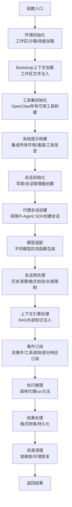

# runEmbeddedAttempt 核心执行函数代码注释分析

## 函数定位

`runEmbeddedAttempt` 是 **OpenClaw 与 Pi-Agent SDK 交互的最底层核心函数**，负责单次 Pi-Agent 运行的完整逻辑。上层 `run.ts` 负责重试、故障转移、认证管理等容错逻辑，本函数专注于单次执行的完整流程。

## 函数整体流程



## 核心模块注释详解

### 1. 环境初始化模块

```typescript
// 解析工作区路径，处理用户路径展开
const resolvedWorkspace = resolveUserPath(params.workspaceDir);
// 保存当前工作目录，运行结束后恢复
const prevCwd = process.cwd();
// 单次运行的 AbortController，用于取消整个运行
const runAbortController = new AbortController();
// 确保全局 HTTP 请求超时配置生效
ensureGlobalUndiciStreamTimeouts();

// ------------------------------
// 沙箱环境初始化
// ------------------------------
// 会话唯一标识，用于沙箱隔离
const sandboxSessionKey = params.sessionKey?.trim() || params.sessionId;
// 解析沙箱上下文：根据配置决定是否启用沙箱，以及沙箱的权限
const sandbox = await resolveSandboxContext({
  config: params.config,
  sessionKey: sandboxSessionKey,
  workspaceDir: resolvedWorkspace,
});
// 确定实际生效的工作目录：沙箱启用时可能使用隔离的工作目录
const effectiveWorkspace = sandbox?.enabled
  ? sandbox.workspaceAccess === "rw"
    ? resolvedWorkspace // 沙箱启用但允许读写原工作区
    : sandbox.workspaceDir // 沙箱启用且使用隔离工作区
  : resolvedWorkspace; // 沙箱禁用，使用原工作区
```

**设计亮点**：沙箱机制实现了不同会话的安全隔离，防止跨会话访问和恶意操作。

### 2. 技能加载模块

```typescript
// 解析当前运行需要加载的技能列表
const { shouldLoadSkillEntries, skillEntries } = resolveEmbeddedRunSkillEntries({
  workspaceDir: effectiveWorkspace,
  config: params.config,
  skillsSnapshot: params.skillsSnapshot,
});
// 应用技能的环境变量覆盖，运行结束后需要恢复原环境
restoreSkillEnv = params.skillsSnapshot
  ? applySkillEnvOverridesFromSnapshot({
      snapshot: params.skillsSnapshot,
      config: params.config,
    })
  : applySkillEnvOverrides({
      skills: skillEntries ?? [],
      config: params.config,
    });

// 构建技能相关的系统提示片段，告诉代理有哪些技能可用
const skillsPrompt = resolveSkillsPromptForRun({
  skillsSnapshot: params.skillsSnapshot,
  entries: shouldLoadSkillEntries ? skillEntries : undefined,
  config: params.config,
  workspaceDir: effectiveWorkspace,
});
```

**设计亮点**：技能系统实现了功能的动态扩展，不需要修改核心代码就能添加新能力。

### 3. Bootstrap上下文加载模块

```typescript
// ------------------------------
// Bootstrap 上下文加载（工作区文件注入）
// ------------------------------
const sessionLabel = params.sessionKey ?? params.sessionId;
// 加载工作区的引导文件（BOOTSTRAP.md、.context/** 等），这些文件内容会自动注入到系统提示中
// 让代理了解当前工作区的上下文和规则
const { bootstrapFiles: hookAdjustedBootstrapFiles, contextFiles } =
  await resolveBootstrapContextForRun({
    workspaceDir: effectiveWorkspace,
    config: params.config,
    sessionKey: params.sessionKey,
    sessionId: params.sessionId,
    warn: makeBootstrapWarn({ sessionLabel, warn: (message) => log.warn(message) }),
    contextMode: params.bootstrapContextMode,
    runKind: params.bootstrapContextRunKind,
  });
// 计算 Bootstrap 文件的字符限制，防止注入的内容太多超过上下文窗口
const bootstrapMaxChars = resolveBootstrapMaxChars(params.config);
const bootstrapTotalMaxChars = resolveBootstrapTotalMaxChars(params.config);
// 分析 Bootstrap 预算使用情况，判断是否需要截断
const bootstrapAnalysis = analyzeBootstrapBudget({
  files: buildBootstrapInjectionStats({
    bootstrapFiles: hookAdjustedBootstrapFiles,
    injectedFiles: contextFiles,
  }),
  bootstrapMaxChars,
  bootstrapTotalMaxChars,
});
```

**设计亮点**：通过工作区配置文件实现了每个会话的自定义规则，非常灵活。

### 4. 工具集初始化模块

```typescript
// ------------------------------
// 工具集初始化
// ------------------------------
// 解析默认代理ID和会话代理ID，支持多代理路由
const { defaultAgentId, sessionAgentId } = resolveSessionAgentIds({
  sessionKey: params.sessionKey,
  config: params.config,
  agentId: params.agentId,
});
// 检查模型是否支持原生图片输入（多模态能力）
const modelHasVision = params.model.input?.includes("image") ?? false;

// 创建 OpenClaw 工具集：这是 Pi-Agent 能调用的所有工具的集合
// 包含 bash、文件读写、浏览器控制、节点操作、消息发送等几十种工具
const toolsRaw = params.disableTools
  ? [] // 如果禁用工具时返回空数组
  : createOpenClawCodingTools({
      agentId: sessionAgentId,
      exec: {
        ...params.execOverrides,
        elevated: params.bashElevated, // 是否允许执行高权限命令
      },
      sandbox, // 沙箱配置，限制工具权限
      messageProvider: params.messageChannel ?? params.messageProvider,
      // ... 其他上下文参数
    });
// 检查模型是否支持工具调用（有些模型原生不支持函数调用）
const toolsEnabled = supportsModelTools(params.model);
// 收集所有允许使用的工具名称，用于权限校验
const allowedToolNames = collectAllowedToolNames({
  tools,
  clientTools,
});
```

**设计亮点**：工具集是 OpenClaw 能力的核心，通过统一的接口规范，扩展工具非常方便。

### 5. 系统提示构建模块

```typescript
// ------------------------------
// 构建最终系统提示（给 AI 模型的初始指令）
// ------------------------------
// 这个函数整合所有上下文信息，生成完整的系统提示，告诉 AI：
// 1. 它是什么角色，有什么能力
// 2. 当前运行环境（系统、工作区、通道）
// 3. 可以使用哪些工具，如何使用
// 4. 有哪些安全限制和规则
// 5. 其他自定义指令（来自 BOOTSTRAP.md、配置等）
const appendPrompt = buildEmbeddedSystemPrompt({
  workspaceDir: effectiveWorkspace,
  defaultThinkLevel: params.thinkLevel,
  reasoningLevel: params.reasoningLevel ?? "off",
  extraSystemPrompt: params.extraSystemPrompt,
  skillsPrompt, // 技能相关提示
  docsPath: docsPath ?? undefined, // 文档路径
  ttsHint, // TTS 提示
  sandboxInfo, // 沙箱信息
  tools, // 可用工具列表
  userTimezone, // 用户时区
  userTime, // 用户当前时间
  // ... 其他参数
});
```

**设计亮点**：系统提示整合了所有维度的上下文信息，确保代理了解完整的运行环境。

### 6. 会话并发控制模块

```typescript
// ------------------------------
// 会话初始化与并发控制
// ------------------------------
// 获取会话写锁：防止多个请求同时修改同一个会话文件，导致数据损坏
const sessionLock = await acquireSessionWriteLock({
  sessionFile: params.sessionFile,
  maxHoldMs: resolveSessionLockMaxHoldFromTimeout({
    timeoutMs: params.timeoutMs,
  }),
});

// 如果会话文件损坏，自动尝试修复
await repairSessionFileIfNeeded({
  sessionFile: params.sessionFile,
  warn: (message) => log.warn(message),
});

// 从 Pi-Agent SDK 创建 SessionManager：负责会话历史的持久化和管理
// guardSessionManager 是 OpenClaw 的包装层，添加权限校验和安全控制
sessionManager = guardSessionManager(SessionManager.open(params.sessionFile), {
  agentId: sessionAgentId,
  sessionKey: params.sessionKey,
  inputProvenance: params.inputProvenance,
  allowSyntheticToolResults: transcriptPolicy.allowSyntheticToolResults,
  allowedToolNames, // 只允许使用白名单内的工具
});
```

**设计亮点**：会话写锁保证了并发场景下的数据一致性，避免文件损坏。

### 7. 代理会话创建模块

```typescript
// ------------------------------
// 🚀 创建 Pi-Agent 会话（核心 SDK 调用点）
// ------------------------------
// 调用 Pi-Agent SDK 的 createAgentSession 方法，创建代理会话
// 这是 OpenClaw 与 Pi-Agent SDK 交互的核心边界
({ session } = await createAgentSession({
  cwd: resolvedWorkspace,
  agentDir,
  authStorage: params.authStorage, // API 密钥存储
  modelRegistry: params.modelRegistry, // 模型注册表
  model: params.model, // 要使用的 AI 模型配置
  thinkingLevel: mapThinkingLevel(params.thinkLevel), // 推理深度级别
  tools: builtInTools, // SDK 内置工具
  customTools: allCustomTools, // OpenClaw 自定义工具
  sessionManager, // 会话管理器，负责持久化会话历史
  settingsManager, // 设置管理器
  resourceLoader, // 资源加载器
}));
// 将我们构建的系统提示应用到代理会话
applySystemPromptOverrideToSession(session, systemPromptText);
```

**设计亮点**：清晰的 SDK 边界，Pi-Agent 版本升级只需要适配这一层即可。

### 8. 模型适配模块

```typescript
// ------------------------------
// 模型特定的流函数适配
// ------------------------------
// Ollama 原生 API 特殊处理：绕过 SDK 默认的 streamSimple，使用直接的 /api/chat 调用
// 解决 Ollama 流式传输和工具调用的兼容性问题
if (params.model.api === "ollama") {
  const ollamaStreamFn = createConfiguredOllamaStreamFn({
    model: params.model,
    providerBaseUrl,
  });
  activeSession.agent.streamFn = ollamaStreamFn;
}
// OpenAI Responses API 特殊处理：使用 WebSocket 流式传输，延迟更低
else if (params.model.api === "openai-responses" && params.provider === "openai") {
  const wsApiKey = await params.authStorage.getApiKey(params.provider);
  if (wsApiKey) {
    activeSession.agent.streamFn = createOpenAIWebSocketStreamFn(wsApiKey, params.sessionId, {
      signal: runAbortController.signal,
    });
  }
}
// 其他模型使用默认的 streamSimple 流函数
else {
  activeSession.agent.streamFn = streamSimple;
}

// 通用工具名称修剪：有些模型返回的工具名称前后带空格（如 " read "）
// Pi-Agent 是严格字符串匹配调用工具，所以先修剪掉空白字符
activeSession.agent.streamFn = wrapStreamFnTrimToolCallNames(
  activeSession.agent.streamFn,
  allowedToolNames,
);
```

**设计亮点**：通过流函数包装层，抹平了不同模型 API 的差异，上层逻辑完全不需要关心底层模型的区别。

### 9. 会话预处理模块

```typescript
// ------------------------------
// 运行前会话历史预处理
// ------------------------------
// 清理会话历史：修复格式问题、移除无效内容、适配当前模型要求
const prior = await sanitizeSessionHistory({
  messages: activeSession.messages,
  modelApi: params.model.api,
  modelId: params.modelId,
  provider: params.provider,
  allowedToolNames,
  config: params.config,
  sessionManager,
  sessionId: params.sessionId,
  policy: transcriptPolicy,
});

// Gemini 模型特殊校验：确保会话格式符合 Gemini 要求
const validatedGemini = transcriptPolicy.validateGeminiTurns ? validateGeminiTurns(prior) : prior;
// Anthropic 模型特殊校验：确保会话格式符合 Anthropic 要求
const validated = transcriptPolicy.validateAnthropicTurns
  ? validateAnthropicTurns(validatedGemini)
  : validatedGemini;

// 限制历史消息轮数，防止超过上下文窗口
const truncated = limitHistoryTurns(
  validated,
  getDmHistoryLimitFromSessionKey(params.sessionKey, params.config),
);

// 截断后修复工具调用配对：截断可能会把 tool_use 和对应的 tool_result 拆散，需要重新配对
const limited = transcriptPolicy.repairToolUseResultPairing
  ? sanitizeToolUseResultPairing(truncated)
  : truncated;
```

**设计亮点**：完善的预处理流程保证了不同模型都能正确处理会话历史，大大提高了运行成功率。

### 10. 上下文引擎模块

```typescript
// ------------------------------
// 上下文引擎处理（RAG/外部知识注入）
// ------------------------------
if (params.contextEngine) {
  try {
    // 上下文引擎会根据当前会话查询相关的外部知识（向量数据库、文档等）
    const assembled = await params.contextEngine.assemble({
      sessionId: params.sessionId,
      messages: activeSession.messages,
      tokenBudget: params.contextTokenBudget,
    });
    // 如果上下文引擎返回了新的消息列表，替换当前会话的消息
    if (assembled.messages !== activeSession.messages) {
      activeSession.agent.replaceMessages(assembled.messages);
    }
    // 如果上下文引擎有系统提示补充，添加到系统提示前面
    if (assembled.systemPromptAddition) {
      systemPromptText = prependSystemPromptAddition({
        systemPrompt: systemPromptText,
        systemPromptAddition: assembled.systemPromptAddition,
      });
      applySystemPromptOverrideToSession(activeSession, systemPromptText);
    }
  } catch (assembleErr) {
    log.warn(`context engine assemble failed, using pipeline messages: ${String(assembleErr)}`);
  }
}
```

**设计亮点**：可插拔的上下文引擎设计，支持 RAG 等扩展能力，不需要修改核心逻辑。

## 代码设计总结

`runEmbeddedAttempt` 函数虽然代码量较大（近 2000 行），但逻辑非常清晰，每个模块职责单一，是学习深度集成第三方 AI 框架的绝佳范例。其核心设计思想是：

1. **分层适配**：底层抹平不同模型的差异，上层提供统一接口
2. **安全优先**：从沙箱、权限、锁等多层保障安全
3. **极致兼容**：适配几乎所有主流 AI 模型的特性
4. **高度扩展**：通过技能、插件、上下文引擎等扩展点，支持无限扩展能力
5. **健壮性强**：各种异常场景都有对应的处理逻辑

整个函数的设计非常值得学习和参考，体现了大型 AI 应用的工程化最佳实践。
