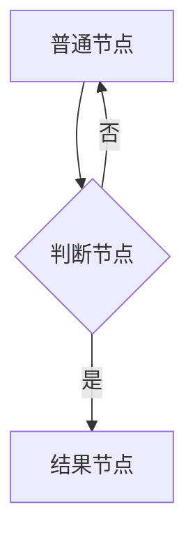

# Mermaid流程图渲染兼容性指南
## 一、导致渲染失败的常见问题
1. **自定义样式不兼容**：使用`classDef`定义自定义类、`:::`应用类样式、`stroke-width/rounded`等扩展属性，很多旧版/轻量渲染器不支持这类高级特性
2. **节点语法不统一**：混用不同括号类型`[]`/`()`/`{}`/`>`，部分渲染器对特殊括号类型支持存在差异
3. **特殊标签使用**：在节点内容中使用HTML标签`<small>`、` `等，部分渲染器不支持内嵌HTML语法
4. **非标准属性**：使用`fill`/`stroke`等直接样式属性，或者Mermaid高级扩展语法
5. **逻辑结构错误**：循环节点指向错误、未闭合的判断分支等逻辑问题

## 二、兼容性最佳实践（所有渲染器通用）
1. **基础语法优先**：只使用Mermaid最基础的标准语法，避免所有高级/扩展特性
2. **节点语法统一**：普通节点统一用方括号`[内容]`，判断节点用大括号`{内容}`，不要使用其他括号类型
3. **移除所有自定义样式**：删除所有`classDef`定义、类标记`:::`、单独`style`样式属性
4. **纯文本内容**：节点内容只用纯文本，不要使用HTML标签、Markdown格式、特殊格式符号
5. **简单连线规范**：只用基础箭头`-->`，标签用`|内容|`，不要使用其他连线样式和属性
6. **逻辑结构清晰**：避免复杂嵌套和循环引用，确保每个节点都有明确的输入输出路径

## 三、正确示例（兼容性最好的标准写法）

## 四、渲染失败降级方案
1. 第一优先级：简化所有自定义样式、标签、扩展语法，回归最基础语法
2. 第二优先级：改为纯文本ASCII流程图，兼容性100%
3. 分场景适配：
   - GitHub：支持大部分特性，但不支持部分扩展样式
   - Obsidian：默认支持良好，但第三方插件可能有差异
   - Notion：支持最弱，只能用最基础语法
   - 通用编辑器：通常支持基础语法，避免高级特性

## 五、输出规范
1. 所有流程图默认使用上述兼容性最佳实践编写
2. 对话中先展示兼容版流程图，再同步保存到文件
3. 如果用户有特殊样式需求，单独提供带样式的特殊版本
