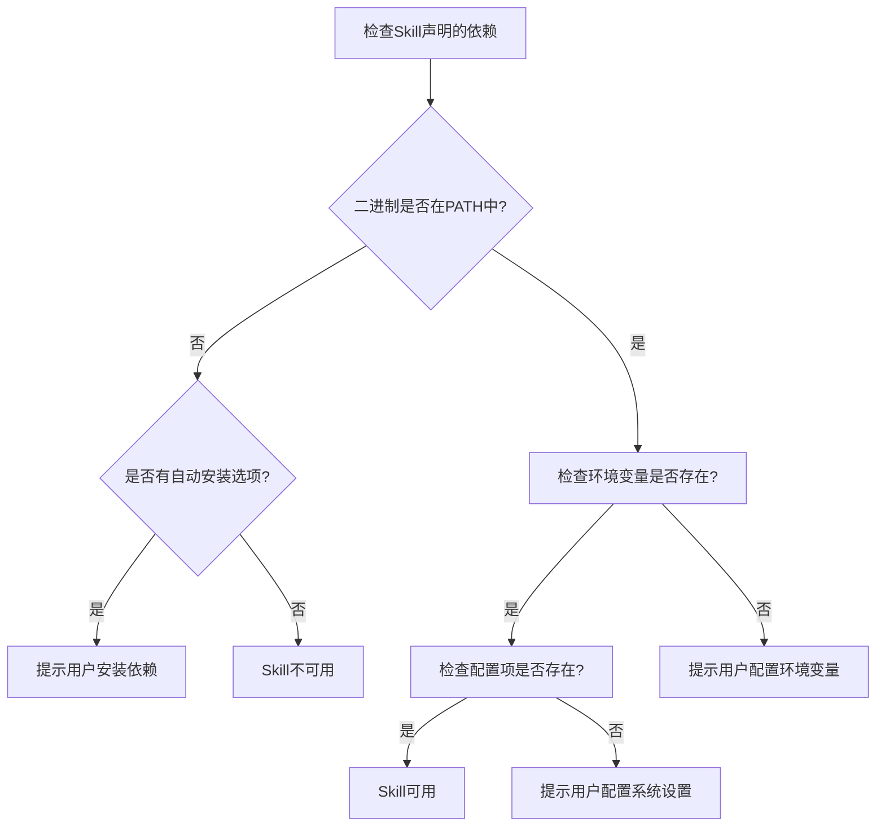

# OpenClaw Skill类型与依赖梳理报告

## 一、Skill 类型分类体系
OpenClaw的Skill系统支持多种类型的扩展，从不同维度可以进行如下分类：

---

### 维度一：按实现复杂度分类
#### 1. 声明式Skill（最常见，零代码）
**特点**：仅通过`SKILL.md`文件定义，包含使用说明和命令示例，无需编写代码
**适用场景**：封装现有CLI工具使用流程、领域知识、最佳实践、业务流程
**依赖要求**：仅依赖Skill中声明的二进制工具、环境变量或配置项
**示例**：weather、github、1password等大部分内置Skill
**典型依赖配置**：
```yaml
metadata:
  openclaw:
    requires:
      bins: ["curl"] # 依赖系统已安装curl二进制
```

#### 2. 脚本化Skill（带执行逻辑）
**特点**：包含可执行脚本（Python/Bash/Go等），封装复杂的执行逻辑
**适用场景**：复杂计算、多步骤流程、API集成、数据处理等需要确定性逻辑的场景
**依赖要求**：除了二进制依赖外，还需要脚本运行时环境（Python/Node.js等）和依赖包
**示例**：openai-image-gen、skill-creator、model-usage
**典型依赖配置**：
```yaml
metadata:
  openclaw:
    requires:
      bins: ["python3", "pip"]
      env: ["OPENAI_API_KEY"] # 需要环境变量
```
**目录结构**：
```
skill-name/
├── SKILL.md
└── scripts/
    ├── gen.py          # 核心执行脚本
    └── test_gen.py     # 测试脚本
```

#### 3. 插件式Skill（完整功能模块）
**特点**：作为插件的一部分提供，与插件生命周期绑定，可以扩展系统核心能力
**适用场景**：需要深度集成到OpenClaw核心的功能、新渠道扩展、自定义工具等
**依赖要求**：依赖插件运行环境，需要在插件中注册才能使用
**示例**：飞书插件提供的Skill、语音通话插件Skill
**配置方式**：在插件的`openclaw.plugin.json`中声明：
```json
{
  "id": "feishu",
  "skills": ["./skills"] // 插件包含的Skill目录
}
```

---

### 维度二：按功能领域分类
#### 1. 生产力工具类
**功能**：集成常用工具和服务，提升工作效率
**典型Skill**：
| Skill名称 | 功能描述 | 核心依赖 |
|----------|----------|----------|
| github | GitHub仓库管理、Issue/PR操作 | `gh` CLI |
| notion | Notion笔记管理 | 环境变量`NOTION_API_KEY` |
| obsidian | Obsidian笔记操作 | 本地Obsidian仓库 |
| slack | Slack消息发送/接收 | `slack` CLI |
| trello | Trello看板管理 | API Token |

#### 2. 系统集成类
**功能**：集成操作系统能力和本地应用
**典型Skill**：
| Skill名称 | 功能描述 | 核心依赖 | 支持系统 |
|----------|----------|----------|----------|
| apple-notes | Apple Notes操作 | AppleScript | macOS |
| apple-reminders | 苹果提醒事项操作 | AppleScript | macOS |
| imsg | iMessage消息发送 | AppleScript | macOS |
| things-mac | Things待办管理 | AppleScript | macOS |
| 1password | 1Password密码管理 | `op` CLI | 全平台 |

#### 3. AI能力扩展类
**功能**：扩展AI的能力边界，新增AI可调用的功能
**典型Skill**：
| Skill名称 | 功能描述 | 核心依赖 |
|----------|----------|----------|
| openai-image-gen | DALL-E图片生成 | Python + OpenAI API Key |
| openai-whisper | 本地语音转文字 | `whisper` CLI |
| summarize | 长文本摘要 | 无额外依赖 |
| gemini | Google Gemini能力集成 | GEMINI_API_KEY |
| nano-pdf | PDF处理能力 | `pdftotext`等二进制 |

#### 4. 媒体与物联网类
**功能**：媒体处理、智能家居控制、设备集成
**典型Skill**：
| Skill名称 | 功能描述 | 核心依赖 |
|----------|----------|----------|
| openhue | Philips Hue灯光控制 | `hue` CLI |
| sonoscli | Sonos音响控制 | `sonos-cli` |
| spotify-player | Spotify播放控制 | `spotifyd` |
| camsnap | 摄像头截图 | `ffmpeg` |
| video-frames | 视频帧提取 | `ffmpeg` |

#### 5. 开发与运维类
**功能**：软件开发、部署、运维相关能力
**典型Skill**：
| Skill名称 | 功能描述 | 核心依赖 |
|----------|----------|----------|
| coding-agent | 代码开发辅助 | 无额外依赖 |
| clawhub | ClawHub技能市场操作 | 无额外依赖 |
| session-logs | 会话日志查看 | 无额外依赖 |
| skill-creator | Skill开发辅助 | Python |
| healthcheck | 系统健康检查 | 无额外依赖 |

---

### 维度三：按运行环境分类
#### 1. 本地运行Skill
**特点**：默认运行在本地Gateway节点，直接调用本地系统能力
**适用场景**：大部分通用Skill，操作本地文件、本地应用、本地网络资源
**依赖要求**：依赖本地安装的二进制工具和环境变量
**安全隔离**：默认无隔离，拥有Gateway进程同等权限

#### 2. 远程节点Skill
**特点**：运行在远程连接的节点设备上（如手机、其他电脑、智能家居设备）
**适用场景**：需要调用特定设备能力的场景，如手机短信发送、设备摄像头操作
**依赖要求**：依赖远程节点上安装的对应能力，需要节点已连接到Gateway
**调度方式**：系统自动路由到具备对应能力的节点执行

#### 3. 沙箱隔离Skill
**特点**：运行在沙箱环境中，与主系统隔离
**适用场景**：执行不可信代码、第三方Skill、高危操作
**依赖要求**：依赖沙箱运行环境，通过沙箱桥接访问系统资源
**安全隔离**：文件系统、网络、进程完全隔离，避免恶意代码影响主系统

---

## 二、Skill 依赖体系详解
### 1. 依赖类型
Skill支持声明以下几类依赖：

| 依赖类型 | 声明字段 | 说明 | 示例 |
|---------|---------|------|------|
| 二进制依赖 | `requires.bins` | 依赖系统已安装的可执行文件 | `["curl", "gh", "python3"]` |
| 环境变量依赖 | `requires.env` | 依赖的环境变量（API密钥等） | `["OPENAI_API_KEY", "NOTION_TOKEN"]` |
| 配置项依赖 | `requires.config` | 依赖的系统配置项路径 | `["tools.web.search.enabled"]` |
| 操作系统限制 | `requires.os` | 支持的操作系统 | `"darwin"`(macOS)、`"linux"`、`"win32"` |
| 节点能力依赖 | `requires.nodeCapability` | 依赖的远程节点能力 | `"camera"`, `"sms"`, `"bluetooth"` |

### 2. 自动安装支持
Skill可以声明自动安装选项，系统可以自动安装所需依赖：

| 安装类型 | 说明 | 配置示例 |
|---------|------|----------|
| brew | macOS/Linux Homebrew包 | `{"kind": "brew", "formula": "gh", "bins": ["gh"]}` |
| apt | Debian/Ubuntu APT包 | `{"kind": "apt", "package": "gh", "bins": ["gh"]}` |
| npm | Node.js包 | `{"kind": "npm", "package": "@openclaw/cli", "bins": ["openclaw"]}` |
| go | Go模块 | `{"kind": "go", "package": "github.com/cli/cli/v2/cmd/gh@latest", "bins": ["gh"]}` |
| uv | Python包 | `{"kind": "uv", "package": "openai", "bins": []}` |
| download | 直接下载二进制 | `{"kind": "download", "url": "https://github.com/cli/cli/releases/download/v2.48.0/gh_2.48.0_macOS_amd64.tar.gz", "bins": ["bin/gh"]}` |

### 3. 依赖优先级与解析逻辑


---

## 三、Skill 来源与加载优先级
Skill从以下多个来源加载，优先级从高到低：

| 来源 | 路径 | 优先级 | 说明 |
|------|------|--------|------|
| 工作区Skill | `<workspace>/.openclaw/skills` | 最高 | 仅当前工作区可见，可覆盖同名Skill |
| 托管Skill | `~/.openclaw/skills` | 中 | 全局所有Agent共享 |
| 插件Skill | 插件目录下的`skills`文件夹 | 低 | 随插件启用/禁用 |
| 内置Skill | 随安装包发布的`skills`目录 | 最低 | 系统默认提供的基础Skill |
| 额外目录 | `skills.load.extraDirs`配置 | 最低 | 用户自定义的额外加载目录 |

> 同名Skill会被高优先级的自动覆盖，无需修改系统文件即可自定义扩展。

---

## 四、典型Skill示例与依赖分析
### 示例1：Weather Skill（声明式）
```yaml
---
name: weather
description: "查询全球天气信息"
metadata:
  openclaw:
    emoji: "☔"
    requires:
      bins: ["curl"] # 仅依赖curl
---
```
**依赖说明**：仅需要系统已安装curl，无其他依赖，跨平台可用

### 示例2：GitHub Skill（声明式+自动安装）
```yaml
---
name: github
description: "GitHub仓库管理"
metadata:
  openclaw:
    emoji: "🐙"
    requires:
      bins: ["gh"] # 依赖gh CLI
    install:
      - kind: "brew"
        formula: "gh"
        bins: ["gh"]
      - kind: "apt"
        package: "gh"
        bins: ["gh"]
---
```
**依赖说明**：依赖`gh` CLI，系统可通过brew或apt自动安装

### 示例3：OpenAI Image Gen Skill（脚本化）
```yaml
---
name: openai-image-gen
description: "DALL-E图片生成"
metadata:
  openclaw:
    requires:
      bins: ["python3", "pip"]
      env: ["OPENAI_API_KEY"] # 需要OpenAI API密钥
---
```
**依赖说明**：需要Python运行时和OpenAI API密钥，脚本使用`openai` Python包

### 示例4：Apple Notes Skill（系统专属）
```yaml
---
name: apple-notes
description: "Apple Notes操作"
metadata:
  openclaw:
    requires:
      os: "darwin" # 仅支持macOS
---
```
**依赖说明**：仅在macOS系统可用，依赖系统内置的AppleScript能力

---

## 五、Skill 依赖管理命令
OpenClaw提供了完整的CLI命令管理Skill依赖：
```bash
# 列出所有Skill及其状态（可用/缺少依赖）
openclaw skills list

# 仅列出可用的Skill
openclaw skills list --eligible

# 查看特定Skill的详细信息和依赖要求
openclaw skills info <skill-name>

# 检查所有Skill的依赖状态
openclaw skills check

# 安装Skill的依赖
openclaw skills install <skill-name>
```

---

## 六、核心实现文件
| 文件路径 | 核心功能 |
|----------|----------|
| [src/agents/skills/skill-evaluator.ts](file:///d:/prj/openclaw_analyze/src/agents/skills/skill-evaluator.ts) | Skill依赖校验逻辑 |
| [src/agents/skills-install.ts](file:///d:/prj/openclaw_analyze/src/agents/skills-install.ts) | Skill依赖自动安装实现 |
| [src/agents/skills/workspace.ts](file:///d:/prj/openclaw_analyze/src/agents/skills/workspace.ts) | Skill加载与优先级合并 |
| [src/config/types.skills.ts](file:///d:/prj/openclaw_analyze/src/config/types.skills.ts) | Skill元数据类型定义 |
| [src/cli/skills-cli.ts](file:///d:/prj/openclaw_analyze/src/cli/skills-cli.ts) | Skill管理CLI命令实现 |
