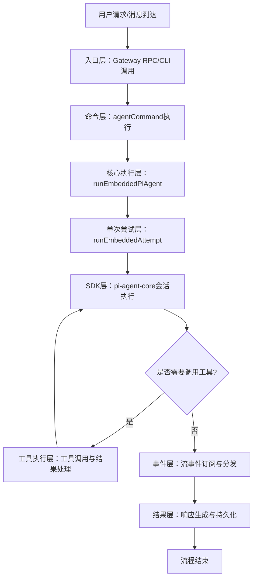
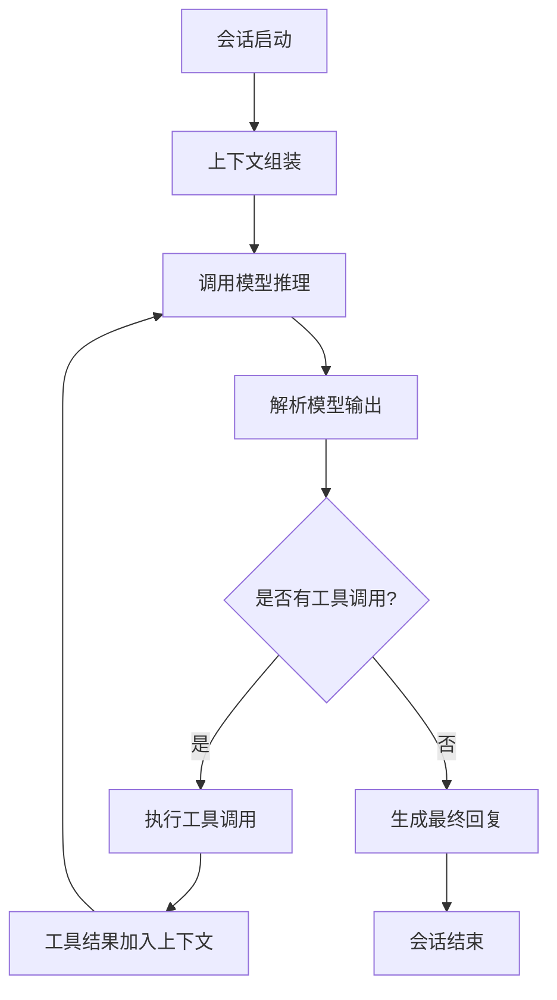

# AgentLoop 执行流程分析

## 🔍 核心流程总览
### AgentLoop完整流程图


---

## 📋 各阶段详细说明

### 1. 入口层：请求接收
#### 功能：
- 接收外部请求（Gateway RPC / CLI命令）
- 参数验证和标准化
- 会话识别与路由
#### 关键类/函数：
| 函数 | 功能 | 代码链接 |
|------|------|----------|
| `agentHandler` | Gateway RPC `agent` 接口处理 | [src/gateway/server-methods/agent.ts](file:///d:/prj/openclaw_analyze/src/gateway/server-methods/agent.ts) |
| `agentCommand` | CLI `agent` 命令处理 | [src/commands/agent.ts](file:///d:/prj/openclaw_analyze/src/commands/agent.ts) |
| `agentCommandFromIngress` | 入站消息代理执行入口 | [src/commands/agent.ts](file:///d:/prj/openclaw_analyze/src/commands/agent.ts) |
#### 核心代码：
```typescript
// Gateway RPC入口
export const agentHandler: GatewayRequestHandler<"agent"> = async (params, context) => {
  // 参数验证
  const validation = validateAgentParams(params);
  if (!validation.success) {
    return errorShape(ErrorCodes.InvalidParams, formatValidationErrors(validation.error));
  }
  
  // 生成运行ID
  const runId = params.runId ?? randomUUID();
  
  // 执行代理命令
  const result = await agentCommandFromIngress({
    message: params.message,
    sessionKey: params.sessionKey,
    runId,
    // ...其他参数
  });
  
  return result;
};
```

---

### 2. 命令层：执行准备
#### 功能：
- 解析消息指令（think/verbose/elevated等）
- 加载会话配置和上下文
- 初始化执行环境
#### 关键类/函数：
| 函数 | 功能 | 代码链接 |
|------|------|----------|
| `getReplyFromConfig` | 从配置生成回复 | [src/auto-reply/reply/index.ts](file:///d:/prj/openclaw_analyze/src/auto-reply/reply/index.ts) |
| `extractDirectives` | 提取消息中的指令 | [src/auto-reply/directives.ts](file:///d:/prj/openclaw_analyze/src/auto-reply/directives.ts) |
| `runEmbeddedPiAgent` | 嵌入式Agent执行入口 | [src/agents/pi-embedded-runner/index.ts](file:///d:/prj/openclaw_analyze/src/agents/pi-embedded-runner/index.ts) |
#### 核心代码：
```typescript
export async function agentCommandFromIngress(opts: AgentCommandOpts) {
  // 提取消息中的指令
  const directives = extractDirectives(opts.message);
  
  // 执行Agent获取回复
  const reply = await getReplyFromConfig(ctx, {
    thinkLevel: directives.think,
    verboseLevel: directives.verbose,
    bashElevated: directives.elevated,
    // ...其他选项
  });
  
  return reply;
}
```

---

### 3. 核心执行层：Agent运行时
#### 功能：
- 会话队列管理（防止并发冲突）
- 超时控制和异常处理
- 重试和故障转移
- 事件订阅管理
#### 关键类/函数：
| 函数 | 功能 | 代码链接 |
|------|------|----------|
| `runEmbeddedPiAgent` | 嵌入式Agent运行时主函数 | [src/agents/pi-embedded-runner/index.ts](file:///d:/prj/openclaw_analyze/src/agents/pi-embedded-runner/index.ts) |
| `subscribeEmbeddedPiSession` | 会话事件订阅 | [src/agents/pi-embedded-subscribe.ts](file:///d:/prj/openclaw_analyze/src/agents/pi-embedded-subscribe.ts) |
| `runEmbeddedAttempt` | 单次运行尝试入口 | [src/agents/pi-embedded-runner/run/attempt.ts](file:///d:/prj/openclaw_analyze/src/agents/pi-embedded-runner/run/attempt.ts) |
#### 核心代码：
```typescript
export async function runEmbeddedPiAgent(
  params: RunEmbeddedPiAgentParams,
): Promise<EmbeddedPiRunResult> {
  // 会话队列管理，确保同一时间只有一个运行
  const queueHandle = getSessionQueue(params.sessionKey);
  
  // 加入队列执行
  return await queueHandle.add(async () => {
    // 执行单次运行尝试
    return await runEmbeddedAttempt({
      ...params,
      // ...运行参数
    });
  });
}
```

---

### 4. 单次尝试层：执行逻辑
#### 功能：
- 环境准备和工作区切换
- 系统提示构建（技能、工具、上下文注入）
- 工具初始化和权限配置
- 会话创建和流函数适配
#### 关键类/函数：
| 函数 | 功能 | 代码链接 |
|------|------|----------|
| `runEmbeddedAttempt` | 单次运行尝试主函数 | [src/agents/pi-embedded-runner/run/attempt.ts](file:///d:/prj/openclaw_analyze/src/agents/pi-embedded-runner/run/attempt.ts#L1721) |
| `buildEmbeddedSystemPrompt` | 构建系统提示 | [src/agents/pi-embedded-runner/system-prompt.ts](file:///d:/prj/openclaw_analyze/src/agents/pi-embedded-runner/system-prompt.ts) |
| `createOpenClawCodingTools` | 创建工具集 | [src/agents/pi-tools.ts](file:///d:/prj/openclaw_analyze/src/agents/pi-tools.ts) |
| `createAgentSession` | 创建Agent会话 | [@mariozechner/pi-coding-agent](https://github.com/mariozechner/pi-coding-agent) |
#### 核心代码：
```typescript
export async function runEmbeddedAttempt(
  params: EmbeddedRunAttemptParams,
): Promise<EmbeddedRunAttemptResult> {
  // 1. 环境准备
  const resolvedWorkspace = resolveUserPath(params.workspaceDir);
  const prevCwd = process.cwd();
  process.chdir(resolvedWorkspace);
  
  try {
    // 2. 构建系统提示
    const appendPrompt = buildEmbeddedSystemPrompt({
      workspaceDir: resolvedWorkspace,
      // ...提示参数
    });
    
    // 3. 初始化工具集
    const tools = createOpenClawCodingTools({
      agentId: sessionAgentId,
      // ...工具参数
    });
    
    // 4. 创建Agent会话
    ({ session } = await createAgentSession({
      model: params.model,
      tools,
      // ...会话参数
    }));
    
    // 5. 执行会话
    const result = await session.run();
    return result;
  } finally {
    // 环境恢复
    process.chdir(prevCwd);
  }
}
```

---

### 5. SDK层：模型推理与工具调用循环
#### 功能：
- 会话上下文管理
- 模型调用和流式处理
- 工具调用解析和执行
- 多轮对话循环控制
#### 关键类/函数：
| 类/函数 | 功能 | 来源 |
|---------|------|------|
| `PiAgentSession` | Agent会话核心类 | @mariozechner/pi-coding-agent |
| `streamSimple` | 模型流处理 | @mariozechner/pi-ai |
| `toolExecutionLoop` | 工具执行循环 | pi-agent-core内部 |
#### 内部执行逻辑：


---

### 6. 事件层：事件订阅与流处理
#### 功能：
- 流式输出处理（助手响应、工具事件、生命周期事件）
- 事件分发到客户端/通道
- 进度和状态通知
#### 关键类/函数：
| 函数 | 功能 | 代码链接 |
|------|------|----------|
| `subscribeEmbeddedPiSession` | 会话事件订阅 | [src/agents/pi-embedded-subscribe.ts](file:///d:/prj/openclaw_analyze/src/agents/pi-embedded-subscribe.ts) |
| 流事件处理器 | 处理assistant/tool/lifecycle事件 | [src/agents/pi-embedded-subscribe.ts](file:///d:/prj/openclaw_analyze/src/agents/pi-embedded-subscribe.ts) |
#### 核心代码：
```typescript
export function subscribeEmbeddedPiSession(params: SubscribeEmbeddedPiSessionParams) {
  const { session } = params;
  
  // 订阅助手响应流
  session.on("assistant_delta", (delta) => {
    params.onPartialReply?.(delta);
  });
  
  // 订阅工具事件
  session.on("tool_start", (toolEvent) => {
    params.onToolResult?.({ type: "start", ...toolEvent });
  });
  
  // 订阅生命周期事件
  session.on("lifecycle", (event) => {
    if (event.phase === "end") {
      // 处理结束事件
    }
  });
  
  return {
    // 返回订阅控制对象
    unsubscribe: () => { /* 取消订阅 */ },
    waitForCompletion: () => { /* 等待完成 */ },
  };
}
```

---

### 7. 结果层：响应处理与持久化
#### 功能：
- 响应内容格式化和整形
- 会话历史持久化
- 结果返回给调用方
#### 关键类/函数：
| 函数 | 功能 | 代码链接 |
|------|------|----------|
| `SessionManager` | 会话历史持久化 | [src/agents/session-manager.ts](file:///d:/prj/openclaw_analyze/src/agents/session-manager.ts) |
| `flushPendingToolResultsAfterIdle` | 工具结果持久化 | [src/agents/pi-embedded-runner/wait-for-idle-before-flush.ts](file:///d:/prj/openclaw_analyze/src/agents/pi-embedded-runner/wait-for-idle-before-flush.ts) |
| `reply-delivery.ts` | 回复投递到通道 | [src/auto-reply/reply/reply-delivery.ts](file:///d:/prj/openclaw_analyze/src/auto-reply/reply/reply-delivery.ts) |

---

## 🔗 核心Hook点（可扩展点）
OpenClaw提供了丰富的Hook点可以在AgentLoop的不同阶段插入自定义逻辑：

| Hook名称 | 触发时机 | 用途 |
|----------|----------|------|
| `before_agent_start` | Agent运行前 | 注入上下文、覆盖系统提示 |
| `before_prompt_build` | 系统提示构建前 | 修改提示内容、注入额外上下文 |
| `before_tool_call` | 工具调用前 | 校验工具参数、修改调用请求 |
| `after_tool_call` | 工具调用后 | 处理工具结果、转换返回格式 |
| `agent_end` | Agent运行结束后 | 处理最终结果、执行后置操作 |
| `before_compaction` | 会话压缩前 | 自定义压缩逻辑 |
| `after_compaction` | 会话压缩后 | 压缩结果处理 |

---

## 📁 核心文件汇总
| 文件路径 | 核心功能 |
|----------|----------|
| [src/gateway/server-methods/agent.ts](file:///d:/prj/openclaw_analyze/src/gateway/server-methods/agent.ts) | Gateway Agent RPC接口 |
| [src/commands/agent.ts](file:///d:/prj/openclaw_analyze/src/commands/agent.ts) | Agent命令执行 |
| [src/agents/pi-embedded-runner/index.ts](file:///d:/prj/openclaw_analyze/src/agents/pi-embedded-runner/index.ts) | 嵌入式Agent运行时入口 |
| [src/agents/pi-embedded-runner/run/attempt.ts](file:///d:/prj/openclaw_analyze/src/agents/pi-embedded-runner/run/attempt.ts) | 单次Agent运行尝试实现 |
| [src/agents/pi-embedded-subscribe.ts](file:///d:/prj/openclaw_analyze/src/agents/pi-embedded-subscribe.ts) | 会话事件订阅 |
| [src/agents/session-manager.ts](file:///d:/prj/openclaw_analyze/src/agents/session-manager.ts) | 会话历史管理 |
| [src/agents/pi-tools.ts](file:///d:/prj/openclaw_analyze/src/agents/pi-tools.ts) | 工具集实现 |
