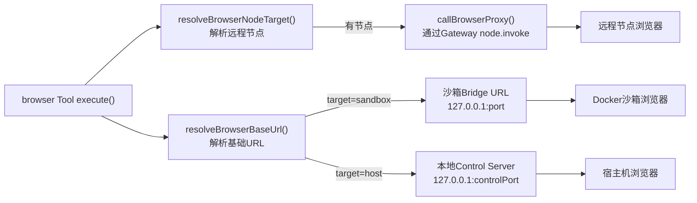
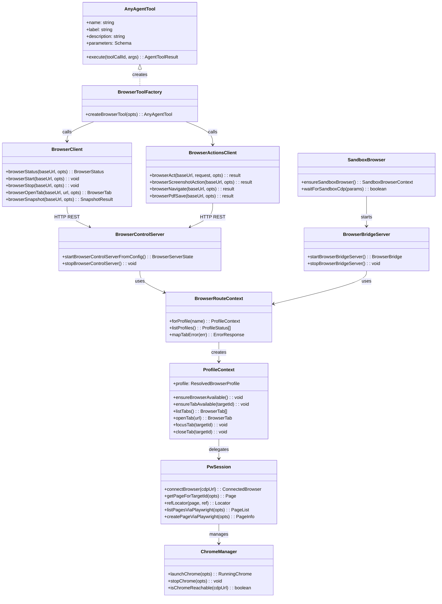
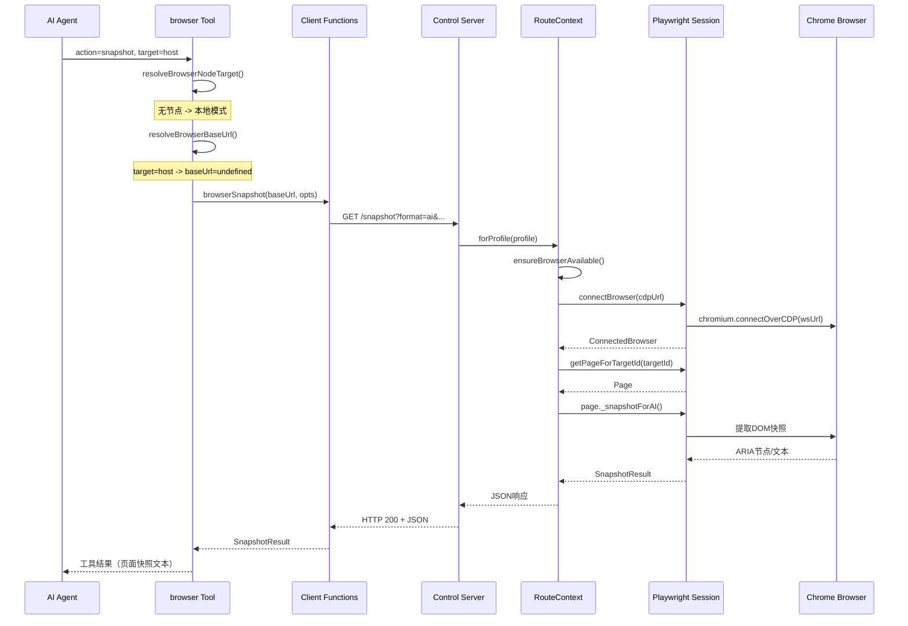

# OpenClaw Browser-Use 集成方式分析

## 结论：Browser-Use 以 **Tool（工具）** 集成，而非 SubAgent

OpenClaw 中的浏览器控制能力是通过一个标准的 **Agent Tool**（`browser` 工具）集成的，AI 模型像调用 `read`、`write`、`exec` 等工具一样调用它。它不是通过子代理（subagent）机制实现的。

---

## 一、整体集成架构

```mermaid
flowchart TB
    subgraph AgentLayer["AI 智能体层"]
        Agent["AI Agent (Pi Session)"]
        BrowserTool["browser Tool<br/>createBrowserTool()"]
    end

    subgraph ToolRegistration["工具注册层"]
        OpenClawTools["createOpenClawTools()<br/>openclaw-tools.ts"]
    end

    subgraph ClientLayer["HTTP 客户端层"]
        ClientFns["browserStatus / browserStart<br/>browserSnapshot / browserAct<br/>client.ts / client-actions.ts"]
    end

    subgraph ServerLayer["浏览器控制服务层"]
        ControlServer["Browser Control Server<br/>server.ts (Express HTTP)"]
        BridgeServer["Bridge Server<br/>bridge-server.ts (沙箱桥接)"]
        Routes["Routes<br/>routes/index.ts"]
        ServerCtx["ServerContext<br/>server-context.ts"]
    end

    subgraph BrowserEngine["浏览器引擎层"]
        PwSession["pw-session.ts<br/>Playwright CDP 会话管理"]
        ChromeMgr["chrome.ts<br/>Chrome 进程管理"]
        ChromeMcp["chrome-mcp.ts<br/>Chrome MCP 协议"]
    end

    subgraph SandboxLayer["沙箱层"]
        SandboxBrowser["sandbox/browser.ts<br/>Docker 容器管理"]
    end

    subgraph RemoteLayer["远程节点层"]
        GatewayProxy["gateway/server-methods/browser.ts<br/>node.invoke browser.proxy"]
    end

    Agent -->|tool_call: action=snapshot| BrowserTool
    BrowserTool -->|注册于| OpenClawTools
    OpenClawTools -->|返回 AnyAgentTool[]| Agent

    BrowserTool -->|本地/宿主机| ClientFns
    BrowserTool -->|沙箱| BridgeServer
    BrowserTool -->|远程节点| GatewayProxy

    ClientFns -->|HTTP REST| ControlServer
    BridgeServer -->|HTTP REST| Routes
    GatewayProxy -->|转发| ControlServer

    ControlServer --> Routes
    Routes --> ServerCtx
    ServerCtx --> PwSession
    ServerCtx --> ChromeMcp

    PwSession -->|CDP WebSocket| ChromeMgr
    SandboxBrowser -->|启动Docker| BridgeServer
```

---

## 二、三种目标路由模式

`browser` 工具通过 `target` 参数支持三种浏览器位置：



| target 模式 | 说明 | baseUrl 来源 | 使用场景 |
|------------|------|-------------|---------|
| `sandbox` | 沙箱浏览器（Docker隔离） | Bridge Server URL | 隔离环境，安全执行 |
| `host` | 宿主机浏览器 | undefined（本地Control Server） | 访问用户已登录状态 |
| `node` | 远程节点浏览器 | 无（通过Gateway代理） | 远程浏览器代理 |

---

## 三、核心类图



---

## 四、工具注册流程

### 4.1 工具创建与注册

`browser-tool.ts` 中 `createBrowserTool()` 返回一个标准的 `AnyAgentTool` 对象：

```typescript
// src/agents/tools/browser-tool.ts:491
export function createBrowserTool(opts?: {
  sandboxBridgeUrl?: string;
  allowHostControl?: boolean;
  agentSessionKey?: string;
}): AnyAgentTool {
  return {
    label: "Browser",
    name: "browser",
    description: "Control the browser via OpenClaw's browser control server...",
    parameters: BrowserToolSchema,
    execute: async (_toolCallId, args) => { /* ... */ },
  };
}
```

`openclaw-tools.ts` 中与其他工具一起注册：

```typescript
// src/agents/openclaw-tools.ts:139-144
const tools: AnyAgentTool[] = [
  createBrowserTool({
    sandboxBridgeUrl: options?.sandboxBrowserBridgeUrl,
    allowHostControl: options?.allowHostBrowserControl,
    agentSessionKey: options?.agentSessionKey,
  }),
  createCanvasTool({ config: options?.config }),
  // ... 其他工具
];
```

### 4.2 工具 Schema（支持的 action）

`browser-tool.schema.ts` 定义了工具参数：

```typescript
const BROWSER_TOOL_ACTIONS = [
  "status", "start", "stop", "profiles", "tabs",
  "open", "focus", "close", "snapshot", "screenshot",
  "navigate", "console", "pdf", "upload", "dialog", "act",
] as const;

const BROWSER_ACT_KINDS = [
  "click", "type", "press", "hover", "drag",
  "select", "fill", "resize", "wait", "evaluate", "close",
] as const;
```

---

## 五、工具执行流程（核心调用链）



### 5.1 execute 函数分发逻辑

`browser-tool.ts` 的核心分发逻辑：

```typescript
execute: async (_toolCallId, args) => {
  // 1. 解析基础参数
  const action = readStringParam(params, "action", { required: true });
  const profile = readStringParam(params, "profile");
  const target = readStringParam(params, "target");

  // 2. 解析目标节点（远程代理或本地）
  const nodeTarget = await resolveBrowserNodeTarget({ ... });

  // 3. 解析基础URL（沙箱桥接 或 本地服务 或 undefined）
  const baseUrl = nodeTarget ? undefined : resolveBrowserBaseUrl({ ... });

  // 4. 创建代理函数（如果有远程节点）
  const proxyRequest = nodeTarget ? async (opts) => {
    const proxy = await callBrowserProxy({ nodeId: nodeTarget.nodeId, ... });
    // ...处理远程文件
  } : null;

  // 5. 根据action分发
  switch (action) {
    case "status": /* ... */
    case "snapshot": return await executeSnapshotAction({ ... });
    case "act": return await executeActAction({ ... });
    case "screenshot": /* ... */
    // ...
  }
}
```

### 5.2 三种模式的 URL 解析

`resolveBrowserBaseUrl()` 函数根据 target 参数决定连接目标：

```typescript
function resolveBrowserBaseUrl(params): string | undefined {
  const target = params.target ?? (normalizedSandbox ? "sandbox" : "host");

  if (target === "sandbox") {
    // 沙箱模式：返回Bridge Server的URL
    return normalizedSandbox.replace(/\/$/, "");
  }

  // 宿主机模式：返回undefined，表示使用默认本地Control Server
  if (!resolved.enabled) {
    throw new Error("Browser control is disabled...");
  }
  return undefined;
}
```

### 5.3 远程节点代理

当 target 为 node 时，通过 Gateway 的 `node.invoke` 命令代理请求：

```typescript
async function callBrowserProxy(params: {
  nodeId: string;
  method: string;
  path: string;
  // ...
}): Promise<BrowserProxyResult> {
  const payload = await callGatewayTool("node.invoke", { timeoutMs }, {
    nodeId: params.nodeId,
    command: "browser.proxy",
    params: {
      method: params.method,
      path: params.path,
      query: params.query,
      body: params.body,
      timeoutMs: proxyTimeoutMs,
      profile: params.profile,
    },
    idempotencyKey: crypto.randomUUID(),
  });
  // 解析远程节点返回的结果和文件
  return parsed;
}
```

---

## 六、底层浏览器控制架构

### 6.1 Control Server（本地浏览器控制服务）

`server.ts` 启动一个 Express HTTP 服务，仅绑定到 127.0.0.1：

```typescript
// src/browser/server.ts:27
export async function startBrowserControlServerFromConfig() {
  const app = express();
  installBrowserCommonMiddleware(app);      // CORS、JSON解析
  installBrowserAuthMiddleware(app, auth);   // Token/Password认证

  const ctx = createBrowserRouteContext({ ... });
  registerBrowserRoutes(app, ctx);           // 注册REST路由

  app.listen(port, "127.0.0.1", () => ...);  // 仅本地访问
}
```

### 6.2 路由注册

`routes/index.ts` 注册三类路由：

```typescript
export function registerBrowserRoutes(app, ctx) {
  registerBrowserBasicRoutes(app, ctx);   // /, /start, /stop, /profiles
  registerBrowserTabRoutes(app, ctx);     // /tabs, /tabs/open, /tabs/:id
  registerBrowserAgentRoutes(app, ctx);   // /snapshot, /screenshot, /act, /navigate, /pdf
}
```

### 6.3 ServerContext（路由上下文）

`server-context.ts` 是连接路由层和浏览器操作的核心中间层，提供多 Profile 管理和操作隔离：

```typescript
export function createBrowserRouteContext(opts: ContextOptions): BrowserRouteContext {
  // 按 Profile 名称获取操作上下文
  const forProfile = (profileName?: string): ProfileContext => {
    const profile = resolveBrowserProfileWithHotReload({ ... });
    return createProfileContext(opts, profile);
  };

  return {
    state,
    forProfile,
    listProfiles,
    mapTabError,
    // ...兼容旧版API
  };
}
```

每个 `ProfileContext` 封装了单个浏览器配置的所有操作：

```typescript
function createProfileContext(opts, profile): ProfileContext {
  return {
    profile,
    ensureBrowserAvailable,  // 确保浏览器已启动
    ensureTabAvailable,      // 确保标签页存在
    listTabs,                // 列出标签页
    openTab,                 // 打开新标签
    focusTab,                // 聚焦标签
    closeTab,                // 关闭标签
    stopRunningBrowser,      // 停止浏览器
    resetProfile,            // 重置配置
  };
}
```

### 6.4 Playwright CDP 会话管理

`pw-session.ts` 是浏览器控制的核心引擎，通过 Playwright 连接 Chrome DevTools Protocol：

```typescript
// 通过CDP WebSocket连接浏览器（带重试和缓存）
async function connectBrowser(cdpUrl: string): Promise<ConnectedBrowser> {
  const browser = await chromium.connectOverCDP(endpoint, { timeout, headers });
  observeBrowser(browser);  // 追踪页面状态
  return { browser, cdpUrl, onDisconnected };
}

// 根据ref获取Playwright定位器（用于act操作）
export function refLocator(page: Page, ref: string) {
  // e1格式 -> role ref -> getByRole解析
  // aria-ref格式 -> aria-ref属性定位
}

// 页面快照（AI友好格式）
// 通过Playwright内部API _snapshotForAI()提取页面结构
```

关键特性：
- **连接缓存**：相同 CDP URL 不重复建立连接
- **重试机制**：最多3次，指数退避
- **页面状态追踪**：WeakMap 关联 Page 状态（console消息、错误、网络请求）
- **Role Refs 缓存**：跨请求保持元素引用稳定性（LRU，最多50条）

### 6.5 沙箱浏览器（Docker 隔离）

`sandbox/browser.ts` 管理在 Docker 容器中运行的浏览器：

```typescript
// 核心函数：确保沙箱浏览器可用
async function ensureSandboxBrowser(): Promise<SandboxBrowserContext> {
  // 1. 检查配置哈希，决定是否需要重建容器
  // 2. 创建/复用Docker容器（含Chromium + noVNC）
  // 3. 等待CDP端口就绪
  // 4. 启动Bridge Server（HTTP代理，转发请求到容器内浏览器）
  // 5. 返回 { bridgeUrl, noVncUrl, ... }
}
```

Bridge Server（`bridge-server.ts`）是沙箱浏览器的 HTTP 代理入口，复用与 Control Server 相同的路由注册。

---

## 七、与 SubAgent 的对比

| 维度 | Browser Tool | SubAgent |
|------|-------------|----------|
| **集成方式** | `AnyAgentTool` 接口 | `sessions_spawn` 工具创建子会话 |
| **执行模式** | 同步工具调用，返回结果 | 异步独立会话，有自己的LLM循环 |
| **LLM参与** | 无，由当前Agent的LLM决策调用 | 有，子Agent有独立的LLM推理 |
| **注册位置** | `createOpenClawTools()` | `createSessionsSpawnTool()` |
| **代码入口** | `src/agents/tools/browser-tool.ts` | `src/agents/tools/subagents-tool.ts` |
| **能力** | 浏览器操作（快照/点击/输入等） | 派生新的AI会话执行复杂任务 |

SubAgent 工具仅提供 `list`/`kill`/`steer` 操作来管理子代理，与浏览器控制完全无关。

---

## 八、完整调用链总结

```
AI Agent (tool_call: browser, action=act, request={kind:click, ref:e1})
  └─ createBrowserTool().execute()          [browser-tool.ts]
       ├─ resolveBrowserNodeTarget()         -> 解析远程节点（可选）
       ├─ resolveBrowserBaseUrl()            -> 解析目标URL（sandbox/host）
       ├─ proxyRequest OR direct client call
       │
       ├─ [本地/宿主机模式]
       │    └─ browserAct(baseUrl, request)  [client-actions.ts]
       │         └─ POST http://127.0.0.1:port/act
       │              └─ Control Server [server.ts]
       │                   └─ Route handler [routes/agent.act.ts]
       │                        └─ ProfileContext [server-context.ts]
       │                             └─ Playwright Session [pw-session.ts]
       │                                  └─ page.getByRole(...).click()
       │                                       └─ Chrome (via CDP)
       │
       ├─ [沙箱模式]
       │    └─ POST http://127.0.0.1:bridgePort/act
       │         └─ Bridge Server [bridge-server.ts]
       │              └─ (同上路由 -> Playwright -> Docker中的Chrome)
       │
       └─ [远程节点模式]
            └─ callBrowserProxy()            [browser-tool.ts]
                 └─ Gateway node.invoke       [gateway/server-methods/browser.ts]
                      └─ 远程节点的Control Server
                           └─ (同上 -> Playwright -> 远程Chrome)
```

---

## 九、关键文件索引

| 模块 | 文件路径 | 职责 |
|------|---------|------|
| 工具入口 | `src/agents/tools/browser-tool.ts` | Agent 工具定义、参数解析、action 分发 |
| 工具 Schema | `src/agents/tools/browser-tool.schema.ts` | 工具参数 JSON Schema |
| 工具 Actions | `src/agents/tools/browser-tool.actions.ts` | snapshot/console/tabs/act 操作封装 |
| 工具注册 | `src/agents/openclaw-tools.ts` | 在 `createOpenClawTools()` 中注册 browser 工具 |
| HTTP 客户端 | `src/browser/client.ts` | 浏览器基础操作 HTTP 客户端 |
| HTTP 客户端 | `src/browser/client-actions.ts` | 浏览器高级操作 HTTP 客户端（act/screenshot等） |
| 控制服务 | `src/browser/server.ts` | 本地浏览器控制 HTTP 服务 |
| 桥接服务 | `src/browser/bridge-server.ts` | 沙箱浏览器桥接 HTTP 服务 |
| 路由注册 | `src/browser/routes/index.ts` | 路由统一注册入口 |
| 路由上下文 | `src/browser/server-context.ts` | 多 Profile 管理、操作隔离 |
| Playwright 会话 | `src/browser/pw-session.ts` | CDP 连接、页面管理、ref 定位 |
| Chrome 管理 | `src/browser/chrome.ts` | Chrome 进程启动/停止/检测 |
| Chrome MCP | `src/browser/chrome-mcp.ts` | Chrome MCP 协议支持 |
| 沙箱浏览器 | `src/agents/sandbox/browser.ts` | Docker 容器化浏览器管理 |
| Gateway 代理 | `src/gateway/server-methods/browser.ts` | 远程节点浏览器代理 |

---

## 十、核心设计理念

Browser-Use 在 OpenClaw 中是一个**功能丰富的单一工具**，通过 `action` 参数实现多路分发（16 种 action + 11 种 act kind），底层通过 Client-Server 架构（HTTP REST + Playwright CDP）控制浏览器。AI 模型在**同一个会话内**直接决策和调用浏览器操作，无需派生子代理。

这种设计的优势：
1. **低延迟**：工具同步执行，结果立即返回给同一 LLM 推理循环
2. **上下文连续**：所有浏览器操作在同一对话上下文中，LLM 能持续追踪页面状态
3. **架构清晰**：Tool -> Client -> Server -> Playwright -> Chrome 分层明确
4. **灵活路由**：通过 target 参数支持 sandbox/host/node 三种部署模式
5. **安全隔离**：沙箱模式通过 Docker + Bridge Server 实现完全隔离
