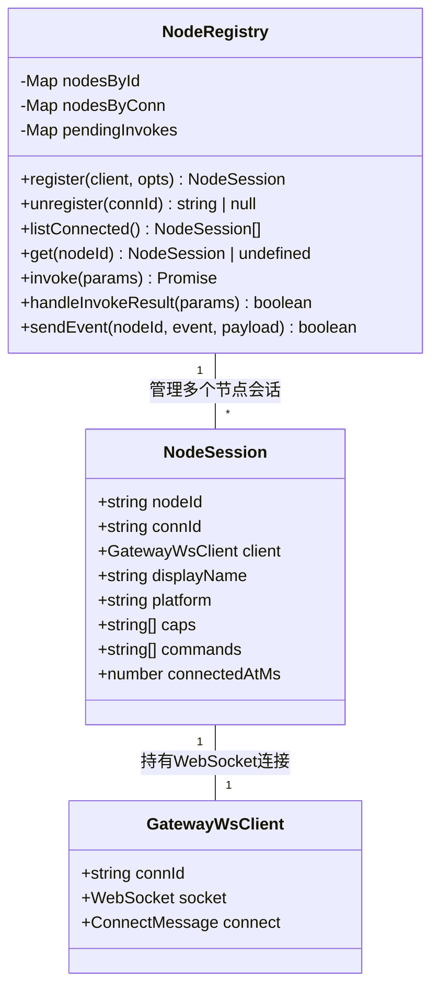
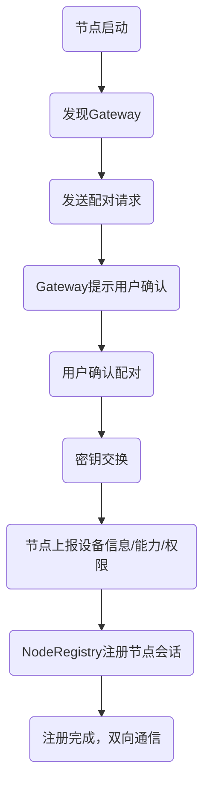
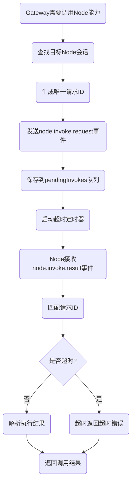
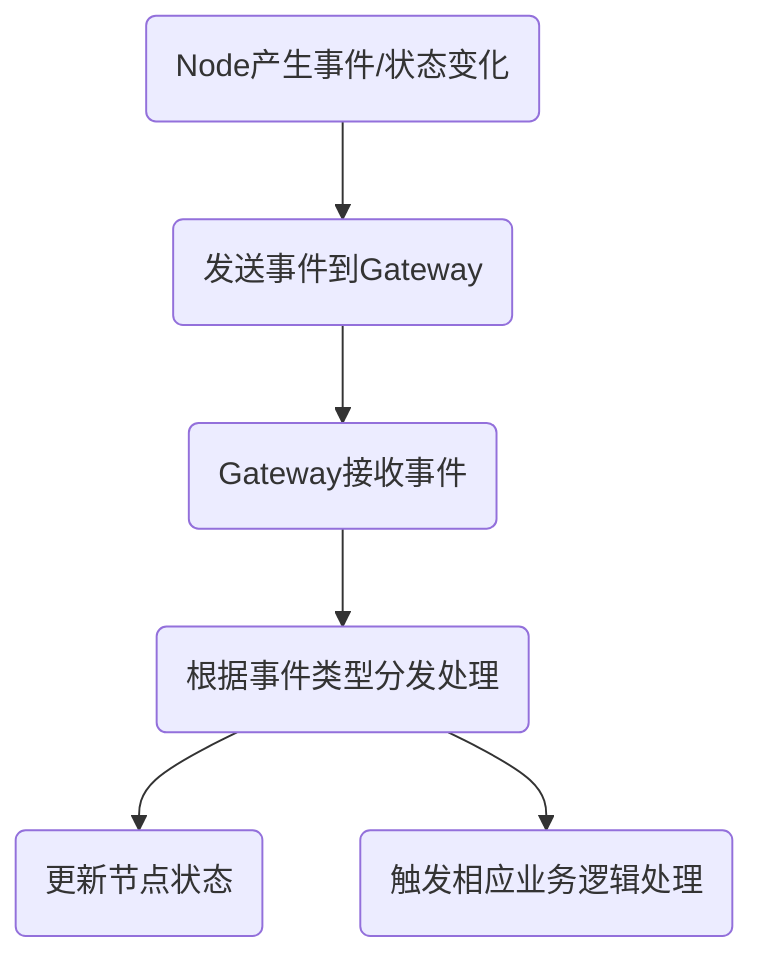

# OpenClaw Node管理与通信机制分析

## 🔍 核心实体模型

### 1. 主要实体类定义
```typescript
/**
 * Node会话：代表一个已连接的设备节点（iOS/Android/macOS等）
 */
export type NodeSession = {
  nodeId: string;                // 节点全局唯一ID
  connId: string;              // WebSocket连接ID
  client: GatewayWsClient;    // WebSocket客户端实例
  displayName?: string;       // 设备显示名称
  platform?: string;          // 平台类型：ios/android/macos/linux/windows
  version?: string;           // 应用版本
  coreVersion?: string;     // Core版本
  uiVersion?: string;        // UI版本
  deviceFamily?: string;   // 设备系列：phone/tablet/desktop/watch
  modelIdentifier?: string; // 设备型号标识
  remoteIp?: string;          // 节点IP地址
  caps: string[];           // 设备能力列表：camera/screen_record/location/notification等
  commands: string[];        // 支持的命令列表
  permissions?: Record<string, boolean>; // 权限配置
  pathEnv?: string;          // 环境变量PATH
  connectedAtMs: number;  // 连接时间戳
};

/**
 * Node调用结果：节点命令执行结果
 */
export type NodeInvokeResult = {
  ok: boolean;              // 是否执行成功
  payload?: unknown;        // 响应数据
  payloadJSON?: string | null; // JSON格式响应
  error?: { code?: string; message?: string } | null; // 错误信息
};

/**
 * 待处理的Node调用请求
 */
type PendingInvoke = {
  nodeId: string;           // 目标节点ID
  command: string;         // 命令名称
  resolve: (value: NodeInvokeResult) => void; // 成功回调
  reject: (err: Error) => void; // 失败回调
  timer: ReturnType<typeof setTimeout>; // 超时定时器
};
```

---

### 2. 核心类关系图


---

## 📋 核心工作原理与架构设计

### 1. Node管理机制
Node管理由`NodeRegistry`单例统一管理所有已连接的节点：
- **双重索引：通过`nodeId`和`connId`双索引快速查找节点
- **生命周期管理**：节点连接时注册，断开时自动清理
- **调用追踪**：管理所有待响应的节点调用请求，支持超时处理
- **事件分发**：支持向指定节点发送事件和命令

### 2. 通信机制
所有节点通过**WebSocket全双工通信**，默认监听端口18789，采用**请求-响应模式**：
- **控制平面**：Gateway作为WebSocket服务器，节点作为客户端主动连接
- **双向通信**：
  - Gateway → Node：发送命令调用、事件通知
  - Node → Gateway：上报状态、事件、命令执行结果
- **异步调用**：所有Node调用是异步的，通过请求ID匹配响应

---

## 🔧 主要场景与实现

### 场景1：节点配对与注册流程


#### 对应核心类：
- `NodeRegistry`：节点注册管理
- `device-auth.ts`：设备认证与密钥交换
- `Bonjour`服务：局域网设备发现

#### 关键代码：节点注册
```typescript
// 节点连接时注册到注册表
register(client: GatewayWsClient, opts: { remoteIp?: string | undefined }) {
  const connect = client.connect;
  const nodeId = connect.device?.id ?? connect.client.id;
  
  // 构建节点会话对象
  const session: NodeSession = {
    nodeId,
    connId: client.connId,
    client,
    // ... 提取设备信息、能力、权限等
    connectedAtMs: Date.now(),
  };
  
  // 建立双重索引
  this.nodesById.set(nodeId, session);
  this.nodesByConn.set(client.connId, nodeId);
  return session;
}
```

---

### 场景2：调用Node能力执行命令


#### 对应核心类：
- `NodeRegistry`：命令调用管理
- `GatewayWsClient`：WebSocket通信

#### 关键代码：Node调用
```typescript
async invoke(params: {
  nodeId: string;
  command: string;
  params?: unknown;
  timeoutMs?: number;
}): Promise<NodeInvokeResult> {
  // 查找节点
  const node = this.nodesById.get(params.nodeId);
  if (!node) {
    return { ok: false, error: { code: "NOT_CONNECTED" } };
  }
  
  // 生成唯一请求ID
  const requestId = randomUUID();
  // 发送调用请求
  const payload = {
    id: requestId,
    nodeId: params.nodeId,
    command: params.command,
    paramsJSON: params.params ? JSON.stringify(params.params) : null,
  };
  
  // 发送事件到节点
  const ok = this.sendEventToSession(node, "node.invoke.request", payload);
  if (!ok) {
    return { ok: false, error: { code: "UNAVAILABLE" } };
  }
  
  // 等待响应或超时
  const timeoutMs = params.timeoutMs ?? 30_000;
  return await new Promise<NodeInvokeResult>((resolve, reject) => {
    const timer = setTimeout(() => {
      this.pendingInvokes.delete(requestId);
      resolve({ ok: false, error: { code: "TIMEOUT" } });
    }, timeoutMs);
    
    // 保存待处理请求
    this.pendingInvokes.set(requestId, {
      nodeId: params.nodeId,
      command: params.command,
      resolve,
      reject,
      timer,
    });
  });
}
```

---

### 场景3：Node事件上报


#### 关键代码：处理Node事件处理
```typescript
// 处理节点返回的调用结果
handleInvokeResult(params: {
  id: string;
  nodeId: string;
  ok: boolean;
  payload?: unknown;
  error?: { code?: string; message?: string } | null;
}): boolean {
  // 查找待处理请求
  const pending = this.pendingInvokes.get(params.id);
  if (!pending || pending.nodeId !== params.nodeId) {
    return false;
  }
  
  // 清除超时定时器
  clearTimeout(pending.timer);
  this.pendingInvokes.delete(params.id);
  
  // 返回执行结果
  pending.resolve({
    ok: params.ok,
    payload: params.payload,
    error: params.error ?? null,
  });
  return true;
}
```

---

## 📁 核心实现文件
| 文件路径 | 核心功能 |
|----------|----------|
| [src/gateway/node-registry.ts](file:///d:/prj/openclaw_analyze/src/gateway/node-registry.ts) | 节点注册管理、命令调用、事件分发 |
| [src/gateway/device-auth.ts](file:///d:/prj/openclaw_analyze/src/gateway/device-auth.ts) | 设备认证、配对、密钥交换 |
| [src/gateway/server/ws-handler.node.ts](file:///d:/prj/openclaw_analyze/src/gateway/server/ws-handler.node.ts) | Node WebSocket消息处理 |
| [apps/ios/Sources/Model/NodeAppModel.swift](file:///d:/prj/openclaw_analyze/apps/ios/Sources/Model/NodeAppModel.swift) | iOS端Node通信实现 |
| [apps/macos/Sources/OpenClaw/NodesStore.swift](file:///d:/prj/openclaw_analyze/apps/macos/Sources/OpenClaw/NodesStore.swift) | macOS端Node状态管理 |

这种设计实现了**分布式设备能力的统一管理和调用，Gateway作为控制平面可以统一调度所有节点的设备能力，支持多设备协同工作。
