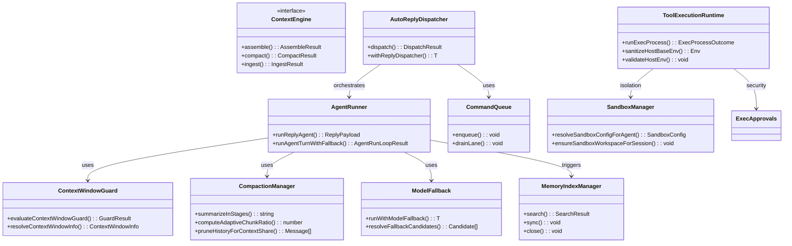
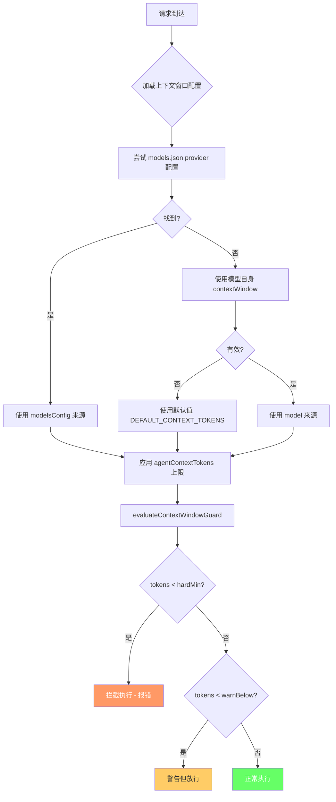
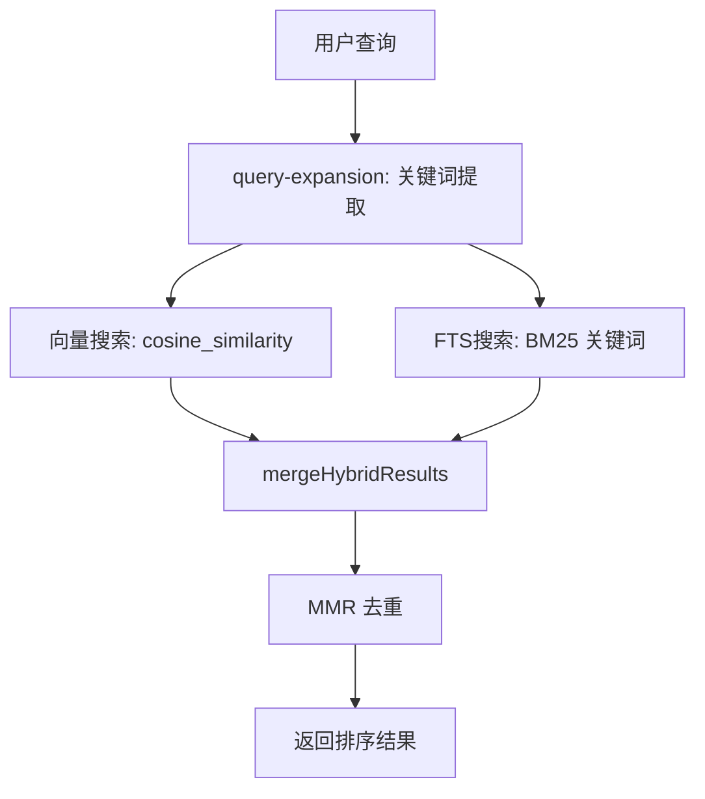
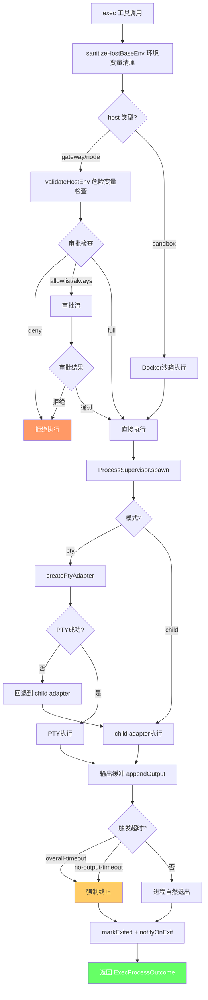
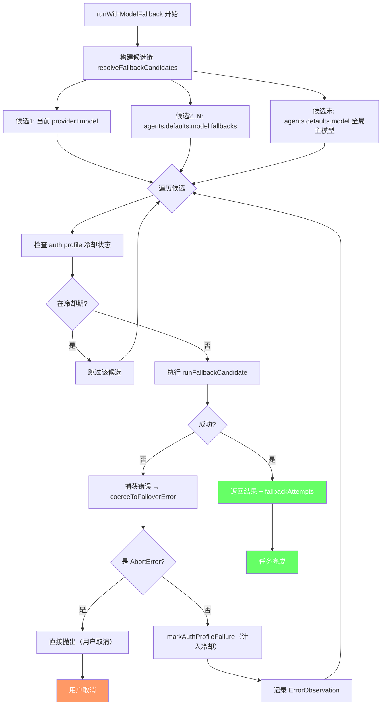
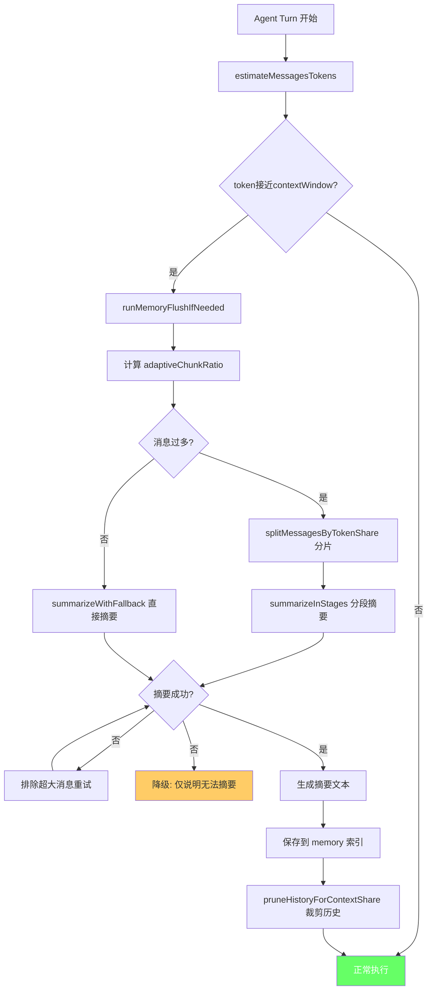
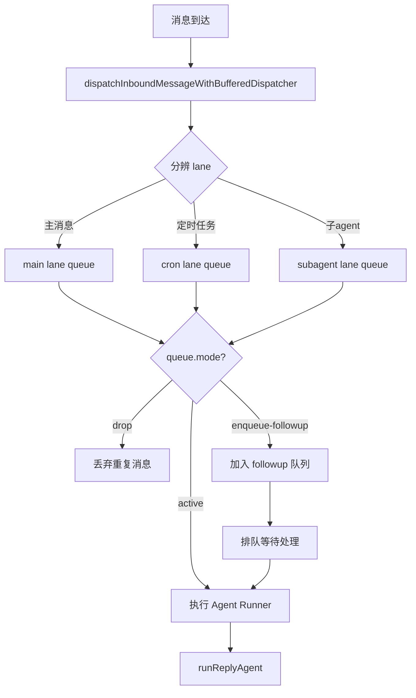
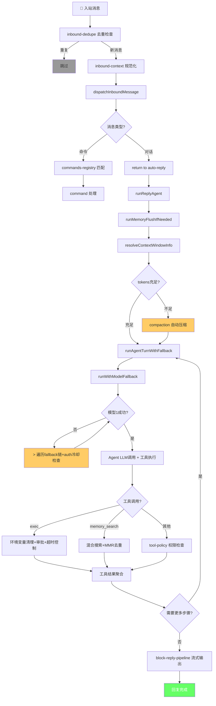

# OpenClaw 任务执行成功率保障——关键设计分析

## 项目整体架构概览

OpenClaw 是一个多通道、多模型的 AI Agent 框架，其核心架构围绕以下模块展开：



---

## 一、Context Window 管理 —— 防溢出设计

### 设计目标
防止上下文超出模型窗口限制导致静默失败或 token 浪费。

### 核心文件
| 文件 | 职责 |
|---|---|
| [context.ts](file:///d:/prj/openclaw_analyze/src/agents/context.ts) | 上下文窗口自动发现和缓存 |
| [context-window-guard.ts](file:///d:/prj/openclaw_analyze/src/agents/context-window-guard.ts) | 窗口大小校验与拦截 |
| [compaction.ts](file:///d:/prj/openclaw_analyze/src/agents/compaction.ts) | 自动压缩/摘要策略 |

### 关键设计

**1. 三级来源的上下文窗口解析**：[context-window-guard.ts:L28-L53](file:///d:/prj/openclaw_analyze/src/agents/context-window-guard.ts#L28-L53)

```typescript
// 优先级: modelsConfig > model > default > agentContextTokens(cap)
export function resolveContextWindowInfo(params: {
  cfg, provider, modelId, modelContextWindow, defaultTokens
}): ContextWindowInfo {
  const fromModelsConfig = /* 从 models.json 配置文件匹配 */;
  const fromModel = /* 从模型对象本身的 contextWindow 属性 */;
  const baseInfo = fromModelsConfig
    ? { tokens: fromModelsConfig, source: "modelsConfig" }
    : fromModel
      ? { tokens: fromModel, source: "model" }
      : { tokens: Math.floor(params.defaultTokens), source: "default" };
  // agent 级别的 contextTokens 作为上限
  const capTokens = normalizePositiveInt(params.cfg?.agents?.defaults?.contextTokens);
  if (capTokens && capTokens < baseInfo.tokens) {
    return { tokens: capTokens, source: "agentContextTokens" };
  }
  return baseInfo;
}
```

**2. 硬限制 + 预警双阈值**：[context-window-guard.ts:L60-L73](file:///d:/prj/openclaw_analyze/src/agents/context-window-guard.ts#L60-L73)

```typescript
const CONTEXT_WINDOW_HARD_MIN_TOKENS = 16_000;   // 低于此值直接拒绝
const CONTEXT_WINDOW_WARN_BELOW_TOKENS = 32_000;  // 低于此值发出警告
```

### 防溢出流程



**3. 安全余量 SAFETY_MARGIN = 1.2**：在 [compaction.ts:L14](file:///d:/prj/openclaw_analyze/src/agents/compaction.ts#L14)，所有 token 估算都乘以 1.2 倍安全系数，因为 `estimateTokens()` 使用 `chars/4` 启发式算法会低估实际 token 数。

**4. 自适应分块比**：在 [compaction.ts:L184-L199](file:///d:/prj/openclaw_analyze/src/agents/compaction.ts#L184-L199)，当平均消息大小超过上下文的 10% 时自动减小分块比例。

---

## 二、Memory（记忆系统）—— 混合检索保障信息完整

### 核心文件
| 文件 | 职责 |
|---|---|
| [manager.ts](file:///d:/prj/openclaw_analyze/src/memory/manager.ts) | MemoryIndexManager 核心类 |
| [manager-search.ts](file:///d:/prj/openclaw_analyze/src/memory/manager-search.ts) | 向量+关键词混合搜索 |
| [hybrid.ts](file:///d:/prj/openclaw_analyze/src/memory/hybrid.ts) | BM25 + 向量混合排序 |
| [mmr.ts](file:///d:/prj/openclaw_analyze/src/memory/mmr.ts) | MMR 去重算法 |
| [query-expansion.ts](file:///d:/prj/openclaw_analyze/src/memory/query-expansion.ts) | 查询扩展 |
| [temporal-decay.ts](file:///d:/prj/openclaw_analyze/src/memory/temporal-decay.ts) | 时间衰减权重 |

### 关键设计

**1. 混合搜索（Hybrid Search）**：结合向量相似度 + BM25 关键词匹配



核心代码在 [manager-search.ts](file:///d:/prj/openclaw_analyze/src/memory/manager-search.ts#L27-L100)，向量和 FTS 分别打分后用 `mergeHybridResults` 融合。

**2. MMR (Maximal Marginal Relevance)** 去重：代码位于 [mmr.ts](file:///d:/prj/openclaw_analyze/src/memory/mmr.ts)，避免返回高度相似的记忆片段。

**3. 文件监控（File Watcher）**：[manager.ts](file:///d:/prj/openclaw_analyze/src/memory/manager.ts#L97-L116) 使用 chokidar 监控 workspace，文件变更自动重索引。

**4. 只读恢复（Read-Only Recovery）**：[manager.ts](file:///d:/prj/openclaw_analyze/src/memory/manager.ts#L119-L124) 当 DB 操作失败时自动降级为只读模式，避免崩溃。

**5. 分批嵌入（Embedding Batch）**：通过 [batch-runner.ts](file:///d:/prj/openclaw_analyze/src/memory/batch-runner.ts) 支持大规模追加时的分批处理和失败重试。

---

## 三、Tool Execution —— 多层安全防护

### 核心文件
| 文件 | 职责 |
|---|---|
| [bash-tools.exec-runtime.ts](file:///d:/prj/openclaw_analyze/src/agents/bash-tools.exec-runtime.ts) | exec 核心运行时 |
| [bash-process-registry.ts](file:///d:/prj/openclaw_analyze/src/agents/bash-process-registry.ts) | 进程会话生命周期管理 |
| [process/supervisor/supervisor.ts](file:///d:/prj/openclaw_analyze/src/process/supervisor/supervisor.ts) | 进程管理器（超时控制） |
| [exec-approvals.ts](file:///d:/prj/openclaw_analyze/src/infra/exec-approvals.ts) | 命令审批机制 |
| [host-env-security.ts](file:///d:/prj/openclaw_analyze/src/infra/host-env-security.ts) | 环境变量安全检查 |
| [sandbox/config.ts](file:///d:/prj/openclaw_analyze/src/agents/sandbox/config.ts) | 沙箱配置解析 |
| [tool-policy.ts](file:///d:/prj/openclaw_analyze/src/agents/tool-policy.ts) | 工具访问策略 |

### 关键设计

**1. 环境变量安全清理**：[bash-tools.exec-runtime.ts:L62-L81](file:///d:/prj/openclaw_analyze/src/agents/bash-tools.exec-runtime.ts#L62-L81)

```typescript
// 清理宿主环境变量：阻止危险变量传播
export function sanitizeHostBaseEnv(env: Record<string, string>): Record<string, string> {
  const sanitized: Record<string, string> = {};
  for (const [key, value] of Object.entries(env)) {
    const upperKey = key.toUpperCase();
    if (upperKey === "PATH") {
      sanitized[key] = value; // PATH 特殊保留
      continue;
    }
    if (isDangerousHostEnvVarName(upperKey)) {
      continue; // 跳过 LD_PRELOAD, DYLD_INSERT_LIBRARIES 等
    }
    sanitized[key] = value;
  }
  return sanitized;
}

// 集中化验证：宿主执行时阻止危险变量与自定义 PATH
export function validateHostEnv(env) {
  for (const key of Object.keys(env)) {
    if (isDangerousHostEnvVarName(key.toUpperCase())) {
      throw new Error(`Security Violation: '${key}' is forbidden`);
    }
    if (key.toUpperCase() === "PATH") {
      throw new Error("Custom 'PATH' is forbidden during host execution");
    }
  }
}
```

**2. 三级安全策略 + 审批机制**：[exec-approvals.ts](file:///d:/prj/openclaw_analyze/src/infra/exec-approvals.ts)

- **deny**：完全拒绝
- **allowlist**：仅白名单通过
- **full**：完全放行

审批策略：
- **off**：不提示
- **on-miss**：白名单未命中时提示
- **always**：始终提示

**3. 进程管理器双超时控制**：[process/supervisor/supervisor.ts:L95-L130](file:///d:/prj/openclaw_analyze/src/process/supervisor/supervisor.ts#L95-L130)

- `overall-timeout`：整个进程的总超时
- `no-output-timeout`：无输出超时（防止挂死）

**4. PTY 失败自动回退到 child 模式**：当 PTY（伪终端）启动失败时自动降级。



**5. 输出缓冲区管理**：[bash-process-registry.ts:L159-L200](file:///d:/prj/openclaw_analyze/src/agents/bash-process-registry.ts#L159-L200)

```typescript
// 输出超过字符上限时自动截断并标记
if (pendingChars > pendingCap) {
  session.truncated = true;
  pendingChars = capPendingBuffer(buffer, pendingChars, pendingCap);
}
```

**6. 沙箱危险操作守卫**：[sandbox/config.ts:L27-L32](file:///d:/prj/openclaw_analyze/src/agents/sandbox/config.ts#L27-L32)

```typescript
const DANGEROUS_SANDBOX_DOCKER_BOOLEAN_KEYS = [
  "dangerouslyAllowReservedContainerTargets",
  "dangerouslyAllowExternalBindSources",
  "dangerouslyAllowContainerNamespaceJoin",
];
```

---

## 四、Model Fallback —— 多级故障转移

### 核心文件
| 文件 | 职责 |
|---|---|
| [model-fallback.ts](file:///d:/prj/openclaw_analyze/src/agents/model-fallback.ts) | 模型 fallback 主逻辑 |
| [failover-error.ts](file:///d:/prj/openclaw_analyze/src/agents/failover-error.ts) | FailoverError 定义与分类 |
| [failover-matches.ts](file:///d:/prj/openclaw_analyze/src/agents/pi-embedded-helpers/failover-matches.ts) | 错误模式匹配 |
| [backoff.ts](file:///d:/prj/openclaw_analyze/src/infra/backoff.ts) | 退避策略 |
| [retry.ts](file:///d:/prj/openclaw_analyze/src/infra/retry.ts) | 重试机制 |

### 关键设计

**1. 错误分类体系**：[failover-error.ts](file:///d:/prj/openclaw_analyze/src/agents/failover-error.ts) 定义了统一的 `FailoverError`：

| FailoverReason | HTTP Status | 含义 |
|---|---|---|
| `billing` | 402 | 余额不足 |
| `rate_limit` | 429 | 限流 |
| `overloaded` | 503 | 服务过载 |
| `auth` | 401 | 认证失败（可恢复） |
| `auth_permanent` | 403 | 认证失败（永久） |
| `timeout` | 408 | 超时 |
| `format` | 400 | 格式错误（需换模型） |
| `model_not_found` | 404 | 模型不存在 |
| `session_expired` | 410 | 会话过期 |

**2. 错误模式匹配引擎**：[failover-matches.ts](file:///d:/prj/openclaw_analyze/src/agents/pi-embedded-helpers/failover-matches.ts) 通过正则表达式和关键词匹配原始错误信息，自动归类。

**3. Fallback 候选链构建**：[model-fallback.ts:L249-L320](file:///d:/prj/openclaw_analyze/src/agents/model-fallback.ts#L249-L320)

```typescript
// Fallback 候选顺序:
// 1. 当前模型（重试）
// 2. agents.defaults.model.fallbacks 配置的 fallback 列表
// 3. agents.defaults.model 全局主模型（兜底）
```

**4. Auth Profile 冷却与探活**：[model-fallback.ts:L322-L380](file:///d:/prj/openclaw_analyze/src/agents/model-fallback.ts#L322-L380)

当主 profile 因认证/限流失败进入冷却期后，系统会定时（>30s间隔）进行探活，一旦恢复自动切回。



**5. 重试 + 指数退避**：[backoff.ts](file:///d:/prj/openclaw_analyze/src/infra/backoff.ts) 和 [retry.ts](file:///d:/prj/openclaw_analyze/src/infra/retry.ts)

```typescript
// compaction 重试策略示例
retryAsync(() => generateSummary(chunk, ...), {
  attempts: 3,
  minDelayMs: 500,
  maxDelayMs: 5000,
  jitter: 0.2,
  shouldRetry: (err) => !(err instanceof Error && err.name === "AbortError"),
});
```

---

## 五、Compaction —— 自动上下文压缩

### 核心文件
| 文件 | 职责 |
|---|---|
| [compaction.ts](file:///d:/prj/openclaw_analyze/src/agents/compaction.ts) | 压缩主逻辑 |
| [agent-runner-memory.ts](file:///d:/prj/openclaw_analyze/src/auto-reply/reply/agent-runner-memory.ts) | Memory Flush 触发逻辑 |

### 关键设计

**1. 分阶段摘要（Staged Summarization）**：[compaction.ts:L324-L377](file:///d:/prj/openclaw_analyze/src/agents/compaction.ts#L324-L377)

当历史消息量过大时，自动拆分多轮摘要：
- 将消息按 token 份额拆分为 N 份
- 每份独立摘要
- 再将 N 个摘要合并为一个最终摘要
- 合并时保留"活跃任务状态、批处理进度、用户最后请求"

**2. 渐进式降级摘要**：[compaction.ts:L251-L319](file:///d:/prj/openclaw_analyze/src/agents/compaction.ts#L251-L319)

```
全量摘要 → 失败?
  ↓ 是
排除超大消息的局部摘要 → 失败?
  ↓ 是
仅记录摘要不可用的说明
```

**3. 标识符保留策略**：[compaction.ts:L31-L49](file:///d:/prj/openclaw_analyze/src/agents/compaction.ts#L31-L49)

```typescript
// strict (默认): 保留所有 UUID、hash、token、API key、hostname 等
// custom: 自定义保留规则
// off: 不保留
const IDENTIFIER_PRESERVATION_INSTRUCTIONS =
  "Preserve all opaque identifiers exactly as written (no shortening or reconstruction)";
```

**4. Memory Flush 触发时机**：[agent-runner-memory.ts](file:///d:/prj/openclaw_analyze/src/auto-reply/reply/agent-runner-memory.ts)

当 token 使用量接近上下文窗口限制时，自动触发 memory flush，将关键对话内容保存到记忆索引中，然后清除旧消息重新开始。



---

## 六、Lane-Based 并发隔离

### 核心文件
| 文件 | 职责 |
|---|---|
| [lanes.ts](file:///d:/prj/openclaw_analyze/src/process/lanes.ts) | 命令通道枚举 |
| [command-queue.ts](file:///d:/prj/openclaw_analyze/src/process/command-queue.ts) | 基于通道的命令队列 |
| [queue.ts](file:///d:/prj/openclaw_analyze/src/auto-reply/reply/queue.ts) | Followup 运行队列 |

### 关键设计

**1. 四通道隔离**：[lanes.ts](file:///d:/prj/openclaw_analyze/src/process/lanes.ts)

```typescript
export const enum CommandLane {
  Main = "main",         // 主消息处理通道
  Cron = "cron",         // 定时任务通道
  Subagent = "subagent", // 子Agent通道
  Nested = "nested",     // 嵌套调用通道
}
```

每个通道独立排队，避免不同来源的任务相互阻塞。Cron 任务不会阻塞主消息响应，子 Agent 不会干扰父 Agent 的 stdin/logs。

**2. 通道清理与排空**：[command-queue.ts](file:///d:/prj/openclaw_analyze/src/process/command-queue.ts)

- `CommandLaneClearedError`：通道被清理时拒绝排队任务
- `GatewayDrainingError`：网关排空期间拒绝新任务
- 支持 `maxConcurrent` 控制通道内并发数



---

## 七、消息去重与上下文规范化

### 核心文件
| 文件 | 职责 |
|---|---|
| [inbound-dedupe.ts](file:///d:/prj/openclaw_analyze/src/auto-reply/reply/inbound-dedupe.ts) | 入站消息去重 |
| [inbound-context.ts](file:///d:/prj/openclaw_analyze/src/auto-reply/reply/inbound-context.ts) | 上下文标准化 |
| [inbound-text.ts](file:///d:/prj/openclaw_analyze/src/auto-reply/reply/inbound-text.ts) | 入站文本清洗 |

### 关键设计

**1. 全局去重缓存**：[inbound-dedupe.ts](file:///d:/prj/openclaw_analyze/src/auto-reply/reply/inbound-dedupe.ts#L34-L40)

```typescript
// 使用 globalThis 跨 chunk 共享，TTL=20min, max=5000
const INBOUND_DEDUPE_CACHE_KEY = Symbol.for("openclaw.inboundDedupeCache");
const inboundDedupeCache = resolveGlobalSingleton(INBOUND_DEDUPE_CACHE_KEY, () =>
  createDedupeCache({ ttlMs: 20 * 60_000, maxSize: 5000 }),
);
```

**2. 多维去重键**：[inbound-dedupe.ts:L43-L67](file:///d:/prj/openclaw_analyze/src/auto-reply/reply/inbound-dedupe.ts#L43-L67)

```typescript
// 去重键 = provider|accountId|sessionScope|peerId|threadId|messageId
const key = [provider, accountId, sessionScope, peerId, threadId, messageId]
  .filter(Boolean).join("|");
```

---

## 八、Block Streaming —— 渐进式回复

### 核心文件
| 文件 | 职责 |
|---|---|
| [block-reply-pipeline.ts](file:///d:/prj/openclaw_analyze/src/auto-reply/reply/block-reply-pipeline.ts) | 流式回复管道 |
| [block-reply-coalescer.ts](file:///d:/prj/openclaw_analyze/src/auto-reply/reply/block-reply-coalescer.ts) | 回复合并器 |
| [block-streaming.ts](file:///d:/prj/openclaw_analyze/src/auto-reply/reply/block-streaming.ts) | 流式配置 |

### 关键设计

**1. 串行发送链**：每个 payload 按顺序发送，前一个完成后才发下一个。使用 `sendChain` Promise 链保证顺序。

**2. 去重 + 超时保护**：
- `sentKeys` / `seenKeys` 双重去重
- `withTimeout` 包裹每个发送操作（默认 15s）

**3. 合并策略（Coalescing）**：短时间内的多个 payload 可合并为一个，减少消息碎片。

---

## 综合：一个完整任务执行的生命周期



---

## 总结：OpenClaw 保障任务成功率的 10 大关键设计

| # | 设计 | 核心保障点 | 关键文件 |
|---|---|---|---|
| 1 | **Context Window Guard** | 硬限制阻断 + 预警阈值，防止静默溢出 | [context-window-guard.ts](file:///d:/prj/openclaw_analyze/src/agents/context-window-guard.ts) |
| 2 | **自动 Compaction** | SAFETY_MARGIN 1.2x + 分阶段摘要 + 渐进降级 | [compaction.ts](file:///d:/prj/openclaw_analyze/src/agents/compaction.ts) |
| 3 | **Model Fallback** | 多级候选链 + auth profile 冷却 + 探活恢复 | [model-fallback.ts](file:///d:/prj/openclaw_analyze/src/agents/model-fallback.ts) |
| 4 | **环境变量安全** | 危险变量过滤 + PATH劫持阻止 + fail-closed | [bash-tools.exec-runtime.ts](file:///d:/prj/openclaw_analyze/src/agents/bash-tools.exec-runtime.ts) |
| 5 | **三层审批** | deny/allowlist/full + off/on-miss/always | [exec-approvals.ts](file:///d:/prj/openclaw_analyze/src/infra/exec-approvals.ts) |
| 6 | **双超时控制** | overall-timeout + no-output-timeout 防止挂死 | [supervisor.ts](file:///d:/prj/openclaw_analyze/src/process/supervisor/supervisor.ts) |
| 7 | **PTY 降级** | PTY失败自动回退到 child_process | [supervisor.ts](file:///d:/prj/openclaw_analyze/src/process/supervisor/supervisor.ts) |
| 8 | **Lane 隔离** | 4通道独立队列，避免任务互相阻塞 | [command-queue.ts](file:///d:/prj/openclaw_analyze/src/process/command-queue.ts) |
| 9 | **消息去重** | 全局跨chunk去重，20min TTL | [inbound-dedupe.ts](file:///d:/prj/openclaw_analyze/src/auto-reply/reply/inbound-dedupe.ts) |
| 10 | **混合记忆搜索** | vector + BM25 + MMR去重 + 时间衰减 | [manager-search.ts](file:///d:/prj/openclaw_analyze/src/memory/manager-search.ts) |