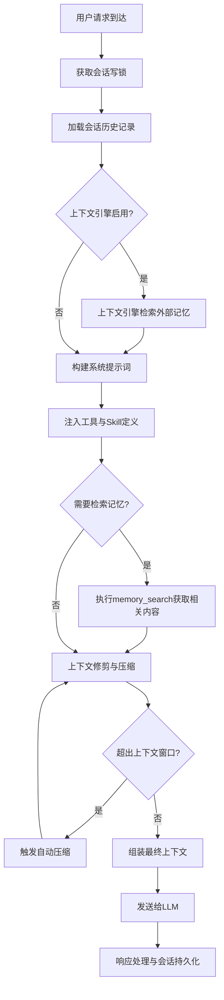

# OpenClaw 会话上下文组装与记忆使用流程分析

OpenClaw的上下文组装采用**分层加载、动态扩展、智能优化**的架构，将会话历史、系统提示、工具定义、外部记忆等多源信息动态整合为LLM可识别的格式，同时通过压缩、修剪等机制优化上下文窗口使用效率。

---

## 🔍 完整流程总览
### 🎨 上下文组装流程图


---

## 📋 各阶段详细实现分析

### 📍 1. 会话初始化与锁获取
**执行时机**：每个请求处理开始时
**核心目标**：保证并发场景下会话数据一致性，避免文件损坏
**实现逻辑**：
- 每个会话同一时间只允许一个请求处理
- 自动修复损坏的会话文件
- 会话管理器负责历史消息的持久化和加载
**核心代码**：
```typescript
// 来自 src/agents/pi-embedded-runner/run/attempt.ts
// 获取会话写锁：防止多个请求同时修改同一个会话文件
const sessionLock = await acquireSessionWriteLock({
  sessionFile: params.sessionFile,
  maxHoldMs: resolveSessionLockMaxHoldFromTimeout({
    timeoutMs: params.timeoutMs,
  }),
});

// 如果会话文件损坏，自动尝试修复
await repairSessionFileIfNeeded({
  sessionFile: params.sessionFile,
  warn: (message) => log.warn(message),
});

// 创建会话管理器，负责会话历史的持久化和管理
sessionManager = guardSessionManager(SessionManager.open(params.sessionFile), {
  agentId: sessionAgentId,
  sessionKey: params.sessionKey,
  inputProvenance: params.inputProvenance,
  allowedToolNames, // 只允许使用白名单内的工具
});
```
**代码跳转**：
- [acquireSessionWriteLock](../src/agents/pi-embedded-runner/run/attempt.ts#L1713-L1721)
- [repairSessionFileIfNeeded](../src/agents/pi-embedded-runner/run/attempt.ts#L1727-L1730)
- [guardSessionManager](../src/agents/pi-embedded-runner/run/attempt.ts#L1743-L1749)
**相关文件**：
- [src/agents/pi-embedded-runner/run/attempt.ts](../src/agents/pi-embedded-runner/run/attempt.ts) - 会话初始化核心逻辑

---

### 📍 2. 会话历史加载
**执行时机**：会话初始化后
**核心目标**：加载完整的对话历史，构建对话上下文
**存储格式**：
- 每个会话对应一个JSONL文件：`~/.openclaw/sessions/<sessionId>.jsonl`
- 每条记录包含用户消息、助手回复、工具调用、工具结果等完整信息
- 支持压缩记录，大幅减少历史消息占用空间
**核心代码**：
```typescript
// 来自 src/config/sessions/transcript.ts
async function resolveSessionTranscriptFile(params: ResolveSessionTranscriptFileParams) {
  const sessionPathOpts = resolveSessionFilePathOptions({
    agentId: params.agentId,
    storePath: params.storePath,
  });
  let sessionFile = resolveSessionFilePath(params.sessionId, params.sessionEntry, sessionPathOpts);
  
  // 解析并持久化会话文件
  const resolvedSessionFile = await resolveAndPersistSessionFile({
    sessionId: params.sessionId,
    sessionKey: params.sessionKey,
    sessionStore: params.sessionStore,
    storePath: params.storePath,
    sessionEntry: params.sessionEntry,
    agentId: sessionPathOpts?.agentId,
    sessionsDir: path.dirname(storePath),
  });
  
  // 确保会话文件头存在
  await ensureSessionHeader({ 
    sessionFile: resolvedSessionFile.sessionFile, 
    sessionId: params.sessionId 
  });
  
  // 加载会话历史
  const sessionManager = SessionManager.open(resolvedSessionFile.sessionFile);
  return sessionManager.getMessages();
}
```
**代码跳转**：
- [resolveSessionTranscriptFile](../src/config/sessions/transcript.ts#L69-L123)
- [resolveAndPersistSessionFile](../src/config/sessions/session-file.ts#L45-L120)
- [ensureSessionHeader](../src/config/sessions/transcript.ts#L38-L67)
**相关文件**：
- [src/config/sessions/transcript.ts](../src/config/sessions/transcript.ts) - 会话历史加载与持久化

---

### 📍 3. 外部记忆检索（RAG阶段）
**执行时机**：会话历史加载后，系统提示构建前
**核心目标**：自动检索相关的外部记忆，注入到上下文中
**两种检索模式**：
1. **被动自动检索**：上下文引擎自动根据当前query和历史消息，检索相关的工作区记忆、全局记忆
2. **主动工具检索**：LLM自主判断需要检索记忆时，调用`memory_search`工具获取相关内容
**核心代码（自动检索）**：
```typescript
// 来自 src/agents/pi-embedded-runner/run/attempt.ts
if (params.contextEngine) {
  try {
    // 上下文引擎自动检索相关的外部知识
    const assembled = await params.contextEngine.assemble({
      sessionId: params.sessionId,
      messages: activeSession.messages,
      tokenBudget: params.contextTokenBudget,
    });
    
    // 替换为包含记忆的消息列表
    if (assembled.messages !== activeSession.messages) {
      activeSession.agent.replaceMessages(assembled.messages);
    }
    
    // 添加系统提示补充
    if (assembled.systemPromptAddition) {
      systemPromptText = prependSystemPromptAddition({
        systemPrompt: systemPromptText,
        systemPromptAddition: assembled.systemPromptAddition,
      });
      applySystemPromptOverrideToSession(activeSession, systemPromptText);
    }
  } catch (err) {
    log.warn(`context engine assemble failed: ${String(err)}`);
  }
}
```
**代码跳转（自动检索）**：
- [contextEngine.assemble](../src/agents/pi-embedded-runner/run/attempt.ts#L2111-L2135)

**核心代码（主动检索）**：
```typescript
// 来自 memory-core 扩展
async function memorySearch(query: string, limit: number = 5) {
  // 并行执行向量搜索和全文搜索
  const [vectorResults, ftsResults] = await Promise.all([
    vectorSearch(query, { limit: limit * 4 }),
    ftsSearch(query, { limit: limit * 4 })
  ]);
  
  // 归一化分数并加权合并
  const normalizedVector = normalizeScores(vectorResults);
  const normalizedFts = normalizeScores(ftsResults);
  const merged = mergeResults(normalizedVector, normalizedFts, {
    vectorWeight: 0.7,
    textWeight: 0.3
  });
  
  // 返回Top N结果，自动加入上下文
  return merged.slice(0, limit);
}
```
**相关文件**：
- [src/agents/context-engine.ts](../src/agents/context-engine.ts) - 上下文引擎接口
- [extensions/memory-core] - 记忆检索扩展（本地扩展目录）
---

### 📍 4. 系统提示词构建
**执行时机**：上下文检索完成后
**核心目标**：构建包含系统规则、工具定义、Skill信息、环境信息的系统提示
**系统提示组成部分**：
1. 基础身份与角色定义
2. 工具使用规范与工具定义
3. Skill使用指南与可用Skill列表
4. 环境信息（OS、工作区、权限等）
5. 安全规则与输出格式要求
**核心代码**：
```typescript
// 来自 src/agents/system-prompt.ts
export function buildAgentSystemPrompt(params: BuildSystemPromptParams): string {
  const sections = [];
  
  // 1. 基础身份与核心规则
  sections.push(buildIdentitySection(params));
  
  // 2. 工具定义与使用规范
  sections.push(buildToolsSection(params.tools));
  
  // 3. Skill使用指南与可用Skill
  sections.push(buildSkillsSection(params));
  
  // 4. 环境信息
  sections.push(buildRuntimeInfoSection(params.runtimeInfo));
  
  // 5. 安全与输出规则
  sections.push(buildSecurityRulesSection());
  
  return sections.join("\n\n");
}
```
**代码跳转**：
- [buildAgentSystemPrompt](../src/agents/system-prompt.ts#L189-L235)
**相关文件**：
- [src/agents/system-prompt.ts](../src/agents/system-prompt.ts) - 系统提示构建核心实现

---

### 📍 5. 上下文优化（修剪与压缩）
**执行时机**：上下文发送给LLM前
**核心目标**：优化上下文窗口使用，避免溢出
**优化手段**：
1. **工具结果修剪**：自动裁剪过长的工具执行结果，保留关键信息
2. **历史压缩**：自动将旧消息总结为更短的摘要，减少token占用
3. **硬清除**：删除过期的、不再相关的工具结果和历史消息
**核心代码（自动压缩）**：
```typescript
// 来自 src/agents/compaction.ts
async function runCompaction(
  entries: SessionEntry[],
  tokenLimit: number
): Promise<SessionEntry[]> {
  // 1. 过滤需要压缩的旧消息
  const oldEntries = entries.filter(e => isOldEnoughForCompaction(e));
  const recentEntries = entries.filter(e => !isOldEnoughForCompaction(e));
  
  // 2. 调用LLM总结旧消息
  const summary = await generateSummary(oldEntries);
  
  // 3. 创建压缩记录
  const compactionEntry: SessionEntry = {
    id: generateId(),
    type: "compaction",
    content: summary,
    timestamp: Date.now(),
    entriesCount: oldEntries.length
  };
  
  // 4. 拼接压缩后的历史
  const compactedEntries = [compactionEntry, ...recentEntries];
  
  // 5. 若压缩后仍超出token限制且还有可压缩内容，递归执行压缩
  if (countTokens(compactedEntries) > tokenLimit && recentEntries.length > 3) {
    return runCompaction(compactedEntries, tokenLimit);
  }
  
  return compactedEntries;
}
```
**触发条件**：
- 上下文token数 > 模型上下文窗口 - 保留token数（默认预留2000token）
- 捕获到上下文溢出错误
- 用户手动执行`/compact`命令
**相关文件**：
- [src/agents/compaction.ts](../src/agents/compaction.ts) - 上下文压缩实现
- [src/agents/context-pruning.ts](../src/agents/context-pruning.ts) - 工具结果修剪实现

---

### 📍 6. 发送给LLM与响应处理
**执行时机**：上下文组装完成后
**核心目标**：将组装好的上下文发送给LLM，并处理返回结果
**核心代码**：
```typescript
// 来自 src/agents/pi-embedded-runner/run/attempt.ts
// 调用LLM模型，支持流式输出
const response = await session.chat.completions.create({
  model: params.model,
  messages: session.messages, // 完整上下文：系统提示 + 历史消息 + 当前query
  stream: true,
  temperature: params.temperature,
  max_tokens: params.maxTokens,
  tools: availableTools, // 工具定义
  tool_choice: params.toolChoice,
});

let fullResponse = '';
const toolCalls = [];

// 处理流式响应
for await (const chunk of response) {
  const delta = chunk.choices[0].delta;
  
  // 处理文本增量
  if (delta.content) {
    fullResponse += delta.content; // 累加完整响应内容
    params.onPartialResponse?.({
      text: delta.content,
      type: "text"
    });
  }
  
  // 处理工具调用增量
  if (delta.tool_calls) {
    toolCalls.push(...delta.tool_calls);
  }
}

// 会话持久化：将新的回复和工具调用加入会话历史
await sessionManager.append([
  {
    role: "assistant",
    content: fullResponse,
    tool_calls: toolCalls.length > 0 ? toolCalls : undefined,
    timestamp: Date.now()
  }
]);
```
**相关文件**：
- [src/agents/pi-embedded-runner/run/attempt.ts](../src/agents/pi-embedded-runner/run/attempt.ts) - LLM调用核心逻辑

---

## 🔄 记忆数据的两种使用模式
### 模式1：被动注入（自动RAG）
```
系统自动检索 → 记忆内容注入到系统提示或历史消息 → LLM直接感知到记忆内容
```
**适用场景**：通用上下文注入、项目文档、工作区笔记等无需用户明确指令的知识
### 模式2：主动检索（工具调用）
```
LLM判断需要额外信息 → 调用memory_search工具 → 系统执行检索 → 结果作为工具返回加入上下文 → LLM整合记忆内容生成回复
```
**适用场景**：特定问题查询、精准信息检索、需要明确相关性的场景

---

## ⚙️ 可配置参数
用户可以通过`openclaw.json`调整上下文行为：
```json5
{
  "agents": {
    "defaults": {
      "contextWindow": 128000, // 模型上下文窗口大小
      "reserveTokens": 2000, // 预留响应token数
      "compaction": {
        "enabled": true, // 启用自动压缩
        "memoryFlush": true // 压缩前自动刷新记忆
      },
      "contextPruning": {
        "enabled": true, // 启用工具结果修剪
        "maxToolResultLength": 2000 // 工具结果最大长度
      },
      "memorySearch": {
        "enabled": true, // 启用记忆检索
        "autoInject": true, // 自动注入检索结果
        "topK": 5 // 返回记忆结果数量
      }
    }
  }
}
```

---

## 🔗 核心实现文件汇总
| 文件路径 | 核心功能 |
|----------|----------|
| [src/agents/pi-embedded-runner/run/attempt.ts](../src/agents/pi-embedded-runner/run/attempt.ts) | 上下文组装主流程 |
| [src/agents/system-prompt.ts](../src/agents/system-prompt.ts) | 系统提示词构建 |
| [src/config/sessions/transcript.ts](../src/config/sessions/transcript.ts) | 会话历史加载与持久化 |
| [src/agents/compaction.ts](../src/agents/compaction.ts) | 上下文压缩实现 |
| [extensions/memory-core](../extensions/memory-core) | 记忆检索扩展 |
| [src/agents/context-engine.ts](../src/agents/context-engine.ts) | 外部上下文注入 |
| [src/agents/context-pruning.ts](../src/agents/context-pruning.ts) | 上下文修剪实现 |

这种架构既保证了上下文的完整性和丰富性，又通过智能优化机制最大化了上下文窗口的使用效率，同时支持灵活扩展外部记忆源。
