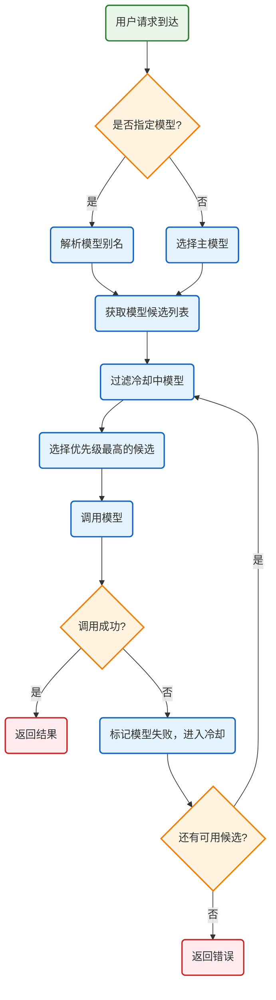
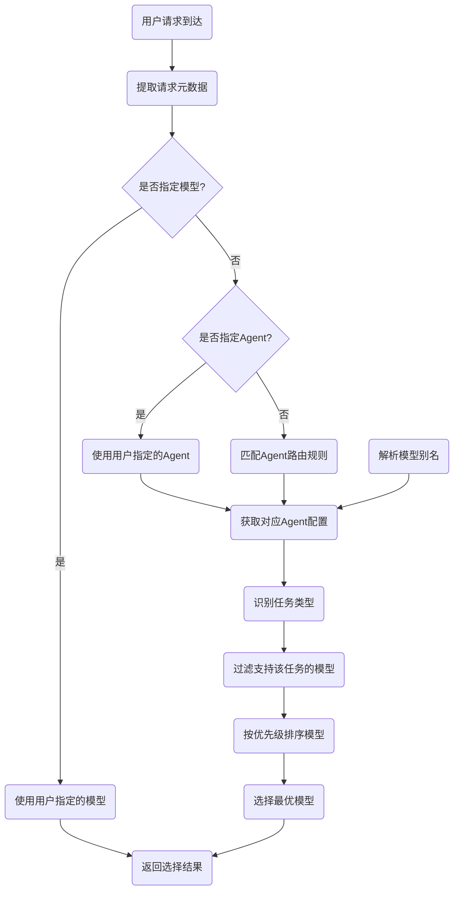

# OpenClaw 多模型调度机制分析

OpenClaw支持多模型混合调度，通过**模型别名、智能路由、自动降级、负载均衡、多账户轮询**五大核心机制，实现高可用、高性能的模型调用。

---

## 🔍 核心调度机制总览
| 机制 | 核心功能 | 应用场景 |
|------|----------|----------|
| **模型别名系统** | 统一模型引用方式，屏蔽底层实现差异 | 用户配置、Skill定义中使用别名，无需关心具体模型ID |
| **智能路由策略** | 根据任务类型、模型能力、成本自动选择最优模型 | 推理任务、编码任务、工具调用任务自动匹配最合适模型 |
| **自动降级机制** | 主模型调用失败时自动切换到备用模型 | 模型服务不可用、配额耗尽、超时等异常场景 |
| **负载均衡** | 自动分配流量到不同模型/账户，避免限流 | 高并发场景、多账户配置场景 |
| **冷却机制** | 临时故障的模型自动进入冷却期，避免反复调用失败 | 模型临时故障、限流、配额耗尽场景 |

---

## 📋 完整调度流程
### 🎨 多模型调度流程图


---

## 🔧 核心机制详细分析

### 📍 1. 模型别名系统
**核心定位**：统一模型引用方式，实现配置与具体模型解耦
**实现逻辑**：
- 用户可以在配置中定义模型别名，如`"coding": "anthropic/claude-3-5-sonnet"`
- 系统在运行时自动将别名解析为真实的provider和model ID
- 支持全局别名和Agent级别名，优先级：Agent别名 > 全局别名
**核心代码**：
```typescript
// 来自 src/agents/model-selection.ts
export type ModelAliasIndex = {
  byAlias: Map<string, { alias: string; ref: ModelRef }>;
  byKey: Map<string, string[]>;
};

// 解析模型别名
export function resolveModelRefFromString(
  input: string,
  aliasIndex?: ModelAliasIndex
): ModelRef {
  // 1. 检查是否是别名
  const aliasKey = normalizeAliasKey(input);
  if (aliasIndex?.byAlias.has(aliasKey)) {
    return aliasIndex.byAlias.get(aliasKey)!.ref;
  }
  
  // 2. 解析provider/model格式
  const [provider, ...modelParts] = input.split("/");
  if (modelParts.length > 0) {
    return {
      provider: normalizeProviderId(provider),
      model: modelParts.join("/")
    };
  }
  
  // 3. 默认provider
  return {
    provider: DEFAULT_PROVIDER,
    model: input
  };
}
```
**相关文件**：
- [src/agents/model-selection.ts](file:///d:/prj/openclaw_analyze/src/agents/model-selection.ts) - 模型选择与别名解析

---

### 📍 2. 智能路由策略
**核心定位**：根据任务类型自动选择最优模型
**路由规则**：
1. **任务类型匹配**：
   - 编码任务：优先选择编码能力强的模型（如Claude 3.5 Sonnet、GPT-4o）
   - 推理任务：优先选择推理能力强的模型（如GPT-4o、Claude Opus）
   - 工具调用任务：优先选择工具调用能力好的模型（如GPT-4o Mini、Claude 3.5 Haiku）
   - 嵌入任务：自动选择对应的嵌入模型（如bge-m3、text-embedding-3-small）
2. **成本优先策略**：在能力满足需求的情况下优先选择成本更低的模型
3. **速度优先策略**：需要快速响应的场景优先选择速度更快的小模型
4. **配置指定**：用户明确指定模型时优先使用用户配置

#### 核心类与数据结构
```typescript
// 模型引用基础类型，唯一标识一个模型
export type ModelRef = {
  provider: string;  // 模型提供者（如anthropic、openai、qwen）
  model: string;     // 模型ID（如claude-3-5-sonnet、gpt-4o）
};

// 模型别名索引，实现别名到真实模型的映射
export type ModelAliasIndex = {
  byAlias: Map<string, { alias: string; ref: ModelRef }>; // 别名到模型的映射
  byKey: Map<string, string[]>; // 模型到别名的反向映射
};

// Agent配置，每个Agent可以有独立的模型、技能、工作区配置
export type AgentConfig = {
  id: string;                      // Agent唯一标识
  name?: string;                   // 显示名称
  workspace?: string;              // 工作区路径
  model?: AgentModelConfig;        // 专属模型配置
  skills?: string[];               // 允许使用的技能列表
  tools?: AgentToolsConfig;        // 允许使用的工具列表
};

// 路由绑定，定义消息到Agent的路由规则
export type AgentBinding = {
  agentId: string;                 // 目标Agent ID
  match: {                         // 匹配条件
    channel?: string;              // 渠道匹配（whatsapp、telegram、discord等）
    accountId?: string;            // 账户ID匹配
    peer?: { kind: string; id: string }; // 联系人/群组匹配
    guildId?: string;              // Discord服务器ID匹配
    teamId?: string;               // Slack团队ID匹配
    roles?: string[];              // 用户角色匹配
  };
};
```

#### 核心实现代码
**1. 模型别名解析**
```typescript
// 解析模型引用，支持别名自动转换
export function resolveModelRefFromString(params: {
  raw: string;
  defaultProvider: string;
  aliasIndex?: ModelAliasIndex;
}): { ref: ModelRef; alias?: string } | null {
  const { model } = splitTrailingAuthProfile(params.raw);
  if (!model) return null;
  
  // 先尝试匹配别名
  if (!model.includes("/")) {
    const aliasKey = normalizeAliasKey(model);
    const aliasMatch = params.aliasIndex?.byAlias.get(aliasKey);
    if (aliasMatch) {
      return { ref: aliasMatch.ref, alias: aliasMatch.alias };
    }
  }
  
  // 解析provider/model格式
  const parsed = parseModelRef(model, params.defaultProvider);
  if (!parsed) return null;
  return { ref: parsed };
}
```

**2. Agent路由匹配算法**
```typescript
// 按优先级匹配路由规则，返回最合适的Agent
export function matchBinding(
  message: IncomingMessage,
  bindings: AgentBinding[]
): AgentBinding | null {
  // 匹配优先级从高到低
  const matchers = [
    // 1. 精确联系人匹配（最高优先级）
    (b: AgentBinding) => 
      b.match.peer?.id === message.peerId &&
      b.match.peer?.kind === message.peerKind,
    
    // 2. 父级会话匹配（线程继承）
    (b: AgentBinding) =>
      b.match.parentPeer?.id === message.parentPeerId,
    
    // 3. Discord服务器+角色匹配
    (b: AgentBinding) =>
      b.match.guildId === message.guildId &&
      b.match.roles?.some(r => message.roles?.includes(r)),
    
    // 4. Discord服务器匹配
    (b: AgentBinding) => b.match.guildId === message.guildId,
    
    // 5. Slack团队匹配
    (b: AgentBinding) => b.match.teamId === message.teamId,
    
    // 6. 账户ID匹配
    (b: AgentBinding) => b.match.accountId === message.accountId,
    
    // 7. 渠道级通配匹配
    (b: AgentBinding) =>
      b.match.channel === message.channel &&
      b.match.accountId === "*",
    
    // 8. 渠道匹配
    (b: AgentBinding) => b.match.channel === message.channel,
  ];
  
  for (const matcher of matchers) {
    const match = bindings.find(matcher);
    if (match) return match;
  }
  
  // 回退到默认Agent
  return bindings.find(b => b.agentId === "main") ?? bindings[0];
}
```

**3. 智能路由决策逻辑**
```typescript
// 根据任务类型和模型能力选择最优模型
export function selectOptimalModel(params: {
  taskType: "coding" | "reasoning" | "tool_calling" | "embedding";
  availableModels: ModelCatalogEntry[];
  priority: "cost" | "speed" | "quality";
}): ModelRef | null {
  // 1. 按任务类型过滤支持的模型
  const filtered = availableModels.filter(model => {
    switch (params.taskType) {
      case "coding":
        return model.capabilities.includes("code-generation") &&
               model.capabilities.includes("code-analysis");
      case "reasoning":
        return model.capabilities.includes("logical-reasoning") &&
               model.capabilities.includes("problem-solving");
      case "tool_calling":
        return model.capabilities.includes("tool-use") &&
               model.capabilities.includes("function-calling");
      case "embedding":
        return model.type === "embedding";
      default:
        return true;
    }
  });
  
  if (filtered.length === 0) return null;
  
  // 2. 按优先级排序
  return filtered.sort((a, b) => {
    switch (params.priority) {
      case "cost":
        return a.costPerToken - b.costPerToken; // 优先成本低的
      case "speed":
        return a.latency - b.latency; // 优先速度快的
      case "quality":
        return b.qualityScore - a.qualityScore; // 优先质量高的
      default:
        return 0;
    }
  })[0];
}
```

#### 智能路由流程图


---

### 📍 3. 自动降级（Failover）机制
**核心定位**：主模型调用失败时自动切换到备用模型，保证服务可用性
**降级触发条件**：
- 模型服务不可用（5xx错误）
- 配额耗尽（429错误）
- 调用超时
- 上下文溢出
- 权限错误
**核心实现**：
```typescript
// 来自 src/agents/model-fallback.ts
export async function runWithModelFallback<T>(params: {
  primaryModel: ModelRef;
  fallbacks: ModelRef[];
  run: ModelFallbackRunFn<T>;
  onError?: ModelFallbackErrorHandler;
}): Promise<ModelFallbackRunResult<T>> {
  const attempts: FallbackAttempt[] = [];
  const candidates = [params.primaryModel, ...params.fallbacks];
  
  for (let i = 0; i < candidates.length; i++) {
    const { provider, model } = candidates[i];
    
    // 检查模型是否在冷却期
    if (isProfileInCooldown(provider, model)) {
      attempts.push({
        provider,
        model,
        error: "model in cooldown",
        skipped: true
      });
      continue;
    }
    
    try {
      // 调用模型
      const result = await params.run(provider, model);
      
      // 调用成功
      return buildFallbackSuccess({
        result,
        provider,
        model,
        attempts
      });
    } catch (err) {
      // 处理错误
      const failoverError = coerceToFailoverError(err, { provider, model });
      
      attempts.push({
        provider,
        model,
        error: failoverError,
        skipped: false
      });
      
      // 标记模型进入冷却期
      addToCooldown(provider, model, failoverError.retryAfter);
      
      // 调用错误回调
      if (params.onError) {
        await params.onError({
          provider,
          model,
          error: err,
          attempt: i + 1,
          total: candidates.length
        });
      }
      
      // 用户主动终止，不继续降级
      if (isFallbackAbortError(err)) {
        throw err;
      }
    }
  }
  
  // 所有候选都失败
  throw new Error(`All models failed: ${describeFailoverAttempts(attempts)}`);
}
```
**相关文件**：
- [src/agents/model-fallback.ts](file:///d:/prj/openclaw_analyze/src/agents/model-fallback.ts) - 模型降级核心实现

---

### 📍 4. 负载均衡与冷却机制
**核心定位**：避免单个模型/账户被限流，提升整体吞吐量
**实现逻辑**：
1. **多账户轮询**：同一模型配置了多个API密钥时，自动轮询使用不同账户
2. **冷却机制**：调用失败的模型/账户自动进入冷却期（默认30秒，可根据Retry-After头调整）
3. **配额感知**：自动追踪各模型/账户的配额使用情况，优先使用剩余配额多的账户
**核心代码**：
```typescript
// 来自 src/agents/auth-profiles.ts
function resolveAuthProfileOrder(provider: string, model: string): AuthProfile[] {
  const profiles = getProviderProfiles(provider);
  
  // 过滤掉冷却中的profile
  const availableProfiles = profiles.filter(profile => 
    !isProfileInCooldown(profile.id)
  );
  
  // 按优先级排序：
  // 1. 剩余配额多的优先
  // 2. 最近使用时间早的优先（轮询）
  // 3. 错误率低的优先
  return availableProfiles.sort((a, b) => {
    if (a.remainingQuota !== b.remainingQuota) {
      return b.remainingQuota - a.remainingQuota;
    }
    if (a.lastUsedTime !== b.lastUsedTime) {
      return a.lastUsedTime - b.lastUsedTime;
    }
    return a.errorRate - b.errorRate;
  });
}

// 添加到冷却
function addToCooldown(provider: string, model: string, retryAfter: number = 30_000) {
  const key = `${provider}/${model}`;
  cooldownMap.set(key, Date.now() + retryAfter);
}

// 检查是否在冷却期
function isProfileInCooldown(profileId: string): boolean {
  const expireTime = cooldownMap.get(profileId);
  if (!expireTime) return false;
  if (Date.now() > expireTime) {
    cooldownMap.delete(profileId);
    return false;
  }
  return true;
}
```

---

### 📍 5. 模型配置示例
用户可以通过`openclaw.json`配置多模型和降级策略：
```json5
{
  "agents": {
    "defaults": {
      "model": "anthropic/claude-3-5-sonnet", // 主模型
      "modelFallback": [ // 降级候选列表，按优先级排序
        "openai/gpt-4o",
        "anthropic/claude-3-5-haiku",
        "openai/gpt-4o-mini"
      ],
      "modelAliases": { // 模型别名
        "coding": "anthropic/claude-3-5-sonnet",
        "fast": "openai/gpt-4o-mini",
        "reasoning": "openai/o1-preview"
      },
      "providers": { // 多账户配置
        "anthropic": [
          {"apiKey": "sk-ant-xxx1"},
          {"apiKey": "sk-ant-xxx2"},
          {"apiKey": "sk-ant-xxx3"}
        ],
        "openai": [
          {"apiKey": "sk-xxx1"},
          {"apiKey": "sk-xxx2"}
        ]
      }
    }
  }
}
```

---

## 🔗 核心实现文件汇总
| 文件路径 | 核心功能 |
|----------|----------|
| [src/agents/model-selection.ts](file:///d:/prj/openclaw_analyze/src/agents/model-selection.ts) | 模型选择、别名解析、标准化 |
| [src/agents/model-fallback.ts](file:///d:/prj/openclaw_analyze/src/agents/model-fallback.ts) | 模型自动降级、故障切换 |
| [src/agents/auth-profiles.ts](file:///d:/prj/openclaw_analyze/src/agents/auth-profiles.ts) | 多账户轮询、冷却机制 |
| [src/config/model-input.ts](file:///d:/prj/openclaw_analyze/src/config/model-input.ts) | 模型配置解析 |
| [src/agents/failover-error.ts](file:///d:/prj/openclaw_analyze/src/agents/failover-error.ts) | 故障错误识别与分类 |

这种调度机制既保证了模型调用的高可用性，又能根据场景智能选择最优模型，同时支持水平扩展以应对高并发场景。
