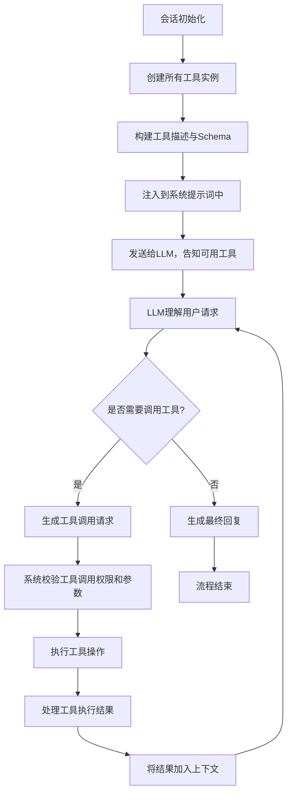

# OpenClaw 工具调用流程与LLM交互机制分析

## 🔍 完整流程总览
### 工具调用全生命周期流程图


---

## 📋 各阶段详细分析

### 阶段1：会话初始化 - 工具实例创建
#### 时机：会话创建时，在`runEmbeddedAttempt`函数中执行
#### 功能：创建所有可用工具的实例，应用权限控制和安全策略
#### 核心代码：
```typescript
// 文件：src/agents/pi-embedded-runner/run/attempt.ts
const toolsRaw = params.disableTools
  ? []
  : createOpenClawCodingTools({
      agentId: sessionAgentId,
      exec: {
        ...params.execOverrides,
        elevated: params.bashElevated,
      },
      sandbox,
      // ... 工具配置参数
    });

// 过滤当前模型支持的工具
const toolsEnabled = supportsModelTools(params.model);
const tools = sanitizeToolsForGoogle({
  tools: toolsEnabled ? toolsRaw : [],
  provider: params.provider,
});
```
#### 说明：
- 通过`createOpenClawCodingTools()`统一创建所有内置工具实例
- 根据模型能力和配置过滤工具（如Google模型需要特殊格式适配）
- 应用工具权限策略（allow/deny配置、工作区隔离、沙箱限制等）

---

### 阶段2：系统提示构建 - 告知LLM可用工具
#### 时机：系统提示词组装时，在模型调用前执行
#### 功能：将工具的名称、功能、参数格式等信息注入到系统提示中，让LLM知道有哪些工具可用以及如何使用
#### 核心代码：
```typescript
// 文件：src/agents/pi-embedded-runner/system-prompt.ts
export function buildEmbeddedSystemPrompt(params: BuildEmbeddedSystemPromptParams) {
  return buildAgentSystemPrompt({
    workspaceDir: params.workspaceDir,
    toolNames: params.tools.map((tool) => tool.name),
    toolSummaries: buildToolSummaryMap(params.tools), // 构建工具摘要
    // ... 其他提示参数
  });
}

// 文件：src/agents/tool-summaries.ts
export function buildToolSummaryMap(tools: AnyAgentTool[]): Record<string, string> {
  const summaries: Record<string, string> = {};
  for (const tool of tools) {
    const summary = tool.description?.trim() || tool.label?.trim();
    if (!summary) continue;
    summaries[tool.name.toLowerCase()] = summary;
  }
  return summaries;
}
```
#### 系统提示中工具部分的示例格式：
```xml
<available_tools>
  <tool>
    <name>read</name>
    <description>读取文件内容，支持文本、图片等多种格式</description>
    <parameters>
      <parameter name="path" type="string" description="文件路径" required="true" />
      <parameter name="offset" type="number" description="开始行号" required="false" />
    </parameters>
  </tool>
  <tool>
    <name>exec</name>
    <description>执行系统命令和Shell脚本</description>
    <parameters>
      <parameter name="command" type="string" description="要执行的命令" required="true" />
    </parameters>
  </tool>
  <!-- 其他工具... -->
</available_tools>

<instructions>
当需要获取信息或执行操作时，可以调用上述工具。调用格式为：
<|FunctionCallBegin|>[{"name":"工具名","parameters":{"参数名":"参数值"}}]<|FunctionCallEnd|>
</instructions>
```
#### 说明：
- 工具信息会被格式化为LLM容易理解的结构化格式（XML/JSON）
- 包含每个工具的功能描述、参数 schema、使用说明
- 同时会明确告知LLM工具调用的格式要求

---

### 阶段3：LLM推理 - 决策是否调用工具
#### 时机：每次LLM推理时执行
#### 功能：LLM根据用户请求和上下文，自主决策是否需要调用工具
#### 决策逻辑：
1. 理解用户请求的意图和目标
2. 判断现有上下文是否足够回答用户问题
3. 如果需要外部信息或执行操作，选择合适的工具
4. 按照指定格式生成工具调用请求
#### 工具调用响应示例：
```
我需要先读取项目配置文件来了解项目结构。
<|FunctionCallBegin|>[{"name":"read","parameters":{"path":"package.json"}}]<|FunctionCallEnd|>
```

---

### 阶段4：工具调用处理 - 校验与执行
#### 时机：LLM返回响应后，系统检测到工具调用时执行
#### 功能：校验工具调用的合法性，执行工具操作
#### 核心代码：
```typescript
// 文件：@mariozechner/pi-coding-agent 内部工具调用循环
async function toolExecutionLoop(session: PiAgentSession) {
  while (true) {
    // 1. 调用模型获取响应
    const response = await session.model.call(session.context);
    
    // 2. 检测是否包含工具调用
    const toolCall = parseToolCall(response.content);
    if (!toolCall) break; // 没有工具调用，结束循环
    
    // 3. 校验工具是否存在和有权限
    if (!session.tools.has(toolCall.name)) {
      throw new Error(`Tool ${toolCall.name} not found`);
    }
    
    // 4. 校验参数格式
    const validation = validateToolParams(toolCall.parameters, session.tools.get(toolCall.name).schema);
    if (!validation.success) {
      // 参数错误，返回错误信息给LLM重新尝试
      session.context.push({ role: "tool", content: validation.errorMessage });
      continue;
    }
    
    // 5. 执行工具
    const result = await session.tools.get(toolCall.name).execute(toolCall.parameters);
    
    // 6. 将工具结果加入上下文
    session.context.push({
      role: "tool",
      toolCallId: toolCall.id,
      content: result,
    });
  }
  
  // 生成最终回复
  return generateFinalResponse(session.context);
}
```
#### 校验内容包括：
- 工具名称是否存在
- 是否有权限调用该工具
- 参数是否符合schema定义
- 参数值是否合法（如路径是否在工作区内）
- 安全策略检查（如危险命令拦截）

---

### 阶段5：结果处理 - 返回给LLM继续推理
#### 时机：工具执行完成后执行
#### 功能：将工具执行结果格式化为LLM能理解的格式，加入会话上下文，进行下一轮推理
#### 核心代码：
```typescript
// 工具结果处理示例
const toolResult = {
  role: "tool",
  tool_call_id: toolCall.id,
  name: toolCall.name,
  content: JSON.stringify(result), // 结果转为字符串格式
};

// 加入会话上下文，继续推理
session.messages.push(toolResult);

// 进入下一轮模型调用，LLM根据工具结果继续处理
const nextResponse = await session.runModel();
```
#### 说明：
- 工具执行结果会被加入到会话历史中
- LLM会根据工具结果决定是否需要继续调用其他工具，还是直接生成最终回复
- 支持多轮工具调用，直到完成用户请求

---

## 🔗 核心实现文件
| 文件路径 | 核心功能 |
|----------|----------|
| [src/agents/pi-embedded-runner/run/attempt.ts](file:///d:/prj/openclaw_analyze/src/agents/pi-embedded-runner/run/attempt.ts) | 工具实例创建 |
| [src/agents/pi-embedded-runner/system-prompt.ts](file:///d:/prj/openclaw_analyze/src/agents/pi-embedded-runner/system-prompt.ts) | 系统提示构建，工具信息注入 |
| [src/agents/tool-summaries.ts](file:///d:/prj/openclaw_analyze/src/agents/tool-summaries.ts) | 工具摘要构建 |
| [src/agents/pi-tools.policy.ts](file:///d:/prj/openclaw_analyze/src/agents/pi-tools.policy.ts) | 工具权限校验 |
| [@mariozechner/pi-coding-agent](https://github.com/mariozechner/pi-coding-agent) | 内部工具调用循环实现 |

---

## 🎯 关键设计特点
1. **零硬编码**：工具调用完全由LLM自主决策，不需要写规则匹配
2. **动态工具集**：不同会话、不同用户可以有不同的可用工具集
3. **多轮迭代**：支持多次工具调用，逐步完成复杂任务
4. **安全隔离**：所有工具调用都经过多层安全校验，防止恶意操作
5. **透明可解释**：工具调用过程可以在会话历史中完整追溯
