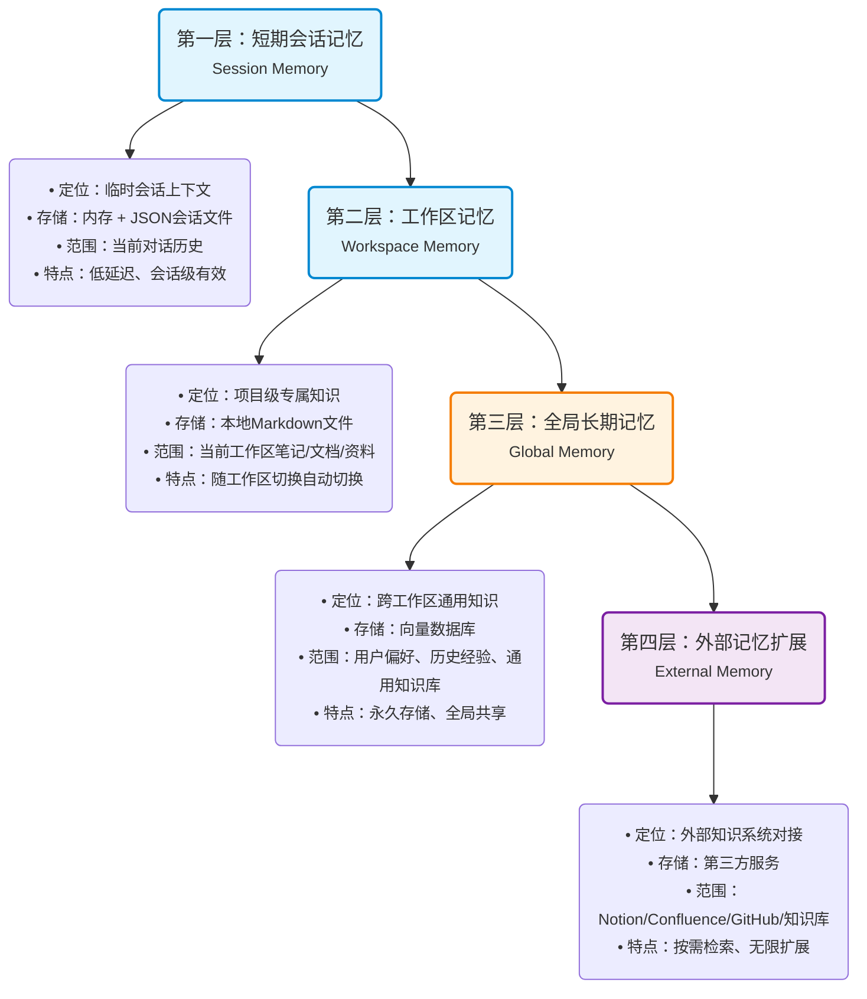
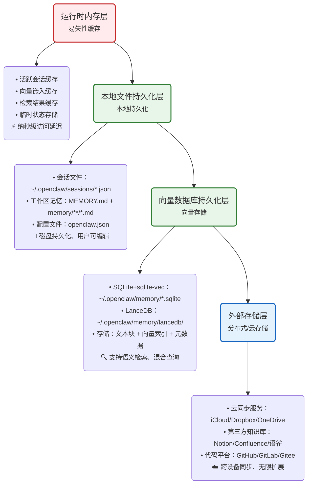

# OpenClaw 记忆系统分层架构分析

OpenClaw的记忆系统采用**四层存储架构**，从短期会话记忆到长期知识库记忆，满足不同场景的记忆需求，同时通过插件化设计支持自定义存储后端和检索策略。

---

## 🔍 记忆分层总览

### 🎨 可视化架构图（汇报专用）

#### 1. 逻辑分层架构（功能视图）



#### 2. 持久化层架构（存储介质视图）



### 文本架构说明（便于搜索）

#### 逻辑分层架构

```
┌─────────────────────────────────────────────────────────┐
│ 第一层：短期会话记忆（Session Memory）                    │
│ 存储：内存 + 会话文件                                     │
│ 范围：当前对话历史，有效期会话期间                          │
└───────────────────────────┬─────────────────────────────┘
                            │
┌───────────────────────────▼─────────────────────────────┐
│ 第二层：工作区记忆（Workspace Memory）                   │
│ 存储：本地文件系统（MEMORY.md + memory/目录）             │
│ 范围：当前工作区的笔记、文档、项目资料，有效期工作区打开期间  │
└───────────────────────────┬─────────────────────────────┘
                            │
┌───────────────────────────▼─────────────────────────────┐
│ 第三层：全局长期记忆（Global Memory）                    │
│ 存储：向量数据库（SQLite+sqlite-vec / LanceDB）          │
│ 范围：所有工作区共享的通用知识、用户偏好、历史记录，永久有效 │
└───────────────────────────┬─────────────────────────────┘
                            │
┌───────────────────────────▼─────────────────────────────┐
│ 第四层：外部记忆扩展（External Memory）                  │
│ 存储：第三方服务（Notion/Confluence/知识库等）           │
│ 范围：外部系统的知识，按需检索                            │
└─────────────────────────────────────────────────────────┘
```

#### 持久化层架构（存储介质视图）

```
┌─────────────────────────────────────────────────────────┐
│ 运行时内存层（易失性）                                    │
│ • 活跃会话缓存                                           │
│ • 向量嵌入缓存                                           │
│ • 检索结果缓存                                           │
│ • 临时状态存储                                           │
└───────────────────────────┬─────────────────────────────┘
                            │
┌───────────────────────────▼─────────────────────────────┐
│ 本地文件持久化层（持久化）                                │
│ • 会话文件：~/.openclaw/sessions/*.json                  │
│ • 工作区记忆文件：<workspace>/MEMORY.md + memory/**/*.md  │
│ • 配置文件：openclaw.json                                 │
└───────────────────────────┬─────────────────────────────┘
                            │
┌───────────────────────────▼─────────────────────────────┐
│ 向量数据库持久化层（持久化）                              │
│ • SQLite+sqlite-vec：~/.openclaw/memory/*.sqlite         │
│ • LanceDB：~/.openclaw/memory/lancedb/                   │
│ • 存储：文本块 + 向量索引 + 元数据                        │
└───────────────────────────┬─────────────────────────────┘
                            │
┌───────────────────────────▼─────────────────────────────┐
│ 外部存储层（分布式/云存储）                               │
│ • 云同步服务（iCloud/Dropbox等）                         │
│ • 第三方知识库（Notion/Confluence/语雀）                 │
│ • 代码托管平台（GitHub/GitLab）                          │
└─────────────────────────────────────────────────────────┘
```

---

## 📋 各层记忆详细分析

### 📍 第一层：短期会话记忆（Session Memory）

**核心定位**：临时存储当前对话上下文，支持多轮对话连贯性
**存储方式**：

- 运行时：内存中的会话对象
- 持久化：每个会话对应一个JSON文件，存储在`~/.openclaw/sessions/<sessionId>.json`
  **存储内容**：
- 完整的对话历史（用户消息、助手回复、工具调用记录）
- 会话状态（当前执行步骤、中间结果、上下文变量）
- 临时缓存（工具调用结果、嵌入向量缓存）
  **有效期**：会话期间有效，会话关闭后仍然持久化存储，可随时恢复
  **使用流程**：

```
用户输入 → 加入会话记忆 → 构建LLM上下文 → 生成回复 → 回复加入会话记忆
```

**核心代码**：

```typescript
// 来自 src/config/sessions.ts
async function updateSessionStore(sessionKey: string, entries: SessionEntry[]) {
  const storePath = resolveSessionTranscriptPath(sessionKey);
  const store = {
    version: CURRENT_SESSION_VERSION,
    entries,
    updatedAt: Date.now(),
  };
  await fsp.writeFile(storePath, JSON.stringify(store, null, 2));
}
```

**相关文件**：

- [src/config/sessions.ts](file:///d:/prj/openclaw_analyze/src/config/sessions.ts) - 会话持久化实现

---

### 📍 第二层：工作区记忆（Workspace Memory）

**核心定位**：存储当前工作区的专属知识，支持项目级上下文
**存储方式**：本地文件系统，用户手动维护
**存储位置**：

- 主记忆文件：`<workspace>/MEMORY.md`
- 记忆目录：`<workspace>/memory/**/*.md`
- 自定义路径：通过`memorySearch.extraPaths`配置额外的目录
  **存储内容**：
- 项目文档、需求说明、架构设计
- 常用命令、配置说明、部署指南
- 项目相关的笔记、待办事项、决策记录
  **有效期**：工作区存在期间永久有效，随工作区切换自动切换
  **索引机制**：
- 系统自动监视记忆文件变更
- 文件修改后自动增量更新向量索引
- 索引存储在`~/.openclaw/memory/<agentId>.sqlite`
  **使用流程**：

```
用户编辑记忆文件 → 系统自动检测变更 → 增量生成向量索引 → LLM调用memory_search检索 → 返回相关片段
```

**核心代码**：

```typescript
// 来自 extensions/memory-core/src/indexer.ts
async function indexMemoryFiles(workspaceDir: string) {
  // 扫描所有记忆文件
  const files = await glob([
    path.join(workspaceDir, "MEMORY.md"),
    path.join(workspaceDir, "memory/**/*.md"),
    ...extraPaths,
  ]);

  for (const file of files) {
    const content = await fsp.readFile(file, "utf-8");
    // 分块处理（每块约400token，重叠80token）
    const chunks = splitIntoChunks(content);
    for (const chunk of chunks) {
      // 生成向量嵌入
      const vector = await embeddingEngine.generate(chunk.text);
      // 存储到向量数据库
      await vectorStore.add(chunk, vector, file);
    }
  }
}
```

**相关文件**：

- [extensions/memory-core/src/indexer.ts](file:///d:/prj/openclaw_analyze/extensions/memory-core/src/indexer.ts) - 记忆文件索引实现

---

### 📍 第三层：全局长期记忆（Global Memory）

**核心定位**：跨工作区共享的长期知识，存储用户偏好、通用知识、历史经验
**存储方式**：向量数据库（支持多种后端）
**默认实现**：SQLite + sqlite-vec 轻量向量数据库
**可选后端**：LanceDB、Chroma、Weaviate等
**存储位置**：`~/.openclaw/memory/global.sqlite`
**存储内容**：

- 用户偏好设置（常用语言、代码风格、工具偏好）
- 跨项目的通用知识（技术栈、最佳实践、常见问题解决方案）
- 历史对话总结（重要决策、学习到的经验）
- 主动保存的信息（模型调用memory_store工具主动保存的内容）
  **有效期**：永久有效，手动删除才会移除
  **检索机制**：
- 混合检索：向量相似度（70%权重） + BM25关键词匹配（30%权重）
- 嵌入模型：默认使用本地bge-small-zh模型，支持OpenAI/Gemini等远程模型
- 缓存：嵌入向量结果缓存，避免重复计算
  **使用流程**：

```
模型调用memory_store主动保存信息 → 生成向量存储到全局库 → 跨工作区搜索时可以检索到
```

**核心代码**：

```typescript
// 来自 extensions/memory-core/src/search.ts
async function hybridSearch(query: string, options: SearchOptions) {
  // 并行执行向量搜索和全文搜索
  const [vectorResults, ftsResults] = await Promise.all([
    vectorSearch(query, { limit: options.limit * 4 }),
    ftsSearch(query, { limit: options.limit * 4 }),
  ]);

  // 结果归一化
  const normalizedVector = normalizeScores(vectorResults);
  const normalizedFts = normalizeScores(ftsResults);

  // 加权合并结果
  const merged = mergeResults(normalizedVector, normalizedFts, {
    vectorWeight: 0.7,
    textWeight: 0.3,
  });

  return merged.slice(0, options.limit);
}
```

**相关文件**：

- [extensions/memory-core/src/search.ts](file:///d:/prj/openclaw_analyze/extensions/memory-core/src/search.ts) - 混合检索实现
- [extensions/memory-core/src/embedding.ts](file:///d:/prj/openclaw_analyze/extensions/memory-core/src/embedding.ts) - 嵌入引擎实现

---

### 📍 第四层：外部记忆扩展（External Memory）

**核心定位**：对接外部知识系统，扩展记忆边界
**支持的外部系统**：

- 文档管理：Notion、Confluence、Obsidian
- 代码仓库：GitHub、GitLab
- 知识库：Confluence、语雀、Notion
- 云存储：Dropbox、Google Drive、本地NAS
  **实现方式**：通过插件扩展实现，每个外部系统对应一个记忆插件
  **使用流程**：

```
LLM调用外部记忆插件的搜索工具 → 插件对接外部API获取相关内容 → 内容加入上下文供LLM使用
```

---

## 🔄 记忆读写完整流程

### 记忆读取（检索）流程

```
用户请求到达 → LLM判断是否需要检索记忆 → 调用memory_search工具 → 系统执行混合检索
          ↓
返回相关记忆片段 → LLM整合记忆内容 → 生成回复
```

### 记忆写入（存储）流程

#### 1. 手动写入（工作区记忆）

```
用户编辑MEMORY.md或memory/目录下的文件 → 系统检测到文件变更 → 增量更新索引
```

#### 2. 主动写入（全局记忆）

```
对话过程中产生需要长期保存的信息 → LLM调用memory_store工具 → 生成向量存入全局向量库
```

---

## ⚙️ 记忆系统配置

用户可以通过`openclaw.json`配置记忆系统行为：

```json5
{
  agents: {
    defaults: {
      memorySearch: {
        enabled: true,
        provider: "local", // local/openai/gemini/lancedb
        local: {
          modelPath: "hf:BAAI/bge-small-zh-v1.5", // 本地嵌入模型
        },
        extraPaths: ["./docs", "./notes"], // 额外记忆目录
        hybrid: {
          enabled: true,
          vectorWeight: 0.7,
          textWeight: 0.3,
        },
        experimental: {
          sessionMemory: true, // 启用会话记忆索引
        },
      },
    },
  },
}
```

---

## 🔗 核心实现文件汇总

| 文件路径                                                                                                           | 核心功能           |
| ------------------------------------------------------------------------------------------------------------------ | ------------------ |
| [extensions/memory-core/src/index.ts](file:///d:/prj/openclaw_analyze/extensions/memory-core/src/index.ts)         | 记忆系统插件主入口 |
| [extensions/memory-core/src/search.ts](file:///d:/prj/openclaw_analyze/extensions/memory-core/src/search.ts)       | 混合检索核心实现   |
| [extensions/memory-core/src/indexer.ts](file:///d:/prj/openclaw_analyze/extensions/memory-core/src/indexer.ts)     | 记忆文件索引与同步 |
| [extensions/memory-core/src/embedding.ts](file:///d:/prj/openclaw_analyze/extensions/memory-core/src/embedding.ts) | 嵌入引擎实现       |
| [src/config/sessions.ts](file:///d:/prj/openclaw_analyze/src/config/sessions.ts)                                   | 会话记忆持久化     |
| [extensions/memory-core/src/cache.ts](file:///d:/prj/openclaw_analyze/extensions/memory-core/src/cache.ts)         | 嵌入向量缓存       |

这种分层架构兼顾了短期上下文连贯性和长期知识存储能力，同时通过插件化设计支持无限扩展记忆边界。
