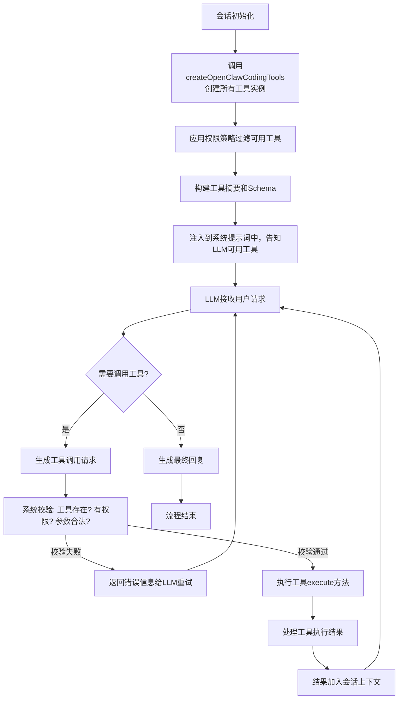

# 项目内置工具分析报告

## 一、工具整体架构

OpenClaw的工具系统采用分层设计，工具是系统的基础能力单元，所有工具都实现统一的`Tool`接口：
```typescript
interface Tool {
  name: string;
  description: string;
  parameters: ToolParameters;
  execute(params: ToolParams): Promise<ToolResult>;
}
```

工具统一存放在 [`src/agents/tools/`](file:///d:/prj/openclaw_analyze/src/agents/tools/) 目录下，按功能模块划分，核心工具在 [`tool-catalog.ts`](file:///d:/prj/openclaw_analyze/src/agents/tool-catalog.ts) 中注册。

---

## 二、内置工具分类及详情

### 1. 文件操作工具（Files 分类）
| 工具名称 | 用途 | 实现文件 | 核心代码片段 |
|---------|------|----------|-------------|
| `read` | 读取文件内容 | [`pi-tools.read.ts`](file:///d:/prj/openclaw_analyze/src/agents/pi-tools.read.ts) | ```typescript
export function createOpenClawReadTool(options: { sandbox: SandboxContext }) {
  return {
    name: "read",
    description: "Read file contents from the workspace",
    parameters: Type.Object({
      path: Type.String({ description: "File path to read" }),
      offset: Type.Optional(Type.Number({ description: "Start line number" })),
      limit: Type.Optional(Type.Number({ description: "Number of lines to read" }))
    }),
    execute: async (params) => {
      // 路径校验：确保在工作区内
      const fullPath = resolveWorkspacePath(params.path);
      assertPathInWorkspace(fullPath);
      // 读取文件内容
      return readFile(fullPath, { encoding: "utf-8" });
    }
  };
}
``` |
| `write` | 创建或覆盖文件 | [`pi-tools.read.ts`](file:///d:/prj/openclaw_analyze/src/agents/pi-tools.read.ts) | 路径校验 + 文件写入逻辑，支持沙箱隔离 |
| `edit` | 精确编辑文件 | [`pi-tools.read.ts`](file:///d:/prj/openclaw_analyze/src/agents/pi-tools.read.ts) | 基于差异补丁的编辑方式，确保修改准确性 |
| `apply_patch` | 应用代码补丁 | [`apply-patch.ts`](file:///d:/prj/openclaw_analyze/src/agents/apply-patch.ts) | 兼容OpenAI格式的补丁应用逻辑 |

### 2. 系统运行工具（Runtime 分类）
| 工具名称 | 用途 | 实现文件 | 核心特性 |
|---------|------|----------|----------|
| `exec` | 执行shell命令 | [`bash-tools.ts`](file:///d:/prj/openclaw_analyze/src/agents/bash-tools.ts) | 沙箱隔离、命令白名单、超时控制、权限检查 |
| `process` | 管理后台进程 | [`bash-tools.ts`](file:///d:/prj/openclaw_analyze/src/agents/bash-tools.ts) | 支持进程启动、停止、状态查询 |

### 3. 网络工具（Web 分类）
| 工具名称 | 用途 | 实现文件 | 核心特性 |
|---------|------|----------|----------|
| `web_search` | 网页搜索 | [`web-search.ts`](file:///d:/prj/openclaw_analyze/src/agents/tools/web-search.ts) | 支持多搜索引擎（Brave/Perplexity/Grok/Kimi）、缓存机制、SSRF防护 |
| `web_fetch` | 获取网页内容 | [`web-fetch.ts`](file:///d:/prj/openclaw_analyze/src/agents/tools/web-fetch.ts) | 自动转Markdown、内容净化、防爬绕过 |

### 4. 记忆工具（Memory 分类）
| 工具名称 | 用途 | 实现文件 | 核心特性 |
|---------|------|----------|----------|
| `memory_search` | 语义搜索记忆 | [`memory-tool.ts`](file:///d:/prj/openclaw_analyze/src/agents/tools/memory-tool.ts) | 基于向量的语义检索、跨会话记忆 |
| `memory_get` | 读取记忆文件 | [`memory-tool.ts`](file:///d:/prj/openclaw_analyze/src/agents/tools/memory-tool.ts) | 结构化记忆存储、支持版本管理 |

### 5. 会话工具（Sessions 分类）
| 工具名称 | 用途 | 实现文件 | 核心特性 |
|---------|------|----------|----------|
| `sessions_list` | 列出所有会话 | [`sessions-list-tool.ts`](file:///d:/prj/openclaw_analyze/src/agents/tools/sessions-list-tool.ts) | 多会话管理、状态查询 |
| `sessions_history` | 查看会话历史 | [`sessions-history-tool.ts`](file:///d:/prj/openclaw_analyze/src/agents/tools/sessions-history-tool.ts) | 会话历史追溯、上下文导出 |
| `sessions_send` | 向其他会话发消息 | [`sessions-send-tool.ts`](file:///d:/prj/openclaw_analyze/src/agents/tools/sessions-send-tool.ts) | 跨会话通信、Agent间协作 |
| `sessions_spawn` | 创建子Agent | [`sessions-spawn-tool.ts`](file:///d:/prj/openclaw_analyze/src/agents/tools/sessions-spawn-tool.ts) | 子任务分解、并行处理 |

### 6. UI交互工具（UI 分类）
| 工具名称 | 用途 | 实现文件 | 核心特性 |
|---------|------|----------|----------|
| `browser` | 控制网页浏览器 | [`browser-tool.ts`](file:///d:/prj/openclaw_analyze/src/agents/tools/browser-tool.ts) | 基于Chrome DevTools Protocol，支持导航、点击、输入、截图、JS执行 |
| `canvas` | 控制画布 | [`canvas-tool.ts`](file:///d:/prj/openclaw_analyze/src/agents/tools/canvas-tool.ts) | 可视化内容渲染、交互式画布操作 |

### 7. 自动化工具（Automation 分类）
| 工具名称 | 用途 | 实现文件 | 核心特性 |
|---------|------|----------|----------|
| `cron` | 定时任务调度 | [`cron-tool.ts`](file:///d:/prj/openclaw_analyze/src/agents/tools/cron-tool.ts) | 支持标准cron表达式、任务持久化、执行日志 |

### 8. 媒体工具（Media 分类）
| 工具名称 | 用途 | 实现文件 | 核心特性 |
|---------|------|----------|----------|
| `image` | 图像处理 | [`image-tool.ts`](file:///d:/prj/openclaw_analyze/src/agents/tools/image-tool.ts) | 图片识别、格式转换、OCR识别 |
| `pdf` | PDF处理 | [`pdf-tool.ts`](file:///d:/prj/openclaw_analyze/src/agents/tools/pdf-tool.ts) | PDF文本提取、格式转换 |
| `tts` | 文字转语音 | [`tts-tool.ts`](file:///d:/prj/openclaw_analyze/src/agents/tools/tts-tool.ts) | 多语音模型支持、音频生成 |

### 9. 消息工具（Messaging 分类）
| 工具名称 | 用途 | 实现文件 | 核心特性 |
|---------|------|----------|----------|
| `message` | 发送消息 | [`message-tool.ts`](file:///d:/prj/openclaw_analyze/src/agents/tools/message-tool.ts) | 跨渠道消息发送（Slack/Discord/ Telegram/WhatsApp等） |
| 渠道专属工具 | 各平台操作 | `slack-actions.ts` / `discord-actions.ts` / `telegram-actions.ts`等 | 各平台专属API封装 |

---

## 三、工具调用流程

### 完整生命周期


### 核心实现节点
1. **工具创建**：会话初始化时在 [`run/attempt.ts`](file:///d:/prj/openclaw_analyze/src/agents/pi-embedded-runner/run/attempt.ts) 中调用`createOpenClawCodingTools()`创建所有工具实例
2. **提示注入**：在 [`system-prompt.ts`](file:///d:/prj/openclaw_analyze/src/agents/pi-embedded-runner/system-prompt.ts) 中构建工具信息，注入到系统提示词
3. **调用处理**：在Agent核心循环中解析LLM输出的工具调用，校验后执行
4. **安全控制**：工具调用前会经过多层安全校验：路径隔离、命令白名单、权限检查、资源限制

---

## 四、工具与技能的关系
- **工具（Tool）** 是底层能力单元，每个工具完成单一特定功能
- **技能（Skill）** 是工具的组合使用指南，通过自然语言文档告诉LLM如何组合工具完成复杂任务
- **调用层级**：LLM → Skill（指导如何用工具）→ Tool（实际执行操作）

工具是系统内置的基础能力，技能是可扩展的使用指南，用户可以通过编写Skill文档让LLM学会新的工作流程，无需修改系统代码。
