# OpenClaw 并发模型分析

基于对源码的深入分析，OpenClaw采用了一个精心设计的多层并发架构，涵盖**多Agent**、**单Agent多会话**以及**命令队列管理**等多个维度。

## 一、并发模型架构概览

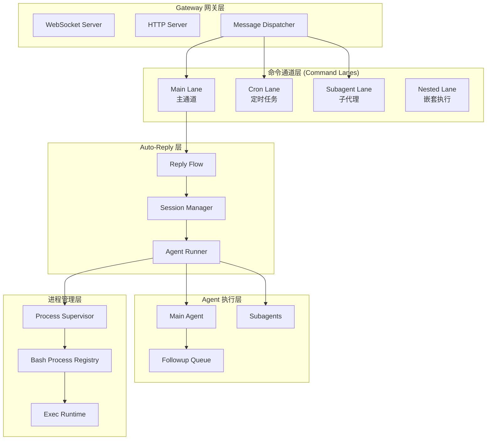

---

## 二、核心类图

### 2.1 命令通道层 (Command Lanes)

**文件位置**: `src/process/lanes.ts`

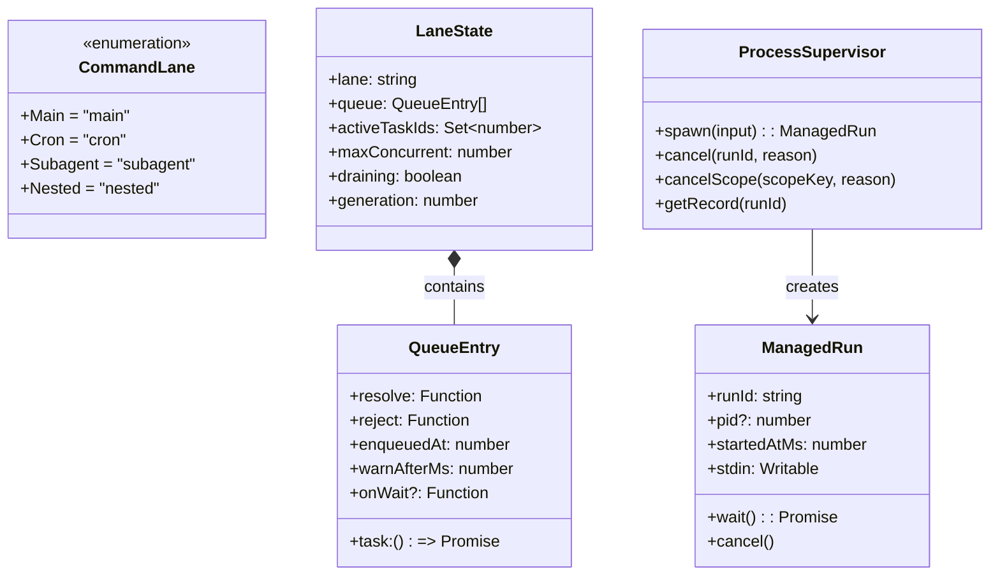

**关键类型定义**:

```typescript
// src/process/lanes.ts
export const enum CommandLane {
  Main = "main",
  Cron = "cron",
  Subagent = "subagent",
  Nested = "nested",
}

// src/process/command-queue.ts
type LaneState = {
  lane: string;
  queue: QueueEntry[];
  activeTaskIds: Set<number>;
  maxConcurrent: number;
  draining: boolean;
  generation: number;
};
```

### 2.2 会话管理层 (Session Management)

**文件位置**: `src/config/sessions/types.ts`

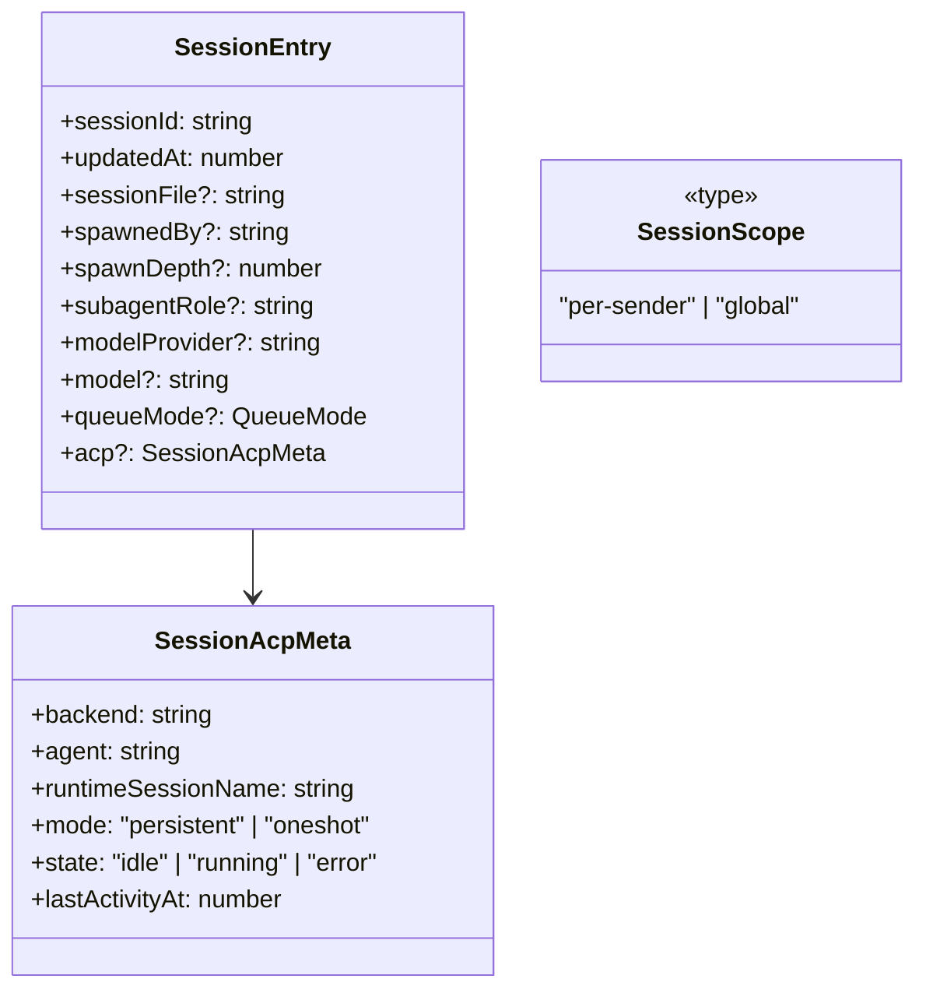

**会话类型定义**:
```typescript
// src/config/sessions/types.ts
export type SessionScope = "per-sender" | "global";

export type SessionEntry = {
  sessionId: string;
  updatedAt: number;
  sessionFile?: string;
  spawnedBy?: string;
  spawnDepth?: number;
  subagentRole?: "orchestrator" | "leaf";
  subagentControlScope?: "children" | "none";
  modelProvider?: string;
  model?: string;
  queueMode?: QueueMode;
  // ...
  acp?: SessionAcpMeta;
};
```

### 2.3 消息处理流程

**文件位置**: `src/auto-reply/reply/get-reply.ts`

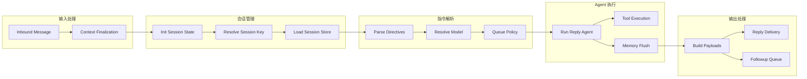

---

## 三、Agent、Session、Lane 实体关系图

### 3.1 实体关系图 (ER Diagram)

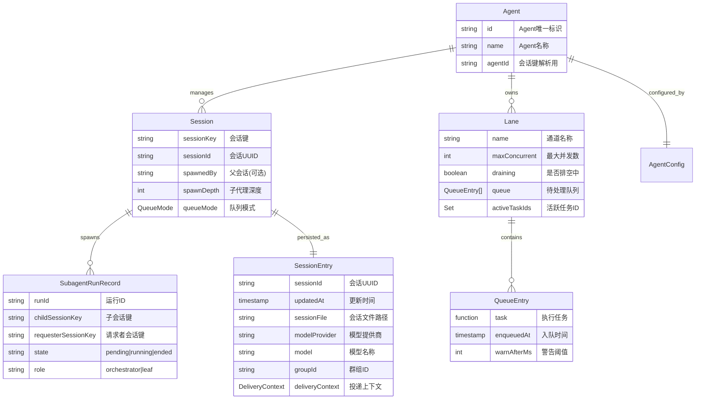

### 3.2 概念层次关系

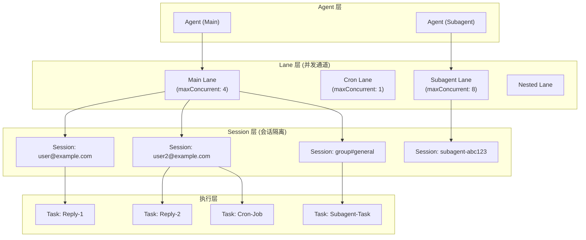

---

## 四、Session 与 Lane 的关系

### 4.1 核心结论

**Session 和 Lane 是两个完全独立的概念**，它们服务于不同的目的：

| 维度 | Session | Lane |
|------|---------|------|
| **目的** | 会话状态管理 | 执行调度控制 |
| **关注点** | "谁"在对话 | "如何"处理任务 |
| **数量关系** | 可以很多（用户数） | 有限（并发槽） |
| **状态** | 持久化存储 | 内存队列 |
| **存储位置** | 磁盘 (JSON文件) | 内存 (Map) |
| **生命周期** | 持久化 | 随进程 |

### 4.2 类比理解

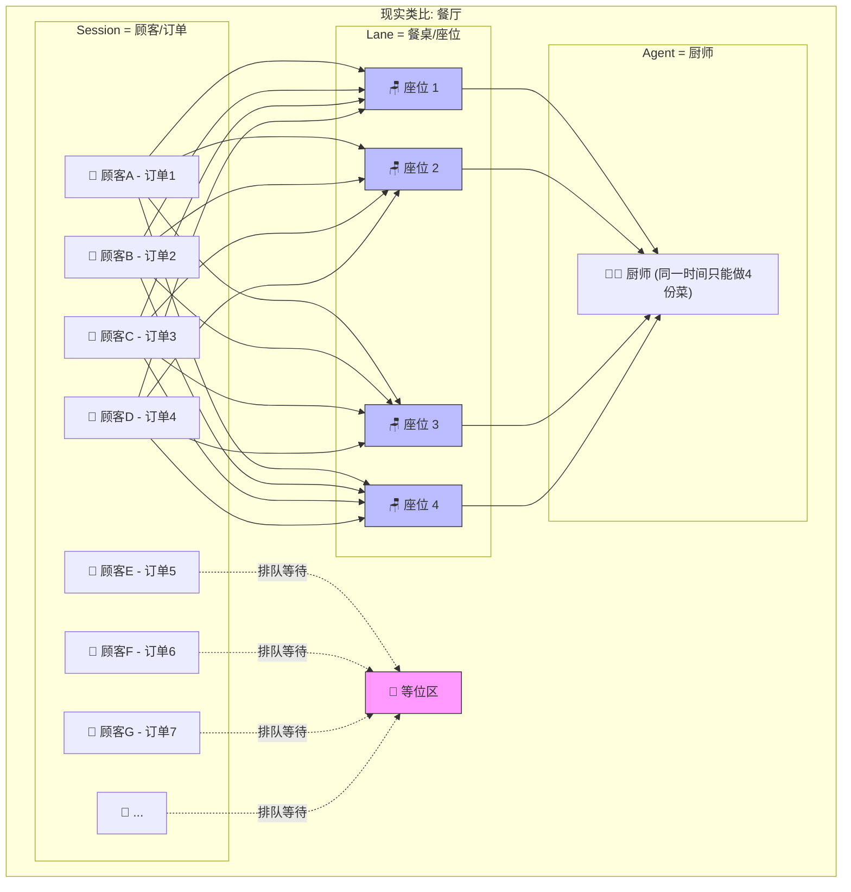

**解释**：
- **Session** = 顾客（有多少顾客来吃饭都行）
- **Lane** = 餐桌（只有4张桌子）
- **maxConcurrent** = 同时坐满的桌子数
- **队列** = 等位区（坐不下的顾客排队）

### 4.3 Session数量与Lane并发的关系

**Session数量完全不受Lane maxConcurrent限制！**

```
Session数量: 100个用户 → 100个Session
Lane maxConcurrent: 4

结果:
├── 4个Session正在处理 (占用并发槽)
└── 96个Session在队列等待

✓ Session数量 >> Lane并发数
✓ 这就是设计目的: 用少量并发槽服务大量用户
```

---

## 五、并发场景流程图

### 5.1 多Agent并发场景

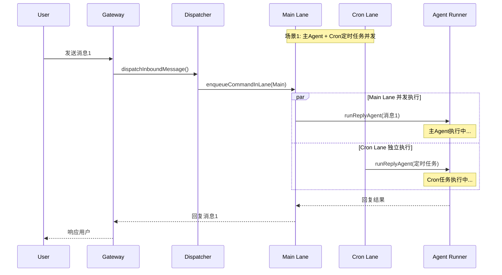

### 5.2 一Agent多Session场景流程

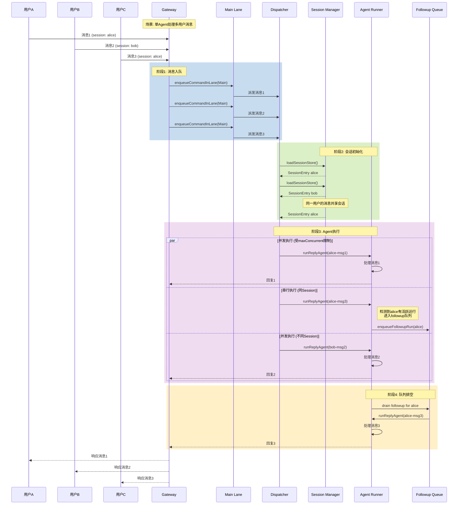

### 5.3 单Agent多Session并发处理时序

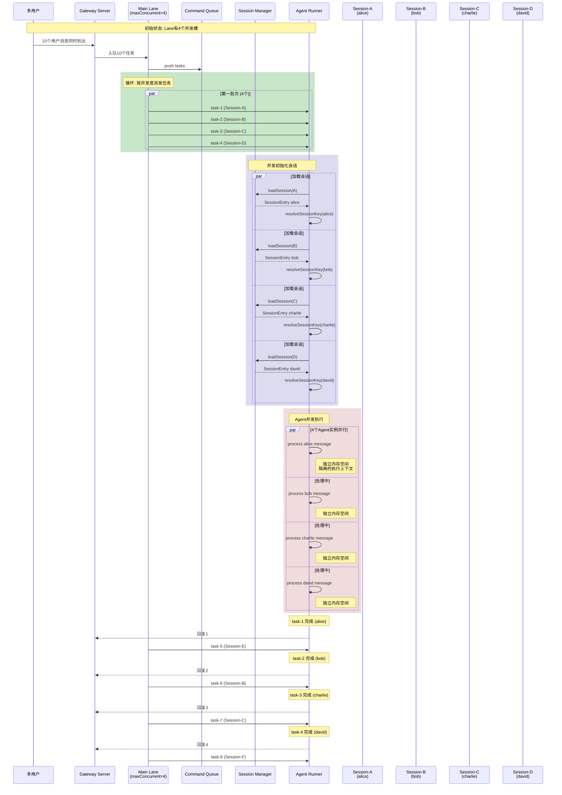

### 5.4 Session隔离与共享机制

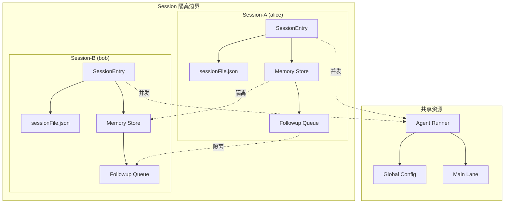

### 5.5 Subagent子代理并发

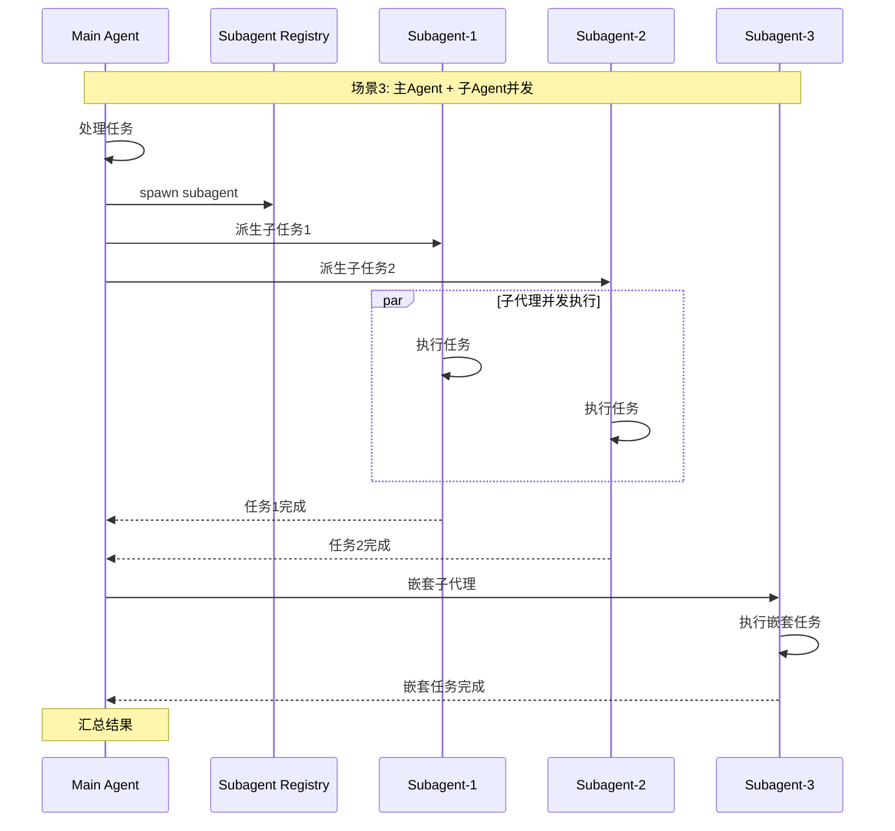

### 5.6 Followup队列与消息分派

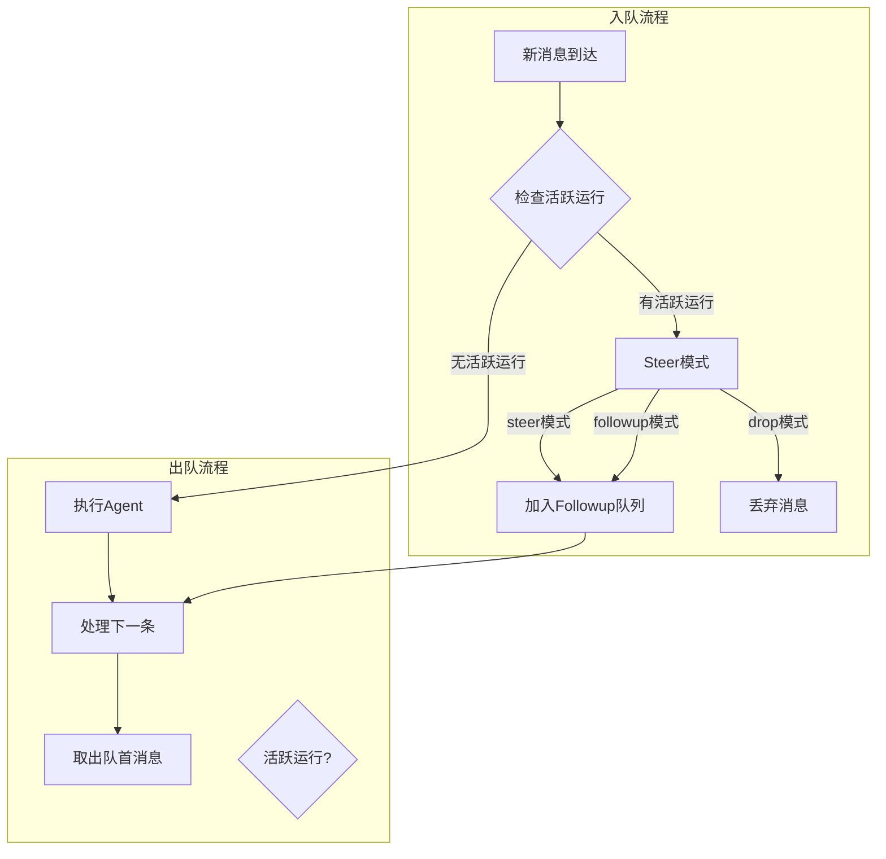

---

## 六、关键并发控制机制

### 6.1 命令通道并发控制

**文件位置**: `src/process/command-queue.ts`

```typescript
// 核心并发控制逻辑
export function enqueueCommandInLane<T>(
  lane: string,
  task: () => Promise<T>,
  opts?: {
    warnAfterMs?: number;
    onWait?: (waitMs: number, queuedAhead: number) => void;
  },
): Promise<T> {
  const cleaned = lane.trim() || CommandLane.Main;
  const warnAfterMs = opts?.warnAfterMs ?? 2_000;
  const state = getLaneState(cleaned);
  
  return new Promise<T>((resolve, reject) => {
    state.queue.push({
      task: () => task(),
      resolve: (value) => resolve(value as T),
      reject,
      enqueuedAt: Date.now(),
      warnAfterMs,
      onWait: opts?.onWait,
    });
    drainLane(cleaned);  // 启动排空处理
  });
}

// 通道并发度设置
export function setCommandLaneConcurrency(lane: string, maxConcurrent: number) {
  const state = getLaneState(cleaned);
  state.maxConcurrent = Math.max(1, Math.floor(maxConcurrent));
  drainLane(cleaned);
}
```

### 6.2 进程Supervisor并发管理

**文件位置**: `src/process/supervisor/supervisor.ts`

```typescript
// 进程监督器核心实现
export function createProcessSupervisor(): ProcessSupervisor {
  const registry = createRunRegistry();
  const active = new Map<string, ActiveRun>();

  const spawn = async (input: SpawnInput): Promise<ManagedRun> => {
    const runId = input.runId?.trim() || crypto.randomUUID();
    
    // 创建运行记录
    const record: RunRecord = {
      runId,
      sessionId: input.sessionId,
      backendId: input.backendId,
      scopeKey: input.scopeKey?.trim() || undefined,
      state: "starting",
      startedAtMs: Date.now(),
      lastOutputAtMs: Date.now(),
    };
    registry.add(record);

    // 创建适配器 (child 或 pty 模式)
    const adapter = input.mode === "pty"
      ? await createPtyAdapter({...})
      : await createChildAdapter({...});

    // 设置超时控制
    if (overallTimeoutMs) {
      timeoutTimer = setTimeout(() => {
        requestCancel("overall-timeout");
      }, overallTimeoutMs);
    }

    // 绑定输出回调
    adapter.onStdout((chunk) => {
      if (captureOutput) stdout += chunk;
      input.onStdout?.(chunk);
      touchOutput();
    });

    // 返回托管运行对象
    const managedRun: ManagedRun = {
      runId,
      pid: adapter.pid,
      startedAtMs,
      stdin: adapter.stdin,
      wait: async () => await waitPromise,
      cancel: (reason = "manual-cancel") => {
        requestCancel(reason);
      },
    };

    active.set(runId, { run: managedRun, scopeKey: input.scopeKey?.trim() });
    return managedRun;
  };

  return { spawn, cancel, cancelScope, getRecord };
}
```

### 6.3 Subagent注册与管理

**文件位置**: `src/agents/subagent-registry.ts`

```typescript
// 子代理运行记录
export type SubagentRunRecord = {
  runId: string;
  childSessionKey: string;
  requesterSessionKey: string;
  spawnDepth: number;
  role: "orchestrator" | "leaf";
  controlScope: "children" | "none";
  state: "pending" | "running" | "ended";
  outcome?: SubagentRunOutcome;
  endedAt?: number;
  endedReason?: SubagentLifecycleEndedReason;
  cleanupHandled?: boolean;
};

// 子代理注册表
const subagentRuns = new Map<string, SubagentRunRecord>();

// 列出控制器的子代理运行
export function listSubagentRunsForController(requesterKey: string): SubagentRunRecord[] {
  return listRunsForControllerFromRuns(subagentRuns, requesterKey);
}

// 获取活跃子代理数量
export function countActiveSubagentRuns(requesterKey: string): number {
  return countActiveRunsForSessionFromRuns(subagentRuns, requesterKey);
}
```

### 6.4 并发配置限制

**文件位置**: `src/config/agent-limits.ts`

```typescript
export const DEFAULT_AGENT_MAX_CONCURRENT = 4;
export const DEFAULT_SUBAGENT_MAX_CONCURRENT = 8;
export const DEFAULT_SUBAGENT_MAX_SPAWN_DEPTH = 1;

export function resolveAgentMaxConcurrent(cfg?: OpenClawConfig): number {
  const raw = cfg?.agents?.defaults?.maxConcurrent;
  if (typeof raw === "number" && Number.isFinite(raw)) {
    return Math.max(1, Math.floor(raw));
  }
  return DEFAULT_AGENT_MAX_CONCURRENT;
}

export function resolveSubagentMaxConcurrent(cfg?: OpenClawConfig): number {
  const raw = cfg?.agents?.defaults?.subagents?.maxConcurrent;
  if (typeof raw === "number" && Number.isFinite(raw)) {
    return Math.max(1, Math.floor(raw));
  }
  return DEFAULT_SUBAGENT_MAX_CONCURRENT;
}
```

---

## 七、并发执行流程代码分析

### 7.1 消息分派入口

**文件位置**: `src/auto-reply/dispatch.ts`

```typescript
export async function dispatchInboundMessage(params: {
  ctx: MsgContext | FinalizedMsgContext;
  cfg: OpenClawConfig;
  dispatcher: ReplyDispatcher;
  replyOptions?: Omit<GetReplyOptions, "onToolResult" | "onBlockReply">;
}): Promise<DispatchInboundResult> {
  const finalized = finalizeInboundContext(params.ctx);
  
  return await withReplyDispatcher({
    dispatcher: params.dispatcher,
    run: () =>
      dispatchReplyFromConfig({
        ctx: finalized,
        cfg: params.cfg,
        dispatcher: params.dispatcher,
        replyOptions: params.replyOptions,
      }),
  });
}
```

### 7.2 回复Agent执行

**文件位置**: `src/auto-reply/reply/agent-runner.ts`

```typescript
export async function runReplyAgent(params: {
  commandBody: string;
  followupRun: FollowupRun;
  queueKey: string;
  resolvedQueue: QueueSettings;
  // ...
}): Promise<ReplyPayload | ReplyPayload[] | undefined> {
  const { queueKey, resolvedQueue, isActive } = params;

  // 解析队列策略
  const activeRunQueueAction = resolveActiveRunQueueAction({
    isActive,
    isHeartbeat: opts?.isHeartbeat === true,
    shouldFollowup,
    queueMode: resolvedQueue.mode,
  });

  // 根据队列策略处理
  if (activeRunQueueAction === "drop") {
    typing.cleanup();
    return undefined;
  }

  if (activeRunQueueAction === "enqueue-followup") {
    enqueueFollowupRun(queueKey, followupRun, resolvedQueue);
    typing.cleanup();
    return undefined;
  }

  // 执行Agent回合
  const runOutcome = await runAgentTurnWithFallback({
    commandBody,
    followupRun,
    sessionCtx,
    opts,
    // ...
  });

  // 处理结果
  if (runOutcome.kind === "final") {
    return finalizeWithFollowup(runOutcome.payload, queueKey, runFollowupTurn);
  }
  // ...
}
```

### 7.3 Followup队列管理

**文件位置**: `src/auto-reply/reply/queue/enqueue.ts`

```typescript
export function enqueueFollowupRun(
  key: string,
  run: FollowupRun,
  settings: QueueSettings,
  dedupeMode: QueueDedupeMode = "message-id",
): boolean {
  const queue = getFollowupQueue(key, settings);
  
  // 消息去重
  if (shouldSkipQueueItem({ item: run, items: queue.items, dedupe })) {
    return false;
  }

  queue.lastEnqueuedAt = Date.now();
  queue.lastRun = run.run;

  // 应用丢弃策略
  const shouldEnqueue = applyQueueDropPolicy({
    queue,
    summarize: (item) => item.summaryLine?.trim() || item.prompt.trim(),
  });
  
  if (!shouldEnqueue) {
    return false;
  }

  queue.items.push(run);
  
  // 触发队列排空
  if (!queue.draining) {
    kickFollowupDrainIfIdle(key);
  }
  
  return true;
}
```

---

## 八、并发模型总结

### 8.1 架构层次

| 层级 | 组件 | 并发方式 | 关键文件 |
|------|------|----------|----------|
| **通道层** | Command Lanes | 通道隔离 + 并发度控制 | `src/process/command-queue.ts` |
| **消息层** | Message Dispatch | 消息队列 + 策略分发 | `src/auto-reply/dispatch.ts` |
| **会话层** | Session Manager | 会话隔离 + 状态持久化 | `src/config/sessions/types.ts` |
| **Agent层** | Agent Runner | 单Agent轮转 + 多Session | `src/auto-reply/reply/agent-runner.ts` |
| **子代理层** | Subagent Registry | 主从并行 + 深度限制 | `src/agents/subagent-registry.ts` |
| **进程层** | Process Supervisor | 进程池 + 超时控制 | `src/process/supervisor/supervisor.ts` |

### 8.2 并发配置参数

| 配置项 | 默认值 | 说明 |
|--------|--------|------|
| `agents.defaults.maxConcurrent` | 4 | 主Agent最大并发数 |
| `agents.defaults.subagents.maxConcurrent` | 8 | 子代理最大并发数 |
| `agents.defaults.subagents.maxSpawnDepth` | 1 | 子代理最大嵌套深度 |
| `cron.maxConcurrentRuns` | 1 | Cron任务最大并发 |

### 8.3 队列模式

| 模式 | 行为 | 适用场景 |
|------|------|----------|
| `steer` | 接管控制权，排队等待 | 默认模式 |
| `followup` | 等待当前运行完成后执行 | 连续追问 |
| `drop` | 丢弃新消息 | 忽略重复请求 |
| `interrupt` | 中断当前运行 | 紧急插队 |

### 8.4 关系总结表

| 关系类型 | 主体 | 客体 | 关联方式 | 说明 |
|---------|------|------|----------|------|
| **1:N** | Agent | Session | 通过`agentId`关联 | 每个Agent管理多个Session |
| **1:N** | Agent | Lane | 通过`CommandLane`隔离 | Main/Cron/Subagent/Nested |
| **1:N** | Lane | QueueEntry | 按`maxConcurrent`控制 | 每条Lane有独立的并发限制 |
| **1:1** | Session | SessionEntry | 持久化存储 | Session内存状态持久化为JSON |
| **1:N** | Session | FollowupQueue | 通过`queueKey`关联 | 每个Session有独立的Followup队列 |
| **1:N** | Session | SubagentRunRecord | 通过`spawnDepth`嵌套 | 支持子代理的深度控制 |
| **N:1** | QueueEntry | Lane | 入队时指定 | 任务入队时指定目标Lane |

---

## 九、核心文件索引

| 文件路径 | 职责 |
|----------|------|
| `src/process/lanes.ts` | 命令通道枚举定义 |
| `src/process/command-queue.ts` | 命令队列实现 |
| `src/process/supervisor/supervisor.ts` | 进程监督器 |
| `src/config/sessions/types.ts` | 会话类型定义 |
| `src/config/agent-limits.ts` | 并发限制配置 |
| `src/auto-reply/dispatch.ts` | 消息分派入口 |
| `src/auto-reply/reply/agent-runner.ts` | Agent执行引擎 |
| `src/auto-reply/reply/get-reply.ts` | 回复流程入口 |
| `src/auto-reply/reply/queue/enqueue.ts` | Followup队列管理 |
| `src/agents/subagent-registry.ts` | 子代理注册表 |
| `src/gateway/server-lanes.ts` | 网关通道配置 |
| `src/agents/bash-tools.exec-runtime.ts` | Shell执行运行时 |
| `src/agents/bash-process-registry.ts` | Bash进程注册表 |

---

## 十、关键结论

### 10.1 Session与Lane的关系

1. **完全独立**：
   - Session 关注"对话上下文"，可以无限创建
   - Lane 关注"执行调度"，受并发度限制

2. **数量关系**：
   - Session 数量 = 用户数量（无限制）
   - Lane 并发数 = maxConcurrent（固定值，如4）
   - 超过并发的 Session 自动进入队列等待

3. **设计目的**：
   - 用少量并发槽服务大量用户
   - 通过队列实现公平的调度

### 10.2 简单总结

```
Session = 对话上下文 → 想创建多少就创建多少
Lane并发槽 = 工作能力 → 受maxConcurrent限制（如4个）
关系 = 多个Session共享少量Lane并发槽
```

这个分析展示了OpenClaw的完整并发模型，从底层的进程管理到上层的消息分派，每一层都有明确的职责划分和并发控制机制。通过命令通道(Command Lanes)、会话隔离、队列策略和子代理机制，OpenClaw能够高效地处理多用户、多会话的并发请求。
