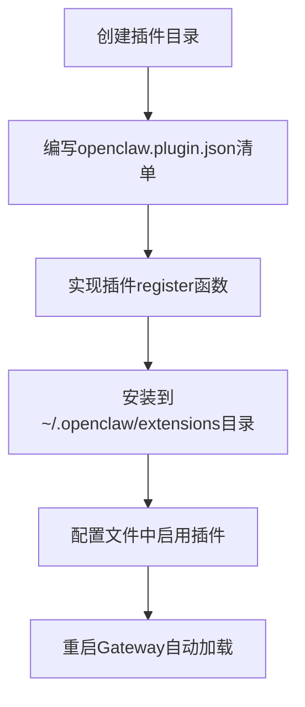
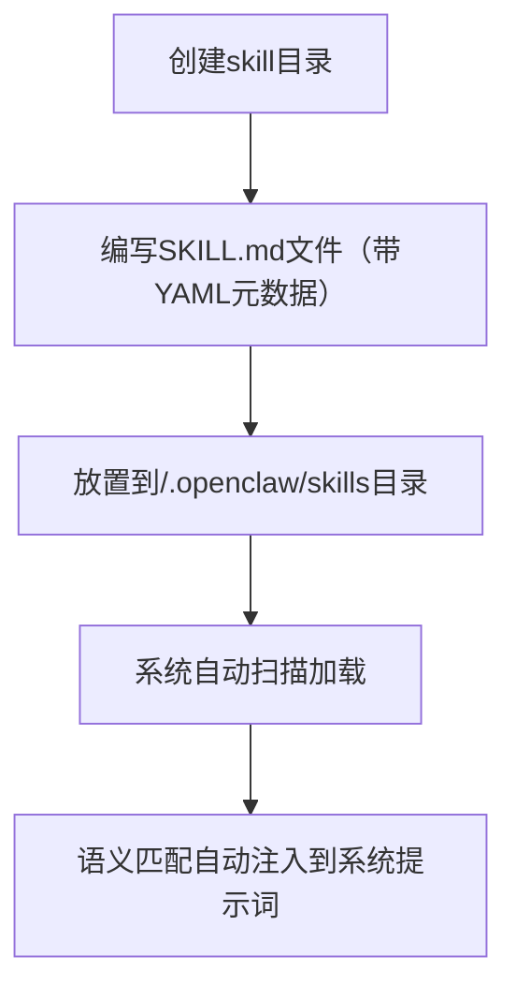
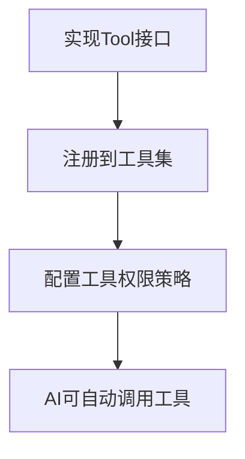

# OpenClaw 扩展方式梳理报告

OpenClaw提供了6种核心扩展方式，覆盖从功能扩展到渠道集成、从技能扩展到模型适配的全场景需求：

---

## 一、插件系统扩展（最高优先级，核心扩展方式）
**功能**：通过插件是OpenClaw最强大的扩展方式，可以添加新工具、新渠道、新功能模块，甚至扩展Gateway核心能力
**适用场景**：添加官方未内置的功能（如语音通话、企业微信集成、第三方服务集成等）

### 核心类/接口：
| 类/接口 | 功能 | 文件路径 |
|---------|------|----------|
| `OpenClawPluginDefinition` | 插件定义接口 | [src/plugins/types.ts](file:///d:/prj/openclaw_analyze/src/plugins/types.ts) |
| `loadPlugins()` | 插件加载入口 | [src/plugins/loader.ts](file:///d:/prj/openclaw_analyze/src/plugins/loader.ts) |
| `PluginRuntime` | 插件运行时 | [src/plugins/runtime/types.ts](file:///d:/prj/openclaw_analyze/src/plugins/runtime/types.ts) |
| `openclaw.plugin.json` | 插件清单文件 | 插件根目录 |

### 实现流程：


### 关键代码片段：
**1. 插件清单示例（openclaw.plugin.json）：
```json
{
  "id": "feishu",
  "name": "飞书渠道插件",
  "description": "添加飞书消息渠道支持",
  "version": "1.0.0",
  "channels": ["feishu"],
  "skills": ["./skills"],
  "tools": ["./tools"],
  "configSchema": {
    "type": "object",
    "properties": {
      "appId": { "type": "string" },
      "appSecret": { "type": "string" }
    },
    "required": ["appId", "appSecret"]
  }
}
```

**2. 插件实现示例（index.ts）：**
```typescript
import type { OpenClawPluginDefinition } from "openclaw/plugin-sdk";

const plugin: OpenClawPluginDefinition = {
  register: async (runtime) => {
    // 注册渠道处理器
    runtime.registerChannelHandler("feishu", {
      sendMessage: async (message, context) => {
        // 实现飞书消息发送逻辑
      },
      receiveMessage: async (payload) => {
        // 实现飞书消息接收逻辑
      }
    });
    
    // 注册自定义工具
    runtime.registerTool(createFeishuCalendarTool());
    
    // 注册Hook
    runtime.registerHook("before-message-process", async (context) => {
      // 消息处理前拦截逻辑
    });
    
    // 注册Gateway API端点
    runtime.registerGatewayHandler("feishu.webhook", async (req, res) => {
      // 实现飞书Webhook处理
    });
  }
};

export default plugin;
```

**3. 配置启用示例：**
```json5
{
  "plugins": {
    "enabled": true,
    "entries": {
      "feishu": {
        "enabled": true,
        "config": {
          "appId": "cli_xxxxxx",
          "appSecret": "xxxxxx"
        }
      }
    }
  }
}
```

---

## 二、技能（Skills）扩展
**功能**：通过声明式Markdown文件为AI添加特定领域知识和能力，无需编写代码
**适用场景**：添加领域知识库、特定业务流程、最佳实践、行业知识等

### 核心类/接口：
| 类/接口 | 功能 | 文件路径 |
|---------|------|----------|
| `Skill` | Skill定义类型 | [src/agents/skills/types.ts](file:///d:/prj/openclaw_analyze/src/agents/skills/types.ts) |
| `loadWorkspaceSkills()` | Skill加载函数 | [src/agents/skills/workspace.ts](file:///d:/prj/openclaw_analyze/src/agents/skills/workspace.ts) |
| `skill-search.ts` | Skill语义搜索 | [src/agents/skills/skill-search.ts](file:///d:/prj/openclaw_analyze/src/agents/skills/skill-search.ts) |

### 实现流程：


### 关键代码片段：
**SKILL.md示例：**
```markdown
---
skill_id: "react-best-practices"
name: "React最佳实践"
description: "提供React开发最佳实践和代码规范"
tags: ["react", "frontend", "coding"]
matches:
  - "react 最佳实践"
  - "react 代码规范"
  - "react 性能优化"
---

# React 最佳实践

## 组件设计原则
1. 组件职责单一原则
2. 避免过度渲染优化
3. 状态提升与状态管理

## 代码规范
```tsx
// 推荐的组件写法
const UserProfile = ({ user }) => {
  return <div>{user.name}</div>;
};
```
```

---

## 三、工具（Tools）扩展
**功能**：添加AI可调用的新工具，扩展AI的执行能力
**适用场景**：添加自定义工具、集成内部系统API调用、业务系统集成

### 核心类/接口：
| 类/接口 | 功能 | 文件路径 |
|---------|------|----------|
| `AnyAgentTool` | 工具基础类型 | [src/agents/tools/common.ts](file:///d:/prj/openclaw_analyze/src/agents/tools/common.ts) |
| `createOpenClawCodingTools()` | 工具集创建入口 | [src/agents/pi-tools.ts](file:///d:/prj/openclaw_analyze/src/agents/pi-tools.ts) |

### 实现流程：


### 关键代码片段：
```typescript
import type { AnyAgentTool } from "../tools/common";
import { Type } from "@sinclair/typebox";

// 自定义天气查询工具
export function createWeatherTool(): AnyAgentTool {
  return {
    name: "weather",
    description: "查询指定城市的天气情况",
    parameters: Type.Object({
      city: Type.String({ description: "城市名称" }),
      days: Type.Optional(Type.Number({ description: "查询天数，默认1天" }))
    }),
    execute: async (toolCallId, args) => {
      const city = args.city as string;
      const days = args.days ?? 1;
      
      // 调用天气API
      const response = await fetch(`https://api.weather.com/${city}?days=${days}`);
      const data = await response.json();
      
      return {
        status: "ok",
        data: data
      };
    }
  };
}
```

---

## 四、渠道（Channels）扩展
**功能**：添加新的消息渠道支持
**适用场景**：接入企业微信、钉钉、企业内部IM等新的消息渠道

### 核心类/接口：
| 类/接口 | 功能 | 文件路径 |
|---------|------|----------|
| `ChannelHandler` | 渠道处理器接口 | [src/channels/types.ts](file:///d:/prj/openclaw_analyze/src/channels/types.ts) |
| `registerChannelHandler()` | 渠道注册函数 | [src/channels/registry.ts](file:///d:/prj/openclaw_analyze/src/channels/registry.ts) |

### 关键代码片段：
```typescript
export interface ChannelHandler {
  id: string;
  name: string;
  sendMessage: (message: OutboundMessage, context: ChannelContext) => Promise<MessageSendResult>;
  receiveMessage: (payload: unknown) => Promise<InboundMessage>;
  validateWebhook?: (req: Request) => Promise<boolean>;
}

// 注册渠道
runtime.registerChannelHandler("wechat", {
  id: "wechat",
  name: "微信",
  sendMessage: async (message, context) => {
    // 微信消息发送实现
  },
  receiveMessage: async (payload) => {
    // 微信消息接收解析
  }
});
```

---

## 五、Agent 扩展
**功能**：添加自定义Agent类型和能力
**适用场景**：创建专用领域Agent、自定义工作流Agent、ACP Agent扩展

### 核心类/接口：
| 类/接口 | 功能 | 文件路径 |
|---------|------|----------|
| `AgentConfig` | Agent配置类型 | [src/agents/agent-scope.ts](file:///d:/prj/openclaw_analyze/src/agents/agent-scope.ts) |
| `AcpAgent` | ACP Agent定义 | [src/acp/types.ts](file:///d:/prj/openclaw_analyze/src/acp/types.ts) |

### 关键代码片段：
**自定义ACP Agent配置：**
```json5
{
  "extensions": {
    "acpx": {
      "agents": {
        "my-custom-agent": {
          "command": "node /path/to/my-agent.js",
          "description": "我的自定义Agent"
        }
      }
    }
  }
}
```

**调用自定义Agent：**
```typescript
await callGateway({
  method: "tools.invoke",
  params: {
    tool: "sessions_spawn",
    args: {
      task: "处理业务流程自动化",
      runtime: "acp",
      agentId: "my-custom-agent"
    }
  }
});
```

---

## 六、模型提供商扩展
**功能**：添加新的LLM模型提供商支持
**适用场景**：接入内部部署模型、自定义模型服务、新的AI模型提供商

### 核心类/接口：
| 类/接口 | 功能 | 文件路径 |
|---------|------|----------|
| `ModelProvider` | 模型提供商接口 | [src/agents/models/providers/types.ts](file:///d:/prj/openclaw_analyze/src/agents/models/providers/types.ts) |
| `registerModelProvider()` | 模型注册函数 | [src/agents/models/providers/registry.ts](file:///d:/prj/openclaw_analyze/src/agents/models/providers/registry.ts) |

### 关键代码片段：
```typescript
export interface ModelProvider {
  id: string;
  name: string;
  listModels: () => Promise<Model[]>;
  createChatCompletion: (params: ChatCompletionParams) => Promise<ChatCompletionResponse>;
  streamChatCompletion: (params: ChatCompletionParams) => AsyncGenerator<ChatCompletionChunk>;
}

// 注册自定义模型提供商
registerModelProvider("my-custom-llm", {
  id: "my-custom-llm",
  name: "我的自定义大模型",
  listModels: async () => {
    return [{ id: "my-model-v1", name: "My Model v1", contextWindow: 128000 }];
  },
  createChatCompletion: async (params) => {
    // 调用自定义模型API
  }
});
```

---

## 扩展方式对比表
| 扩展方式 | 复杂度 | 适用场景 | 代码量 | 热加载 |
|---------|--------|----------|--------|--------|
| 插件系统 | 高 | 新增渠道、工具、功能模块 | 多 | 否（需重启） |
| Skills扩展 | 极低 | 领域知识、最佳实践、业务流程 | 无（Markdown） | 是 |
| 工具扩展 | 中 | 新增AI可调用工具 | 中 | 否（需重启） |
| 渠道扩展 | 中高 | 新增消息渠道 | 中 | 否（需重启） |
| Agent扩展 | 中 | 自定义Agent类型 | 中 | 是 |
| 模型扩展 | 高 | 新增模型提供商 | 多 | 否（需重启） |

所有扩展方式都遵循OpenClaw的安全策略，默认在隔离环境运行，不会影响核心系统稳定性。
