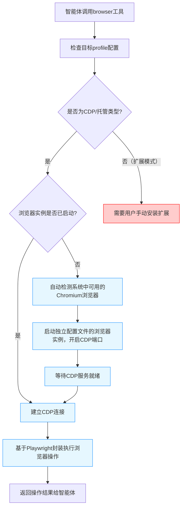

# OpenClaw浏览器操控无插件实现机制分析

## 核心结论
OpenClaw操控浏览器**默认不需要用户手工安装插件**，它采用基于**Chrome DevTools Protocol (CDP)** 的原生浏览器控制机制，自动启动并管理独立的隔离浏览器实例。仅当用户需要操控自己日常使用的现有浏览器标签页时，才需要安装扩展。

---

## 一、无插件模式核心实现机制
### 1. 技术底层
OpenClaw浏览器控制底层完全基于Chrome官方的CDP协议实现，不需要依赖任何第三方扩展或插件，直接与Chromium内核浏览器通信。

### 2. 隔离浏览器实例
OpenClaw自动启动一个**专用、独立的浏览器配置文件**（默认名称为`openclaw`，橙色主题标识），与用户个人浏览器完全隔离：
- 使用独立的用户数据目录，不会触及用户个人浏览器的任何配置、cookie、插件、历史记录
- 自动检测系统中已安装的Chrome/Brave/Edge/Chromium浏览器，无需额外下载
- 启动时自动启用远程调试端口，建立CDP连接通道

### 3. 两种控制模式对比
| 模式 | 是否需要插件 | 适用场景 | 特点 |
|------|-------------|---------|------|
| 托管浏览器模式（默认） | ❌ 不需要 | 大多数自动化场景 | 完全隔离的独立浏览器实例，自动启动，自动管理生命周期 |
| 扩展中继模式 | ✅ 需要 | 需要操控用户现有浏览器标签页、复用已登录会话 | 控制用户手动附加的标签页，不自动附加 |

---

## 二、无插件模式实现流程图


---

## 三、关键代码实现
### 1. 浏览器自动检测与启动
**文件路径**：[src/browser/chrome-launcher.ts](file:///d:/prj/openclaw_analyze/src/browser/chrome-launcher.ts)
```typescript
// 自动检测系统可用浏览器
export async function detectChromeExecutable(): Promise<string | null> {
  const candidates = getPlatformChromeCandidates();
  for (const candidate of candidates) {
    if (await fs.pathExists(candidate)) {
      return candidate;
    }
  }
  return null;
}

// 启动独立配置文件的浏览器
export async function launchChrome(profile: BrowserProfileConfig): Promise<LaunchedChrome> {
  const executablePath = profile.executablePath || await detectChromeExecutable();
  const userDataDir = getProfileUserDataDir(profile.name);
  
  const args = [
    `--user-data-dir=${userDataDir}`,
    `--remote-debugging-port=${profile.cdpPort || 18800}`,
    '--no-first-run',
    '--no-default-browser-check',
    `--profile-name=OpenClaw (${profile.name})`,
  ];
  
  const process = childProcess.spawn(executablePath, args);
  await waitForCDPReady(`http://127.0.0.1:${profile.cdpPort}`);
  
  return { process, cdpUrl: `http://127.0.0.1:${profile.cdpPort}` };
}
```

### 2. CDP连接与会话管理
**文件路径**：[src/browser/pw-session.ts](file:///d:/prj/openclaw_analyze/src/browser/pw-session.ts)
```typescript
// 核心CDP连接逻辑
export class PWSession {
  browser: Browser;
  context: BrowserContext;
  page: Page;

  static async connect(cdpUrl: string): Promise<PWSession> {
    const browser = await chromium.connectOverCDP(cdpUrl);
    const context = browser.contexts()[0];
    const page = context.pages()[0] || await context.newPage();
    return new PWSession(browser, context, page);
  }

  // 执行浏览器操作
  async act(request: ActRequest): Promise<ActResult> {
    // 元素定位、点击、输入等操作实现
    const element = await this.page.$(request.selector);
    switch (request.action) {
      case 'click':
        await element.click();
        break;
      case 'type':
        await element.type(request.text);
        break;
    }
    return { success: true };
  }
}
```

### 3. 浏览器工具入口
**文件路径**：[src/agents/tools/browser-tool.ts](file:///d:/prj/openclaw_analyze/src/agents/tools/browser-tool.ts)
```typescript
// 智能体调用浏览器工具的统一入口
export const browserTool = tool({
  description: '控制浏览器执行网页操作',
  parameters: z.object({
    action: z.enum(['navigate', 'click', 'type', 'snapshot', 'screenshot']),
    url: z.string().optional(),
    selector: z.string().optional(),
    text: z.string().optional(),
  }),
  async execute({ parameters }) {
    // 1. 获取当前profile配置
    const profile = getCurrentBrowserProfile();
    
    // 2. 确保浏览器实例已启动并连接
    const session = await getOrCreateBrowserSession(profile);
    
    // 3. 执行对应操作
    switch (parameters.action) {
      case 'navigate':
        await session.page.goto(parameters.url);
        break;
      case 'click':
        await session.act({ action: 'click', selector: parameters.selector });
        break;
      // 其他操作实现
    }
    
    return { success: true, data: await session.snapshot() };
  }
});
```

### 4. 配置文件管理
**文件路径**：[src/browser/profile-manager.ts](file:///d:/prj/openclaw_analyze/src/browser/profile-manager.ts)
```typescript
// 加载浏览器profile配置
export function loadBrowserProfiles(): Record<string, BrowserProfileConfig> {
  const config = loadOpenClawConfig();
  const defaultProfiles = {
    openclaw: {
      name: 'openclaw',
      cdpPort: 18800,
      color: '#FF4500',
      driver: 'chrome',
    },
    chrome: {
      name: 'chrome',
      driver: 'extension',
      cdpUrl: 'http://127.0.0.1:18792',
    }
  };
  return { ...defaultProfiles, ...config.browser?.profiles };
}
```

---

## 四、核心特性与优势
1. **零配置开箱即用**：首次调用浏览器工具时自动完成浏览器检测、启动、连接全流程，无需用户干预
2. **完全隔离安全**：独立用户数据目录，与用户个人浏览器完全隔离，不会泄露个人隐私
3. **多浏览器兼容**：自动支持Chrome/Brave/Edge/Chromium等所有Chromium内核浏览器
4. **多Profile支持**：可创建多个独立的浏览器配置文件，用于不同场景隔离
5. **原生性能**：基于CDP协议直接通信，性能远高于扩展中继模式
6. **生命周期自动管理**：会话结束后可自动关闭浏览器实例，不占用系统资源

---

## 五、扩展模式（需要插件的场景）
仅当你需要控制自己日常使用的现有浏览器标签页时，才需要安装扩展：
```bash
# 安装扩展到本地目录
openclaw browser extension install
# 获取扩展目录路径
openclaw browser extension path
```
然后在Chrome扩展管理页面（`chrome://extensions`）开启开发者模式，加载上述目录即可。
