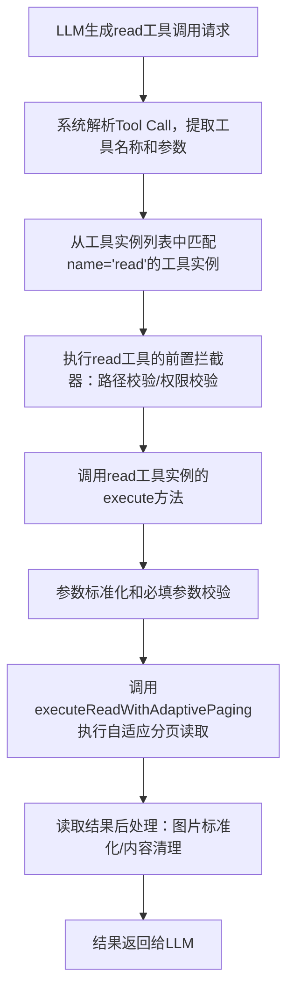

# Read工具调用执行链路详细分析

## 一、完整执行流程图


---

## 二、分阶段执行详情

### 阶段1：LLM生成Tool Call
LLM根据系统提示词中的工具描述，生成符合格式的read工具调用：
```json
{
  "name": "read",
  "arguments": {
    "path": "src/agents/tool-catalog.ts",
    "offset": 1
  }
}
```

---

### 阶段2：系统解析Tool Call并匹配工具实例
**关键文件**：[src/agents/pi-embedded-runner/run/attempt.ts](file:///d:/prj/openclaw_analyze/src/agents/pi-embedded-runner/run/attempt.ts)
**核心逻辑**：
```typescript
// 解析LLM输出中的工具调用
const toolCalls = parseToolCalls(llmResponse.content);

for (const toolCall of toolCalls) {
  // 从已注册的工具实例中匹配对应名称的工具
  const tool = availableTools.get(toolCall.function.name);
  if (!tool) {
    throw new Error(`Tool ${toolCall.function.name} not found`);
  }
  
  // 执行工具
  const result = await tool.execute(
    toolCall.id,
    toolCall.function.arguments,
    abortSignal
  );
  
  // 结果加入上下文
  messages.push({
    role: "tool",
    tool_call_id: toolCall.id,
    content: result.content
  });
}
```
**工具实例来源**：可用工具列表在会话初始化时通过`createOpenClawCodingTools()`创建并缓存。

---

### 阶段3：前置拦截器（路径安全校验）
在调用read工具的`execute`方法前，会先经过路径安全拦截器，确保读取的路径在工作区范围内：
**关键文件**：[src/agents/pi-tools.read.ts](file:///d:/prj/openclaw_analyze/src/agents/pi-tools.read.ts#L772-L811)
**核心代码**：
```typescript
export function wrapToolWorkspaceRootGuardWithOptions(
  tool: AnyAgentTool,
  root: string,
  options?: { containerWorkdir?: string },
): AnyAgentTool {
  return {
    ...tool,
    execute: async (toolCallId, args, signal, onUpdate) => {
      const normalized = normalizeToolParams(args);
      const record = normalized ?? (args && typeof args === "object" ? args : undefined);
      const filePath = record?.path;
      
      // 路径安全校验
      if (typeof filePath === "string" && filePath.trim()) {
        const sandboxPath = mapContainerPathToWorkspaceRoot({
          filePath,
          root,
          containerWorkdir: options?.containerWorkdir,
        });
        await assertSandboxPath({ filePath: sandboxPath, cwd: root, root });
      }
      
      // 校验通过后，调用实际的工具execute方法
      return tool.execute(toolCallId, normalized ?? args, signal, onUpdate);
    },
  };
}
```

---

### 阶段4：调用read工具的execute方法
read工具的`execute`方法在创建工具实例时定义：
**关键文件**：[src/agents/pi-tools.read.ts](file:///d:/prj/openclaw_analyze/src/agents/pi-tools.read.ts#L860-L930)
**核心代码**：
```typescript
export function createOpenClawReadTool(
  base: AnyAgentTool,
  options?: OpenClawReadToolOptions,
): AnyAgentTool {
  const patched = patchToolSchemaForClaudeCompatibility(base);
  return {
    ...patched,
    execute: async (toolCallId, params, signal) => {
      // 参数标准化
      const normalized = normalizeToolParams(params);
      const record = normalized ?? (params && typeof params === "object" ? params : undefined);
      
      // 校验必填参数（path）
      assertRequiredParams(record, CLAUDE_PARAM_GROUPS.read, base.name);
      
      // ✅ 这里调用executeReadWithAdaptivePaging执行实际的读取逻辑
      const result = await executeReadWithAdaptivePaging({
        base,
        toolCallId,
        args: normalized ?? params,
        signal,
        maxBytes: resolveAdaptiveReadMaxBytes(options), // 计算最大读取字节数
      });
      
      // 读取结果后处理
      const filePath = typeof record?.path === "string" ? record.path : "";
      const withNormalizedImages = await normalizeReadImageResult(result, filePath); // 图片MIME校正
      const stripped = stripReadTruncationContentDetails(withNormalizedImages); // 清理截断详情
      return sanitizeToolResultImages(stripped, options?.imageSanitization); // 图片大小清理
    },
  };
}
```

---

### 阶段5：进入executeReadWithAdaptivePaging执行分页读取
参数传递到`executeReadWithAdaptivePaging`后，执行自适应分页逻辑：
**关键文件**：[src/agents/pi-tools.read.ts](file:///d:/prj/openclaw_analyze/src/agents/pi-tools.read.ts#L277-L378)
**入口参数说明**：
```typescript
const result = await executeReadWithAdaptivePaging({
  base: base, // 上游基础read工具实例（来自@mariozechner/pi-coding-agent）
  toolCallId: toolCallId, // 工具调用ID
  args: normalized ?? params, // 标准化后的参数（path/offset/limit）
  signal: signal, // 中止信号
  maxBytes: resolveAdaptiveReadMaxBytes(options), // 根据模型上下文窗口计算的最大读取字节数
});
```

---

## 三、完整调用栈
```
parseToolCalls(llmResponse) 
  → wrapToolWorkspaceRootGuardWithOptions() [路径校验]
    → createOpenClawReadTool().execute() [read工具执行入口]
      → executeReadWithAdaptivePaging() [自适应分页读取]
        → base.execute() [上游基础read工具单次读取]
      → normalizeReadImageResult() [图片校正]
      → stripReadTruncationContentDetails() [内容清理]
      → sanitizeToolResultImages() [图片清理]
  → 结果加入会话上下文
```

## 四、关键代码跳转链接
1. 工具调用解析与执行入口：[attempt.ts](file:///d:/prj/openclaw_analyze/src/agents/pi-embedded-runner/run/attempt.ts)
2. 路径安全拦截器：[pi-tools.read.ts#L772-L811](file:///d:/prj/openclaw_analyze/src/agents/pi-tools.read.ts#L772-L811)
3. read工具execute方法定义：[pi-tools.read.ts#L860-L930](file:///d:/prj/openclaw_analyze/src/agents/pi-tools.read.ts#L860-L930)
4. executeReadWithAdaptivePaging实现：[pi-tools.read.ts#L277-L378](file:///d:/prj/openclaw_analyze/src/agents/pi-tools.read.ts#L277-L378)
