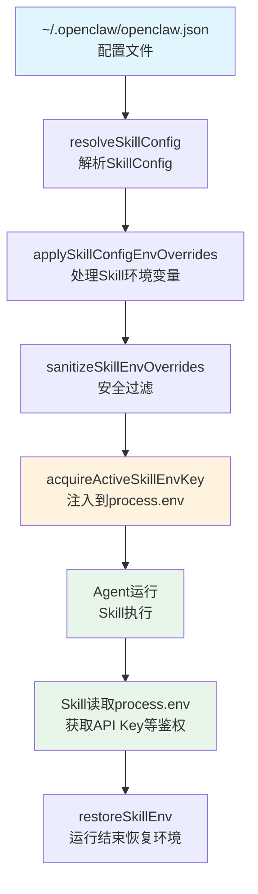

# OpenClaw Skill/Tool 鉴权信息注入机制分析

## 概述

OpenClaw中Skill和Tool的鉴权信息通过**环境变量注入**机制实现。配置存储在`~/.openclaw/openclaw.json`，在Agent运行时通过`applySkillEnvOverrides`函数将鉴权信息注入到`process.env`中，供Skill读取使用。

---

## 核心架构流程图



---

## 关键类和代码片段

### 1. SkillConfig 类型定义

**文件**：[config/types.skills.ts](file:///d:/prj/openclaw_analyze/src/config/types.skills.ts#L3-L8)

```typescript
export type SkillConfig = {
  enabled?: boolean;
  apiKey?: SecretInput;    // API密钥（敏感信息）
  env?: Record<string, string>;  // 环境变量映射
  config?: Record<string, unknown>;
};
```

**配置文件示例**（`~/.openclaw/openclaw.json`）：

```json
{
  "skills": {
    "entries": {
      "my-skill": {
        "enabled": true,
        "apiKey": "sk-xxxxx",  // 或使用引用：$ secrets.myKey
        "env": {
          "CUSTOM_ENV": "value"
        }
      }
    }
  }
}
```

---

### 2. 环境变量覆盖核心函数

**文件**：[agents/skills/env-overrides.ts](file:///d:/prj/openclaw_analyze/src/agents/skills/env-overrides.ts)

#### 2.1 applySkillEnvOverrides - 主入口

```typescript
/**
 * 应用Skill定义的环境变量覆盖
 *
 * @param params.skills - Skill条目列表
 * @param params.config - OpenClaw配置
 * @returns 恢复函数，用于运行结束后还原环境变量
 */
export function applySkillEnvOverrides(params: {
  skills: SkillEntry[];
  config?: OpenClawConfig
}) {
  const { skills, config } = params;
  const updates: EnvUpdate[] = [];

  for (const entry of skills) {
    // 解析Skill键名
    const skillKey = resolveSkillKey(entry.skill, entry);
    // 获取Skill配置
    const skillConfig = resolveSkillConfig(config, skillKey);
    if (!skillConfig) {
      continue;
    }

    // 应用该Skill的环境变量覆盖
    applySkillConfigEnvOverrides({
      updates,
      skillConfig,
      primaryEnv: entry.metadata?.primaryEnv,      // 主环境变量名（如OPENAI_API_KEY）
      requiredEnv: entry.metadata?.requires?.env,  // 必需的环境变量列表
      skillKey,
    });
  }

  // 返回环境恢复函数
  return createEnvReverter(updates);
}
```

#### 2.2 applySkillConfigEnvOverrides - 单个Skill处理

```typescript
function applySkillConfigEnvOverrides(params: {
  updates: EnvUpdate[];
  skillConfig: SkillConfig;
  primaryEnv?: string | null;    // 主环境变量名
  requiredEnv?: string[] | null; // 必需的环境变量
  skillKey: string;
}) {
  const { updates, skillConfig, primaryEnv, requiredEnv, skillKey } = params;
  const allowedSensitiveKeys = new Set<string>();

  // 1. 收集允许访问的敏感键
  const normalizedPrimaryEnv = primaryEnv?.trim();
  if (normalizedPrimaryEnv) {
    allowedSensitiveKeys.add(normalizedPrimaryEnv);
  }
  for (const envName of requiredEnv ?? []) {
    allowedSensitiveKeys.add(envName.trim());
  }

  const pendingOverrides: Record<string, string> = {};

  // 2. 处理skillConfig.env中的环境变量
  if (skillConfig.env) {
    for (const [rawKey, envValue] of Object.entries(skillConfig.env)) {
      const envKey = rawKey.trim();
      const hasExternallyManagedValue =
        process.env[envKey] !== undefined && !activeSkillEnvEntries.has(envKey);
      // 跳过无效或已被外部管理的变量
      if (!envKey || !envValue || hasExternallyManagedValue) {
        continue;
      }
      pendingOverrides[envKey] = envValue;
    }
  }

  // 3. 处理apiKey -> primaryEnv的映射
  // 如果配置了apiKey且有primaryEnv，将其注入到primaryEnv
  const resolvedApiKey = normalizeResolvedSecretInputString({
    value: skillConfig.apiKey,
    path: `skills.entries.${skillKey}.apiKey`,
  }) ?? "";

  const canInjectPrimaryEnv =
    normalizedPrimaryEnv &&
    (process.env[normalizedPrimaryEnv] === undefined ||
      activeSkillEnvEntries.has(normalizedPrimaryEnv));

  if (canInjectPrimaryEnv && resolvedApiKey) {
    if (!pendingOverrides[normalizedPrimaryEnv]) {
      pendingOverrides[normalizedPrimaryEnv] = resolvedApiKey;
    }
  }

  // 4. 安全过滤
  const sanitized = sanitizeSkillEnvOverrides({
    overrides: pendingOverrides,
    allowedSensitiveKeys,
  });

  // 5. 注入环境变量
  for (const [envKey, envValue] of Object.entries(sanitized.allowed)) {
    if (!acquireActiveSkillEnvKey(envKey, envValue)) {
      continue;
    }
    updates.push({ key: envKey });
    process.env[envKey] = activeSkillEnvEntries.get(envKey)?.value ?? envValue;
  }
}
```

#### 2.3 acquireActiveSkillEnvKey - 环境变量注入

```typescript
// 追踪当前由skill注入的环境变量
const activeSkillEnvEntries = new Map<string, ActiveSkillEnvEntry>();

function acquireActiveSkillEnvKey(key: string, value: string): boolean {
  const active = activeSkillEnvEntries.get(key);

  if (active) {
    // 已被注入，增加引用计数
    active.count += 1;
    if (process.env[key] === undefined) {
      process.env[key] = active.value;
    }
    return true;
  }

  // 检查是否已被外部设置（而非skill注入）
  if (process.env[key] !== undefined) {
    return false;  // 不覆盖外部已设置的值
  }

  // 记录新的注入
  activeSkillEnvEntries.set(key, {
    baseline: process.env[key],  // 保存原始值（可能是undefined）
    value,
    count: 1,
  });

  return true;
}
```

---

### 3. Agent运行中的应用时机

**文件**：[agents/pi-embedded-runner/run/attempt.ts](file:///d:/prj/openclaw_analyze/src/agents/pi-embedded-runner/run/attempt.ts#L1760-L1800)

```typescript
// 在Agent执行主循环中
async function runAgent(params: RunParams) {
  // ... 工作区解析 ...

  // 解析当前运行可用的Skill列表
  const { shouldLoadSkillEntries, skillEntries } = resolveEmbeddedRunSkillEntries({
    workspaceDir: effectiveWorkspace,
    config: params.config,
    skillsSnapshot: params.skillsSnapshot,
  });

  // 应用Skill定义的环境变量覆盖
  // 如果有Skill快照（如子Agent继承父Agent的Skill）则从快照加载
  restoreSkillEnv = params.skillsSnapshot
    ? applySkillEnvOverridesFromSnapshot({
        snapshot: params.skillsSnapshot,
        config: params.config,
      })
    : applySkillEnvOverrides({
        skills: skillEntries ?? [],
        config: params.config,
      });

  // 构建Skill使用提示
  const skillsPrompt = resolveSkillsPromptForRun({
    skillsSnapshot: params.skillsSnapshot,
    entries: shouldLoadSkillEntries ? skillEntries : undefined,
    config: params.config,
    workspaceDir: effectiveWorkspace,
  });

  try {
    // Agent执行主循环...
    await runCoreLoop();

  } finally {
    // 运行结束后恢复环境变量
    restoreSkillEnv?.();
  }
}
```

---

### 4. Tool执行流程

Tool的执行不直接涉及鉴权注入，但通过**Tool包装器**机制在执行前后进行拦截和处理。

**文件**：[agents/pi-tools.before-tool-call.ts](file:///d:/prj/openclaw_analyze/src/agents/pi-tools.before-tool-call.ts)

```typescript
/**
 * Tool执行前置钩子
 * 包装Tool的execute方法，在执行前运行before_tool_call钩子
 */
export function wrapToolWithBeforeToolCallHook(
  tool: AnyAgentTool,
  ctx?: HookContext,
): AnyAgentTool {
  const execute = tool.execute;

  return {
    ...tool,
    execute: async (toolCallId, params, stream, extCtx) => {
      // 1. 运行before_tool_call钩子
      const hookResult = await runBeforeToolCallHook({
        toolName: tool.name,
        params,
        toolCallId,
        ctx,
      });

      // 2. 如果被阻止，直接返回阻止原因
      if (hookResult.blocked) {
        return {
          content: [],
          error: hookResult.reason,
        };
      }

      // 3. 使用钩子可能修改过的参数执行Tool
      return execute(toolCallId, hookResult.params, stream, extCtx);
    },
  };
}
```

---

## 关键概念解释

### 1. SkillEntry

Skill在Agent配置中的声明，包含Skill的来源和元数据：

```typescript
interface SkillEntry {
  skill: {
    source: string;  // 来源：workspace、bundled、managed等
    name: string;    // Skill名称
  };
  metadata?: {
    primaryEnv?: string;   // API Key对应的主环境变量名
    requires?: {
      env?: string[];      // 必需的环境变量
    };
  };
}
```

### 2. primaryEnv机制

`primaryEnv`是Skill的API Key对应的环境变量名。例如：

```json
{
  "skills": {
    "entries": {
      "openai": {
        "apiKey": "sk-xxx",
        "primaryEnv": "OPENAI_API_KEY"
      }
    }
  }
}
```

执行后，`process.env.OPENAI_API_KEY`会被设置为`sk-xxx`。

### 3. 环境变量安全过滤

`sanitizeSkillEnvOverrides`函数会：
- 阻止危险的主机环境变量（如`OPENSSL_CONF`）
- 过滤包含空字节的值
- 验证敏感变量值的合法性

---

## 总结

| 阶段 | 组件 | 说明 |
|------|------|------|
| **配置** | `~/.openclaw/openclaw.json` | 存储`skills.entries[].apiKey`和`env` |
| **解析** | `resolveSkillConfig()` | 从配置中读取特定Skill的配置 |
| **注入** | `applySkillEnvOverrides()` | 将apiKey和env注入到`process.env` |
| **执行** | Agent/Skill运行 | Skill通过`process.env`获取鉴权信息 |
| **恢复** | `restoreSkillEnv()` | 运行结束后还原环境变量 |

### 核心流程

```
配置文件 → resolveSkillConfig → applySkillConfigEnvOverrides
                                            ↓
                                    sanitizeSkillEnvOverrides
                                            ↓
                                    acquireActiveSkillEnvKey
                                            ↓
                                    process.env[key] = value
                                            ↓
                                      Skill执行并读取
                                            ↓
                                    restoreSkillEnv 还原
```
